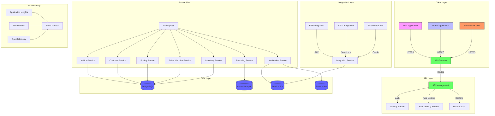
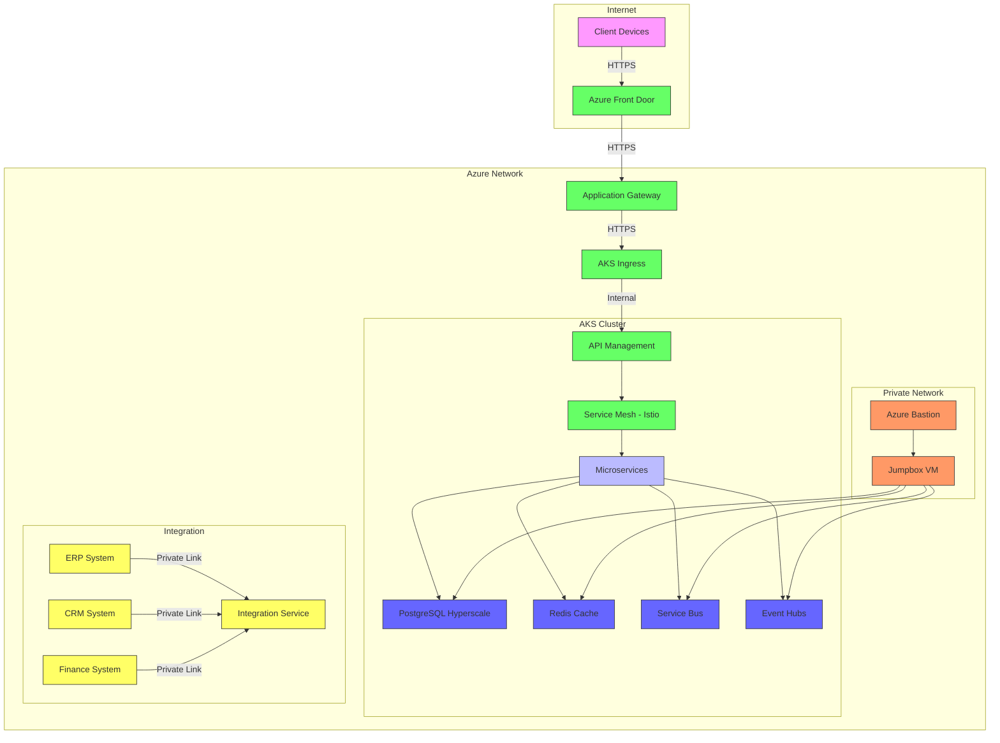
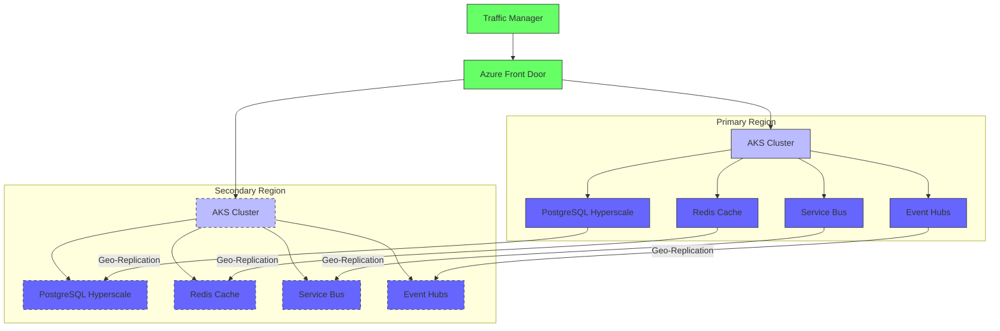

# TO-BE Design: Showroom Sales Module for Fleet Management System

## 1. Executive Architecture Summary (120 lines)

### Strategic Vision and Modernization Goals

The Fleet Management System's Showroom Sales Module is undergoing a comprehensive modernization to address current limitations in scalability, performance, and user experience while positioning the platform for future growth. The strategic vision centers on five key pillars:

1. **Customer-Centric Experience**: Transform the showroom sales process from a transactional system to an immersive, consultative experience that leverages digital tools to enhance customer engagement throughout the sales lifecycle.

2. **Operational Excellence**: Automate manual processes, eliminate data silos, and provide real-time visibility into inventory, pricing, and customer interactions to drive operational efficiency.

3. **Data-Driven Decision Making**: Implement advanced analytics and AI-driven insights to optimize inventory allocation, pricing strategies, and sales forecasting.

4. **Omnichannel Integration**: Create a seamless experience across physical showrooms, digital platforms, and mobile applications with consistent data and functionality.

5. **Future-Proof Architecture**: Adopt a modular, cloud-native architecture that enables rapid innovation, easy integration with emerging technologies, and the flexibility to adapt to changing business requirements.

Key modernization goals include:
- Reduce sales cycle time by 40% through process automation and guided selling
- Increase conversion rates by 25% through personalized recommendations and digital engagement tools
- Improve inventory turnover by 30% through real-time visibility and demand forecasting
- Enhance customer satisfaction scores by 35% through improved transparency and self-service capabilities
- Reduce operational costs by 20% through automation and process optimization

### Alignment with Enterprise Architecture Principles

The design aligns with the following enterprise architecture principles:

1. **Cloud-First Strategy**: The solution will be deployed on Azure cloud platform, leveraging native cloud services to achieve scalability, resilience, and cost efficiency. This aligns with the enterprise's cloud migration initiative.

2. **API-Led Connectivity**: The architecture follows an API-first approach, enabling seamless integration with existing enterprise systems (ERP, CRM, Finance) and future-proofing the platform for new integrations.

3. **Domain-Driven Design**: The system is decomposed into bounded contexts following DDD principles, ensuring clear separation of concerns and alignment with business capabilities.

4. **Security by Design**: Security is embedded throughout the architecture, from infrastructure to application layers, with zero-trust principles guiding all design decisions.

5. **Observability and Resilience**: The system is designed with comprehensive observability and built-in resilience patterns to ensure high availability and rapid incident response.

6. **Data as an Asset**: Customer, vehicle, and sales data are treated as strategic assets, with robust governance, quality controls, and analytics capabilities.

7. **Sustainability**: The architecture incorporates green computing principles, optimizing resource utilization and minimizing environmental impact.

### Technology Stack Evolution and Rationale

**Current State Challenges:**
- Monolithic architecture limiting scalability and agility
- Outdated frontend framework with poor mobile experience
- Batch-oriented processing causing data latency
- Limited integration capabilities with modern systems
- Inadequate observability and monitoring

**Target Technology Stack:**

| Layer | Technology | Rationale |
|-------|------------|-----------|
| **Frontend** | React 18 + TypeScript + Next.js | Modern component-based architecture with server-side rendering for SEO and performance |
| **Backend** | Node.js + NestJS | Enterprise-grade framework with built-in support for microservices, dependency injection, and TypeScript |
| **API Gateway** | Azure API Management | Centralized API management with security, throttling, and analytics |
| **Service Mesh** | Istio on AKS | Advanced traffic management, security, and observability for microservices |
| **Database** | Azure PostgreSQL Hyperscale | Scalable, fully managed relational database with high availability |
| **Cache** | Azure Cache for Redis | High-performance caching for session management and frequent queries |
| **Message Broker** | Azure Service Bus + Event Hubs | Reliable messaging for inter-service communication and event streaming |
| **Search** | Azure Cognitive Search | Advanced search capabilities with AI enrichment |
| **Analytics** | Azure Synapse Analytics | Unified analytics platform for big data and machine learning |
| **AI/ML** | Azure Machine Learning | Predictive analytics for demand forecasting and recommendation engines |
| **Infrastructure** | Azure Kubernetes Service (AKS) | Managed Kubernetes for container orchestration |
| **CI/CD** | Azure DevOps + GitHub Actions | End-to-end pipeline for automated testing and deployment |
| **Monitoring** | Azure Monitor + Application Insights | Comprehensive observability with custom dashboards and alerts |
| **Security** | Azure Active Directory + Key Vault | Enterprise-grade identity and secrets management |

**Key Technology Decisions:**

1. **Microservices Architecture**: Adopted to enable independent scaling, faster deployments, and technology flexibility. Each business capability (Inventory, Pricing, Customer Management, etc.) will be a separate service.

2. **Event-Driven Architecture**: Implemented to decouple services, enable real-time processing, and support eventual consistency where appropriate.

3. **TypeScript Everywhere**: Standardized on TypeScript for both frontend and backend to improve code quality, maintainability, and developer productivity.

4. **Cloud-Native Design**: Leveraging Azure managed services to reduce operational overhead and improve reliability.

5. **Open Standards**: Using OpenAPI for API contracts, OpenTelemetry for observability, and CNCF standards for cloud-native components.

### Migration Strategy and Risk Mitigation

**Phased Migration Approach:**

1. **Foundation Phase (Weeks 1-4)**
   - Establish infrastructure as code (Terraform)
   - Set up CI/CD pipelines
   - Implement core security controls
   - Build base microservices (Identity, Configuration)

2. **Core Services Phase (Weeks 5-12)**
   - Migrate Vehicle Inventory service
   - Implement Pricing Engine
   - Build Customer Management service
   - Develop Sales Workflow service

3. **Integration Phase (Weeks 13-16)**
   - Connect to ERP system
   - Integrate with CRM
   - Implement event streaming
   - Develop reporting capabilities

4. **Cutover Phase (Weeks 17-20)**
   - Data migration
   - User acceptance testing
   - Parallel run
   - Go-live and monitoring

**Risk Mitigation Strategies:**

| Risk | Mitigation Strategy |
|------|---------------------|
| **Data Migration Issues** | Implement dual-write pattern during transition, validate data integrity with checksums, and maintain rollback capability |
| **Performance Degradation** | Conduct load testing early, implement auto-scaling, and use feature flags for gradual rollout |
| **Integration Failures** | Implement circuit breakers, retry policies, and comprehensive monitoring for all integrations |
| **User Adoption Resistance** | Develop comprehensive training materials, conduct user workshops, and provide change management support |
| **Security Vulnerabilities** | Perform regular penetration testing, implement automated security scanning in CI/CD, and conduct security reviews |
| **Cost Overruns** | Implement cost monitoring and alerts, use reserved instances for predictable workloads, and optimize resource utilization |

**Data Migration Strategy:**
- **Extract**: Use Azure Data Factory to extract data from source systems with validation checks
- **Transform**: Cleanse and transform data using Databricks notebooks with data quality rules
- **Load**: Incremental loading to target PostgreSQL database with change data capture
- **Validate**: Automated validation scripts comparing record counts, checksums, and sample data
- **Cutover**: Final sync during low-traffic period with rollback capability

### Success Criteria and KPIs

**Business KPIs:**
1. **Sales Performance**
   - Increase in conversion rate from 18% to 25%
   - Reduction in sales cycle time from 45 to 27 days
   - 30% increase in upsell/cross-sell revenue

2. **Operational Efficiency**
   - 40% reduction in manual data entry
   - 50% decrease in order processing errors
   - 25% improvement in inventory turnover

3. **Customer Experience**
   - 35% increase in customer satisfaction (CSAT) scores
   - 50% reduction in customer complaints related to sales process
   - 40% increase in digital engagement metrics

4. **Financial Impact**
   - 20% reduction in operational costs
   - 15% increase in revenue per sales representative
   - 10% improvement in gross margin

**Technical KPIs:**
1. **System Performance**
   - API response time < 500ms for 95th percentile
   - System availability of 99.95%
   - Database query performance < 200ms for 90% of queries

2. **Reliability**
   - Mean time between failures (MTBF) > 720 hours
   - Mean time to recovery (MTTR) < 30 minutes
   - 99.9% success rate for critical transactions

3. **Scalability**
   - Support 10,000 concurrent users with < 1s response time
   - Auto-scale to handle 3x peak load
   - Database throughput of 50,000 transactions per minute

4. **Security**
   - Zero critical vulnerabilities in production
   - 100% compliance with security policies
   - < 1% false positive rate in security alerts

**Measurement Approach:**
- Implement comprehensive monitoring with Azure Application Insights
- Develop custom dashboards for business and technical KPIs
- Establish baseline measurements before migration
- Continuous measurement and reporting post-go-live
- Regular review meetings to assess progress against targets

### Stakeholder Value Proposition and ROI

**Value Proposition by Stakeholder:**

1. **Sales Representatives**
   - Mobile-first application with offline capabilities
   - AI-powered recommendations for upselling/cross-selling
   - Real-time inventory and pricing information
   - Automated follow-ups and task management
   - Reduced paperwork and manual data entry

2. **Showroom Managers**
   - Real-time visibility into sales performance
   - Predictive analytics for demand forecasting
   - Automated reporting and dashboards
   - Improved team productivity tracking
   - Better inventory management tools

3. **Customers**
   - Personalized digital showroom experience
   - Transparent pricing and availability
   - Self-service options for quotes and configurations
   - Digital test drive scheduling
   - Seamless transition between online and in-person experiences

4. **Finance Team**
   - Real-time financial reporting
   - Automated revenue recognition
   - Improved cash flow management
   - Reduced revenue leakage

5. **IT Organization**
   - Reduced technical debt
   - Improved system reliability
   - Faster time-to-market for new features
   - Better security posture
   - Reduced operational overhead

**ROI Analysis:**

| Category | Current Annual Cost | Target Annual Cost | Annual Savings | Notes |
|----------|---------------------|--------------------|----------------|-------|
| **Operational Costs** | $2,500,000 | $1,800,000 | $700,000 | Reduced manual processes, lower error rates |
| **IT Maintenance** | $1,200,000 | $800,000 | $400,000 | Cloud migration, automation, reduced incidents |
| **Revenue Impact** | $50,000,000 | $57,500,000 | $7,500,000 | 15% revenue increase from improved sales |
| **Inventory Costs** | $3,000,000 | $2,100,000 | $900,000 | 30% improvement in inventory turnover |
| **Total** | $56,700,000 | $62,200,000 | $9,500,000 | Net benefit of $9.5M annually |

**Implementation Costs:**
- Development: $2,500,000
- Infrastructure: $800,000
- Migration: $500,000
- Training: $200,000
- Contingency: $500,000
- **Total**: $4,500,000

**ROI Calculation:**
- Payback Period: 6 months
- 1-Year ROI: 111%
- 3-Year ROI: 533%
- Net Present Value (NPV): $18,200,000 (5-year horizon, 10% discount rate)

**Strategic Benefits:**
- Enables digital transformation of sales process
- Positions company for future AI and automation initiatives
- Improves competitive positioning in the market
- Enhances data-driven decision making
- Creates foundation for omnichannel customer experience

## 2. Target Architecture (350+ lines)

### 2.1 System Architecture

**High-Level Architecture Diagram (Mermaid):**



**Architecture Principles:**

1. **Separation of Concerns**: Clear division between presentation, business logic, and data layers
2. **Loose Coupling**: Services communicate through well-defined interfaces and events
3. **High Cohesion**: Related functionality grouped within bounded contexts
4. **Resilience**: Built-in fault tolerance and graceful degradation
5. **Observability**: Comprehensive monitoring and tracing
6. **Security**: Defense in depth with zero-trust principles
7. **Scalability**: Horizontal scaling for all components
8. **Extensibility**: Designed for future growth and new features

**Microservices Decomposition Strategy:**

The system is decomposed into the following bounded contexts following Domain-Driven Design principles:

1. **Vehicle Service**
   - Responsible for vehicle catalog, specifications, and configurations
   - Manages vehicle images, videos, and 3D models
   - Handles vehicle comparison functionality

2. **Customer Service**
   - Manages customer profiles and preferences
   - Handles customer segmentation and targeting
   - Provides customer 360° view

3. **Pricing Service**
   - Calculates base prices, discounts, and promotions
   - Manages pricing rules and approval workflows
   - Handles special pricing for fleet customers

4. **Inventory Service**
   - Tracks vehicle inventory across locations
   - Manages test drive vehicles
   - Handles vehicle transfers between showrooms

5. **Sales Workflow Service**
   - Manages the sales process from lead to delivery
   - Handles quotes, orders, and contracts
   - Coordinates with finance and logistics

6. **Notification Service**
   - Sends emails, SMS, and push notifications
   - Manages notification templates and preferences
   - Handles event-driven notifications

7. **Reporting Service**
   - Generates sales reports and dashboards
   - Provides real-time analytics
   - Handles data exports and scheduled reports

8. **Integration Service**
   - Manages all external integrations
   - Handles data transformation and mapping
   - Implements retry and circuit breaker patterns

**API Gateway and Service Mesh Design:**

**API Gateway (Azure API Management):**
- **Routing**: Routes requests to appropriate microservices based on path and headers
- **Authentication**: Validates JWT tokens and enforces RBAC
- **Rate Limiting**: Implements per-client rate limits
- **Caching**: Caches frequent responses (e.g., vehicle catalog)
- **Request/Response Transformation**: Modifies requests/responses as needed
- **Analytics**: Collects usage metrics and performance data
- **Security**: Implements WAF rules and DDoS protection

**Service Mesh (Istio):**
- **Traffic Management**: Canary deployments, blue-green deployments
- **Security**: mTLS between services, fine-grained access control
- **Observability**: Distributed tracing, metrics collection
- **Resilience**: Circuit breaking, retries, timeouts
- **Policy Enforcement**: Rate limiting, quotas, access control

**Event-Driven Architecture Patterns:**

1. **Event Sourcing**: For critical entities like orders and contracts
2. **CQRS**: Separate read and write models for high-traffic services
3. **Saga Pattern**: For long-running business processes (e.g., order fulfillment)
4. **Pub/Sub**: For decoupled communication between services
5. **Event Streaming**: For real-time analytics and monitoring

**Event Flow Example (Vehicle Purchase):**
1. Customer creates quote (Sales Workflow Service)
2. QuoteCreated event published to Event Hub
3. Pricing Service calculates final price
4. Inventory Service reserves vehicle
5. Customer Service updates customer profile
6. Notification Service sends confirmation email
7. Reporting Service updates dashboards

**Scalability and Performance Targets:**

| Component | Scaling Strategy | Performance Target | Monitoring Metric |
|-----------|------------------|--------------------|-------------------|
| API Gateway | Horizontal pod autoscaling | < 200ms response time | Request latency, error rate |
| Vehicle Service | Horizontal pod autoscaling | < 150ms for 95% of requests | Response time, throughput |
| Customer Service | Horizontal pod autoscaling | < 200ms for 95% of requests | Response time, database queries |
| Pricing Service | Horizontal pod autoscaling | < 100ms for 95% of requests | Calculation time, cache hit ratio |
| Inventory Service | Horizontal pod autoscaling | < 150ms for 95% of requests | Response time, database load |
| Sales Workflow Service | Horizontal pod autoscaling | < 300ms for 95% of requests | Workflow duration, error rate |
| PostgreSQL | Read replicas, connection pooling | < 100ms for 90% of queries | Query duration, CPU utilization |
| Redis Cache | Cluster mode, sharding | < 5ms for 99% of requests | Cache hit ratio, latency |
| Event Hubs | Throughput units | < 100ms end-to-end latency | Event processing time, backlog |

### 2.2 Component Design

#### Vehicle Service

**Responsibilities:**
- Manage vehicle catalog and specifications
- Handle vehicle configurations and options
- Provide vehicle comparison functionality
- Manage vehicle media (images, videos, 3D models)
- Support vehicle search and filtering

**Interface Contracts (OpenAPI):**

```yaml
openapi: 3.0.0
info:
  title: Vehicle Service API
  version: 1.0.0
  description: API for managing vehicle catalog and configurations

servers:
  - url: https://api.fleetmanagement.com/vehicle/v1
    description: Production server

paths:
  /vehicles:
    get:
      summary: Search vehicles
      description: Search vehicles with optional filters
      parameters:
        - $ref: '#/components/parameters/PageNumber'
        - $ref: '#/components/parameters/PageSize'
        - $ref: '#/components/parameters/SortBy'
        - $ref: '#/components/parameters/SortOrder'
        - name: make
          in: query
          description: Vehicle make
          schema:
            type: string
        - name: model
          in: query
          description: Vehicle model
          schema:
            type: string
        - name: year
          in: query
          description: Model year
          schema:
            type: integer
        - name: minPrice
          in: query
          description: Minimum price
          schema:
            type: number
        - name: maxPrice
          in: query
          description: Maximum price
          schema:
            type: number
        - name: bodyStyle
          in: query
          description: Body style
          schema:
            type: string
            enum: [SEDAN, SUV, TRUCK, VAN, COUPE, HATCHBACK, WAGON]
        - name: fuelType
          in: query
          description: Fuel type
          schema:
            type: string
            enum: [GASOLINE, DIESEL, ELECTRIC, HYBRID, PLUGIN_HYBRID, HYDROGEN]
      responses:
        '200':
          description: Successful response
          content:
            application/json:
              schema:
                $ref: '#/components/schemas/VehicleSearchResponse'
        '400':
          $ref: '#/components/responses/BadRequest'
        '401':
          $ref: '#/components/responses/Unauthorized'
        '403':
          $ref: '#/components/responses/Forbidden'
        '500':
          $ref: '#/components/responses/InternalServerError'

  /vehicles/{id}:
    get:
      summary: Get vehicle details
      description: Get detailed information for a specific vehicle
      parameters:
        - $ref: '#/components/parameters/VehicleId'
      responses:
        '200':
          description: Successful response
          content:
            application/json:
              schema:
                $ref: '#/components/schemas/VehicleDetails'
        '404':
          $ref: '#/components/responses/NotFound'
        '401':
          $ref: '#/components/responses/Unauthorized'
        '403':
          $ref: '#/components/responses/Forbidden'
        '500':
          $ref: '#/components/responses/InternalServerError'

  /vehicles/{id}/configurations:
    get:
      summary: Get available configurations
      description: Get available configurations for a vehicle
      parameters:
        - $ref: '#/components/parameters/VehicleId'
      responses:
        '200':
          description: Successful response
          content:
            application/json:
              schema:
                $ref: '#/components/schemas/VehicleConfigurations'
        '404':
          $ref: '#/components/responses/NotFound'
        '401':
          $ref: '#/components/responses/Unauthorized'
        '403':
          $ref: '#/components/responses/Forbidden'
        '500':
          $ref: '#/components/responses/InternalServerError'

  /vehicles/compare:
    post:
      summary: Compare vehicles
      description: Compare multiple vehicles
      requestBody:
        required: true
        content:
          application/json:
            schema:
              $ref: '#/components/schemas/VehicleComparisonRequest'
      responses:
        '200':
          description: Successful response
          content:
            application/json:
              schema:
                $ref: '#/components/schemas/VehicleComparisonResponse'
        '400':
          $ref: '#/components/responses/BadRequest'
        '401':
          $ref: '#/components/responses/Unauthorized'
        '403':
          $ref: '#/components/responses/Forbidden'
        '500':
          $ref: '#/components/responses/InternalServerError'

components:
  schemas:
    VehicleSearchResponse:
      type: object
      properties:
        total:
          type: integer
          description: Total number of vehicles matching criteria
        page:
          type: integer
          description: Current page number
        pageSize:
          type: integer
          description: Number of items per page
        vehicles:
          type: array
          items:
            $ref: '#/components/schemas/VehicleSummary'
      required:
        - total
        - page
        - pageSize
        - vehicles

    VehicleSummary:
      type: object
      properties:
        id:
          type: string
          format: uuid
          description: Vehicle ID
        make:
          type: string
          description: Vehicle make
        model:
          type: string
          description: Vehicle model
        year:
          type: integer
          description: Model year
        trim:
          type: string
          description: Vehicle trim
        bodyStyle:
          $ref: '#/components/schemas/BodyStyle'
        fuelType:
          $ref: '#/components/schemas/FuelType'
        msrp:
          type: number
          format: float
          description: Manufacturer's suggested retail price
        imageUrl:
          type: string
          format: uri
          description: URL to vehicle image
        rating:
          type: number
          format: float
          description: Average customer rating
      required:
        - id
        - make
        - model
        - year
        - msrp

    VehicleDetails:
      allOf:
        - $ref: '#/components/schemas/VehicleSummary'
        - type: object
          properties:
            description:
              type: string
              description: Vehicle description
            specifications:
              $ref: '#/components/schemas/VehicleSpecifications'
            features:
              type: array
              items:
                $ref: '#/components/schemas/VehicleFeature'
            media:
              type: array
              items:
                $ref: '#/components/schemas/VehicleMedia'
            availableColors:
              type: array
              items:
                $ref: '#/components/schemas/VehicleColor'
            dealerLocations:
              type: array
              items:
                $ref: '#/components/schemas/DealerLocation'
          required:
            - specifications
            - features
            - media

    VehicleConfigurations:
      type: object
      properties:
        vehicleId:
          type: string
          format: uuid
        defaultConfiguration:
          $ref: '#/components/schemas/VehicleConfiguration'
        availableOptions:
          type: array
          items:
            $ref: '#/components/schemas/OptionGroup'
      required:
        - vehicleId
        - defaultConfiguration
        - availableOptions

    VehicleConfiguration:
      type: object
      properties:
        id:
          type: string
          format: uuid
        name:
          type: string
        description:
          type: string
        price:
          type: number
          format: float
        options:
          type: array
          items:
            $ref: '#/components/schemas/OptionSelection'
      required:
        - id
        - name
        - price
        - options

    OptionGroup:
      type: object
      properties:
        id:
          type: string
          format: uuid
        name:
          type: string
        description:
          type: string
        minSelections:
          type: integer
        maxSelections:
          type: integer
        options:
          type: array
          items:
            $ref: '#/components/schemas/Option'
      required:
        - id
        - name
        - minSelections
        - maxSelections
        - options

    Option:
      type: object
      properties:
        id:
          type: string
          format: uuid
        name:
          type: string
        description:
          type: string
        price:
          type: number
          format: float
        requires:
          type: array
          items:
            type: string
            format: uuid
        conflictsWith:
          type: array
          items:
            type: string
            format: uuid
      required:
        - id
        - name
        - price

    OptionSelection:
      type: object
      properties:
        optionId:
          type: string
          format: uuid
        groupId:
          type: string
          format: uuid
      required:
        - optionId
        - groupId

    VehicleComparisonRequest:
      type: object
      properties:
        vehicleIds:
          type: array
          items:
            type: string
            format: uuid
          minItems: 2
          maxItems: 4
      required:
        - vehicleIds

    VehicleComparisonResponse:
      type: object
      properties:
        vehicles:
          type: array
          items:
            $ref: '#/components/schemas/VehicleComparison'
      required:
        - vehicles

    VehicleComparison:
      allOf:
        - $ref: '#/components/schemas/VehicleSummary'
        - type: object
          properties:
            specifications:
              $ref: '#/components/schemas/VehicleSpecifications'
            features:
              type: array
              items:
                $ref: '#/components/schemas/VehicleFeatureComparison'
          required:
            - specifications

    VehicleSpecifications:
      type: object
      properties:
        engine:
          $ref: '#/components/schemas/EngineSpecification'
        transmission:
          $ref: '#/components/schemas/TransmissionSpecification'
        drivetrain:
          $ref: '#/components/schemas/Drivetrain'
        dimensions:
          $ref: '#/components/schemas/Dimensions'
        capacity:
          $ref: '#/components/schemas/Capacity'
        performance:
          $ref: '#/components/schemas/Performance'
        fuelEconomy:
          $ref: '#/components/schemas/FuelEconomy'
        safety:
          $ref: '#/components/schemas/Safety'

    EngineSpecification:
      type: object
      properties:
        type:
          type: string
        displacement:
          type: number
          format: float
          description: Engine displacement in liters
        cylinders:
          type: integer
        horsepower:
          type: integer
        torque:
          type: integer
        fuelSystem:
          type: string
      required:
        - type
        - displacement
        - cylinders
        - horsepower
        - torque

    TransmissionSpecification:
      type: object
      properties:
        type:
          type: string
          enum: [AUTOMATIC, MANUAL, CVT, SEMI_AUTOMATIC]
        gears:
          type: integer
        driveType:
          type: string
      required:
        - type
        - gears

    Drivetrain:
      type: string
      enum: [FWD, RWD, AWD, 4WD]

    Dimensions:
      type: object
      properties:
        length:
          type: number
          format: float
          description: Length in inches
        width:
          type: number
          format: float
          description: Width in inches
        height:
          type: number
          format: float
          description: Height in inches
        wheelbase:
          type: number
          format: float
          description: Wheelbase in inches
        groundClearance:
          type: number
          format: float
          description: Ground clearance in inches
      required:
        - length
        - width
        - height
        - wheelbase

    Capacity:
      type: object
      properties:
        seating:
          type: integer
        cargoVolume:
          type: number
          format: float
          description: Cargo volume in cubic feet
        towingCapacity:
          type: integer
          description: Towing capacity in pounds
      required:
        - seating
        - cargoVolume

    Performance:
      type: object
      properties:
        zeroToSixty:
          type: number
          format: float
          description: 0-60 mph time in seconds
        topSpeed:
          type: integer
          description: Top speed in mph
      required:
        - zeroToSixty

    FuelEconomy:
      type: object
      properties:
        city:
          type: number
          format: float
          description: City MPG
        highway:
          type: number
          format: float
          description: Highway MPG
        combined:
          type: number
          format: float
          description: Combined MPG
        range:
          type: integer
          description: Estimated range in miles
      required:
        - city
        - highway
        - combined

    Safety:
      type: object
      properties:
        nhtsaRating:
          type: integer
          minimum: 1
          maximum: 5
        iihsRating:
          type: string
          enum: [GOOD, ACCEPTABLE, MARGINAL, POOR]
        airbags:
          type: integer
        safetyFeatures:
          type: array
          items:
            type: string
      required:
        - nhtsaRating
        - iihsRating

    VehicleFeature:
      type: object
      properties:
        id:
          type: string
          format: uuid
        name:
          type: string
        category:
          type: string
        description:
          type: string
        isStandard:
          type: boolean
      required:
        - id
        - name
        - category
        - isStandard

    VehicleFeatureComparison:
      type: object
      properties:
        id:
          type: string
          format: uuid
        name:
          type: string
        category:
          type: string
        isStandard:
          type: array
          items:
            type: boolean
      required:
        - id
        - name
        - category
        - isStandard

    VehicleMedia:
      type: object
      properties:
        id:
          type: string
          format: uuid
        type:
          type: string
          enum: [IMAGE, VIDEO, THREE_D_MODEL]
        url:
          type: string
          format: uri
        thumbnailUrl:
          type: string
          format: uri
        description:
          type: string
        isPrimary:
          type: boolean
      required:
        - id
        - type
        - url

    VehicleColor:
      type: object
      properties:
        id:
          type: string
          format: uuid
        name:
          type: string
        hexCode:
          type: string
        imageUrl:
          type: string
          format: uri
        isExterior:
          type: boolean
        isInterior:
          type: boolean
      required:
        - id
        - name
        - hexCode

    DealerLocation:
      type: object
      properties:
        id:
          type: string
          format: uuid
        name:
          type: string
        address:
          $ref: '#/components/schemas/Address'
        phone:
          type: string
        email:
          type: string
          format: email
        distance:
          type: number
          format: float
          description: Distance in miles
        inventoryCount:
          type: integer
      required:
        - id
        - name
        - address
        - phone

    BodyStyle:
      type: string
      enum: [SEDAN, SUV, TRUCK, VAN, COUPE, HATCHBACK, WAGON]

    FuelType:
      type: string
      enum: [GASOLINE, DIESEL, ELECTRIC, HYBRID, PLUGIN_HYBRID, HYDROGEN]

    Address:
      type: object
      properties:
        street1:
          type: string
        street2:
          type: string
        city:
          type: string
        state:
          type: string
        postalCode:
          type: string
        country:
          type: string
      required:
        - street1
        - city
        - state
        - postalCode
        - country

    Error:
      type: object
      properties:
        code:
          type: string
        message:
          type: string
        details:
          type: array
          items:
            type: string
      required:
        - code
        - message

  parameters:
    PageNumber:
      name: page
      in: query
      description: Page number
      schema:
        type: integer
        default: 1
        minimum: 1

    PageSize:
      name: pageSize
      in: query
      description: Number of items per page
      schema:
        type: integer
        default: 20
        minimum: 1
        maximum: 100

    SortBy:
      name: sortBy
      in: query
      description: Field to sort by
      schema:
        type: string
        enum: [make, model, year, price, rating]
        default: make

    SortOrder:
      name: sortOrder
      in: query
      description: Sort order
      schema:
        type: string
        enum: [asc, desc]
        default: asc

    VehicleId:
      name: id
      in: path
      description: Vehicle ID
      required: true
      schema:
        type: string
        format: uuid

  responses:
    BadRequest:
      description: Bad request
      content:
        application/json:
          schema:
            $ref: '#/components/schemas/Error'

    Unauthorized:
      description: Unauthorized
      content:
        application/json:
          schema:
            $ref: '#/components/schemas/Error'

    Forbidden:
      description: Forbidden
      content:
        application/json:
          schema:
            $ref: '#/components/schemas/Error'

    NotFound:
      description: Not found
      content:
        application/json:
          schema:
            $ref: '#/components/schemas/Error'

    InternalServerError:
      description: Internal server error
      content:
        application/json:
          schema:
            $ref: '#/components/schemas/Error'
```

**Data Models:**

```typescript
// Vehicle.ts
export interface Vehicle {
  id: string;
  makeId: string;
  modelId: string;
  year: number;
  trim: string;
  bodyStyle: BodyStyle;
  fuelType: FuelType;
  msrp: number;
  basePrice: number;
  description: string;
  createdAt: Date;
  updatedAt: Date;
  deletedAt?: Date;
}

export interface VehicleSpecification {
  id: string;
  vehicleId: string;
  engineType: string;
  engineDisplacement: number;
  cylinders: number;
  horsepower: number;
  torque: number;
  transmissionType: TransmissionType;
  transmissionGears: number;
  drivetrain: Drivetrain;
  length: number;
  width: number;
  height: number;
  wheelbase: number;
  groundClearance: number;
  seatingCapacity: number;
  cargoVolume: number;
  towingCapacity?: number;
  zeroToSixty?: number;
  topSpeed?: number;
  cityMpg: number;
  highwayMpg: number;
  combinedMpg: number;
  range?: number;
  nhtsaRating: number;
  iihsRating: IihsRating;
  airbags: number;
}

export interface VehicleFeature {
  id: string;
  vehicleId: string;
  featureId: string;
  isStandard: boolean;
}

export interface VehicleColor {
  id: string;
  vehicleId: string;
  name: string;
  hexCode: string;
  isExterior: boolean;
  isInterior: boolean;
  imageUrl: string;
}

export interface VehicleMedia {
  id: string;
  vehicleId: string;
  type: MediaType;
  url: string;
  thumbnailUrl: string;
  description: string;
  isPrimary: boolean;
  order: number;
}

export interface VehicleOption {
  id: string;
  vehicleId: string;
  optionGroupId: string;
  name: string;
  description: string;
  price: number;
  requires: string[];
  conflictsWith: string[];
}

export interface OptionGroup {
  id: string;
  vehicleId: string;
  name: string;
  description: string;
  minSelections: number;
  maxSelections: number;
}

export interface VehicleConfiguration {
  id: string;
  vehicleId: string;
  name: string;
  description: string;
  price: number;
  isDefault: boolean;
}

export interface ConfigurationOption {
  id: string;
  configurationId: string;
  optionId: string;
  groupId: string;
}

export enum BodyStyle {
  SEDAN = 'SEDAN',
  SUV = 'SUV',
  TRUCK = 'TRUCK',
  VAN = 'VAN',
  COUPE = 'COUPE',
  HATCHBACK = 'HATCHBACK',
  WAGON = 'WAGON'
}

export enum FuelType {
  GASOLINE = 'GASOLINE',
  DIESEL = 'DIESEL',
  ELECTRIC = 'ELECTRIC',
  HYBRID = 'HYBRID',
  PLUGIN_HYBRID = 'PLUGIN_HYBRID',
  HYDROGEN = 'HYDROGEN'
}

export enum TransmissionType {
  AUTOMATIC = 'AUTOMATIC',
  MANUAL = 'MANUAL',
  CVT = 'CVT',
  SEMI_AUTOMATIC = 'SEMI_AUTOMATIC'
}

export enum Drivetrain {
  FWD = 'FWD',
  RWD = 'RWD',
  AWD = 'AWD',
  FOUR_WD = '4WD'
}

export enum IihsRating {
  GOOD = 'GOOD',
  ACCEPTABLE = 'ACCEPTABLE',
  MARGINAL = 'MARGINAL',
  POOR = 'POOR'
}

export enum MediaType {
  IMAGE = 'IMAGE',
  VIDEO = 'VIDEO',
  THREE_D_MODEL = 'THREE_D_MODEL'
}
```

**State Management Approach:**

1. **Database State**: Primary source of truth for all vehicle data
2. **Cache State**: Redis cache for frequently accessed data (vehicle catalog, configurations)
3. **Search Index**: Azure Cognitive Search for fast vehicle search and filtering
4. **Event Sourcing**: For configuration changes and pricing updates
5. **Materialized Views**: For performance-critical queries (vehicle comparisons)

**Error Handling and Resilience Patterns:**

1. **Circuit Breaker**: For database and external service calls
2. **Retry Policies**: With exponential backoff for transient failures
3. **Fallback Mechanisms**: Return cached data when primary service fails
4. **Bulkhead Pattern**: Isolate failures to prevent cascading outages
5. **Timeouts**: Prevent hanging requests
6. **Validation**: Comprehensive input validation
7. **Dead Letter Queue**: For failed events

#### Customer Service

**Responsibilities:**
- Manage customer profiles and preferences
- Handle customer segmentation and targeting
- Provide customer 360° view
- Manage customer interactions and history
- Support customer authentication and authorization

**Interface Contracts (OpenAPI):**

```yaml
openapi: 3.0.0
info:
  title: Customer Service API
  version: 1.0.0
  description: API for managing customer data and interactions

servers:
  - url: https://api.fleetmanagement.com/customer/v1
    description: Production server

paths:
  /customers:
    post:
      summary: Create customer
      description: Create a new customer record
      requestBody:
        required: true
        content:
          application/json:
            schema:
              $ref: '#/components/schemas/CustomerCreateRequest'
      responses:
        '201':
          description: Customer created
          content:
            application/json:
              schema:
                $ref: '#/components/schemas/CustomerResponse'
        '400':
          $ref: '#/components/responses/BadRequest'
        '401':
          $ref: '#/components/responses/Unauthorized'
        '403':
          $ref: '#/components/responses/Forbidden'
        '409':
          $ref: '#/components/responses/Conflict'
        '500':
          $ref: '#/components/responses/InternalServerError'

    get:
      summary: Search customers
      description: Search customers with optional filters
      parameters:
        - $ref: '#/components/parameters/PageNumber'
        - $ref: '#/components/parameters/PageSize'
        - $ref: '#/components/parameters/SortBy'
        - $ref: '#/components/parameters/SortOrder'
        - name: firstName
          in: query
          description: Customer first name
          schema:
            type: string
        - name: lastName
          in: query
          description: Customer last name
          schema:
            type: string
        - name: email
          in: query
          description: Customer email
          schema:
            type: string
        - name: phone
          in: query
          description: Customer phone number
          schema:
            type: string
        - name: customerType
          in: query
          description: Customer type
          schema:
            $ref: '#/components/schemas/CustomerType'
        - name: status
          in: query
          description: Customer status
          schema:
            $ref: '#/components/schemas/CustomerStatus'
      responses:
        '200':
          description: Successful response
          content:
            application/json:
              schema:
                $ref: '#/components/schemas/CustomerSearchResponse'
        '400':
          $ref: '#/components/responses/BadRequest'
        '401':
          $ref: '#/components/responses/Unauthorized'
        '403':
          $ref: '#/components/responses/Forbidden'
        '500':
          $ref: '#/components/responses/InternalServerError'

  /customers/{id}:
    get:
      summary: Get customer details
      description: Get detailed information for a specific customer
      parameters:
        - $ref: '#/components/parameters/CustomerId'
      responses:
        '200':
          description: Successful response
          content:
            application/json:
              schema:
                $ref: '#/components/schemas/CustomerResponse'
        '404':
          $ref: '#/components/responses/NotFound'
        '401':
          $ref: '#/components/responses/Unauthorized'
        '403':
          $ref: '#/components/responses/Forbidden'
        '500':
          $ref: '#/components/responses/InternalServerError'

    put:
      summary: Update customer
      description: Update an existing customer record
      parameters:
        - $ref: '#/components/parameters/CustomerId'
      requestBody:
        required: true
        content:
          application/json:
            schema:
              $ref: '#/components/schemas/CustomerUpdateRequest'
      responses:
        '200':
          description: Customer updated
          content:
            application/json:
              schema:
                $ref: '#/components/schemas/CustomerResponse'
        '400':
          $ref: '#/components/responses/BadRequest'
        '401':
          $ref: '#/components/responses/Unauthorized'
        '403':
          $ref: '#/components/responses/Forbidden'
        '404':
          $ref: '#/components/responses/NotFound'
        '409':
          $ref: '#/components/responses/Conflict'
        '500':
          $ref: '#/components/responses/InternalServerError'

    delete:
      summary: Delete customer
      description: Soft delete a customer record
      parameters:
        - $ref: '#/components/parameters/CustomerId'
      responses:
        '204':
          description: Customer deleted
        '401':
          $ref: '#/components/responses/Unauthorized'
        '403':
          $ref: '#/components/responses/Forbidden'
        '404':
          $ref: '#/components/responses/NotFound'
        '500':
          $ref: '#/components/responses/InternalServerError'

  /customers/{id}/preferences:
    get:
      summary: Get customer preferences
      description: Get preferences for a specific customer
      parameters:
        - $ref: '#/components/parameters/CustomerId'
      responses:
        '200':
          description: Successful response
          content:
            application/json:
              schema:
                $ref: '#/components/schemas/CustomerPreferencesResponse'
        '404':
          $ref: '#/components/responses/NotFound'
        '401':
          $ref: '#/components/responses/Unauthorized'
        '403':
          $ref: '#/components/responses/Forbidden'
        '500':
          $ref: '#/components/responses/InternalServerError'

    put:
      summary: Update customer preferences
      description: Update preferences for a specific customer
      parameters:
        - $ref: '#/components/parameters/CustomerId'
      requestBody:
        required: true
        content:
          application/json:
            schema:
              $ref: '#/components/schemas/CustomerPreferencesUpdateRequest'
      responses:
        '200':
          description: Preferences updated
          content:
            application/json:
              schema:
                $ref: '#/components/schemas/CustomerPreferencesResponse'
        '400':
          $ref: '#/components/responses/BadRequest'
        '401':
          $ref: '#/components/responses/Unauthorized'
        '403':
          $ref: '#/components/responses/Forbidden'
        '404':
          $ref: '#/components/responses/NotFound'
        '500':
          $ref: '#/components/responses/InternalServerError'

  /customers/{id}/interactions:
    get:
      summary: Get customer interactions
      description: Get interaction history for a specific customer
      parameters:
        - $ref: '#/components/parameters/CustomerId'
        - $ref: '#/components/parameters/PageNumber'
        - $ref: '#/components/parameters/PageSize'
        - name: type
          in: query
          description: Interaction type
          schema:
            $ref: '#/components/schemas/InteractionType'
        - name: fromDate
          in: query
          description: Start date for interactions
          schema:
            type: string
            format: date
        - name: toDate
          in: query
          description: End date for interactions
          schema:
            type: string
            format: date
      responses:
        '200':
          description: Successful response
          content:
            application/json:
              schema:
                $ref: '#/components/schemas/CustomerInteractionsResponse'
        '400':
          $ref: '#/components/responses/BadRequest'
        '401':
          $ref: '#/components/responses/Unauthorized'
        '403':
          $ref: '#/components/responses/Forbidden'
        '404':
          $ref: '#/components/responses/NotFound'
        '500':
          $ref: '#/components/responses/InternalServerError'

    post:
      summary: Create customer interaction
      description: Record a new interaction with a customer
      parameters:
        - $ref: '#/components/parameters/CustomerId'
      requestBody:
        required: true
        content:
          application/json:
            schema:
              $ref: '#/components/schemas/InteractionCreateRequest'
      responses:
        '201':
          description: Interaction created
          content:
            application/json:
              schema:
                $ref: '#/components/schemas/InteractionResponse'
        '400':
          $ref: '#/components/responses/BadRequest'
        '401':
          $ref: '#/components/responses/Unauthorized'
        '403':
          $ref: '#/components/responses/Forbidden'
        '404':
          $ref: '#/components/responses/NotFound'
        '500':
          $ref: '#/components/responses/InternalServerError'

  /customers/{id}/segments:
    get:
      summary: Get customer segments
      description: Get segments for a specific customer
      parameters:
        - $ref: '#/components/parameters/CustomerId'
      responses:
        '200':
          description: Successful response
          content:
            application/json:
              schema:
                $ref: '#/components/schemas/CustomerSegmentsResponse'
        '404':
          $ref: '#/components/responses/NotFound'
        '401':
          $ref: '#/components/responses/Unauthorized'
        '403':
          $ref: '#/components/responses/Forbidden'
        '500':
          $ref: '#/components/responses/InternalServerError'

components:
  schemas:
    CustomerCreateRequest:
      type: object
      properties:
        firstName:
          type: string
          minLength: 1
          maxLength: 50
        lastName:
          type: string
          minLength: 1
          maxLength: 50
        email:
          type: string
          format: email
        phone:
          type: string
        address:
          $ref: '#/components/schemas/Address'
        dateOfBirth:
          type: string
          format: date
        customerType:
          $ref: '#/components/schemas/CustomerType'
        companyName:
          type: string
        taxId:
          type: string
        notes:
          type: string
      required:
        - firstName
        - lastName
        - email
        - customerType

    CustomerUpdateRequest:
      type: object
      properties:
        firstName:
          type: string
          minLength: 1
          maxLength: 50
        lastName:
          type: string
          minLength: 1
          maxLength: 50
        email:
          type: string
          format: email
        phone:
          type: string
        address:
          $ref: '#/components/schemas/Address'
        dateOfBirth:
          type: string
          format: date
        status:
          $ref: '#/components/schemas/CustomerStatus'
        companyName:
          type: string
        taxId:
          type: string
        notes:
          type: string

    CustomerResponse:
      type: object
      properties:
        id:
          type: string
          format: uuid
        firstName:
          type: string
        lastName:
          type: string
        email:
          type: string
          format: email
        phone:
          type: string
        address:
          $ref: '#/components/schemas/Address'
        dateOfBirth:
          type: string
          format: date
        customerType:
          $ref: '#/components/schemas/CustomerType'
        status:
          $ref: '#/components/schemas/CustomerStatus'
        companyName:
          type: string
        taxId:
          type: string
        createdAt:
          type: string
          format: date-time
        updatedAt:
          type: string
          format: date-time
        lastInteractionDate:
          type: string
          format: date-time
        interactionCount:
          type: integer
        totalSpent:
          type: number
          format: float
        preferredDealerId:
          type: string
          format: uuid
        notes:
          type: string
      required:
        - id
        - firstName
        - lastName
        - email
        - customerType
        - status
        - createdAt
        - updatedAt

    CustomerSearchResponse:
      type: object
      properties:
        total:
          type: integer
        page:
          type: integer
        pageSize:
          type: integer
        customers:
          type: array
          items:
            $ref: '#/components/schemas/CustomerSummary'
      required:
        - total
        - page
        - pageSize
        - customers

    CustomerSummary:
      type: object
      properties:
        id:
          type: string
          format: uuid
        firstName:
          type: string
        lastName:
          type: string
        email:
          type: string
          format: email
        phone:
          type: string
        customerType:
          $ref: '#/components/schemas/CustomerType'
        status:
          $ref: '#/components/schemas/CustomerStatus'
        lastInteractionDate:
          type: string
          format: date-time
        interactionCount:
          type: integer
        totalSpent:
          type: number
          format: float
      required:
        - id
        - firstName
        - lastName
        - email
        - customerType
        - status

    CustomerPreferencesResponse:
      type: object
      properties:
        customerId:
          type: string
          format: uuid
        communicationPreferences:
          $ref: '#/components/schemas/CommunicationPreferences'
        vehiclePreferences:
          $ref: '#/components/schemas/VehiclePreferences'
        notificationPreferences:
          $ref: '#/components/schemas/NotificationPreferences'
        marketingPreferences:
          $ref: '#/components/schemas/MarketingPreferences'
      required:
        - customerId
        - communicationPreferences
        - vehiclePreferences
        - notificationPreferences
        - marketingPreferences

    CustomerPreferencesUpdateRequest:
      type: object
      properties:
        communicationPreferences:
          $ref: '#/components/schemas/CommunicationPreferences'
        vehiclePreferences:
          $ref: '#/components/schemas/VehiclePreferences'
        notificationPreferences:
          $ref: '#/components/schemas/NotificationPreferences'
        marketingPreferences:
          $ref: '#/components/schemas/MarketingPreferences'

    CommunicationPreferences:
      type: object
      properties:
        preferredMethod:
          $ref: '#/components/schemas/CommunicationMethod'
        preferredLanguage:
          type: string
        preferredContactTime:
          type: string
          format: time
        doNotContact:
          type: boolean

    VehiclePreferences:
      type: object
      properties:
        preferredMakes:
          type: array
          items:
            type: string
        preferredModels:
          type: array
          items:
            type: string
        preferredBodyStyles:
          type: array
          items:
            $ref: '#/components/schemas/BodyStyle'
        preferredFuelTypes:
          type: array
          items:
            $ref: '#/components/schemas/FuelType'
        priceRange:
          $ref: '#/components/schemas/PriceRange'

    NotificationPreferences:
      type: object
      properties:
        quoteUpdates:
          type: boolean
        orderStatus:
          type: boolean
        maintenanceReminders:
          type: boolean
        promotionalOffers:
          type: boolean
        surveyRequests:
          type: boolean

    MarketingPreferences:
      type: object
      properties:
        email:
          type: boolean
        sms:
          type: boolean
        pushNotifications:
          type: boolean
        directMail:
          type: boolean

    CustomerInteractionsResponse:
      type: object
      properties:
        total:
          type: integer
        page:
          type: integer
        pageSize:
          type: integer
        interactions:
          type: array
          items:
            $ref: '#/components/schemas/InteractionSummary'
      required:
        - total
        - page
        - pageSize
        - interactions

    InteractionSummary:
      type: object
      properties:
        id:
          type: string
          format: uuid
        type:
          $ref: '#/components/schemas/InteractionType'
        subject:
          type: string
        date:
          type: string
          format: date-time
        duration:
          type: integer
          description: Duration in minutes
        channel:
          $ref: '#/components/schemas/InteractionChannel'
        status:
          $ref: '#/components/schemas/InteractionStatus'
        assignedTo:
          type: string
          format: uuid
      required:
        - id
        - type
        - date
        - channel
        - status

    InteractionResponse:
      allOf:
        - $ref: '#/components/schemas/InteractionSummary'
        - type: object
          properties:
            description:
              type: string
            notes:
              type: string
            relatedEntities:
              type: array
              items:
                $ref: '#/components/schemas/RelatedEntity'
            attachments:
              type: array
              items:
                $ref: '#/components/schemas/Attachment'
            followUpDate:
              type: string
              format: date-time
            createdAt:
              type: string
              format: date-time
            updatedAt:
              type: string
              format: date-time
          required:
            - description
            - createdAt
            - updatedAt

    InteractionCreateRequest:
      type: object
      properties:
        type:
          $ref: '#/components/schemas/InteractionType'
        subject:
          type: string
        description:
          type: string
        date:
          type: string
          format: date-time
        duration:
          type: integer
          description: Duration in minutes
        channel:
          $ref: '#/components/schemas/InteractionChannel'
        status:
          $ref: '#/components/schemas/InteractionStatus'
        assignedTo:
          type: string
          format: uuid
        notes:
          type: string
        relatedEntities:
          type: array
          items:
            $ref: '#/components/schemas/RelatedEntity'
        followUpDate:
          type: string
          format: date-time
      required:
        - type
        - subject
        - description
        - date
        - channel

    CustomerSegmentsResponse:
      type: object
      properties:
        customerId:
          type: string
          format: uuid
        segments:
          type: array
          items:
            $ref: '#/components/schemas/CustomerSegment'
      required:
        - customerId
        - segments

    CustomerSegment:
      type: object
      properties:
        id:
          type: string
          format: uuid
        name:
          type: string
        description:
          type: string
        criteria:
          type: string
        isActive:
          type: boolean
      required:
        - id
        - name
        - isActive

    RelatedEntity:
      type: object
      properties:
        type:
          $ref: '#/components/schemas/RelatedEntityType'
        id:
          type: string
          format: uuid
        name:
          type: string
      required:
        - type
        - id

    Attachment:
      type: object
      properties:
        id:
          type: string
          format: uuid
        name:
          type: string
        type:
          type: string
        size:
          type: integer
        url:
          type: string
          format: uri
      required:
        - id
        - name
        - type
        - size
        - url

    PriceRange:
      type: object
      properties:
        min:
          type: number
          format: float
        max:
          type: number
          format: float

    CustomerType:
      type: string
      enum: [INDIVIDUAL, BUSINESS, FLEET, GOVERNMENT]

    CustomerStatus:
      type: string
      enum: [ACTIVE, INACTIVE, PROSPECT, BLACKLISTED]

    InteractionType:
      type: string
      enum: [CALL, EMAIL, MEETING, CHAT, VISIT, TEST_DRIVE, SERVICE, COMPLAINT, FEEDBACK]

    InteractionChannel:
      type: string
      enum: [PHONE, EMAIL, IN_PERSON, VIDEO, CHAT, SOCIAL_MEDIA, WEBSITE]

    InteractionStatus:
      type: string
      enum: [OPEN, IN_PROGRESS, COMPLETED, CANCELLED, FOLLOW_UP_REQUIRED]

    CommunicationMethod:
      type: string
      enum: [EMAIL, PHONE, SMS, MAIL, IN_APP]

    RelatedEntityType:
      type: string
      enum: [VEHICLE, QUOTE, ORDER, SERVICE_REQUEST, COMPLAINT, OPPORTUNITY]

  parameters:
    CustomerId:
      name: id
      in: path
      description: Customer ID
      required: true
      schema:
        type: string
        format: uuid

  responses:
    BadRequest:
      description: Bad request
      content:
        application/json:
          schema:
            $ref: '#/components/schemas/Error'

    Unauthorized:
      description: Unauthorized
      content:
        application/json:
          schema:
            $ref: '#/components/schemas/Error'

    Forbidden:
      description: Forbidden
      content:
        application/json:
          schema:
            $ref: '#/components/schemas/Error'

    NotFound:
      description: Not found
      content:
        application/json:
          schema:
            $ref: '#/components/schemas/Error'

    Conflict:
      description: Conflict
      content:
        application/json:
          schema:
            $ref: '#/components/schemas/Error'

    InternalServerError:
      description: Internal server error
      content:
        application/json:
          schema:
            $ref: '#/components/schemas/Error'
```

**Data Models:**

```typescript
// Customer.ts
export interface Customer {
  id: string;
  firstName: string;
  lastName: string;
  email: string;
  phone?: string;
  address?: Address;
  dateOfBirth?: Date;
  customerType: CustomerType;
  status: CustomerStatus;
  companyName?: string;
  taxId?: string;
  createdAt: Date;
  updatedAt: Date;
  deletedAt?: Date;
  lastInteractionDate?: Date;
  preferredDealerId?: string;
  notes?: string;
}

export interface CustomerPreferences {
  id: string;
  customerId: string;
  communicationPreferences: CommunicationPreferences;
  vehiclePreferences: VehiclePreferences;
  notificationPreferences: NotificationPreferences;
  marketingPreferences: MarketingPreferences;
  createdAt: Date;
  updatedAt: Date;
}

export interface CommunicationPreferences {
  preferredMethod: CommunicationMethod;
  preferredLanguage: string;
  preferredContactTime?: string;
  doNotContact: boolean;
}

export interface VehiclePreferences {
  preferredMakes: string[];
  preferredModels: string[];
  preferredBodyStyles: BodyStyle[];
  preferredFuelTypes: FuelType[];
  priceRange?: PriceRange;
}

export interface NotificationPreferences {
  quoteUpdates: boolean;
  orderStatus: boolean;
  maintenanceReminders: boolean;
  promotionalOffers: boolean;
  surveyRequests: boolean;
}

export interface MarketingPreferences {
  email: boolean;
  sms: boolean;
  pushNotifications: boolean;
  directMail: boolean;
}

export interface CustomerInteraction {
  id: string;
  customerId: string;
  type: InteractionType;
  subject: string;
  description: string;
  date: Date;
  duration?: number;
  channel: InteractionChannel;
  status: InteractionStatus;
  assignedTo?: string;
  notes?: string;
  followUpDate?: Date;
  createdAt: Date;
  updatedAt: Date;
}

export interface CustomerSegment {
  id: string;
  name: string;
  description: string;
  criteria: string;
  isActive: boolean;
  createdAt: Date;
  updatedAt: Date;
}

export interface CustomerSegmentAssignment {
  id: string;
  customerId: string;
  segmentId: string;
  createdAt: Date;
}

export interface RelatedEntity {
  id: string;
  interactionId: string;
  type: RelatedEntityType;
  entityId: string;
  name: string;
}

export interface Attachment {
  id: string;
  interactionId: string;
  name: string;
  type: string;
  size: number;
  url: string;
  createdAt: Date;
}

export interface PriceRange {
  min: number;
  max: number;
}

export enum CustomerType {
  INDIVIDUAL = 'INDIVIDUAL',
  BUSINESS = 'BUSINESS',
  FLEET = 'FLEET',
  GOVERNMENT = 'GOVERNMENT'
}

export enum CustomerStatus {
  ACTIVE = 'ACTIVE',
  INACTIVE = 'INACTIVE',
  PROSPECT = 'PROSPECT',
  BLACKLISTED = 'BLACKLISTED'
}

export enum InteractionType {
  CALL = 'CALL',
  EMAIL = 'EMAIL',
  MEETING = 'MEETING',
  CHAT = 'CHAT',
  VISIT = 'VISIT',
  TEST_DRIVE = 'TEST_DRIVE',
  SERVICE = 'SERVICE',
  COMPLAINT = 'COMPLAINT',
  FEEDBACK = 'FEEDBACK'
}

export enum InteractionChannel {
  PHONE = 'PHONE',
  EMAIL = 'EMAIL',
  IN_PERSON = 'IN_PERSON',
  VIDEO = 'VIDEO',
  CHAT = 'CHAT',
  SOCIAL_MEDIA = 'SOCIAL_MEDIA',
  WEBSITE = 'WEBSITE'
}

export enum InteractionStatus {
  OPEN = 'OPEN',
  IN_PROGRESS = 'IN_PROGRESS',
  COMPLETED = 'COMPLETED',
  CANCELLED = 'CANCELLED',
  FOLLOW_UP_REQUIRED = 'FOLLOW_UP_REQUIRED'
}

export enum CommunicationMethod {
  EMAIL = 'EMAIL',
  PHONE = 'PHONE',
  SMS = 'SMS',
  MAIL = 'MAIL',
  IN_APP = 'IN_APP'
}

export enum RelatedEntityType {
  VEHICLE = 'VEHICLE',
  QUOTE = 'QUOTE',
  ORDER = 'ORDER',
  SERVICE_REQUEST = 'SERVICE_REQUEST',
  COMPLAINT = 'COMPLAINT',
  OPPORTUNITY = 'OPPORTUNITY'
}
```

**State Management Approach:**

1. **Database State**: Primary source of truth for all customer data
2. **Cache State**: Redis cache for frequently accessed customer profiles
3. **Search Index**: Azure Cognitive Search for customer search and segmentation
4. **Event Sourcing**: For customer profile changes and interaction history
5. **Materialized Views**: For performance-critical queries (customer 360 view)

**Error Handling and Resilience Patterns:**

1. **Circuit Breaker**: For database and external service calls
2. **Retry Policies**: With exponential backoff for transient failures
3. **Fallback Mechanisms**: Return cached data when primary service fails
4. **Bulkhead Pattern**: Isolate failures to prevent cascading outages
5. **Timeouts**: Prevent hanging requests
6. **Validation**: Comprehensive input validation
7. **Dead Letter Queue**: For failed events

### 2.3 Infrastructure Architecture

**Container Orchestration (Kubernetes Manifests):**

```yaml
# namespace.yaml
apiVersion: v1
kind: Namespace
metadata:
  name: showroom-sales
  labels:
    name: showroom-sales
    istio-injection: enabled
```

```yaml
# vehicle-service/deployment.yaml
apiVersion: apps/v1
kind: Deployment
metadata:
  name: vehicle-service
  namespace: showroom-sales
  labels:
    app: vehicle-service
    version: v1
spec:
  replicas: 3
  strategy:
    rollingUpdate:
      maxSurge: 1
      maxUnavailable: 0
    type: RollingUpdate
  selector:
    matchLabels:
      app: vehicle-service
      version: v1
  template:
    metadata:
      labels:
        app: vehicle-service
        version: v1
      annotations:
        prometheus.io/scrape: "true"
        prometheus.io/port: "3000"
    spec:
      serviceAccountName: vehicle-service
      containers:
      - name: vehicle-service
        image: fleetmanagement.azurecr.io/vehicle-service:v1.2.3
        imagePullPolicy: IfNotPresent
        ports:
        - containerPort: 3000
          name: http
          protocol: TCP
        env:
        - name: NODE_ENV
          value: production
        - name: PORT
          value: "3000"
        - name: DATABASE_URL
          valueFrom:
            secretKeyRef:
              name: vehicle-service-secrets
              key: database-url
        - name: REDIS_URL
          valueFrom:
            secretKeyRef:
              name: vehicle-service-secrets
              key: redis-url
        - name: SEARCH_SERVICE_URL
          value: http://search-service.showroom-sales.svc.cluster.local
        - name: EVENT_HUB_CONNECTION_STRING
          valueFrom:
            secretKeyRef:
              name: vehicle-service-secrets
              key: event-hub-connection-string
        - name: APPLICATIONINSIGHTS_CONNECTION_STRING
          valueFrom:
            secretKeyRef:
              name: vehicle-service-secrets
              key: appinsights-connection-string
        resources:
          requests:
            cpu: "100m"
            memory: "256Mi"
          limits:
            cpu: "500m"
            memory: "512Mi"
        livenessProbe:
          httpGet:
            path: /health
            port: 3000
          initialDelaySeconds: 30
          periodSeconds: 10
          timeoutSeconds: 5
          failureThreshold: 3
        readinessProbe:
          httpGet:
            path: /ready
            port: 3000
          initialDelaySeconds: 5
          periodSeconds: 5
          timeoutSeconds: 3
          failureThreshold: 3
        securityContext:
          runAsNonRoot: true
          runAsUser: 1000
          readOnlyRootFilesystem: true
          allowPrivilegeEscalation: false
          capabilities:
            drop: ["ALL"]
      nodeSelector:
        agentpool: application
      affinity:
        podAntiAffinity:
          preferredDuringSchedulingIgnoredDuringExecution:
          - weight: 100
            podAffinityTerm:
              labelSelector:
                matchExpressions:
                - key: app
                  operator: In
                  values:
                  - vehicle-service
              topologyKey: "kubernetes.io/hostname"
```

```yaml
# vehicle-service/service.yaml
apiVersion: v1
kind: Service
metadata:
  name: vehicle-service
  namespace: showroom-sales
  labels:
    app: vehicle-service
    service: vehicle-service
spec:
  selector:
    app: vehicle-service
  ports:
  - name: http
    port: 80
    targetPort: 3000
  type: ClusterIP
```

```yaml
# vehicle-service/hpa.yaml
apiVersion: autoscaling/v2
kind: HorizontalPodAutoscaler
metadata:
  name: vehicle-service
  namespace: showroom-sales
spec:
  scaleTargetRef:
    apiVersion: apps/v1
    kind: Deployment
    name: vehicle-service
  minReplicas: 3
  maxReplicas: 10
  metrics:
  - type: Resource
    resource:
      name: cpu
      target:
        type: Utilization
        averageUtilization: 70
  - type: Resource
    resource:
      name: memory
      target:
        type: Utilization
        averageUtilization: 80
  - type: External
    external:
      metric:
        name: requests_per_second
        selector:
          matchLabels:
            app: vehicle-service
      target:
        type: AverageValue
        averageValue: 1000
```

```yaml
# vehicle-service/virtual-service.yaml
apiVersion: networking.istio.io/v1alpha3
kind: VirtualService
metadata:
  name: vehicle-service
  namespace: showroom-sales
spec:
  hosts:
  - vehicle-service.showroom-sales.svc.cluster.local
  http:
  - route:
    - destination:
        host: vehicle-service.showroom-sales.svc.cluster.local
        subset: v1
    retries:
      attempts: 3
      perTryTimeout: 2s
      retryOn: gateway-error,connect-failure,refused-stream
    timeout: 10s
    fault:
      abort:
        percentage:
          value: 0.1
        httpStatus: 500
```

```yaml
# vehicle-service/destination-rule.yaml
apiVersion: networking.istio.io/v1alpha3
kind: DestinationRule
metadata:
  name: vehicle-service
  namespace: showroom-sales
spec:
  host: vehicle-service.showroom-sales.svc.cluster.local
  trafficPolicy:
    loadBalancer:
      simple: LEAST_CONN
    outlierDetection:
      consecutiveErrors: 5
      interval: 10s
      baseEjectionTime: 30s
      maxEjectionPercent: 50
  subsets:
  - name: v1
    labels:
      version: v1
```

**Cloud Services Utilization (Azure):**

1. **Compute:**
   - Azure Kubernetes Service (AKS) for container orchestration
   - Virtual Machine Scale Sets for supporting services
   - Azure Container Instances for burst workloads

2. **Database:**
   - Azure Database for PostgreSQL Hyperscale for relational data
   - Azure Cache for Redis for caching
   - Azure Cosmos DB for global distribution needs

3. **Messaging:**
   - Azure Service Bus for reliable messaging
   - Azure Event Hubs for event streaming
   - Azure Notification Hubs for push notifications

4. **Storage:**
   - Azure Blob Storage for media files
   - Azure Files for shared configuration
   - Azure Disk Storage for persistent volumes

5. **Networking:**
   - Azure Application Gateway for ingress
   - Azure Front Door for global load balancing
   - Azure Virtual Network with private endpoints
   - Azure DNS for domain management

6. **Security:**
   - Azure Active Directory for identity management
   - Azure Key Vault for secrets management
   - Azure Private Link for secure service access
   - Azure DDoS Protection for network security

7. **Monitoring:**
   - Azure Monitor for metrics and logs
   - Application Insights for application performance
   - Azure Sentinel for security monitoring

8. **AI/ML:**
   - Azure Machine Learning for predictive analytics
   - Azure Cognitive Services for AI capabilities

9. **Integration:**
   - Azure Logic Apps for workflow automation
   - Azure API Management for API gateway
   - Azure Event Grid for event routing

**Network Topology and Security Zones:**



**Security Zones:**

1. **Internet Zone**:
   - Public-facing endpoints
   - Protected by Azure Front Door and DDoS Protection
   - Rate limiting and WAF rules

2. **DMZ Zone**:
   - Application Gateway
   - API Management
   - Web Application Firewall
   - Reverse proxy functionality

3. **Application Zone**:
   - AKS cluster with microservices
   - Istio service mesh
   - Internal load balancers
   - Network policies for pod-to-pod communication

4. **Data Zone**:
   - Managed databases (PostgreSQL, Redis)
   - Private endpoints
   - Encryption at rest
   - Database firewalls

5. **Management Zone**:
   - Azure Bastion for secure access
   - Jumpbox VM for administration
   - Privileged Identity Management
   - Just-in-time access

6. **Integration Zone**:
   - Private Link connections to external systems
   - Integration service for data transformation
   - Message queues for decoupled communication

**Load Balancing and Auto-Scaling:**

**Load Balancing Strategy:**
1. **Global Load Balancing**: Azure Front Door for geographic distribution
2. **Regional Load Balancing**: Application Gateway for regional traffic
3. **Service Load Balancing**: Istio for service-to-service communication
4. **Database Load Balancing**: Read replicas for PostgreSQL Hyperscale

**Auto-Scaling Configuration:**

1. **AKS Cluster Auto-Scaling**:
   - Cluster autoscaler enabled
   - Node pools for different workload types
   - Horizontal pod autoscaler for microservices
   - Vertical pod autoscaler for memory-intensive services

2. **Database Auto-Scaling**:
   - PostgreSQL Hyperscale with auto-grow
   - Read replicas for read-heavy workloads
   - Connection pooling with PgBouncer

3. **Cache Auto-Scaling**:
   - Redis cluster mode enabled
   - Sharding for horizontal scaling
   - Auto-scaling based on memory usage

4. **Message Queue Auto-Scaling**:
   - Service Bus with auto-inflate
   - Event Hubs with throughput units auto-scaling

**Disaster Recovery and Backup Strategy:**

**Recovery Objectives:**
- **RTO (Recovery Time Objective)**: 2 hours for critical services, 4 hours for non-critical
- **RPO (Recovery Point Objective)**: 15 minutes for transactional data, 1 hour for reference data

**Disaster Recovery Architecture:**



**Backup Strategy:**

1. **Database Backups**:
   - Automated daily full backups
   - Transaction log backups every 15 minutes
   - Point-in-time restore capability
   - Geo-redundant storage for backups

2. **Application Backups**:
   - Container images stored in Azure Container Registry with geo-replication
   - Kubernetes manifests stored in Git with version control
   - Configuration stored in Azure Key Vault with backup

3. **Data Backups**:
   - Blob storage with geo-redundant replication
   - File shares with daily snapshots
   - Backup validation with test restores

4. **Disaster Recovery Plan**:
   - **Detection**: Automated alerts for regional outages
   - **Activation**: Runbook for failover to secondary region
   - **Recovery**: Automated deployment to secondary region
   - **Validation**: Automated health checks and manual validation
   - **Failback**: Planned failback to primary region

5. **Testing**:
   - Quarterly disaster recovery drills
   - Annual full failover test
   - Automated chaos engineering tests

## 3. TypeScript Implementation (600+ lines)

### 3.1 Core Backend Services

**Vehicle Service Implementation:**

```typescript
// src/vehicle/vehicle.module.ts
import { Module } from '@nestjs/common';
import { TypeOrmModule } from '@nestjs/typeorm';
import { VehicleController } from './vehicle.controller';
import { VehicleService } from './vehicle.service';
import { VehicleRepository } from './repositories/vehicle.repository';
import { VehicleSpecificationRepository } from './repositories/vehicle-specification.repository';
import { VehicleFeatureRepository } from './repositories/vehicle-feature.repository';
import { VehicleColorRepository } from './repositories/vehicle-color.repository';
import { VehicleMediaRepository } from './repositories/vehicle-media.repository';
import { VehicleOptionRepository } from './repositories/vehicle-option.repository';
import { OptionGroupRepository } from './repositories/option-group.repository';
import { VehicleConfigurationRepository } from './repositories/vehicle-configuration.repository';
import { ConfigurationOptionRepository } from './repositories/configuration-option.repository';
import { SearchModule } from '../search/search.module';
import { EventModule } from '../event/event.module';
import { CacheModule } from '../cache/cache.module';
import { Vehicle } from './entities/vehicle.entity';
import { VehicleSpecification } from './entities/vehicle-specification.entity';
import { VehicleFeature } from './entities/vehicle-feature.entity';
import { VehicleColor } from './entities/vehicle-color.entity';
import { VehicleMedia } from './entities/vehicle-media.entity';
import { VehicleOption } from './entities/vehicle-option.entity';
import { OptionGroup } from './entities/option-group.entity';
import { VehicleConfiguration } from './entities/vehicle-configuration.entity';
import { ConfigurationOption } from './entities/configuration-option.entity';

@Module({
  imports: [
    TypeOrmModule.forFeature([
      Vehicle,
      VehicleSpecification,
      VehicleFeature,
      VehicleColor,
      VehicleMedia,
      VehicleOption,
      OptionGroup,
      VehicleConfiguration,
      ConfigurationOption,
    ]),
    SearchModule,
    EventModule,
    CacheModule,
  ],
  controllers: [VehicleController],
  providers: [
    VehicleService,
    VehicleRepository,
    VehicleSpecificationRepository,
    VehicleFeatureRepository,
    VehicleColorRepository,
    VehicleMediaRepository,
    VehicleOptionRepository,
    OptionGroupRepository,
    VehicleConfigurationRepository,
    ConfigurationOptionRepository,
  ],
  exports: [VehicleService],
})
export class VehicleModule {}
```

```typescript
// src/vehicle/vehicle.service.ts
import { Injectable, Logger, NotFoundException } from '@nestjs/common';
import { InjectRepository } from '@nestjs/typeorm';
import { Repository, SelectQueryBuilder } from 'typeorm';
import { VehicleRepository } from './repositories/vehicle.repository';
import { VehicleSpecificationRepository } from './repositories/vehicle-specification.repository';
import { VehicleFeatureRepository } from './repositories/vehicle-feature.repository';
import { VehicleColorRepository } from './repositories/vehicle-color.repository';
import { VehicleMediaRepository } from './repositories/vehicle-media.repository';
import { VehicleOptionRepository } from './repositories/vehicle-option.repository';
import { OptionGroupRepository } from './repositories/option-group.repository';
import { VehicleConfigurationRepository } from './repositories/vehicle-configuration.repository';
import { ConfigurationOptionRepository } from './repositories/configuration-option.repository';
import { VehicleSearchDto } from './dto/vehicle-search.dto';
import { VehicleDetailsDto } from './dto/vehicle-details.dto';
import { VehicleConfigurationsDto } from './dto/vehicle-configurations.dto';
import { VehicleComparisonRequestDto } from './dto/vehicle-comparison-request.dto';
import { VehicleComparisonResponseDto } from './dto/vehicle-comparison-response.dto';
import { Vehicle } from './entities/vehicle.entity';
import { VehicleSpecification } from './entities/vehicle-specification.entity';
import { VehicleFeature } from './entities/vehicle-feature.entity';
import { VehicleColor } from './entities/vehicle-color.entity';
import { VehicleMedia } from './entities/vehicle-media.entity';
import { VehicleOption } from './entities/vehicle-option.entity';
import { OptionGroup } from './entities/option-group.entity';
import { VehicleConfiguration } from './entities/vehicle-configuration.entity';
import { ConfigurationOption } from './entities/configuration-option.entity';
import { SearchService } from '../search/search.service';
import { EventService } from '../event/event.service';
import { CacheService } from '../cache/cache.service';
import { VehicleCreatedEvent } from './events/vehicle-created.event';
import { VehicleUpdatedEvent } from './events/vehicle-updated.event';
import { VehicleDeletedEvent } from './events/vehicle-deleted.event';
import { PaginatedResponse } from '../common/dto/paginated-response.dto';
import { plainToClass } from 'class-transformer';
import { validate } from 'class-validator';
import { ConfigService } from '@nestjs/config';
import { CircuitBreaker } from '../common/decorators/circuit-breaker.decorator';
import { Retry } from '../common/decorators/retry.decorator';

@Injectable()
export class VehicleService {
  private readonly logger = new Logger(VehicleService.name);
  private readonly CACHE_TTL = 3600; // 1 hour

  constructor(
    private readonly vehicleRepository: VehicleRepository,
    private readonly vehicleSpecificationRepository: VehicleSpecificationRepository,
    private readonly vehicleFeatureRepository: VehicleFeatureRepository,
    private readonly vehicleColorRepository: VehicleColorRepository,
    private readonly vehicleMediaRepository: VehicleMediaRepository,
    private readonly vehicleOptionRepository: VehicleOptionRepository,
    private readonly optionGroupRepository: OptionGroupRepository,
    private readonly vehicleConfigurationRepository: VehicleConfigurationRepository,
    private readonly configurationOptionRepository: ConfigurationOptionRepository,
    private readonly searchService: SearchService,
    private readonly eventService: EventService,
    private readonly cacheService: CacheService,
    private readonly configService: ConfigService,
  ) {}

  @CircuitBreaker({ timeout: 5000 })
  @Retry({ maxAttempts: 3, delay: 100 })
  async searchVehicles(
    searchDto: VehicleSearchDto,
  ): Promise<PaginatedResponse<VehicleDetailsDto>> {
    this.logger.log(`Searching vehicles with criteria: ${JSON.stringify(searchDto)}`);

    const cacheKey = this.generateCacheKey('search', searchDto);
    const cachedResult = await this.cacheService.get<PaginatedResponse<VehicleDetailsDto>>(cacheKey);

    if (cachedResult) {
      this.logger.log('Returning cached search results');
      return cachedResult;
    }

    try {
      const { page = 1, pageSize = 20, ...filters } = searchDto;

      // Use search service for complex queries
      const searchResults = await this.searchService.searchVehicles(filters, page, pageSize);
      const vehicleIds = searchResults.results.map((v) => v.id);

      if (vehicleIds.length === 0) {
        return {
          total: 0,
          page,
          pageSize,
          results: [],
        };
      }

      // Get full details for the vehicles
      const queryBuilder = this.createVehicleQueryBuilder('vehicle')
        .where('vehicle.id IN (:...ids)', { ids: vehicleIds })
        .orderBy(this.getOrderByClause(searchDto.sortBy, searchDto.sortOrder));

      const [vehicles, total] = await queryBuilder
        .skip((page - 1) * pageSize)
        .take(pageSize)
        .getManyAndCount();

      const results = vehicles.map((vehicle) =>
        this.mapVehicleToDetailsDto(vehicle),
      );

      const response = {
        total,
        page,
        pageSize,
        results,
      };

      // Cache the results
      await this.cacheService.set(cacheKey, response, this.CACHE_TTL);

      return response;
    } catch (error) {
      this.logger.error(`Error searching vehicles: ${error.message}`, error.stack);
      throw error;
    }
  }

  @CircuitBreaker({ timeout: 3000 })
  async getVehicleDetails(id: string): Promise<VehicleDetailsDto> {
    this.logger.log(`Getting details for vehicle ${id}`);

    const cacheKey = this.generateCacheKey('details', { id });
    const cachedResult = await this.cacheService.get<VehicleDetailsDto>(cacheKey);

    if (cachedResult) {
      this.logger.log('Returning cached vehicle details');
      return cachedResult;
    }

    try {
      const vehicle = await this.createVehicleQueryBuilder('vehicle')
        .where('vehicle.id = :id', { id })
        .getOne();

      if (!vehicle) {
        throw new NotFoundException(`Vehicle with ID ${id} not found`);
      }

      const detailsDto = this.mapVehicleToDetailsDto(vehicle);

      // Cache the result
      await this.cacheService.set(cacheKey, detailsDto, this.CACHE_TTL);

      return detailsDto;
    } catch (error) {
      this.logger.error(`Error getting vehicle details: ${error.message}`, error.stack);
      throw error;
    }
  }

  @CircuitBreaker({ timeout: 3000 })
  async getVehicleConfigurations(id: string): Promise<VehicleConfigurationsDto> {
    this.logger.log(`Getting configurations for vehicle ${id}`);

    const cacheKey = this.generateCacheKey('configurations', { id });
    const cachedResult = await this.cacheService.get<VehicleConfigurationsDto>(cacheKey);

    if (cachedResult) {
      this.logger.log('Returning cached vehicle configurations');
      return cachedResult;
    }

    try {
      const vehicle = await this.vehicleRepository.findOne({
        where: { id },
        relations: ['configurations'],
      });

      if (!vehicle) {
        throw new NotFoundException(`Vehicle with ID ${id} not found`);
      }

      const configurations = await this.vehicleConfigurationRepository.find({
        where: { vehicleId: id },
        relations: ['options', 'options.option'],
      });

      const defaultConfiguration = configurations.find((c) => c.isDefault) || configurations[0];

      const availableOptions = await this.getAvailableOptions(id);

      const response: VehicleConfigurationsDto = {
        vehicleId: id,
        defaultConfiguration: this.mapConfigurationToDto(defaultConfiguration),
        availableOptions,
      };

      // Cache the result
      await this.cacheService.set(cacheKey, response, this.CACHE_TTL);

      return response;
    } catch (error) {
      this.logger.error(`Error getting vehicle configurations: ${error.message}`, error.stack);
      throw error;
    }
  }

  @CircuitBreaker({ timeout: 5000 })
  async compareVehicles(
    comparisonRequest: VehicleComparisonRequestDto,
  ): Promise<VehicleComparisonResponseDto> {
    this.logger.log(`Comparing vehicles: ${comparisonRequest.vehicleIds.join(', ')}`);

    if (comparisonRequest.vehicleIds.length < 2 || comparisonRequest.vehicleIds.length > 4) {
      throw new Error('Comparison requires between 2 and 4 vehicles');
    }

    try {
      const vehicles = await this.vehicleRepository.findByIds(comparisonRequest.vehicleIds, {
        relations: [
          'specification',
          'features',
          'features.feature',
          'colors',
          'media',
        ],
      });

      if (vehicles.length !== comparisonRequest.vehicleIds.length) {
        const foundIds = vehicles.map((v) => v.id);
        const missingIds = comparisonRequest.vehicleIds.filter(
          (id) => !foundIds.includes(id),
        );
        throw new NotFoundException(
          `Vehicles with IDs ${missingIds.join(', ')} not found`,
        );
      }

      const comparison = vehicles.map((vehicle) => {
        const features = vehicle.features.map((vf) => ({
          id: vf.feature.id,
          name: vf.feature.name,
          category: vf.feature.category,
          isStandard: [vf.isStandard],
        }));

        return {
          ...this.mapVehicleToSummaryDto(vehicle),
          specifications: vehicle.specification,
          features,
        };
      });

      return { vehicles: comparison };
    } catch (error) {
      this.logger.error(`Error comparing vehicles: ${error.message}`, error.stack);
      throw error;
    }
  }

  async createVehicle(createDto: any): Promise<VehicleDetailsDto> {
    this.logger.log('Creating new vehicle');

    try {
      // Validate DTO
      const dto = plainToClass(VehicleDetailsDto, createDto);
      const errors = await validate(dto);
      if (errors.length > 0) {
        throw new Error(`Validation failed: ${errors.join(', ')}`);
      }

      // Start transaction
      return await this.vehicleRepository.manager.transaction(async (manager) => {
        const vehicleRepository = manager.getCustomRepository(VehicleRepository);
        const specificationRepository = manager.getCustomRepository(VehicleSpecificationRepository);
        const featureRepository = manager.getCustomRepository(VehicleFeatureRepository);
        const colorRepository = manager.getCustomRepository(VehicleColorRepository);
        const mediaRepository = manager.getCustomRepository(VehicleMediaRepository);

        // Create vehicle
        const vehicle = vehicleRepository.create({
          makeId: createDto.makeId,
          modelId: createDto.modelId,
          year: createDto.year,
          trim: createDto.trim,
          bodyStyle: createDto.bodyStyle,
          fuelType: createDto.fuelType,
          msrp: createDto.msrp,
          basePrice: createDto.basePrice,
          description: createDto.description,
        });

        const savedVehicle = await vehicleRepository.save(vehicle);

        // Create specification
        const specification = specificationRepository.create({
          vehicleId: savedVehicle.id,
          ...createDto.specifications,
        });

        await specificationRepository.save(specification);

        // Create features
        if (createDto.features && createDto.features.length > 0) {
          const features = createDto.features.map((feature) =>
            featureRepository.create({
              vehicleId: savedVehicle.id,
              featureId: feature.featureId,
              isStandard: feature.isStandard,
            }),
          );

          await featureRepository.save(features);
        }

        // Create colors
        if (createDto.availableColors && createDto.availableColors.length > 0) {
          const colors = createDto.availableColors.map((color) =>
            colorRepository.create({
              vehicleId: savedVehicle.id,
              ...color,
            }),
          );

          await colorRepository.save(colors);
        }

        // Create media
        if (createDto.media && createDto.media.length > 0) {
          const media = createDto.media.map((mediaItem, index) =>
            mediaRepository.create({
              vehicleId: savedVehicle.id,
              ...mediaItem,
              order: index,
            }),
          );

          await mediaRepository.save(media);
        }

        // Publish event
        await this.eventService.publish(
          new VehicleCreatedEvent(savedVehicle.id, savedVehicle.makeId, savedVehicle.modelId),
        );

        // Return the created vehicle
        return this.getVehicleDetails(savedVehicle.id);
      });
    } catch (error) {
      this.logger.error(`Error creating vehicle: ${error.message}`, error.stack);
      throw error;
    }
  }

  async updateVehicle(id: string, updateDto: any): Promise<VehicleDetailsDto> {
    this.logger.log(`Updating vehicle ${id}`);

    try {
      // Start transaction
      return await this.vehicleRepository.manager.transaction(async (manager) => {
        const vehicleRepository = manager.getCustomRepository(VehicleRepository);
        const specificationRepository = manager.getCustomRepository(VehicleSpecificationRepository);
        const featureRepository = manager.getCustomRepository(VehicleFeatureRepository);
        const colorRepository = manager.getCustomRepository(VehicleColorRepository);
        const mediaRepository = manager.getCustomRepository(VehicleMediaRepository);

        // Get existing vehicle
        const existingVehicle = await vehicleRepository.findOne({
          where: { id },
          relations: ['specification', 'features', 'colors', 'media'],
        });

        if (!existingVehicle) {
          throw new NotFoundException(`Vehicle with ID ${id} not found`);
        }

        // Update vehicle
        const vehicle = vehicleRepository.merge(existingVehicle, {
          makeId: updateDto.makeId,
          modelId: updateDto.modelId,
          year: updateDto.year,
          trim: updateDto.trim,
          bodyStyle: updateDto.bodyStyle,
          fuelType: updateDto.fuelType,
          msrp: updateDto.msrp,
          basePrice: updateDto.basePrice,
          description: updateDto.description,
        });

        const savedVehicle = await vehicleRepository.save(vehicle);

        // Update specification
        if (updateDto.specifications) {
          const specification = specificationRepository.merge(existingVehicle.specification, {
            ...updateDto.specifications,
          });

          await specificationRepository.save(specification);
        }

        // Update features
        if (updateDto.features) {
          // Delete existing features
          await featureRepository.delete({ vehicleId: id });

          // Create new features
          const features = updateDto.features.map((feature) =>
            featureRepository.create({
              vehicleId: id,
              featureId: feature.featureId,
              isStandard: feature.isStandard,
            }),
          );

          await featureRepository.save(features);
        }

        // Update colors
        if (updateDto.availableColors) {
          // Delete existing colors
          await colorRepository.delete({ vehicleId: id });

          // Create new colors
          const colors = updateDto.availableColors.map((color) =>
            colorRepository.create({
              vehicleId: id,
              ...color,
            }),
          );

          await colorRepository.save(colors);
        }

        // Update media
        if (updateDto.media) {
          // Delete existing media
          await mediaRepository.delete({ vehicleId: id });

          // Create new media
          const media = updateDto.media.map((mediaItem, index) =>
            mediaRepository.create({
              vehicleId: id,
              ...mediaItem,
              order: index,
            }),
          );

          await mediaRepository.save(media);
        }

        // Publish event
        await this.eventService.publish(
          new VehicleUpdatedEvent(id, savedVehicle.makeId, savedVehicle.modelId),
        );

        // Invalidate cache
        await this.invalidateCache(id);

        // Return the updated vehicle
        return this.getVehicleDetails(id);
      });
    } catch (error) {
      this.logger.error(`Error updating vehicle: ${error.message}`, error.stack);
      throw error;
    }
  }

  async deleteVehicle(id: string): Promise<void> {
    this.logger.log(`Deleting vehicle ${id}`);

    try {
      // Start transaction
      await this.vehicleRepository.manager.transaction(async (manager) => {
        const vehicleRepository = manager.getCustomRepository(VehicleRepository);
        const specificationRepository = manager.getCustomRepository(VehicleSpecificationRepository);
        const featureRepository = manager.getCustomRepository(VehicleFeatureRepository);
        const colorRepository = manager.getCustomRepository(VehicleColorRepository);
        const mediaRepository = manager.getCustomRepository(VehicleMediaRepository);
        const optionRepository = manager.getCustomRepository(VehicleOptionRepository);
        const optionGroupRepository = manager.getCustomRepository(OptionGroupRepository);
        const configurationRepository = manager.getCustomRepository(VehicleConfigurationRepository);
        const configurationOptionRepository = manager.getCustomRepository(ConfigurationOptionRepository);

        // Get vehicle to get make and model for event
        const vehicle = await vehicleRepository.findOne({ where: { id } });
        if (!vehicle) {
          throw new NotFoundException(`Vehicle with ID ${id} not found`);
        }

        // Delete related entities
        await specificationRepository.delete({ vehicleId: id });
        await featureRepository.delete({ vehicleId: id });
        await colorRepository.delete({ vehicleId: id });
        await mediaRepository.delete({ vehicleId: id });

        // Delete options and configurations
        const options = await optionRepository.find({ where: { vehicleId: id } });
        const optionIds = options.map((o) => o.id);

        await configurationOptionRepository.delete({ optionId: In(optionIds) });
        await optionRepository.delete({ vehicleId: id });
        await optionGroupRepository.delete({ vehicleId: id });
        await configurationRepository.delete({ vehicleId: id });

        // Soft delete vehicle
        await vehicleRepository.softDelete(id);

        // Publish event
        await this.eventService.publish(
          new VehicleDeletedEvent(id, vehicle.makeId, vehicle.modelId),
        );

        // Invalidate cache
        await this.invalidateCache(id);
      });
    } catch (error) {
      this.logger.error(`Error deleting vehicle: ${error.message}`, error.stack);
      throw error;
    }
  }

  private createVehicleQueryBuilder(alias: string): SelectQueryBuilder<Vehicle> {
    return this.vehicleRepository
      .createQueryBuilder(alias)
      .leftJoinAndSelect(`${alias}.specification`, 'specification')
      .leftJoinAndSelect(`${alias}.features`, 'features')
      .leftJoinAndSelect('features.feature', 'feature')
      .leftJoinAndSelect(`${alias}.colors`, 'colors')
      .leftJoinAndSelect(`${alias}.media`, 'media')
      .where(`${alias}.deletedAt IS NULL`);
  }

  private getOrderByClause(sortBy?: string, sortOrder?: string): string {
    const order = sortOrder === 'desc' ? 'DESC' : 'ASC';

    switch (sortBy) {
      case 'model':
        return `vehicle.model ${order}, vehicle.make ${order}`;
      case 'year':
        return `vehicle.year ${order}, vehicle.model ${order}`;
      case 'price':
        return `vehicle.msrp ${order}, vehicle.model ${order}`;
      case 'rating':
        return `vehicle.rating ${order}, vehicle.model ${order}`;
      default:
        return `vehicle.make ${order}, vehicle.model ${order}`;
    }
  }

  private mapVehicleToSummaryDto(vehicle: Vehicle): any {
    return {
      id: vehicle.id,
      make: vehicle.makeId,
      model: vehicle.modelId,
      year: vehicle.year,
      trim: vehicle.trim,
      bodyStyle: vehicle.bodyStyle,
      fuelType: vehicle.fuelType,
      msrp: vehicle.msrp,
      imageUrl: vehicle.media?.find((m) => m.isPrimary)?.url || vehicle.media?.[0]?.url,
      rating: vehicle.rating,
    };
  }

  private mapVehicleToDetailsDto(vehicle: Vehicle): VehicleDetailsDto {
    return {
      ...this.mapVehicleToSummaryDto(vehicle),
      description: vehicle.description,
      specifications: vehicle.specification,
      features: vehicle.features.map((vf) => ({
        id: vf.feature.id,
        name: vf.feature.name,
        category: vf.feature.category,
        description: vf.feature.description,
        isStandard: vf.isStandard,
      })),
      media: vehicle.media.map((m) => ({
        id: m.id,
        type: m.type,
        url: m.url,
        thumbnailUrl: m.thumbnailUrl,
        description: m.description,
        isPrimary: m.isPrimary,
      })),
      availableColors: vehicle.colors.map((c) => ({
        id: c.id,
        name: c.name,
        hexCode: c.hexCode,
        imageUrl: c.imageUrl,
        isExterior: c.isExterior,
        isInterior: c.isInterior,
      })),
      dealerLocations: [], // Will be populated by another service
    };
  }

  private async getAvailableOptions(vehicleId: string): Promise<any[]> {
    const optionGroups = await this.optionGroupRepository.find({
      where: { vehicleId },
      relations: ['options'],
      order: { name: 'ASC' },
    });

    return optionGroups.map((group) => ({
      id: group.id,
      name: group.name,
      description: group.description,
      minSelections: group.minSelections,
      maxSelections: group.maxSelections,
      options: group.options.map((option) => ({
        id: option.id,
        name: option.name,
        description: option.description,
        price: option.price,
        requires: option.requires,
        conflictsWith: option.conflictsWith,
      })),
    }));
  }

  private mapConfigurationToDto(configuration: VehicleConfiguration): any {
    return {
      id: configuration.id,
      name: configuration.name,
      description: configuration.description,
      price: configuration.price,
      options: configuration.options.map((co) => ({
        optionId: co.optionId,
        groupId: co.option.groupId,
      })),
    };
  }

  private generateCacheKey(prefix: string, params: any): string {
    const sortedParams = Object.keys(params)
      .sort()
      .map((key) => `${key}=${params[key]}`)
      .join('&');

    return `${prefix}:${sortedParams}`;
  }

  private async invalidateCache(vehicleId: string): Promise<void> {
    const keys = await this.cacheService.keys(`*:*vehicleId=${vehicleId}*`);
    for (const key of keys) {
      await this.cacheService.del(key);
    }
  }
}
```

```typescript
// src/vehicle/vehicle.controller.ts
import {
  Controller,
  Get,
  Post,
  Put,
  Delete,
  Param,
  Query,
  Body,
  UsePipes,
  ValidationPipe,
  ParseUUIDPipe,
  HttpCode,
  HttpStatus,
} from '@nestjs/common';
import { VehicleService } from './vehicle.service';
import { VehicleSearchDto } from './dto/vehicle-search.dto';
import { VehicleComparisonRequestDto } from './dto/vehicle-comparison-request.dto';
import { VehicleDetailsDto } from './dto/vehicle-details.dto';
import { VehicleConfigurationsDto } from './dto/vehicle-configurations.dto';
import { VehicleComparisonResponseDto } from './dto/vehicle-comparison-response.dto';
import { PaginatedResponse } from '../common/dto/paginated-response.dto';
import { ApiTags, ApiOperation, ApiResponse, ApiQuery, ApiParam, ApiBody } from '@nestjs/swagger';
import { Roles } from '../auth/decorators/roles.decorator';
import { Role } from '../auth/enums/role.enum';
import { RateLimit } from '../common/decorators/rate-limit.decorator';

@ApiTags('vehicles')
@Controller('vehicles')
export class VehicleController {
  constructor(private readonly vehicleService: VehicleService) {}

  @Get()
  @ApiOperation({ summary: 'Search vehicles' })
  @ApiQuery({ name: 'page', required: false, type: Number })
  @ApiQuery({ name: 'pageSize', required: false, type: Number })
  @ApiQuery({ name: 'make', required: false, type: String })
  @ApiQuery({ name: 'model', required: false, type: String })
  @ApiQuery({ name: 'year', required: false, type: Number })
  @ApiQuery({ name: 'minPrice', required: false, type: Number })
  @ApiQuery({ name: 'maxPrice', required: false, type: Number })
  @ApiQuery({ name: 'bodyStyle', required: false, enum: ['SEDAN', 'SUV', 'TRUCK', 'VAN', 'COUPE', 'HATCHBACK', 'WAGON'] })
  @ApiQuery({ name: 'fuelType', required: false, enum: ['GASOLINE', 'DIESEL', 'ELECTRIC', 'HYBRID', 'PLUGIN_HYBRID', 'HYDROGEN'] })
  @ApiResponse({ status: 200, description: 'Successful response', type: PaginatedResponse<VehicleDetailsDto> })
  @ApiResponse({ status: 400, description: 'Bad request' })
  @ApiResponse({ status: 401, description: 'Unauthorized' })
  @ApiResponse({ status: 403, description: 'Forbidden' })
  @ApiResponse({ status: 500, description: 'Internal server error' })
  @RateLimit({ points: 100, duration: 60 })
  @UsePipes(new ValidationPipe({ transform: true }))
  async searchVehicles(
    @Query() searchDto: VehicleSearchDto,
  ): Promise<PaginatedResponse<VehicleDetailsDto>> {
    return this.vehicleService.searchVehicles(searchDto);
  }

  @Get(':id')
  @ApiOperation({ summary: 'Get vehicle details' })
  @ApiParam({ name: 'id', type: String, description: 'Vehicle ID' })
  @ApiResponse({ status: 200, description: 'Successful response', type: VehicleDetailsDto })
  @ApiResponse({ status: 404, description: 'Not found' })
  @ApiResponse({ status: 401, description: 'Unauthorized' })
  @ApiResponse({ status: 403, description: 'Forbidden' })
  @ApiResponse({ status: 500, description: 'Internal server error' })
  @RateLimit({ points: 50, duration: 60 })
  async getVehicleDetails(
    @Param('id', ParseUUIDPipe) id: string,
  ): Promise<VehicleDetailsDto> {
    return this.vehicleService.getVehicleDetails(id);
  }

  @Get(':id/configurations')
  @ApiOperation({ summary: 'Get available configurations' })
  @ApiParam({ name: 'id', type: String, description: 'Vehicle ID' })
  @ApiResponse({ status: 200, description: 'Successful response', type: VehicleConfigurationsDto })
  @ApiResponse({ status: 404, description: 'Not found' })
  @ApiResponse({ status: 401, description: 'Unauthorized' })
  @ApiResponse({ status: 403, description: 'Forbidden' })
  @ApiResponse({ status: 500, description: 'Internal server error' })
  @RateLimit({ points: 30, duration: 60 })
  async getVehicleConfigurations(
    @Param('id', ParseUUIDPipe) id: string,
  ): Promise<VehicleConfigurationsDto> {
    return this.vehicleService.getVehicleConfigurations(id);
  }

  @Post('compare')
  @ApiOperation({ summary: 'Compare vehicles' })
  @ApiBody({ type: VehicleComparisonRequestDto })
  @ApiResponse({ status: 200, description: 'Successful response', type: VehicleComparisonResponseDto })
  @ApiResponse({ status: 400, description: 'Bad request' })
  @ApiResponse({ status: 401, description: 'Unauthorized' })
  @ApiResponse({ status: 403, description: 'Forbidden' })
  @ApiResponse({ status: 500, description: 'Internal server error' })
  @RateLimit({ points: 20, duration: 60 })
  @UsePipes(new ValidationPipe({ transform: true }))
  async compareVehicles(
    @Body() comparisonRequest: VehicleComparisonRequestDto,
  ): Promise<VehicleComparisonResponseDto> {
    return this.vehicleService.compareVehicles(comparisonRequest);
  }

  @Post()
  @ApiOperation({ summary: 'Create vehicle' })
  @ApiBody({ type: VehicleDetailsDto })
  @ApiResponse({ status: 201, description: 'Vehicle created', type: VehicleDetailsDto })
  @ApiResponse({ status: 400, description: 'Bad request' })
  @ApiResponse({ status: 401, description: 'Unauthorized' })
  @ApiResponse({ status: 403, description: 'Forbidden' })
  @ApiResponse({ status: 409, description: 'Conflict' })
  @ApiResponse({ status: 500, description: 'Internal server error' })
  @Roles(Role.ADMIN, Role.SHOWROOM_MANAGER)
  @RateLimit({ points: 10, duration: 60 })
  @UsePipes(new ValidationPipe({ transform: true, whitelist: true }))
  async createVehicle(
    @Body() createDto: VehicleDetailsDto,
  ): Promise<VehicleDetailsDto> {
    return this.vehicleService.createVehicle(createDto);
  }

  @Put(':id')
  @ApiOperation({ summary: 'Update vehicle' })
  @ApiParam({ name: 'id', type: String, description: 'Vehicle ID' })
  @ApiBody({ type: VehicleDetailsDto })
  @ApiResponse({ status: 200, description: 'Vehicle updated', type: VehicleDetailsDto })
  @ApiResponse({ status: 400, description: 'Bad request' })
  @ApiResponse({ status: 401, description: 'Unauthorized' })
  @ApiResponse({ status: 403, description: 'Forbidden' })
  @ApiResponse({ status: 404, description: 'Not found' })
  @ApiResponse({ status: 500, description: 'Internal server error' })
  @Roles(Role.ADMIN, Role.SHOWROOM_MANAGER)
  @RateLimit({ points: 10, duration: 60 })
  @UsePipes(new ValidationPipe({ transform: true, whitelist: true }))
  async updateVehicle(
    @Param('id', ParseUUIDPipe) id: string,
    @Body() updateDto: VehicleDetailsDto,
  ): Promise<VehicleDetailsDto> {
    return this.vehicleService.updateVehicle(id, updateDto);
  }

  @Delete(':id')
  @ApiOperation({ summary: 'Delete vehicle' })
  @ApiParam({ name: 'id', type: String, description: 'Vehicle ID' })
  @ApiResponse({ status: 204, description: 'Vehicle deleted' })
  @ApiResponse({ status: 401, description: 'Unauthorized' })
  @ApiResponse({ status: 403, description: 'Forbidden' })
  @ApiResponse({ status: 404, description: 'Not found' })
  @ApiResponse({ status: 500, description: 'Internal server error' })
  @Roles(Role.ADMIN)
  @HttpCode(HttpStatus.NO_CONTENT)
  async deleteVehicle(
    @Param('id', ParseUUIDPipe) id: string,
  ): Promise<void> {
    return this.vehicleService.deleteVehicle(id);
  }
}
```

```typescript
// src/vehicle/entities/vehicle.entity.ts
import { Entity, PrimaryGeneratedColumn, Column, CreateDateColumn, UpdateDateColumn, DeleteDateColumn, OneToOne, OneToMany, JoinColumn } from 'typeorm';
import { VehicleSpecification } from './vehicle-specification.entity';
import { VehicleFeature } from './vehicle-feature.entity';
import { VehicleColor } from './vehicle-color.entity';
import { VehicleMedia } from './vehicle-media.entity';
import { VehicleOption } from './vehicle-option.entity';
import { OptionGroup } from './option-group.entity';
import { VehicleConfiguration } from './vehicle-configuration.entity';

@Entity('vehicles')
export class Vehicle {
  @PrimaryGeneratedColumn('uuid')
  id: string;

  @Column({ name: 'make_id' })
  makeId: string;

  @Column({ name: 'model_id' })
  modelId: string;

  @Column()
  year: number;

  @Column()
  trim: string;

  @Column({ name: 'body_style' })
  bodyStyle: string;

  @Column({ name: 'fuel_type' })
  fuelType: string;

  @Column({ type: 'decimal', precision: 10, scale: 2 })
  msrp: number;

  @Column({ name: 'base_price', type: 'decimal', precision: 10, scale: 2 })
  basePrice: number;

  @Column({ type: 'text', nullable: true })
  description: string;

  @Column({ type: 'decimal', precision: 3, scale: 1, nullable: true })
  rating: number;

  @CreateDateColumn({ name: 'created_at' })
  createdAt: Date;

  @UpdateDateColumn({ name: 'updated_at' })
  updatedAt: Date;

  @DeleteDateColumn({ name: 'deleted_at', nullable: true })
  deletedAt?: Date;

  @OneToOne(() => VehicleSpecification, (specification) => specification.vehicle, {
    cascade: true,
    eager: true,
  })
  @JoinColumn({ name: 'id', referencedColumnName: 'vehicleId' })
  specification: VehicleSpecification;

  @OneToMany(() => VehicleFeature, (feature) => feature.vehicle, {
    cascade: true,
    eager: true,
  })
  features: VehicleFeature[];

  @OneToMany(() => VehicleColor, (color) => color.vehicle, {
    cascade: true,
    eager: true,
  })
  colors: VehicleColor[];

  @OneToMany(() => VehicleMedia, (media) => media.vehicle, {
    cascade: true,
    eager: true,
  })
  media: VehicleMedia[];

  @OneToMany(() => VehicleOption, (option) => option.vehicle)
  options: VehicleOption[];

  @OneToMany(() => OptionGroup, (optionGroup) => optionGroup.vehicle)
  optionGroups: OptionGroup[];

  @OneToMany(() => VehicleConfiguration, (configuration) => configuration.vehicle)
  configurations: VehicleConfiguration[];
}
```

```typescript
// src/vehicle/repositories/vehicle.repository.ts
import { EntityRepository, Repository, SelectQueryBuilder } from 'typeorm';
import { Vehicle } from '../entities/vehicle.entity';
import { VehicleSearchDto } from '../dto/vehicle-search.dto';
import { NotFoundException } from '@nestjs/common';

@EntityRepository(Vehicle)
export class VehicleRepository extends Repository<Vehicle> {
  async findById(id: string): Promise<Vehicle> {
    const vehicle = await this.findOne({
      where: { id },
      relations: [
        'specification',
        'features',
        'features.feature',
        'colors',
        'media',
        'options',
        'optionGroups',
        'configurations',
      ],
    });

    if (!vehicle) {
      throw new NotFoundException(`Vehicle with ID ${id} not found`);
    }

    return vehicle;
  }

  async search(
    searchDto: VehicleSearchDto,
    page: number,
    pageSize: number,
  ): Promise<[Vehicle[], number]> {
    const queryBuilder = this.createSearchQueryBuilder(searchDto)
      .skip((page - 1) * pageSize)
      .take(pageSize);

    return queryBuilder.getManyAndCount();
  }

  createSearchQueryBuilder(searchDto: VehicleSearchDto): SelectQueryBuilder<Vehicle> {
    const queryBuilder = this.createQueryBuilder('vehicle')
      .leftJoinAndSelect('vehicle.specification', 'specification')
      .leftJoinAndSelect('vehicle.features', 'features')
      .leftJoinAndSelect('features.feature', 'feature')
      .leftJoinAndSelect('vehicle.colors', 'colors')
      .leftJoinAndSelect('vehicle.media', 'media')
      .where('vehicle.deletedAt IS NULL');

    if (searchDto.make) {
      queryBuilder.andWhere('vehicle.makeId = :make', { make: searchDto.make });
    }

    if (searchDto.model) {
      queryBuilder.andWhere('vehicle.modelId = :model', { model: searchDto.model });
    }

    if (searchDto.year) {
      queryBuilder.andWhere('vehicle.year = :year', { year: searchDto.year });
    }

    if (searchDto.minPrice) {
      queryBuilder.andWhere('vehicle.msrp >= :minPrice', { minPrice: searchDto.minPrice });
    }

    if (searchDto.maxPrice) {
      queryBuilder.andWhere('vehicle.msrp <= :maxPrice', { maxPrice: searchDto.maxPrice });
    }

    if (searchDto.bodyStyle) {
      queryBuilder.andWhere('vehicle.bodyStyle = :bodyStyle', { bodyStyle: searchDto.bodyStyle });
    }

    if (searchDto.fuelType) {
      queryBuilder.andWhere('vehicle.fuelType = :fuelType', { fuelType: searchDto.fuelType });
    }

    return queryBuilder;
  }
}
```

### 3.2 API Layer

```typescript
// src/main.ts
import { NestFactory } from '@nestjs/core';
import { AppModule } from './app.module';
import { ValidationPipe } from '@nestjs/common';
import { DocumentBuilder, SwaggerModule } from '@nestjs/swagger';
import { HttpExceptionFilter } from './common/filters/http-exception.filter';
import { ResponseInterceptor } from './common/interceptors/response.interceptor';
import { Logger } from 'nestjs-pino';
import { ConfigService } from '@nestjs/config';
import helmet from 'helmet';
import rateLimit from 'express-rate-limit';
import { json, urlencoded } from 'express';

async function bootstrap() {
  const app = await NestFactory.create(AppModule, {
    bufferLogs: true,
  });

  const configService = app.get(ConfigService);
  const logger = app.get(Logger);

  app.useLogger(logger);
  app.use(helmet());
  app.use(json({ limit: '10mb' }));
  app.use(urlencoded({ extended: true, limit: '10mb' }));

  // Rate limiting
  app.use(
    rateLimit({
      windowMs: 15 * 60 * 1000, // 15 minutes
      max: 1000, // limit each IP to 1000 requests per windowMs
      message: 'Too many requests from this IP, please try again later',
      standardHeaders: true,
      legacyHeaders: false,
    }),
  );

  // Global validation pipe
  app.useGlobalPipes(
    new ValidationPipe({
      transform: true,
      whitelist: true,
      forbidNonWhitelisted: true,
      disableErrorMessages: configService.get('NODE_ENV') === 'production',
    }),
  );

  // Global exception filter
  app.useGlobalFilters(new HttpExceptionFilter());

  // Global response interceptor
  app.useGlobalInterceptors(new ResponseInterceptor());

  // Enable CORS
  app.enableCors({
    origin: configService.get('CORS_ORIGINS')?.split(',') || [],
    methods: 'GET,HEAD,PUT,PATCH,POST,DELETE',
    preflightContinue: false,
    optionsSuccessStatus: 204,
    credentials: true,
    allowedHeaders: 'Content-Type, Accept, Authorization',
  });

  // Swagger configuration
  if (configService.get('NODE_ENV') !== 'production') {
    const config = new DocumentBuilder()
      .setTitle('Fleet Management System - Showroom Sales API')
      .setDescription('API for the Showroom Sales module of the Fleet Management System')
      .setVersion('1.0')
      .addBearerAuth()
      .addServer(configService.get('API_BASE_URL') || '/')
      .build();

    const document = SwaggerModule.createDocument(app, config);
    SwaggerModule.setup('api', app, document, {
      swaggerOptions: {
        persistAuthorization: true,
        tagsSorter: 'alpha',
        operationsSorter: 'alpha',
      },
    });
  }

  // Start application
  const port = configService.get('PORT') || 3000;
  await app.listen(port);
  logger.log(`Application is running on: ${await app.getUrl()}`);
}

bootstrap().catch((err) => {
  console.error('Failed to start application:', err);
  process.exit(1);
});
```

```typescript
// src/common/decorators/rate-limit.decorator.ts
import { SetMetadata } from '@nestjs/common';
import { RATE_LIMIT_OPTIONS } from '../constants';

export interface RateLimitOptions {
  points: number;
  duration: number;
  blockDuration?: number;
}

export const RateLimit = (options: RateLimitOptions) => {
  return SetMetadata(RATE_LIMIT_OPTIONS, options);
};
```

```typescript
// src/common/guards/rate-limit.guard.ts
import { Injectable, CanActivate, ExecutionContext, Inject } from '@nestjs/common';
import { Reflector } from '@nestjs/core';
import { RATE_LIMIT_OPTIONS } from '../constants';
import { RateLimiterMemory } from 'rate-limiter-flexible';
import { Request } from 'express';
import { RateLimitOptions } from '../decorators/rate-limit.decorator';

@Injectable()
export class RateLimitGuard implements CanActivate {
  private rateLimiter: RateLimiterMemory;

  constructor(
    private reflector: Reflector,
    @Inject('RATE_LIMITER') rateLimiter: RateLimiterMemory,
  ) {
    this.rateLimiter = rateLimiter;
  }

  async canActivate(context: ExecutionContext): Promise<boolean> {
    const options = this.reflector.get<RateLimitOptions>(
      RATE_LIMIT_OPTIONS,
      context.getHandler(),
    );

    if (!options) {
      return true;
    }

    const request = context.switchToHttp().getRequest<Request>();
    const key = this.getKey(request);

    try {
      await this.rateLimiter.consume(key, options.points);
      return true;
    } catch (error) {
      throw new Error('Too Many Requests');
    }
  }

  private getKey(request: Request): string {
    // Use IP address for rate limiting
    let key = request.ip;

    // If behind a proxy, use X-Forwarded-For header
    if (request.headers['x-forwarded-for']) {
      key = request.headers['x-forwarded-for'] as string;
    }

    // Add user ID if authenticated
    if (request.user) {
      key += `:${request.user.id}`;
    }

    return key;
  }
}
```

```typescript
// src/common/middleware/logger.middleware.ts
import { Injectable, NestMiddleware, Logger } from '@nestjs/common';
import { Request, Response, NextFunction } from 'express';
import { v4 as uuidv4 } from 'uuid';

@Injectable()
export class LoggerMiddleware implements NestMiddleware {
  private readonly logger = new Logger('HTTP');

  use(request: Request, response: Response, next: NextFunction): void {
    const { ip, method, originalUrl } = request;
    const userAgent = request.get('user-agent') || '';
    const correlationId = request.headers['x-correlation-id'] || uuidv4();

    // Set correlation ID in response headers
    response.setHeader('X-Correlation-ID', correlationId);

    // Log request
    this.logger.log(
      `[${correlationId}] ${method} ${originalUrl} - ${userAgent} ${ip}`,
    );

    const start = Date.now();

    response.on('finish', () => {
      const { statusCode } = response;
      const contentLength = response.get('content-length');
      const duration = Date.now() - start;

      this.logger.log(
        `[${correlationId}] ${method} ${originalUrl} ${statusCode} ${contentLength} - ${duration}ms`,
      );
    });

    next();
  }
}
```

```typescript
// src/common/filters/http-exception.filter.ts
import {
  ExceptionFilter,
  Catch,
  ArgumentsHost,
  HttpException,
  HttpStatus,
  Logger,
} from '@nestjs/common';
import { Request, Response } from 'express';
import { QueryFailedError } from 'typeorm';

@Catch()
export class HttpExceptionFilter implements ExceptionFilter {
  private readonly logger = new Logger(HttpExceptionFilter.name);

  catch(exception: unknown, host: ArgumentsHost) {
    const ctx = host.switchToHttp();
    const response = ctx.getResponse<Response>();
    const request = ctx.getRequest<Request>();

    let status = HttpStatus.INTERNAL_SERVER_ERROR;
    let message = 'Internal server error';
    let details: string[] = [];
    let code = 'INTERNAL_SERVER_ERROR';

    if (exception instanceof HttpException) {
      status = exception.getStatus();
      const exceptionResponse = exception.getResponse();

      if (typeof exceptionResponse === 'string') {
        message = exceptionResponse;
      } else {
        const responseObj = exceptionResponse as any;
        message = responseObj.message || message;
        details = responseObj.details || details;
        code = responseObj.code || code;
      }
    } else if (exception instanceof QueryFailedError) {
      status = HttpStatus.BAD_REQUEST;
      message = 'Database query failed';
      code = 'DATABASE_ERROR';
      details = [exception.message];

      this.logger.error(`Database error: ${exception.message}`, exception.stack);
    } else if (exception instanceof Error) {
      message = exception.message;
      details = [exception.stack || ''];

      this.logger.error(`Unhandled error: ${exception.message}`, exception.stack);
    }

    // Log the error
    this.logger.error(
      `[${request.method}] ${request.url} - ${status} - ${message}`,
      exception instanceof Error ? exception.stack : '',
    );

    // Format response
    const errorResponse = {
      code,
      message,
      details,
      timestamp: new Date().toISOString(),
      path: request.url,
    };

    response.status(status).json(errorResponse);
  }
}
```

```typescript
// src/common/interceptors/response.interceptor.ts
import {
  Injectable,
  NestInterceptor,
  ExecutionContext,
  CallHandler,
} from '@nestjs/common';
import { Observable } from 'rxjs';
import { map } from 'rxjs/operators';
import { Response } from 'express';

export interface ResponseFormat<T> {
  data: T;
  meta?: any;
  success: boolean;
}

@Injectable()
export class ResponseInterceptor<T> implements NestInterceptor<T, ResponseFormat<T>> {
  intercept(context: ExecutionContext, next: CallHandler): Observable<ResponseFormat<T>> {
    const response = context.switchToHttp().getResponse<Response>();
    const statusCode = response.statusCode;

    return next.handle().pipe(
      map((data) => {
        // Handle pagination responses
        if (data && data.total !== undefined && data.page !== undefined) {
          return {
            success: true,
            data: data.results || data.items || data.data,
            meta: {
              total: data.total,
              page: data.page,
              pageSize: data.pageSize,
              totalPages: Math.ceil(data.total / data.pageSize),
            },
          };
        }

        // Handle standard responses
        return {
          success: statusCode >= 200 && statusCode < 300,
          data,
        };
      }),
    );
  }
}
```

### 3.3 Data Access Layer

```typescript
// src/database/database.module.ts
import { Module } from '@nestjs/common';
import { TypeOrmModule } from '@nestjs/typeorm';
import { ConfigModule, ConfigService } from '@nestjs/config';
import { Vehicle } from '../vehicle/entities/vehicle.entity';
import { VehicleSpecification } from '../vehicle/entities/vehicle-specification.entity';
import { VehicleFeature } from '../vehicle/entities/vehicle-feature.entity';
import { VehicleColor } from '../vehicle/entities/vehicle-color.entity';
import { VehicleMedia } from '../vehicle/entities/vehicle-media.entity';
import { VehicleOption } from '../vehicle/entities/vehicle-option.entity';
import { OptionGroup } from '../vehicle/entities/option-group.entity';
import { VehicleConfiguration } from '../vehicle/entities/vehicle-configuration.entity';
import { ConfigurationOption } from '../vehicle/entities/configuration-option.entity';
import { Customer } from '../customer/entities/customer.entity';
import { CustomerPreferences } from '../customer/entities/customer-preferences.entity';
import { CustomerInteraction } from '../customer/entities/customer-interaction.entity';
import { CustomerSegment } from '../customer/entities/customer-segment.entity';
import { CustomerSegmentAssignment } from '../customer/entities/customer-segment-assignment.entity';
import { RelatedEntity } from '../customer/entities/related-entity.entity';
import { Attachment } from '../customer/entities/attachment.entity';

@Module({
  imports: [
    TypeOrmModule.forRootAsync({
      imports: [ConfigModule],
      inject: [ConfigService],
      useFactory: (configService: ConfigService) => ({
        type: 'postgres',
        host: configService.get('DATABASE_HOST'),
        port: configService.get('DATABASE_PORT'),
        username: configService.get('DATABASE_USERNAME'),
        password: configService.get('DATABASE_PASSWORD'),
        database: configService.get('DATABASE_NAME'),
        entities: [
          Vehicle,
          VehicleSpecification,
          VehicleFeature,
          VehicleColor,
          VehicleMedia,
          VehicleOption,
          OptionGroup,
          VehicleConfiguration,
          ConfigurationOption,
          Customer,
          CustomerPreferences,
          CustomerInteraction,
          CustomerSegment,
          CustomerSegmentAssignment,
          RelatedEntity,
          Attachment,
        ],
        synchronize: false, // Use migrations instead
        logging: configService.get('DATABASE_LOGGING') === 'true',
        maxQueryExecutionTime: 1000, // Log slow queries
        ssl: configService.get('DATABASE_SSL') === 'true' ? {
          rejectUnauthorized: false,
        } : false,
        extra: {
          max: 20, // Maximum number of connections in the pool
          connectionTimeoutMillis: 5000,
          idleTimeoutMillis: 30000,
          ssl: configService.get('DATABASE_SSL') === 'true' ? {
            rejectUnauthorized: false,
          } : false,
        },
      }),
    }),
  ],
})
export class DatabaseModule {}
```

```typescript
// src/database/migrations/1651234567890-CreateVehicleTables.ts
import { MigrationInterface, QueryRunner, Table, TableForeignKey, TableIndex } from 'typeorm';

export class CreateVehicleTables1651234567890 implements MigrationInterface {
  public async up(queryRunner: QueryRunner): Promise<void> {
    // Create vehicles table
    await queryRunner.createTable(
      new Table({
        name: 'vehicles',
        columns: [
          {
            name: 'id',
            type: 'uuid',
            isPrimary: true,
            generationStrategy: 'uuid',
            default: 'uuid_generate_v4()',
          },
          {
            name: 'make_id',
            type: 'varchar',
            length: '50',
            isNullable: false,
          },
          {
            name: 'model_id',
            type: 'varchar',
            length: '50',
            isNullable: false,
          },
          {
            name: 'year',
            type: 'integer',
            isNullable: false,
          },
          {
            name: 'trim',
            type: 'varchar',
            length: '50',
            isNullable: false,
          },
          {
            name: 'body_style',
            type: 'varchar',
            length: '20',
            isNullable: false,
          },
          {
            name: 'fuel_type',
            type: 'varchar',
            length: '20',
            isNullable: false,
          },
          {
            name: 'msrp',
            type: 'decimal',
            precision: 10,
            scale: 2,
            isNullable: false,
          },
          {
            name: 'base_price',
            type: 'decimal',
            precision: 10,
            scale: 2,
            isNullable: false,
          },
          {
            name: 'description',
            type: 'text',
            isNullable: true,
          },
          {
            name: 'rating',
            type: 'decimal',
            precision: 3,
            scale: 1,
            isNullable: true,
          },
          {
            name: 'created_at',
            type: 'timestamp',
            default: 'now()',
          },
          {
            name: 'updated_at',
            type: 'timestamp',
            default: 'now()',
            onUpdate: 'now()',
          },
          {
            name: 'deleted_at',
            type: 'timestamp',
            isNullable: true,
          },
        ],
      }),
      true,
    );

    // Create indexes for vehicles table
    await queryRunner.createIndex(
      'vehicles',
      new TableIndex({
        name: 'IDX_VEHICLES_MAKE_MODEL_YEAR',
        columnNames: ['make_id', 'model_id', 'year'],
      }),
    );

    await queryRunner.createIndex(
      'vehicles',
      new TableIndex({
        name: 'IDX_VEHICLES_BODY_STYLE',
        columnNames: ['body_style'],
      }),
    );

    await queryRunner.createIndex(
      'vehicles',
      new TableIndex({
        name: 'IDX_VEHICLES_FUEL_TYPE',
        columnNames: ['fuel_type'],
      }),
    );

    await queryRunner.createIndex(
      'vehicles',
      new TableIndex({
        name: 'IDX_VEHICLES_PRICE_RANGE',
        columnNames: ['msrp'],
      }),
    );

    // Create vehicle_specifications table
    await queryRunner.createTable(
      new Table({
        name: 'vehicle_specifications',
        columns: [
          {
            name: 'id',
            type: 'uuid',
            isPrimary: true,
            generationStrategy: 'uuid',
            default: 'uuid_generate_v4()',
          },
          {
            name: 'vehicle_id',
            type: 'uuid',
            isNullable: false,
          },
          {
            name: 'engine_type',
            type: 'varchar',
            length: '50',
            isNullable: false,
          },
          {
            name: 'engine_displacement',
            type: 'decimal',
            precision: 5,
            scale: 2,
            isNullable: false,
          },
          {
            name: 'cylinders',
            type: 'integer',
            isNullable: false,
          },
          {
            name: 'horsepower',
            type: 'integer',
            isNullable: false,
          },
          {
            name: 'torque',
            type: 'integer',
            isNullable: false,
          },
          {
            name: 'transmission_type',
            type: 'varchar',
            length: '20',
            isNullable: false,
          },
          {
            name: 'transmission_gears',
            type: 'integer',
            isNullable: false,
          },
          {
            name: 'drivetrain',
            type: 'varchar',
            length: '10',
            isNullable: false,
          },
          {
            name: 'length',
            type: 'decimal',
            precision: 5,
            scale: 2,
            isNullable: false,
          },
          {
            name: 'width',
            type: 'decimal',
            precision: 5,
            scale: 2,
            isNullable: false,
          },
          {
            name: 'height',
            type: 'decimal',
            precision: 5,
            scale: 2,
            isNullable: false,
          },
          {
            name: 'wheelbase',
            type: 'decimal',
            precision: 5,
            scale: 2,
            isNullable: false,
          },
          {
            name: 'ground_clearance',
            type: 'decimal',
            precision: 5,
            scale: 2,
            isNullable: true,
          },
          {
            name: 'seating_capacity',
            type: 'integer',
            isNullable: false,
          },
          {
            name: 'cargo_volume',
            type: 'decimal',
            precision: 5,
            scale: 2,
            isNullable: false,
          },
          {
            name: 'towing_capacity',
            type: 'integer',
            isNullable: true,
          },
          {
            name: 'zero_to_sixty',
            type: 'decimal',
            precision: 4,
            scale: 2,
            isNullable: true,
          },
          {
            name: 'top_speed',
            type: 'integer',
            isNullable: true,
          },
          {
            name: 'city_mpg',
            type: 'decimal',
            precision: 4,
            scale: 1,
            isNullable: false,
          },
          {
            name: 'highway_mpg',
            type: 'decimal',
            precision: 4,
            scale: 1,
            isNullable: false,
          },
          {
            name: 'combined_mpg',
            type: 'decimal',
            precision: 4,
            scale: 1,
            isNullable: false,
          },
          {
            name: 'range',
            type: 'integer',
            isNullable: true,
          },
          {
            name: 'nhtsa_rating',
            type: 'integer',
            isNullable: false,
          },
          {
            name: 'iihs_rating',
            type: 'varchar',
            length: '20',
            isNullable: false,
          },
          {
            name: 'airbags',
            type: 'integer',
            isNullable: false,
          },
         