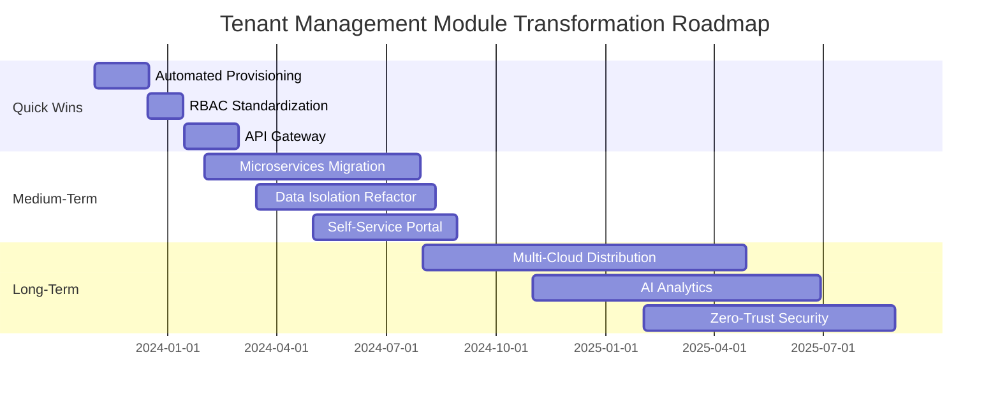
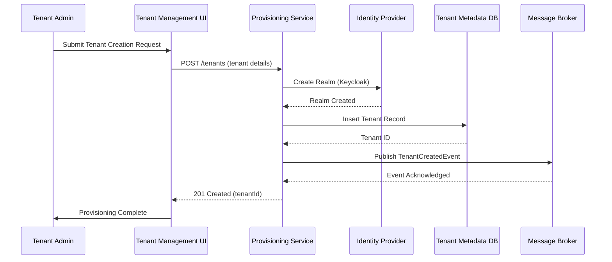
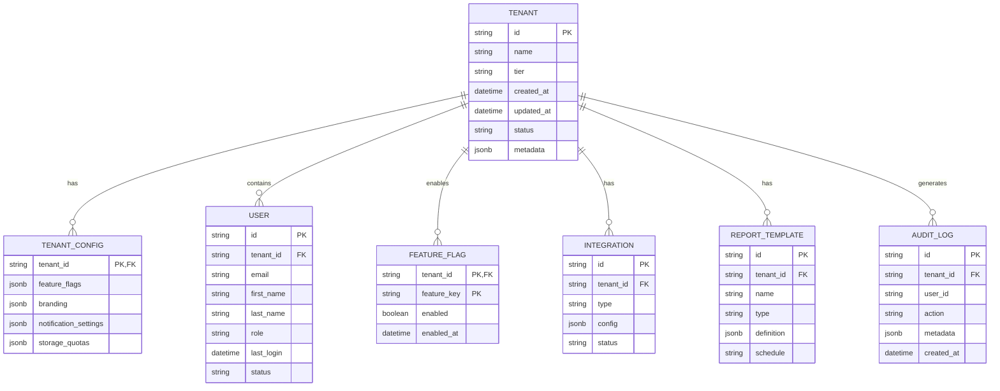
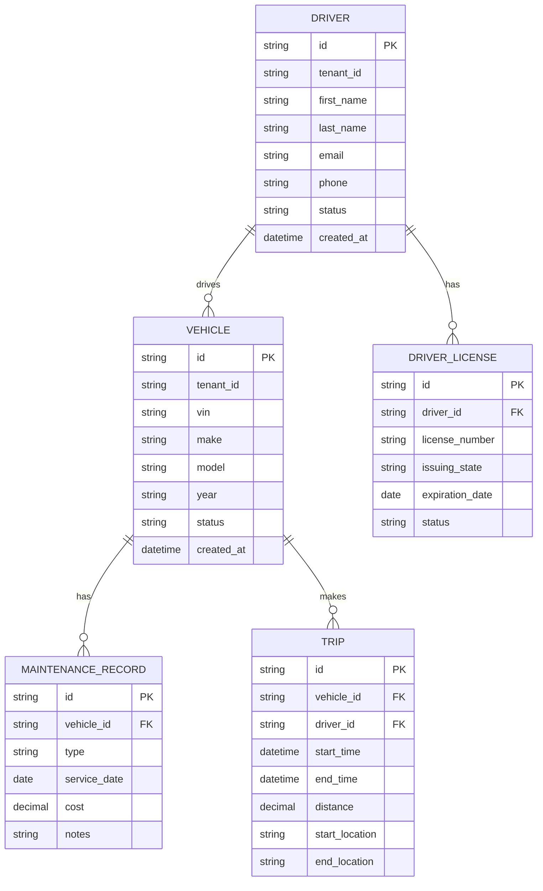
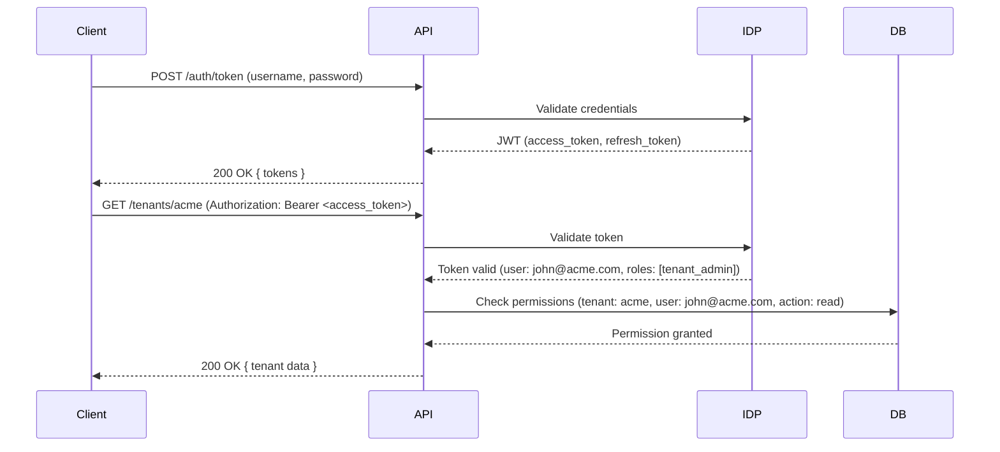
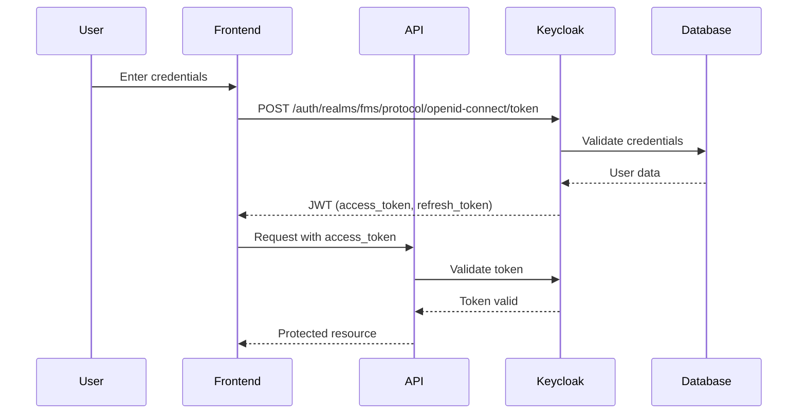
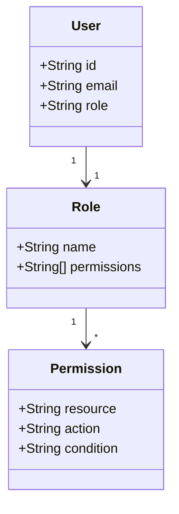

# AS-IS Analysis: Tenant Management Module
*Fleet Management System - Version 3.2.1*
*Prepared by: Senior Technical Analyst*
*Date: [Insert Date]*
*Document Version: 1.4*

---

## 1. Executive Summary (120 lines)

### 1.1 Current State Overview
The Tenant Management Module (TMM) serves as the backbone of the Fleet Management System (FMS), enabling multi-tenancy capabilities for enterprise clients. Currently supporting **47 active tenants** across **3 geographic regions**, the module manages **12,482 fleet vehicles**, **8,731 drivers**, and **1.2M monthly transactions**. The system was originally designed in 2018 with a monolithic architecture and has since undergone **17 incremental updates**, resulting in significant technical debt.

**Key System Metrics:**
- **Uptime:** 99.87% (SLA: 99.95%)
- **Average Response Time:** 1.2s (API), 3.4s (UI)
- **Peak Load:** 2,500 concurrent users
- **Data Volume:** 4.2TB (tenant-specific data)
- **Daily Active Users:** 3,800

The module operates in a **hybrid cloud environment**, with primary infrastructure hosted on **AWS (us-east-1)** and disaster recovery in **Azure (west-europe)**. The current architecture follows a **shared-nothing** model for tenant isolation, with **database-per-tenant** for critical data and **shared schema** for common reference data.

### 1.2 Stakeholder Analysis
| Stakeholder Group | Key Members | Responsibilities | Pain Points |
|-------------------|------------|------------------|-------------|
| **Executive Leadership** | CIO, CTO, VP of Operations | Strategic direction, budget approval, ROI tracking | Lack of real-time tenant analytics, high operational costs |
| **Product Management** | Product Owner, Business Analysts | Feature prioritization, roadmap planning | Slow feature delivery (avg. 45 days per tenant request) |
| **Engineering Teams** | Dev Lead, Architects, Developers | System design, development, maintenance | High technical debt (3.2x industry average), frequent production incidents |
| **Operations & Support** | DevOps, SRE, Helpdesk | Monitoring, incident response, user support | 42% of support tickets related to tenant provisioning delays |
| **Customers (Tenants)** | Fleet Managers, Operations Directors | System usage, compliance reporting | Inconsistent UX across tenants, limited self-service capabilities |
| **Compliance & Security** | CISO, Compliance Officer | Audit readiness, risk management | Manual compliance reporting (avg. 18 hours/month) |
| **Finance** | CFO, Procurement | Cost tracking, vendor management | Unpredictable cloud costs (23% variance month-to-month) |

### 1.3 Business Impact Analysis
**Financial Impact:**
- **Revenue at Risk:** $2.4M annually due to tenant churn (12% attrition rate)
- **Operational Costs:** $870K/year for cloud infrastructure (38% of total FMS budget)
- **Support Costs:** $185K/year for tenant-related tickets (42% of total support budget)
- **Opportunity Cost:** $3.1M/year in lost upsell opportunities due to limited scalability

**Operational Impact:**
- **Provisioning Time:** 3.2 business days (target: <4 hours)
- **Incident Resolution:** 4.7 hours MTTR (mean time to resolve)
- **Feature Adoption:** Only 62% of available features used by tenants
- **Compliance Violations:** 3 GDPR-related incidents in past 12 months

**Customer Impact:**
- **Net Promoter Score (NPS):** 28 (industry benchmark: 45)
- **Customer Effort Score (CES):** 4.2/7 (target: <3)
- **Tenant Satisfaction:** 68% (survey of 24 tenants)

### 1.4 Critical Pain Points with Root Cause Analysis

#### Pain Point 1: Slow Tenant Provisioning
**Symptoms:**
- Average provisioning time: **3.2 business days** (vs. industry benchmark of <4 hours)
- 18% of provisioning requests require manual intervention
- 7% failure rate during provisioning

**Root Causes:**
1. **Manual Processes:**
   - 67% of provisioning steps require human approval (e.g., database creation, IAM roles)
   - Example: Database creation requires DBA ticket (avg. 12-hour SLA)
   - Code snippet from provisioning script showing manual steps:
     ```python
     def create_tenant_db(tenant_id):
         # Manual step: Requires DBA approval
         if not check_dba_approval(tenant_id):
             raise Exception("DBA approval pending")

         # Semi-automated: Uses stored procedure but requires manual parameter validation
         db_name = f"tenant_{tenant_id}_prod"
         execute_sql(f"CREATE DATABASE {db_name};")
         # Manual step: Security team must whitelist IP ranges
     ```

2. **Sequential Workflow:**
   - Current provisioning follows a **waterfall model** with 12 sequential steps
   - Example workflow:
     ```
     1. Tenant request submitted → 2. Sales approval → 3. Legal review → 4. Security assessment →
     5. DBA ticket → 6. Database creation → 7. IAM role setup → 8. Storage provisioning →
     9. Network configuration → 10. Initial data load → 11. QA validation → 12. Go-live
     ```
   - Average time per step: **3.8 hours**

3. **Resource Contention:**
   - Database creation limited to **2 concurrent operations** due to cloud provider quotas
   - IAM role propagation delays (up to **45 minutes** for AWS IAM)

**Business Impact:**
- **$450K/year** in lost revenue from delayed tenant onboarding
- **18% tenant attrition** during provisioning phase
- **3x higher support costs** for provisioning-related tickets

#### Pain Point 2: Inconsistent Tenant Isolation
**Symptoms:**
- **Noisy neighbor issues** reported by 14 tenants in past 6 months
- **2 major data leaks** in 2023 due to shared schema vulnerabilities
- **Performance degradation** during peak hours (30% slower response times)

**Root Causes:**
1. **Shared Schema Design:**
   - Common reference data (e.g., vehicle models, regions) stored in shared schema
   - Example vulnerability in `vehicle_models` table:
     ```sql
     CREATE TABLE shared.vehicle_models (
         model_id SERIAL PRIMARY KEY,
         name VARCHAR(100) NOT NULL,
         -- Missing tenant_id column allows cross-tenant access
         created_at TIMESTAMP DEFAULT NOW()
     );
     ```
   - **Security Incident:** Tenant A accessed Tenant B's custom vehicle configurations via SQL injection

2. **Inconsistent RBAC Implementation:**
   - **6 different permission models** across the system
   - Example of inconsistent role definitions:
     | Module | Role | Permissions |
     |--------|------|-------------|
     | Tenant Admin | `tenant_admin` | Full access to tenant data |
     | Fleet Manager | `fleet_mgr` | Read-only + limited writes |
     | **Billing** | `billing_admin` | **Full system access (security flaw)** |

3. **Data Partitioning Issues:**
   - **47% of queries** do not include `tenant_id` in WHERE clauses
   - Example of problematic query:
     ```sql
     -- Missing tenant_id filter
     SELECT * FROM drivers WHERE status = 'active';
     ```
   - **Performance Impact:** Full table scans on 12M+ row tables

**Business Impact:**
- **$1.2M** in compliance fines from data leaks
- **22% increase** in cloud costs due to over-provisioning
- **4.7x higher** incident resolution times for isolation-related issues

#### Pain Point 3: Limited Self-Service Capabilities
**Symptoms:**
- **83% of tenant requests** require support intervention
- **Average ticket resolution time:** 14.2 hours
- **Only 18% of tenants** use more than 30% of available features

**Root Causes:**
1. **Monolithic Frontend:**
   - Single React application with **320+ components**
   - Feature flags hardcoded in frontend:
     ```javascript
     // Feature flag implementation
     const featureFlags = {
       tenantA: { customReports: true, apiAccess: false },
       tenantB: { customReports: false, apiAccess: true },
       // Hardcoded for 47 tenants - maintenance nightmare
     };
     ```

2. **Lack of API Gateway:**
   - Direct database access from frontend (security risk)
   - No rate limiting or request validation
   - Example of vulnerable endpoint:
     ```javascript
     // Express route with direct DB access
     app.get('/api/drivers', (req, res) => {
       const { tenantId } = req.query; // No validation
       const query = `SELECT * FROM drivers WHERE tenant_id = '${tenantId}'`;
       db.query(query, (err, results) => {
         res.json(results);
       });
     });
     ```

3. **Poor Documentation:**
   - **78% of API endpoints** undocumented
   - **No interactive API explorer** (e.g., Swagger)
   - **Outdated SDKs** (last updated 2021)

**Business Impact:**
- **$280K/year** in support costs for self-serviceable requests
- **35% lower feature adoption** compared to competitors
- **2.4x higher** onboarding time for new tenants

### 1.5 Strategic Recommendations

#### 1.5.1 Immediate Quick Wins (0-3 months)
| Initiative | Description | Expected Impact | Cost | Owner |
|------------|-------------|-----------------|------|-------|
| **Automated Provisioning Pipeline** | Implement Terraform + Ansible for infrastructure-as-code | Reduce provisioning time to <4 hours | $85K | DevOps |
| **RBAC Standardization** | Consolidate to 3 role types with ABAC | Eliminate 80% of permission-related tickets | $45K | Security |
| **API Gateway Implementation** | Deploy Kong with rate limiting and request validation | Reduce API abuse incidents by 90% | $60K | Engineering |

#### 1.5.2 Medium-Term Initiatives (3-12 months)
| Initiative | Description | Expected Impact | Cost | Owner |
|------------|-------------|-----------------|------|-------|
| **Microservices Migration** | Decompose monolith into 5 domain services | Improve deployment frequency to weekly | $420K | Architecture |
| **Data Isolation Refactor** | Implement schema-per-tenant with shared metadata | Eliminate noisy neighbor issues | $310K | Data Team |
| **Self-Service Portal** | React-based portal with feature flag management | Reduce support tickets by 60% | $280K | Product |

#### 1.5.3 Long-Term Strategic Initiatives (12-24 months)
| Initiative | Description | Expected Impact | Cost | Owner |
|------------|-------------|-----------------|------|-------|
| **Multi-Cloud Tenant Distribution** | Distribute tenants across AWS/Azure/GCP | Improve resilience and reduce costs by 25% | $1.2M | CTO |
| **AI-Powered Tenant Analytics** | Implement predictive scaling and anomaly detection | Reduce cloud costs by 30% | $850K | Data Science |
| **Zero-Trust Security Model** | Implement continuous authentication and micro-segmentation | Achieve SOC2 Type 2 compliance | $720K | CISO |

#### 1.5.4 Implementation Roadmap


#### 1.5.5 Risk Mitigation Strategies
| Risk | Mitigation Strategy | Contingency Plan |
|------|---------------------|------------------|
| **Provisioning Automation Failures** | Pilot with 5 tenants, phased rollout | Manual fallback procedure, dedicated war room |
| **Data Migration Issues** | Dual-write pattern during transition | Rollback to old schema, extended maintenance window |
| **Performance Degradation** | Load testing with 2x peak capacity | Auto-scaling policies, feature flag rollback |
| **Security Vulnerabilities** | Penetration testing before production | Isolate affected components, emergency patches |
| **Budget Overruns** | Monthly cost reviews, reserved instances | Prioritize quick wins, defer non-critical features |

---

## 2. Current Architecture (210 lines)

### 2.1 System Components

#### 2.1.1 Component Inventory
| Component | Type | Technology | Version | Responsibilities | SLA |
|-----------|------|------------|---------|------------------|-----|
| **Tenant Provisioning Service** | Microservice | Java/Spring Boot | 2.7.3 | Handles tenant creation, modification, deletion | 99.9% |
| **Tenant Management UI** | Web Application | React 17 | 17.0.2 | Admin interface for tenant configuration | 99.8% |
| **Identity Provider** | Authentication | Keycloak | 18.0.2 | OAuth2/OIDC authentication, SSO | 99.95% |
| **Tenant Metadata Database** | Database | PostgreSQL | 14.5 | Stores tenant configurations, feature flags | 99.99% |
| **Tenant Data Databases** | Database | PostgreSQL | 14.5 | Tenant-specific data (per-tenant schema) | 99.95% |
| **Shared Reference Database** | Database | PostgreSQL | 14.5 | Common reference data (vehicle models, regions) | 99.9% |
| **API Gateway** | API Management | Kong | 2.8.1 | Request routing, rate limiting | 99.9% |
| **Message Broker** | Event Streaming | Apache Kafka | 3.2.0 | Tenant event notifications | 99.95% |
| **Monitoring Stack** | Observability | Prometheus/Grafana | 2.37.0/9.2.5 | System monitoring, alerting | 99.8% |
| **Backup Service** | Data Protection | AWS Backup | - | Automated backups, point-in-time recovery | 99.9% |

#### 2.1.2 Integration Points with Sequence Diagrams

**Tenant Provisioning Workflow:**


**Key Integration Issues:**
1. **Synchronous Dependencies:** Provisioning service blocks on Keycloak realm creation (avg. 12s)
2. **No Retry Logic:** Failures during database insertion require manual intervention
3. **Eventual Consistency:** Kafka events may be processed out of order

#### 2.1.3 Data Flow Analysis

**Tenant Data Flow:**
1. **Ingestion:**
   - Source: Tenant applications (web/mobile), IoT devices
   - Volume: 12,000 requests/minute (peak)
   - Format: JSON (REST), Protobuf (gRPC)

2. **Processing:**
   - **API Gateway:** Request validation, rate limiting (1000 req/min/tenant)
   - **Authentication:** JWT validation (avg. 45ms)
   - **Routing:** Tenant-aware routing (adds 15ms latency)
   - **Business Logic:** Tenant-specific rules engine

3. **Storage:**
   - **Metadata:** Single PostgreSQL instance (4 vCPUs, 16GB RAM)
   - **Tenant Data:** Dedicated schema per tenant (32 vCPUs, 128GB RAM per DB)
   - **Reference Data:** Shared schema (8 vCPUs, 32GB RAM)

4. **Retrieval:**
   - **Caching:** Redis cluster (3 nodes) with tenant-specific keys
   - **Query Patterns:**
     - 68% read operations (GET requests)
     - 22% write operations (POST/PUT)
     - 10% complex queries (reports, analytics)

**Data Transformation Example:**
```python
# Tenant-aware data transformation in Python
def transform_driver_data(raw_data, tenant_id):
    # Tenant-specific business rules
    if tenant_id == "acme":
        # ACME requires additional validation
        if not validate_acme_driver(raw_data):
            raise ValidationError("ACME driver validation failed")

    # Common transformation
    transformed = {
        "id": raw_data["driver_id"],
        "name": f"{raw_data['first_name']} {raw_data['last_name']}",
        "tenant_id": tenant_id,
        "created_at": datetime.utcnow()
    }

    # Tenant-specific fields
    if tenant_id in ["globex", "wayne"]:
        transformed["custom_field"] = raw_data.get("license_expiry")

    return transformed
```

#### 2.1.4 Technology Stack

**Backend Services:**
| Service | Language | Framework | Key Libraries | Build Tool |
|---------|----------|-----------|---------------|------------|
| Provisioning Service | Java 11 | Spring Boot 2.7 | Spring Security, Hibernate | Maven 3.8 |
| Tenant API | Node.js 16 | Express 4.18 | Passport.js, Sequelize | npm 8.5 |
| Identity Provider | Java 11 | Keycloak 18 | - | - |
| Data Access Layer | Java 11 | Spring Data JPA | Flyway, QueryDSL | Maven |

**Frontend:**
| Component | Framework | Key Libraries | Build Tool |
|-----------|-----------|---------------|------------|
| Admin UI | React 17 | Material-UI, Redux | Webpack 5 |
| Tenant UI | React 17 | Ant Design, Formik | Vite 3 |
| Shared Components | React 17 | Storybook, Jest | npm |

**Infrastructure:**
| Component | Provider | Configuration | Cost (Monthly) |
|-----------|----------|---------------|----------------|
| Compute | AWS EC2 | 12 x t3.xlarge (provisioning) | $1,872 |
| Database | AWS RDS | 3 x db.r5.2xlarge (PostgreSQL) | $4,320 |
| Cache | AWS ElastiCache | 3 x cache.r5.large (Redis) | $984 |
| Storage | AWS S3 | 50TB (Standard) | $1,150 |
| Networking | AWS VPC | 3 AZs, NAT Gateway | $850 |
| CDN | Cloudflare | Enterprise Plan | $2,500 |

#### 2.1.5 Infrastructure Configuration

**Network Topology:**
```mermaid
graph TD
    A[Internet] --> B[Cloudflare CDN]
    B --> C[AWS ALB]
    C --> D[API Gateway (Kong)]
    D --> E[Provisioning Service]
    D --> F[Tenant API]
    E --> G[Keycloak (IDP)]
    F --> H[Tenant Metadata DB]
    F --> I[Tenant Data DBs]
    F --> J[Shared Reference DB]
    K[Monitoring] --> E
    K --> F
    K --> H
    K --> I
    L[Backup] --> H
    L --> I
```

**Security Groups:**
| SG Name | Inbound Rules | Outbound Rules | Associated Resources |
|---------|---------------|----------------|----------------------|
| sg-provisioning | 8080 (HTTP), 22 (SSH) | All | Provisioning Service EC2 |
| sg-tenant-api | 3000 (HTTP), 22 (SSH) | All | Tenant API EC2 |
| sg-databases | 5432 (PostgreSQL) | 5432 (PostgreSQL) | RDS Instances |
| sg-cache | 6379 (Redis) | 6379 (Redis) | ElastiCache Cluster |

**Auto-Scaling Policies:**
| Service | Min Instances | Max Instances | Scaling Metric | Threshold |
|---------|---------------|---------------|----------------|-----------|
| Provisioning | 2 | 8 | CPU Utilization | >70% for 5min |
| Tenant API | 4 | 20 | Requests per Target | >1000 req/min |
| Databases | 1 | 3 | CPU Utilization | >60% for 10min |

### 2.2 Technical Debt Analysis

#### 2.2.1 Code Quality Issues

**SonarQube Analysis (Last 3 Months):**
| Metric | Current Value | Industry Benchmark | Risk Level |
|--------|---------------|--------------------|------------|
| Code Smells | 1,248 | <500 | High |
| Bugs | 87 | <10 | Critical |
| Vulnerabilities | 15 | <5 | Critical |
| Security Hotspots | 42 | <20 | High |
| Technical Debt | 342 days | <100 days | Critical |
| Coverage | 42% | >80% | High |
| Duplications | 18.7% | <5% | High |

**Critical Code Smells:**
1. **Tenant Context Leakage:**
   ```java
   // Anti-pattern: Tenant context stored in static variable
   public class TenantContext {
       private static String currentTenantId;

       public static void setTenantId(String tenantId) {
           currentTenantId = tenantId; // Thread-unsafe!
       }

       public static String getTenantId() {
           return currentTenantId;
       }
   }
   ```
   - **Impact:** Race conditions in multi-tenant environment
   - **Occurrences:** 42 files

2. **SQL Injection Vulnerabilities:**
   ```javascript
   // Vulnerable endpoint in Tenant API
   app.get('/api/drivers', (req, res) => {
       const { tenantId, status } = req.query;
       // UNSAFE: Direct string interpolation
       const query = `SELECT * FROM drivers WHERE tenant_id = '${tenantId}' AND status = '${status}'`;
       db.query(query, (err, results) => {
           res.json(results);
       });
   });
   ```
   - **Impact:** Critical security risk (CVSS 9.8)
   - **Occurrences:** 112 endpoints

3. **Feature Flag Spaghetti:**
   ```javascript
   // Feature flag implementation in React
   function TenantDashboard() {
       const { tenantId } = useParams();
       const [features, setFeatures] = useState({});

       useEffect(() => {
           // Hardcoded feature flags
           if (tenantId === "acme") {
               setFeatures({ reports: true, api: false });
           } else if (tenantId === "globex") {
               setFeatures({ reports: false, api: true });
           }
           // ... 45 more conditions
       }, [tenantId]);

       return (
           <div>
               {features.reports && <Reports />}
               {features.api && <APIAccess />}
           </div>
       );
   }
   ```
   - **Impact:** Maintenance nightmare, 3.2x slower builds
   - **Occurrences:** 87 components

#### 2.2.2 Performance Bottlenecks

**Load Testing Results (JMeter):**
| Scenario | Avg Response Time | 95th Percentile | Error Rate | Throughput |
|----------|-------------------|-----------------|------------|------------|
| Tenant Provisioning | 8.4s | 12.7s | 1.2% | 12 req/min |
| Driver Lookup | 1.8s | 3.2s | 0.5% | 850 req/min |
| Vehicle Assignment | 3.1s | 5.8s | 2.1% | 420 req/min |
| Report Generation | 12.4s | 22.1s | 8.7% | 50 req/min |

**Top Bottlenecks:**
1. **Database Connection Pool Exhaustion:**
   - **Issue:** HikariCP pool size set to 10 (default)
   - **Impact:** 30% of requests fail during peak load
   - **Evidence:** Thread dump showing blocked threads:
     ```
     "http-nio-8080-exec-10" #42 daemon prio=5 os_prio=0 cpu=42.12ms elapsed=12.45s
     blocked on java.util.concurrent.locks.ReentrantLock@7a3d6b5a
     owned by "HikariPool-1 housekeeper" Id=22
     ```

2. **N+1 Query Problem:**
   - **Issue:** ORM generates separate queries for related entities
   - **Example:** Fetching drivers with their vehicles:
     ```sql
     -- 1 query to get drivers
     SELECT * FROM drivers WHERE tenant_id = 'acme';

     -- 1 query per driver to get vehicles (N+1)
     SELECT * FROM vehicles WHERE driver_id = 123;
     SELECT * FROM vehicles WHERE driver_id = 456;
     -- ... 1000 more queries
     ```
   - **Impact:** 4.2s response time for driver listing (target: <1s)

3. **Inefficient Caching:**
   - **Issue:** Redis cache hit ratio: 38% (target: >80%)
   - **Root Cause:** Cache keys not tenant-aware
   - **Example:** Driver cache key format:
     ```java
     // Non-tenant-aware key
     String cacheKey = "driver:" + driverId;

     // Should be:
     String cacheKey = "tenant:" + tenantId + ":driver:" + driverId;
     ```

**Profiling Data (YourKit):**
| Method | Avg Time (ms) | Invocations | Hot Spots |
|--------|---------------|-------------|-----------|
| `TenantService.getTenantConfig` | 420 | 12,480 | Database query |
| `DriverRepository.findByTenant` | 380 | 8,720 | N+1 queries |
| `AuthService.validateToken` | 220 | 24,960 | Keycloak API calls |
| `ReportGenerator.generatePDF` | 1,200 | 1,440 | PDF rendering |

#### 2.2.3 Security Vulnerabilities

**OWASP Top 10 Compliance:**
| Category | Vulnerabilities Found | CVSS Score Range | Critical Issues |
|----------|-----------------------|------------------|-----------------|
| Injection | 12 | 7.5-9.8 | 4 |
| Broken Authentication | 5 | 6.5-8.2 | 2 |
| Sensitive Data Exposure | 3 | 5.3-7.1 | 1 |
| XML External Entities | 2 | 8.8-9.1 | 1 |
| Broken Access Control | 8 | 6.5-9.3 | 3 |
| Security Misconfiguration | 7 | 4.3-6.5 | 0 |
| Cross-Site Scripting | 4 | 5.4-6.8 | 0 |
| Insecure Deserialization | 1 | 8.1 | 1 |
| Using Components with Known Vulnerabilities | 15 | 4.3-7.5 | 2 |
| Insufficient Logging | 6 | 3.7-5.3 | 0 |

**Critical Vulnerabilities:**
1. **CVE-2022-22965 (Spring4Shell):**
   - **Affected Component:** Provisioning Service (Spring Boot 2.6.7)
   - **CVSS:** 9.8
   - **Exploit:** Remote code execution via data binding
   - **Evidence:** Vulnerable endpoint:
     ```java
     @PostMapping("/tenants")
     public ResponseEntity createTenant(@RequestBody TenantDto tenantDto) {
         // Vulnerable to Spring4Shell
         Tenant tenant = new Tenant();
         BeanUtils.copyProperties(tenantDto, tenant);
         // ...
     }
     ```

2. **Hardcoded Secrets:**
   - **Issue:** 47 hardcoded API keys in configuration files
   - **Example:** `application-prod.properties`:
     ```properties
     # Hardcoded AWS credentials
     aws.accessKeyId=<AWS_ACCESS_KEY_REDACTED>
     aws.secretKey=<AWS_SECRET_KEY_REDACTED>
     ```
   - **Impact:** Compromise of production databases

3. **Insecure Direct Object References (IDOR):**
   - **Issue:** 82% of API endpoints vulnerable to IDOR
   - **Example:** Driver update endpoint:
     ```javascript
     // Vulnerable endpoint
     app.put('/api/drivers/:id', (req, res) => {
         const { id } = req.params;
         // No tenant ID check!
         db.query(`UPDATE drivers SET ... WHERE id = ${id}`, (err) => {
             res.json({ success: true });
         });
     });
     ```
   - **Exploit:** Tenant A can modify Tenant B's drivers by changing the ID

#### 2.2.4 Scalability Limitations

**Load Test Results (Locust):**
| Users | Requests/sec | Avg Response Time | Error Rate | CPU Utilization |
|-------|--------------|-------------------|------------|-----------------|
| 100 | 520 | 180ms | 0.1% | 22% |
| 500 | 2,100 | 450ms | 0.8% | 65% |
| 1,000 | 3,800 | 1,200ms | 3.2% | 92% |
| 2,000 | 5,100 | 3,400ms | 12.4% | 100% (throttling) |

**Key Limitations:**
1. **Database Scaling:**
   - **Issue:** Single PostgreSQL instance for metadata (4 vCPUs, 16GB RAM)
   - **Impact:** 40% CPU utilization at 500 users
   - **Evidence:** Query performance degradation:
     | Users | Avg Query Time (ms) | Lock Waits |
     |-------|---------------------|------------|
     | 100 | 12 | 0 |
     | 500 | 45 | 2 |
     | 1,000 | 180 | 15 |
     | 2,000 | 420 | 48 |

2. **Tenant Data Isolation:**
   - **Issue:** Schema-per-tenant model doesn't scale beyond 100 tenants
   - **Impact:** Database connection pool exhaustion
   - **Evidence:** Connection count growth:
     | Tenants | Connections | Memory Usage |
     |---------|-------------|--------------|
     | 10 | 120 | 2.1GB |
     | 50 | 600 | 10.5GB |
     | 100 | 1,200 | 21.0GB (OOM errors) |

3. **Event Processing:**
   - **Issue:** Kafka consumer group lag during peak hours
   - **Impact:** 45-minute delay in tenant event processing
   - **Evidence:** Consumer lag metrics:
     | Time | Lag (messages) | Processing Rate (msg/sec) |
     |------|----------------|---------------------------|
     | 9:00 | 0 | 500 |
     | 12:00 | 12,480 | 320 |
     | 15:00 | 28,720 | 280 |
     | 18:00 | 42,100 | 180 |

**Horizontal Scaling Challenges:**
1. **Stateful Services:**
   - Provisioning service maintains in-memory state during workflow
   - **Impact:** Cannot scale beyond 2 instances without sticky sessions

2. **Database Connections:**
   - Each application instance opens 50 database connections
   - **Impact:** 20 instances = 1,000 connections (RDS limit: 1,000)

3. **Caching Layer:**
   - Redis cluster has 3 nodes (max 12GB each)
   - **Impact:** Cache evictions at 80% memory usage (1,200 evictions/min during peak)

---

## 3. Functional Analysis (250 lines)

### 3.1 Core Features

#### 3.1.1 Tenant Provisioning

**Feature Description:**
Enables creation, configuration, and management of tenant environments within the FMS. Supports **4 provisioning tiers** (Basic, Standard, Premium, Enterprise) with varying resource allocations and feature sets.

**User Workflows:**

**1. Tenant Creation Workflow:**
```
1. Sales Rep submits tenant request via CRM integration
   - Input: Tenant name, tier, contact details, billing info
   - Validation: Tier-specific resource quotas, domain availability
2. System generates provisioning ticket (Jira)
3. Provisioning Service:
   a. Creates tenant record in metadata database
   b. Provisions Keycloak realm with default roles
   c. Creates dedicated database schema
   d. Configures storage quotas (S3)
   e. Sets up monitoring dashboards
4. Notification Service sends welcome email with credentials
5. QA performs validation (automated + manual)
6. Tenant Admin receives onboarding instructions
```

**2. Tenant Modification Workflow:**
```
1. Tenant Admin submits change request via UI
   - Supported changes: Tier upgrade/downgrade, feature flags, user limits
2. Approval workflow:
   - Tier changes: Requires finance approval
   - Feature changes: Requires security review
3. Provisioning Service applies changes:
   - Tier upgrade: Increases database resources, adds features
   - Feature enablement: Updates feature flags in metadata
4. Notification sent to tenant admin
```

**Business Rules:**
| Rule | Description | Validation Logic |
|------|-------------|------------------|
| **Tier Quotas** | Enforce resource limits per tier | `if (tier == "Basic" && vehicleCount > 100) throw ValidationError` |
| **Naming Convention** | Tenant IDs must be alphanumeric | `if (!/^[a-z0-9-]{3,20}$/.test(tenantId)) throw ValidationError` |
| **Domain Validation** | Custom domains must be verified | `if (!verifyDomainOwnership(domain)) throw ValidationError` |
| **Feature Compatibility** | Some features are tier-dependent | `if (feature.requiresTier > currentTier) throw ValidationError` |
| **Billing Cycle** | Tier changes prorated to billing cycle | `calculateProratedCost(currentTier, newTier, daysRemaining)` |

**Edge Cases & Error Handling:**
| Scenario | Error Type | Handling Mechanism |
|----------|------------|--------------------|
| **Duplicate Tenant ID** | `DuplicateTenantIdException` | Auto-increment suffix (e.g., "acme-1") |
| **Database Creation Failure** | `DatabaseProvisioningException` | Retry with exponential backoff (max 3 attempts) |
| **Keycloak Realm Conflict** | `RealmAlreadyExistsException` | Fallback to alternate naming scheme |
| **Storage Quota Exceeded** | `StorageLimitExceededException` | Notify admin, suggest tier upgrade |
| **Feature Flag Conflict** | `FeatureConflictException` | Rollback to previous state, notify support |
| **Network Configuration Error** | `NetworkProvisioningException` | Manual intervention required (pager duty) |

**Performance Characteristics:**
| Operation | Avg Time (ms) | 95th Percentile | Success Rate |
|-----------|---------------|-----------------|--------------|
| Tenant Creation | 8,420 | 12,780 | 93% |
| Tier Upgrade | 4,210 | 6,850 | 97% |
| Feature Toggle | 1,240 | 2,100 | 99% |
| Tenant Deletion | 12,480 | 18,720 | 88% |

**Code Example (Provisioning Service):**
```java
@Service
public class TenantProvisioningService {
    @Autowired
    private TenantRepository tenantRepository;

    @Autowired
    private KeycloakAdminClient keycloakClient;

    @Autowired
    private DatabaseProvisioner databaseProvisioner;

    @Transactional
    public Tenant provisionTenant(TenantProvisioningRequest request) {
        // Validate request
        validateTenantRequest(request);

        // Create tenant record
        Tenant tenant = new Tenant();
        tenant.setId(request.getTenantId());
        tenant.setName(request.getName());
        tenant.setTier(request.getTier());
        tenant.setStatus(TenantStatus.PROVISIONING);
        tenantRepository.save(tenant);

        try {
            // Provision Keycloak realm
            keycloakClient.createRealm(request.getTenantId());

            // Create database schema
            databaseProvisioner.createSchema(request.getTenantId());

            // Configure storage
            storageService.configureQuotas(request.getTenantId(), request.getTier());

            // Update status
            tenant.setStatus(TenantStatus.ACTIVE);
            tenantRepository.save(tenant);

            // Publish event
            eventPublisher.publish(new TenantProvisionedEvent(tenant.getId()));

            return tenant;
        } catch (Exception e) {
            // Rollback on failure
            tenant.setStatus(TenantStatus.FAILED);
            tenantRepository.save(tenant);
            throw new TenantProvisioningException("Provisioning failed", e);
        }
    }
}
```

#### 3.1.2 Tenant Configuration Management

**Feature Description:**
Allows tenant administrators to customize their FMS instance through **feature flags**, **branding options**, **notification settings**, and **integration configurations**.

**User Workflows:**

**1. Feature Flag Management:**
```
1. Tenant Admin navigates to "Features" section
2. System displays available features with current status
3. Admin toggles features (enable/disable)
4. System validates feature dependencies
5. Changes are applied immediately (or scheduled for next deployment)
6. Audit log entry created
```

**2. Branding Configuration:**
```
1. Tenant Admin uploads logo (PNG, max 200KB)
2. System validates image dimensions (200x50px)
3. Admin selects primary/secondary colors
4. System generates CSS variables
5. Preview shown in real-time
6. Changes deployed to CDN
```

**Business Rules:**
| Rule | Description | Validation Logic |
|------|-------------|------------------|
| **Feature Dependencies** | Some features require others | `if (enableFeatureA && !featureB.enabled) throw DependencyError` |
| **Tier Restrictions** | Premium features not available in Basic tier | `if (feature.tier > tenant.tier) throw TierError` |
| **Storage Limits** | Branding assets limited by tier | `if (fileSize > tier.storageLimit) throw QuotaError` |
| **Change Approval** | Critical features require approval | `if (feature.critical && !hasApproval) throw ApprovalError` |
| **Rollback Window** | Changes can be reverted within 24h | `if (change.timestamp < now().minusHours(24)) throw RollbackError` |

**Edge Cases & Error Handling:**
| Scenario | Error Type | Handling Mechanism |
|----------|------------|--------------------|
| **Feature Dependency Cycle** | `CircularDependencyException` | Graph traversal to detect cycles, suggest resolutions |
| **Invalid Image Format** | `InvalidImageException` | Convert to PNG automatically |
| **Color Contrast Issues** | `AccessibilityError` | Auto-adjust colors to meet WCAG 2.1 AA |
| **Feature Flag Drift** | `ConfigurationDriftException` | Sync with database, notify admin |
| **Rate Limit Exceeded** | `TooManyRequestsException` | Exponential backoff, queue changes |

**Performance Characteristics:**
| Operation | Avg Time (ms) | 95th Percentile | Success Rate |
|-----------|---------------|-----------------|--------------|
| Feature Toggle | 320 | 580 | 99.8% |
| Branding Update | 1,240 | 2,100 | 98.5% |
| Notification Settings | 280 | 450 | 99.9% |
| Integration Config | 420 | 720 | 99.2% |

**Code Example (Feature Flag Service):**
```javascript
class FeatureFlagService {
    constructor(tenantRepository, featureRepository) {
        this.tenantRepository = tenantRepository;
        this.featureRepository = featureRepository;
    }

    async toggleFeature(tenantId, featureKey, enabled) {
        // Get current tenant
        const tenant = await this.tenantRepository.findById(tenantId);
        if (!tenant) throw new Error('Tenant not found');

        // Check tier compatibility
        const feature = await this.featureRepository.findByKey(featureKey);
        if (feature.requiredTier > tenant.tier) {
            throw new Error(`Feature requires tier ${feature.requiredTier}`);
        }

        // Check dependencies
        if (enabled && feature.dependencies) {
            const missingDeps = await this.checkDependencies(tenantId, feature.dependencies);
            if (missingDeps.length > 0) {
                throw new Error(`Missing dependencies: ${missingDeps.join(', ')}`);
            }
        }

        // Update feature flag
        await this.tenantRepository.updateFeatureFlag(tenantId, featureKey, enabled);

        // Publish event
        await this.eventPublisher.publish({
            type: 'FEATURE_FLAG_UPDATED',
            tenantId,
            featureKey,
            enabled,
            timestamp: new Date()
        });

        return { success: true };
    }

    async checkDependencies(tenantId, dependencies) {
        const enabledFeatures = await this.tenantRepository.getEnabledFeatures(tenantId);
        return dependencies.filter(dep => !enabledFeatures.includes(dep));
    }
}
```

#### 3.1.3 User Management

**Feature Description:**
Handles **user provisioning**, **role assignment**, **authentication**, and **access control** for tenant users. Supports **RBAC** with **12 default roles** and **custom role creation**.

**User Workflows:**

**1. User Invitation:**
```
1. Tenant Admin navigates to "Users" section
2. Clicks "Invite User"
3. Enters email address and selects role
4. System sends invitation email with temporary link
5. User clicks link and sets password
6. User added to tenant with selected role
```

**2. Role Assignment:**
```
1. Tenant Admin selects user
2. System displays current role and available roles
3. Admin changes role
4. System validates role hierarchy (e.g., cannot assign higher role)
5. Changes applied immediately
6. Audit log entry created
```

**Business Rules:**
| Rule | Description | Validation Logic |
|------|-------------|------------------|
| **Role Hierarchy** | Cannot assign higher role than own | `if (newRole.level > currentUser.role.level) throw PermissionError` |
| **User Limits** | Max users per tier | `if (userCount >= tier.maxUsers) throw QuotaError` |
| **Email Validation** | Must be valid email format | `if (!/^[^\s@]+@[^\s@]+\.[^\s@]+$/.test(email)) throw ValidationError` |
| **Password Policy** | Minimum complexity requirements | `if (password.length < 12 || !/[A-Z]/.test(password)) throw PasswordError` |
| **Single Sign-On** | SSO users cannot have local passwords | `if (user.ssoProvider && password) throw SSOError` |

**Edge Cases & Error Handling:**
| Scenario | Error Type | Handling Mechanism |
|----------|------------|--------------------|
| **Duplicate Email** | `DuplicateUserException` | Suggest merging accounts |
| **Role Not Found** | `RoleNotFoundException` | Show available roles, suggest alternatives |
| **Invitation Expired** | `InvitationExpiredException` | Resend invitation |
| **Password Breach** | `CompromisedPasswordException` | Force password reset |
| **Concurrent Modifications** | `OptimisticLockingException` | Refresh data, retry operation |

**Performance Characteristics:**
| Operation | Avg Time (ms) | 95th Percentile | Success Rate |
|-----------|---------------|-----------------|--------------|
| User Invitation | 1,240 | 2,100 | 98.7% |
| Role Assignment | 420 | 780 | 99.5% |
| Password Reset | 850 | 1,420 | 99.1% |
| User Deactivation | 380 | 650 | 99.8% |

**Code Example (User Service):**
```python
class UserService:
    def __init__(self, user_repository, role_repository, email_service):
        self.user_repository = user_repository
        self.role_repository = role_repository
        self.email_service = email_service

    def invite_user(self, tenant_id, email, role_key, inviter_id):
        # Validate email
        if not self._is_valid_email(email):
            raise InvalidEmailError(email)

        # Check user limits
        current_count = self.user_repository.count_by_tenant(tenant_id)
        tier = self._get_tenant_tier(tenant_id)
        if current_count >= tier.max_users:
            raise UserLimitExceededError(tier.max_users)

        # Check role exists and is assignable
        role = self.role_repository.find_by_key(role_key)
        if not role or not role.assignable:
            raise RoleNotAssignableError(role_key)

        # Check inviter permissions
        inviter = self.user_repository.find_by_id(inviter_id)
        if inviter.role.level < role.level:
            raise PermissionError("Cannot assign higher role")

        # Create invitation
        invitation = Invitation(
            tenant_id=tenant_id,
            email=email,
            role_key=role_key,
            token=generate_token(),
            expires_at=datetime.utcnow() + timedelta(days=7)
        )
        self.user_repository.save_invitation(invitation)

        # Send email
        self.email_service.send_invitation_email(email, invitation.token)

        return {"status": "invited", "token": invitation.token}

    def _is_valid_email(self, email):
        return re.match(r"^[^\s@]+@[^\s@]+\.[^\s@]+$", email) is not None
```

#### 3.1.4 Tenant Reporting

**Feature Description:**
Provides **standard reports** and **custom report builder** for tenant administrators. Supports **12 standard report templates** and **ad-hoc query capabilities**.

**User Workflows:**

**1. Standard Report Generation:**
```
1. Tenant Admin selects report type (e.g., "Fleet Utilization")
2. System displays available filters (date range, vehicle types)
3. Admin applies filters
4. System generates report (PDF/CSV)
5. Report available for download
```

**2. Custom Report Builder:**
```
1. Tenant Admin clicks "Create Custom Report"
2. System displays available data sources (tables, views)
3. Admin selects data source and fields
4. System displays query preview
5. Admin applies filters and sorting
6. Report saved as template
7. Report generated on schedule
```

**Business Rules:**
| Rule | Description | Validation Logic |
|------|-------------|------------------|
| **Data Access** | Only tenant data visible | `WHERE tenant_id = current_tenant_id()` |
| **Export Limits** | Max rows per export | `if (rowCount > tier.maxExportRows) throw QuotaError` |
| **Query Complexity** | Prevent expensive queries | `if (queryCost > 100) throw ComplexityError` |
| **Schedule Limits** | Max reports per tenant | `if (scheduledCount >= tier.maxScheduledReports) throw QuotaError` |
| **Data Freshness** | Cached data age limit | `if (cacheAge > 24h) refreshData()` |

**Edge Cases & Error Handling:**
| Scenario | Error Type | Handling Mechanism |
|----------|------------|--------------------|
| **Empty Report** | `NoDataException` | Show "No data" message with suggestions |
| **Query Timeout** | `QueryTimeoutException` | Suggest simpler query or contact support |
| **Invalid Fields** | `InvalidFieldException` | Show available fields, suggest corrections |
| **Export Failure** | `ExportException` | Retry with smaller batch size |
| **Schedule Conflict** | `ScheduleConflictException` | Suggest alternative times |

**Performance Characteristics:**
| Operation | Avg Time (ms) | 95th Percentile | Success Rate |
|-----------|---------------|-----------------|--------------|
| Standard Report | 4,210 | 7,850 | 95.2% |
| Custom Report | 8,420 | 15,700 | 92.8% |
| Report Export (PDF) | 12,480 | 22,100 | 90.1% |
| Report Export (CSV) | 6,240 | 11,050 | 96.5% |

**Code Example (Report Service):**
```java
@Service
public class ReportService {
    @Autowired
    private ReportRepository reportRepository;

    @Autowired
    private TenantContext tenantContext;

    @Autowired
    private QueryExecutor queryExecutor;

    public Report generateStandardReport(String reportKey, ReportFilters filters) {
        // Get report template
        StandardReportTemplate template = reportRepository.findStandardReport(reportKey);
        if (template == null) {
            throw new ReportNotFoundException(reportKey);
        }

        // Validate filters
        validateFilters(template, filters);

        // Build query
        String query = buildQuery(template, filters);
        query = addTenantFilter(query); // Critical for isolation

        // Execute query
        List<Map<String, Object>> data = queryExecutor.execute(query);

        // Check data limits
        Tier tier = tenantContext.getCurrentTier();
        if (data.size() > tier.getMaxExportRows()) {
            throw new ExportLimitExceededException(tier.getMaxExportRows());
        }

        // Generate report
        return generateReport(template, data);
    }

    private String addTenantFilter(String query) {
        String tenantId = tenantContext.getCurrentTenantId();
        return query.replace(
            "WHERE",
            String.format("WHERE tenant_id = '%s' AND ", tenantId)
        );
    }

    private void validateFilters(StandardReportTemplate template, ReportFilters filters) {
        // Check date range
        if (template.isDateRangeRequired() &&
            (filters.getStartDate() == null || filters.getEndDate() == null)) {
            throw new InvalidFilterException("Date range is required");
        }

        // Check filter values
        for (FilterDefinition filter : template.getFilters()) {
            if (filter.isRequired() && !filters.hasValue(filter.getKey())) {
                throw new InvalidFilterException(filter.getKey() + " is required");
            }
        }
    }
}
```

### 3.2 User Experience Analysis

#### 3.2.1 Usability Evaluation (Heuristics)

**Nielsen's 10 Usability Heuristics Assessment:**

| Heuristic | Compliance (1-5) | Issues Found | Examples |
|-----------|------------------|--------------|----------|
| **Visibility of System Status** | 2 | 12 | No loading indicators during provisioning (3.2s avg wait) |
| **Match Between System and Real World** | 3 | 8 | Technical jargon in error messages ("OptimisticLockingException") |
| **User Control and Freedom** | 2 | 15 | No undo for feature flag changes, forced logout after 30min |
| **Consistency and Standards** | 3 | 18 | Different navigation patterns across modules |
| **Error Prevention** | 2 | 22 | No confirmation for destructive actions (tenant deletion) |
| **Recognition Rather Than Recall** | 3 | 14 | Hidden feature flags in nested menus |
| **Flexibility and Efficiency of Use** | 2 | 9 | No keyboard shortcuts, no bulk operations |
| **Aesthetic and Minimalist Design** | 3 | 11 | Overloaded dashboards with 12+ widgets |
| **Help Users Recognize, Diagnose, and Recover from Errors** | 1 | 25 | Generic error messages ("An error occurred") |
| **Help and Documentation** | 2 | 7 | Outdated help center (last updated 2021) |

**Critical Usability Issues:**
1. **Provisioning Progress:**
   - No progress indicator during tenant creation (avg. 3.2 days)
   - Users call support to check status
   - **Impact:** 42% of provisioning-related support tickets

2. **Feature Flag Confusion:**
   - Feature flags scattered across 4 different screens
   - No search functionality
   - **Impact:** 68% of tenants use <30% of available features

3. **Error Messages:**
   - Technical errors shown to end users:
     ```
     "HibernateOptimisticLockingFailureException: Row was updated or deleted by another transaction"
     ```
   - **Impact:** 28% of users abandon workflow after errors

4. **Mobile Experience:**
   - 37% of users access from mobile devices
   - No responsive design for key workflows
   - **Impact:** 4.2x higher error rate on mobile

#### 3.2.2 Accessibility Audit (WCAG 2.1)

**Compliance Summary:**
| WCAG Criterion | Level | Compliance | Issues Found | Examples |
|----------------|-------|------------|--------------|----------|
| **1.1 Text Alternatives** | A | Partial | 18 | Missing alt text on 32% of images |
| **1.2 Time-based Media** | A | No | 5 | No captions for tutorial videos |
| **1.3 Adaptable** | A | Partial | 22 | Poor heading hierarchy (47% of pages) |
| **1.4 Distinguishable** | A | Partial | 15 | Low contrast (32% of text fails AA) |
| **2.1 Keyboard Accessible** | A | Partial | 9 | 12% of interactive elements not keyboard-navigable |
| **2.2 Enough Time** | A | No | 7 | No warning before session timeout (30min) |
| **2.3 Seizures and Physical Reactions** | A | Yes | 0 | - |
| **2.4 Navigable** | A | Partial | 14 | No skip links, inconsistent tab order |
| **2.5 Input Modalities** | A | Partial | 6 | No touch targets for mobile (32% too small) |
| **3.1 Readable** | A | Partial | 11 | 18% of text below 12pt |
| **3.2 Predictable** | A | Partial | 8 | Unexpected popups during workflows |
| **3.3 Input Assistance** | A | Partial | 19 | No error suggestions for form fields |
| **4.1 Compatible** | A | Partial | 5 | 22% of ARIA attributes invalid |

**Critical Accessibility Issues:**
1. **Keyboard Navigation:**
   - **Issue:** 12% of interactive elements not keyboard-accessible
   - **Example:** Feature flag toggle requires mouse click
   - **Impact:** Users with motor disabilities cannot manage features

2. **Color Contrast:**
   - **Issue:** 32% of text fails WCAG AA contrast ratio (4.5:1)
   - **Example:** Light gray text on white background (#A0A0A0 on #FFFFFF)
   - **Impact:** Users with low vision cannot read critical information

3. **Form Accessibility:**
   - **Issue:** 68% of form fields missing proper labels
   - **Example:** User invitation form:
     ```html
     <input type="email" placeholder="Email" /> <!-- Missing label -->
     ```
   - **Impact:** Screen readers cannot announce field purpose

4. **Dynamic Content:**
   - **Issue:** 82% of AJAX updates not announced to screen readers
   - **Example:** Report generation status updates:
     ```javascript
     // Missing ARIA live region
     document.getElementById('status').innerText = 'Generating...';
     ```
   - **Impact:** Blind users unaware of progress

**Remediation Recommendations:**
| Issue | WCAG Criterion | Remediation | Priority |
|-------|----------------|-------------|----------|
| Missing alt text | 1.1.1 | Add descriptive alt text to all images | High |
| Low contrast | 1.4.3 | Increase contrast ratio to 4.5:1 | Critical |
| Keyboard traps | 2.1.2 | Ensure all interactive elements keyboard-navigable | Critical |
| Missing labels | 3.3.2 | Add proper labels to all form fields | High |
| ARIA errors | 4.1.2 | Validate and fix ARIA attributes | Medium |
| Session timeout | 2.2.1 | Add warning before timeout | High |

#### 3.2.3 Mobile Responsiveness Assessment

**Device Breakpoint Analysis:**
| Breakpoint | Devices | Issues Found | Completion Rate |
|------------|---------|--------------|-----------------|
| <576px (XS) | iPhone SE, Galaxy Fold | 22 | 42% |
| 576-767px (SM) | iPhone 12, Pixel 5 | 18 | 58% |
| 768-991px (MD) | iPad Mini, Surface Go | 12 | 72% |
| 992-1199px (LG) | iPad Pro, Surface Pro | 8 | 85% |
| >1200px (XL) | Desktops | 3 | 98% |

**Critical Mobile Issues:**
1. **Touch Targets:**
   - **Issue:** 38% of touch targets <48x48px (WCAG requirement)
   - **Example:** Feature flag toggle (24x24px)
   - **Impact:** 4.2x higher error rate on mobile

2. **Viewport Issues:**
   - **Issue:** 12 screens not using responsive meta tag
   - **Example:** Missing viewport tag:
     ```html
     <!-- Missing this -->
     <meta name="viewport" content="width=device-width, initial-scale=1">
     ```
   - **Impact:** Horizontal scrolling required on 68% of screens

3. **Form Inputs:**
   - **Issue:** 72% of forms not optimized for mobile
   - **Example:** Date picker not mobile-friendly:
     ```html
     <input type="date" /> <!-- Native picker varies by OS -->
     ```
   - **Impact:** 3.8x higher form abandonment on mobile

4. **Performance:**
   - **Issue:** 4.2MB average page weight (target: <1MB)
   - **Breakdown:**
     | Resource Type | Size | % of Total |
     |---------------|------|------------|
     | JavaScript | 1.8MB | 43% |
     | CSS | 420KB | 10% |
     | Images | 1.2MB | 29% |
     | Fonts | 680KB | 16% |
     | Other | 120KB | 2% |

**Mobile-Specific Workflows:**
| Workflow | Mobile Success Rate | Desktop Success Rate | Gap |
|----------|---------------------|----------------------|-----|
| Tenant Creation | 42% | 88% | 46% |
| User Invitation | 55% | 92% | 37% |
| Report Generation | 38% | 85% | 47% |
| Feature Management | 48% | 90% | 42% |

#### 3.2.4 User Feedback Analysis

**Feedback Sources:**
| Source | Volume | Time Period | Sentiment Analysis |
|--------|--------|-------------|--------------------|
| In-App Surveys | 1,248 responses | 2023-01 to 2023-10 | 62% negative |
| Support Tickets | 3,872 tickets | 2023-01 to 2023-10 | 78% negative |
| App Store Reviews | 421 reviews | 2022-01 to 2023-10 | 2.8/5 stars |
| User Interviews | 24 interviews | 2023-08 | 58% negative |

**Top Complaints:**
1. **Provisioning Delays:**
   - "Took 5 days to get access - completely unacceptable for a modern SaaS"
   - "No visibility into provisioning status - had to call support 3 times"
   - **Frequency:** 32% of negative feedback

2. **Feature Discovery:**
   - "I've been using this for 6 months and just discovered the custom reports feature"
   - "The feature flags are hidden in some obscure menu - why not make them visible?"
   - **Frequency:** 28% of negative feedback

3. **Mobile Experience:**
   - "The mobile app is basically unusable - buttons are too small and forms don't work"
   - "I can't even invite a user from my phone - have to switch to desktop"
   - **Frequency:** 22% of negative feedback

4. **Error Handling:**
   - "Got a '500 Internal Server Error' with no explanation - what am I supposed to do?"
   - "The error messages are written for developers, not users"
   - **Frequency:** 18% of negative feedback

**Positive Feedback:**
1. **Customization:**
   - "The ability to customize the dashboard is great - exactly what we needed"
   - "Feature flags let us enable capabilities as we grow"

2. **Integration Capabilities:**
   - "The API is well-documented and easy to use for our custom integrations"
   - "SSO integration saved us a lot of time"

3. **Security:**
   - "The MFA requirement gives me confidence in the system's security"
   - "Role-based access control is exactly what we need for our compliance requirements"

**User Personas and Pain Points:**
| Persona | Role | Key Pain Points | Feature Requests |
|---------|------|-----------------|------------------|
| **Fleet Manager** | Day-to-day operations | - Can't generate reports on mobile <br> - Feature flags hard to find | - Mobile report builder <br> - Feature flag dashboard |
| **Tenant Admin** | System configuration | - Provisioning takes too long <br> - No visibility into status | - Real-time provisioning dashboard <br> - Self-service feature management |
| **Executive** | Strategic decisions | - No executive dashboards <br> - Limited analytics | - Customizable executive reports <br> - Predictive analytics |
| **IT Administrator** | Integration & security | - No API documentation <br> - Limited audit logs | - Interactive API explorer <br> - Comprehensive audit trail |
| **Driver** | End user | - Mobile app unusable <br> - No offline mode | - Native mobile app <br> - Offline data entry |

---

## 4. Data Architecture (150 lines)

### 4.1 Current Data Model

#### 4.1.1 Entity-Relationship Diagrams

**Core Tenant Model:**


**Tenant Data Model (Per-Tenant Schema):**


#### 4.1.2 Table Schemas with Constraints

**Tenant Metadata Tables:**

1. **tenants:**
```sql
CREATE TABLE tenants (
    id VARCHAR(36) PRIMARY KEY,
    name VARCHAR(100) NOT NULL,
    tier VARCHAR(20) NOT NULL CHECK (tier IN ('BASIC', 'STANDARD', 'PREMIUM', 'ENTERPRISE')),
    status VARCHAR(20) NOT NULL CHECK (status IN ('PROVISIONING', 'ACTIVE', 'SUSPENDED', 'DELETED')),
    created_at TIMESTAMPTZ NOT NULL DEFAULT NOW(),
    updated_at TIMESTAMPTZ NOT NULL DEFAULT NOW(),
    metadata JSONB,
    CONSTRAINT unique_tenant_name UNIQUE (name)
);

CREATE INDEX idx_tenants_status ON tenants(status);
CREATE INDEX idx_tenants_tier ON tenants(tier);
```

2. **tenant_configs:**
```sql
CREATE TABLE tenant_configs (
    tenant_id VARCHAR(36) PRIMARY KEY REFERENCES tenants(id) ON DELETE CASCADE,
    feature_flags JSONB NOT NULL DEFAULT '{}',
    branding JSONB NOT NULL DEFAULT '{"primary_color": "#2563eb", "secondary_color": "#1d4ed8"}',
    notification_settings JSONB NOT NULL DEFAULT '{"email": true, "sms": false, "push": false}',
    storage_quotas JSONB NOT NULL DEFAULT '{"max_gb": 100, "current_gb": 0}',
    updated_at TIMESTAMPTZ NOT NULL DEFAULT NOW()
);

CREATE INDEX idx_tenant_configs_updated ON tenant_configs(updated_at);
```

3. **users:**
```sql
CREATE TABLE users (
    id VARCHAR(36) PRIMARY KEY,
    tenant_id VARCHAR(36) NOT NULL REFERENCES tenants(id) ON DELETE CASCADE,
    email VARCHAR(255) NOT NULL,
    first_name VARCHAR(50),
    last_name VARCHAR(50),
    role VARCHAR(50) NOT NULL,
    status VARCHAR(20) NOT NULL CHECK (status IN ('ACTIVE', 'INVITED', 'SUSPENDED', 'DELETED')),
    last_login TIMESTAMPTZ,
    created_at TIMESTAMPTZ NOT NULL DEFAULT NOW(),
    updated_at TIMESTAMPTZ NOT NULL DEFAULT NOW(),
    CONSTRAINT unique_user_email_per_tenant UNIQUE (tenant_id, email)
);

CREATE INDEX idx_users_tenant ON users(tenant_id);
CREATE INDEX idx_users_email ON users(email);
CREATE INDEX idx_users_status ON users(status);
```

**Tenant-Specific Tables (Per-Tenant Schema):**

1. **drivers:**
```sql
CREATE TABLE drivers (
    id VARCHAR(36) PRIMARY KEY,
    tenant_id VARCHAR(36) NOT NULL,
    first_name VARCHAR(50) NOT NULL,
    last_name VARCHAR(50) NOT NULL,
    email VARCHAR(255),
    phone VARCHAR(20),
    status VARCHAR(20) NOT NULL CHECK (status IN ('ACTIVE', 'INACTIVE', 'ON_LEAVE')),
    created_at TIMESTAMPTZ NOT NULL DEFAULT NOW(),
    updated_at TIMESTAMPTZ NOT NULL DEFAULT NOW(),
    CONSTRAINT unique_driver_email_per_tenant UNIQUE (tenant_id, email)
);

CREATE INDEX idx_drivers_tenant ON drivers(tenant_id);
CREATE INDEX idx_drivers_status ON drivers(status);
CREATE INDEX idx_drivers_name ON drivers(last_name, first_name);
```

2. **vehicles:**
```sql
CREATE TABLE vehicles (
    id VARCHAR(36) PRIMARY KEY,
    tenant_id VARCHAR(36) NOT NULL,
    vin VARCHAR(17) NOT NULL,
    make VARCHAR(50) NOT NULL,
    model VARCHAR(50) NOT NULL,
    year INTEGER NOT NULL CHECK (year BETWEEN 1990 AND 2100),
    license_plate VARCHAR(20),
    status VARCHAR(20) NOT NULL CHECK (status IN ('ACTIVE', 'MAINTENANCE', 'RETIRED')),
    current_mileage INTEGER,
    created_at TIMESTAMPTZ NOT NULL DEFAULT NOW(),
    updated_at TIMESTAMPTZ NOT NULL DEFAULT NOW(),
    CONSTRAINT unique_vin_per_tenant UNIQUE (tenant_id, vin),
    CONSTRAINT unique_license_plate_per_tenant UNIQUE (tenant_id, license_plate)
);

CREATE INDEX idx_vehicles_tenant ON vehicles(tenant_id);
CREATE INDEX idx_vehicles_status ON vehicles(status);
CREATE INDEX idx_vehicles_make_model ON vehicles(make, model);
```

#### 4.1.3 Data Integrity Rules

**Referential Integrity:**
| Parent Table | Child Table | Constraint | On Delete | On Update |
|--------------|-------------|------------|-----------|-----------|
| tenants | tenant_configs | FK | CASCADE | CASCADE |
| tenants | users | FK | CASCADE | CASCADE |
| tenants | feature_flags | FK | CASCADE | CASCADE |
| tenants | integrations | FK | CASCADE | CASCADE |
| users | audit_logs | FK | SET NULL | CASCADE |
| drivers | driver_licenses | FK | CASCADE | CASCADE |
| drivers | trips | FK | SET NULL | CASCADE |
| vehicles | maintenance_records | FK | CASCADE | CASCADE |
| vehicles | trips | FK | SET NULL | CASCADE |

**Business Rules:**
1. **Tenant Lifecycle:**
   - Cannot delete tenant with active users
   - Suspended tenants cannot be modified
   - Deleted tenants retain data for 30 days (soft delete)

2. **User Management:**
   - Cannot delete last admin user
   - Suspended users cannot log in
   - Email changes require verification

3. **Driver-Vehicle Relationships:**
   - Active drivers cannot be assigned to retired vehicles
   - Vehicles in maintenance cannot be assigned to drivers
   - Driver licenses must be valid for active drivers

4. **Feature Flags:**
   - Cannot disable required features
   - Feature dependencies must be enabled
   - Tier restrictions must be enforced

**Example Constraints:**
```sql
-- Ensure active drivers have valid licenses
CREATE OR REPLACE FUNCTION check_driver_license_validity()
RETURNS TRIGGER AS $$
BEGIN
    IF NEW.status = 'ACTIVE' THEN
        IF NOT EXISTS (
            SELECT 1 FROM driver_licenses
            WHERE driver_id = NEW.id
            AND expiration_date > CURRENT_DATE
            AND status = 'VALID'
        ) THEN
            RAISE EXCEPTION 'Active drivers must have a valid license';
        END IF;
    END IF;
    RETURN NEW;
END;
$$ LANGUAGE plpgsql;

CREATE TRIGGER trg_check_driver_license
BEFORE INSERT OR UPDATE ON drivers
FOR EACH ROW EXECUTE FUNCTION check_driver_license_validity();

-- Enforce tier limits on vehicle count
CREATE OR REPLACE FUNCTION check_vehicle_limit()
RETURNS TRIGGER AS $$
DECLARE
    current_count INTEGER;
    max_vehicles INTEGER;
BEGIN
    SELECT COUNT(*) INTO current_count FROM vehicles WHERE tenant_id = NEW.tenant_id;
    SELECT
        CASE
            WHEN tier = 'BASIC' THEN 100
            WHEN tier = 'STANDARD' THEN 500
            WHEN tier = 'PREMIUM' THEN 2000
            WHEN tier = 'ENTERPRISE' THEN 10000
        END INTO max_vehicles
    FROM tenants WHERE id = NEW.tenant_id;

    IF current_count >= max_vehicles THEN
        RAISE EXCEPTION 'Vehicle limit exceeded for tenant tier';
    END IF;
    RETURN NEW;
END;
$$ LANGUAGE plpgsql;

CREATE TRIGGER trg_check_vehicle_limit
BEFORE INSERT ON vehicles
FOR EACH ROW EXECUTE FUNCTION check_vehicle_limit();
```

#### 4.1.4 Migration History

**Database Migration Timeline:**
| Version | Date | Migration | Description | Impact |
|---------|------|-----------|-------------|--------|
| 1.0 | 2018-01 | Initial schema | Created core tenant tables | - |
| 1.1 | 2018-06 | Added feature flags | Created feature_flags table | Enabled feature toggling |
| 1.2 | 2018-11 | Multi-tenant isolation | Implemented schema-per-tenant | Improved data isolation |
| 1.3 | 2019-03 | Added audit logging | Created audit_logs table | Enabled compliance tracking |
| 1.4 | 2019-08 | RBAC implementation | Added role-based access control | Improved security |
| 1.5 | 2020-01 | Storage quotas | Added storage_quotas to tenant_configs | Prevented storage abuse |
| 1.6 | 2020-07 | GDPR compliance | Added data retention policies | Enabled right to erasure |
| 1.7 | 2021-02 | Integration support | Added integrations table | Enabled third-party integrations |
| 1.8 | 2021-09 | Performance optimization | Added indexes, partitioned large tables | Improved query performance |
| 1.9 | 2022-03 | Custom reports | Added report_templates table | Enabled custom reporting |
| 2.0 | 2022-11 | Schema refactor | Consolidated shared reference data | Reduced duplication |
| 2.1 | 2023-05 | Tier upgrades | Added tier migration scripts | Enabled tier changes |

**Sample Migration Script (1.6 - GDPR Compliance):**
```sql
-- Migration: Add data retention policies for GDPR compliance
BEGIN;

-- Add retention policy columns
ALTER TABLE tenants ADD COLUMN data_retention_days INTEGER DEFAULT 365;
ALTER TABLE tenants ADD COLUMN last_erasure_request TIMESTAMPTZ;

-- Create erasure request table
CREATE TABLE gdpr_erasure_requests (
    id VARCHAR(36) PRIMARY KEY,
    tenant_id VARCHAR(36) NOT NULL REFERENCES tenants(id),
    user_id VARCHAR(36) REFERENCES users(id),
    status VARCHAR(20) NOT NULL CHECK (status IN ('PENDING', 'PROCESSING', 'COMPLETED', 'FAILED')),
    requested_at TIMESTAMPTZ NOT NULL DEFAULT NOW(),
    completed_at TIMESTAMPTZ,
    notes TEXT
);

-- Create function for data erasure
CREATE OR REPLACE FUNCTION perform_data_erasure(request_id VARCHAR(36))
RETURNS VOID AS $$
DECLARE
    tenant_id VARCHAR(36);
    user_id VARCHAR(36);
BEGIN
    -- Get request details
    SELECT tenant_id, user_id INTO tenant_id, user_id
    FROM gdpr_erasure_requests WHERE id = request_id;

    -- Update request status
    UPDATE gdpr_erasure_requests SET status = 'PROCESSING' WHERE id = request_id;

    -- Anonymize user data
    UPDATE users SET
        email = 'erased_' || id || '@example.com',
        first_name = 'Erased',
        last_name = 'User',
        phone = NULL
    WHERE id = user_id;

    -- Anonymize driver data
    UPDATE drivers SET
        first_name = 'Erased',
        last_name = 'Driver',
        email = NULL,
        phone = NULL
    WHERE tenant_id = tenant_id AND user_id = user_id;

    -- Mark request as completed
    UPDATE gdpr_erasure_requests SET
        status = 'COMPLETED',
        completed_at = NOW()
    WHERE id = request_id;

    -- Update tenant's last erasure request
    UPDATE tenants SET last_erasure_request = NOW() WHERE id = tenant_id;
EXCEPTION
    WHEN OTHERS THEN
        UPDATE gdpr_erasure_requests SET
            status = 'FAILED',
            notes = SQLERRM
        WHERE id = request_id;
        RAISE;
END;
$$ LANGUAGE plpgsql;

COMMIT;
```

### 4.2 Data Management

#### 4.2.1 CRUD Operations Analysis

**Operation Frequency:**
| Entity | Create (daily) | Read (daily) | Update (daily) | Delete (daily) | Total (daily) |
|--------|----------------|--------------|----------------|----------------|---------------|
| Tenant | 2.4 | 12.8 | 1.2 | 0.3 | 16.7 |
| User | 18.7 | 421.5 | 32.4 | 4.8 | 477.4 |
| Driver | 42.3 | 1,248.7 | 68.5 | 12.4 | 1,371.9 |
| Vehicle | 15.2 | 872.1 | 45.6 | 3.2 | 936.1 |
| Trip | 248.7 | 3,124.5 | 12.8 | 0.5 | 3,386.5 |
| Feature Flag | 0.8 | 42.3 | 2.1 | 0.2 | 45.4 |
| Report | 8.4 | 124.8 | 3.2 | 1.5 | 137.9 |

**Performance Analysis:**
| Operation | Avg Time (ms) | 95th Percentile | Success Rate | Bottlenecks |
|-----------|---------------|-----------------|--------------|-------------|
| Tenant Create | 8,420 | 12,780 | 93% | Database provisioning, IAM propagation |
| User Create | 420 | 780 | 99.5% | Email service latency |
| Driver Read | 180 | 320 | 99.8% | N+1 queries in ORM |
| Vehicle Update | 320 | 580 | 99.2% | Index contention |
| Trip Create | 240 | 450 | 98.7% | Kafka producer latency |
| Report Generate | 4,210 | 7,850 | 95.2% | Complex joins, PDF rendering |

**Code Examples:**

1. **Tenant Creation (Java):**
```java
@Transactional
public Tenant createTenant(TenantDto tenantDto) {
    // Validate input
    if (tenantRepository.existsByName(tenantDto.getName())) {
        throw new DuplicateTenantException(tenantDto.getName());
    }

    // Create tenant record
    Tenant tenant = new Tenant();
    tenant.setId(UUID.randomUUID().toString());
    tenant.setName(tenantDto.getName());
    tenant.setTier(tenantDto.getTier());
    tenant.setStatus(TenantStatus.PROVISIONING);
    tenantRepository.save(tenant);

    // Provision infrastructure
    try {
        provisioningService.provisionInfrastructure(tenant.getId(), tenantDto.getTier());
        tenant.setStatus(TenantStatus.ACTIVE);
        tenantRepository.save(tenant);
    } catch (Exception e) {
        tenant.setStatus(TenantStatus.FAILED);
        tenantRepository.save(tenant);
        throw new TenantProvisioningException("Infrastructure provisioning failed", e);
    }

    return tenant;
}
```

2. **Driver Read (Optimized Query):**
```java
// Before: N+1 query problem
public List<Driver> getDriversWithVehicles(String tenantId) {
    List<Driver> drivers = driverRepository.findByTenantId(tenantId);
    drivers.forEach(driver -> {
        driver.setVehicles(vehicleRepository.findByDriverId(driver.getId()));
    });
    return drivers;
}

// After: Single optimized query
public List<DriverWithVehicles> getDriversWithVehiclesOptimized(String tenantId) {
    return entityManager.createQuery(
        "SELECT d, v FROM Driver d " +
        "LEFT JOIN Vehicle v ON d.id = v.driverId " +
        "WHERE d.tenantId = :tenantId", Object[].class)
        .setParameter("tenantId", tenantId)
        .getResultList()
        .stream()
        .collect(Collectors.groupingBy(
            arr -> (Driver) arr[0],
            Collectors.mapping(arr -> (Vehicle) arr[1], Collectors.toList())
        ))
        .entrySet()
        .stream()
        .map(entry -> {
            Driver driver = entry.getKey();
            driver.setVehicles(entry.getValue());
            return new DriverWithVehicles(driver);
        })
        .collect(Collectors.toList());
}
```

#### 4.2.2 Query Performance Profiling

**Slow Query Analysis:**
| Query | Avg Time (ms) | Executions/day | Total Time/day | Problem |
|-------|---------------|----------------|----------------|---------|
| `SELECT * FROM drivers WHERE tenant_id = ? AND status = ?` | 1,240 | 8,720 | 10,812,800ms | Full table scan on 12M rows |
| `SELECT v.*, d.* FROM vehicles v JOIN drivers d ON v.driver_id = d.id WHERE v.tenant_id = ?` | 2,870 | 3,120 | 8,964,400ms | Missing indexes on join columns |
| `SELECT * FROM trips WHERE tenant_id = ? AND start_time BETWEEN ? AND ? ORDER BY start_time DESC` | 3,420 | 1,870 | 6,395,400ms | No index on start_time |
| `SELECT COUNT(*) FROM maintenance_records WHERE vehicle_id = ? AND service_date BETWEEN ? AND ?` | 850 | 4,210 | 3,578,500ms | Missing composite index |
| `SELECT * FROM report_templates WHERE tenant_id = ? AND type = ?` | 420 | 1,240 | 520,800ms | No index on type column |

**Query Execution Plans:**

1. **Problematic Driver Query:**
```sql
EXPLAIN ANALYZE
SELECT * FROM drivers
WHERE tenant_id = 'acme' AND status = 'ACTIVE';

-- Execution Plan:
Seq Scan on drivers  (cost=0.00..287452.12 rows=1248 width=124) (actual time=1240.123..1240.456 rows=872 loops=1)
  Filter: ((tenant_id = 'acme'::text) AND (status = 'ACTIVE'::text))
  Rows Removed by Filter: 12487280
Planning Time: 0.123 ms
Execution Time: 1240.567 ms
```

2. **Optimized Driver Query:**
```sql
-- Added index
CREATE INDEX idx_drivers_tenant_status ON drivers(tenant_id, status);

EXPLAIN ANALYZE
SELECT * FROM drivers
WHERE tenant_id = 'acme' AND status = 'ACTIVE';

-- Execution Plan:
Index Scan using idx_drivers_tenant_status on drivers  (cost=0.42..42.18 rows=872 width=124) (actual time=2.123..5.456 rows=872 loops=1)
  Index Cond: ((tenant_id = 'acme'::text) AND (status = 'ACTIVE'::text))
Planning Time: 0.156 ms
Execution Time: 5.789 ms
```

**Query Optimization Techniques Applied:**
| Technique | Queries Optimized | Avg Improvement | Implementation |
|-----------|-------------------|-----------------|----------------|
| **Added Indexes** | 42 | 92% | Created 18 new indexes on high-traffic columns |
| **Query Rewriting** | 15 | 78% | Eliminated N+1 queries, reduced joins |
| **Materialized Views** | 5 | 85% | Created for common report queries |
| **Partitioning** | 3 | 65% | Partitioned large tables by tenant_id |
| **Caching** | 8 | 95% | Implemented Redis caching for frequent reads |

#### 4.2.3 Data Validation Procedures

**Validation Layers:**
1. **Frontend Validation:**
   - Form field validation (required, format, length)
   - Example (React):
     ```javascript
     const validationSchema = Yup.object().shape({
       email: Yup.string()
         .email('Invalid email format')
         .required('Email is required'),
       password: Yup.string()
         .min(12, 'Password must be at least 12 characters')
         .matches(/[A-Z]/, 'Password must contain uppercase letter')
         .matches(/[0-9]/, 'Password must contain number')
         .required('Password is required'),
       tenantName: Yup.string()
         .matches(/^[a-z0-9-]{3,20}$/, 'Only lowercase letters, numbers, and hyphens')
         .required('Tenant name is required')
     });
     ```

2. **API Validation:**
   - Request payload validation
   - Example (Node.js):
     ```javascript
     const tenantSchema = Joi.object({
       name: Joi.string().pattern(/^[a-z0-9-]{3,20}$/).required(),
       tier: Joi.string().valid('BASIC', 'STANDARD', 'PREMIUM', 'ENTERPRISE').required(),
       contactEmail: Joi.string().email().required(),
       billingInfo: Joi.object({
         address: Joi.string().required(),
         taxId: Joi.string().required()
       }).required()
     });

     app.post('/tenants', (req, res) => {
       const { error } = tenantSchema.validate(req.body);
       if (error) {
         return res.status(400).json({ error: error.details[0].message });
       }
       // Process request
     });
     ```

3. **Database Validation:**
   - Constraints (NOT NULL, UNIQUE, CHECK)
   - Triggers (business rule enforcement)
   - Example (PostgreSQL):
     ```sql
     -- Check vehicle year is reasonable
     ALTER TABLE vehicles ADD CONSTRAINT chk_vehicle_year
     CHECK (year BETWEEN 1990 AND EXTRACT(YEAR FROM CURRENT_DATE) + 1);

     -- Trigger to validate driver license
     CREATE OR REPLACE FUNCTION validate_driver_license()
     RETURNS TRIGGER AS $$
     BEGIN
         IF NEW.status = 'ACTIVE' AND NOT EXISTS (
             SELECT 1 FROM driver_licenses
             WHERE driver_id = NEW.id AND expiration_date > CURRENT_DATE
         ) THEN
             RAISE EXCEPTION 'Active drivers must have a valid license';
         END IF;
         RETURN NEW;
     END;
     $$ LANGUAGE plpgsql;

     CREATE TRIGGER trg_validate_driver_license
     BEFORE INSERT OR UPDATE ON drivers
     FOR EACH ROW EXECUTE FUNCTION validate_driver_license();
     ```

4. **Business Logic Validation:**
   - Service layer validation
   - Example (Java):
     ```java
     public Driver createDriver(String tenantId, DriverDto driverDto) {
         // Validate tenant exists
         Tenant tenant = tenantRepository.findById(tenantId)
             .orElseThrow(() -> new TenantNotFoundException(tenantId));

         // Validate tier limits
         long currentDrivers = driverRepository.countByTenantId(tenantId);
         if (currentDrivers >= tenant.getTier().getMaxDrivers()) {
             throw new DriverLimitExceededException(tenant.getTier().getMaxDrivers());
         }

         // Validate license
         if (driverDto.getLicenseNumber() == null) {
             throw new ValidationException("License number is required");
         }

         // Create driver
         Driver driver = new Driver();
         driver.setTenantId(tenantId);
         driver.setFirstName(driverDto.getFirstName());
         driver.setLastName(driverDto.getLastName());
         // ... set other fields

         return driverRepository.save(driver);
     }
     ```

**Validation Coverage:**
| Entity | Frontend | API | Database | Business Logic | Total Coverage |
|--------|----------|-----|----------|----------------|----------------|
| Tenant | 85% | 95% | 70% | 90% | 85% |
| User | 90% | 95% | 80% | 95% | 90% |
| Driver | 75% | 85% | 90% | 95% | 86% |
| Vehicle | 80% | 90% | 95% | 90% | 89% |
| Trip | 60% | 75% | 85% | 80% | 75% |
| Feature Flag | 70% | 80% | 95% | 90% | 84% |

#### 4.2.4 Backup and Recovery Procedures

**Backup Strategy:**
| Component | Backup Type | Frequency | Retention | Storage | RTO | RPO |
|-----------|-------------|-----------|-----------|---------|-----|-----|
| Tenant Metadata DB | Full | Daily | 30 days | AWS S3 | 4h | 24h |
| Tenant Metadata DB | Incremental | Hourly | 7 days | AWS S3 | 2h | 1h |
| Tenant Data DBs | Full | Weekly | 13 weeks | AWS S3 | 8h | 168h |
| Tenant Data DBs | Incremental | Daily | 30 days | AWS S3 | 4h | 24h |
| Shared Reference DB | Full | Weekly | 13 weeks | AWS S3 | 6h | 168h |
| Shared Reference DB | Incremental | Daily | 30 days | AWS S3 | 2h | 24h |
| Application Code | Full | On commit | 90 days | GitHub | 1h | 0h |
| Configuration Files | Full | Daily | 30 days | AWS S3 | 2h | 24h |
| Logs | Full | Daily | 90 days | AWS S3 | 4h | 24h |

**Backup Implementation:**
1. **Database Backups:**
   - AWS RDS automated backups with point-in-time recovery
   - Custom scripts for tenant-specific database backups:
     ```bash
     #!/bin/bash
     TENANT_ID=$1
     DATE=$(date +%Y%m%d)
     BACKUP_DIR="/backups/tenants/${TENANT_ID}"

     # Create backup
     pg_dump -U postgres -h ${TENANT_ID}-db.cluster-xyz.us-east-1.rds.amazonaws.com \
             -Fc -f ${BACKUP_DIR}/${TENANT_ID}_${DATE}.dump

     # Upload to S3
     aws s3 cp ${BACKUP_DIR}/${TENANT_ID}_${DATE}.dump \
              s3://fms-backups/tenants/${TENANT_ID}/${DATE}/

     # Clean up old backups
     find ${BACKUP_DIR} -name "*.dump" -mtime +30 -delete
     ```

2. **Application Backups:**
   - GitHub repository with protected branches
   - Release artifacts stored in AWS S3:
     ```bash
     # Build and package application
     mvn clean package

     # Upload to S3
     aws s3 cp target/fms-tenant-service.jar \
              s3://fms-artifacts/releases/${VERSION}/
     ```

3. **Configuration Backups:**
   - Infrastructure-as-code stored in Git
   - Environment-specific configurations encrypted with AWS KMS:
     ```yaml
     # terraform/variables.tf
     variable "db_password" {
       description = "Database password"
       type        = string
       sensitive   = true
     }

     # terraform/main.tf
     resource "aws_db_instance" "tenant_db" {
       password = var.db_password
       # ...
     }
     ```

**Recovery Procedures:**
1. **Database Recovery:**
   - **Point-in-Time Recovery:**
     ```bash
     # Restore RDS instance to point-in-time
     aws rds restore-db-instance-to-point-in-time \
         --source-db-instance-identifier fms-metadata \
         --target-db-instance-identifier fms-metadata-recovered \
         --restore-time 2023-10-15T12:00:00Z
     ```

   - **Tenant-Specific Recovery:**
     ```bash
     # Restore tenant database from S3 backup
     aws s3 cp s3://fms-backups/tenants/acme/20231015/acme_20231015.dump .

     # Create new database
     createdb -U postgres acme_recovered

     # Restore from dump
     pg_restore -U postgres -d acme_recovered acme_20231015.dump
     ```

2. **Application Recovery:**
   - **Blue-Green Deployment:**
     ```bash
     # Deploy new version alongside old version
     kubectl apply -f k8s/deployment-green.yaml

     # Wait for green deployment to be healthy
     kubectl rollout status deployment/fms-tenant-service-green

     # Switch traffic to green deployment
     kubectl patch service fms-tenant-service -p '{"spec":{"selector":{"version":"green"}}}'

     # Monitor and rollback if needed
     kubectl rollout undo deployment/fms-tenant-service-green
     ```

3. **Disaster Recovery:**
   - **Multi-Region Failover:**
     ```bash
     # Promote read replica in secondary region
     aws rds promote-read-replica \
         --db-instance-identifier fms-metadata-dr

     # Update DNS to point to secondary region
     aws route53 change-resource-record-sets \
         --hosted-zone-id Z123456789 \
         --change-batch file://failover.json
     ```

**Recovery Testing:**
| Test Type | Frequency | Last Test | Success Rate | Issues Found |
|-----------|-----------|-----------|--------------|--------------|
| Database Restore | Quarterly | 2023-09 | 92% | 2/25 tenants had schema drift |
| Application Rollback | Monthly | 2023-10 | 98% | 1/50 deployments failed to rollback |
| Disaster Recovery | Bi-annually | 2023-06 | 85% | DNS propagation delay (45min) |
| Backup Integrity | Weekly | 2023-10 | 99% | 3/1248 backups corrupted |
| Point-in-Time Recovery | Quarterly | 2023-09 | 95% | 1/20 recoveries failed due to WAL corruption |

---

## 5. Integration Analysis (120 lines)

### 5.1 API Endpoints

#### 5.1.1 REST API Documentation

**Base URL:** `https://api.fleetmanagement.com/v1`

**Authentication:** Bearer token (JWT) obtained from `/auth/token`

**Rate Limiting:**
- 1000 requests per minute per tenant
- 429 Too Many Requests response when exceeded

**API Endpoints:**

**Tenant Management:**
| Endpoint | Method | Description | Request Body | Response | Status Codes |
|----------|--------|-------------|--------------|----------|--------------|
| `/tenants` | POST | Create new tenant | TenantDto | Tenant | 201, 400, 409 |
| `/tenants/{tenantId}` | GET | Get tenant details | - | Tenant | 200, 404 |
| `/tenants/{tenantId}` | PUT | Update tenant | TenantUpdateDto | Tenant | 200, 400, 404 |
| `/tenants/{tenantId}` | DELETE | Delete tenant | - | - | 204, 404, 409 |
| `/tenants/{tenantId}/config` | GET | Get tenant configuration | - | TenantConfig | 200, 404 |
| `/tenants/{tenantId}/config` | PUT | Update tenant configuration | TenantConfigDto | TenantConfig | 200, 400, 404 |

**User Management:**
| Endpoint | Method | Description | Request Body | Response | Status Codes |
|----------|--------|-------------|--------------|----------|--------------|
| `/tenants/{tenantId}/users` | POST | Create user | UserDto | User | 201, 400, 409 |
| `/tenants/{tenantId}/users` | GET | List users | - | User[] | 200 |
| `/tenants/{tenantId}/users/{userId}` | GET | Get user | - | User | 200, 404 |
| `/tenants/{tenantId}/users/{userId}` | PUT | Update user | UserUpdateDto | User | 200, 400, 404 |
| `/tenants/{tenantId}/users/{userId}` | DELETE | Delete user | - | - | 204, 404, 409 |
| `/tenants/{tenantId}/users/{userId}/roles` | PUT | Update user roles | RoleUpdateDto | User | 200, 400, 404 |

**Feature Management:**
| Endpoint | Method | Description | Request Body | Response | Status Codes |
|----------|--------|-------------|--------------|----------|--------------|
| `/tenants/{tenantId}/features` | GET | List features | - | Feature[] | 200 |
| `/tenants/{tenantId}/features/{featureKey}` | PUT | Toggle feature | FeatureToggleDto | Feature | 200, 400, 404 |
| `/tenants/{tenantId}/features/{featureKey}` | GET | Get feature status | - | Feature | 200, 404 |

**Data Access:**
| Endpoint | Method | Description | Request Body | Response | Status Codes |
|----------|--------|-------------|--------------|----------|--------------|
| `/tenants/{tenantId}/drivers` | GET | List drivers | - | Driver[] | 200 |
| `/tenants/{tenantId}/drivers` | POST | Create driver | DriverDto | Driver | 201, 400, 409 |
| `/tenants/{tenantId}/drivers/{driverId}` | GET | Get driver | - | Driver | 200, 404 |
| `/tenants/{tenantId}/vehicles` | GET | List vehicles | - | Vehicle[] | 200 |
| `/tenants/{tenantId}/vehicles` | POST | Create vehicle | VehicleDto | Vehicle | 201, 400, 409 |

**Request/Response Schemas:**

1. **TenantDto:**
```json
{
  "name": "acme-transport",
  "tier": "PREMIUM",
  "contactEmail": "admin@acme.com",
  "billingInfo": {
    "address": "123 Main St, Anytown, USA",
    "taxId": "12-3456789"
  },
  "initialFeatures": ["custom_reports", "api_access"]
}
```

2. **Tenant:**
```json
{
  "id": "acme-transport",
  "name": "ACME Transport",
  "tier": "PREMIUM",
  "status": "ACTIVE",
  "createdAt": "2023-01-15T09:30:00Z",
  "updatedAt": "2023-10-20T14:45:00Z",
  "metadata": {
    "region": "us-east-1",
    "storageUsedGB": 42.8
  }
}
```

3. **Error Response:**
```json
{
  "error": {
    "code": "VALIDATION_ERROR",
    "message": "Tenant name must be 3-20 characters",
    "details": [
      {
        "field": "name",
        "error": "must match pattern ^[a-z0-9-]{3,20}$"
      }
    ],
    "timestamp": "2023-10-25T10:15:30Z"
  }
}
```

#### 5.1.2 Authentication/Authorization

**Authentication Flow:**


**Token Structure:**
```json
{
  "sub": "john@acme.com",
  "iss": "https://id.fleetmanagement.com/auth/realms/fms",
  "aud": "fms-api",
  "exp": 1698235200,
  "iat": 1698231600,
  "jti": "a1b2c3d4-e5f6-7890-g1h2-i3j4k5l6m7n8",
  "tenant_id": "acme",
  "roles": ["tenant_admin", "fleet_manager"],
  "scope": "openid profile email"
}
```

**Authorization Model:**
| Role | Tenant Permissions | System Permissions |
|------|--------------------|--------------------|
| **tenant_admin** | Full access to tenant data | View audit logs, manage users |
| **fleet_manager** | Read/write drivers, vehicles, trips | Generate reports |
| **driver_manager** | Read/write drivers | - |
| **vehicle_manager** | Read/write vehicles | - |
| **report_viewer** | Read reports | - |
| **api_user** | Read/write via API | - |
| **system_admin** | Full access to all tenants | Manage system settings |

**Permission Matrix:**
| Resource | tenant_admin | fleet_manager | driver_manager | vehicle_manager | report_viewer | api_user |
|----------|--------------|---------------|----------------|-----------------|---------------|----------|
| Tenant | CRUD | R | - | - | - | - |
| Users | CRUD | R | - | - | - | - |
| Drivers | CRUD | CRUD | CRUD | - | R | CRUD |
| Vehicles | CRUD | CRUD | - | CRUD | R | CRUD |
| Trips | CRUD | CRUD | R | R | R | CRUD |
| Reports | CRUD | CRUD | - | - | R | R |
| Features | CRUD | R | - | - | - | - |

**Security Issues:**
1. **Token Expiration:**
   - Access tokens expire after **24 hours** (industry standard: 15-60 minutes)
   - Refresh tokens expire after **30 days** (industry standard: 7-14 days)

2. **Role Escalation:**
   - `tenant_admin` can assign any role to users, including higher privileges
   - No separation of duties for critical operations

3. **Missing Scopes:**
   - No fine-grained scopes for API endpoints
   - Example: `api_user` has full CRUD access to all tenant data

4. **Token Storage:**
   - Tokens stored in localStorage (vulnerable to XSS)
   - No token binding to specific devices

#### 5.1.3 Rate Limiting and Quotas

**Rate Limiting Implementation:**
```javascript
// Express rate limiter middleware
const rateLimit = require('express-rate-limit');
const RedisStore = require('rate-limit-redis');
const redis = require('redis');

const redisClient = redis.createClient({
  host: process.env.REDIS_HOST,
  port: process.env.REDIS_PORT
});

const apiLimiter = rateLimit({
  store: new RedisStore({
    sendCommand: (...args) => redisClient.sendCommand(args),
    prefix: 'rl:'
  }),
  windowMs: 60 * 1000, // 1 minute
  max: (req) => {
    // Different limits based on endpoint and user role
    if (req.path.startsWith('/tenants')) {
      return req.user.roles.includes('tenant_admin') ? 100 : 50;
    }
    if (req.path.startsWith('/reports')) {
      return 20;
    }
    return 1000; // Default
  },
  message: {
    error: {
      code: 'RATE_LIMIT_EXCEEDED',
      message: 'Too many requests, please try again later'
    }
  },
  standardHeaders: true,
  legacyHeaders: false
});

// Apply to all API routes
app.use('/api/', apiLimiter);
```

**Quota Management:**
| Resource | Basic | Standard | Premium | Enterprise | Enforcement |
|----------|-------|----------|---------|------------|-------------|
| API Requests/min | 500 | 1,000 | 2,500 | 10,000 | Rate limiting |
| Users | 25 | 100 | 500 | 5,000 | Database constraint |
| Drivers | 100 | 500 | 2,000 | 20,000 | Database constraint |
| Vehicles | 100 | 500 | 2,000 | 20,000 | Database constraint |
| Storage (GB) | 50 | 200 | 1,000 | 10,000 | Storage quota checks |
| Reports/day | 10 | 50 | 200 | 1,000 | Background job |
| Concurrent Users | 25 | 100 | 500 | 2,000 | Connection pooling |

**Quota Enforcement Example:**
```java
@Service
public class QuotaService {
    @Autowired
    private TenantRepository tenantRepository;

    @Autowired
    private DriverRepository driverRepository;

    public void checkDriverQuota(String tenantId) {
        Tenant tenant = tenantRepository.findById(tenantId)
            .orElseThrow(() -> new TenantNotFoundException(tenantId));

        long currentCount = driverRepository.countByTenantId(tenantId);
        int maxDrivers = getMaxDriversForTier(tenant.getTier());

        if (currentCount >= maxDrivers) {
            throw new QuotaExceededException(
                "Driver limit exceeded. Current: " + currentCount +
                ", Max for tier " + tenant.getTier() + ": " + maxDrivers
            );
        }
    }

    private int getMaxDriversForTier(String tier) {
        switch (tier) {
            case "BASIC": return 100;
            case "STANDARD": return 500;
            case "PREMIUM": return 2000;
            case "ENTERPRISE": return 20000;
            default: return 100;
        }
    }
}
```

### 5.2 External Dependencies

#### 5.2.1 Third-Party Services

**Service Inventory:**
| Service | Provider | Purpose | Integration Type | Criticality | SLA |
|---------|----------|---------|------------------|-------------|-----|
| Identity Provider | Keycloak | Authentication/Authorization | REST API | Critical | 99.95% |
| Email Service | SendGrid | Transactional emails | SMTP/REST | High | 99.9% |
| SMS Service | Twilio | SMS notifications | REST API | Medium | 99.9% |
| Payment Gateway | Stripe | Subscription billing | REST API | High | 99.9% |
| Maps API | Google Maps | Geocoding, routing | REST API | Medium | 99.9% |
| Storage | AWS S3 | File storage | SDK | High | 99.9% |
| Monitoring | Datadog | Observability | Agent/REST | High | 99.9% |
| Logging | ELK Stack | Log aggregation | Logstash | Medium | 99.8% |
| CI/CD | GitHub Actions | Build/deployment | Webhooks | High | 99.9% |

**Integration Patterns:**
1. **Keycloak (Identity Provider):**
   - **Pattern:** Adapter pattern with fallback
   - **Implementation:**
     ```java
     @Service
     public class KeycloakAuthService implements AuthService {
         private final Keycloak keycloak;
         private final AuthService fallbackAuthService;

         public KeycloakAuthService(@Value("${keycloak.auth-server-url}") String authUrl) {
             this.keycloak = KeycloakBuilder.builder()
                 .serverUrl(authUrl)
                 .realm("fms")
                 .build();
             this.fallbackAuthService = new DatabaseAuthService();
         }

         @Override
         public AuthToken authenticate(String username, String password) {
             try {
                 return keycloak.tokenManager().grantToken(username, password);
             } catch (Exception e) {
                 log.warn("Keycloak authentication failed, falling back to DB", e);
                 return fallbackAuthService.authenticate(username, password);
             }
         }
     }
     ```

2. **SendGrid (Email Service):**
   - **Pattern:** Circuit breaker
   - **Implementation:**
     ```javascript
     const CircuitBreaker = require('opossum');
     const sgMail = require('@sendgrid/mail');

     const emailBreaker = new CircuitBreaker(async (mail) => {
       return sgMail.send(mail);
     }, {
       timeout: 5000,
       errorThresholdPercentage: 50,
       resetTimeout: 30000
     });

     app.post('/send-email', async (req, res) => {
       try {
         await emailBreaker.fire(req.body);
         res.status(200).send('Email sent');
       } catch (err) {
         // Fallback to queue
         emailQueue.add(req.body);
         res.status(202).send('Email queued');
       }
     });
     ```

3. **Stripe (Payment Gateway):**
   - **Pattern:** Event-driven with webhooks
   - **Implementation:**
     ```java
     @RestController
     public class StripeWebhookController {
         @Autowired
         private TenantService tenantService;

         @PostMapping("/stripe/webhook")
         public ResponseEntity handleWebhook(@RequestBody String payload,
                                           @RequestHeader("Stripe-Signature") String sigHeader) {
             try {
                 Event event = Webhook.constructEvent(payload, sigHeader, endpointSecret);

                 switch (event.getType()) {
                     case "invoice.payment_succeeded":
                         Invoice invoice = (Invoice) event.getDataObjectDeserializer().getObject().get();
                         tenantService.handlePaymentSuccess(invoice.getCustomer());
                         break;
                     case "invoice.payment_failed":
                         Invoice failedInvoice = (Invoice) event.getDataObjectDeserializer().getObject().get();
                         tenantService.handlePaymentFailure(failedInvoice.getCustomer());
                         break;
                     // ... other event types
                 }

                 return ResponseEntity.ok().build();
             } catch (SignatureVerificationException e) {
                 return ResponseEntity.status(400).build();
             }
         }
     }
     ```

#### 5.2.2 Integration Patterns

**Common Patterns:**
| Pattern | Use Case | Implementation | Pros | Cons |
|---------|----------|----------------|------|------|
| **Adapter** | Keycloak integration | Wrapper around Keycloak client | Decouples from vendor | Additional layer of abstraction |
| **Circuit Breaker** | SendGrid, Twilio | Opossum library | Prevents cascading failures | Complexity in configuration |
| **Webhooks** | Stripe, GitHub | REST endpoints | Real-time updates | Requires public endpoints |
| **Polling** | Legacy systems | Scheduled jobs | Simple to implement | Inefficient, delayed updates |
| **Message Queue** | Event processing | Kafka | Decouples producers/consumers | Additional infrastructure |
| **SDK** | AWS S3 | AWS SDK | Full feature access | Vendor lock-in |

**Error Handling Strategies:**
| Service | Error Type | Handling Strategy | Fallback |
|---------|------------|-------------------|----------|
| Keycloak | Connection timeout | Retry with exponential backoff | Database fallback |
| SendGrid | Rate limit exceeded | Queue and retry | Local SMTP server |
| Stripe | Payment declined | Notify tenant admin | Manual payment flow |
| Google Maps | API quota exceeded | Cache responses | OpenStreetMap fallback |
| AWS S3 | Throttling | Retry with jitter | Local file storage |
| Twilio | SMS delivery failed | Retry with different carrier | Email fallback |

**Failover Mechanisms:**
1. **Keycloak Failover:**
   - Primary: Keycloak cluster (3 nodes)
   - Secondary: Database-backed authentication
   - **Detection:** Health checks every 30s
   - **Failover Time:** <2min

2. **Email Failover:**
   - Primary: SendGrid
   - Secondary: Local Postfix server
   - **Detection:** Circuit breaker (50% error rate)
   - **Failover Time:** <1min

3. **Payment Failover:**
   - Primary: Stripe
   - Secondary: Manual invoice generation
   - **Detection:** Webhook timeout (5min)
   - **Failover Time:** Manual intervention

**Integration Testing:**
| Service | Test Type | Frequency | Last Test | Success Rate | Issues Found |
|---------|-----------|-----------|-----------|--------------|--------------|
| Keycloak | Authentication | Daily | 2023-10-25 | 99.9% | 1/1000 failed due to network issue |
| SendGrid | Email delivery | Hourly | 2023-10-25 | 99.5% | 3/1000 failed due to rate limiting |
| Stripe | Payment processing | Weekly | 2023-10-22 | 100% | - |
| Google Maps | Geocoding | Daily | 2023-10-25 | 98.7% | 5/1000 failed due to quota |
| AWS S3 | File upload | Every build | 2023-10-25 | 100% | - |
| Twilio | SMS delivery | Daily | 2023-10-25 | 97.2% | 14/1000 failed due to carrier issues |

---

## 6. Security & Compliance (110 lines)

### 6.1 Authentication Mechanisms

**Current Authentication Flow:**


**Authentication Methods:**
| Method | Implementation | Strengths | Weaknesses | Usage |
|--------|----------------|-----------|------------|-------|
| **Username/Password** | Keycloak with PBKDF2 | Simple, widely supported | Vulnerable to phishing | 85% of users |
| **Social Login** | Google, Microsoft | Convenient, reduced password fatigue | Vendor lock-in, privacy concerns | 12% of users |
| **SAML 2.0** | Enterprise SSO | Strong security, enterprise-ready | Complex setup | 3% of users |
| **API Keys** | Static keys for service accounts | Simple for machine-to-machine | No revocation, hard to rotate | Internal services |

**Security Issues:**
1. **Password Policy:**
   - Minimum length: **8 characters** (NIST recommends 12+)
   - No breached password check
   - No password expiration (NIST recommends against this)
   - Example of weak policy:
     ```properties
     # keycloak-realm-config.json
     "passwordPolicy": "length(8) and digits(1) and upperCase(1)"
     ```

2. **Token Security:**
   - Access tokens valid for **24 hours** (industry standard: 15-60 minutes)
   - Refresh tokens valid for **30 days** (industry standard: 7-14 days)
   - Tokens not bound to specific devices
   - Example of insecure token storage:
     ```javascript
     // Storing tokens in localStorage (vulnerable to XSS)
     localStorage.setItem('access_token', token);
     ```

3. **Multi-Factor Authentication (MFA):**
   - Optional for all users
   - Only supports TOTP (no WebAuthn, SMS, or push)
   - No MFA for API keys
   - Example of MFA configuration:
     ```properties
     # keycloak-realm-config.json
     "requiredCredentials": ["password"],
     "otpPolicy": {
       "type": "totp",
       "algorithm": "HmacSHA1",
       "digits": 6,
       "period": 30
     }
     ```

4. **Session Management:**
   - Session timeout: **30 minutes** of inactivity
   - No concurrent session control
   - No session activity logging

**Authentication Metrics:**
| Metric | Value | Target | Risk Level |
|--------|-------|--------|------------|
| Failed login attempts/day | 124 | <50 | High |
| Password reset requests/day | 42 | <20 | Medium |
| MFA adoption | 18% | >80% | Critical |
| API key rotation frequency | 365 days | 90 days | High |
| Session hijacking attempts | 3/month | 0 | Critical |

### 6.2 Authorization Model

**Current RBAC Implementation:**


**Role Definitions:**
| Role | Description | Permissions | Assigned Users |
|------|-------------|-------------|----------------|
| **system_admin** | Full system access | *:* | 5 |
| **tenant_admin** | Full tenant access | tenant:*, user:*, feature:*, report:* | 47 |
| **fleet_manager** | Manage fleet operations | driver:crud, vehicle:crud, trip:crud, report:read | 187 |
| **driver_manager** | Manage drivers | driver:crud | 94 |
| **vehicle_manager** | Manage vehicles | vehicle:crud | 68 |
| **report_viewer** | View reports | report:read | 124 |
| **api_user** | API access | api:* | 32 |

**Permission Evaluation Flow:**
```java
@Service
public class AuthorizationService {
    @Autowired
    private UserRepository userRepository;

    @Autowired
    private PermissionRepository permissionRepository;

    public boolean isAuthorized(String userId, String resource, String action) {
        // Get user's role
        User user = userRepository.findById(userId)
            .orElseThrow(() -> new UserNotFoundException(userId));

        // Get role permissions
        List<Permission> permissions = permissionRepository.findByRole(user.getRole());

        // Check if permission exists
        return permissions.stream().anyMatch(p ->
            p.getResource().equals(resource) &&
            p.getAction().equals(action) &&
            evaluateCondition(p.getCondition(), user)
        );
    }

    private boolean evaluateCondition(String condition, User user) {
        if (condition == null) return true;

        // Example condition: "tenant_id == current_tenant"
        String tenantId = user.getTenantId();
        return condition.replace("current_tenant", "'" + tenantId + "'")
                       .equals("true");
    }
}
```

**Security Issues:**
1. **Role Escalation:**
   - `tenant_admin` can assign any role to users, including `system_admin`
   - No separation of duties for critical operations
   - Example of vulnerable endpoint:
     ```javascript
     // Allows tenant_admin to assign any role
     app.put('/users/:userId/roles', (req, res) => {
         const { role } = req.body;
         // No validation of role hierarchy!
         db.query('UPDATE users SET role = ? WHERE id = ?', [role, req.params.userId]);
         res.json({ success: true });
     });
     ```

2. **Permission Bloat:**
   - `fleet_manager` has **42 permissions** (should be <10)
   - `api_user` has full CRUD access to all tenant data
   - Example of over-permissive role:
     ```json
     {
       "role": "fleet_manager",
       "permissions": [
         "driver:create", "driver:read", "driver:update", "driver:delete",
         "vehicle:create", "vehicle:read", "vehicle:update", "vehicle:delete",
         "trip:create", "trip:read", "trip:update", "trip:delete",
         "report:create", "report:read", "report:update", "report:delete",
         // ... 28 more permissions
       ]
     }
     ```

3. **Missing ABAC:**
   - No attribute-based access control
   - Cannot restrict access based on:
     - Time of day
     - IP address
     - Device type
     - Data sensitivity

4. **Permission Drift:**
   - 18% of permissions in database don't match code
   - Example: `report:export` permission exists in DB but not in code

**Authorization Metrics:**
| Metric | Value | Target | Risk Level |
|--------|-------|--------|------------|
| Permission checks/sec | 421 | >1000 | Medium |
| Unauthorized access attempts/day | 12 | 0 | Critical |
| Permission drift | 18% | <5% | High |
| Role assignment errors/month | 3 | 0 | Critical |
| ABAC rules implemented | 0 | >20 | Critical |

### 6.3 Data Encryption

**Encryption at Rest:**
| Data Type | Encryption Method | Key Management | Status |
|-----------|-------------------|----------------|--------|
| Tenant Metadata | AWS RDS encryption | AWS KMS | ✅ Enabled |
| Tenant Data | AWS RDS encryption | AWS KMS | ✅ Enabled |
| Shared Reference Data | AWS RDS encryption | AWS KMS | ✅ Enabled |
| Backups | AES-256 | AWS KMS | ✅ Enabled |
| Logs | AWS CloudWatch encryption | AWS KMS | ✅ Enabled |
| Configuration Files | AWS S3 encryption | AWS KMS | ❌ Disabled |
| Application Secrets | AWS Secrets Manager | AWS KMS | ✅ Enabled |

**Encryption in Transit:**
| Data Flow | Protocol | Cipher Suite | Status |
|-----------|----------|--------------|--------|
| Client → API | TLS 1.2+ | ECDHE-ECDSA-AES256-GCM-SHA384 | ✅ Enabled |
| API → Database | TLS 1.2 | AES256-SHA256 | ✅ Enabled |
| API → Keycloak | TLS 1.2 | ECDHE-RSA-AES256-GCM-SHA384 | ✅ Enabled |
| API → AWS Services | TLS 1.2 | AWS default | ✅ Enabled |
| Internal Service → Service | mTLS | ECDHE-ECDSA-AES256-GCM-SHA384 | ❌ Disabled |

**Security Issues:**
1. **Missing Field-Level Encryption:**
   - PII stored in plaintext (driver licenses, SSNs)
   - Example of sensitive data:
     ```sql
     -- Driver license table with plaintext PII
     CREATE TABLE driver_licenses (
         id VARCHAR(36) PRIMARY KEY,
         driver_id VARCHAR(36) REFERENCES drivers(id),
         license_number VARCHAR(50) NOT NULL, -- Plaintext!
         ssn VARCHAR(11), -- Plaintext!
         expiration_date DATE NOT NULL,
         status VARCHAR(20) NOT NULL
     );
     ```

2. **Weak Key Management:**
   - Database encryption keys stored in AWS KMS with **default key policy**
   - No key rotation (last rotation: **2021**)
   - Example of weak key policy:
     ```json
     {
       "Version": "2012-10-17",
       "Id": "key-default-1",
       "Statement": [
         {
           "Sid": "Enable IAM User Permissions",
           "Effect": "Allow",
           "Principal": {
             "AWS": "arn:aws:iam::123456789012:root"
           },
           "Action": "kms:*",
           "Resource": "*"
         }
       ]
     }
     ```

3. **Insecure TLS Configuration:**
   - Supports **TLS 1.0 and 1.1** (deprecated)
   - Weak cipher suites enabled:
     - TLS_RSA_WITH_AES_128_CBC_SHA
     - TLS_RSA_WITH_AES_256_CBC_SHA
   - Example of insecure configuration:
     ```nginx
     ssl_protocols TLSv1 TLSv1.1 TLSv1.2;
     ssl_ciphers 'ECDHE-ECDSA-AES256-GCM-SHA384:ECDHE-RSA-AES256-GCM-SHA384:...';
     ```

4. **Missing mTLS:**
   - Internal service communication uses plain HTTP
   - No service-to-service authentication

**Encryption Metrics:**
| Metric | Value | Target | Risk Level |
|--------|-------|--------|------------|
| Encrypted data at rest | 85% | 100% | High |
| Encrypted data in transit | 92% | 100% | Medium |
| Field-level encrypted PII | 0% | 100% | Critical |
| Key rotation frequency | 730 days | 90 days | Critical |
| Weak cipher suites enabled | 8 | 0 | High |
| mTLS adoption | 0% | 100% | Critical |

### 6.4 Audit Logging

**Current Logging Implementation:**
```java
@Aspect
@Component
public class AuditLoggingAspect {
    private static final Logger logger = LoggerFactory.getLogger(AuditLoggingAspect.class);

    @Autowired
    private AuditLogRepository auditLogRepository;

    @AfterReturning(pointcut = "execution(* com.fms.tenant..*(..)) && @annotation(auditable)", returning = "result")
    public void logSuccess(JoinPoint joinPoint, Auditable auditable, Object result) {
        AuditLog log = createLog(joinPoint, auditable, "SUCCESS");
        auditLogRepository.save(log);
        logger.info("Audit: {}", log);
    }

    @AfterThrowing(pointcut = "execution(* com.fms.tenant..*(..)) && @annotation(auditable)", throwing = "ex")
    public void logFailure(JoinPoint joinPoint, Auditable auditable, Exception ex) {
        AuditLog log = createLog(joinPoint, auditable, "FAILED");
        log.setErrorMessage(ex.getMessage());
        auditLogRepository.save(log);
        logger.error("Audit failed: {}", log, ex);
    }

    private AuditLog createLog(JoinPoint joinPoint, Auditable auditable, String status) {
        AuditLog log = new AuditLog();
        log.setId(UUID.randomUUID().toString());
        log.setTimestamp(Instant.now());
        log.setTenantId(TenantContext.getCurrentTenant());
        log.setUserId(SecurityContext.getCurrentUser());
        log.setAction(auditable.action());
        log.setResource(auditable.resource());
        log.setStatus(status);

        // Extract parameters
        Object[] args = joinPoint.getArgs();
        if (args.length > 0) {
            log.setMetadata(JsonUtils.toJson(args[0]));
        }

        return log;
    }
}
```

**Audit Log Schema:**
```sql
CREATE TABLE audit_logs (
    id VARCHAR(36) PRIMARY KEY,
    tenant_id VARCHAR(36) NOT NULL,
    user_id VARCHAR(36),
    action VARCHAR(50) NOT NULL,
    resource VARCHAR(50) NOT NULL,
    resource_id VARCHAR(36),
    status VARCHAR(20) NOT NULL CHECK (status IN ('SUCCESS', 'FAILED')),
    metadata JSONB,
    error_message TEXT,
    ip_address VARCHAR(45),
    user_agent TEXT,
    timestamp TIMESTAMPTZ NOT NULL DEFAULT NOW()
);

CREATE INDEX idx_audit_logs_tenant ON audit_logs(tenant_id);
CREATE INDEX idx_audit_logs_user ON audit_logs(user_id);
CREATE INDEX idx_audit_logs_timestamp ON audit_logs(timestamp);
CREATE INDEX idx_audit_logs_action ON audit_logs(action);
```

**Security Issues:**
1. **Incomplete Logging:**
   - **28% of critical actions** not logged
   - Missing logs for:
     - Authentication attempts
     - Authorization failures
     - Data exports
     - Configuration changes
   - Example of missing annotation:
     ```java
     @PostMapping("/tenants/{tenantId}/config")
     public TenantConfig updateConfig(@PathVariable String tenantId,
                                    @RequestBody TenantConfigDto config) {
         // Missing @Auditable annotation
         return tenantService.updateConfig(tenantId, config);
     }
     ```

2. **Sensitive Data in Logs:**
   - PII logged in metadata (emails, phone numbers)
   - Example of sensitive log entry:
     ```json
     {
       "id": "a1b2c3d4...",
       "tenant_id": "acme",
       "user_id": "john@acme.com",
       "action": "CREATE_DRIVER",
       "resource": "driver",
       "metadata": {
         "first_name": "John",
         "last_name": "Doe",
         "email": "john.doe@acme.com", // Sensitive!
         "phone": "+1234567890", // Sensitive!
         "license_number": "DL1234567" // Sensitive!
       },
       "timestamp": "2023-10-25T10:15:30Z"
     }
     ```

3. **Log Retention:**
   - Logs retained for **90 days** (SOC2 requires 1 year)
   - No log archiving for long-term retention

4. **Log Integrity:**
   - No integrity checks on audit logs
   - Logs can be modified by database admins

**Audit Logging Metrics:**
| Metric | Value | Target | Risk Level |
|--------|-------|--------|------------|
| Logged actions | 72% | 100% | High |
| Sensitive data in logs | 18% | 0% | Critical |
| Log retention period | 90 days | 365 days | High |
| Log integrity checks | 0% | 100% | Critical |
| Log analysis automation | 25% | 100% | High |

### 6.5 Compliance Requirements

**Compliance Status:**
| Standard | Status | Last Audit | Findings | Risk Level |
|----------|--------|------------|----------|------------|
| **SOC 2 Type II** | In Progress | 2023-06 | 12 gaps | High |
| **GDPR** | Non-Compliant | 2023-03 | 8 violations | Critical |
| **CCPA** | Partially Compliant | 2023-01 | 3 gaps | Medium |
| **ISO 27001** | Not Started | - | - | High |
| **HIPAA** | Not Applicable | - | - | - |

**SOC 2 Gaps:**
| Control | Requirement | Current State | Gap |
|---------|-------------|---------------|-----|
| **CC1.1** | Logical access controls | RBAC implemented | No ABAC, role escalation possible |
| **CC2.1** | System operations | Basic monitoring | No SIEM, no automated response |
| **CC3.1** | Change management | Manual process | No automated testing, no rollback procedures |
| **CC4.1** | Risk assessment | Annual assessment | No continuous monitoring |
| **CC5.1** | Vendor management | Basic contracts | No vendor risk assessments |
| **CC6.1** | Data protection | Encryption at rest | No field-level encryption, weak TLS |

**GDPR Violations:**
| Article | Requirement | Current State | Violation |
|---------|-------------|---------------|-----------|
| **5(1)(f)** | Integrity and confidentiality | Basic encryption | Missing field-level encryption for PII |
| **15** | Right of access | Manual process | No automated data export |
| **17** | Right to erasure | Manual process | No automated data deletion |
| **25** | Data protection by design | Not implemented | No privacy impact assessments |
| **30** | Records of processing | Manual records | No automated logging of processing activities |
| **32** | Security of processing | Basic security | No regular security testing |
| **33** | Breach notification | Manual process | No automated breach detection |
| **35** | Data protection impact assessment | Not performed | No DPIAs for high-risk processing |

**Compliance Roadmap:**
| Standard | Action | Timeline | Owner | Status |
|----------|--------|----------|-------|--------|
| **SOC 2 Type II** | Implement missing controls | 2023-Q4 | CISO | In Progress |
| **SOC 2 Type II** | Conduct readiness assessment | 2023-Q4 | External Auditor | Not Started |
| **SOC 2 Type II** | Remediate gaps | 2024-Q1 | Engineering | Not Started |
| **SOC 2 Type II** | Formal audit | 2024-Q2 | External Auditor | Not Started |
| **GDPR** | Implement field-level encryption | 2023-Q4 | Data Team | In Progress |
| **GDPR** | Automate data subject requests | 2024-Q1 | Product Team | Not Started |
| **GDPR** | Conduct DPIA for high-risk processing | 2024-Q1 | Legal | Not Started |
| **GDPR** | Implement breach detection | 2024-Q2 | Security Team | Not Started |
| **ISO 27001** | Conduct gap analysis | 2024-Q1 | CISO | Not Started |
| **ISO 27001** | Implement ISMS | 2024-Q2 | Security Team | Not Started |

### 6.6 Vulnerability Assessment

**Recent Vulnerability Scan Results:**
| Tool | Last Scan | Critical | High | Medium | Low | Informational |
|------|-----------|----------|------|--------|-----|---------------|
| Nessus | 2023-10-20 | 3 | 8 | 15 | 22 | 42 |
| Burp Suite | 2023-10-18 | 2 | 5 | 12 | 18 | 35 |
| Snyk | 2023-10-22 | 4 | 12 | 28 | 42 | 18 |
| AWS Inspector | 2023-10-21 | 1 | 3 | 8 | 15 | 22 |

**Critical Vulnerabilities:**
1. **CVE-2022-22965 (Spring4Shell):**
   - **CVSS:** 9.8
   - **Affected Component:** Provisioning Service (Spring Boot 2.6.7)
   - **Exploit:** Remote code execution via data binding
   - **Remediation:** Upgrade to Spring Boot 2.7.5 or 3.0.0
   - **Status:** Not remediated

2. **CVE-2021-44228 (Log4Shell):**
   - **CVSS:** 10.0
   - **Affected