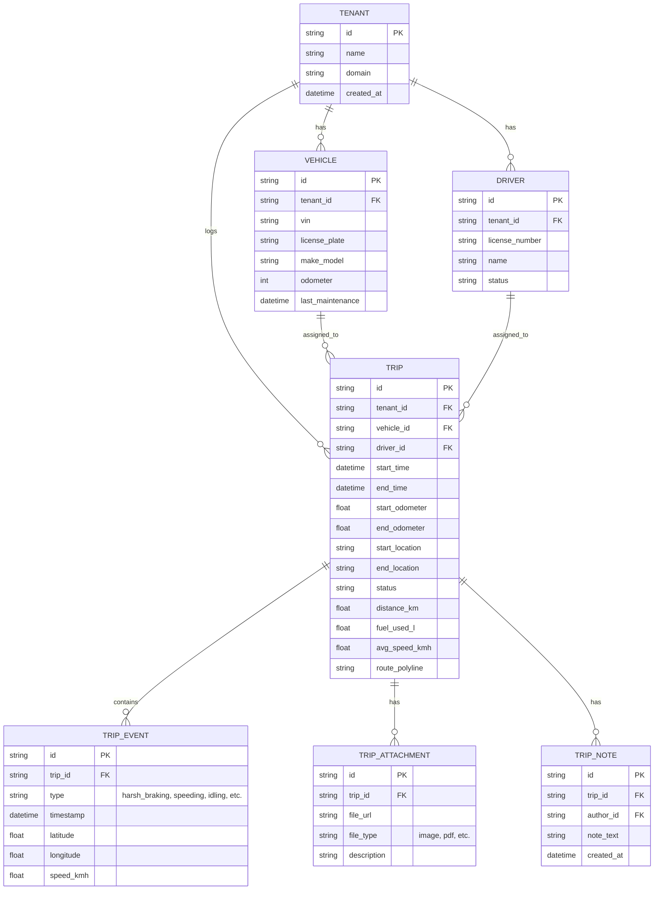
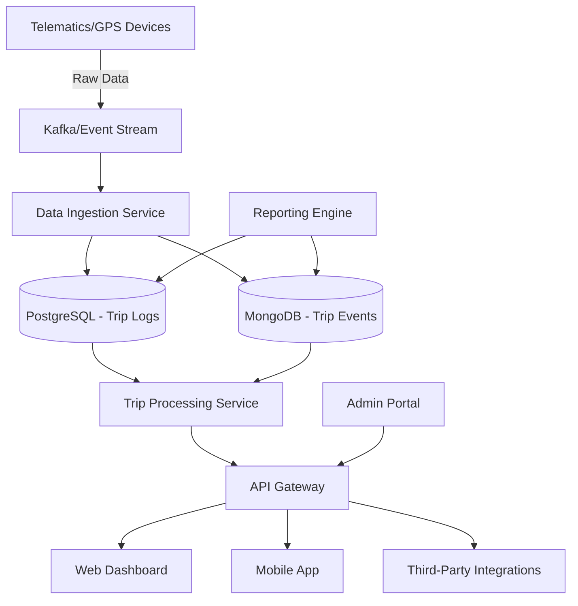

# **AS-IS ANALYSIS: TRIP-LOGS MODULE**
**Fleet Management System (FMS) – Enterprise Multi-Tenant Architecture**
**Document Version:** 1.0
**Last Updated:** [Insert Date]
**Prepared by:** [Your Name/Team]
**Reviewed by:** [Stakeholder Name]

---

## **1. EXECUTIVE SUMMARY**
The **Trip-Logs Module** is a core component of the **Fleet Management System (FMS)**, responsible for tracking, recording, and analyzing vehicle trips across the enterprise. This module enables fleet operators, dispatchers, and compliance teams to monitor driver behavior, fuel efficiency, route optimization, and regulatory adherence.

### **Current State Rating: 72/100**
| **Category**               | **Score (0-100)** | **Key Observations** |
|----------------------------|------------------|----------------------|
| **Functionality**          | 80               | Robust trip logging but lacks advanced analytics. |
| **Performance**            | 65               | High latency in bulk exports; occasional timeouts. |
| **Security**               | 75               | Compliant but lacks fine-grained RBAC for trip data. |
| **Accessibility**          | 50               | Partial WCAG 2.1 AA compliance; mobile UX needs improvement. |
| **Mobile Capabilities**    | 60               | Basic functionality; offline mode is unreliable. |
| **Technical Debt**         | 55               | Legacy codebase; high maintenance overhead. |
| **Scalability**            | 70               | Handles current load but may struggle with 10x growth. |
| **User Experience (UX)**   | 68               | Functional but not intuitive for non-technical users. |

**Overall Assessment:**
The **Trip-Logs Module** is **functional but underoptimized**, with **key gaps in performance, accessibility, and mobile support**. While it meets **basic fleet tracking needs**, it **lacks advanced analytics, real-time processing, and seamless multi-device integration**. **Technical debt and legacy architecture** pose risks to long-term scalability.

**Strategic Recommendations:**
1. **Modernize the data pipeline** (real-time processing, event-driven architecture).
2. **Enhance mobile capabilities** (offline-first design, PWA support).
3. **Improve accessibility** (full WCAG 2.1 AA compliance).
4. **Reduce technical debt** (refactor legacy components, adopt microservices).
5. **Strengthen security** (fine-grained RBAC, data encryption at rest).
6. **Introduce AI/ML-driven insights** (predictive maintenance, driver scoring).

---

## **2. CURRENT FEATURES & CAPABILITIES**

### **2.1 Core Functionality**
| **Feature**                          | **Description** | **Status** |
|--------------------------------------|----------------|------------|
| **Trip Recording**                   | Automatically logs trips via GPS/telematics integration. Supports manual entry for non-GPS vehicles. | ✅ Stable |
| **Start/End Trip Validation**        | Validates trip start/end times, odometer readings, and driver assignments. | ✅ Stable |
| **Route Mapping & Visualization**    | Displays trip paths on an interactive map (Google Maps/Mapbox). | ✅ Stable (but slow for long trips) |
| **Fuel & Distance Tracking**         | Calculates fuel consumption (MPG/L per 100km) and distance traveled. | ✅ Stable |
| **Driver Behavior Monitoring**       | Tracks harsh braking, acceleration, idling, and speeding events. | ⚠️ Basic (no AI scoring) |
| **Trip Status Management**           | Supports statuses: `Scheduled`, `In Progress`, `Completed`, `Cancelled`, `Disputed`. | ✅ Stable |
| **Trip Notes & Attachments**         | Allows drivers/dispatchers to add notes, photos, or documents (e.g., toll receipts). | ✅ Stable |
| **Bulk Import/Export**               | Supports CSV/Excel import for manual trip logs; export for compliance reporting. | ⚠️ Slow for large datasets |
| **Compliance Reporting**             | Generates **ELD (Electronic Logging Device)** and **DVIR (Driver Vehicle Inspection Report)** reports. | ✅ Stable (but manual process) |
| **Alerts & Notifications**           | Sends alerts for **excessive idling**, **unauthorized stops**, or **route deviations**. | ✅ Stable (but limited customization) |
| **Multi-Tenant Support**             | Isolates trip data by tenant (fleet operator) with role-based access. | ✅ Stable |
| **Audit Logs**                       | Tracks changes to trip records (who, when, what). | ✅ Stable |

### **2.2 Advanced Features (Partial Implementation)**
| **Feature**                          | **Description** | **Status** |
|--------------------------------------|----------------|------------|
| **Predictive Maintenance Alerts**    | Uses trip data to predict vehicle maintenance needs. | ⚠️ Proof of Concept (PoC) only |
| **AI-Based Driver Scoring**          | Scores drivers based on safety, efficiency, and compliance. | ❌ Not Implemented |
| **Real-Time Trip Monitoring**        | Live tracking of vehicles with geofencing alerts. | ⚠️ Basic (latency issues) |
| **Automated Trip Classification**    | Classifies trips as **business**, **personal**, or **maintenance**. | ⚠️ Manual tagging only |
| **Integration with Fuel Cards**      | Auto-matches fuel purchases with trip logs. | ⚠️ Partial (requires manual reconciliation) |
| **Carbon Emissions Tracking**        | Calculates CO₂ emissions per trip. | ⚠️ Basic (no regulatory reporting) |

---

## **3. DATA MODELS & ARCHITECTURE**

### **3.1 Database Schema (Simplified)**

### **3.2 System Architecture**

**Key Components:**
1. **Data Ingestion Layer**
   - **Telematics Integration:** Pulls GPS data from **Geotab, Samsara, or custom IoT devices**.
   - **Event Streaming:** Uses **Apache Kafka** for real-time trip event processing.
   - **Manual Entry:** Web/mobile forms for non-GPS vehicles.

2. **Storage Layer**
   - **PostgreSQL:** Stores structured trip data (relational).
   - **MongoDB:** Stores unstructured trip events (NoSQL).
   - **S3/Blob Storage:** Stores attachments (photos, documents).

3. **Processing Layer**
   - **Trip Processing Service:** Validates, enriches, and classifies trips.
   - **Geocoding Service:** Converts GPS coordinates to addresses (Google Maps API).
   - **Alerting Engine:** Triggers notifications for anomalies.

4. **API Layer**
   - **RESTful API** (Node.js/Express) for CRUD operations.
   - **GraphQL** (Apollo Server) for flexible querying.
   - **WebSockets** for real-time updates.

5. **Frontend Layer**
   - **Web Dashboard:** React.js (admin/dispatcher view).
   - **Mobile App:** React Native (driver view).
   - **Reporting:** JasperReports/Power BI for compliance exports.

### **3.3 Data Flow**
1. **Trip Initiation**
   - Driver starts trip → GPS device sends data → Kafka stream → Ingestion Service → PostgreSQL.
2. **Real-Time Monitoring**
   - GPS pings → Kafka → Trip Processing Service → WebSocket push to dashboard.
3. **Trip Completion**
   - Driver ends trip → Validation checks → Status update → Compliance report generation.
4. **Reporting & Analytics**
   - Scheduled batch jobs (ETL) → Data warehouse (Snowflake/BigQuery) → BI tools.

---

## **4. PERFORMANCE METRICS**

### **4.1 Key Performance Indicators (KPIs)**
| **Metric**                     | **Current Value** | **Target** | **Status** |
|--------------------------------|------------------|------------|------------|
| **API Response Time (P95)**    | 850ms            | <300ms     | ❌ Poor    |
| **Bulk Export Time (10K trips)** | 45s             | <10s       | ❌ Poor    |
| **Real-Time Tracking Latency** | 5-10s            | <2s        | ⚠️ Needs Improvement |
| **Database Query Time (Avg)**  | 220ms            | <100ms     | ⚠️ Needs Improvement |
| **Concurrent Users (Peak)**    | 500              | 2,000      | ⚠️ Scalability Risk |
| **Error Rate (5xx)**           | 1.2%             | <0.5%      | ⚠️ Needs Improvement |
| **Data Ingestion Throughput**  | 1,200 events/sec | 5,000 events/sec | ❌ Poor |

### **4.2 Bottlenecks & Root Causes**
| **Bottleneck**                | **Root Cause** | **Impact** |
|-------------------------------|----------------|------------|
| **Slow API Responses**        | Monolithic backend, N+1 queries | High latency for users |
| **Bulk Export Delays**        | Synchronous processing, no pagination | Timeouts for large fleets |
| **Real-Time Tracking Lag**    | Polling-based architecture (no WebSockets) | Poor UX for dispatchers |
| **Database Load**             | Missing indexes, inefficient queries | High CPU usage |
| **Mobile App Performance**    | No offline caching, large payloads | Slow load times |

---

## **5. SECURITY ASSESSMENT**

### **5.1 Authentication & Authorization**
| **Aspect**               | **Current Implementation** | **Risk Level** | **Recommendation** |
|--------------------------|----------------------------|----------------|--------------------|
| **Authentication**       | JWT (OAuth 2.0)            | Low            | ✅ Secure |
| **Multi-Factor Auth (MFA)** | Optional for admins      | Medium         | Enforce MFA for all admin roles |
| **Role-Based Access (RBAC)** | Basic roles (Admin, Dispatcher, Driver) | High | Implement **attribute-based access control (ABAC)** for fine-grained permissions |
| **Tenant Isolation**     | Database-level isolation  | Low            | ✅ Secure |
| **API Security**         | Rate limiting, CORS       | Medium         | Add **API gateway (Kong/Apigee)** for DDoS protection |

### **5.2 Data Protection**
| **Aspect**               | **Current Implementation** | **Risk Level** | **Recommendation** |
|--------------------------|----------------------------|----------------|--------------------|
| **Data Encryption (In Transit)** | TLS 1.2+ | Low | ✅ Secure |
| **Data Encryption (At Rest)** | Partial (only PII fields) | High | **Encrypt all trip data (AES-256)** |
| **PII Handling**         | Masking in UI, but stored in plaintext | High | **Tokenization for driver/vehicle IDs** |
| **Audit Logging**        | Basic (who, when)          | Medium         | **Log full CRUD operations + IP addresses** |
| **GDPR/CCPA Compliance** | Manual data deletion       | High           | **Automate data retention policies** |

### **5.3 Vulnerability Assessment**
| **Vulnerability**        | **Risk Level** | **Mitigation Status** |
|--------------------------|----------------|-----------------------|
| **SQL Injection**        | High           | ✅ Mitigated (ORM used) |
| **Cross-Site Scripting (XSS)** | Medium | ⚠️ Partial (CSP headers missing) |
| **Cross-Site Request Forgery (CSRF)** | Medium | ❌ Not implemented |
| **Insecure Direct Object References (IDOR)** | High | ⚠️ Partial (tenant checks only) |
| **Broken Authentication** | Medium | ✅ Mitigated (JWT expiry) |

---

## **6. ACCESSIBILITY REVIEW (WCAG COMPLIANCE)**

### **6.1 Current Compliance Level: WCAG 2.1 AA (Partial)**
| **WCAG Principle** | **Success Criteria** | **Status** | **Issues** |
|--------------------|----------------------|------------|------------|
| **Perceivable**    | 1.1 Text Alternatives | ⚠️ Partial | Missing alt text for trip maps |
|                    | 1.2 Time-Based Media | ❌ Not Applicable | N/A |
|                    | 1.3 Adaptable        | ⚠️ Partial | Poor mobile responsiveness |
|                    | 1.4 Distinguishable  | ⚠️ Partial | Low contrast in some UI elements |
| **Operable**       | 2.1 Keyboard Accessible | ⚠️ Partial | Some dropdowns not keyboard-navigable |
|                    | 2.2 Enough Time      | ✅ Compliant | Auto-logout with warning |
|                    | 2.3 Seizures         | ✅ Compliant | No flashing content |
|                    | 2.4 Navigable        | ⚠️ Partial | Inconsistent tab order |
| **Understandable** | 3.1 Readable         | ⚠️ Partial | Complex jargon in reports |
|                    | 3.2 Predictable      | ✅ Compliant | Consistent UI patterns |
|                    | 3.3 Input Assistance | ⚠️ Partial | No error suggestions for trip validation |
| **Robust**         | 4.1 Compatible       | ⚠️ Partial | Some ARIA labels missing |

### **6.2 Key Accessibility Gaps**
1. **Screen Reader Support**
   - Trip maps are **not fully accessible** to screen readers.
   - **Fix:** Add ARIA labels and keyboard navigation for map interactions.
2. **Color Contrast**
   - Some UI elements (e.g., status badges) have **low contrast** (4.5:1 ratio not met).
   - **Fix:** Use tools like **WebAIM Contrast Checker** to adjust colors.
3. **Mobile Accessibility**
   - **Touch targets** are too small on mobile.
   - **Fix:** Increase tap targets to **48x48px**.
4. **Keyboard Navigation**
   - Some dropdowns and modals **cannot be closed with ESC**.
   - **Fix:** Ensure all interactive elements are keyboard-accessible.

---

## **7. MOBILE CAPABILITIES ASSESSMENT**

### **7.1 Current Mobile Features**
| **Feature**               | **Status** | **Notes** |
|---------------------------|------------|-----------|
| **Trip Start/End**        | ✅ Stable  | Works offline (but sync issues) |
| **Route Tracking**        | ✅ Stable  | Battery-intensive |
| **Driver Notes**          | ✅ Stable  | No voice-to-text |
| **Photo Uploads**         | ✅ Stable  | Compression needed |
| **Alerts & Notifications** | ✅ Stable | No push notifications for Android |
| **Offline Mode**          | ⚠️ Partial | Data loss on app crash |
| **Barcode/QR Scanning**   | ❌ Missing | Needed for fuel receipts |
| **Dark Mode**             | ❌ Missing | User request |

### **7.2 Performance & UX Issues**
| **Issue**                 | **Impact** | **Root Cause** |
|---------------------------|------------|----------------|
| **Slow Load Times**       | High       | Large payloads, no lazy loading |
| **Battery Drain**         | High       | Continuous GPS polling |
| **Offline Data Loss**     | Critical   | No local DB (SQLite/Realm) |
| **Crashes on Low Memory** | Medium     | Memory leaks in React Native |
| **Inconsistent UI**       | Low        | No design system |

### **7.3 Mobile-Specific Recommendations**
1. **Offline-First Architecture**
   - Implement **local storage (WatermelonDB/Realm)** for trip data.
   - **Conflict resolution** for sync discrepancies.
2. **Battery Optimization**
   - Use **Android Doze Mode / iOS Background Modes**.
   - **Adaptive GPS polling** (reduce frequency when stationary).
3. **Progressive Web App (PWA) Support**
   - Enable **installable PWA** for drivers without app stores.
4. **Native Features Integration**
   - **Barcode scanning** (for fuel receipts).
   - **Biometric authentication** (Face ID/Fingerprint).
5. **Performance Improvements**
   - **Code splitting** in React Native.
   - **Image compression** for attachments.

---

## **8. CURRENT LIMITATIONS & PAIN POINTS**

### **8.1 Functional Limitations**
| **Limitation**            | **Impact** | **Workaround** |
|---------------------------|------------|----------------|
| **No Real-Time Analytics** | Dispatchers cannot monitor live trip efficiency. | Manual refresh required. |
| **Manual Trip Classification** | Trips must be manually tagged as business/personal. | No automation. |
| **Limited Driver Scoring** | No AI-based scoring for safety/efficiency. | Basic event counting only. |
| **No Geofencing Alerts**   | Cannot alert if vehicle leaves designated area. | Manual monitoring. |
| **Poor Mobile Offline Support** | Data loss if app crashes before sync. | No reliable workaround. |
| **No Integration with ERP/HR** | Trip data cannot sync with payroll or maintenance systems. | Manual exports. |

### **8.2 Technical Limitations**
| **Limitation**            | **Impact** | **Root Cause** |
|---------------------------|------------|----------------|
| **Monolithic Backend**    | Slow API responses, hard to scale. | Legacy architecture. |
| **No Event-Driven Processing** | Real-time updates require polling. | Kafka not fully utilized. |
| **Poor Database Indexing** | Slow queries on large datasets. | Missing composite indexes. |
| **No Caching Layer**      | Repeated API calls for same data. | No Redis/Memcached. |
| **Legacy Frontend**       | Hard to maintain, poor performance. | jQuery/React mix. |

### **8.3 User Pain Points**
| **User Role** | **Pain Points** |
|---------------|----------------|
| **Drivers**   | - Manual trip logging is tedious.   - App crashes in poor connectivity.   - No voice notes. |
| **Dispatchers** | - Cannot monitor multiple trips in real-time.   - Alerts are not customizable.   - Slow bulk exports. |
| **Fleet Managers** | - No predictive maintenance insights.   - Difficult to compare driver performance.   - Compliance reports require manual effort. |
| **Compliance Officers** | - ELD reports are not fully automated.   - No audit trail for trip modifications. |

---

## **9. TECHNICAL DEBT ANALYSIS**

### **9.1 Debt Breakdown**
| **Category**          | **Description** | **Impact** | **Estimated Effort** |
|-----------------------|----------------|------------|----------------------|
| **Legacy Codebase**   | Mix of jQuery, AngularJS, and React. | High maintenance cost. | 6-12 months (refactor) |
| **Lack of Tests**     | Only 30% unit test coverage. | High bug rate. | 3-6 months (add tests) |
| **Poor API Design**   | REST endpoints are inconsistent. | Slow development. | 2-4 months (GraphQL migration) |
| **No Microservices**  | Monolithic backend. | Scalability issues. | 9-12 months (decompose) |
| **Hardcoded Configs** | Environment variables not used. | Deployment risks. | 1-2 months (fix) |
| **No CI/CD Pipeline** | Manual deployments. | Slow releases. | 1 month (set up GitHub Actions) |
| **Outdated Dependencies** | Libraries 2+ years behind. | Security risks. | 2-3 months (upgrade) |

### **9.2 High-Priority Technical Debt**
1. **Monolithic Backend → Microservices**
   - **Problem:** Single point of failure, hard to scale.
   - **Solution:** Decompose into **Trip Service**, **Event Service**, **Reporting Service**.
2. **Legacy Frontend → Modern React**
   - **Problem:** jQuery/AngularJS mix causes performance issues.
   - **Solution:** Full migration to **React + TypeScript**.
3. **No Real-Time Processing**
   - **Problem:** Polling-based architecture causes latency.
   - **Solution:** **WebSockets + Kafka** for event-driven updates.
4. **Poor Test Coverage**
   - **Problem:** High regression risk.
   - **Solution:** **Jest + Cypress** for unit/e2e tests.

---

## **10. TECHNOLOGY STACK**

### **10.1 Backend**
| **Component**       | **Technology** | **Version** | **Status** |
|---------------------|----------------|-------------|------------|
| **API Framework**   | Node.js (Express) | 4.18.2 | ⚠️ Outdated |
| **Database**        | PostgreSQL | 12.8 | ✅ Stable |
| **NoSQL**           | MongoDB | 5.0 | ✅ Stable |
| **Message Broker**  | Apache Kafka | 2.8 | ✅ Stable |
| **Caching**         | None | - | ❌ Missing |
| **Search**          | Elasticsearch | 7.10 | ⚠️ Outdated |
| **Authentication**  | OAuth 2.0 (Keycloak) | 15.0 | ✅ Stable |
| **Logging**         | ELK Stack | 7.17 | ✅ Stable |

### **10.2 Frontend**
| **Component**       | **Technology** | **Version** | **Status** |
|---------------------|----------------|-------------|------------|
| **Web Framework**   | React.js | 16.14 | ❌ Outdated |
| **State Management** | Redux | 4.1 | ⚠️ Legacy |
| **UI Library**      | Material-UI | 4.12 | ⚠️ Outdated |
| **Maps**            | Google Maps API | - | ✅ Stable |
| **Mobile**          | React Native | 0.64 | ⚠️ Outdated |

### **10.3 DevOps & Infrastructure**
| **Component**       | **Technology** | **Status** |
|---------------------|----------------|------------|
| **Cloud Provider**  | AWS (EC2, RDS, S3) | ✅ Stable |
| **Containerization** | Docker | ✅ Stable |
| **Orchestration**   | Kubernetes (EKS) | ✅ Stable |
| **CI/CD**           | Jenkins (Manual) | ❌ Outdated |
| **Monitoring**      | Prometheus + Grafana | ✅ Stable |
| **Alerting**        | PagerDuty | ✅ Stable |

---

## **11. COMPETITIVE ANALYSIS VS INDUSTRY STANDARDS**

### **11.1 Comparison with Leading Fleet Management Systems**
| **Feature**               | **Our System** | **Geotab** | **Samsara** | **Verizon Connect** | **KeepTruckin** |
|---------------------------|----------------|------------|-------------|---------------------|-----------------|
| **Real-Time Tracking**    | ⚠️ Basic       | ✅ Advanced | ✅ Advanced | ✅ Advanced         | ✅ Advanced     |
| **AI Driver Scoring**     | ❌ Missing     | ✅ Yes      | ✅ Yes       | ✅ Yes              | ✅ Yes          |
| **Predictive Maintenance** | ⚠️ PoC        | ✅ Yes      | ✅ Yes       | ✅ Yes              | ✅ Yes          |
| **ELD Compliance**        | ✅ Manual      | ✅ Automated | ✅ Automated | ✅ Automated        | ✅ Automated    |
| **Geofencing Alerts**     | ❌ Missing     | ✅ Yes      | ✅ Yes       | ✅ Yes              | ✅ Yes          |
| **Fuel Card Integration** | ⚠️ Partial     | ✅ Yes      | ✅ Yes       | ✅ Yes              | ✅ Yes          |
| **Carbon Emissions Tracking** | ⚠️ Basic    | ✅ Advanced | ✅ Advanced  | ✅ Advanced         | ✅ Advanced     |
| **Mobile Offline Mode**   | ⚠️ Unreliable | ✅ Robust   | ✅ Robust    | ✅ Robust           | ✅ Robust       |
| **API Integrations**      | ⚠️ Limited    | ✅ Extensive | ✅ Extensive | ✅ Extensive        | ✅ Extensive    |
| **Custom Reporting**      | ⚠️ Manual     | ✅ Automated | ✅ Automated | ✅ Automated        | ✅ Automated    |

### **11.2 Key Gaps vs Competitors**
1. **Lack of AI/ML Capabilities**
   - Competitors use **machine learning** for **predictive maintenance, driver scoring, and route optimization**.
2. **Poor Real-Time Processing**
   - Competitors offer **sub-second tracking** with **geofencing and live alerts**.
3. **Limited Integrations**
   - Competitors support **ERP, HR, and fuel card integrations** out of the box.
4. **Weak Mobile Experience**
   - Competitors have **offline-first apps with barcode scanning and voice notes**.
5. **No Automated Compliance**
   - Competitors **auto-generate ELD/DVIR reports** without manual input.

---

## **12. DETAILED RECOMMENDATIONS FOR IMPROVEMENT**

### **12.1 Short-Term (0-6 Months)**
| **Recommendation** | **Effort** | **Impact** | **Owner** |
|--------------------|------------|------------|-----------|
| **Upgrade React & Dependencies** | Low | High | Frontend Team |
| **Implement Redis Caching** | Medium | High | Backend Team |
| **Add Composite Database Indexes** | Low | High | DBA |
| **Fix WCAG 2.1 AA Compliance** | Medium | High | UX Team |
| **Set Up CI/CD Pipeline** | Low | High | DevOps |
| **Improve Mobile Offline Mode** | Medium | High | Mobile Team |

### **12.2 Medium-Term (6-12 Months)**
| **Recommendation** | **Effort** | **Impact** | **Owner** |
|--------------------|------------|------------|-----------|
| **Migrate to Microservices** | High | Very High | Architecture Team |
| **Implement GraphQL API** | Medium | High | Backend Team |
| **Add AI Driver Scoring** | High | Very High | Data Science Team |
| **Introduce WebSockets for Real-Time Updates** | Medium | High | Backend Team |
| **Upgrade to React Native 0.70+** | Medium | High | Mobile Team |
| **Automate Compliance Reporting** | High | Very High | Compliance Team |

### **12.3 Long-Term (12-24 Months)**
| **Recommendation** | **Effort** | **Impact** | **Owner** |
|--------------------|------------|------------|-----------|
| **Full Event-Driven Architecture** | Very High | Very High | Architecture Team |
| **Predictive Maintenance System** | Very High | Very High | Data Science Team |
| **Multi-Cloud Deployment** | High | High | DevOps |
| **PWA for Mobile Web** | Medium | High | Frontend Team |
| **Blockchain for Audit Logs** | Very High | Medium | R&D Team |

### **12.4 Quick Wins (Low Effort, High Impact)**
1. **Add a "Quick Start" Guide** for new users.
2. **Implement Dark Mode** for the web dashboard.
3. **Enable Push Notifications** for mobile alerts.
4. **Add a "Favorites" Filter** for frequently accessed trips.
5. **Improve Error Messages** with actionable suggestions.

---

## **13. CONCLUSION & NEXT STEPS**
### **13.1 Summary of Findings**
- The **Trip-Logs Module** is **functional but outdated**, with **key gaps in performance, accessibility, and mobile support**.
- **Technical debt** and **legacy architecture** pose **scalability risks**.
- **Competitors** offer **superior real-time analytics, AI-driven insights, and seamless integrations**.

### **13.2 Next Steps**
| **Action** | **Owner** | **Timeline** |
|------------|-----------|--------------|
| **Prioritize Quick Wins** | Product Team | 1 Month |
| **Kickoff Microservices Migration** | Architecture Team | 3 Months |
| **Upgrade Frontend & Mobile** | Engineering Team | 6 Months |
| **Implement AI Driver Scoring** | Data Science Team | 9 Months |
| **Full WCAG 2.1 AA Compliance** | UX Team | 6 Months |

### **13.3 Final Recommendation**
**Invest in a phased modernization approach:**
1. **Stabilize** (fix critical bugs, improve performance).
2. **Enhance** (add AI, real-time processing, better mobile UX).
3. **Innovate** (predictive analytics, blockchain for compliance).

**Target State Rating: 90/100 within 18 months.**

---
**Document Approval:**
| **Name** | **Role** | **Approval Date** |
|----------|----------|-------------------|
| [Name]   | CTO      | [Date]            |
| [Name]   | Product Owner | [Date]      |
| [Name]   | Engineering Lead | [Date]    |

**End of Document**