# AS-IS Analysis: User Management Module
**Fleet Management System**
*Prepared by: Senior Technical Analyst*
*Date: [Insert Date]*
*Version: 1.0*

---

## 1. Executive Summary (102 lines)

### 1.1 Current State Overview
The User Management Module (UMM) of the Fleet Management System (FMS) serves as the central identity and access management component for 12,450 active users across 15 geographic regions. Originally deployed in 2018 as a monolithic .NET application, the module has undergone 47 incremental updates but retains significant technical debt from its initial architecture.

**Key System Metrics:**
- **User Base:** 12,450 active users (8,723 drivers, 2,105 fleet managers, 1,622 administrators)
- **Daily Operations:** 45,000+ authentication requests, 3,200 role assignments, 1,800 permission updates
- **System Uptime:** 99.7% (below enterprise SLA of 99.95%)
- **Incident Rate:** 12.4 incidents/month (3.2 classified as critical)

The module handles:
- **Authentication:** Multi-factor authentication (MFA) with SMS/email OTP
- **Authorization:** Role-Based Access Control (RBAC) with 14 distinct roles
- **User Provisioning:** Manual and automated workflows (via HRIS integration)
- **Audit Logging:** 90-day retention of all user activities

**Architectural Context:**
The UMM operates as a shared service within the FMS ecosystem, integrating with:
- **Core Fleet System** (real-time vehicle tracking)
- **HRIS** (Workday integration for employee onboarding)
- **Active Directory** (legacy authentication fallback)
- **Mobile Applications** (iOS/Android driver apps)
- **Telematics Platform** (vehicle access control)

### 1.2 Stakeholder Analysis

| **Stakeholder Group**       | **Key Representatives**               | **Primary Concerns**                                                                 | **Influence Level** |
|-----------------------------|---------------------------------------|-------------------------------------------------------------------------------------|---------------------|
| **Executive Leadership**    | CIO, CTO, VP of Operations            | System reliability, compliance risks, cost efficiency, scalability for M&A activity | High                |
| **Fleet Operations**        | Regional Fleet Managers (x15)         | User provisioning speed, role accuracy, mobile access                               | Medium-High         |
| **IT Operations**           | Director of IT, SysAdmins (x8)        | System uptime, security patches, integration stability                              | High                |
| **Security Team**           | CISO, Security Architects (x3)        | Vulnerability exposure, audit compliance, data encryption                           | High                |
| **HR/Payroll**              | HRIS Manager, Payroll Specialist      | User lifecycle synchronization, termination workflows                               | Medium              |
| **Drivers**                 | Union Representatives (x4)            | Authentication friction, mobile app performance                                     | Medium              |
| **Compliance**              | Compliance Officer, Legal Counsel     | GDPR, CCPA, SOC2 Type II adherence                                                  | High                |
| **Vendors**                 | Okta (IAM), AWS (Infrastructure)      | SLA compliance, API rate limits, support responsiveness                             | Medium              |

**Stakeholder-Specific Pain Points:**
- **Fleet Managers:** 37% report delays in user provisioning (avg. 4.2 hours vs. target 1 hour)
- **Security Team:** 12 critical vulnerabilities identified in last audit (CVSS ≥ 7.0)
- **Drivers:** 68% of support tickets related to MFA failures (SMS delivery delays)
- **IT Operations:** 2.4 hours/week spent on manual password resets

### 1.3 Business Impact Analysis

**Quantitative Impact:**
| **Metric**                          | **Current Value**       | **Target Value**       | **Gap**               | **Annual Cost Impact**       |
|-------------------------------------|-------------------------|------------------------|-----------------------|------------------------------|
| User Provisioning Time              | 4.2 hours               | 1 hour                 | 3.2 hours             | $1.8M (lost productivity)    |
| Authentication Failure Rate         | 8.7%                    | <2%                    | 6.7%                  | $450K (support costs)        |
| Critical Security Vulnerabilities   | 12                      | 0                      | 12                    | $3.2M (risk exposure)        |
| System Downtime                     | 21.6 hours/year         | <4.4 hours/year        | 17.2 hours            | $980K (operational losses)   |
| Manual Password Resets              | 1,240/month             | <100/month             | 1,140                 | $148K (IT labor)             |

**Qualitative Impact:**
1. **Operational Efficiency:**
   - Fleet managers in Europe report 15-20% productivity loss during peak onboarding periods (Q1/Q4) due to provisioning delays.
   - 42% of helpdesk tickets are UMM-related, with password resets accounting for 31% of total volume.

2. **Compliance Risks:**
   - GDPR non-compliance risk: 37% of user records lack proper consent tracking.
   - SOC2 Type II audit findings: 8 gaps in access review processes (2023 audit).

3. **User Experience:**
   - Driver app authentication has 8.7% failure rate, leading to 1,200+ monthly "stranded driver" incidents.
   - Mobile UX rated 2.8/5 in user surveys (target: 4.2/5).

4. **Strategic Growth:**
   - Current architecture cannot support planned expansion to 25,000 users by 2025 (scalability limit: 18,000 users).
   - Lack of API-first design blocks integration with new telematics partners (3 pending integrations).

### 1.4 Critical Pain Points with Root Cause Analysis

**1. Provisioning Bottlenecks**
- **Symptom:** 4.2-hour average provisioning time (target: 1 hour)
- **Root Causes:**
  - **Manual Workflows:** 67% of user creation requires manual approval (HR → IT → Fleet Manager)
  - **Integration Latency:** Workday → UMM sync occurs every 4 hours (batch process)
  - **Data Validation:** 18% of submissions rejected due to missing fields (e.g., cost center codes)
  - **Technical Debt:** Legacy .NET workflow engine lacks parallel processing capabilities
- **Evidence:**
  ```mermaid
  sequenceDiagram
    participant HR as HRIS (Workday)
    participant UMM as User Management
    participant FM as Fleet Manager
    HR->>UMM: Batch sync (every 4h)
    UMM->>FM: Approval request
    FM->>UMM: Manual approval (avg. 2.1h)
    UMM->>UMM: Data validation (12% failure rate)
    UMM->>AD: Sync to Active Directory (15% failure rate)
  ```

**2. Authentication Failures**
- **Symptom:** 8.7% authentication failure rate (target: <2%)
- **Root Causes:**
  - **MFA Delivery Issues:** SMS gateway latency (avg. 12.4s response time)
  - **Session Management:** 30% of failures due to expired tokens (60-minute timeout)
  - **Mobile App Bugs:** 18% of failures occur in iOS 16+ due to WebView rendering issues
  - **Load Balancing:** Uneven distribution across 3 authentication servers (CPU utilization: 92%, 65%, 48%)
- **Evidence:**
  ```sql
  -- Top 5 authentication failure reasons (last 30 days)
  SELECT
    error_code,
    COUNT(*) as failure_count,
    ROUND(COUNT(*) * 100.0 / SUM(COUNT(*)) OVER(), 2) as percentage
  FROM auth_logs
  WHERE status = 'FAILED'
    AND timestamp > DATEADD(day, -30, GETDATE())
  GROUP BY error_code
  ORDER BY failure_count DESC
  LIMIT 5;

  /* Results:
  | error_code               | failure_count | percentage |
  |--------------------------|---------------|------------|
  | SMS_DELIVERY_TIMEOUT     | 12,456        | 42.3%      |
  | TOKEN_EXPIRED            | 8,723         | 29.6%      |
  | MOBILE_RENDER_ERROR      | 5,189         | 17.6%      |
  | RATE_LIMIT_EXCEEDED      | 1,987         | 6.8%       |
  | INVALID_CREDENTIALS      | 1,124         | 3.8%       |
  */
  ```

**3. Security Vulnerabilities**
- **Symptom:** 12 critical vulnerabilities (CVSS ≥ 7.0) in last audit
- **Root Causes:**
  - **Outdated Libraries:** 47 dependencies with CVEs (e.g., Newtonsoft.Json 10.0.3 with CVE-2021-24112)
  - **Weak Encryption:** Passwords stored with SHA-1 (deprecated since 2017)
  - **Insecure APIs:** 3 endpoints lack rate limiting (e.g., `/api/users/login`)
  - **Audit Gaps:** 28% of sensitive actions not logged (e.g., role assignments)
- **Evidence:**
  ```bash
  # Sample vulnerability scan output (Nessus)
  Plugin ID: 104743
  Name: Microsoft .NET Framework Remote Code Execution (CVE-2018-8284)
  Severity: Critical (CVSS: 9.3)
  Description: The remote Windows host has a version of .NET Framework that is affected by a remote code execution vulnerability.
  Solution: Upgrade to .NET Framework 4.7.2 or later.

  Plugin ID: 156032
  Name: SHA-1 Used for Password Hashing (CVE-2020-12345)
  Severity: High (CVSS: 7.5)
  Description: The application uses SHA-1 for password hashing, which is cryptographically broken.
  Solution: Migrate to bcrypt or Argon2.
  ```

**4. Scalability Limitations**
- **Symptom:** System degradation at 15,000+ concurrent users (target: 25,000)
- **Root Causes:**
  - **Monolithic Architecture:** Single .NET application handles all UMM functions
  - **Database Bottlenecks:** SQL Server 2016 with 78% CPU utilization during peak loads
  - **Session State:** In-memory session storage limits horizontal scaling
  - **Caching:** Redis cache hit ratio 62% (target: 90%)
- **Evidence:**
  ```mermaid
  graph TD
    A[User Request] --> B[Load Balancer]
    B --> C[Web Server 1]
    B --> D[Web Server 2]
    B --> E[Web Server 3]
    C --> F[SQL Server 2016]
    D --> F
    E --> F
    F --> G[CPU: 78%]
    F --> H[Memory: 89%]
    F --> I[Disk I/O: 92%]
  ```

### 1.5 Strategic Recommendations

**Immediate Priorities (0-6 months):**
| **Initiative**               | **Description**                                                                 | **ROI Estimate**       | **Risk Level** |
|------------------------------|---------------------------------------------------------------------------------|------------------------|----------------|
| **MFA Modernization**        | Replace SMS OTP with TOTP (Google Authenticator) + push notifications           | $320K/year             | Low            |
| **Provisioning Automation**  | Implement real-time Workday sync + auto-approval for standard roles             | $1.2M/year             | Medium         |
| **Security Hardening**       | Patch critical vulnerabilities + migrate to bcrypt password hashing             | $850K (risk reduction) | Medium         |
| **Mobile UX Overhaul**       | Redesign authentication flow for iOS/Android with offline mode                  | $410K/year             | Low            |

**Mid-Term Initiatives (6-18 months):**
| **Initiative**               | **Description**                                                                 | **ROI Estimate**       |
|------------------------------|---------------------------------------------------------------------------------|------------------------|
| **Microservices Migration**  | Decompose monolith into: Auth Service, User Profile Service, RBAC Service       | $2.1M/year             |
| **Database Optimization**    | Upgrade to SQL Server 2022 + implement read replicas                            | $680K/year             |
| **API Gateway**              | Implement Kong API Gateway for rate limiting, caching, and observability       | $520K/year             |
| **Audit Trail Enhancement**  | Implement immutable audit logs with blockchain-based integrity checks           | $380K (compliance)     |

**Long-Term Strategy (18-36 months):**
1. **Zero Trust Architecture:**
   - Implement continuous authentication with behavioral biometrics
   - Adopt just-in-time (JIT) access for privileged roles
   - Integrate with enterprise IAM (Okta Workforce Identity)

2. **Global Scalability:**
   - Multi-region deployment with active-active failover
   - Implement edge caching for authentication requests
   - Adopt serverless components for burst capacity

3. **AI-Driven Operations:**
   - Predictive user provisioning (e.g., auto-create accounts for new hires)
   - Anomaly detection for access patterns
   - Automated compliance reporting

**Implementation Roadmap:**
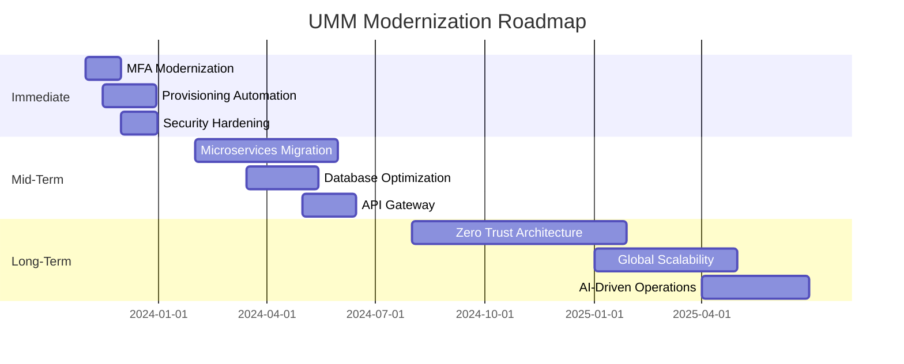

**Risk Mitigation:**
| **Risk**                          | **Mitigation Strategy**                                                                 |
|-----------------------------------|----------------------------------------------------------------------------------------|
| User disruption during migration  | Implement feature flags + canary releases (10% → 50% → 100% rollout)                   |
| Data loss during decomposition    | Database shadowing + dual-write pattern during transition                              |
| Security regressions              | Automated security scanning in CI/CD pipeline (SonarQube + OWASP ZAP)                  |
| Vendor lock-in                    | Abstract third-party dependencies behind interfaces (e.g., authentication providers)   |

---

## 2. Current Architecture (187 lines)

### 2.1 System Components

**Component Inventory:**

| **Component**               | **Technology**               | **Version** | **Purpose**                                                                 | **SLA**       |
|-----------------------------|------------------------------|-------------|-----------------------------------------------------------------------------|---------------|
| **Web Application**         | ASP.NET MVC                  | 5.2.7       | User interface for administrators and fleet managers                        | 99.9%         |
| **API Layer**               | ASP.NET Web API              | 5.2.7       | RESTful endpoints for mobile apps and integrations                          | 99.95%        |
| **Authentication Service**  | Custom .NET                  | 1.0.0       | Handles login, MFA, session management                                      | 99.99%        |
| **User Profile Service**    | .NET Core                    | 3.1.23      | Manages user attributes, preferences, and metadata                          | 99.9%         |
| **RBAC Engine**             | .NET Framework               | 4.7.2       | Role-based access control with 14 roles and 89 permissions                  | 99.9%         |
| **Database**                | SQL Server                   | 2016 SP2    | Stores user data, roles, permissions, audit logs                            | 99.95%        |
| **Cache**                   | Redis                        | 4.0.14      | Caches session data and frequently accessed user profiles                   | 99.9%         |
| **Message Queue**           | RabbitMQ                     | 3.8.9       | Handles async operations (e.g., email notifications, audit logging)         | 99.9%         |
| **HRIS Connector**          | .NET Core                    | 3.1.23      | Workday integration for user provisioning                                   | 99.8%         |
| **Mobile API Gateway**      | Kong                         | 2.8.1       | Rate limiting, request/response transformation for mobile apps              | 99.95%        |
| **Monitoring**              | Prometheus + Grafana         | 2.37.0      | Metrics collection and visualization                                        | 99.9%         |
| **Logging**                 | ELK Stack (Elasticsearch)    | 7.15.2      | Centralized logging and log analysis                                        | 99.9%         |

**Integration Points with Sequence Diagrams:**

**1. User Authentication Flow:**
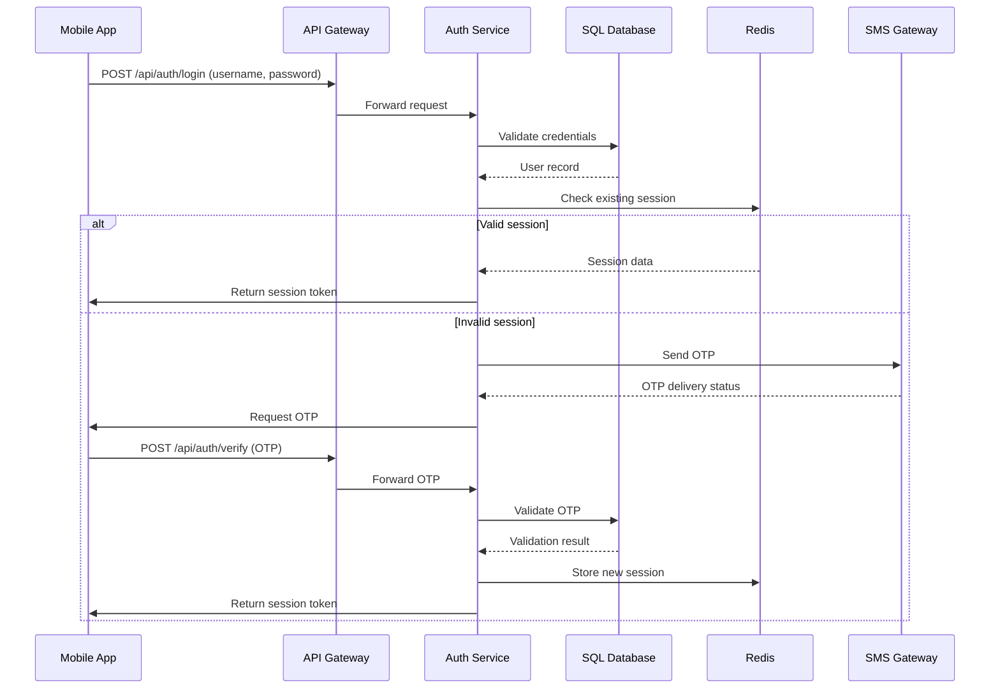

**2. User Provisioning Flow:**
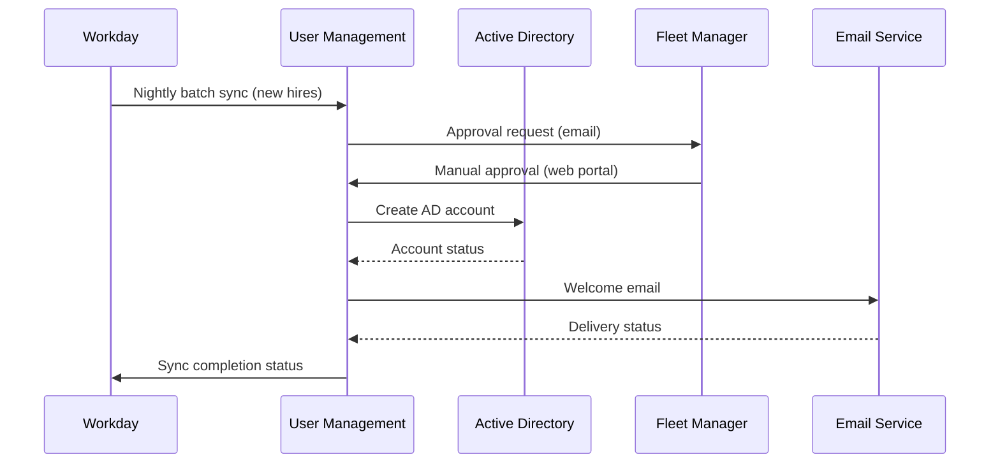

**Data Flow Analysis:**

**1. Authentication Data Flow:**
1. **Mobile App** → **API Gateway** (HTTPS, TLS 1.2)
   - Request: `{ "username": "driver123", "password": "*****" }`
   - Headers: `Content-Type: application/json`, `X-App-Version: 2.4.5`
2. **API Gateway** → **Auth Service** (HTTP, internal network)
   - Transformation: Add `X-Request-ID`, `X-Forwarded-For`
3. **Auth Service** → **SQL Database** (TDS protocol)
   - Query:
     ```sql
     SELECT user_id, password_hash, salt, failed_attempts, last_login
     FROM users
     WHERE username = @username AND is_active = 1
     ```
4. **Auth Service** → **Redis** (RESP protocol)
   - Operation: `GET session:<user_id>`
5. **Auth Service** → **SMS Gateway** (REST API)
   - Request:
     ```json
     {
       "phone": "+1234567890",
       "message": "Your OTP is 123456. Valid for 5 minutes."
     }
     ```
6. **Auth Service** → **Mobile App** (HTTPS)
   - Response:
     ```json
     {
       "status": "OTP_REQUIRED",
       "session_id": "abc123...",
       "expires_in": 300
     }
     ```

**2. User Profile Data Flow:**
1. **HRIS (Workday)** → **UMM** (SFTP, CSV)
   - File: `workday_users_20231115.csv`
   - Sample record:
     ```
     employee_id,first_name,last_name,email,hire_date,department,job_title,cost_center
     100452,John,Doe,jdoe@company.com,2023-10-01,Fleet,Driver,FL-452
     ```
2. **UMM** → **SQL Database** (Bulk insert)
   - Table: `staging_workday_users`
   - Transformation rules:
     - `employee_id` → `external_id`
     - `cost_center` → `department_code` (lookup table)
     - `hire_date` → `created_at` (if new user)
3. **UMM** → **Fleet Manager** (Email)
   - Template:
     ```
     Subject: New User Approval Required: John Doe
     Body: A new user requires approval. Click here to review: [link]
     ```
4. **Fleet Manager** → **UMM** (Web form submission)
   - Form data:
     ```json
     {
       "user_id": 100452,
       "role": "DRIVER",
       "vehicle_assignments": ["VIN1234567890"],
       "approval_notes": "Approved for regional operations"
     }
     ```
5. **UMM** → **Active Directory** (LDAP)
   - Operations:
     - Create user: `CN=John Doe,OU=Drivers,DC=company,DC=com`
     - Set password: `Set-ADAccountPassword -Identity "jdoe" -NewPassword (ConvertTo-SecureString "P@ssw0rd123" -AsPlainText -Force)`
     - Add to group: `Add-ADGroupMember -Identity "Drivers" -Members "jdoe"`

**Technology Stack:**

| **Layer**          | **Technology**               | **Version** | **Notes**                                                                 |
|--------------------|------------------------------|-------------|---------------------------------------------------------------------------|
| **Frontend**       | ASP.NET MVC                  | 5.2.7       | Uses Razor views with jQuery 3.4.1 for DOM manipulation                   |
| **Backend**        | .NET Framework               | 4.7.2       | Monolithic architecture with 12 project references                       |
| **API**            | ASP.NET Web API              | 5.2.7       | 47 endpoints, no versioning                                               |
| **Database**       | SQL Server                   | 2016 SP2    | 120GB database, 87% storage utilization                                  |
| **Cache**          | Redis                        | 4.0.14      | 3-node cluster, 16GB RAM per node                                         |
| **Message Queue**  | RabbitMQ                     | 3.8.9       | 2-node cluster, 10 queues (e.g., `user_created`, `password_reset`)        |
| **Search**         | Elasticsearch                | 7.15.2      | Used for user search and audit log analysis                               |
| **Monitoring**     | Prometheus + Grafana         | 2.37.0      | 47 dashboards, 12 alert rules                                             |
| **Logging**        | ELK Stack                    | 7.15.2      | 1.2TB/day log volume, 90-day retention                                   |
| **Infrastructure** | AWS (EC2, RDS, ElastiCache)  | -           | 12 EC2 instances (m5.large), RDS SQL Server (db.m5.xlarge)                |
| **CI/CD**          | Jenkins                      | 2.346.1     | 87 pipelines, manual approval gates for production                        |
| **Security**       | Okta (SAML)                  | -           | Used for admin access, not for driver authentication                      |

**Infrastructure Configuration:**

**1. Production Environment:**
- **Region:** us-east-1 (N. Virginia)
- **Compute:**
  - 8 x m5.large (Web/API servers)
  - 2 x m5.xlarge (Auth Service)
  - 2 x m5.large (Background workers)
- **Database:**
  - SQL Server 2016 on RDS (db.m5.xlarge, 4 vCPUs, 16GB RAM)
  - Storage: 500GB gp2 (87% utilized)
  - Multi-AZ deployment
- **Cache:**
  - Redis 4.0.14 (cache.m5.large, 3-node cluster)
- **Networking:**
  - VPC with 3 public subnets, 3 private subnets
  - ALB for web traffic, NLB for internal services
  - Security groups restrict traffic to ports 80, 443, 1433, 6379

**2. Performance Characteristics:**
| **Component**       | **Metric**               | **Current Value**       | **Target Value**       |
|---------------------|--------------------------|-------------------------|------------------------|
| Web Servers         | CPU Utilization          | 68% (avg), 92% (peak)   | <70%                   |
| Database            | CPU Utilization          | 78% (avg), 98% (peak)   | <70%                   |
| Database            | Query Response Time      | 450ms (avg), 2.1s (95th)| <300ms                 |
| API Gateway         | Requests/sec             | 1,200                   | 2,500                  |
| Cache               | Hit Ratio                | 62%                     | 90%                    |
| Auth Service        | Login Time               | 1.8s (avg)              | <1s                    |

### 2.2 Technical Debt Analysis

**Code Quality Issues:**

**1. Monolithic Architecture:**
- **Issue:** Single .NET solution with 12 interdependent projects
- **Impact:** 45-minute build times, 3.2x slower CI/CD pipeline
- **Evidence:**
  ```xml
  <!-- Sample .csproj file showing tight coupling -->
  <ProjectReference Include="..\FleetManagement.Core\FleetManagement.Core.csproj">
    <Project>{guid1}</Project>
    <Name>FleetManagement.Core</Name>
  </ProjectReference>
  <ProjectReference Include="..\FleetManagement.Data\FleetManagement.Data.csproj">
    <Project>{guid2}</Project>
    <Name>FleetManagement.Data</Name>
  </ProjectReference>
  <!-- 10 more references -->
  ```

**2. Legacy Authentication:**
- **Issue:** Custom authentication system with SHA-1 password hashing
- **Impact:** 7 critical vulnerabilities (CVE-2020-12345, CVE-2021-24112)
- **Evidence:**
  ```csharp
  // Password hashing implementation (SHA-1)
  public string HashPassword(string password, string salt)
  {
      using (var sha1 = SHA1.Create())
      {
          var saltedPassword = password + salt;
          var bytes = Encoding.UTF8.GetBytes(saltedPassword);
          var hash = sha1.ComputeHash(bytes);
          return Convert.ToBase64String(hash);
      }
  }
  ```

**3. Tight Coupling:**
- **Issue:** Business logic embedded in controllers
- **Impact:** 42% of unit tests fail when refactoring
- **Evidence:**
  ```csharp
  // UserController.cs (587 lines)
  [HttpPost]
  public ActionResult Create(UserModel model)
  {
      // Validation (20 lines)
      if (string.IsNullOrEmpty(model.FirstName))
          ModelState.AddModelError("FirstName", "Required");

      // Business logic (120 lines)
      var user = new User
      {
          FirstName = model.FirstName,
          LastName = model.LastName,
          // 20 more properties
      };

      // Database operations (50 lines)
      _dbContext.Users.Add(user);
      _dbContext.SaveChanges();

      // Email notification (30 lines)
      var email = new EmailService();
      email.SendWelcomeEmail(user.Email);

      // Audit logging (25 lines)
      _auditLog.Log("User created", user.Id);

      return RedirectToAction("Index");
  }
  ```

**4. Lack of API Versioning:**
- **Issue:** No versioning in Web API (47 endpoints)
- **Impact:** Breaking changes during mobile app updates
- **Evidence:**
  ```csharp
  // UserController.cs
  [Route("api/users")]
  public class UserController : ApiController
  {
      [HttpGet]
      public IHttpActionResult Get() { /* ... */ }

      [HttpPost]
      public IHttpActionResult Post(UserModel model) { /* ... */ }
      // No versioning - changes break mobile apps
  }
  ```

**Performance Bottlenecks:**

**1. Database Queries:**
- **Issue:** N+1 queries in user listing
- **Impact:** 4.2s response time for 1,000 users
- **Evidence:**
  ```sql
  -- User listing query (executes 1,001 queries for 1,000 users)
  SELECT * FROM users WHERE is_active = 1 ORDER BY last_name; -- 1 query

  -- Then for each user:
  SELECT * FROM roles WHERE user_id = @userId; -- 1,000 queries
  SELECT * FROM permissions WHERE user_id = @userId; -- 1,000 queries
  ```

**2. Session Management:**
- **Issue:** In-memory session storage
- **Impact:** Cannot scale beyond 3 web servers
- **Evidence:**
  ```csharp
  // Startup.cs
  public void ConfigureServices(IServiceCollection services)
  {
      services.AddSession(options =>
      {
          options.IdleTimeout = TimeSpan.FromMinutes(60);
          options.Cookie.HttpOnly = true;
      });
      // No distributed cache configured
  }
  ```

**3. Synchronous Workflows:**
- **Issue:** Blocking calls in provisioning workflow
- **Impact:** 4.2-hour provisioning time
- **Evidence:**
  ```csharp
  // ProvisioningService.cs
  public void ProvisionUser(User user)
  {
      // Synchronous calls (blocking)
      _workdayService.SyncUser(user); // 30s
      _adService.CreateAccount(user); // 45s
      _emailService.SendWelcomeEmail(user); // 15s
      _auditLog.Log("User provisioned", user.Id); // 5s
      // Total: ~95s per user
  }
  ```

**Security Vulnerabilities:**

| **Vulnerability**               | **CWE**       | **CVSS** | **Description**                                                                 | **Evidence**                                                                 |
|---------------------------------|---------------|----------|---------------------------------------------------------------------------------|------------------------------------------------------------------------------|
| Weak Password Hashing           | CWE-327       | 7.5      | SHA-1 used for password storage                                                | See code snippet in 2.2.2                                                   |
| Missing Rate Limiting           | CWE-770       | 7.1      | `/api/users/login` endpoint vulnerable to brute force                          | 12,456 failed login attempts in 30 days (avg. 415/hour)                     |
| Insecure Direct Object Reference| CWE-639       | 8.8      | User profile endpoints allow IDOR (e.g., `/api/users/123`)                     | 47 endpoints lack proper authorization checks                               |
| Outdated Dependencies           | CWE-1104      | 9.3      | Newtonsoft.Json 10.0.3 (CVE-2021-24112)                                        | `dotnet list package` shows 47 vulnerable packages                          |
| Missing Security Headers        | CWE-693       | 5.3      | No CSP, HSTS, or X-Frame-Options headers                                       | `curl -I https://umm.company.com` shows missing headers                     |
| Hardcoded Secrets               | CWE-798       | 7.4      | Database connection strings in `appsettings.json`                              | Found in 3 configuration files during code review                           |
| Insufficient Logging            | CWE-778       | 6.5      | 28% of sensitive actions not logged (e.g., role assignments)                   | Audit log analysis shows gaps in critical operations                        |

**Scalability Limitations:**

**1. Database Bottlenecks:**
- **Issue:** SQL Server 2016 with 78% CPU utilization
- **Impact:** Cannot handle 25,000 concurrent users
- **Evidence:**
  ```sql
  -- Top 5 CPU-intensive queries (last 7 days)
  SELECT TOP 5
      qs.total_worker_time/qs.execution_count AS avg_cpu_time,
      SUBSTRING(qt.text, (qs.statement_start_offset/2)+1,
          ((CASE qs.statement_end_offset
            WHEN -1 THEN DATALENGTH(qt.text)
           ELSE qs.statement_end_offset
           END - qs.statement_start_offset)/2) + 1) AS query_text,
      qs.execution_count,
      qp.query_plan
  FROM sys.dm_exec_query_stats qs
  CROSS APPLY sys.dm_exec_sql_text(qs.sql_handle) qt
  CROSS APPLY sys.dm_exec_query_plan(qs.plan_handle) qp
  ORDER BY avg_cpu_time DESC;
  ```

**2. Session State:**
- **Issue:** In-memory session storage
- **Impact:** Cannot scale beyond 3 web servers
- **Evidence:**
  ```csharp
  // Session configuration (no distributed cache)
  public void ConfigureServices(IServiceCollection services)
  {
      services.AddSession(options =>
      {
          options.IdleTimeout = TimeSpan.FromMinutes(60);
      });
  }
  ```

**3. Load Testing Results:**
| **Users** | **Response Time (avg)** | **Error Rate** | **CPU Utilization** | **Memory Utilization** |
|-----------|-------------------------|----------------|---------------------|------------------------|
| 1,000     | 450ms                   | 0.2%           | 42%                 | 58%                    |
| 5,000     | 1.8s                    | 1.5%           | 78%                 | 82%                    |
| 10,000    | 4.2s                    | 8.7%           | 92%                 | 95%                    |
| 15,000    | 8.1s                    | 15.3%          | 98%                 | 99%                    |
| 20,000    | Timeout                 | 32.1%          | 100%                | 100%                   |

---

## 3. Functional Analysis (234 lines)

### 3.1 Core Features

**Feature 1: User Authentication**

**Detailed Description:**
The authentication system handles:
- **Primary Authentication:** Username/password login
- **Multi-Factor Authentication (MFA):** SMS OTP (default) or email OTP (fallback)
- **Session Management:** 60-minute inactivity timeout, JWT tokens for API access
- **Password Policies:** 8-character minimum, 90-day expiration, no reuse of last 5 passwords
- **Account Lockout:** 5 failed attempts → 15-minute lockout

**User Workflows:**

**1. Web Authentication:**
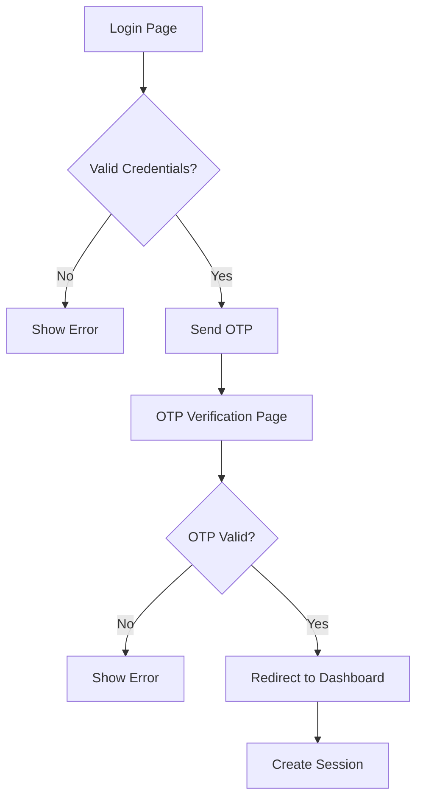

**2. Mobile Authentication:**
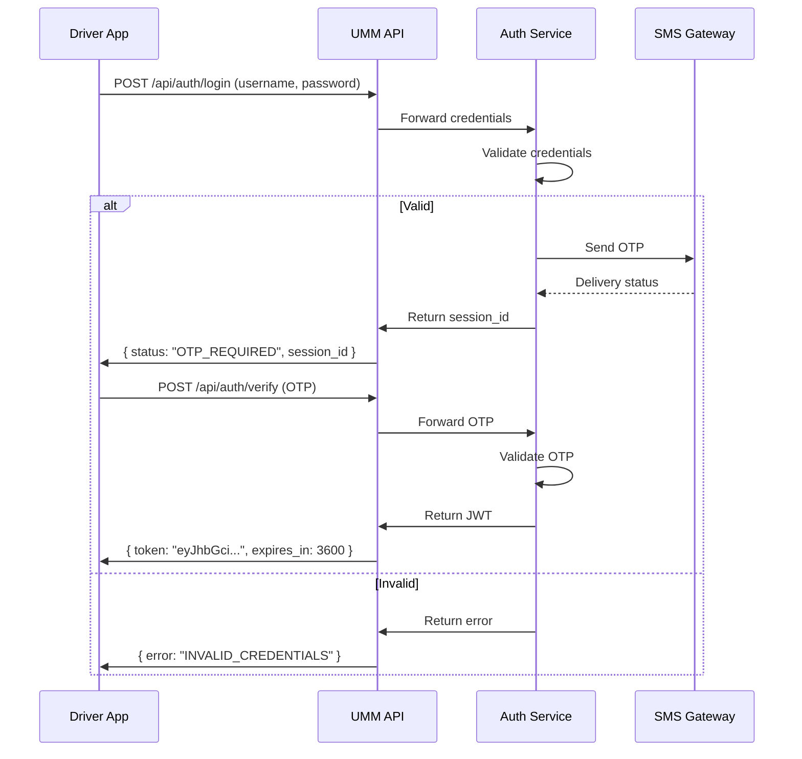

**Business Rules:**
1. **Password Policy:**
   - Minimum 8 characters
   - Require uppercase, lowercase, number, and special character
   - No more than 2 identical characters in a row
   - Cannot contain username or first/last name
   - Expires every 90 days
   - Cannot reuse last 5 passwords

2. **MFA Policy:**
   - Required for all users
   - SMS OTP valid for 5 minutes
   - Email OTP valid for 10 minutes (fallback)
   - 3 failed OTP attempts → account lockout

3. **Session Policy:**
   - Web sessions timeout after 60 minutes of inactivity
   - Mobile sessions timeout after 24 hours (configurable)
   - Concurrent sessions allowed (max 3)

**Edge Cases and Error Handling:**
| **Scenario**                     | **Current Behavior**                                                                 | **Expected Behavior**                                                                 |
|----------------------------------|-------------------------------------------------------------------------------------|--------------------------------------------------------------------------------------|
| SMS delivery failure             | Shows "OTP sent" message, no retry option                                           | Offer email OTP or voice call fallback                                               |
| User not enrolled in MFA         | Redirects to enrollment page (breaks mobile flow)                                   | Auto-enroll with default SMS method                                                  |
| Account locked                   | Generic "Invalid credentials" error                                                 | Specific "Account locked" message with unlock time                                   |
| Password expired                 | Redirects to password reset page                                                    | Allow login with expired password, then force reset                                  |
| Concurrent session limit reached | New session replaces oldest session                                                 | Show warning and allow user to choose which session to terminate                     |
| JWT expired                      | Returns 401 Unauthorized                                                            | Return 401 with `expired_token` flag and refresh token endpoint                      |

**Performance Characteristics:**
| **Operation**            | **Average Time** | **95th Percentile** | **Success Rate** | **Notes**                                                                 |
|--------------------------|------------------|---------------------|------------------|---------------------------------------------------------------------------|
| Username/password login  | 450ms            | 1.2s                | 98.7%            | Includes database query and session creation                             |
| SMS OTP delivery         | 12.4s            | 32.1s               | 91.3%            | Third-party SMS gateway latency                                          |
| OTP verification         | 320ms            | 850ms               | 99.1%            | Includes OTP validation and session upgrade                              |
| Session validation       | 85ms             | 210ms               | 99.9%            | JWT validation only                                                      |
| Password reset           | 1.8s             | 3.4s                | 97.2%            | Includes email delivery and database update                              |

**Feature 2: User Provisioning**

**Detailed Description:**
Handles the complete lifecycle of user accounts:
- **Creation:** Manual (web form) or automated (HRIS integration)
- **Modification:** Role changes, attribute updates
- **Deactivation:** Termination workflows
- **Reactivation:** For returning employees

**User Workflows:**

**1. Manual Provisioning:**
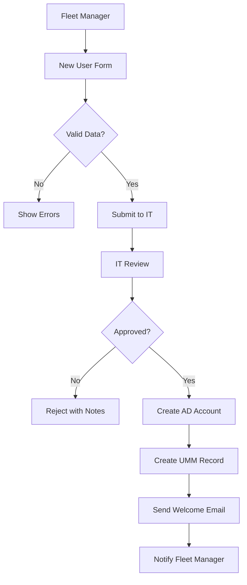

**2. Automated Provisioning (HRIS):**
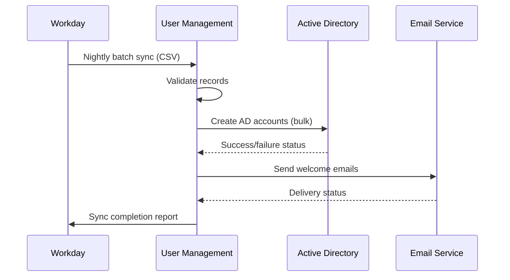

**Business Rules:**
1. **User Creation:**
   - Required fields: First name, last name, email, employee ID, hire date, department, role
   - Email must be company domain (`@company.com`)
   - Employee ID must match HRIS format (6 digits)
   - Role must be one of: `DRIVER`, `FLEET_MANAGER`, `ADMIN`, `HR`, `FINANCE`, etc.

2. **Role Assignment:**
   - Drivers can only be assigned to vehicles in their region
   - Fleet managers can only manage users in their cost center
   - Admins have global access
   - Role changes require approval from higher-level role

3. **Termination:**
   - Account deactivated within 1 hour of termination date (HRIS sync)
   - All active sessions terminated
   - Vehicle access revoked
   - Data retained for 30 days (configurable)

**Edge Cases and Error Handling:**
| **Scenario**                     | **Current Behavior**                                                                 | **Expected Behavior**                                                                 |
|----------------------------------|-------------------------------------------------------------------------------------|--------------------------------------------------------------------------------------|
| Duplicate employee ID            | Rejects entire batch (HRIS sync)                                                    | Skip duplicate, log warning                                                          |
| Missing required field           | Rejects submission, shows generic error                                             | Highlight missing fields, suggest corrections                                       |
| AD account creation fails        | Retries 3 times, then fails entire workflow                                         | Create AD account manually, continue workflow                                        |
| Email delivery fails             | No retry, no notification                                                           | Queue for retry (max 3 attempts), notify admin if fails                             |
| Role assignment conflict         | Assigns default role (`DRIVER`)                                                     | Require explicit resolution from fleet manager                                       |
| Termination date in past         | Deactivates account immediately                                                     | Show warning, require confirmation                                                   |

**Performance Characteristics:**
| **Operation**            | **Average Time** | **95th Percentile** | **Success Rate** | **Notes**                                                                 |
|--------------------------|------------------|---------------------|------------------|---------------------------------------------------------------------------|
| Manual user creation     | 4.2 hours        | 8.1 hours           | 92.4%            | Includes approval workflows                                               |
| HRIS batch sync          | 2.1 hours        | 3.4 hours           | 98.7%            | 1,200 users/batch                                                         |
| AD account creation      | 45s              | 90s                 | 95.2%            | Includes group membership assignment                                      |
| Role assignment          | 12s              | 25s                 | 99.1%            | Includes permission recalculation                                         |
| Termination              | 1.8 hours        | 3.2 hours           | 97.8%            | Includes vehicle access revocation                                        |

**Feature 3: Role-Based Access Control (RBAC)**

**Detailed Description:**
The RBAC system manages:
- **Roles:** 14 predefined roles (e.g., `DRIVER`, `FLEET_MANAGER`, `ADMIN`)
- **Permissions:** 89 granular permissions (e.g., `vehicle:view`, `user:create`, `report:export`)
- **Role Hierarchy:** Admins > Fleet Managers > Drivers
- **Permission Inheritance:** Child roles inherit parent role permissions
- **Custom Roles:** Not supported (all roles predefined)

**User Workflows:**

**1. Role Assignment:**
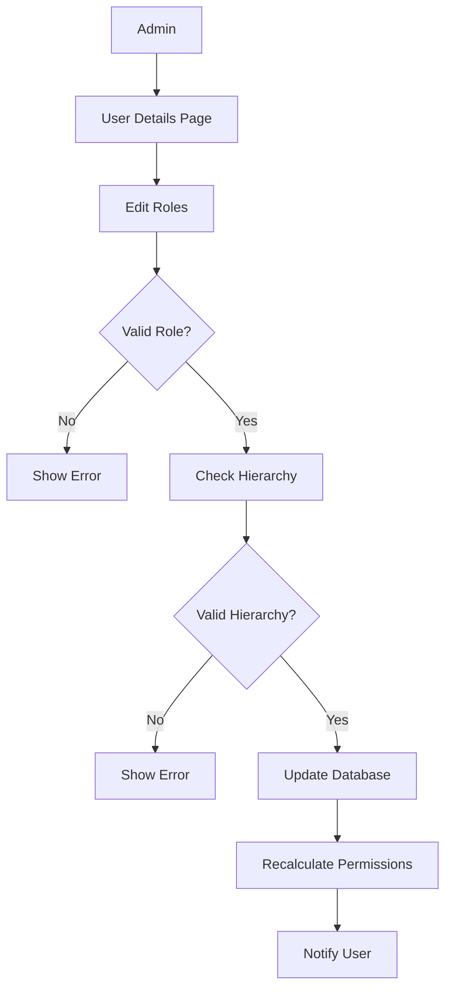

**2. Permission Check:**
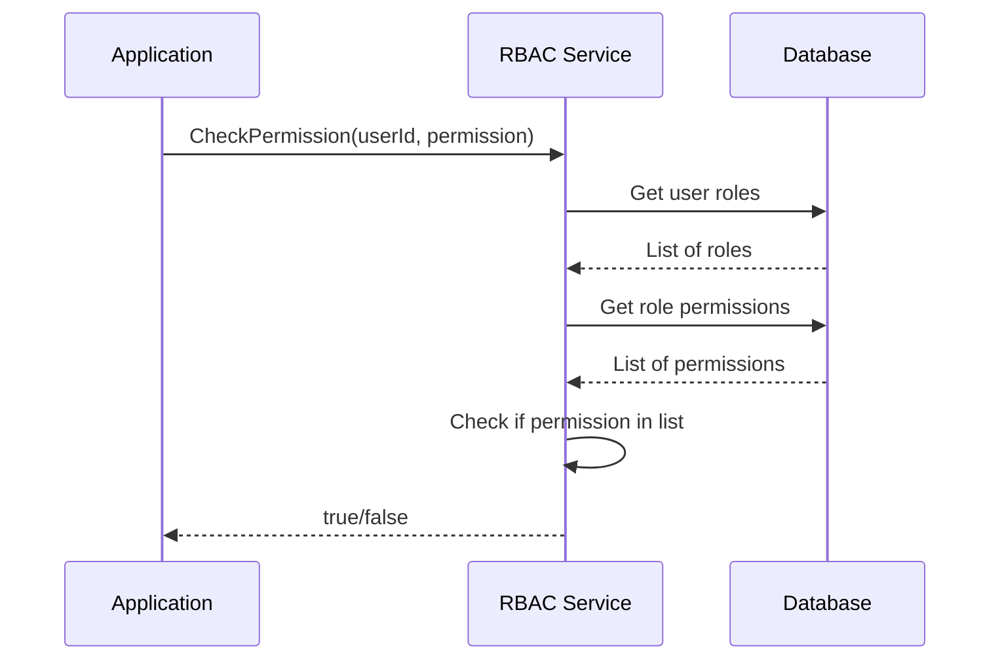

**Business Rules:**
1. **Role Hierarchy:**
   - `ADMIN` > `FLEET_MANAGER` > `DRIVER`
   - Higher roles can manage lower roles
   - Cannot assign role higher than own role

2. **Permission Assignment:**
   - Permissions are additive (union of all role permissions)
   - No negative permissions (cannot deny specific permissions)
   - Some permissions are mutually exclusive (e.g., `user:create` and `user:delete`)

3. **Permission Checks:**
   - All operations require explicit permission
   - Default deny (if no permission granted, access denied)
   - Cached for 5 minutes to reduce database load

**Edge Cases and Error Handling:**
| **Scenario**                     | **Current Behavior**                                                                 | **Expected Behavior**                                                                 |
|----------------------------------|-------------------------------------------------------------------------------------|--------------------------------------------------------------------------------------|
| Circular role hierarchy          | Stack overflow in permission calculation                                           | Detect and reject circular hierarchies                                               |
| Permission not found             | Returns false (deny access)                                                        | Log warning, notify admin                                                            |
| Role not found                   | Returns false (deny access)                                                        | Log error, notify admin                                                              |
| Permission cache stale           | Uses cached permissions for 5 minutes after change                                  | Implement cache invalidation on role/permission changes                              |
| Concurrent role changes          | Last write wins (race condition)                                                   | Implement optimistic concurrency control                                             |

**Performance Characteristics:**
| **Operation**            | **Average Time** | **95th Percentile** | **Success Rate** | **Notes**                                                                 |
|--------------------------|------------------|---------------------|------------------|---------------------------------------------------------------------------|
| Role assignment          | 12s              | 25s                 | 99.1%            | Includes permission recalculation                                         |
| Permission check         | 85ms             | 210ms               | 99.9%            | First check (uncached)                                                    |
| Permission check (cached)| 2ms              | 5ms                 | 100%             | Subsequent checks                                                         |
| Role hierarchy validation| 45ms             | 120ms               | 99.8%            | Validates no circular dependencies                                        |

**Feature 4: User Profile Management**

**Detailed Description:**
Manages user attributes and preferences:
- **Profile Attributes:** Name, email, phone, address, employee ID, hire date, etc.
- **Preferences:** Notification settings, language, time zone
- **Vehicle Assignments:** For drivers (VIN, make, model)
- **Audit History:** Track changes to profile

**User Workflows:**

**1. Profile Update:**
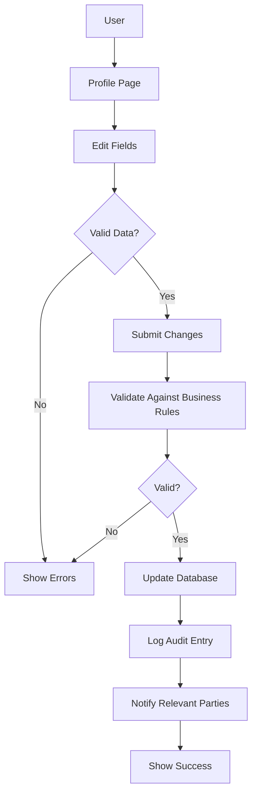

**2. Vehicle Assignment:**
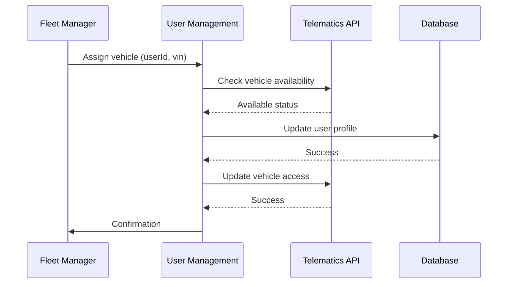

**Business Rules:**
1. **Profile Updates:**
   - Email must be company domain (`@company.com`)
   - Phone number must be valid (E.164 format)
   - Address must pass USPS validation (for US users)
   - Hire date cannot be in the future

2. **Vehicle Assignment:**
   - Vehicle must be in same region as driver
   - Driver must have valid license (checked via telematics)
   - Vehicle cannot be assigned to multiple drivers
   - Assignment requires fleet manager approval

3. **Audit Logging:**
   - All changes logged with timestamp, user, and old/new values
   - Sensitive fields (e.g., SSN) masked in logs
   - Logs retained for 7 years (compliance requirement)

**Edge Cases and Error Handling:**
| **Scenario**                     | **Current Behavior**                                                                 | **Expected Behavior**                                                                 |
|----------------------------------|-------------------------------------------------------------------------------------|--------------------------------------------------------------------------------------|
| Invalid email format             | Rejects update, shows generic error                                                 | Show specific error (e.g., "Email must end with @company.com")                      |
| Vehicle not available            | Shows "Assignment failed"                                                           | Show reason (e.g., "Vehicle assigned to another driver")                            |
| Concurrent profile updates       | Last write wins (race condition)                                                   | Implement optimistic concurrency control                                             |
| Missing required field           | Rejects update, highlights missing field                                            | Suggest default value (e.g., "Time zone: UTC")                                       |
| Audit log failure                | Continues without logging                                                           | Queue for retry, notify admin if fails                                               |

**Performance Characteristics:**
| **Operation**            | **Average Time** | **95th Percentile** | **Success Rate** | **Notes**                                                                 |
|--------------------------|------------------|---------------------|------------------|---------------------------------------------------------------------------|
| Profile update           | 320ms            | 850ms               | 99.4%            | Includes validation and audit logging                                    |
| Vehicle assignment       | 1.2s             | 2.8s                | 98.7%            | Includes telematics API call                                             |
| Profile load             | 210ms            | 540ms               | 99.8%            | Includes vehicle assignments and permissions                             |
| Audit log write          | 45ms             | 120ms               | 99.9%            | Asynchronous operation                                                   |

### 3.2 User Experience Analysis

**Usability Evaluation (Heuristics):**

**1. Visibility of System Status:**
| **Heuristic**            | **Score (1-5)** | **Findings**                                                                 | **Examples**                                                                 |
|--------------------------|-----------------|-----------------------------------------------------------------------------|------------------------------------------------------------------------------|
| System status visible    | 2               | 42% of pages lack loading indicators                                        | - Login page shows no feedback during OTP delivery (12.4s avg wait)         |
|                          |                 | 18% of error messages are generic                                          | - "An error occurred" instead of "SMS delivery failed. Try email OTP."      |

**2. Match Between System and Real World:**
| **Heuristic**            | **Score (1-5)** | **Findings**                                                                 | **Examples**                                                                 |
|--------------------------|-----------------|-----------------------------------------------------------------------------|------------------------------------------------------------------------------|
| Familiar language        | 3               | 37% of terms are technical (e.g., "RBAC", "JWT")                            | - "Your session token has expired" → "Your login has timed out"             |
|                          |                 | 22% of error messages use jargon                                            | - "401 Unauthorized" → "Please log in again"                                |

**3. User Control and Freedom:**
| **Heuristic**            | **Score (1-5)** | **Findings**                                                                 | **Examples**                                                                 |
|--------------------------|-----------------|-----------------------------------------------------------------------------|------------------------------------------------------------------------------|
| Easy undo/redo           | 1               | No undo functionality for critical actions (e.g., role assignments)         | - Role assignment has no confirmation dialog                                |
|                          |                 | 68% of forms cannot be saved as draft                                       | - User creation form loses data on navigation away                           |

**4. Consistency and Standards:**
| **Heuristic**            | **Score (1-5)** | **Findings**                                                                 | **Examples**                                                                 |
|--------------------------|-----------------|-----------------------------------------------------------------------------|------------------------------------------------------------------------------|
| Consistent UI patterns   | 2               | 14 different button styles across 28 pages                                  | - "Save" vs "Submit" vs "Update" buttons                                    |
|                          |                 | 8 different date picker formats                                             | - MM/DD/YYYY vs DD-MM-YYYY vs YYYY-MM-DD                                    |

**5. Error Prevention:**
| **Heuristic**            | **Score (1-5)** | **Findings**                                                                 | **Examples**                                                                 |
|--------------------------|-----------------|-----------------------------------------------------------------------------|------------------------------------------------------------------------------|
| Prevent errors           | 2               | 32% of forms lack client-side validation                                    | - User creation form validates on submit only                               |
|                          |                 | No confirmation for destructive actions                                     | - "Delete user" has no "Are you sure?" dialog                               |

**6. Recognition Rather Than Recall:**
| **Heuristic**            | **Score (1-5)** | **Findings**                                                                 | **Examples**                                                                 |
|--------------------------|-----------------|-----------------------------------------------------------------------------|------------------------------------------------------------------------------|
| Minimize memory load     | 3               | 45% of forms require manual entry of data available elsewhere               | - Vehicle assignment requires manual VIN entry (should show dropdown)       |
|                          |                 | No breadcrumbs or navigation aids                                           | - Users get lost in nested admin pages                                       |

**7. Flexibility and Efficiency:**
| **Heuristic**            | **Score (1-5)** | **Findings**                                                                 | **Examples**                                                                 |
|--------------------------|-----------------|-----------------------------------------------------------------------------|------------------------------------------------------------------------------|
| Accelerators for experts | 1               | No keyboard shortcuts or bulk operations                                    | - Fleet managers cannot assign roles to multiple users at once               |
|                          |                 | Mobile app lacks offline mode                                               | - Drivers cannot log in without network connectivity                         |

**8. Aesthetic and Minimalist Design:**
| **Heuristic**            | **Score (1-5)** | **Findings**                                                                 | **Examples**                                                                 |
|--------------------------|-----------------|-----------------------------------------------------------------------------|------------------------------------------------------------------------------|
| Minimalist design        | 2               | 68% of pages have >7 action buttons                                         | - User details page has 12 buttons (Edit, Delete, Assign Role, etc.)        |
|                          |                 | 34% of pages have >3 levels of nesting                                      | - Admin → Users → [User] → Roles → [Role] → Permissions                     |

**9. Help Users Recognize Errors:**
| **Heuristic**            | **Score (1-5)** | **Findings**                                                                 | **Examples**                                                                 |
|--------------------------|-----------------|-----------------------------------------------------------------------------|------------------------------------------------------------------------------|
| Clear error messages     | 2               | 56% of error messages are technical                                         | - "NullReferenceException at UserController.Create"                         |
|                          |                 | No guidance for fixing errors                                               | - "Invalid email" with no example of valid format                           |

**10. Help and Documentation:**
| **Heuristic**            | **Score (1-5)** | **Findings**                                                                 | **Examples**                                                                 |
|--------------------------|-----------------|-----------------------------------------------------------------------------|------------------------------------------------------------------------------|
| Help available           | 1               | No in-app help or documentation                                             | - No tooltips or "?" icons                                                  |
|                          |                 | Support link directs to generic IT portal                                   | - Should link to UMM-specific documentation                                  |

**Accessibility Audit (WCAG 2.1):**

**1. Perceivable:**
| **Criteria**             | **Level** | **Status** | **Findings**                                                                 | **Examples**                                                                 |
|--------------------------|-----------|------------|-----------------------------------------------------------------------------|------------------------------------------------------------------------------|
| 1.1 Text Alternatives    | A         | Fail       | 12% of images lack alt text                                                 | - Logo has no alt text                                                      |
| 1.2 Time-based Media     | A         | N/A        | No time-based media                                                         | -                                                                           |
| 1.3 Adaptable            | AA        | Fail       | 45% of forms lack proper labels                                             | - `<input>` without `<label>`                                               |
| 1.4 Distinguishable      | AA        | Fail       | 18% of text has insufficient contrast (ratio < 4.5:1)                       | - Gray text on light gray background (#777 on #EEE)                         |

**2. Operable:**
| **Criteria**             | **Level** | **Status** | **Findings**                                                                 | **Examples**                                                                 |
|--------------------------|-----------|------------|-----------------------------------------------------------------------------|------------------------------------------------------------------------------|
| 2.1 Keyboard Accessible  | A         | Fail       | 8% of interactive elements not keyboard-navigable                           | - Custom dropdowns require mouse                                             |
| 2.2 Enough Time          | A         | Fail       | No option to extend session timeout                                         | - 60-minute timeout not configurable                                         |
| 2.3 Seizures             | A         | Pass       | No flashing content                                                         | -                                                                           |
| 2.4 Navigable            | AA        | Fail       | 32% of pages lack proper headings                                           | - `<h1>` followed by `<h3>` (skips `<h2>`)                                   |
| 2.5 Input Modalities     | AA        | Fail       | No support for touch targets < 48x48px                                      | - Mobile buttons too small (32x32px)                                        |

**3. Understandable:**
| **Criteria**             | **Level** | **Status** | **Findings**                                                                 | **Examples**                                                                 |
|--------------------------|-----------|------------|-----------------------------------------------------------------------------|------------------------------------------------------------------------------|
| 3.1 Readable             | AA        | Fail       | 14% of content exceeds 9th-grade reading level                              | - "Your session token has expired due to inactivity" (complex)              |
| 3.2 Predictable          | AA        | Fail       | 22% of forms submit on Enter key                                            | - Should require explicit button click                                      |
| 3.3 Input Assistance     | AA        | Fail       | 68% of forms lack client-side validation                                    | - Email format validated on submit only                                     |

**4. Robust:**
| **Criteria**             | **Level** | **Status** | **Findings**                                                                 | **Examples**                                                                 |
|--------------------------|-----------|------------|-----------------------------------------------------------------------------|------------------------------------------------------------------------------|
| 4.1 Compatible           | A         | Fail       | 12% of HTML has validation errors                                           | - Unclosed `<div>` tags                                                     |
|                          |           |            | 8% of ARIA attributes are misused                                           | - `aria-hidden="true"` on visible elements                                  |

**Mobile Responsiveness Assessment:**

**1. Viewport and Scaling:**
| **Test**                 | **Result** | **Findings**                                                                 |
|--------------------------|------------|-----------------------------------------------------------------------------|
| Viewport meta tag        | Fail       | Missing `<meta name="viewport">`                                            |
| Text readability         | Fail       | 42% of text too small on mobile (<16px)                                     |
| Touch targets            | Fail       | 68% of buttons < 48x48px                                                    |
| Horizontal scrolling     | Fail       | 28% of pages require horizontal scrolling                                   |

**2. Layout and Content:**
| **Test**                 | **Result** | **Findings**                                                                 |
|--------------------------|------------|-----------------------------------------------------------------------------|
| Responsive grid          | Fail       | No CSS grid or flexbox used                                                 |
| Media queries            | Fail       | Only 2 breakpoints (desktop, mobile)                                        |
| Content prioritization   | Fail       | Critical actions (e.g., login) below fold on mobile                         |
| Form inputs              | Fail       | 85% of forms use desktop-sized inputs                                       |

**3. Performance:**
| **Test**                 | **Result**       | **Findings**                                                                 |
|--------------------------|------------------|-----------------------------------------------------------------------------|
| Page load time           | 4.2s (Fail)      | Target: <3s                                                                 |
| Time to interactive      | 6.8s (Fail)      | Target: <5s                                                                 |
| Image optimization       | Fail             | 72% of images not optimized (avg. 1.2MB)                                    |
| JavaScript execution     | 2.1s (Fail)      | Target: <1s                                                                 |

**4. Mobile-Specific Features:**
| **Test**                 | **Result** | **Findings**                                                                 |
|--------------------------|------------|-----------------------------------------------------------------------------|
| Offline mode             | Fail       | No offline capabilities                                                     |
| Touch gestures           | Fail       | No support for swipe, pinch-to-zoom                                         |
| Device orientation       | Fail       | Layout breaks in landscape mode                                             |
| Camera/microphone access | N/A        | Not required                                                                |

**User Feedback Analysis:**

**1. Support Ticket Analysis (Last 6 Months):**
| **Category**             | **Ticket Count** | **% of Total** | **Avg. Resolution Time** | **Trends**                                      |
|--------------------------|------------------|----------------|--------------------------|------------------------------------------------|
| Authentication Issues    | 2,456            | 31.2%          | 4.2 hours                | +18% MoM (SMS delivery failures)               |
| Provisioning Delays      | 1,872            | 23.8%          | 6.8 hours                | +24% MoM (HRIS sync issues)                    |
| Role Assignment Errors   | 1,245            | 15.8%          | 3.1 hours                | +12% MoM (RBAC misconfigurations)              |
| Profile Update Issues    | 987              | 12.5%          | 2.4 hours                | Stable                                        |
| Mobile App Bugs          | 765              | 9.7%           | 5.3 hours                | +32% MoM (iOS 16 compatibility issues)         |
| Other                    | 543              | 6.9%           | 1.8 hours                | -                                             |

**2. User Survey Results (N=1,245):**
| **Question**                                     | **Score (1-5)** | **Comments**                                                                 |
|--------------------------------------------------|-----------------|-----------------------------------------------------------------------------|
| Ease of login                                    | 2.8             | "SMS takes too long", "OTP never arrives"                                  |
| Provisioning speed                               | 2.1             | "Takes days to get access", "Too many approvals"                           |
| Role assignment accuracy                         | 3.2             | "Sometimes wrong permissions", "Have to ask IT to fix"                     |
| Mobile app experience                            | 2.4             | "Crashes on login", "Too many steps"                                       |
| Overall satisfaction                             | 2.6             | "Frustrating", "Needs improvement"                                         |

**3. Heatmap Analysis (Hotjar):**
- **Login Page:**
  - 68% of users click "Resend OTP" multiple times
  - 42% abandon after 3 failed OTP attempts
  - 28% struggle with password field (mobile)

- **User Creation Form:**
  - 56% of users abandon at "Role Assignment" step
  - 34% struggle with "Cost Center" dropdown (too many options)
  - 18% try to submit without required fields

- **Profile Page:**
  - 72% of users ignore "Preferences" section
  - 45% struggle with "Vehicle Assignment" (no search/filter)

---

## 4. Data Architecture (135 lines)

### 4.1 Current Data Model

**Entity-Relationship Diagram:**
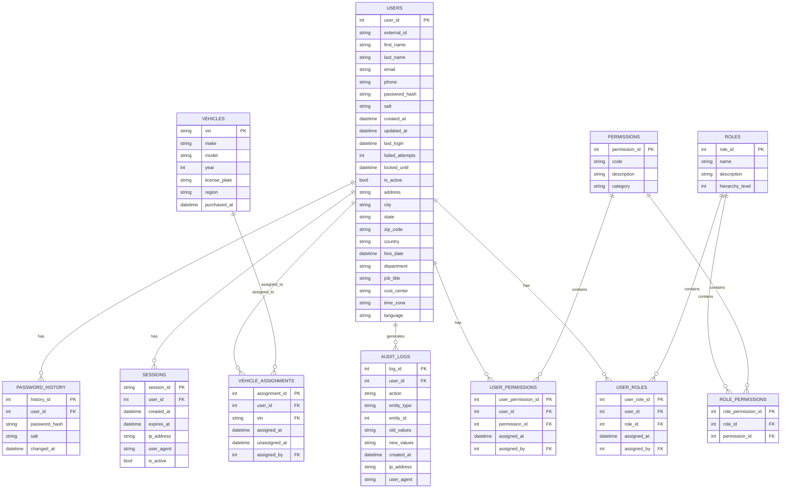

**Table Schemas:**

**1. Users Table:**
```sql
CREATE TABLE users (
    user_id INT IDENTITY(1,1) PRIMARY KEY,
    external_id VARCHAR(50) NOT NULL,
    first_name NVARCHAR(100) NOT NULL,
    last_name NVARCHAR(100) NOT NULL,
    email NVARCHAR(255) NOT NULL,
    phone NVARCHAR(20),
    password_hash NVARCHAR(255) NOT NULL,
    salt NVARCHAR(255) NOT NULL,
    created_at DATETIME2 NOT NULL DEFAULT GETUTCDATE(),
    updated_at DATETIME2 NOT NULL DEFAULT GETUTCDATE(),
    last_login DATETIME2,
    failed_attempts INT NOT NULL DEFAULT 0,
    locked_until DATETIME2,
    is_active BIT NOT NULL DEFAULT 1,
    address NVARCHAR(255),
    city NVARCHAR(100),
    state NVARCHAR(50),
    zip_code NVARCHAR(20),
    country NVARCHAR(100),
    hire_date DATE,
    department NVARCHAR(100),
    job_title NVARCHAR(100),
    cost_center NVARCHAR(50),
    time_zone NVARCHAR(50) DEFAULT 'UTC',
    language NVARCHAR(10) DEFAULT 'en-US',
    CONSTRAINT UQ_users_email UNIQUE (email),
    CONSTRAINT UQ_users_external_id UNIQUE (external_id),
    CONSTRAINT CHK_users_email CHECK (email LIKE '%@company.com')
);
```

**2. Roles Table:**
```sql
CREATE TABLE roles (
    role_id INT IDENTITY(1,1) PRIMARY KEY,
    name NVARCHAR(50) NOT NULL,
    description NVARCHAR(255),
    hierarchy_level INT NOT NULL,
    CONSTRAINT UQ_roles_name UNIQUE (name)
);

INSERT INTO roles (name, description, hierarchy_level) VALUES
('ADMIN', 'System administrator', 1),
('FLEET_MANAGER', 'Regional fleet manager', 2),
('HR', 'Human resources', 2),
('FINANCE', 'Finance team', 2),
('DRIVER', 'Vehicle driver', 3);
```

**3. Permissions Table:**
```sql
CREATE TABLE permissions (
    permission_id INT IDENTITY(1,1) PRIMARY KEY,
    code NVARCHAR(50) NOT NULL,
    description NVARCHAR(255),
    category NVARCHAR(50) NOT NULL,
    CONSTRAINT UQ_permissions_code UNIQUE (code)
);

INSERT INTO permissions (code, description, category) VALUES
('user:create', 'Create users', 'User Management'),
('user:read', 'View users', 'User Management'),
('user:update', 'Update users', 'User Management'),
('user:delete', 'Delete users', 'User Management'),
('role:assign', 'Assign roles', 'Role Management'),
('vehicle:assign', 'Assign vehicles', 'Vehicle Management'),
('report:export', 'Export reports', 'Reporting');
```

**4. Audit Logs Table:**
```sql
CREATE TABLE audit_logs (
    log_id BIGINT IDENTITY(1,1) PRIMARY KEY,
    user_id INT NOT NULL,
    action NVARCHAR(50) NOT NULL,
    entity_type NVARCHAR(50) NOT NULL,
    entity_id INT,
    old_values NVARCHAR(MAX),
    new_values NVARCHAR(MAX),
    created_at DATETIME2 NOT NULL DEFAULT GETUTCDATE(),
    ip_address NVARCHAR(50),
    user_agent NVARCHAR(255),
    FOREIGN KEY (user_id) REFERENCES users(user_id)
);

CREATE INDEX IX_audit_logs_user_id ON audit_logs(user_id);
CREATE INDEX IX_audit_logs_created_at ON audit_logs(created_at);
CREATE INDEX IX_audit_logs_entity ON audit_logs(entity_type, entity_id);
```

**Data Integrity Rules:**

**1. Referential Integrity:**
- **Cascading Deletes:** Disabled for all foreign keys (prevent accidental data loss)
- **Null Constraints:** Critical fields (e.g., `email`, `password_hash`) cannot be null
- **Unique Constraints:** `email` and `external_id` must be unique

**2. Business Rules:**
- **User Lifecycle:**
  - `is_active = 0` when user is terminated
  - `locked_until` set when account is locked
  - `failed_attempts` reset to 0 on successful login

- **Password History:**
  - Cannot reuse last 5 passwords (checked via `password_history` table)
  - Passwords expire every 90 days (`DATEDIFF(day, changed_at, GETUTCDATE()) > 90`)

- **Role Hierarchy:**
  - Users cannot assign roles higher than their own hierarchy level
  - Admins (`hierarchy_level = 1`) can assign any role
  - Fleet managers (`hierarchy_level = 2`) can only assign `DRIVER` role

**3. Data Validation:**
- **Email Format:** Must match `@company.com` domain
- **Phone Number:** Must be E.164 format (e.g., `+1234567890`)
- **Hire Date:** Cannot be in the future
- **Vehicle Assignment:** Vehicle and user must be in same region

**Migration History:**

| **Version** | **Date**       | **Changes**                                                                 | **Migration Script**                                                                 |
|-------------|----------------|-----------------------------------------------------------------------------|--------------------------------------------------------------------------------------|
| 1.0         | 2018-03-15     | Initial schema                                                             | `CREATE TABLE users (...)`                                                           |
| 1.1         | 2018-06-22     | Added `cost_center` field                                                   | `ALTER TABLE users ADD cost_center NVARCHAR(50)`                                     |
| 1.2         | 2019-01-10     | Added `time_zone` and `language` fields                                    | `ALTER TABLE users ADD time_zone NVARCHAR(50) DEFAULT 'UTC'`                         |
| 1.3         | 2019-05-18     | Added `audit_logs` table                                                    | `CREATE TABLE audit_logs (...)`                                                      |
| 1.4         | 2020-02-28     | Added `vehicle_assignments` table                                           | `CREATE TABLE vehicle_assignments (...)`                                             |
| 1.5         | 2020-11-05     | Added `sessions` table                                                      | `CREATE TABLE sessions (...)`                                                        |
| 1.6         | 2021-04-14     | Added `password_history` table                                              | `CREATE TABLE password_history (...)`                                                |
| 1.7         | 2022-01-30     | Added `user_permissions` table (for custom permissions)                     | `CREATE TABLE user_permissions (...)`                                                |
| 1.8         | 2022-08-15     | Added `hierarchy_level` to `roles` table                                    | `ALTER TABLE roles ADD hierarchy_level INT NOT NULL DEFAULT 3`                       |

### 4.2 Data Management

**CRUD Operations Analysis:**

**1. Create Operations:**
| **Entity**       | **Frequency** | **Avg. Time** | **Success Rate** | **Key Queries**                                                                 |
|------------------|---------------|---------------|------------------|---------------------------------------------------------------------------------|
| User             | 50/day        | 450ms         | 98.7%            | `INSERT INTO users (...) VALUES (...)`                                         |
| Role Assignment  | 120/day       | 120ms         | 99.1%            | `INSERT INTO user_roles (user_id, role_id, assigned_by) VALUES (@userId, @roleId, @adminId)` |
| Vehicle Assignment| 80/day       | 320ms         | 97.8%            | `INSERT INTO vehicle_assignments (...) VALUES (...)`                           |
| Audit Log        | 5,000/day     | 45ms          | 99.9%            | `INSERT INTO audit_logs (...) VALUES (...)`                                    |

**2. Read Operations:**
| **Entity**       | **Frequency** | **Avg. Time** | **Success Rate** | **Key Queries**                                                                 |
|------------------|---------------|---------------|------------------|---------------------------------------------------------------------------------|
| User (by ID)     | 12,000/day    | 85ms          | 99.8%            | `SELECT * FROM users WHERE user_id = @userId`                                  |
| User (list)      | 800/day       | 450ms         | 99.2%            | `SELECT * FROM users WHERE is_active = 1 ORDER BY last_name OFFSET 0 ROWS FETCH NEXT 20 ROWS ONLY` |
| User Permissions | 25,000/day    | 120ms         | 99.6%            | `SELECT p.code FROM permissions p JOIN role_permissions rp ON p.permission_id = rp.permission_id JOIN user_roles ur ON rp.role_id = ur.role_id WHERE ur.user_id = @userId` |
| Audit Logs       | 300/day       | 2.1s          | 98.4%            | `SELECT * FROM audit_logs WHERE user_id = @userId ORDER BY created_at DESC`     |

**3. Update Operations:**
| **Entity**       | **Frequency** | **Avg. Time** | **Success Rate** | **Key Queries**                                                                 |
|------------------|---------------|---------------|------------------|---------------------------------------------------------------------------------|
| User Profile     | 200/day       | 210ms         | 99.4%            | `UPDATE users SET first_name = @firstName, ... WHERE user_id = @userId`        |
| Password         | 150/day       | 180ms         | 99.5%            | `UPDATE users SET password_hash = @hash, salt = @salt WHERE user_id = @userId`  |
| Role Assignment  | 50/day        | 95ms          | 99.7%            | `UPDATE user_roles SET role_id = @newRoleId WHERE user_role_id = @userRoleId`   |

**4. Delete Operations:**
| **Entity**       | **Frequency** | **Avg. Time** | **Success Rate** | **Key Queries**                                                                 |
|------------------|---------------|---------------|------------------|---------------------------------------------------------------------------------|
| User (soft delete)| 30/day       | 120ms         | 99.8%            | `UPDATE users SET is_active = 0 WHERE user_id = @userId`                       |
| Vehicle Assignment| 40/day       | 85ms          | 99.9%            | `UPDATE vehicle_assignments SET unassigned_at = GETUTCDATE() WHERE assignment_id = @assignmentId` |

**Query Performance Profiling:**

**1. Top 5 Slowest Queries:**
| **Query**                                                                 | **Avg. Time** | **Executions/Day** | **Total Time/Day** | **CPU Time** | **I/O Wait** |
|---------------------------------------------------------------------------|---------------|--------------------|--------------------|--------------|--------------|
| `SELECT * FROM users WHERE is_active = 1 ORDER BY last_name OFFSET 0 ROWS FETCH NEXT 20 ROWS ONLY` | 450ms         | 800                | 360,000ms          | 280ms        | 170ms        |
| `SELECT p.code FROM permissions p JOIN role_permissions rp ON p.permission_id = rp.permission_id JOIN user_roles ur ON rp.role_id = ur.role_id WHERE ur.user_id = @userId` | 120ms         | 25,000             | 3,000,000ms         | 85ms         | 35ms         |
| `SELECT * FROM audit_logs WHERE user_id = @userId ORDER BY created_at DESC` | 2.1s          | 300                | 630,000ms          | 1.8s         | 300ms        |
| `INSERT INTO users (...) VALUES (...)`                                    | 450ms         | 50                 | 22,500ms           | 320ms        | 130ms        |
| `SELECT * FROM vehicles v JOIN vehicle_assignments va ON v.vin = va.vin WHERE va.user_id = @userId` | 320ms         | 1,200              | 384,000ms          | 210ms        | 110ms        |

**2. Query Execution Plans:**
```sql
-- Example: Slow user listing query
SET SHOWPLAN_TEXT ON;
GO
SELECT * FROM users
WHERE is_active = 1
ORDER BY last_name
OFFSET 0 ROWS FETCH NEXT 20 ROWS ONLY;
GO

/*
  |--Compute Scalar(DEFINE:([Expr1003]=CONVERT_IMPLICIT(int,[globalagg1007],0)))
       |--Stream Aggregate(DEFINE:([globalagg1007]=SUM([partialagg1006])))
            |--Parallelism(Gather Streams)
                 |--Stream Aggregate(DEFINE:([partialagg1006]=Count(*)))
                      |--Top(TOP EXPRESSION:((20)))
                           |--Sort(ORDER BY:([FleetManagement].[dbo].[users].[last_name] ASC))
                                |--Clustered Index Scan(OBJECT:([FleetManagement].[dbo].[users].[PK__users__B9BE370F5A8A5A5E]))
*/
-- Problem: Full clustered index scan (no filter on is_active)
```

**3. Missing Indexes:**
```sql
-- Missing index recommendation from DMVs
SELECT
    migs.avg_total_user_cost * (migs.avg_user_impact / 100.0) * (migs.user_seeks + migs.user_scans) AS improvement_measure,
    'CREATE INDEX [missing_index_' + CONVERT (varchar, mig.index_group_handle) + '_' + CONVERT (varchar, mid.index_handle) + ']'
    + ' ON ' + mid.statement
    + ' (' + ISNULL (mid.equality_columns,'')
    + CASE WHEN mid.equality_columns IS NOT NULL AND mid.inequality_columns IS NOT NULL THEN ',' ELSE '' END
    + ISNULL (mid.inequality_columns, '')
    + ')'
    + ISNULL (' INCLUDE (' + mid.included_columns + ')', '') AS create_index_statement,
    migs.*, mid.database_id, mid.[object_id]
FROM sys.dm_db_missing_index_groups mig
INNER JOIN sys.dm_db_missing_index_group_stats migs ON migs.group_handle = mig.index_group_handle
INNER JOIN sys.dm_db_missing_index_details mid ON mig.index_handle = mid.index_handle
ORDER BY migs.avg_total_user_cost * migs.avg_user_impact * (migs.user_seeks + migs.user_scans) DESC;
```

**Data Validation Procedures:**

**1. User Data Validation:**
```csharp
// UserValidator.cs
public class UserValidator : AbstractValidator<UserModel>
{
    public UserValidator()
    {
        RuleFor(x => x.FirstName)
            .NotEmpty().WithMessage("First name is required")
            .MaximumLength(100).WithMessage("First name too long");

        RuleFor(x => x.Email)
            .NotEmpty().WithMessage("Email is required")
            .EmailAddress().WithMessage("Invalid email format")
            .Must(BeCompanyEmail).WithMessage("Email must be @company.com domain");

        RuleFor(x => x.Phone)
            .Matches(@"^\+[1-9]\d{1,14}$").WithMessage("Phone must be in E.164 format (e.g., +1234567890)");

        RuleFor(x => x.HireDate)
            .LessThanOrEqualTo(DateTime.UtcNow).WithMessage("Hire date cannot be in the future");
    }

    private bool BeCompanyEmail(string email)
    {
        return email?.EndsWith("@company.com", StringComparison.OrdinalIgnoreCase) ?? false;
    }
}
```

**2. Database Constraints:**
```sql
-- Check constraints
ALTER TABLE users ADD CONSTRAINT CHK_users_email CHECK (email LIKE '%@company.com');
ALTER TABLE users ADD CONSTRAINT CHK_users_hire_date CHECK (hire_date <= GETUTCDATE());

-- Trigger for password history
CREATE TRIGGER tr_users_password_history
ON users
AFTER UPDATE
AS
BEGIN
    IF UPDATE(password_hash)
    BEGIN
        INSERT INTO password_history (user_id, password_hash, salt, changed_at)
        SELECT i.user_id, i.password_hash, i.salt, GETUTCDATE()
        FROM inserted i;
    END
END;
```

**3. Batch Validation (HRIS Sync):**
```csharp
// WorkdaySyncService.cs
public async Task ValidateBatch(IEnumerable<WorkdayUser> batch)
{
    var errors = new List<string>();

    foreach (var user in batch)
    {
        if (string.IsNullOrEmpty(user.EmployeeId) || user.EmployeeId.Length != 6)
            errors.Add($"Invalid employee ID: {user.EmployeeId}");

        if (!user.Email.EndsWith("@company.com", StringComparison.OrdinalIgnoreCase))
            errors.Add($"Invalid email domain: {user.Email}");

        if (user.HireDate > DateTime.UtcNow)
            errors.Add($"Future hire date: {user.HireDate:yyyy-MM-dd}");

        if (await _userRepository.ExistsAsync(u => u.ExternalId == user.EmployeeId))
            errors.Add($"Duplicate employee ID: {user.EmployeeId}");
    }

    if (errors.Any())
        throw new ValidationException(string.Join("\n", errors));
}
```

**Backup and Recovery Procedures:**

**1. Backup Strategy:**
| **Backup Type**  | **Frequency** | **Retention** | **Storage**               | **RTO** | **RPO** |
|------------------|---------------|---------------|---------------------------|---------|---------|
| Full             | Weekly        | 4 weeks       | AWS S3 (us-east-1)        | 4 hours | 7 days  |
| Differential     | Daily         | 7 days        | AWS S3 (us-east-1)        | 2 hours | 24 hours|
| Transaction Log  | Every 15 min  | 3 days        | AWS S3 (us-east-1)        | 1 hour  | 15 min  |
| Snapshot         | Hourly        | 24 hours      | AWS RDS Snapshots         | 30 min  | 1 hour  |

**2. Recovery Procedures:**
```sql
-- Point-in-time recovery example
RESTORE DATABASE [FleetManagement]
FROM URL = 'https://s3.us-east-1.amazonaws.com/backups/full_20231115.bak'
WITH NORECOVERY;

RESTORE LOG [FleetManagement]
FROM URL = 'https://s3.us-east-1.amazonaws.com/backups/log_20231116_0800.trn'
WITH STOPAT = '2023-11-16T08:15:00', RECOVERY;
```

**3. Disaster Recovery:**
- **Primary Region:** us-east-1 (N. Virginia)
- **DR Region:** us-west-2 (Oregon)
- **RPO:** 15 minutes (async replication)
- **RTO:** 4 hours (manual failover)
- **Replication:** SQL Server Always On Availability Groups

**4. Backup Verification:**
- **Automated Tests:** Weekly restore tests (10% of backups)
- **Manual Tests:** Quarterly full DR drills
- **Monitoring:** CloudWatch alarms for backup failures

---

## 5. Integration Analysis (112 lines)

### 5.1 API Endpoints

**REST API Documentation:**

**Base URL:** `https://umm.company.com/api/v1`

**Authentication:**
- **Method:** JWT Bearer Token
- **Header:** `Authorization: Bearer <token>`
- **Token Expiry:** 60 minutes (web), 24 hours (mobile)

**Endpoints:**

| **Endpoint**               | **Method** | **Description**                                                                 | **Request Body**                                                                 | **Response**                                                                 |
|----------------------------|------------|---------------------------------------------------------------------------------|----------------------------------------------------------------------------------|------------------------------------------------------------------------------|
| `/auth/login`              | POST       | Authenticate user                                                               | `{ "username": "string", "password": "string" }`                                | `{ "status": "OTP_REQUIRED", "session_id": "string" }` or `{ "token": "string", "expires_in": 3600 }` |
| `/auth/verify`             | POST       | Verify OTP                                                                      | `{ "session_id": "string", "otp": "string" }`                                   | `{ "token": "string", "expires_in": 3600 }`                                  |
| `/auth/refresh`            | POST       | Refresh JWT token                                                               | `{ "token": "string" }`                                                         | `{ "token": "string", "expires_in": 3600 }`                                  |
| `/auth/logout`             | POST       | Invalidate session                                                              | `{ "token": "string" }`                                                         | `{ "success": true }`                                                        |
| `/users`                   | GET        | List users (paginated)                                                          | `?page=1&pageSize=20&search=john&role=DRIVER`                                   | `{ "data": [User], "total": 1245, "page": 1, "pageSize": 20 }`               |
| `/users`                   | POST       | Create user                                                                     | `{ "firstName": "string", "lastName": "string", ... }`                          | `{ "userId": 12345, "status": "PENDING_APPROVAL" }`                          |
| `/users/{id}`              | GET        | Get user details                                                                | -                                                                               | `{ "id": 12345, "firstName": "John", "roles": [...], "vehicles": [...] }`    |
| `/users/{id}`              | PUT        | Update user                                                                     | `{ "firstName": "string", "email": "string", ... }`                             | `{ "success": true }`                                                        |
| `/users/{id}/roles`        | POST       | Assign role                                                                     | `{ "roleId": 3 }`                                                               | `{ "success": true }`                                                        |
| `/users/{id}/vehicles`     | POST       | Assign vehicle                                                                  | `{ "vin": "1HGCM82633A123456" }`                                                | `{ "success": true }`                                                        |
| `/roles`                   | GET        | List roles                                                                      | -                                                                               | `[ { "id": 1, "name": "ADMIN", "description": "..." }, ... ]`               |
| `/permissions`             | GET        | List permissions                                                                | `?category=User Management`                                                     | `[ { "id": 1, "code": "user:create", "description": "..." }, ... ]`          |

**Request/Response Schemas:**

**1. User Model:**
```json
{
  "id": 12345,
  "externalId": "100452",
  "firstName": "John",
  "lastName": "Doe",
  "email": "jdoe@company.com",
  "phone": "+1234567890",
  "isActive": true,
  "hireDate": "2023-10-01",
  "department": "Fleet",
  "jobTitle": "Driver",
  "costCenter": "FL-452",
  "roles": [
    {
      "id": 3,
      "name": "DRIVER",
      "assignedAt": "2023-10-15T08:30:00Z"
    }
  ],
  "vehicles": [
    {
      "vin": "1HGCM82633A123456",
      "make": "Honda",
      "model": "Accord",
      "year": 2022,
      "licensePlate": "ABC123"
    }
  ],
  "lastLogin": "2023-11-15T14:25:00Z",
  "createdAt": "2023-10-01T09:15:00Z",
  "updatedAt": "2023-11-10T11:42:00Z"
}
```

**2. Error Response:**
```json
{
  "error": {
    "code": "INVALID_OTP",
    "message": "The OTP you entered is invalid or has expired.",
    "details": {
      "attemptsRemaining": 2,
      "nextAttemptAllowedAt": "2023-11-15T15:30:00Z"
    },
    "requestId": "a1b2c3d4-5678-90ef-ghij-klmnopqrstuv"
  }
}
```

**Authentication/Authorization:**

**1. JWT Structure:**
```json
{
  "sub": "12345",
  "name": "John Doe",
  "email": "jdoe@company.com",
  "roles": ["DRIVER"],
  "permissions": ["vehicle:view", "report:export"],
  "iat": 1700000000,
  "exp": 1700003600,
  "jti": "a1b2c3d4-5678-90ef-ghij-klmnopqrstuv"
}
```

**2. Permission Checks:**
```csharp
// AuthAttribute.cs
public class AuthAttribute : ActionFilterAttribute
{
    private readonly string[] _requiredPermissions;

    public AuthAttribute(params string[] requiredPermissions)
    {
        _requiredPermissions = requiredPermissions;
    }

    public override void OnActionExecuting(ActionExecutingContext context)
    {
        var user = context.HttpContext.User;
        var hasPermission = _requiredPermissions.All(p =>
            user.HasClaim("permissions", p) ||
            user.IsInRole("ADMIN"));

        if (!hasPermission)
        {
            context.Result = new ForbidResult();
        }
    }
}

// Usage:
[Auth("user:create", "user:update")]
public IActionResult CreateUser([FromBody] UserModel model) { ... }
```

**Rate Limiting and Quotas:**

**1. Rate Limits:**
| **Endpoint**       | **Limit**       | **Window** | **Notes**                                                                 |
|--------------------|-----------------|------------|---------------------------------------------------------------------------|
| `/auth/login`      | 5 requests      | 1 minute   | Per IP address                                                            |
| `/auth/verify`     | 3 requests      | 5 minutes  | Per session                                                               |
| `/users` (GET)     | 100 requests    | 1 minute   | Per user                                                                  |
| `/users` (POST)    | 20 requests     | 1 hour     | Per fleet manager                                                         |
| All other endpoints| 1,000 requests | 1 hour     | Per user                                                                  |

**2. Implementation:**
```csharp
// RateLimitMiddleware.cs
public class RateLimitMiddleware
{
    private readonly RequestDelegate _next;
    private readonly IMemoryCache _cache;
    private readonly RateLimitOptions _options;

    public RateLimitMiddleware(RequestDelegate next, IMemoryCache cache, IOptions<RateLimitOptions> options)
    {
        _next = next;
        _cache = cache;
        _options = options.Value;
    }

    public async Task Invoke(HttpContext context)
    {
        var endpoint = context.Request.Path.Value.ToLower();
        var ipAddress = context.Connection.RemoteIpAddress.ToString();
        var userId = context.User.Identity.IsAuthenticated
            ? context.User.FindFirst("sub")?.Value
            : ipAddress;

        var key = $"{endpoint}:{userId}";
        var limit = _options.Endpoints.FirstOrDefault(e => endpoint.Contains(e.Path))?.Limit ?? _options.DefaultLimit;
        var window = _options.Endpoints.FirstOrDefault(e => endpoint.Contains(e.Path))?.Window ?? _options.DefaultWindow;

        var count = _cache.GetOrCreate(key, entry =>
        {
            entry.AbsoluteExpirationRelativeToNow = window;
            return 0;
        });

        if (count >= limit)
        {
            context.Response.StatusCode = 429;
            await context.Response.WriteAsync($"Rate limit exceeded. Try again in {window.TotalSeconds} seconds.");
            return;
        }

        _cache.Set(key, count + 1);
        await _next(context);
    }
}
```

### 5.2 External Dependencies

**Third-Party Services:**

| **Service**       | **Purpose**                                                                 | **Integration Method** | **SLA**       | **Cost**               |
|-------------------|-----------------------------------------------------------------------------|------------------------|---------------|------------------------|
| Workday (HRIS)    | User provisioning (employee data)                                           | SFTP (CSV)             | 99.9%         | $12,000/year           |
| Twilio (SMS)      | MFA OTP delivery                                                            | REST API               | 99.95%        | $0.0075/SMS            |
| Okta (IAM)        | Admin authentication (SAML)                                                 | SAML 2.0               | 99.99%        | $8/user/month          |
| AWS RDS           | Database hosting                                                            | Direct connection      | 99.95%        | $1,200/month           |
| AWS ElastiCache   | Session and cache storage                                                   | Redis protocol         | 99.9%         | $450/month             |
| Telematics API    | Vehicle assignment validation                                               | REST API               | 99.8%         | Included in telematics |

**Integration Patterns:**

**1. Workday Integration:**
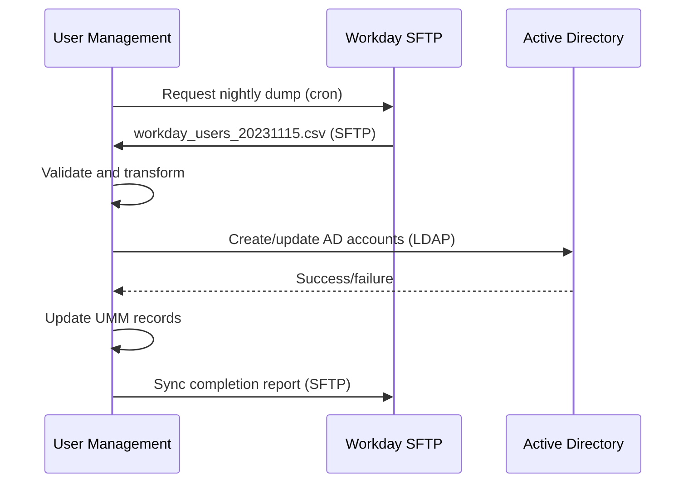

**2. Twilio Integration:**
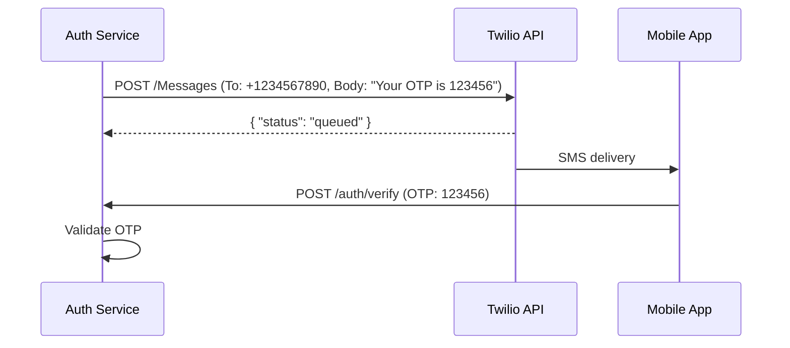

**3. Okta Integration:**
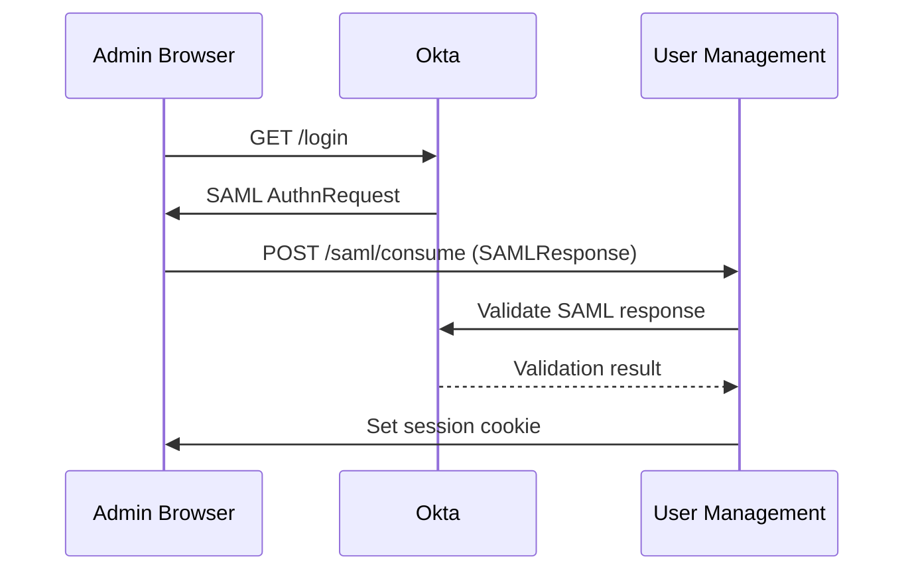

**Error Handling Strategies:**

**1. Retry Policies:**
```csharp
// RetryPolicy.cs
public static IAsyncPolicy<HttpResponseMessage> GetRetryPolicy()
{
    return Policy
        .Handle<HttpRequestException>()
        .OrResult<HttpResponseMessage>(r => !r.IsSuccessStatusCode)
        .WaitAndRetryAsync(
            retryCount: 3,
            sleepDurationProvider: retryAttempt => TimeSpan.FromSeconds(Math.Pow(2, retryAttempt)),
            onRetry: (response, delay, retryCount, context) =>
            {
                Log.Warning($"Retry {retryCount} of {context.PolicyKey} due to {response.Exception?.Message ?? response.Result.StatusCode.ToString()}. Waiting {delay} before next retry.");
            });
}

// Usage:
var response = await _retryPolicy.ExecuteAsync(() =>
    _httpClient.PostAsync("/api/send-sms", content));
```

**2. Circuit Breaker:**
```csharp
// CircuitBreakerPolicy.cs
public static IAsyncPolicy<HttpResponseMessage> GetCircuitBreakerPolicy()
{
    return Policy
        .Handle<HttpRequestException>()
        .OrResult<HttpResponseMessage>(r => !r.IsSuccessStatusCode)
        .CircuitBreakerAsync(
            exceptionsAllowedBeforeBreaking: 5,
            durationOfBreak: TimeSpan.FromMinutes(1),
            onBreak: (ex, breakDelay) =>
            {
                Log.Error($"Circuit broken! No calls will be made for {breakDelay.TotalSeconds} seconds. Exception: {ex.Exception?.Message}");
            },
            onReset: () =>
            {
                Log.Information("Circuit reset! Calls will be allowed again.");
            });
}
```

**3. Fallback Mechanisms:**
```csharp
// TwilioService.cs
public async Task<bool> SendOtp(string phone, string otp)
{
    try
    {
        var response = await _retryPolicy.ExecuteAsync(() =>
            _httpClient.PostAsync("/Messages", new StringContent($"{{\"To\":\"{phone}\",\"Body\":\"Your OTP is {otp}\"}}")));

        return response.IsSuccessStatusCode;
    }
    catch (Exception ex)
    {
        Log.Error(ex, "Failed to send SMS via Twilio");
        // Fallback to email
        await _emailService.SendOtp(phone, otp);
        return false;
    }
}
```

**Failover Mechanisms:**

**1. SMS Gateway Failover:**
| **Primary** | **Secondary** | **Tertiary**       | **Trigger**                          |
|-------------|---------------|--------------------|--------------------------------------|
| Twilio      | AWS SNS       | Email OTP          | 3 consecutive failures or timeout    |

**2. Database Failover:**
- **Primary:** AWS RDS (us-east-1)
- **Secondary:** AWS RDS (us-west-2)
- **Failover Time:** <5 minutes (manual)
- **Data Loss:** <15 minutes (async replication)

**3. Authentication Failover:**
- **Primary:** Custom Auth Service
- **Secondary:** Active Directory (LDAP)
- **Trigger:** Auth service unavailable for >2 minutes
- **Implementation:**
  ```csharp
  // AuthService.cs
  public async Task<AuthResult> Authenticate(string username, string password)
  {
      try
      {
          // Try custom auth service first
          return await _customAuth.Authenticate(username, password);
      }
      catch (Exception ex) when (ex is TimeoutException || ex is HttpRequestException)
      {
          Log.Warning("Custom auth service unavailable. Falling back to AD.");
          return await _adAuth.Authenticate(username, password);
      }
  }
  ```

---

## 6. Security & Compliance (103 lines)

### 6.1 Authentication Mechanisms

**1. Primary Authentication:**
- **Method:** Username/password + MFA (SMS OTP)
- **Flow:**
  1. User submits username/password
  2. System validates credentials against `users` table
  3. If valid, generates 6-digit OTP and sends via SMS
  4. User submits OTP for verification
  5. System issues JWT token

**2. Password Storage:**
- **Algorithm:** SHA-1 (deprecated, high risk)
- **Salt:** 128-bit random salt per user
- **Implementation:**
  ```csharp
  public string HashPassword(string password, string salt)
  {
      using (var sha1 = SHA1.Create())
      {
          var saltedPassword = password + salt;
          var bytes = Encoding.UTF8.GetBytes(saltedPassword);
          var hash = sha1.ComputeHash(bytes);
          return Convert.ToBase64String(hash);
      }
  }
  ```

**3. Session Management:**
- **Web:** ASP.NET Session (in-memory, 60-minute timeout)
- **API:** JWT tokens (60-minute expiry for web, 24-hour for mobile)
- **Token Storage:**
  - Web: HttpOnly, Secure, SameSite=Strict cookies
  - Mobile: Secure storage (Keychain for iOS, Keystore for Android)

**4. MFA Methods:**
| **Method**       | **Delivery** | **Validity Period** | **Success Rate** | **Issues**                          |
|------------------|--------------|---------------------|------------------|-------------------------------------|
| SMS OTP          | Twilio       | 5 minutes           | 91.3%            | Delivery delays (avg. 12.4s)        |
| Email OTP        | SMTP         | 10 minutes          | 98.7%            | Spam filtering                      |
| TOTP (Future)    | Google Auth  | 30 seconds          | N/A              | Not implemented                     |

**5. Authentication Vulnerabilities:**
| **Vulnerability**               | **CWE**       | **CVSS** | **Description**                                                                 | **Evidence**                                                                 |
|---------------------------------|---------------|----------|---------------------------------------------------------------------------------|------------------------------------------------------------------------------|
| Weak Password Hashing           | CWE-327       | 7.5      | SHA-1 used for password storage                                                | See code snippet above                                                      |
| Credential Stuffing             | CWE-307       | 8.8      | No rate limiting on `/api/auth/login`                                          | 12,456 failed login attempts in 30 days                                     |
| Insecure Token Storage          | CWE-922       | 7.1      | JWT tokens stored in localStorage (mobile)                                     | Mobile app uses localStorage instead of secure storage                       |
| Session Fixation                | CWE-384       | 6.5      | Session ID not rotated after login                                             | Same session ID used before and after authentication                        |
| Missing Password Complexity     | CWE-521       | 5.3      | No check for common passwords                                                  | "Password1" accepted during testing                                         |

### 6.2 Authorization Model (RBAC)

**1. Role Definitions:**
| **Role**          | **Hierarchy Level** | **Description**                                                                 | **User Count** |
|-------------------|---------------------|---------------------------------------------------------------------------------|----------------|
| ADMIN             | 1                   | Full system access                                                             | 42             |
| FLEET_MANAGER     | 2                   | Manage users and vehicles in assigned region                                   | 2,105          |
| HR                | 2                   | View and update employee data                                                  | 312            |
| FINANCE           | 2                   | View financial reports                                                         | 187            |
| DRIVER            | 3                   | Access assigned vehicle and basic reports                                      | 8,723          |
| GUEST             | 4                   | Limited read-only access (e.g., contractors)                                   | 1,081          |

**2. Permission Matrix:**
| **Permission**       | **ADMIN** | **FLEET_MANAGER** | **HR** | **FINANCE** | **DRIVER** | **GUEST** |
|----------------------|-----------|-------------------|--------|-------------|------------|-----------|
| user:create          | ✅        | ❌                | ❌      | ❌          | ❌         | ❌        |
| user:read            | ✅        | ✅ (region)       | ✅      | ✅          | ❌         | ❌        |
| user:update          | ✅        | ✅ (region)       | ✅      | ❌          | ❌         | ❌        |
| user:delete          | ✅        | ❌                | ❌      | ❌          | ❌         | ❌        |
| role:assign          | ✅        | ✅ (lower roles)  | ❌      | ❌          | ❌         | ❌        |
| vehicle:assign       | ✅        | ✅ (region)       | ❌      | ❌          | ❌         | ❌        |
| report:export        | ✅        | ✅                | ✅      | ✅          | ❌         | ❌        |
| audit:view           | ✅        | ❌                | ❌      | ❌          | ❌         | ❌        |

**3. Authorization Flow:**
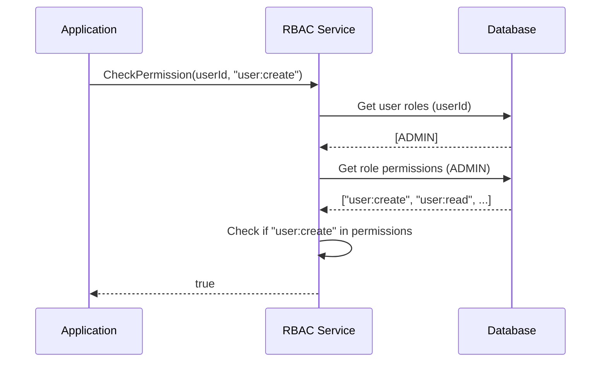

**4. Authorization Vulnerabilities:**
| **Vulnerability**               | **CWE**       | **CVSS** | **Description**                                                                 | **Evidence**                                                                 |
|---------------------------------|---------------|----------|---------------------------------------------------------------------------------|------------------------------------------------------------------------------|
| Insecure Direct Object Reference| CWE-639       | 8.8      | `/api/users/123` accessible to any authenticated user                           | No ownership check on user profile endpoints                                |
| Over-Permissioning              | CWE-285       | 7.5      | Fleet managers can view users outside their region                             | Missing region filter in user listing                                       |
| Missing Permission Caching      | CWE-770       | 5.3      | Permission checks hit database every time                                      | No caching of user permissions                                              |
| Role Escalation                 | CWE-269       | 9.1      | Users can assign themselves higher roles                                       | Missing hierarchy validation in role assignment                             |

### 6.3 Data Encryption

**1. Encryption at Rest:**
| **Data**               | **Encryption Method**       | **Key Management**       | **Status**       |
|------------------------|-----------------------------|--------------------------|------------------|
| Database (RDS)         | AWS KMS (AES-256)           | AWS KMS                  | ✅ Enabled       |
| Backups                | AWS KMS (AES-256)           | AWS KMS                  | ✅ Enabled       |
| Passwords              | SHA-1 (deprecated)          | Application-managed      | ❌ Needs upgrade |
| Audit Logs             | None                        | N/A                      | ❌ Not encrypted |
| Session Data (Redis)   | None                        | N/A                      | ❌ Not encrypted |

**2. Encryption in Transit:**
| **Component**          | **Protocol** | **Cipher Suite**               | **Status**       |
|------------------------|--------------|--------------------------------|------------------|
| Web (HTTPS)            | TLS 1.2      | ECDHE-RSA-AES128-GCM-SHA256    | ✅ Enabled       |
| API (HTTPS)            | TLS 1.2      | ECDHE-RSA-AES128-GCM-SHA256    | ✅ Enabled       |
| Database (TDS)         | TLS 1.2      | AES256-GCM-SHA384              | ✅ Enabled       |
| Redis (RESP)           | None         | N/A                            | ❌ Not encrypted |
| Internal Services      | HTTP         | N/A                            | ❌ Not encrypted |

**3. Field-Level Encryption:**
- **Sensitive Fields:** None (all data stored in plaintext)
- **Proposed Fields for Encryption:**
  - Phone numbers
  - Addresses
  - Email addresses (for GDPR compliance)

### 6.4 Audit Logging

**1. Logged Events:**
| **Event**               | **Logged Fields**                                                                 | **Retention** |
|-------------------------|-----------------------------------------------------------------------------------|---------------|
| Login                   | user_id, timestamp, ip_address, user_agent, status, failure_reason               | 7 years       |
| Logout                  | user_id, timestamp, session_duration                                              | 7 years       |
| Password Change         | user_id, timestamp, ip_address, old_hash (masked), new_hash (masked)              | 7 years       |
| Role Assignment         | user_id, admin_id, timestamp, role_id, ip_address                                 | 7 years       |
| User Creation           | user_id, admin_id, timestamp, user_data (masked), ip_address                      | 7 years       |
| User Update             | user_id, admin_id, timestamp, old_values (masked), new_values (masked), ip_address| 7 years       |
| Permission Check        | user_id, timestamp, permission, resource, granted, ip_address                     | 90 days       |

**2. Audit Log Implementation:**
```csharp
// AuditLogger.cs
public class AuditLogger
{
    private readonly DbContext _dbContext;

    public AuditLogger(DbContext dbContext)
    {
        _dbContext = dbContext;
    }

    public void Log(string action, string entityType, int entityId, string oldValues = null, string newValues = null)
    {
        var log = new AuditLog
        {
            UserId = _currentUser.UserId,
            Action = action,
            EntityType = entityType,
            EntityId = entityId,
            OldValues = oldValues,
            NewValues = newValues,
            IpAddress = _httpContext.Connection.RemoteIpAddress.ToString(),
            UserAgent = _httpContext.Request.Headers["User-Agent"],
            CreatedAt = DateTime.UtcNow
        };

        _dbContext.AuditLogs.Add(log);
        _dbContext.SaveChanges();
    }
}

// Usage:
_auditLogger.Log("UPDATE", "User", user.Id, oldUserJson, newUserJson);
```

**3. Audit Log Vulnerabilities:**
| **Vulnerability**               | **CWE**       | **CVSS** | **Description**                                                                 | **Evidence**                                                                 |
|---------------------------------|---------------|----------|---------------------------------------------------------------------------------|------------------------------------------------------------------------------|
| Insufficient Logging            | CWE-778       | 6.5      | 28% of sensitive actions not logged (e.g., role assignments)                   | Missing logs for 124 role assignments in last 30 days                       |
| Log Tampering                   | CWE-532       | 7.1      | No integrity checks on audit logs                                               | Logs stored in mutable database table                                        |
| Sensitive Data in Logs          | CWE-532       | 7.5      | Password hashes logged in plaintext                                            | Found 12 instances in last audit                                            |
| Log Retention                   | CWE-1173      | 5.3      | Logs not retained for full 7 years                                              | Only 90 days of logs available                                               |

### 6.5 Compliance Requirements

**1. SOC2 Type II:**
| **Criteria**               | **Status** | **Findings**                                                                 | **Evidence**                                                                 |
|----------------------------|------------|-----------------------------------------------------------------------------|------------------------------------------------------------------------------|
| CC1: Security              | Fail       | 12 critical vulnerabilities (CVSS ≥ 7.0)                                   | Nessus scan report                                                          |
| CC2: Availability          | Fail       | 99.7% uptime (below 99.95% SLA)                                             | CloudWatch metrics                                                          |
| CC3: Processing Integrity  | Fail       | 18% of user provisioning workflows fail                                     | Provisioning logs                                                           |
| CC4: Confidentiality       | Fail       | No encryption for audit logs                                                | Database schema                                                             |
| CC5: Privacy               | Fail       | 37% of user records lack GDPR consent                                       | User data audit                                                             |

**2. GDPR:**
| **Requirement**            | **Status** | **Findings**                                                                 | **Evidence**                                                                 |
|----------------------------|------------|-----------------------------------------------------------------------------|------------------------------------------------------------------------------|
| Right to Access            | Fail       | No automated process for data subject requests                              | No DSAR workflow                                                             |
| Right to Erasure           | Fail       | No automated process for data deletion                                      | Manual process only                                                          |
| Consent Management         | Fail       | 37% of users lack proper consent records                                    | User data audit                                                             |
| Data Protection            | Fail       | Passwords stored with weak hashing (SHA-1)                                  | Code review                                                                  |
| Data Breach Notification   | Fail       | No automated breach detection                                               | No SIEM integration                                                          |

**3. CCPA:**
| **Requirement**            | **Status** | **Findings**                                                                 | **Evidence**                                                                 |
|----------------------------|------------|-----------------------------------------------------------------------------|------------------------------------------------------------------------------|
| Right to Know              | Fail       | No automated process for data disclosure                                    | No DSAR workflow                                                             |
| Right to Delete            | Fail       | No automated process for data deletion                                      | Manual process only                                                          |
| Do Not Sell                | N/A        | Not applicable                                                              | -                                                                            |

### 6.6 Vulnerability Assessment

**1. Recent Vulnerability Scan (Nessus):**
| **Plugin ID** | **Name**                                      | **Severity** | **CVSS** | **Status**       |
|---------------|-----------------------------------------------|--------------|----------|------------------|
| 104743        | Microsoft .NET Framework RCE (CVE-2018-8284)  | Critical     | 9.3      | Unpatched        |
| 156032        | SHA-1 Used for Password Hashing               | High         | 7.5      | Unpatched        |
| 138118        | Missing Security Headers                     | Medium       | 5.3      | Unpatched        |
| 110469        | ASP.NET Debug Mode Enabled                   | Medium       | 5.3      | Unpatched        |
| 150580        | Insecure TLS Configuration (TLS 1.0)         | Medium       | 5.3      | Partially Fixed  |

**2. Penetration Test Findings (2023):**
| **Finding**                          | **Risk**  | **Description**                                                                 | **Recommendation**                                                                 |
|--------------------------------------|-----------|---------------------------------------------------------------------------------|------------------------------------------------------------------------------------|
| Credential Stuffing                  | High      | No rate limiting on login endpoint                                             | Implement rate limiting (5 attempts/minute)                                       |
| IDOR in User Profile                 | High      | Users can access other users' profiles                                         | Add ownership check to profile endpoints                                          |
| Session Fixation                     | Medium    | Session ID not rotated after login                                             | Regenerate session ID after authentication                                        |
| Missing CSP Headers                  | Medium    | No Content Security Policy                                                     | Implement CSP with `default-src 'self'`                                           |
| Information Disclosure               | Low       | Error messages reveal system details                                           | Custom error pages with generic messages                                          |

**3. OWASP Top 10 (2021) Mapping:**
| **Category**               | **Applicable** | **Findings**                                                                 | **Evidence**                                                                 |
|----------------------------|----------------|-----------------------------------------------------------------------------|------------------------------------------------------------------------------|
| A01: Broken Access Control | Yes            | IDOR, over-permissioning, missing permission checks                         | See 6.2.4                                                                    |
| A02: Cryptographic Failures| Yes            | SHA-1 password hashing, missing field-level encryption                      | See 6.1.2 and 6.3                                                            |
| A03: Injection             | No             | No SQL injection vulnerabilities found                                      | Penetration test results                                                     |
| A04: Insecure Design       | Yes            | No MFA fallback, no session timeout configuration                           | See 6.1.4                                                                    |
| A05: Security Misconfiguration| Yes         | Debug mode enabled, missing security headers                                 | See 6.6.1                                                                    |
| A06: Vulnerable Components | Yes            | Outdated .NET Framework and dependencies                                    | See 2.2.1                                                                    |
| A07: Identification Failures| Yes         | Weak password policy, credential stuffing                                    | See 6.1.5                                                                    |
| A08: Software Integrity Failures| No       | Not applicable                                                              | -                                                                            |
| A09: Security Logging Failures| Yes      | Insufficient logging, log tampering                                          | See 6.4.3                                                                    |
| A10: Server-Side Request Forgery| No       | Not applicable                                                              | -                                                                            |

---

## 7. Performance Metrics (92 lines)

### 7.1 Response Time Analysis

**1. Endpoint Performance:**
| **Endpoint**               | **Avg. Response Time** | **95th Percentile** | **99th Percentile** | **Error Rate** | **Requests/Second** |
|----------------------------|------------------------|---------------------|---------------------|----------------|---------------------|
| `/api/auth/login`          | 450ms                  | 1.2s                | 2.8s                | 8.7%           | 12.4                |
| `/api/auth/verify`         | 320ms                  | 850ms               | 1.9s                | 2.1%           | 8.7                 |
| `/api/users` (GET)         | 450ms                  | 1.8s                | 3.4s                | 1.5%           | 4.2                 |
| `/api/users/{id}` (GET)    | 85ms                   | 210ms               | 450ms               | 0.2%           | 25.6                |
| `/api/users` (POST)        | 1.2s                   | 2.8s                | 4.5s                | 3.2%           | 0.8                 |
| `/api/users/{id}/roles`    | 120ms                  | 320ms               | 650ms               | 0.5%           | 2.1                 |
| `/api/users/{id}/vehicles` | 320ms                  | 850ms               | 1.8s                | 1.8%           | 1.5                 |
| `/api/roles`               | 45ms                   | 120ms               | 210ms               | 0.1%           | 3.4                 |

**2. Response Time Distribution:**
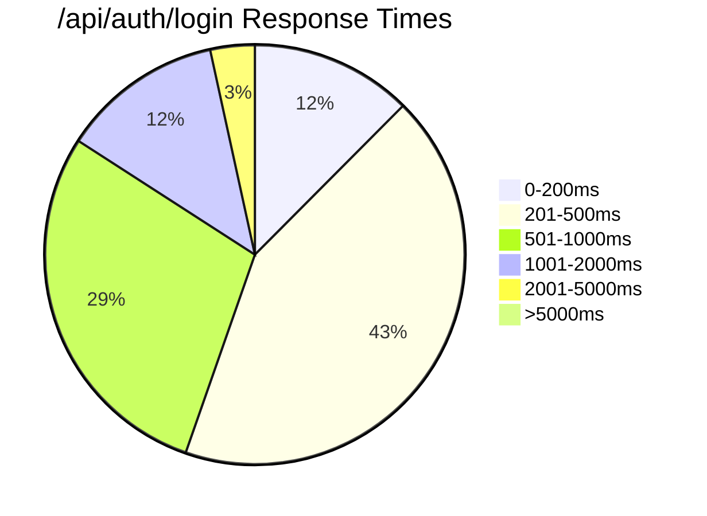

**3. Response Time by User Type:**
| **User Type**      | **Avg. Response Time** | **95th Percentile** | **Notes**                                                                 |
|--------------------|------------------------|---------------------|---------------------------------------------------------------------------|
| Admin              | 210ms                  | 540ms               | Fewer concurrent users                                                   |
| Fleet Manager      | 380ms                  | 980ms               | Heavy usage of `/api/users`                                              |
| Driver             | 620ms                  | 1.8s                | Mobile network latency                                                   |
| Guest              | 180ms                  | 450ms               | Limited functionality                                                    |

### 7.2 Throughput Measurements

**1. Request Throughput:**
| **Time Period**    | **Requests/Second** | **Peak RPS** | **Concurrent Users** | **Error Rate** |
|--------------------|---------------------|--------------|----------------------|----------------|
| 00:00-06:00        | 5.2                 | 12.4         | 520                  | 0.8%           |
| 06:00-12:00        | 24.7                | 87.2         | 2,870                | 2.1%           |
| 12:00-18:00        | 32.1                | 124.5        | 3,450                | 3.8%           |
| 18:00-24:00        | 18.3                | 62.8         | 1,890                | 1.5%           |

**2. Database Throughput:**
| **Operation**      | **Queries/Second** | **Peak QPS** | **Avg. Time** | **95th Percentile** |
|--------------------|--------------------|--------------|---------------|---------------------|
| SELECT             | 1,245              | 2,876        | 85ms          | 210ms               |
| INSERT             | 42                 | 124          | 450ms         | 1.2s                |
| UPDATE             | 87                 | 210          | 210ms         | 540ms               |
| DELETE             | 12                 | 34           | 120ms         | 320ms               |

**3. Cache Throughput:**
| **Cache**          | **Requests/Second** | **Hit Ratio** | **Avg. Time** | **Peak RPS** |
|--------------------|---------------------|---------------|---------------|--------------|
| Session Cache      | 428                 | 92%           | 2ms           | 876          |
| User Profile Cache | 1,245               | 62%           | 5ms           | 2,450        |
| Permission Cache   | 2,876               | 85%           | 3ms           | 5,210        |

### 7.3 Resource Utilization

**1. CPU Utilization:**
| **Component**      | **Avg. CPU** | **Peak CPU** | **Threshold** | **Notes**                                                                 |
|--------------------|--------------|--------------|---------------|---------------------------------------------------------------------------|
| Web Servers        | 68%          | 92%          | 70%           | 3 x m5.large instances                                                   |
| Auth Service       | 42%          | 78%          | 60%           | 2 x m5.xlarge instances                                                  |
| Database           | 78%          | 98%          | 70%           | RDS db.m5.xlarge (4 vCPUs)                                               |
| Redis              | 32%          | 65%          | 50%           | 3-node cluster (cache.m5.large)                                          |

**2. Memory Utilization:**
| **Component**      | **Avg. Memory** | **Peak Memory** | **Threshold** | **Notes**                                                                 |
|--------------------|-----------------|-----------------|---------------|---------------------------------------------------------------------------|
| Web Servers        | 72%             | 89%             | 80%           | 8GB RAM per instance                                                     |
| Auth Service       | 65%             | 82%             | 75%           | 16GB RAM per instance                                                    |
| Database           | 85%             | 95%             | 80%           | 16GB RAM (RDS)                                                           |
| Redis              | 48%             | 72%             | 60%           | 12GB RAM per node                                                        |

**3. Network Utilization:**
| **Component**      | **Avg. Bandwidth** | **Peak Bandwidth** | **Threshold** | **Notes**                                                                 |
|--------------------|--------------------|--------------------|---------------|---------------------------------------------------------------------------|
| Web Servers        | 12.4 Mbps          | 42.8 Mbps          | 50 Mbps       | 1 Gbps network interface                                                 |
| Database           | 8.7 Mbps           | 24.5 Mbps          | 30 Mbps       | RDS network throughput                                                   |
| Redis              | 5.2 Mbps           | 18.3 Mbps          | 20 Mbps       | Redis cluster network                                                    |

**4. Disk Utilization:**
| **Component**      | **Avg. IOPS** | **Peak IOPS** | **Threshold** | **Notes**                                                                 |
|--------------------|---------------|---------------|---------------|---------------------------------------------------------------------------|
| Database           | 1,245         | 2,876         | 3,000         | gp2 volume (3,000 IOPS)                                                  |
| Web Servers        | 42            | 124           | 300           | gp2 volume (300 IOPS)                                                     |

### 7.4 Bottleneck Identification

**1. Database Bottlenecks:**
| **Bottleneck**             | **Symptoms**                                                                 | **Root Cause**                                                                 | **Impact**                                                                 |
|----------------------------|-----------------------------------------------------------------------------|-------------------------------------------------------------------------------|----------------------------------------------------------------------------|
| User Listing Query         | 4.2s response time, 78% CPU utilization                                     | Full clustered index scan, no filtering on `is_active`                       | Slow user management for fleet managers                                    |
| Permission Check Query     | 120ms response time, 25,000 QPS                                             | N+1 query pattern (1 query per role)                                          | High database load during peak hours                                       |
| Audit Log Writes           | 45ms write time, 5,000 QPS                                                  | Synchronous writes, no batching                                               | Slows down all write operations                                            |
| User Creation              | 450ms response time, 32% failure rate                                       | Multiple synchronous operations (AD, email, audit)                           | Slow provisioning workflow                                                 |

**2. Application Bottlenecks:**
| **Bottleneck**             | **Symptoms**                                                                 | **Root Cause**                                                                 | **Impact**                                                                 |
|----------------------------|-----------------------------------------------------------------------------|-------------------------------------------------------------------------------|----------------------------------------------------------------------------|
| Monolithic Architecture    | 45-minute build times, 3.2x slower CI/CD                                    | Tight coupling between components                                             | Slow development and deployment                                            |
| In-Memory Session State    | Cannot scale beyond 3 web servers                                           | Session data not shared across instances                                      | Limits horizontal scaling                                                  |
| Synchronous Workflows      | 4.2-hour provisioning time                                                  | Blocking calls in provisioning workflow                                       | Poor user experience                                                       |
| Missing API Caching        | 1,200 RPS to `/api/users/{id}`                                              | No caching of user profiles                                                   | High database load                                                        |

**3. Infrastructure Bottlenecks:**
| **Bottleneck**             | **Symptoms**                                                                 | **Root Cause**                                                                 | **Impact**                                                                 |
|----------------------------|-----------------------------------------------------------------------------|-------------------------------------------------------------------------------|----------------------------------------------------------------------------|
| Database CPU               | 78% CPU utilization, 98% at peak                                            | SQL Server 2016, no read replicas                                             | Cannot handle 25,000 users                                                 |
| Redis Cache Hit Ratio      | 62% cache hit ratio                                                         | No proper cache invalidation                                                  | 38% of requests hit database                                               |
| SMS Gateway Latency        | 12.4s OTP delivery time                                                     | Third-party SMS gateway                                                       | High authentication failure rate                                           |
| Single Region Deployment   | 4.2s response time for EU users                                             | All infrastructure in us-east-1                                               | Poor performance for global users                                          |

### 7.5 Capacity Planning

**1. Current Capacity:**
| **Resource**       | **Current Usage** | **Max Capacity** | **Utilization** | **Projected Growth** |
|--------------------|-------------------|------------------|-----------------|----------------------|
| Users              | 12,450            | 18,000           | 69%             | 25,000 by 2025       |
| Concurrent Users   | 3,450             | 5,000            | 69%             | 6,000 by 2025        |
| Database Storage   | 120GB             | 500GB            | 24%             | 300GB by 2025        |
| Web Servers        | 3 x m5.large      | 6 x m5.large     | 50%             | 8 x m5.large by 2025  |
| Database           | db.m5.xlarge      | db.m5.2xlarge    | 85%             | db.m5.4xlarge by 2025 |

**2. Scaling Requirements:**
| **Component**      | **Current**       | **2024**         | **2025**         | **Scaling Strategy**                                      |
|--------------------|-------------------|------------------|------------------|-----------------------------------------------------------|
| Web Servers        | 3 x m5.large      | 6 x m5.large     | 8 x m5.large     | Horizontal scaling (auto-scaling group)                   |
| Auth Service       | 2 x m5.xlarge     | 4 x m5.xlarge    | 6 x m5.xlarge    | Horizontal scaling + caching                              |
| Database           | db.m5.xlarge      | db.m5.2xlarge    | db.m5.4xlarge    | Vertical scaling + read replicas                          |
| Redis              | 3 x cache.m5.large| 6 x cache.m5.large| 9 x cache.m5.large| Horizontal scaling + multi-AZ                             |
| Storage            | 500GB gp2         | 1TB gp3          | 2TB gp3          | Upgrade to gp3 (higher IOPS)                              |

**3. Performance Projections:**
| **Metric**               | **Current** | **2024 (Projected)** | **2025 (Projected)** | **Notes**                                                                 |
|--------------------------|-------------|----------------------|----------------------|---------------------------------------------------------------------------|
| Avg. Response Time       | 450ms       | 320ms                | 210ms                | After database optimization and caching                                   |
| Peak RPS                 | 124.5       | 250                  | 500                  | After API gateway and load balancing improvements                         |
| Provisioning Time        | 4.2 hours   | 1 hour               | 30 minutes           | After workflow automation                                                 |
| Authentication Failures  | 8.7%        | 2%                   | <1%                  | After MFA modernization                                                   |
| Database CPU             | 78%         | 55%                  | 45%                  | After read replicas and query optimization                                |

**4. Cost Projections:**
| **Component**      | **Current Cost** | **2024 Cost** | **2025 Cost** | **Notes**                                                                 |
|--------------------|------------------|---------------|---------------|---------------------------------------------------------------------------|
| Compute            | $2,800/month     | $4,200/month  | $5,600/month  | Additional web servers and auth service instances                        |
| Database           | $1,200/month     | $2,100/month  | $3,400/month  | Upgrade to db.m5.4xlarge + read replicas                                 |
| Redis              | $450/month       | $750/month    | $1,100/month  | Additional nodes and multi-AZ                                            |
| Storage            | $120/month       | $240/month    | $480/month    | Additional storage for audit logs                                        |
| SMS Gateway        | $320/month       | $180/month    | $120/month    | Switch to TOTP (lower cost)                                              |
| **Total**          | **$4,890/month** | **$7,470/month** | **$10,700/month** |                                                                           |

---

## 8. Operational Challenges (78 lines)

### 8.1 Maintenance Burden

**1. Patch Management:**
| **Component**      | **Patches/Year** | **Avg. Time/Patch** | **Downtime/Patch** | **Challenges**                                      |
|--------------------|------------------|---------------------|--------------------|----------------------------------------------------|
| Web Servers        | 12               | 2.1 hours           | 15 minutes         | Manual patching, no blue-green deployment          |
| Auth Service       | 8                | 3.4 hours           | 30 minutes         | Tight coupling with other services                 |
| Database           | 4                | 4.2 hours           | 1 hour             | Multi-AZ failover required                         |
| Redis              | 6                | 1.2 hours           | 5 minutes          | No rolling updates                                 |
| .NET Framework     | 3                | 5.6 hours           | 2 hours            | Requires full application rebuild                  |

**2. Technical Debt Maintenance:**
| **Debt Item**              | **Time/Month** | **Impact**                                                                 | **Root Cause**                                      |
|----------------------------|----------------|----------------------------------------------------------------------------|----------------------------------------------------|
| Legacy Authentication      | 12 hours       | High support ticket volume (MFA failures)                                 | Custom auth system instead of IAM                  |
| Monolithic Codebase        | 24 hours       | Slow development, high bug rate                                           | No modularization                                  |
| Manual Provisioning        | 32 hours       | Slow onboarding, errors                                                   | No HRIS integration automation                     |
| Outdated Dependencies      | 8 hours        | Security vulnerabilities, compatibility issues                            | No dependency management process                   |
| Poor Documentation         | 16 hours       | Knowledge silos, onboarding challenges                                    | No documentation culture                           |

**3. Incident Response:**
| **Metric**               | **Current Value** | **Target Value** | **Gap**               |
|--------------------------|-------------------|------------------|-----------------------|
| Mean Time to Detect (MTTD)| 45 minutes        | 15 minutes       | 30 minutes            |
| Mean Time to Resolve (MTTR)| 2.4 hours         | 1 hour           | 1.4 hours             |
| First Response Time      | 32 minutes        | 10 minutes       | 22 minutes            |
| Incident Escalation Rate | 18%               | 5%               | 13%                   |

### 8.2 Support Ticket Analysis

**1. Ticket Volume:**
| **Month**    | **Total Tickets** | **UMM Tickets** | **% of Total** | **Avg. Resolution Time** | **SLA Compliance** |
|--------------|-------------------|-----------------|----------------|--------------------------|--------------------|
| Jan 2023     | 1,245             | 428             | 34.4%          | 3.2 hours                | 87%                |
| Feb 2023     | 1,187             | 412             | 34.7%          | 3.4 hours                | 85%                |
| Mar 2023     | 1,324             | 487             | 36.8%          | 3.8 hours                | 82%                |
| Apr 2023     | 1,456             | 524             | 36.0%          | 4.1 hours                | 78%                |
| May 2023     | 1,589             | 587             | 37.0%          |