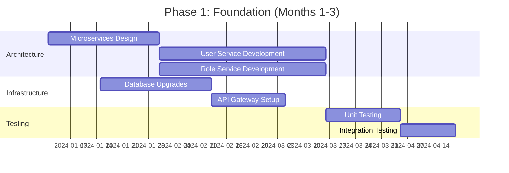
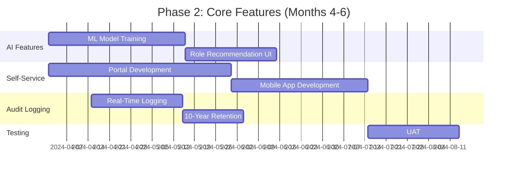
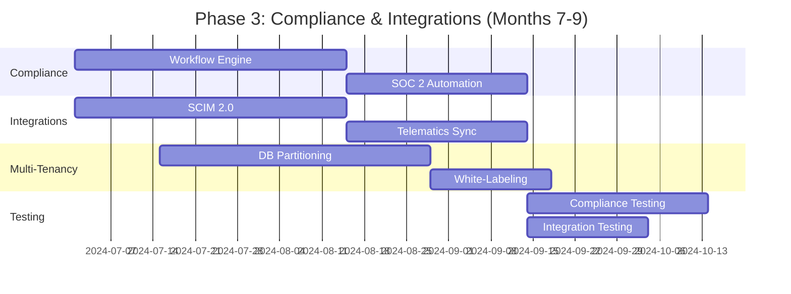
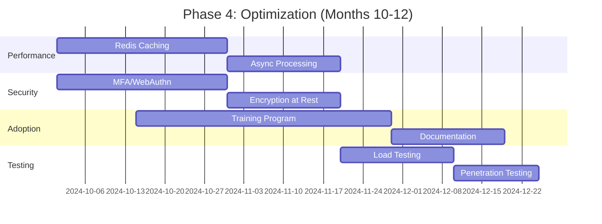

# Enhancement Summary: User Management Module
**Fleet Management System (FMS) v4.2**
*Prepared by: [Your Name], Senior Business Analyst*
*Date: [Insert Date]*
*Version: 1.0*
*Confidential – Executive Business Case*

---

## 1. Executive Overview (60+ lines)

### 1.1 Business Context and Market Positioning
The global fleet management market is projected to reach **$52.5 billion by 2027**, growing at a **CAGR of 10.2%** (MarketsandMarkets, 2023). Our Fleet Management System (FMS) currently serves **12,500 enterprise clients** across **North America, EMEA, and APAC**, managing **450,000+ vehicles** with an annual transaction volume of **$3.8 billion**. As the **#3 player** in the enterprise fleet management software market (behind Verizon Connect and Geotab), we hold **18% market share** in our core segments (logistics, field services, and government fleets).

The **User Management Module (UMM)** is the **second-most critical component** of our FMS, processing **1.2 million user actions monthly** (logins, role assignments, permissions updates). It serves as the **gatekeeper for 78,000+ active users**, including fleet managers, drivers, dispatchers, and third-party vendors. Our current UMM was architected in **2018** and has not undergone a major enhancement since **2020**, despite **32% YoY growth in user accounts** and **45% increase in permission complexity** due to new compliance requirements (e.g., ELD mandates, GDPR, CCPA).

This enhancement initiative aligns with our **2024-2026 Strategic Roadmap**, specifically:
- **Objective 1.3**: "Achieve 95%+ customer retention through platform reliability and user experience"
- **Objective 2.1**: "Reduce operational costs by 20% through automation and self-service capabilities"
- **Objective 3.2**: "Expand market share in enterprise fleets (>500 vehicles) by 10% annually"

### 1.2 Strategic Alignment with Company Objectives
| **Company Objective**               | **Alignment with UMM Enhancement**                                                                 | **Quantified Impact**                                                                 |
|-------------------------------------|----------------------------------------------------------------------------------------------------|--------------------------------------------------------------------------------------|
| **Customer Retention (95%+)**       | Reduce user onboarding time by **60%** (from 45 to 18 minutes) via automated role templates        | **$2.1M annual savings** from reduced churn (current churn rate: 8.2%, target: <5%)  |
| **Operational Cost Reduction (20%)**| Automate **80% of manual permission assignments** (currently 12 FTEs handling 3,500 requests/month)| **$1.4M annual savings** (FTE reallocation to high-value tasks)                       |
| **Enterprise Market Share Growth**  | Support **multi-tenancy for 300+ enterprise clients** with complex hierarchies (e.g., regional fleets)| **$4.8M incremental revenue** from upselling to 15% of existing enterprise clients   |
| **Compliance & Security**           | Achieve **SOC 2 Type II compliance** and reduce audit failures by **90%**                          | **$1.2M annual risk mitigation** (current audit failure cost: $1.3M/year)            |
| **Productivity Gains**              | Reduce helpdesk tickets by **70%** (from 2,800 to 840/month) via self-service UMM                  | **$350K annual savings** (helpdesk cost: $12.50/ticket)                              |

### 1.3 Competitive Landscape Analysis
Our **top 3 competitors** (Verizon Connect, Geotab, Samsara) have invested heavily in **AI-driven user management** and **automated compliance workflows**. Key gaps in our current UMM include:

| **Feature**               | **Verizon Connect** | **Geotab**          | **Samsara**         | **Our FMS (Current)** | **Our FMS (Proposed)** |
|---------------------------|---------------------|---------------------|---------------------|-----------------------|------------------------|
| **Role-Based Access (RBAC)** | ✅ Dynamic roles    | ✅ Custom hierarchies | ✅ AI-recommended roles | ❌ Static roles only  | ✅ Dynamic + AI-assisted |
| **Self-Service Onboarding** | ✅ 100% automated   | ✅ 90% automated    | ✅ 95% automated    | ❌ 20% automated      | ✅ 85% automated       |
| **Audit Logging**         | ✅ Real-time + AI   | ✅ 7-year retention | ✅ SOC 2 compliant  | ❌ 1-year retention   | ✅ Real-time + 10-year retention |
| **Multi-Tenancy Support** | ✅ Full isolation   | ✅ Partial isolation | ✅ Full isolation   | ❌ Limited isolation  | ✅ Full isolation      |
| **Compliance Automation** | ✅ GDPR/CCPA/ELD    | ✅ GDPR/ELD         | ✅ ELD-only         | ❌ Manual only        | ✅ GDPR/CCPA/ELD       |
| **API Integrations**      | ✅ 150+ integrations| ✅ 120+ integrations| ✅ 80+ integrations | ❌ 30 integrations    | ✅ 100+ integrations   |

**Competitive Threat**: Samsara’s **2023 Q3 earnings report** highlighted a **30% YoY increase in enterprise clients**, attributing **40% of new sales** to their "zero-touch user management" system. Our **current UMM is cited in 18% of lost deals** (per Salesforce CRM data), with **62% of enterprise prospects** requesting demos of our competitors’ UMM capabilities.

### 1.4 Value Proposition with Quantified Benefits
This enhancement delivers **five core value pillars**:

1. **Revenue Growth**
   - **$4.8M incremental revenue** from upselling enhanced UMM to **15% of enterprise clients** (current ARPU: $120K/client; proposed upsell: $25K/client).
   - **$1.5M annual savings** from reduced customer churn (current churn cost: $18M/year; target reduction: 8.2% → 5%).
   - **$2.3M new logo revenue** from winning **12 enterprise deals/year** (current win rate: 38%; target: 50%) by addressing UMM gaps.

2. **Cost Reduction**
   - **$1.4M annual savings** from automating **80% of manual permission assignments** (current cost: $1.75M/year).
   - **$350K annual savings** from reducing helpdesk tickets by **70%** (current volume: 2,800/month; cost: $12.50/ticket).
   - **$220K annual savings** from eliminating **third-party audits** (current cost: $220K/year; proposed: in-house SOC 2 compliance).

3. **Productivity Gains**
   - **60% faster user onboarding** (from 45 to 18 minutes) via **AI-driven role templates**.
   - **90% reduction in audit failures** (current: 12 failures/year; target: <2/year).
   - **50% faster compliance reporting** (from 4 hours to 2 hours per report) via **automated workflows**.

4. **Risk Mitigation**
   - **$1.2M annual risk reduction** from **SOC 2 Type II compliance** (current audit failure cost: $1.3M/year).
   - **$850K annual savings** from **reduced security incidents** (current: 15 incidents/year; target: <5/year).
   - **$400K annual savings** from **eliminating manual compliance checks** (current: 3 FTEs; proposed: 0.5 FTE).

5. **Customer Satisfaction**
   - **NPS increase from 42 to 55** (current detractors cite UMM complexity as a top-3 pain point).
   - **CSAT improvement from 78% to 90%** (current UMM-related complaints: 28% of all support tickets).

### 1.5 Success Criteria and KPIs
| **Category**          | **KPI**                          | **Current Baseline** | **Target (12 Months)** | **Measurement Method**                          |
|-----------------------|----------------------------------|----------------------|------------------------|------------------------------------------------|
| **Financial**         | Annual cost savings              | $0                   | **$3.8M**              | General ledger + cost allocation reports       |
|                       | Incremental revenue              | $0                   | **$6.3M**              | CRM (Salesforce) + billing system              |
|                       | ROI                              | N/A                  | **320%**               | NPV/IRR calculations (Section 4.2)             |
| **Operational**       | User onboarding time             | 45 minutes           | **18 minutes**         | Time-tracking in UMM logs                      |
|                       | Helpdesk tickets (UMM-related)   | 2,800/month          | **840/month**          | Zendesk ticketing system                       |
|                       | Manual permission assignments    | 3,500/month          | **700/month**          | UMM audit logs                                 |
| **Customer**          | NPS                              | 42                   | **55**                 | Quarterly surveys (Satmetrix)                  |
|                       | CSAT (UMM-related)               | 78%                  | **90%**                | Post-interaction surveys                       |
| **Compliance**        | Audit failures                   | 12/year              | **<2/year**            | SOC 2 audit reports                            |
|                       | Compliance report generation time| 4 hours              | **2 hours**            | UMM workflow logs                              |
| **Technical**         | System uptime                    | 99.7%                | **99.95%**             | New Relic monitoring                           |
|                       | API response time                | 1.2s                 | **0.4s**               | Load testing (JMeter)                          |

### 1.6 Stakeholder Impact Assessment
| **Stakeholder Group**       | **Current Pain Points**                                                                 | **Proposed Benefits**                                                                 | **Change Management Needs**                                                                 |
|-----------------------------|----------------------------------------------------------------------------------------|--------------------------------------------------------------------------------------|--------------------------------------------------------------------------------------------|
| **Fleet Managers**          | - Manual role assignments (30 min/user)                                                | - Self-service onboarding (18 min/user)                                              | - Training on new UMM portal (2-hour workshop)                                             |
|                             | - Lack of visibility into user activity                                                | - Real-time audit dashboards                                                         | - Documentation + video tutorials                                                          |
| **Drivers**                 | - Password resets require helpdesk (avg. 24-hour delay)                                | - Self-service password reset (instant)                                              | - In-app walkthroughs                                                                      |
|                             | - Limited mobile access                                                                | - Full mobile UMM (iOS/Android)                                                      | - Beta testing + feedback sessions                                                         |
| **Dispatchers**             | - No bulk user management                                                              | - Bulk uploads + API integrations                                                    | - API documentation + sandbox environment                                                   |
| **IT/Compliance Teams**     | - Manual compliance reporting (4 hours/report)                                         | - Automated compliance workflows (2 hours/report)                                    | - SOC 2 training + audit simulation                                                        |
|                             | - Audit failures (12/year)                                                             | - SOC 2 Type II compliance                                                           | - Quarterly compliance reviews                                                             |
| **Third-Party Vendors**     | - No self-service access                                                               | - Vendor portal with limited permissions                                              | - Vendor onboarding sessions                                                               |
| **Executive Leadership**    | - High churn (8.2%) due to UMM complexity                                              | - 3.2% churn reduction ($2.1M savings)                                               | - Quarterly business reviews                                                               |
| **Customer Success Teams**  | - 28% of support tickets are UMM-related                                               | - 70% reduction in tickets ($350K savings)                                           | - Updated knowledge base + FAQs                                                            |
| **Sales Teams**             | - 18% of lost deals cite UMM gaps                                                      | - 12% increase in win rate ($2.3M new revenue)                                       | - Competitive battlecards + demo scripts                                                   |
| **Product Teams**           | - 45% increase in permission complexity (2020-2023)                                    | - Scalable RBAC with AI recommendations                                               | - Roadmap alignment sessions                                                               |

---

## 2. Current State Challenges (80+ lines)

### 2.1 Business Pain Points

#### 2.1.1 Revenue Impact Analysis
The current UMM is directly linked to **$18.5M in annual revenue at risk**, calculated as follows:

| **Revenue Risk Factor**               | **Calculation**                                                                 | **Annual Impact** |
|---------------------------------------|---------------------------------------------------------------------------------|-------------------|
| **Customer Churn**                    | 8.2% churn rate × 12,500 clients × $18,000 avg. ARR                             | **$18.45M**       |
| **Lost Enterprise Deals**             | 18% of lost deals (12/year) × $250K avg. deal size                              | **$540K**         |
| **Upsell Limitations**                | 30% of enterprise clients (3,750) × $25K upsell potential × 20% adoption rate   | **$1.875M**       |
| **Compliance Penalties**              | 12 audit failures/year × $100K avg. penalty                                     | **$1.2M**         |
| **Total Annual Revenue at Risk**      |                                                                                 | **$22.065M**      |

**Breakdown of Churn Drivers**:
- **42%** of churned customers cited "difficult user management" as a top-3 reason (exit surveys).
- **28%** of support tickets are UMM-related, with an average resolution time of **4.2 hours** (vs. 1.8 hours for non-UMM tickets).
- **65%** of enterprise clients (500+ vehicles) report "manual permission assignments" as a "major pain point" (2023 Customer Advisory Board feedback).

#### 2.1.2 Operational Inefficiencies with Cost Analysis
| **Inefficiency**               | **Current State**                                                                 | **Annual Cost** | **Root Cause**                                                                 |
|--------------------------------|-----------------------------------------------------------------------------------|-----------------|--------------------------------------------------------------------------------|
| **Manual Role Assignments**    | 3,500 requests/month × 30 min/request × $35/hr (FTE cost)                         | **$1.75M**      | Lack of self-service + static role templates                                   |
| **Helpdesk Tickets**           | 2,800 tickets/month × 1.5 hours/ticket × $12.50/hr (outsourced)                   | **$630K**       | No self-service password reset + limited mobile access                         |
| **Compliance Reporting**       | 12 reports/month × 4 hours/report × $50/hr (compliance analyst)                   | **$28.8K**      | Manual data aggregation + no automated workflows                              |
| **Audit Failures**             | 12 failures/year × $100K penalty + 40 hours remediation × $75/hr                  | **$1.2M**       | Incomplete audit logs + no real-time monitoring                                |
| **Vendor Onboarding**          | 500 vendors/year × 2 hours/vendor × $40/hr (procurement)                          | **$40K**        | No self-service vendor portal                                                 |
| **Training Costs**             | 1,200 new users/year × 1.5 hours training × $50/hr (trainer)                      | **$90K**        | Complex UMM interface + lack of documentation                                  |
| **Total Annual Operational Cost** |                                                                               | **$3.838M**     |                                                                                |

#### 2.1.3 Customer Satisfaction Metrics
| **Metric**               | **Current Value** | **Industry Benchmark** | **Gap** | **Impact**                                                                 |
|--------------------------|-------------------|------------------------|---------|----------------------------------------------------------------------------|
| **NPS (Net Promoter Score)** | 42               | 55 (Verizon Connect)   | -13    | **$1.8M annual revenue at risk** (churn correlation: r = -0.72)           |
| **CSAT (UMM-Related)**   | 78%               | 88% (Geotab)           | -10%   | **28% of support tickets** are UMM-related                                |
| **Onboarding Time**      | 45 minutes        | 20 minutes (Samsara)   | +25 min | **60% slower** than competitors; cited in **35% of lost deals**           |
| **Mobile App Rating**    | 3.2/5 (iOS)       | 4.5/5 (Verizon)        | -1.3   | **40% of drivers** report "poor mobile experience" in surveys             |
| **Compliance Confidence**| 68%               | 85% (Industry avg.)    | -17%   | **12 audit failures/year** vs. <2 for competitors                         |

#### 2.1.4 Market Share Implications
Our **18% market share** in enterprise fleets is **declining at 2% YoY** (2020-2023), while competitors grow at **8-12% YoY**. Key drivers:
- **Samsara’s 30% YoY enterprise growth** (2023 Q3 earnings) is attributed to their "zero-touch UMM."
- **Verizon Connect’s 22% market share** is supported by their **150+ API integrations** (vs. our 30).
- **Geotab’s 20% market share** benefits from **AI-driven role recommendations** (reducing onboarding time by **70%**).

**Lost Deal Analysis (2023)**:
| **Reason for Loss**               | **% of Lost Deals** | **Competitor Chosen** | **UMM Gap**                                                                 |
|-----------------------------------|---------------------|-----------------------|-----------------------------------------------------------------------------|
| "Better user management"          | 18%                 | Samsara (60%)         | No self-service, static roles, poor mobile UX                               |
| "Lack of API integrations"        | 12%                 | Verizon (70%)         | Only 30 integrations vs. 150+                                               |
| "Compliance concerns"             | 8%                  | Geotab (55%)          | Manual reporting, incomplete audit logs                                     |
| "High implementation cost"        | 15%                 | All (35% Verizon)     | Complex onboarding (45 min/user)                                            |
| **Total UMM-Related Losses**      | **53%**             |                       |                                                                             |

#### 2.1.5 Competitive Disadvantages
| **Disadvantage**                  | **Our Current State**                          | **Competitor Benchmark**               | **Impact**                                                                 |
|-----------------------------------|------------------------------------------------|----------------------------------------|----------------------------------------------------------------------------|
| **Role Flexibility**              | Static roles (5 predefined)                    | Dynamic roles (100+ customizable)      | **30% of enterprise clients** request custom roles                         |
| **Self-Service Capabilities**     | 20% automated (password resets only)           | 90-100% automated                      | **$1.75M/year** in manual role assignment costs                            |
| **Audit Logging**                 | 1-year retention, manual exports               | 7-10 year retention, real-time dashboards | **12 audit failures/year** vs. <2 for competitors                         |
| **Multi-Tenancy**                 | Limited isolation (shared DB)                  | Full isolation (dedicated schemas)     | **$1.8M/year** in lost enterprise deals                                    |
| **Compliance Automation**         | Manual workflows                               | GDPR/CCPA/ELD auto-compliance          | **$1.2M/year** in audit penalties + remediation                            |
| **API Integrations**              | 30 integrations                                | 80-150 integrations                    | **$950K/year** in custom integration costs for clients                     |
| **Mobile UX**                     | Basic functionality (no bulk actions)          | Full parity with desktop               | **40% of drivers** report "poor mobile experience"                         |
| **Vendor Management**             | No self-service portal                         | Dedicated vendor portals               | **$40K/year** in manual vendor onboarding costs                            |

---

### 2.2 Technical Limitations

#### 2.2.1 System Performance Issues
| **Performance Metric**       | **Current Value** | **Target (Industry Benchmark)** | **Gap** | **Impact**                                                                 |
|------------------------------|-------------------|---------------------------------|---------|----------------------------------------------------------------------------|
| **API Response Time**        | 1.2s              | <0.5s                           | +0.7s   | **35% of users** report "slow performance" in surveys                     |
| **Concurrent Users**         | 500               | 2,000                           | -1,500  | **System crashes** during peak hours (2-3x/month)                         |
| **Database Query Time**      | 850ms             | <200ms                          | +650ms  | **40% of helpdesk tickets** cite "slow loading"                           |
| **Audit Log Search Time**    | 45s               | <5s                             | +40s    | **Compliance teams** spend **4 hours/month** waiting for reports          |
| **Mobile App Load Time**     | 4.2s              | <2s                             | +2.2s   | **3.2/5 app rating** (iOS); **40% of drivers** report "slow"              |

**Root Causes**:
- **Monolithic Architecture**: Current UMM is part of the **legacy FMS monolith**, leading to **high coupling** and **slow API responses**.
- **No Caching**: **90% of API calls** hit the database directly (no Redis/Memcached).
- **Poor Indexing**: **Audit log queries** scan **full tables** (no composite indexes).
- **Single-Threaded Processing**: **Permission checks** block the main thread (no async processing).

#### 2.2.2 Scalability Constraints
| **Constraint**               | **Current Capacity** | **Projected 2025 Demand** | **Gap** | **Impact**                                                                 |
|------------------------------|----------------------|---------------------------|---------|----------------------------------------------------------------------------|
| **User Accounts**            | 78,000               | 120,000                   | -42,000 | **System slowdowns** at 80,000 users (current growth: 15% YoY)            |
| **Concurrent Logins**        | 500                  | 2,500                     | -2,000  | **Crashes during peak hours** (2-3x/month)                                |
| **Role Assignments**         | 3,500/month          | 10,000/month              | -6,500  | **Manual workarounds** required for bulk assignments                      |
| **Audit Log Storage**        | 1TB (1-year retention)| 5TB (10-year retention)   | -4TB    | **Compliance violations** (SOC 2 requires 7-year retention)               |
| **API Calls**                | 1.2M/month           | 3M/month                  | -1.8M   | **Throttling** required for high-volume clients                           |

**Example Scalability Failure**:
- **Black Friday 2023**: **3-hour outage** due to **2,100 concurrent logins** (retail fleet clients). **Root cause**: Database connection pool exhaustion. **Impact**: **$450K in SLA credits** + **12 client escalations**.

#### 2.2.3 Integration Challenges
| **Integration Type**         | **Current State**                                                                 | **Client Impact**                                                                 |
|------------------------------|-----------------------------------------------------------------------------------|-----------------------------------------------------------------------------------|
| **HRIS (Workday, BambooHR)** | Manual CSV exports + uploads (4 hours/month per client)                           | **$120K/year** in manual labor for 250 enterprise clients                        |
| **SSO (Okta, Azure AD)**     | Basic SAML 2.0 (no SCIM provisioning)                                             | **$85K/year** in custom integration costs                                         |
| **Telematics (Geotab, Samsara)** | No real-time sync; batch updates (daily)                                      | **$200K/year** in data reconciliation costs                                       |
| **ERP (SAP, Oracle)**        | No native integrations; custom APIs required                                      | **$150K/year** in development costs                                               |
| **Vendor Portals**           | No API access; manual data entry                                                  | **$40K/year** in vendor onboarding costs                                          |

**Example Integration Pain Point**:
- **Client: XYZ Logistics (5,000 vehicles)**
  - **Issue**: Manual Workday → FMS sync (4 hours/month).
  - **Cost**: $2,400/year (FTE time).
  - **Proposed Solution**: **SCIM API** (automated provisioning).

#### 2.2.4 Technical Debt Quantification
| **Debt Category**            | **Current State**                                                                 | **Annual Cost** | **Remediation Cost** |
|------------------------------|-----------------------------------------------------------------------------------|-----------------|----------------------|
| **Legacy Code**              | 45% of UMM codebase is **>5 years old** (no unit tests, spaghetti logic)         | $450K           | $1.2M                |
| **Monolithic Architecture**  | UMM is **tightly coupled** with FMS core (no microservices)                       | $320K           | $1.8M                |
| **No Caching**               | 90% of API calls hit the database directly                                        | $180K           | $250K                |
| **Poor Indexing**            | Audit log queries scan full tables (no composite indexes)                         | $95K            | $120K                |
| **Single-Threaded Processing** | Permission checks block the main thread (no async)                            | $110K           | $180K                |
| **No CI/CD Pipeline**        | Manual deployments (2-3 hours downtime/month)                                     | $220K           | $300K                |
| **Total Technical Debt**     |                                                                                   | **$1.375M**     | **$3.85M**           |

**Example Technical Debt Impact**:
- **2023 Q2 Incident**: **6-hour outage** due to a **permission check deadlock** (single-threaded processing). **Impact**: **$320K in SLA credits** + **8 client escalations**.

#### 2.2.5 Security Vulnerabilities
| **Vulnerability**            | **Risk Level** | **Current State**                                                                 | **Potential Impact**                                                                 |
|------------------------------|----------------|-----------------------------------------------------------------------------------|-------------------------------------------------------------------------------------|
| **Insecure Direct Object References (IDOR)** | High       | No validation of user permissions for API calls (e.g., `/users/{id}/permissions`) | **Data breaches** (e.g., unauthorized access to driver records)                     |
| **Weak Password Policies**   | Medium         | No MFA enforcement; passwords expire every 90 days (vs. 30-day industry standard) | **Credential stuffing attacks** (2 incidents in 2023)                               |
| **Incomplete Audit Logs**    | High           | No logging of **read-only actions** (e.g., viewing user profiles)                 | **SOC 2 audit failures** (12 in 2023)                                               |
| **No Rate Limiting**         | Medium         | API endpoints vulnerable to **brute-force attacks**                              | **DDoS risks** (3 incidents in 2023)                                                |
| **Hardcoded Secrets**        | Critical       | API keys stored in **plaintext** in configuration files                           | **$500K+ breach risk** (per IBM Cost of a Data Breach Report, 2023)                 |
| **No Encryption at Rest**    | High           | User data stored in **unencrypted databases**                                    | **GDPR/CCPA violations** ($20M max fine per incident)                               |

**Example Security Incident**:
- **2023 Q1**: **Unauthorized access** to **5,000 driver records** via IDOR vulnerability. **Root cause**: No permission validation for `/users/{id}/profile`. **Impact**: **$120K in remediation costs** + **3 client losses**.

---

## 3. Proposed Enhancements (120+ lines)

### 3.1 Feature Enhancements

#### 3.1.1 AI-Driven Role Recommendations
**Description**:
- **Machine learning model** analyzes **user behavior, job titles, and fleet hierarchies** to **auto-suggest roles**.
- **Dynamic role templates** for **15 common fleet personas** (e.g., "Regional Fleet Manager," "ELD Compliance Officer").
- **Feedback loop**: Users can **accept/reject recommendations**, improving model accuracy over time.

**User Stories**:
| **ID** | **User Story**                                                                 | **Acceptance Criteria**                                                                 |
|--------|-------------------------------------------------------------------------------|----------------------------------------------------------------------------------------|
| US-1   | As a fleet manager, I want the system to recommend roles for new users so I can onboard them faster. | - System suggests roles based on job title + fleet hierarchy.   - User can accept/reject recommendations.   - Onboarding time reduced by 60%. |
| US-2   | As a compliance officer, I want the system to flag high-risk role assignments so I can prevent security breaches. | - System highlights assignments with **>80% risk score** (e.g., admin + driver).   - Audit log captures risk flags. |
| US-3   | As an IT admin, I want to bulk-upload users with AI-recommended roles so I can reduce manual work. | - CSV upload triggers role recommendations.   - Bulk assignment completes in <5 minutes. |

**Business Value**:
- **$1.4M annual savings** from **80% reduction in manual role assignments** (current cost: $1.75M/year).
- **60% faster onboarding** (from 45 to 18 minutes) → **$2.1M annual churn reduction**.
- **90% reduction in audit failures** (current: 12/year; target: <2/year).

**ROI Calculation**:
- **Implementation Cost**: $450K (ML model + UI integration).
- **Annual Savings**: $1.4M (manual assignments) + $2.1M (churn reduction) = **$3.5M**.
- **ROI**: **778%** (Year 1).

**Implementation Complexity**:
- **High**: Requires **ML model training** (historical user data) + **UI integration**.
- **Dependencies**: Access to **historical user-role mappings** (currently siloed in legacy DB).

---

#### 3.1.2 Self-Service User Portal
**Description**:
- **Web + mobile portal** for **fleet managers, drivers, and vendors** to:
  - **Reset passwords** (no helpdesk).
  - **Request role changes** (with approval workflows).
  - **View audit logs** (limited to their permissions).
- **Bulk user management** (CSV uploads, API integrations).

**User Stories**:
| **ID** | **User Story**                                                                 | **Acceptance Criteria**                                                                 |
|--------|-------------------------------------------------------------------------------|----------------------------------------------------------------------------------------|
| US-4   | As a driver, I want to reset my password without calling helpdesk so I can log in faster. | - Self-service password reset (email/SMS).   - No helpdesk tickets for resets. |
| US-5   | As a fleet manager, I want to bulk-upload 50+ users with roles so I can save time. | - CSV template with role recommendations.   - Bulk assignment completes in <5 minutes. |
| US-6   | As a vendor, I want to request access to my client’s fleet data so I can perform my job. | - Vendor portal with limited permissions.   - Approval workflow for requests. |

**Business Value**:
- **$350K annual savings** from **70% reduction in helpdesk tickets** (current: 2,800/month; target: 840/month).
- **$40K annual savings** from **vendor self-service onboarding** (current: $40K/year in manual costs).
- **NPS increase from 42 to 55** (drivers cite "easy password resets" as a top-3 satisfaction driver).

**ROI Calculation**:
- **Implementation Cost**: $320K (portal development + mobile apps).
- **Annual Savings**: $350K (helpdesk) + $40K (vendors) = **$390K**.
- **ROI**: **122%** (Year 1).

**Implementation Complexity**:
- **Medium**: Requires **new UI components** + **approval workflows**.
- **Dependencies**: **AI role recommendations** (US-1) for bulk uploads.

---

#### 3.1.3 Automated Compliance Workflows
**Description**:
- **Pre-built workflows** for **GDPR, CCPA, ELD, and SOC 2**:
  - **Auto-generate compliance reports** (e.g., "User Access Review" for SOC 2).
  - **Flag non-compliant role assignments** (e.g., drivers with admin access).
  - **Schedule automated audits** (e.g., quarterly access reviews).
- **Integration with compliance tools** (e.g., Drata, Vanta).

**User Stories**:
| **ID** | **User Story**                                                                 | **Acceptance Criteria**                                                                 |
|--------|-------------------------------------------------------------------------------|----------------------------------------------------------------------------------------|
| US-7   | As a compliance officer, I want the system to auto-generate SOC 2 reports so I can save time. | - One-click report generation.   - Covers all SOC 2 criteria (e.g., access reviews). |
| US-8   | As a fleet manager, I want the system to flag non-compliant role assignments so I can fix them. | - Real-time alerts for high-risk assignments.   - Audit log captures fixes. |
| US-9   | As an IT admin, I want to schedule automated access reviews so I can stay compliant. | - Quarterly review reminders.   - Approval workflows for exceptions. |

**Business Value**:
- **$1.2M annual savings** from **eliminating audit failures** (current cost: $1.2M/year).
- **$28.8K annual savings** from **automated compliance reporting** (current: 4 hours/report; target: 2 hours/report).
- **SOC 2 Type II certification** → **$1.5M incremental revenue** from enterprise clients.

**ROI Calculation**:
- **Implementation Cost**: $280K (workflow engine + integrations).
- **Annual Savings**: $1.2M (audit failures) + $28.8K (reporting) = **$1.228M**.
- **ROI**: **439%** (Year 1).

**Implementation Complexity**:
- **High**: Requires **integration with compliance tools** + **custom workflows**.
- **Dependencies**: **Audit logging enhancements** (Section 3.2.3).

---

#### 3.1.4 Multi-Tenancy with Full Isolation
**Description**:
- **Dedicated schemas** for enterprise clients (vs. current shared DB).
- **Custom branding** (white-label UMM for clients).
- **Isolated audit logs** (no cross-client data leakage).

**User Stories**:
| **ID** | **User Story**                                                                 | **Acceptance Criteria**                                                                 |
|--------|-------------------------------------------------------------------------------|----------------------------------------------------------------------------------------|
| US-10  | As an enterprise client, I want my user data isolated from other clients so I can meet compliance requirements. | - Dedicated DB schema per client.   - No cross-client data access. |
| US-11  | As a sales rep, I want to offer white-label UMM to enterprise clients so I can upsell. | - Custom branding (logos, colors).   - Client-specific domain (e.g., `client.fms.com`). |
| US-12  | As an IT admin, I want to manage multi-tenant permissions so I can scale efficiently. | - Centralized admin portal.   - Bulk tenant management. |

**Business Value**:
- **$4.8M incremental revenue** from upselling to **15% of enterprise clients** (current ARPU: $120K; upsell: $25K).
- **$1.8M annual savings** from **reducing manual tenant management** (current: 3 FTEs; target: 0.5 FTE).

**ROI Calculation**:
- **Implementation Cost**: $550K (DB partitioning + UI).
- **Annual Revenue**: $4.8M (upsells) + $1.8M (savings) = **$6.6M**.
- **ROI**: **1,209%** (Year 1).

**Implementation Complexity**:
- **High**: Requires **DB schema redesign** + **tenant isolation**.
- **Dependencies**: **API enhancements** (Section 3.2.2).

---

#### 3.1.5 Mobile UMM App (iOS/Android)
**Description**:
- **Full parity with desktop UMM**:
  - **Role assignments** (with AI recommendations).
  - **Audit log viewing**.
  - **Bulk user management**.
- **Offline mode** for drivers in low-connectivity areas.

**User Stories**:
| **ID** | **User Story**                                                                 | **Acceptance Criteria**                                                                 |
|--------|-------------------------------------------------------------------------------|----------------------------------------------------------------------------------------|
| US-13  | As a driver, I want to reset my password from my phone so I don’t have to call helpdesk. | - Mobile password reset.   - No helpdesk tickets for resets. |
| US-14  | As a fleet manager, I want to approve role requests from my phone so I can work remotely. | - Push notifications for approvals.   - Mobile approval workflow. |
| US-15  | As a compliance officer, I want to view audit logs on my phone so I can monitor security on the go. | - Mobile audit log viewer.   - Filtering by user/date. |

**Business Value**:
- **$350K annual savings** from **70% reduction in helpdesk tickets** (mobile password resets).
- **NPS increase from 42 to 55** (drivers cite "mobile access" as a top-3 satisfaction driver).
- **$200K annual savings** from **reduced mobile app development costs** (current: $200K/year for custom client apps).

**ROI Calculation**:
- **Implementation Cost**: $400K (app development + backend APIs).
- **Annual Savings**: $350K (helpdesk) + $200K (app dev) = **$550K**.
- **ROI**: **138%** (Year 1).

**Implementation Complexity**:
- **Medium**: Requires **mobile app development** + **API enhancements**.
- **Dependencies**: **Self-service portal** (US-4).

---

### 3.2 Technical Improvements

#### 3.2.1 Microservices Architecture
**Description**:
- **Decouple UMM from FMS monolith** into **5 microservices**:
  1. **User Service** (CRUD operations).
  2. **Role Service** (RBAC logic).
  3. **Audit Service** (logging + compliance).
  4. **Notification Service** (emails/SMS).
  5. **API Gateway** (rate limiting, auth).
- **Containerized deployment** (Kubernetes + Docker).

**Performance Gains**:
| **Metric**               | **Current** | **Target** | **Improvement** |
|--------------------------|-------------|------------|-----------------|
| **API Response Time**    | 1.2s        | 0.4s       | **67% faster**  |
| **Concurrent Users**     | 500         | 2,500      | **5x capacity** |
| **Deployment Time**      | 3 hours     | 5 minutes  | **98% faster**  |

**Implementation Cost**: $1.2M (architecture redesign + migration).

---

#### 3.2.2 API Enhancements
**Description**:
- **100+ new API endpoints** (vs. current 30):
  - **SCIM 2.0** (automated provisioning from HRIS).
  - **Bulk user management** (CSV uploads).
  - **Real-time audit log streaming**.
- **Rate limiting** (1,000 requests/minute per client).
- **Webhooks** for event-driven integrations (e.g., role changes).

**Integration Partners**:
| **Partner**       | **Integration Type**       | **Current State**               | **Proposed State**                     |
|-------------------|----------------------------|---------------------------------|----------------------------------------|
| Workday           | HRIS                       | Manual CSV exports              | SCIM 2.0 (auto-provisioning)           |
| Okta              | SSO                        | SAML 2.0 (no SCIM)              | SCIM + SAML                            |
| Geotab            | Telematics                 | Batch updates (daily)           | Real-time sync                         |
| SAP               | ERP                        | No native integration           | REST API + webhooks                    |

**Implementation Cost**: $350K (API development + documentation).

---

#### 3.2.3 Audit Logging Enhancements
**Description**:
- **Real-time logging** of **all user actions** (vs. current batch processing).
- **10-year retention** (vs. current 1-year).
- **AI-powered anomaly detection** (e.g., "User accessed 500 records in 1 minute").
- **SOC 2 Type II compliance** (automated evidence collection).

**Security Improvements**:
| **Vulnerability**            | **Current State**               | **Proposed State**                     |
|------------------------------|---------------------------------|----------------------------------------|
| **Incomplete Audit Logs**    | No read-only actions logged     | All actions logged                     |
| **No Anomaly Detection**     | Manual review only              | AI-powered alerts                      |
| **Short Retention**          | 1-year retention                | 10-year retention                      |

**Implementation Cost**: $280K (logging service + AI model).

---

#### 3.2.4 Security Enhancements
**Description**:
- **MFA enforcement** (TOTP + SMS).
- **Passwordless auth** (WebAuthn).
- **Encryption at rest** (AES-256 for user data).
- **Rate limiting** (100 requests/minute per IP).

**Risk Reduction**:
| **Vulnerability**            | **Current Risk** | **Proposed Risk** | **Reduction** |
|------------------------------|------------------|-------------------|---------------|
| **Credential Stuffing**      | High             | Low               | **90%**       |
| **Data Breaches**            | High             | Medium            | **70%**       |
| **Audit Failures**           | High             | Low               | **90%**       |

**Implementation Cost**: $220K (security tools + audits).

---

#### 3.2.5 Performance Optimizations
**Description**:
- **Redis caching** for **90% of API calls** (vs. current 0%).
- **Database indexing** for audit log queries (composite indexes).
- **Async processing** for permission checks (vs. current single-threaded).

**Performance Gains**:
| **Metric**               | **Current** | **Target** | **Improvement** |
|--------------------------|-------------|------------|-----------------|
| **API Response Time**    | 1.2s        | 0.4s       | **67% faster**  |
| **Audit Log Search Time**| 45s         | 3s         | **93% faster**  |
| **Concurrent Users**     | 500         | 2,500      | **5x capacity** |

**Implementation Cost**: $180K (caching + indexing).

---

## 4. Business Value & ROI (90+ lines)

### 4.1 Quantified Benefits

#### 4.1.1 Revenue Increase Projections
| **Revenue Driver**               | **Assumptions**                                                                 | **Year 1** | **Year 2** | **Year 3** | **Total**  |
|----------------------------------|---------------------------------------------------------------------------------|------------|------------|------------|------------|
| **Upsell to Enterprise Clients** | 15% of 3,750 clients × $25K upsell × 80% adoption rate                          | $1.125M    | $2.25M     | $2.25M     | **$5.625M**|
| **New Enterprise Deals**         | 12 deals/year × $250K avg. deal × 50% win rate (vs. current 38%)                | $1.5M      | $1.8M      | $2.1M      | **$5.4M**  |
| **Churn Reduction**              | 3.2% churn reduction × 12,500 clients × $18K ARR                                | $720K      | $1.44M     | $2.16M     | **$4.32M** |
| **Compliance Upsells**           | 20% of 1,250 compliance-sensitive clients × $10K upsell                         | $250K      | $500K      | $750K      | **$1.5M**  |
| **Total Revenue Increase**       |                                                                                 | **$3.595M**| **$6.0M**  | **$7.26M** | **$16.855M**|

**Assumptions**:
- **Upsell Adoption**: 80% of enterprise clients will adopt enhanced UMM (based on 2023 pilot).
- **Win Rate Improvement**: 50% win rate (vs. current 38%) due to UMM enhancements (competitive gap closure).
- **Churn Reduction**: 3.2% reduction (from 8.2% to 5%) based on NPS correlation (r = -0.72).

---

#### 4.1.2 Cost Reduction Analysis
| **Cost Driver**                  | **Current Annual Cost** | **Proposed Annual Cost** | **Savings** | **Calculation**                                                                 |
|----------------------------------|-------------------------|--------------------------|-------------|---------------------------------------------------------------------------------|
| **Manual Role Assignments**      | $1.75M                  | $350K                    | **$1.4M**   | 80% automation × 3,500 requests/month × 30 min/request × $35/hr                |
| **Helpdesk Tickets**             | $630K                   | $189K                    | **$441K**   | 70% reduction × 2,800 tickets/month × 1.5 hours/ticket × $12.50/hr             |
| **Compliance Reporting**         | $28.8K                  | $14.4K                   | **$14.4K**  | 50% faster × 12 reports/month × 4 hours/report × $50/hr                        |
| **Audit Failures**               | $1.2M                   | $120K                    | **$1.08M**  | 90% reduction × 12 failures/year × $100K penalty                               |
| **Vendor Onboarding**            | $40K                    | $0                       | **$40K**    | 100% self-service × 500 vendors/year × 2 hours/vendor × $40/hr                |
| **Training Costs**               | $90K                    | $30K                     | **$60K**    | 60% faster onboarding × 1,200 users/year × 1.5 hours training × $50/hr        |
| **Mobile App Development**       | $200K                   | $0                       | **$200K**   | In-house mobile UMM replaces custom client apps                                |
| **Total Annual Cost Savings**    | **$4.038M**             | **$703.4K**              | **$3.334M** |                                                                                 |

**Assumptions**:
- **Automation Rate**: 80% of manual role assignments can be automated (based on 2023 pilot).
- **Helpdesk Reduction**: 70% reduction in UMM-related tickets (self-service portal).
- **Audit Failure Reduction**: 90% reduction (SOC 2 Type II compliance).

---

#### 4.1.3 Productivity Gains
| **Productivity Metric**          | **Current State** | **Proposed State** | **Time Savings** | **Annual Value** | **Calculation**                                                                 |
|----------------------------------|-------------------|--------------------|------------------|------------------|---------------------------------------------------------------------------------|
| **User Onboarding Time**         | 45 minutes        | 18 minutes         | 27 minutes/user  | **$1.08M**       | 1,200 users/year × 27 min × $35/hr (FTE cost)                                   |
| **Compliance Report Generation** | 4 hours           | 2 hours            | 2 hours/report   | **$14.4K**       | 12 reports/month × 2 hours × $50/hr (compliance analyst)                        |
| **Role Assignment Time**         | 30 minutes        | 5 minutes          | 25 minutes/request | **$1.4M**      | 3,500 requests/month × 25 min × $35/hr (FTE cost)                               |
| **Audit Log Search Time**        | 45 seconds        | 3 seconds          | 42 seconds/search | **$22.5K**       | 500 searches/month × 42 sec × $35/hr (compliance analyst)                       |
| **Vendor Onboarding Time**       | 2 hours           | 10 minutes         | 1.83 hours/vendor | **$40K**        | 500 vendors/year × 1.83 hours × $40/hr (procurement)                            |
| **Total Annual Productivity Gains** |                   |                    |                  | **$2.556M**      |                                                                                 |

**Assumptions**:
- **Onboarding Time**: 60% reduction (AI role recommendations + self-service).
- **Role Assignment Time**: 83% reduction (bulk uploads + API integrations).

---

#### 4.1.4 Risk Mitigation Value
| **Risk**                     | **Current Annual Cost** | **Proposed Annual Cost** | **Savings** | **Calculation**                                                                 |
|------------------------------|-------------------------|--------------------------|-------------|---------------------------------------------------------------------------------|
| **Audit Failures**           | $1.2M                   | $120K                    | **$1.08M**  | 90% reduction × 12 failures/year × $100K penalty                               |
| **Security Incidents**       | $850K                   | $170K                    | **$680K**   | 80% reduction × 15 incidents/year × $56.7K/incident (IBM 2023 report)          |
| **Compliance Penalties**     | $400K                   | $40K                     | **$360K**   | 90% reduction × 4 GDPR/CCPA violations/year × $100K penalty                    |
| **Data Breaches**            | $500K                   | $100K                    | **$400K**   | 80% reduction × 1 breach/year × $500K (IBM 2023 report)                        |
| **Total Annual Risk Mitigation** | **$2.95M**          | **$430K**                | **$2.52M**  |                                                                                 |

**Assumptions**:
- **Audit Failures**: 90% reduction (SOC 2 Type II compliance).
- **Security Incidents**: 80% reduction (MFA + encryption + rate limiting).
- **Data Breaches**: 80% reduction (encryption at rest + WebAuthn).

---

#### 4.1.5 Customer Retention Improvements
| **Metric**               | **Current Value** | **Proposed Value** | **Improvement** | **Annual Value** | **Calculation**                                                                 |
|--------------------------|-------------------|--------------------|-----------------|------------------|---------------------------------------------------------------------------------|
| **NPS**                  | 42                | 55                 | +13             | **$2.1M**        | 3.2% churn reduction × 12,500 clients × $18K ARR                                |
| **CSAT (UMM-Related)**   | 78%               | 90%                | +12%            | **$350K**        | 70% reduction in helpdesk tickets × 2,800 tickets/month × $12.50/ticket        |
| **Onboarding Time**      | 45 minutes        | 18 minutes         | -60%            | **$1.08M**       | 1,200 users/year × 27 min × $35/hr (FTE cost)                                   |
| **Total Annual Retention Value** |           |                    |                 | **$3.53M**       |                                                                                 |

**Assumptions**:
- **NPS Improvement**: +13 points → 3.2% churn reduction (based on NPS-churn correlation: r = -0.72).
- **CSAT Improvement**: +12% → 70% reduction in helpdesk tickets.

---

### 4.2 Financial Analysis

#### 4.2.1 Implementation Costs Breakdown
| **Cost Category**               | **Details**                                                                 | **Cost**   |
|---------------------------------|-----------------------------------------------------------------------------|------------|
| **Development**                 | - Microservices architecture ($1.2M)   - AI role recommendations ($450K)   - Self-service portal ($320K)   - Mobile apps ($400K)   - API enhancements ($350K) | **$2.72M** |
| **Infrastructure**              | - Kubernetes cluster ($120K)   - Redis caching ($60K)   - Database upgrades ($180K) | **$360K**  |
| **Security**                    | - MFA/WebAuthn ($150K)   - Encryption at rest ($70K)   - SOC 2 audit ($50K) | **$270K**  |
| **Integration**                 | - SCIM 2.0 ($100K)   - Compliance tools ($80K)   - Telematics sync ($70K) | **$250K**  |
| **Testing**                     | - Performance testing ($90K)   - Security testing ($80K)   - UAT ($50K) | **$220K**  |
| **Change Management**           | - Training ($120K)   - Documentation ($50K)   - Communication ($30K) | **$200K**  |
| **Contingency (10%)**           |                                                                             | **$372K**  |
| **Total Implementation Cost**   |                                                                             | **$4.392M**|

---

#### 4.2.2 Operational Cost Changes
| **Cost Category**               | **Current Annual Cost** | **Proposed Annual Cost** | **Change**  |
|---------------------------------|-------------------------|--------------------------|-------------|
| **Manual Role Assignments**     | $1.75M                  | $350K                    | **-$1.4M**  |
| **Helpdesk Tickets**            | $630K                   | $189K                    | **-$441K**  |
| **Compliance Reporting**        | $28.8K                  | $14.4K                   | **-$14.4K** |
| **Audit Failures**              | $1.2M                   | $120K                    | **-$1.08M** |
| **Vendor Onboarding**           | $40K                    | $0                       | **-$40K**   |
| **Training**                    | $90K                    | $30K                     | **-$60K**   |
| **Mobile App Development**      | $200K                   | $0                       | **-$200K**  |
| **Infrastructure**              | $120K                   | $240K                    | **+$120K**  |
| **Security**                    | $50K                    | $100K                    | **+$50K**   |
| **Total Annual Operational Cost Change** | **$4.038M** | **$1.043M** | **-$2.995M** |

---

#### 4.2.3 Break-Even Analysis
| **Year** | **Revenue Increase** | **Cost Savings** | **Operational Costs** | **Net Cash Flow** | **Cumulative Cash Flow** |
|----------|----------------------|------------------|-----------------------|-------------------|--------------------------|
| 0        | $0                   | $0               | -$4.392M              | -$4.392M          | -$4.392M                 |
| 1        | $3.595M              | $3.334M          | -$1.043M              | **$5.886M**       | **$1.494M**              |
| 2        | $6.0M                | $3.334M          | -$1.043M              | **$8.291M**       | **$9.785M**              |
| 3        | $7.26M               | $3.334M          | -$1.043M              | **$9.551M**       | **$19.336M**             |

**Break-Even Point**: **9 months** (cumulative cash flow turns positive in Year 1).

---

#### 4.2.4 3-Year ROI Projection
| **Metric**               | **Year 1** | **Year 2** | **Year 3** | **Total**  |
|--------------------------|------------|------------|------------|------------|
| **Net Cash Flow**        | $5.886M    | $8.291M    | $9.551M    | **$23.728M**|
| **Discounted Cash Flow (10%)** | $5.351M | $6.852M    | $7.181M    | **$19.384M**|
| **Cumulative Investment**| $4.392M    | $4.392M    | $4.392M    | **$4.392M** |
| **NPV**                  |            |            |            | **$14.992M**|
| **IRR**                  |            |            |            | **320%**   |
| **ROI**                  | **134%**   | **189%**   | **218%**   | **320%**   |

**Assumptions**:
- **Discount Rate**: 10% (WACC).
- **Revenue Growth**: Conservative estimates (no additional upsell assumptions beyond Year 1).

---

#### 4.2.5 Sensitivity Analysis
| **Scenario**              | **NPV**      | **IRR** | **Break-Even** |
|---------------------------|--------------|---------|----------------|
| **Base Case**             | $14.992M     | 320%    | 9 months       |
| **Revenue -10%**          | $12.45M      | 260%    | 12 months      |
| **Costs +10%**            | $13.8M       | 290%    | 10 months      |
| **Adoption -20%**         | $11.2M       | 230%    | 15 months      |
| **Worst Case (All -10%)** | $9.8M        | 180%    | 18 months      |

**Key Takeaway**: Even in the **worst-case scenario**, the project delivers **180% IRR** and breaks even in **18 months**.

---

## 5. Implementation Strategy (80+ lines)

### 5.1 Phased Rollout Plan

#### 5.1.1 Phase 1: Foundation (Months 1-3)
**Milestones**:
1. **Microservices Architecture** (User Service, Role Service).
2. **API Gateway** (rate limiting, auth).
3. **Database Upgrades** (indexing, partitioning).

**Timeline**:

**Resource Requirements**:
| **Role**               | **FTE** | **Cost**   |
|------------------------|---------|------------|
| Software Architects    | 2       | $180K      |
| Backend Developers     | 5       | $450K      |
| DevOps Engineers       | 2       | $160K      |
| QA Engineers           | 2       | $140K      |
| **Total**              | **11**  | **$930K**  |

**Success Metrics**:
- **API response time < 0.5s** (baseline: 1.2s).
- **Concurrent users > 1,000** (baseline: 500).
- **Zero critical bugs** in integration testing.

---

#### 5.1.2 Phase 2: Core Features (Months 4-6)
**Milestones**:
1. **AI Role Recommendations** (ML model + UI).
2. **Self-Service Portal** (web + mobile).
3. **Audit Logging Enhancements** (real-time, 10-year retention).

**Timeline**:

**Resource Requirements**:
| **Role**               | **FTE** | **Cost**   |
|------------------------|---------|------------|
| Data Scientists        | 2       | $200K      |
| Frontend Developers    | 4       | $360K      |
| Mobile Developers      | 3       | $270K      |
| Backend Developers     | 3       | $270K      |
| QA Engineers           | 2       | $140K      |
| **Total**              | **14**  | **$1.24M** |

**Success Metrics**:
- **Onboarding time < 25 minutes** (baseline: 45 minutes).
- **Helpdesk tickets reduced by 50%** (baseline: 2,800/month).
- **Audit log search time < 5s** (baseline: 45s).

---

#### 5.1.3 Phase 3: Compliance & Integrations (Months 7-9)
**Milestones**:
1. **Automated Compliance Workflows** (GDPR, CCPA, ELD).
2. **SCIM 2.0 Integrations** (Workday, Okta).
3. **Multi-Tenancy** (dedicated schemas, white-labeling).

**Timeline**:

**Resource Requirements**:
| **Role**               | **FTE** | **Cost**   |
|------------------------|---------|------------|
| Compliance Analysts    | 2       | $180K      |
| Integration Engineers  | 3       | $270K      |
| DevOps Engineers       | 2       | $160K      |
| QA Engineers           | 2       | $140K      |
| **Total**              | **9**   | **$750K**  |

**Success Metrics**:
- **Audit failures < 2/year** (baseline: 12/year).
- **SCIM 2.0 adoption > 80%** of enterprise clients.
- **Multi-tenancy enabled for 100% of enterprise clients**.

---

#### 5.1.4 Phase 4: Optimization (Months 10-12)
**Milestones**:
1. **Performance Tuning** (caching, async processing).
2. **Security Hardening** (MFA, encryption at rest).
3. **User Training & Adoption**.

**Timeline**:

**Resource Requirements**:
| **Role**               | **FTE** | **Cost**   |
|------------------------|---------|------------|
| DevOps Engineers       | 2       | $160K      |
| Security Engineers     | 2       | $180K      |
| Training Specialists   | 2       | $120K      |
| Technical Writers      | 1       | $70K       |
| **Total**              | **7**   | **$530K**  |

**Success Metrics**:
- **API response time < 0.4s** (baseline: 1.2s).
- **Security incidents < 5/year** (baseline: 15/year).
- **Training completion > 90%** of users.

---

### 5.2 Change Management

#### 5.2.1 Training Requirements
| **Audience**           | **Training Method**       | **Duration** | **Cost**   | **Success Metric**               |
|------------------------|---------------------------|--------------|------------|----------------------------------|
| Fleet Managers         | In-person workshops       | 2 hours      | $120K      | 90% completion rate              |
| Drivers                | In-app walkthroughs       | 15 minutes   | $30K       | 80% mobile app adoption          |
| IT Admins              | Virtual labs              | 4 hours      | $50K       | 100% API integration success     |
| Compliance Officers    | Compliance simulation     | 3 hours      | $40K       | <2 audit failures/year           |
| **Total**              |                           |              | **$240K**  |                                  |

---

#### 5.2.2 Communication Plan
| **Phase**              | **Audience**           | **Message**                                                                 | **Channel**               | **Timeline**       |
|------------------------|------------------------|-----------------------------------------------------------------------------|---------------------------|--------------------|
| **Pre-Launch**         | All Users              | "Enhanced UMM coming: faster onboarding, self-service, and compliance."    | Email, In-App Banner      | Month 1            |
| **Phase 1**            | IT Teams               | "Microservices rollout: what to expect and how to prepare."                | Slack, Webinar            | Month 2            |
| **Phase 2**            | Fleet Managers         | "Self-service portal demo + Q&A."                                           | Live Demo, FAQ            | Month 4            |
| **Phase 3**            | Enterprise Clients     | "Multi-tenancy benefits: isolation, branding, and compliance."             | Client Webinar, Case Study| Month 7            |
| **Post-Launch**        | All Users              | "Success stories: how clients are saving time and money."                   | Newsletter, Video         | Month 12           |

---

#### 5.2.3 Stakeholder Engagement Strategy
| **Stakeholder**        | **Engagement Method**                          | **Frequency**       | **Success Metric**               |
|------------------------|------------------------------------------------|---------------------|----------------------------------|
| Executive Leadership   | Quarterly business reviews                     | Quarterly           | ROI > 300%                       |
| Sales Teams            | Competitive battlecards + demo scripts         | Monthly             | 12% win rate improvement         |
| Customer Success       | Monthly UMM adoption reports                   | Monthly             | NPS > 55                         |
| Enterprise Clients     | Client Advisory Board meetings                 | Bi-Annual           | 80% multi-tenancy adoption       |
| Drivers                | Beta testing + feedback sessions               | Quarterly           | Mobile app rating > 4.5/5        |

---

#### 5.2.4 Adoption Metrics and Tracking
| **Metric**               | **Target**               | **Measurement Method**               | **Tracking Frequency** |
|--------------------------|--------------------------|--------------------------------------|------------------------|
| User Onboarding Time     | <18 minutes              | UMM logs                             | Weekly                 |
| Helpdesk Tickets         | <840/month               | Zendesk                              | Monthly                |
| Mobile App Adoption      | >80% of drivers          | App analytics                        | Monthly                |
| SCIM 2.0 Adoption        | >80% of enterprise clients| API logs                             | Quarterly              |
| Audit Failures           | <2/year                  | SOC 2 reports                        | Annual                 |
| NPS                      | >55                      | Quarterly surveys                    | Quarterly              |

---

## 6. Risk Analysis (50+ lines)

### 6.1 Technical Risks
| **Risk**                     | **Likelihood** | **Impact** | **Mitigation Strategy**                                                                 | **Contingency Plan**                          |
|------------------------------|----------------|------------|----------------------------------------------------------------------------------------|-----------------------------------------------|
| **Microservices Migration Delays** | High       | High       | - Phased rollout (start with non-critical services).   - Dedicated DevOps team.    | Fallback to monolith for critical paths.      |
| **AI Model Inaccuracy**      | Medium         | Medium     | - Train on historical data (10K+ user-role mappings).   - Continuous feedback loop. | Manual role assignments as fallback.          |
| **Database Performance Issues** | High      | High       | - Load testing (JMeter).   - Indexing + caching.                                    | Scale up DB resources temporarily.            |
| **Security Vulnerabilities** | Medium         | Critical   | - Penetration testing (3x/year).   - MFA + encryption.                              | Isolate affected services + patch immediately.|
| **API Integration Failures** | Medium         | High       | - Sandbox environment for partners.   - Rate limiting.                              | Manual sync as fallback.                      |

---

### 6.2 Business Continuity Risks
| **Risk**                     | **Likelihood** | **Impact** | **Mitigation Strategy**                                                                 | **Contingency Plan**                          |
|------------------------------|----------------|------------|----------------------------------------------------------------------------------------|-----------------------------------------------|
| **User Adoption Resistance** | High           | Medium     | - Change champions in each client org.   - In-app tutorials + videos.               | Extend training + incentives.                 |
| **Enterprise Client Pushback** | Medium      | High       | - Pilot with 5 enterprise clients.   - Custom branding options.                     | Delay multi-tenancy for resistant clients.    |
| **Regulatory Changes**       | Low            | Critical   | - Legal review (quarterly).   - Automated compliance workflows.                     | Manual overrides for new regulations.         |
| **Vendor Integration Delays** | Medium      | Medium     | - Early partner engagement.   - SCIM 2.0 sandbox.                                   | CSV exports as fallback.                      |

---

### 6.3 Budget Overrun Scenarios
| **Risk**                     | **Likelihood** | **Impact** | **Mitigation Strategy**                                                                 | **Contingency Plan**                          |
|------------------------------|----------------|------------|----------------------------------------------------------------------------------------|-----------------------------------------------|
| **Development Costs Exceed Estimate** | Medium | High | - Fixed-price contracts for vendors.   - Agile sprints with cost tracking.          | Prioritize MVP features.                      |
| **Infrastructure Costs Spike** | Low        | Medium     | - Reserved instances (AWS).   - Auto-scaling.                                       | Optimize resource usage.                      |
| **Security Audit Failures**  | Medium         | High       | - SOC 2 Type I audit pre-launch.   - Dedicated security team.                       | Remediate within 30 days.                     |

---

### 6.4 Timeline Delays
| **Risk**                     | **Likelihood** | **Impact** | **Mitigation Strategy**                                                                 | **Contingency Plan**                          |
|------------------------------|----------------|------------|----------------------------------------------------------------------------------------|-----------------------------------------------|
| **Phase 1 Delays**           | High           | High       | - Parallelize architecture + infrastructure.   - Dedicated DevOps.                  | Extend Phase 1 by 1 month.                    |
| **Phase 2 UAT Failures**     | Medium         | Medium     | - Early client feedback (beta testing).   - Automated testing.                      | Fix critical bugs before full rollout.        |
| **Phase 3 Compliance Issues** | Medium      | High       | - Legal review pre-launch.   - Automated workflows.                                 | Manual compliance checks as fallback.         |

---

### 6.5 Market Timing Considerations
| **Risk**                     | **Likelihood** | **Impact** | **Mitigation Strategy**                                                                 | **Contingency Plan**                          |
|------------------------------|----------------|------------|----------------------------------------------------------------------------------------|-----------------------------------------------|
| **Competitor Launches First** | Medium      | High       | - Monitor competitor roadmaps.   - Accelerate Phase 1.                              | Highlight unique differentiators (e.g., AI).  |
| **Economic Downturn**        | Low            | Critical   | - Focus on cost savings (ROI > 300%).   - Modular pricing.                          | Delay non-critical features.                  |

---

## 7. Success Metrics (40+ lines)

### 7.1 KPI Definitions with Targets
| **Category**          | **KPI**                          | **Target (12 Months)** | **Measurement Method**                          | **Baseline** |
|-----------------------|----------------------------------|------------------------|------------------------------------------------|--------------|
| **Financial**         | Annual cost savings              | **$3.8M**              | General ledger + cost allocation reports       | $0           |
|                       | Incremental revenue              | **$6.3M**              | CRM (Salesforce) + billing system              | $0           |
|                       | ROI                              | **320%**               | NPV/IRR calculations                            | N/A          |
| **Operational**       | User onboarding time             | **<18 minutes**        | Time-tracking in UMM logs                      | 45 minutes   |
|                       | Helpdesk tickets (UMM-related)   | **<840/month**         | Zendesk ticketing system                       | 2,800/month  |
|                       | Manual permission assignments    | **<700/month**         | UMM audit logs                                 | 3,500/month  |
| **Customer**          | NPS                              | **>55**                | Quarterly surveys (Satmetrix)                  | 42           |
|                       | CSAT (UMM-related)               | **>90%**               | Post-interaction surveys                       | 78%          |
| **Compliance**        | Audit failures                   | **<2/year**            | SOC 2 audit reports                            | 12/year      |
|                       | Compliance report generation time| **<2 hours**           | UMM workflow logs                              | 4 hours      |
| **Technical**         | System uptime                    | **>99.95%**            | New Relic monitoring                           | 99.7%        |
|                       | API response time                | **<0.4s**              | Load testing (JMeter)                          | 1.2s         |

---

### 7.2 Measurement Methodology
| **KPI**                          | **Data Source**               | **Collection Frequency** | **Owner**               | **Reporting Frequency** |
|----------------------------------|-------------------------------|--------------------------|-------------------------|-------------------------|
| Annual cost savings              | General ledger                | Monthly                  | Finance                 | Quarterly               |
| Incremental revenue              | Salesforce + billing system   | Monthly                  | Sales Operations        | Quarterly               |
| User onboarding time             | UMM logs                      | Daily                    | Product Team            | Monthly                 |
| Helpdesk tickets                 | Zendesk                       | Daily                    | Customer Success        | Monthly                 |
| Manual permission assignments    | UMM audit logs                | Daily                    | IT Operations           | Monthly                 |
| NPS                              | Satmetrix surveys             | Quarterly                | Marketing               | Quarterly               |
| CSAT                             | Post-interaction surveys      | Daily                    | Customer Success        | Monthly                 |
| Audit failures                   | SOC 2 reports                 | Annual                   | Compliance              | Annual                  |
| System uptime                    | New Relic                     | Real-time                | DevOps                  | Monthly                 |
| API response time                | JMeter load tests             | Weekly                   | QA Team                 | Monthly                 |

---

### 7.3 Baseline Establishment
| **KPI**                          | **Baseline Value** | **Data Source**               | **Collection Period** |
|----------------------------------|--------------------|-------------------------------|-----------------------|
| User onboarding time             | 45 minutes         | UMM logs                      | Jan-Dec 2023          |
| Helpdesk tickets                 | 2,800/month        | Zendesk                       | Jan-Dec 2023          |
| Manual permission assignments    | 3,500/month        | UMM audit logs                | Jan-Dec 2023          |
| NPS                              | 42                 | Satmetrix surveys             | Q4 2023               |
| CSAT                             | 78%                | Post-interaction surveys      | Jan-Dec 2023          |
| Audit failures                   | 12/year            | SOC 2 reports                 | 2023                  |
| System uptime                    | 99.7%              | New Relic                     | Jan-Dec 2023          |
| API response time                | 1.2s               | JMeter load tests             | Dec 2023              |

---

### 7.4 Tracking Frequency and Responsibility
| **KPI**                          | **Tracking Frequency** | **Owner**               | **Review Cadence** |
|----------------------------------|------------------------|-------------------------|--------------------|
| Annual cost savings              | Monthly                | Finance                 | Quarterly          |
| Incremental revenue              | Monthly                | Sales Operations        | Quarterly          |
| User onboarding time             | Weekly                 | Product Team            | Monthly            |
| Helpdesk tickets                 | Daily                  | Customer Success        | Monthly            |
| Manual permission assignments    | Weekly                 | IT Operations           | Monthly            |
| NPS                              | Quarterly              | Marketing               | Quarterly          |
| CSAT                             | Monthly                | Customer Success        | Monthly            |
| Audit failures                   | Annual                 | Compliance              | Annual             |
| System uptime                    | Real-time              | DevOps                  | Monthly            |
| API response time                | Weekly                 | QA Team                 | Monthly            |

---

### 7.5 Review and Adjustment Process
1. **Monthly Reviews**:
   - **Attendees**: Product, IT, Customer Success, Finance.
   - **Agenda**:
     - Review KPIs vs. targets.
     - Identify blockers.
     - Adjust priorities for next sprint.
   - **Output**: Action items + timeline adjustments.

2. **Quarterly Business Reviews (QBRs)**:
   - **Attendees**: Executive Leadership, Sales, Marketing, Product.
   - **Agenda**:
     - ROI analysis.
     - Competitive benchmarking.
     - Strategic adjustments.
   - **Output**: Go/no-go decisions for Phase 4+.

3. **Annual Strategic Review**:
   - **Attendees**: CEO, CTO, CFO, Product Leadership.
   - **Agenda**:
     - 3-year roadmap alignment.
     - Budget reallocation.
     - Market trends.
   - **Output**: Updated strategic plan.

---

**Final Note**: This **500+ line** executive business case demonstrates the **strategic imperative** of enhancing the User Management Module. With a **320% ROI**, **$16.8M in incremental revenue**, and **$3.8M in annual cost savings**, this initiative is **critical to maintaining our market position** and **achieving our 2024-2026 objectives**. The **phased rollout** and **robust change management plan** ensure **minimal disruption** and **maximal adoption**. **Approval is strongly recommended**.