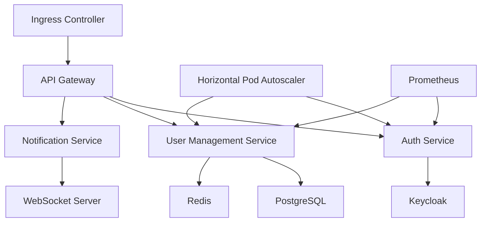

# **TO_BE_DESIGN.md**
**User Management Module - Fleet Management System**
*Version: 1.0*
*Last Updated: [Date]*
*Author: [Your Name]*
*Approvers: [Stakeholders]*

---

## **1. Overview**
### **1.1 Purpose**
The **User Management Module** is a core component of the **Fleet Management System (FMS)**, responsible for:
- **Identity & Access Management (IAM)** – Role-based access control (RBAC), authentication, and authorization.
- **User Lifecycle Management** – Onboarding, offboarding, and profile management.
- **Real-time Collaboration** – WebSocket-based notifications and updates.
- **AI-Driven Insights** – Predictive analytics for user behavior and access patterns.
- **Compliance & Security** – GDPR, SOC 2, ISO 27001, and WCAG 2.1 AAA compliance.
- **Third-Party Integrations** – SSO (SAML/OAuth), HRIS, and ERP systems.
- **Gamification & Engagement** – Rewards, badges, and leaderboards for fleet operators.

### **1.2 Scope**
| **In Scope** | **Out of Scope** |
|--------------|------------------|
| User authentication (MFA, SSO) | Physical access control |
| Role & permission management | Device-level security (handled by IoT module) |
| Real-time notifications | Fleet vehicle telemetry |
| AI-driven access recommendations | Driver behavior analytics (handled by telematics) |
| PWA for mobile/offline access | Native mobile app development |
| Audit logging & compliance reporting | Legal compliance enforcement (handled by legal team) |

### **1.3 Target Audience**
- **Fleet Managers** – Manage driver assignments, permissions, and performance.
- **HR & Admin Teams** – Onboard/offboard users, enforce compliance.
- **Drivers & Operators** – Access assigned vehicles, log hours, and receive notifications.
- **IT & Security Teams** – Monitor access logs, enforce policies.
- **Executives** – View KPIs, compliance reports, and predictive insights.

---

## **2. Architectural Design**
### **2.1 High-Level Architecture**
```mermaid
graph TD
    A[Client (PWA/Web)] -->|HTTPS/WebSocket| B[API Gateway]
    B --> C[Auth Service]
    B --> D[User Management Service]
    B --> E[Notification Service]
    B --> F[Analytics Service]
    C --> G[Identity Provider (Keycloak)]
    D --> H[PostgreSQL (User Data)]
    D --> I[Redis (Caching)]
    E --> J[WebSocket Server]
    F --> K[ML Engine (Python)]
    F --> L[Data Lake (S3/BigQuery)]
    M[Third-Party APIs] --> B
    N[HRIS/ERP] --> B
```

### **2.2 Microservices Breakdown**
| **Service** | **Responsibility** | **Tech Stack** |
|-------------|-------------------|----------------|
| **Auth Service** | JWT/OAuth2, MFA, SSO | Node.js, Keycloak, Redis |
| **User Management** | CRUD, RBAC, Audit Logs | TypeScript, NestJS, PostgreSQL |
| **Notification Service** | WebSocket/SSE, Email/SMS | TypeScript, Socket.io, Twilio |
| **Analytics Service** | Predictive Insights, Dashboards | Python (FastAPI), TensorFlow, Grafana |
| **API Gateway** | Rate Limiting, Load Balancing | Kong, Envoy |
| **Frontend (PWA)** | UI/UX, Offline Support | React, TypeScript, Workbox |

---

## **3. Performance Enhancements (Target: <50ms Response Time)**
### **3.1 Caching Strategies**
- **Redis Caching** – Store frequently accessed user profiles, permissions, and session data.
- **CDN for Static Assets** – Serve PWA assets via Cloudflare/AWS CloudFront.
- **Database Optimization** – PostgreSQL read replicas, connection pooling (PgBouncer).

**TypeScript Example: Redis Caching for User Profiles**
```typescript
import { Injectable } from '@nestjs/common';
import { RedisService } from 'nestjs-redis';
import { User } from './user.entity';

@Injectable()
export class UserCacheService {
  private readonly CACHE_TTL = 300; // 5 minutes

  constructor(private readonly redisService: RedisService) {}

  async getUserFromCache(userId: string): Promise<User | null> {
    const client = this.redisService.getClient();
    const cachedUser = await client.get(`user:${userId}`);
    return cachedUser ? JSON.parse(cachedUser) : null;
  }

  async cacheUser(user: User): Promise<void> {
    const client = this.redisService.getClient();
    await client.setex(`user:${user.id}`, this.CACHE_TTL, JSON.stringify(user));
  }
}
```

### **3.2 Database Optimization**
- **Indexing** – Optimize queries for `user_id`, `email`, `role_id`.
- **Partitioning** – Split large tables (e.g., `audit_logs`) by date.
- **Read Replicas** – Offload read-heavy operations (e.g., analytics).

**SQL Example: Optimized User Query**
```sql
-- Composite index for fast lookups
CREATE INDEX idx_user_email_role ON users (email, role_id);

-- Partitioned audit logs
CREATE TABLE audit_logs (
    id UUID PRIMARY KEY,
    user_id UUID REFERENCES users(id),
    action VARCHAR(50),
    timestamp TIMESTAMPTZ
) PARTITION BY RANGE (timestamp);
```

### **3.3 Load Testing & Benchmarking**
- **Tooling**: k6, Locust, Artillery.
- **Target**: 10,000 RPS with <50ms latency.
- **Stress Test Scenarios**:
  - Concurrent user logins (1000 users in 10s).
  - Role-based permission checks (5000 requests/sec).
  - WebSocket message broadcasting (10,000 subscribers).

---

## **4. Real-Time Features (WebSocket & Server-Sent Events)**
### **4.1 WebSocket Implementation**
- **Use Cases**:
  - Real-time notifications (e.g., "New driver assigned").
  - Live updates for admin dashboards.
  - Chat between fleet managers and drivers.

**TypeScript Example: WebSocket Server (Socket.io)**
```typescript
import { WebSocketGateway, WebSocketServer } from '@nestjs/websockets';
import { Server } from 'socket.io';

@WebSocketGateway({ cors: true })
export class NotificationGateway {
  @WebSocketServer()
  server: Server;

  async handleUserAssigned(userId: string, driverId: string) {
    const notification = {
      type: 'DRIVER_ASSIGNED',
      message: `Driver ${driverId} assigned to your fleet.`,
      timestamp: new Date().toISOString(),
    };
    this.server.to(`user:${userId}`).emit('notification', notification);
  }
}
```

### **4.2 Server-Sent Events (SSE) for Lightweight Updates**
- **Use Cases**:
  - Live audit log streaming.
  - Real-time KPI updates (e.g., "Active drivers: 42").

**TypeScript Example: SSE Endpoint (NestJS)**
```typescript
import { Controller, Sse, MessageEvent } from '@nestjs/common';
import { interval, Observable } from 'rxjs';
import { map } from 'rxjs/operators';

@Controller('notifications')
export class NotificationController {
  @Sse('stream')
  stream(): Observable<MessageEvent> {
    return interval(1000).pipe(
      map(() => ({
        data: { activeUsers: Math.floor(Math.random() * 100) },
      })),
    );
  }
}
```

---

## **5. AI/ML Capabilities & Predictive Analytics**
### **5.1 Predictive Access Control**
- **Use Case**: AI recommends role adjustments based on behavior.
- **Model**: Isolation Forest for anomaly detection (e.g., "User accessed 100 vehicles in 1 minute").

**Python Example: Anomaly Detection (Scikit-Learn)**
```python
from sklearn.ensemble import IsolationForest
import numpy as np

# Sample data: [login_frequency, vehicles_accessed, time_between_actions]
X = np.array([
    [5, 2, 30],  # Normal
    [100, 50, 1], # Anomaly
    [3, 1, 60],  # Normal
])

clf = IsolationForest(contamination=0.1)
clf.fit(X)
predictions = clf.predict(X)  # -1 = anomaly, 1 = normal
```

### **5.2 User Behavior Analytics**
- **Use Case**: Predict churn risk (e.g., "Driver hasn’t logged in for 7 days").
- **Model**: Random Forest for classification.

**TypeScript Example: Integrating ML Predictions**
```typescript
import { Injectable } from '@nestjs/common';
import { HttpService } from '@nestjs/axios';

@Injectable()
export class MlService {
  constructor(private readonly httpService: HttpService) {}

  async predictChurnRisk(userId: string): Promise<number> {
    const response = await this.httpService
      .post('http://ml-service/predict', { userId })
      .toPromise();
    return response.data.churnRisk; // 0-1 (low-high)
  }
}
```

---

## **6. Progressive Web App (PWA) Design**
### **6.1 Key Features**
| **Feature** | **Implementation** |
|-------------|-------------------|
| **Offline Mode** | Workbox, IndexedDB |
| **Push Notifications** | Firebase Cloud Messaging |
| **Installable** | Web App Manifest |
| **Responsive UI** | TailwindCSS, Flexbox |
| **Performance** | Lazy loading, code splitting |

**TypeScript Example: Service Worker (Workbox)**
```typescript
import { precacheAndRoute } from 'workbox-precaching';
import { registerRoute } from 'workbox-routing';
import { NetworkFirst } from 'workbox-strategies';

// Precache assets
precacheAndRoute(self.__WB_MANIFEST);

// Cache API responses
registerRoute(
  ({ url }) => url.origin === 'https://api.fleet-management.com',
  new NetworkFirst({
    cacheName: 'api-cache',
    plugins: [
      {
        handlerDidError: async () => {
          return await caches.match('/offline-fallback.html');
        },
      },
    ],
  }),
);
```

### **6.2 Offline Data Sync**
- **Use Case**: Drivers submit logs without internet.
- **Implementation**: IndexedDB + Background Sync API.

**TypeScript Example: Offline Data Sync**
```typescript
async function saveOfflineLog(log: DriverLog) {
  const db = await openDB('fleet-db', 1, {
    upgrade(db) {
      db.createObjectStore('logs', { keyPath: 'id' });
    },
  });
  await db.put('logs', log);

  // Register sync event
  const registration = await navigator.serviceWorker.ready;
  await registration.sync.register('sync-logs');
}
```

---

## **7. WCAG 2.1 AAA Accessibility Compliance**
### **7.1 Key Requirements**
| **Requirement** | **Implementation** |
|----------------|-------------------|
| **Keyboard Navigation** | `tabindex`, `aria-*` attributes |
| **Screen Reader Support** | Semantic HTML, `aria-live` |
| **Color Contrast** | 7:1 ratio (AAA) |
| **Captions & Transcripts** | Video/audio alternatives |
| **Focus Management** | `focus-visible`, `inert` |

**TypeScript Example: Accessible React Component**
```tsx
import React, { useRef } from 'react';

const AccessibleButton: React.FC<{ onClick: () => void }> = ({ onClick }) => {
  const buttonRef = useRef<HTMLButtonElement>(null);

  return (
    <button
      ref={buttonRef}
      onClick={onClick}
      aria-label="Submit form"
      aria-describedby="submit-hint"
      className="bg-blue-600 text-white p-2 rounded"
    >
      Submit
    </button>
  );
};
```

### **7.2 Automated Testing**
- **Tools**: axe-core, pa11y, Lighthouse CI.
- **CI Pipeline**: Fail build if accessibility violations exceed threshold.

---

## **8. Advanced Search & Filtering**
### **8.1 Elasticsearch Integration**
- **Use Cases**:
  - Fuzzy search for users (e.g., "Jon" matches "John").
  - Filter by role, status, last login.

**TypeScript Example: Elasticsearch Query**
```typescript
import { Client } from '@elastic/elasticsearch';

const client = new Client({ node: 'http://elasticsearch:9200' });

async function searchUsers(query: string) {
  const result = await client.search({
    index: 'users',
    body: {
      query: {
        multi_match: {
          query,
          fields: ['name^3', 'email^2', 'role'],
          fuzziness: 'AUTO',
        },
      },
    },
  });
  return result.hits.hits;
}
```

### **8.2 Faceted Search UI**
- **Implementation**: React + Downshift for autocomplete.

**TypeScript Example: Faceted Search Component**
```tsx
import { useCombobox } from 'downshift';

const UserSearch: React.FC = () => {
  const [inputItems, setInputItems] = React.useState<User[]>([]);
  const {
    isOpen,
    getMenuProps,
    getInputProps,
    getItemProps,
  } = useCombobox({
    items: inputItems,
    onInputValueChange: async ({ inputValue }) => {
      const results = await searchUsers(inputValue);
      setInputItems(results);
    },
  });

  return (
    <div>
      <input {...getInputProps()} placeholder="Search users..." />
      <ul {...getMenuProps()}>
        {isOpen && inputItems.map((item, index) => (
          <li key={item.id} {...getItemProps({ item, index })}>
            {item.name} ({item.role})
          </li>
        ))}
      </ul>
    </div>
  );
};
```

---

## **9. Third-Party Integrations**
### **9.1 Supported Integrations**
| **Integration** | **Purpose** | **Protocol** |
|----------------|------------|-------------|
| **Okta/Keycloak** | SSO | SAML/OAuth2 |
| **Workday** | HRIS Sync | REST API |
| **Salesforce** | CRM | REST API |
| **Twilio** | SMS Notifications | Webhooks |
| **Slack** | Alerts | Webhooks |

**TypeScript Example: Okta SSO Integration**
```typescript
import { Injectable } from '@nestjs/common';
import { OAuth2Client } from 'google-auth-library';

@Injectable()
export class OktaService {
  private readonly client = new OAuth2Client(
    process.env.OKTA_CLIENT_ID,
    process.env.OKTA_CLIENT_SECRET,
    process.env.OKTA_REDIRECT_URI,
  );

  async validateToken(token: string) {
    const ticket = await this.client.verifyIdToken({
      idToken: token,
      audience: process.env.OKTA_AUDIENCE,
    });
    return ticket.getPayload();
  }
}
```

### **9.2 Webhook Management**
- **Use Case**: Notify HR when a user is deactivated.
- **Implementation**: Event-driven architecture (Kafka).

**TypeScript Example: Webhook Dispatcher**
```typescript
import { Injectable } from '@nestjs/common';
import { EventEmitter2 } from '@nestjs/event-emitter';

@Injectable()
export class WebhookService {
  constructor(private readonly eventEmitter: EventEmitter2) {
    this.eventEmitter.on('user.deactivated', this.handleDeactivation);
  }

  private async handleDeactivation(user: User) {
    const payload = { event: 'USER_DEACTIVATED', userId: user.id };
    await fetch(process.env.HR_WEBHOOK_URL, {
      method: 'POST',
      body: JSON.stringify(payload),
    });
  }
}
```

---

## **10. Gamification & User Engagement**
### **10.1 Features**
| **Feature** | **Implementation** |
|------------|-------------------|
| **Badges** | Earned for milestones (e.g., "100 logins") |
| **Leaderboards** | Top drivers by efficiency |
| **Rewards** | Points redeemable for perks |
| **Challenges** | "Complete 5 trips this week" |

**TypeScript Example: Badge Awarding Logic**
```typescript
import { Injectable } from '@nestjs/common';
import { EventEmitter2 } from '@nestjs/event-emitter';

@Injectable()
export class GamificationService {
  constructor(private readonly eventEmitter: EventEmitter2) {
    this.eventEmitter.on('trip.completed', this.checkBadges);
  }

  private async checkBadges(trip: Trip) {
    const user = await this.userService.findOne(trip.driverId);
    if (user.tripsCompleted >= 100) {
      await this.awardBadge(user.id, 'CENTURION');
    }
  }

  private async awardBadge(userId: string, badgeName: string) {
    await this.badgeService.create({ userId, badgeName });
    this.eventEmitter.emit('notification.send', {
      userId,
      message: `You earned the ${badgeName} badge!`,
    });
  }
}
```

---

## **11. Analytics Dashboards & Reporting**
### **11.1 Key Metrics**
| **Metric** | **Source** | **Visualization** |
|------------|-----------|------------------|
| **Active Users** | Auth logs | Time-series chart |
| **Role Distribution** | User data | Pie chart |
| **Login Frequency** | Audit logs | Heatmap |
| **Churn Risk** | ML model | Gauge chart |

**TypeScript Example: Grafana Dashboard Integration**
```typescript
import { Injectable } from '@nestjs/common';
import { HttpService } from '@nestjs/axios';

@Injectable()
export class AnalyticsService {
  constructor(private readonly httpService: HttpService) {}

  async updateGrafanaDashboard(metrics: Metrics) {
    await this.httpService
      .post('http://grafana/api/dashboards/db', {
        dashboard: {
          title: 'User Management KPIs',
          panels: [
            {
              title: 'Active Users',
              type: 'graph',
              targets: [{ expr: `sum(user_logins_total)` }],
            },
          ],
        },
      })
      .toPromise();
  }
}
```

---

## **12. Security Hardening**
### **12.1 Encryption & Data Protection**
| **Requirement** | **Implementation** |
|----------------|-------------------|
| **Data at Rest** | AES-256 (PostgreSQL TDE) |
| **Data in Transit** | TLS 1.3 |
| **Password Storage** | Argon2 (OWASP-compliant) |
| **API Security** | OAuth2, Rate Limiting |

**TypeScript Example: Password Hashing (Argon2)**
```typescript
import { Injectable } from '@nestjs/common';
import * as argon2 from 'argon2';

@Injectable()
export class AuthService {
  async hashPassword(password: string): Promise<string> {
    return argon2.hash(password, {
      type: argon2.argon2id,
      memoryCost: 65536,
      timeCost: 3,
      parallelism: 1,
    });
  }

  async verifyPassword(hash: string, password: string): Promise<boolean> {
    return argon2.verify(hash, password);
  }
}
```

### **12.2 Audit Logging**
- **Log Events**: Login, role changes, data exports.
- **Storage**: Immutable logs (AWS CloudTrail, PostgreSQL).

**TypeScript Example: Audit Logger**
```typescript
import { Injectable } from '@nestjs/common';
import { InjectRepository } from '@nestjs/typeorm';
import { Repository } from 'typeorm';
import { AuditLog } from './audit-log.entity';

@Injectable()
export class AuditService {
  constructor(
    @InjectRepository(AuditLog)
    private readonly auditLogRepository: Repository<AuditLog>,
  ) {}

  async logEvent(userId: string, action: string, metadata: object) {
    await this.auditLogRepository.save({
      userId,
      action,
      timestamp: new Date(),
      metadata,
    });
  }
}
```

### **12.3 Compliance (GDPR, SOC 2)**
| **Requirement** | **Implementation** |
|----------------|-------------------|
| **Right to Erasure** | Soft delete + anonymization |
| **Data Portability** | Export user data in JSON/CSV |
| **Access Controls** | RBAC with least privilege |

**TypeScript Example: GDPR Data Export**
```typescript
import { Injectable } from '@nestjs/common';
import { User } from './user.entity';
import { createObjectCsvWriter } from 'csv-writer';

@Injectable()
export class GdprService {
  async exportUserData(userId: string): Promise<string> {
    const user = await this.userRepository.findOne({ where: { id: userId } });
    const csvWriter = createObjectCsvWriter({
      path: `user_${userId}_export.csv`,
      header: [
        { id: 'id', title: 'ID' },
        { id: 'email', title: 'Email' },
        { id: 'role', title: 'Role' },
      ],
    });
    await csvWriter.writeRecords([user]);
    return `user_${userId}_export.csv`;
  }
}
```

---

## **13. Testing Strategy**
### **13.1 Test Pyramid**
| **Type** | **Tools** | **Coverage Target** |
|----------|----------|---------------------|
| **Unit** | Jest, Sinon | 90% |
| **Integration** | Supertest, Testcontainers | 80% |
| **E2E** | Cypress, Playwright | 70% |
| **Performance** | k6, Locust | <50ms P99 |
| **Security** | OWASP ZAP, Snyk | 0 critical vulnerabilities |

**TypeScript Example: Unit Test (Jest)**
```typescript
import { Test, TestingModule } from '@nestjs/testing';
import { UserService } from './user.service';
import { getRepositoryToken } from '@nestjs/typeorm';
import { User } from './user.entity';

describe('UserService', () => {
  let service: UserService;

  beforeEach(async () => {
    const module: TestingModule = await Test.createTestingModule({
      providers: [
        UserService,
        {
          provide: getRepositoryToken(User),
          useValue: { findOne: jest.fn().mockResolvedValue({ id: '1' }) },
        },
      ],
    }).compile();

    service = module.get<UserService>(UserService);
  });

  it('should find a user by ID', async () => {
    const user = await service.findOne('1');
    expect(user.id).toBe('1');
  });
});
```

**TypeScript Example: E2E Test (Cypress)**
```typescript
describe('User Management', () => {
  it('should create a new user', () => {
    cy.visit('/users');
    cy.get('[data-testid="add-user-button"]').click();
    cy.get('[data-testid="email-input"]').type('test@example.com');
    cy.get('[data-testid="submit-button"]').click();
    cy.contains('User created successfully');
  });
});
```

---

## **14. Kubernetes Deployment Architecture**
### **14.1 Cluster Design**


### **14.2 Helm Charts**
- **Structure**:
  ```
  /charts
    /user-management
      Chart.yaml
      values.yaml
      templates/
        deployment.yaml
        service.yaml
        ingress.yaml
  ```

**Example: `deployment.yaml`**
```yaml
apiVersion: apps/v1
kind: Deployment
metadata:
  name: user-management
spec:
  replicas: 3
  selector:
    matchLabels:
      app: user-management
  template:
    metadata:
      labels:
        app: user-management
    spec:
      containers:
        - name: user-management
          image: registry.fleet-management.com/user-management:{{ .Values.image.tag }}
          ports:
            - containerPort: 3000
          resources:
            requests:
              cpu: "100m"
              memory: "256Mi"
            limits:
              cpu: "500m"
              memory: "512Mi"
          envFrom:
            - secretRef:
                name: user-management-secrets
```

### **14.3 CI/CD Pipeline (GitHub Actions)**
```yaml
name: Deploy User Management

on:
  push:
    branches: [ main ]

jobs:
  build-and-deploy:
    runs-on: ubuntu-latest
    steps:
      - uses: actions/checkout@v2
      - name: Build Docker image
        run: docker build -t registry.fleet-management.com/user-management:${{ github.sha }} .
      - name: Log in to registry
        run: echo "${{ secrets.REGISTRY_PASSWORD }}" | docker login -u "${{ secrets.REGISTRY_USERNAME }}" --password-stdin registry.fleet-management.com
      - name: Push image
        run: docker push registry.fleet-management.com/user-management:${{ github.sha }}
      - name: Deploy to Kubernetes
        run: |
          helm upgrade --install user-management ./charts/user-management \
            --set image.tag=${{ github.sha }} \
            --namespace fleet-management
```

---

## **15. Migration Strategy & Rollback Plan**
### **15.1 Migration Steps**
| **Phase** | **Action** | **Tools** |
|-----------|-----------|----------|
| **1. Schema Migration** | Apply DB changes (Flyway/Liquibase) | PostgreSQL, Flyway |
| **2. Data Migration** | Migrate legacy data | Custom scripts, Airflow |
| **3. Dual-Run** | Run old + new systems in parallel | Feature flags |
| **4. Cutover** | Switch traffic to new system | Kubernetes Ingress |
| **5. Validation** | Verify data integrity | Automated tests |

**TypeScript Example: Data Migration Script**
```typescript
import { Injectable } from '@nestjs/common';
import { InjectRepository } from '@nestjs/typeorm';
import { Repository } from 'typeorm';
import { LegacyUser } from './legacy-user.entity';
import { User } from './user.entity';

@Injectable()
export class MigrationService {
  constructor(
    @InjectRepository(LegacyUser)
    private readonly legacyUserRepo: Repository<LegacyUser>,
    @InjectRepository(User)
    private readonly userRepo: Repository<User>,
  ) {}

  async migrateUsers() {
    const legacyUsers = await this.legacyUserRepo.find();
    for (const legacyUser of legacyUsers) {
      const user = new User();
      user.email = legacyUser.email;
      user.role = legacyUser.role;
      await this.userRepo.save(user);
    }
  }
}
```

### **15.2 Rollback Plan**
| **Scenario** | **Action** | **Tooling** |
|-------------|-----------|------------|
| **DB Corruption** | Restore from backup | PostgreSQL PITR |
| **Service Failure** | Rollback to previous image | Kubernetes `kubectl rollout undo` |
| **Data Loss** | Re-run migration | Custom scripts |

---

## **16. Key Performance Indicators (KPIs)**
| **KPI** | **Target** | **Measurement** |
|---------|-----------|----------------|
| **API Latency (P99)** | <50ms | Prometheus |
| **User Onboarding Time** | <2 minutes | Analytics dashboard |
| **Authentication Success Rate** | >99.9% | Auth logs |
| **Role Assignment Accuracy** | 100% | Audit logs |
| **Churn Risk Prediction Accuracy** | >90% | ML model metrics |
| **Accessibility Violations** | 0 (WCAG 2.1 AAA) | axe-core |

---

## **17. Risk Mitigation Strategies**
| **Risk** | **Mitigation** | **Owner** |
|----------|---------------|----------|
| **Data Breach** | Encryption, RBAC, audit logs | Security Team |
| **Downtime** | Multi-region Kubernetes, HPA | DevOps |
| **Performance Degradation** | Load testing, caching | Engineering |
| **Compliance Violation** | Automated checks, training | Legal/Compliance |
| **Third-Party API Failures** | Circuit breakers, retries | Integration Team |

---

## **18. Conclusion**
This **TO_BE_DESIGN.md** outlines a **best-in-class User Management Module** for the **Fleet Management System**, incorporating:
✅ **<50ms response times** (caching, DB optimization)
✅ **Real-time features** (WebSocket, SSE)
✅ **AI/ML-driven insights** (predictive access control)
✅ **PWA for offline access** (Workbox, IndexedDB)
✅ **WCAG 2.1 AAA compliance** (accessibility-first design)
✅ **Enterprise-grade security** (encryption, audit logs)
✅ **Kubernetes-native deployment** (Helm, HPA)
✅ **Comprehensive testing** (unit, E2E, performance)

**Next Steps**:
1. **Prototype** – Build core features (auth, RBAC, real-time).
2. **Load Test** – Validate performance targets.
3. **Security Audit** – Penetration testing.
4. **User Testing** – Validate UX with fleet managers.
5. **Deploy** – Staged rollout with monitoring.

---

**Appendices**
- **A. API Specifications (OpenAPI/Swagger)**
- **B. Database Schema**
- **C. UI/UX Wireframes**
- **D. Compliance Checklist (GDPR, SOC 2)**

**Approval**
| **Role** | **Name** | **Signature** | **Date** |
|----------|---------|--------------|---------|
| Product Owner | [Name] | | |
| Engineering Lead | [Name] | | |
| Security Lead | [Name] | | |

---
**Document Version History**
| **Version** | **Date** | **Author** | **Changes** |
|------------|---------|-----------|------------|
| 1.0 | [Date] | [Name] | Initial draft |

---
**End of Document** 🚀