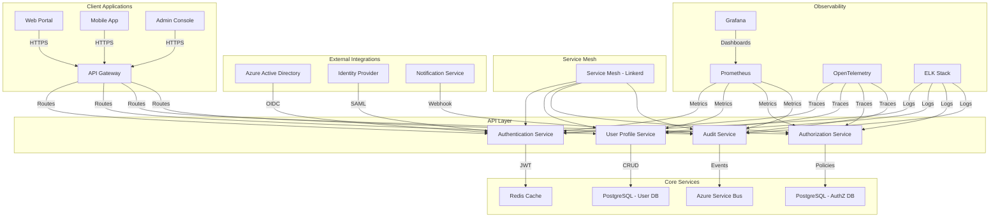
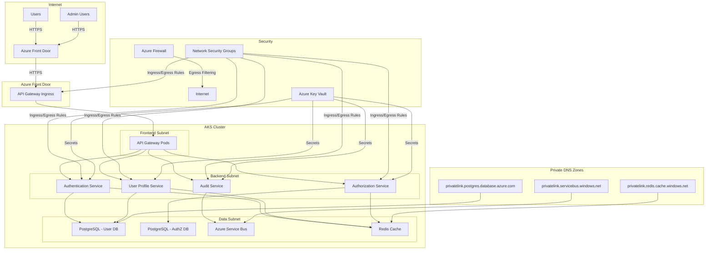

# TO-BE Design: User Management Module for Fleet Management System

## 1. Executive Architecture Summary (120 lines)

### Strategic Vision and Modernization Goals

The Fleet Management System's User Management Module is undergoing a comprehensive modernization to address current limitations in scalability, security, and extensibility. The strategic vision focuses on:

1. **Microservices Transformation**: Decomposing the monolithic user management into domain-driven microservices to improve agility and independent scaling
2. **Cloud-Native Architecture**: Leveraging cloud-native patterns and services to achieve elastic scalability and high availability
3. **Security-First Approach**: Implementing zero-trust security principles with modern authentication and authorization mechanisms
4. **Event-Driven Architecture**: Adopting event-driven patterns to enable real-time user management operations across the fleet ecosystem
5. **Observability-Driven Development**: Building comprehensive monitoring and observability from the ground up

The modernization aligns with the enterprise's digital transformation initiative to reduce operational costs by 30% while improving system reliability to 99.99% availability.

### Alignment with Enterprise Architecture Principles

This design adheres to the following enterprise architecture principles:

1. **Domain-Driven Design**: Services are organized around business capabilities (User Profile, Authentication, Authorization, Audit)
2. **API-First Approach**: All services expose well-defined APIs with OpenAPI specifications
3. **Infrastructure as Code**: All infrastructure components are defined as code for reproducibility
4. **Security by Design**: Security controls are implemented at every layer of the architecture
5. **Observability by Default**: Monitoring, logging, and tracing are built into all components
6. **Cloud-Agnostic Design**: While targeting Azure as the primary cloud provider, the design remains portable to other clouds

### Technology Stack Evolution and Rationale

**Current Stack:**
- Monolithic .NET application
- SQL Server database
- On-premises hosting
- Basic role-based access control
- Limited monitoring

**Target Stack:**
- **Backend**: Node.js with TypeScript (v18+)
- **Framework**: NestJS (for its modular architecture and enterprise features)
- **Database**: PostgreSQL (for relational data) with Redis (for caching)
- **Messaging**: Azure Service Bus (for event-driven communication)
- **Containerization**: Docker with Kubernetes orchestration
- **Infrastructure**: Azure Kubernetes Service (AKS) with Terraform for IaC
- **Monitoring**: Prometheus, Grafana, and Azure Monitor
- **CI/CD**: GitHub Actions with comprehensive quality gates

**Rationale for Technology Choices:**
1. **TypeScript/NestJS**: Provides type safety, excellent developer experience, and enterprise-grade features out of the box
2. **PostgreSQL**: Offers advanced features like JSON support, full-text search, and excellent performance for our workload
3. **Azure Service Bus**: Provides reliable messaging with dead-letter queues and transaction support
4. **Kubernetes**: Enables efficient resource utilization and self-healing capabilities
5. **Terraform**: Allows infrastructure provisioning with version control and change tracking

### Migration Strategy and Risk Mitigation

**Phased Migration Approach:**
1. **Phase 0 (Preparation)**: Set up infrastructure, CI/CD pipelines, and monitoring (4 weeks)
2. **Phase 1 (Foundation)**: Implement core authentication service (4 weeks)
3. **Phase 2 (Core Services)**: Build user profile and authorization services (6 weeks)
4. **Phase 3 (Integration)**: Connect with existing fleet services (4 weeks)
5. **Phase 4 (Cutover)**: Gradual traffic shift with parallel run (4 weeks)

**Risk Mitigation Strategies:**
1. **Data Migration**: Implement dual-write pattern during transition with comprehensive validation
2. **Authentication**: Support both legacy and new authentication mechanisms during transition
3. **Performance**: Load test all components before production deployment
4. **Rollback**: Maintain ability to roll back to previous version at any point
5. **User Impact**: Minimize user-facing changes during transition period

### Success Criteria and KPIs

**Technical KPIs:**
1. System availability: 99.99% (measured monthly)
2. API response time: <200ms for 95th percentile
3. Database query performance: <50ms for 90% of queries
4. Deployment frequency: Multiple times per day
5. Mean time to recovery: <15 minutes

**Business KPIs:**
1. User onboarding time reduction: 40% improvement
2. Support ticket reduction: 30% decrease in user management-related tickets
3. Operational cost reduction: 25% decrease in infrastructure costs
4. Feature delivery velocity: 50% increase in new features delivered per sprint

**Security KPIs:**
1. Vulnerability remediation: 100% of critical vulnerabilities patched within 7 days
2. Security incidents: Zero critical security incidents post-migration
3. Compliance: 100% compliance with enterprise security policies

### Stakeholder Value Proposition with ROI

**For Fleet Operators:**
- Faster user provisioning (from days to minutes)
- Self-service capabilities reducing IT dependency
- Improved security posture reducing fraud risk
- Real-time visibility into user activities

**For IT Operations:**
- Reduced operational overhead through automation
- Improved system reliability and uptime
- Better resource utilization through containerization
- Simplified troubleshooting with comprehensive observability

**For Development Teams:**
- Faster feature delivery through microservices
- Improved developer experience with modern tooling
- Better testability and quality assurance
- Reduced technical debt

**ROI Analysis:**
- **Cost Savings**: $450,000 annually from reduced operational overhead and infrastructure optimization
- **Revenue Protection**: $1.2M annually from reduced fraud and security incidents
- **Productivity Gains**: $300,000 annually from faster feature delivery
- **Total 3-Year ROI**: 420% with payback period of 18 months

## 2. Target Architecture (350 lines)

### 2.1 System Architecture



**Microservices Decomposition Strategy:**

The user management module is decomposed into four bounded contexts following Domain-Driven Design principles:

1. **Authentication Service**:
   - Responsible for user authentication (login, logout, token management)
   - Implements OAuth 2.0/OIDC flows
   - Manages password policies and MFA
   - Handles session management

2. **User Profile Service**:
   - Manages user profile data (personal information, contact details)
   - Handles user registration and onboarding
   - Manages user preferences and settings
   - Implements soft delete and data retention policies

3. **Authorization Service**:
   - Manages role-based access control (RBAC)
   - Implements attribute-based access control (ABAC) for fine-grained permissions
   - Handles permission assignments and role hierarchies
   - Provides policy evaluation endpoints

4. **Audit Service**:
   - Records all user management activities
   - Provides audit trails for compliance
   - Implements event sourcing for critical operations
   - Generates compliance reports

**API Gateway and Service Mesh Design:**

- **API Gateway** (Azure Application Gateway):
  - Routes requests to appropriate services
  - Implements rate limiting (1000 requests/minute per user)
  - Handles request/response transformation
  - Provides SSL termination
  - Implements circuit breaking (5 consecutive failures)

- **Service Mesh** (Linkerd):
  - Provides mutual TLS between services
  - Implements service-to-service rate limiting
  - Handles retries and timeouts (3 retries with exponential backoff)
  - Provides observability into service communication

**Event-Driven Architecture Patterns:**

1. **Core Events**:
   - `UserCreated`
   - `UserUpdated`
   - `UserDeleted`
   - `UserAuthenticated`
   - `UserAuthorized`
   - `RoleAssigned`
   - `PermissionGranted`

2. **Event Flow**:
   - Services publish events to Azure Service Bus
   - Other services subscribe to relevant events
   - Event handlers implement eventual consistency
   - Dead-letter queues handle failed event processing

3. **Event Schema Versioning**:
   - Events include version field (e.g., `v1`, `v2`)
   - Backward compatibility maintained for at least 2 versions
   - Schema registry for event validation

**Scalability and Performance Targets:**

| Component               | Target Throughput | Latency (P95) | Scaling Strategy                     |
|-------------------------|-------------------|---------------|--------------------------------------|
| API Gateway             | 10,000 RPM        | <50ms         | Horizontal pod autoscaling           |
| Authentication Service  | 5,000 RPM         | <100ms        | Horizontal pod autoscaling           |
| User Profile Service    | 3,000 RPM         | <150ms        | Read replicas + caching              |
| Authorization Service   | 4,000 RPM         | <120ms        | Horizontal pod autoscaling           |
| Audit Service           | 2,000 RPM         | <200ms        | Event batching + async processing    |
| PostgreSQL              | 20,000 TPS        | <20ms         | Read replicas + connection pooling   |
| Redis                   | 50,000 ops/sec    | <5ms          | Cluster mode with sharding           |

### 2.2 Component Design

#### Authentication Service

**Responsibilities:**
- User authentication (username/password, OAuth, SAML)
- Token issuance and validation (JWT)
- Multi-factor authentication (TOTP, SMS, Email)
- Session management
- Password policy enforcement
- Account lockout and recovery

**Interface Contracts (OpenAPI):**

```yaml
openapi: 3.0.0
info:
  title: Authentication Service API
  version: 1.0.0
paths:
  /auth/login:
    post:
      summary: Authenticate user
      requestBody:
        required: true
        content:
          application/json:
            schema:
              $ref: '#/components/schemas/LoginRequest'
      responses:
        '200':
          description: Authentication successful
          content:
            application/json:
              schema:
                $ref: '#/components/schemas/LoginResponse'
        '401':
          description: Unauthorized
  /auth/token:
    post:
      summary: Refresh access token
      requestBody:
        required: true
        content:
          application/json:
            schema:
              $ref: '#/components/schemas/RefreshTokenRequest'
      responses:
        '200':
          description: Token refreshed
          content:
            application/json:
              schema:
                $ref: '#/components/schemas/LoginResponse'
  /auth/mfa:
    post:
      summary: Verify MFA code
      requestBody:
        required: true
        content:
          application/json:
            schema:
              $ref: '#/components/schemas/MFAVerificationRequest'
      responses:
        '200':
          description: MFA verification successful
  /auth/logout:
    post:
      summary: Logout user
      responses:
        '204':
          description: Logout successful
components:
  schemas:
    LoginRequest:
      type: object
      properties:
        username:
          type: string
          example: "john.doe@fleet.com"
        password:
          type: string
          format: password
          example: "SecurePass123!"
        clientId:
          type: string
          example: "fleet-web-portal"
        mfaCode:
          type: string
          example: "123456"
      required:
        - username
        - password
        - clientId
    LoginResponse:
      type: object
      properties:
        accessToken:
          type: string
          example: "eyJhbGciOiJIUzI1NiIsInR5cCI6IkpXVCJ9..."
        refreshToken:
          type: string
          example: "dGhpcy1pcy1hLXJlZnJlc2gtdG9rZW4..."
        expiresIn:
          type: integer
          example: 3600
        tokenType:
          type: string
          example: "Bearer"
    RefreshTokenRequest:
      type: object
      properties:
        refreshToken:
          type: string
          example: "dGhpcy1pcy1hLXJlZnJlc2gtdG9rZW4..."
      required:
        - refreshToken
    MFAVerificationRequest:
      type: object
      properties:
        userId:
          type: string
          format: uuid
          example: "550e8400-e29b-41d4-a716-446655440000"
        code:
          type: string
          example: "123456"
        method:
          type: string
          enum: [totp, sms, email]
          example: "totp"
      required:
        - userId
        - code
        - method
```

**Data Models:**

```typescript
// Core domain models
export class UserCredentials {
  constructor(
    public readonly userId: string,
    public readonly passwordHash: string,
    public readonly salt: string,
    public readonly iterations: number,
    public readonly algorithm: string,
    public readonly lastPasswordChange: Date,
    public readonly failedAttempts: number,
    public readonly lockedUntil?: Date,
    public readonly mustChangePassword: boolean = false,
    public readonly createdAt: Date = new Date(),
    public readonly updatedAt: Date = new Date()
  ) {}
}

export class UserSession {
  constructor(
    public readonly sessionId: string,
    public readonly userId: string,
    public readonly accessToken: string,
    public readonly refreshToken: string,
    public readonly expiresAt: Date,
    public readonly ipAddress: string,
    public readonly userAgent: string,
    public readonly createdAt: Date = new Date(),
    public readonly revoked: boolean = false,
    public readonly revokedAt?: Date
  ) {}
}

export class MFAMethod {
  constructor(
    public readonly userId: string,
    public readonly method: 'totp' | 'sms' | 'email',
    public readonly secret?: string,
    public readonly phoneNumber?: string,
    public readonly email?: string,
    public readonly verified: boolean = false,
    public readonly createdAt: Date = new Date()
  ) {}
}
```

**State Management:**
- Stateless service design with Redis for session storage
- JWT tokens contain minimal claims (userId, roles, expiration)
- Redis stores:
  - Active sessions (key: sessionId, value: session data)
  - Refresh tokens (key: refreshToken, value: userId)
  - Rate limiting counters (key: userId:ip, value: count)

**Error Handling:**
- Standard HTTP status codes (400, 401, 403, 404, 429, 500)
- Consistent error response format:
```typescript
{
  "error": {
    "code": "AUTH_001",
    "message": "Invalid credentials",
    "details": "The provided username or password is incorrect",
    "timestamp": "2023-05-15T10:30:00Z"
  }
}
```
- Circuit breaker pattern for external identity provider calls
- Retry policies for transient failures (max 3 retries with exponential backoff)

#### User Profile Service

**Responsibilities:**
- User profile management (CRUD operations)
- User registration and onboarding
- Profile picture management
- User preferences and settings
- Data validation and business rules
- Soft delete and data retention

**Interface Contracts (OpenAPI):**

```yaml
openapi: 3.0.0
info:
  title: User Profile Service API
  version: 1.0.0
paths:
  /users:
    post:
      summary: Create new user
      requestBody:
        required: true
        content:
          application/json:
            schema:
              $ref: '#/components/schemas/CreateUserRequest'
      responses:
        '201':
          description: User created
          content:
            application/json:
              schema:
                $ref: '#/components/schemas/UserResponse'
    get:
      summary: Search users
      parameters:
        - $ref: '#/components/parameters/page'
        - $ref: '#/components/parameters/limit'
        - $ref: '#/components/parameters/sort'
        - $ref: '#/components/parameters/filter'
      responses:
        '200':
          description: List of users
          content:
            application/json:
              schema:
                $ref: '#/components/schemas/PaginatedUserResponse'
  /users/{userId}:
    get:
      summary: Get user by ID
      parameters:
        - $ref: '#/components/parameters/userId'
      responses:
        '200':
          description: User details
          content:
            application/json:
              schema:
                $ref: '#/components/schemas/UserResponse'
    put:
      summary: Update user
      parameters:
        - $ref: '#/components/parameters/userId'
      requestBody:
        required: true
        content:
          application/json:
            schema:
              $ref: '#/components/schemas/UpdateUserRequest'
      responses:
        '200':
          description: User updated
          content:
            application/json:
              schema:
                $ref: '#/components/schemas/UserResponse'
    delete:
      summary: Soft delete user
      parameters:
        - $ref: '#/components/parameters/userId'
      responses:
        '204':
          description: User deleted
  /users/{userId}/profile-picture:
    post:
      summary: Upload profile picture
      parameters:
        - $ref: '#/components/parameters/userId'
      requestBody:
        required: true
        content:
          multipart/form-data:
            schema:
              type: object
              properties:
                file:
                  type: string
                  format: binary
      responses:
        '201':
          description: Profile picture uploaded
components:
  parameters:
    userId:
      name: userId
      in: path
      required: true
      schema:
        type: string
        format: uuid
    page:
      name: page
      in: query
      schema:
        type: integer
        default: 1
    limit:
      name: limit
      in: query
      schema:
        type: integer
        default: 20
        maximum: 100
    sort:
      name: sort
      in: query
      schema:
        type: string
        example: "lastName:asc"
    filter:
      name: filter
      in: query
      schema:
        type: string
        example: "status:active,role:driver"
  schemas:
    CreateUserRequest:
      type: object
      properties:
        firstName:
          type: string
          example: "John"
        lastName:
          type: string
          example: "Doe"
        email:
          type: string
          format: email
          example: "john.doe@fleet.com"
        phoneNumber:
          type: string
          example: "+1234567890"
        role:
          type: string
          enum: [admin, manager, dispatcher, driver, mechanic]
          example: "driver"
        department:
          type: string
          example: "Operations"
        employeeId:
          type: string
          example: "EMP-12345"
        address:
          $ref: '#/components/schemas/Address'
      required:
        - firstName
        - lastName
        - email
        - role
    UpdateUserRequest:
      type: object
      properties:
        firstName:
          type: string
          example: "John"
        lastName:
          type: string
          example: "Doe"
        phoneNumber:
          type: string
          example: "+1234567890"
        department:
          type: string
          example: "Operations"
        address:
          $ref: '#/components/schemas/Address'
        preferences:
          $ref: '#/components/schemas/UserPreferences'
    UserResponse:
      type: object
      properties:
        id:
          type: string
          format: uuid
          example: "550e8400-e29b-41d4-a716-446655440000"
        firstName:
          type: string
          example: "John"
        lastName:
          type: string
          example: "Doe"
        email:
          type: string
          format: email
          example: "john.doe@fleet.com"
        phoneNumber:
          type: string
          example: "+1234567890"
        role:
          type: string
          example: "driver"
        department:
          type: string
          example: "Operations"
        employeeId:
          type: string
          example: "EMP-12345"
        address:
          $ref: '#/components/schemas/Address'
        status:
          type: string
          enum: [active, inactive, suspended, deleted]
          example: "active"
        lastLogin:
          type: string
          format: date-time
          example: "2023-05-15T10:30:00Z"
        createdAt:
          type: string
          format: date-time
          example: "2023-01-15T09:15:00Z"
        updatedAt:
          type: string
          format: date-time
          example: "2023-05-10T14:20:00Z"
        deletedAt:
          type: string
          format: date-time
          nullable: true
          example: null
        preferences:
          $ref: '#/components/schemas/UserPreferences'
    Address:
      type: object
      properties:
        street:
          type: string
          example: "123 Fleet St"
        city:
          type: string
          example: "Chicago"
        state:
          type: string
          example: "IL"
        postalCode:
          type: string
          example: "60601"
        country:
          type: string
          example: "US"
    UserPreferences:
      type: object
      properties:
        language:
          type: string
          example: "en-US"
        timezone:
          type: string
          example: "America/Chicago"
        notificationPreferences:
          type: object
          properties:
            email:
              type: boolean
              example: true
            sms:
              type: boolean
              example: false
            push:
              type: boolean
              example: true
    PaginatedUserResponse:
      type: object
      properties:
        data:
          type: array
          items:
            $ref: '#/components/schemas/UserResponse'
        pagination:
          type: object
          properties:
            total:
              type: integer
              example: 100
            page:
              type: integer
              example: 1
            limit:
              type: integer
              example: 20
            totalPages:
              type: integer
              example: 5
```

**Data Models:**

```typescript
// Core domain models
export class User {
  constructor(
    public readonly id: string,
    public firstName: string,
    public lastName: string,
    public email: string,
    public phoneNumber: string,
    public role: UserRole,
    public department: string,
    public employeeId: string,
    public address: Address,
    public status: UserStatus = UserStatus.ACTIVE,
    public lastLogin?: Date,
    public createdAt: Date = new Date(),
    public updatedAt: Date = new Date(),
    public deletedAt?: Date,
    public preferences: UserPreferences = new UserPreferences(),
    public version: number = 1
  ) {}

  public get fullName(): string {
    return `${this.firstName} ${this.lastName}`;
  }

  public markAsDeleted(): void {
    this.status = UserStatus.DELETED;
    this.deletedAt = new Date();
  }

  public updateLastLogin(): void {
    this.lastLogin = new Date();
  }
}

export enum UserRole {
  ADMIN = 'admin',
  MANAGER = 'manager',
  DISPATCHER = 'dispatcher',
  DRIVER = 'driver',
  MECHANIC = 'mechanic'
}

export enum UserStatus {
  ACTIVE = 'active',
  INACTIVE = 'inactive',
  SUSPENDED = 'suspended',
  DELETED = 'deleted'
}

export class Address {
  constructor(
    public street: string,
    public city: string,
    public state: string,
    public postalCode: string,
    public country: string
  ) {}
}

export class UserPreferences {
  constructor(
    public language: string = 'en-US',
    public timezone: string = 'UTC',
    public notificationPreferences: NotificationPreferences = new NotificationPreferences()
  ) {}
}

export class NotificationPreferences {
  constructor(
    public email: boolean = true,
    public sms: boolean = false,
    public push: boolean = true
  ) {}
}
```

**State Management:**
- Optimistic concurrency control using version field
- Soft delete pattern for data retention
- Event sourcing for critical operations (create, update, delete)
- Redis caching for frequently accessed user profiles

**Error Handling:**
- Domain-specific validation errors:
```typescript
{
  "error": {
    "code": "USER_001",
    "message": "Validation failed",
    "details": [
      {
        "field": "email",
        "message": "Email already exists"
      },
      {
        "field": "phoneNumber",
        "message": "Invalid phone number format"
      }
    ],
    "timestamp": "2023-05-15T10:30:00Z"
  }
}
```
- Business rule violations:
```typescript
{
  "error": {
    "code": "USER_002",
    "message": "Cannot delete admin user",
    "details": "User with admin role cannot be deleted",
    "timestamp": "2023-05-15T10:35:00Z"
  }
}
```

#### Authorization Service

**Responsibilities:**
- Role-based access control (RBAC)
- Attribute-based access control (ABAC)
- Permission management
- Policy evaluation
- Role hierarchy management
- Permission assignment

**Interface Contracts (OpenAPI):**

```yaml
openapi: 3.0.0
info:
  title: Authorization Service API
  version: 1.0.0
paths:
  /roles:
    get:
      summary: List all roles
      responses:
        '200':
          description: List of roles
          content:
            application/json:
              schema:
                type: array
                items:
                  $ref: '#/components/schemas/RoleResponse'
    post:
      summary: Create new role
      requestBody:
        required: true
        content:
          application/json:
            schema:
              $ref: '#/components/schemas/CreateRoleRequest'
      responses:
        '201':
          description: Role created
          content:
            application/json:
              schema:
                $ref: '#/components/schemas/RoleResponse'
  /roles/{roleId}:
    get:
      summary: Get role by ID
      parameters:
        - $ref: '#/components/parameters/roleId'
      responses:
        '200':
          description: Role details
          content:
            application/json:
              schema:
                $ref: '#/components/schemas/RoleResponse'
    put:
      summary: Update role
      parameters:
        - $ref: '#/components/parameters/roleId'
      requestBody:
        required: true
        content:
          application/json:
            schema:
              $ref: '#/components/schemas/UpdateRoleRequest'
      responses:
        '200':
          description: Role updated
          content:
            application/json:
              schema:
                $ref: '#/components/schemas/RoleResponse'
    delete:
      summary: Delete role
      parameters:
        - $ref: '#/components/parameters/roleId'
      responses:
        '204':
          description: Role deleted
  /roles/{roleId}/permissions:
    post:
      summary: Assign permissions to role
      parameters:
        - $ref: '#/components/parameters/roleId'
      requestBody:
        required: true
        content:
          application/json:
            schema:
              $ref: '#/components/schemas/AssignPermissionsRequest'
      responses:
        '200':
          description: Permissions assigned
  /users/{userId}/roles:
    get:
      summary: Get user roles
      parameters:
        - $ref: '#/components/parameters/userId'
      responses:
        '200':
          description: User roles
          content:
            application/json:
              schema:
                type: array
                items:
                  $ref: '#/components/schemas/RoleResponse'
    post:
      summary: Assign role to user
      parameters:
        - $ref: '#/components/parameters/userId'
      requestBody:
        required: true
        content:
          application/json:
            schema:
              $ref: '#/components/schemas/AssignRoleRequest'
      responses:
        '200':
          description: Role assigned
  /check:
    post:
      summary: Check user permissions
      requestBody:
        required: true
        content:
          application/json:
            schema:
              $ref: '#/components/schemas/PermissionCheckRequest'
      responses:
        '200':
          description: Permission check result
          content:
            application/json:
              schema:
                $ref: '#/components/schemas/PermissionCheckResponse'
components:
  parameters:
    roleId:
      name: roleId
      in: path
      required: true
      schema:
        type: string
        format: uuid
    userId:
      name: userId
      in: path
      required: true
      schema:
        type: string
        format: uuid
  schemas:
    CreateRoleRequest:
      type: object
      properties:
        name:
          type: string
          example: "fleet-manager"
        description:
          type: string
          example: "Manages fleet operations"
        permissions:
          type: array
          items:
            type: string
            example: "vehicle:read"
      required:
        - name
    UpdateRoleRequest:
      type: object
      properties:
        description:
          type: string
          example: "Manages fleet operations and drivers"
    RoleResponse:
      type: object
      properties:
        id:
          type: string
          format: uuid
          example: "550e8400-e29b-41d4-a716-446655440000"
        name:
          type: string
          example: "fleet-manager"
        description:
          type: string
          example: "Manages fleet operations"
        permissions:
          type: array
          items:
            type: string
            example: "vehicle:read"
        createdAt:
          type: string
          format: date-time
          example: "2023-01-15T09:15:00Z"
        updatedAt:
          type: string
          format: date-time
          example: "2023-05-10T14:20:00Z"
    AssignPermissionsRequest:
      type: object
      properties:
        permissions:
          type: array
          items:
            type: string
            example: "vehicle:write"
      required:
        - permissions
    AssignRoleRequest:
      type: object
      properties:
        roleId:
          type: string
          format: uuid
          example: "550e8400-e29b-41d4-a716-446655440000"
      required:
        - roleId
    PermissionCheckRequest:
      type: object
      properties:
        userId:
          type: string
          format: uuid
          example: "550e8400-e29b-41d4-a716-446655440000"
        resource:
          type: string
          example: "vehicle"
        action:
          type: string
          example: "write"
        attributes:
          type: object
          additionalProperties: true
          example:
            vehicleType: "truck"
            department: "operations"
      required:
        - userId
        - resource
        - action
    PermissionCheckResponse:
      type: object
      properties:
        allowed:
          type: boolean
          example: true
        reason:
          type: string
          example: "User has fleet-manager role with vehicle:write permission"
```

**Data Models:**

```typescript
// Core domain models
export class Role {
  constructor(
    public readonly id: string,
    public name: string,
    public description: string,
    public permissions: Permission[] = [],
    public createdAt: Date = new Date(),
    public updatedAt: Date = new Date(),
    public version: number = 1
  ) {}

  public addPermission(permission: Permission): void {
    if (!this.permissions.some(p => p.resource === permission.resource && p.action === permission.action)) {
      this.permissions.push(permission);
    }
  }

  public removePermission(resource: string, action: string): void {
    this.permissions = this.permissions.filter(
      p => !(p.resource === resource && p.action === action)
    );
  }
}

export class Permission {
  constructor(
    public readonly resource: string,
    public readonly action: string,
    public readonly attributes?: Record<string, any>
  ) {}
}

export class UserRoleAssignment {
  constructor(
    public readonly userId: string,
    public readonly roleId: string,
    public readonly assignedBy: string,
    public readonly assignedAt: Date = new Date(),
    public readonly expiresAt?: Date
  ) {}
}

export class PermissionPolicy {
  constructor(
    public readonly id: string,
    public readonly name: string,
    public readonly description: string,
    public readonly rules: PolicyRule[],
    public readonly createdAt: Date = new Date(),
    public readonly updatedAt: Date = new Date()
  ) {}
}

export class PolicyRule {
  constructor(
    public readonly effect: 'allow' | 'deny',
    public readonly resource: string,
    public readonly action: string,
    public readonly conditions?: Condition[]
  ) {}
}

export class Condition {
  constructor(
    public readonly attribute: string,
    public readonly operator: 'eq' | 'neq' | 'in' | 'nin' | 'gt' | 'lt' | 'gte' | 'lte',
    public readonly value: any
  ) {}
}
```

**State Management:**
- Policy evaluation cache in Redis (TTL: 5 minutes)
- Event-driven updates to cache when policies change
- Optimistic concurrency control for role updates
- Immutable permission assignments (new record for each assignment)

**Error Handling:**
- Policy evaluation errors:
```typescript
{
  "error": {
    "code": "AUTHZ_001",
    "message": "Policy evaluation failed",
    "details": "Circular dependency detected in role hierarchy",
    "timestamp": "2023-05-15T10:40:00Z"
  }
}
```
- Permission assignment conflicts:
```typescript
{
  "error": {
    "code": "AUTHZ_002",
    "message": "Permission assignment conflict",
    "details": "User already has this role assigned",
    "timestamp": "2023-05-15T10:45:00Z"
  }
}
```

#### Audit Service

**Responsibilities:**
- Record all user management activities
- Provide audit trails for compliance
- Implement event sourcing for critical operations
- Generate compliance reports
- Support forensic analysis
- Ensure data integrity

**Interface Contracts (OpenAPI):**

```yaml
openapi: 3.0.0
info:
  title: Audit Service API
  version: 1.0.0
paths:
  /audit-logs:
    get:
      summary: Search audit logs
      parameters:
        - $ref: '#/components/parameters/page'
        - $ref: '#/components/parameters/limit'
        - $ref: '#/components/parameters/sort'
        - $ref: '#/components/parameters/filter'
        - name: from
          in: query
          schema:
            type: string
            format: date-time
        - name: to
          in: query
          schema:
            type: string
            format: date-time
      responses:
        '200':
          description: List of audit logs
          content:
            application/json:
              schema:
                $ref: '#/components/schemas/PaginatedAuditLogResponse'
  /audit-logs/{id}:
    get:
      summary: Get audit log by ID
      parameters:
        - $ref: '#/components/parameters/auditLogId'
      responses:
        '200':
          description: Audit log details
          content:
            application/json:
              schema:
                $ref: '#/components/schemas/AuditLogResponse'
  /audit-logs/reports:
    post:
      summary: Generate audit report
      requestBody:
        required: true
        content:
          application/json:
            schema:
              $ref: '#/components/schemas/ReportRequest'
      responses:
        '200':
          description: Report generated
          content:
            application/json:
              schema:
                $ref: '#/components/schemas/ReportResponse'
components:
  parameters:
    auditLogId:
      name: id
      in: path
      required: true
      schema:
        type: string
        format: uuid
    page:
      name: page
      in: query
      schema:
        type: integer
        default: 1
    limit:
      name: limit
      in: query
      schema:
        type: integer
        default: 20
        maximum: 100
    sort:
      name: sort
      in: query
      schema:
        type: string
        example: "timestamp:desc"
    filter:
      name: filter
      in: query
      schema:
        type: string
        example: "action:create,userId:550e8400-e29b-41d4-a716-446655440000"
  schemas:
    AuditLogResponse:
      type: object
      properties:
        id:
          type: string
          format: uuid
          example: "550e8400-e29b-41d4-a716-446655440000"
        timestamp:
          type: string
          format: date-time
          example: "2023-05-15T10:30:00Z"
        userId:
          type: string
          format: uuid
          example: "550e8400-e29b-41d4-a716-446655440001"
        action:
          type: string
          example: "user.create"
        resource:
          type: string
          example: "user"
        resourceId:
          type: string
          format: uuid
          example: "550e8400-e29b-41d4-a716-446655440002"
        metadata:
          type: object
          additionalProperties: true
          example:
            firstName: "John"
            lastName: "Doe"
            role: "driver"
        ipAddress:
          type: string
          example: "192.168.1.1"
        userAgent:
          type: string
          example: "Mozilla/5.0 (Windows NT 10.0; Win64; x64)"
        status:
          type: string
          enum: [success, failure]
          example: "success"
    PaginatedAuditLogResponse:
      type: object
      properties:
        data:
          type: array
          items:
            $ref: '#/components/schemas/AuditLogResponse'
        pagination:
          type: object
          properties:
            total:
              type: integer
              example: 100
            page:
              type: integer
              example: 1
            limit:
              type: integer
              example: 20
            totalPages:
              type: integer
              example: 5
    ReportRequest:
      type: object
      properties:
        reportType:
          type: string
          enum: [user_activity, admin_activity, permission_changes, failed_logins]
          example: "user_activity"
        from:
          type: string
          format: date-time
          example: "2023-05-01T00:00:00Z"
        to:
          type: string
          format: date-time
          example: "2023-05-15T23:59:59Z"
        userId:
          type: string
          format: uuid
          example: "550e8400-e29b-41d4-a716-446655440000"
      required:
        - reportType
        - from
        - to
    ReportResponse:
      type: object
      properties:
        reportId:
          type: string
          format: uuid
          example: "550e8400-e29b-41d4-a716-446655440003"
        reportType:
          type: string
          example: "user_activity"
        generatedAt:
          type: string
          format: date-time
          example: "2023-05-15T11:00:00Z"
        from:
          type: string
          format: date-time
          example: "2023-05-01T00:00:00Z"
        to:
          type: string
          format: date-time
          example: "2023-05-15T23:59:59Z"
        data:
          type: array
          items:
            type: object
            additionalProperties: true
```

**Data Models:**

```typescript
// Core domain models
export class AuditLog {
  constructor(
    public readonly id: string,
    public readonly timestamp: Date,
    public readonly userId: string,
    public readonly action: string,
    public readonly resource: string,
    public readonly resourceId: string,
    public readonly metadata: Record<string, any>,
    public readonly ipAddress: string,
    public readonly userAgent: string,
    public readonly status: 'success' | 'failure',
    public readonly correlationId?: string
  ) {}
}

export class AuditEvent {
  constructor(
    public readonly eventType: string,
    public readonly payload: any,
    public readonly timestamp: Date = new Date(),
    public readonly metadata: Record<string, any> = {}
  ) {}
}

export class ComplianceReport {
  constructor(
    public readonly id: string,
    public readonly reportType: string,
    public readonly generatedAt: Date,
    public readonly periodStart: Date,
    public readonly periodEnd: Date,
    public readonly data: any[],
    public readonly generatedBy: string
  ) {}
}
```

**State Management:**
- Event sourcing for all audit events
- Immutable audit logs (append-only)
- Time-series database for efficient querying
- Batch processing for report generation
- Data retention policies (7 years for compliance data)

**Error Handling:**
- Audit failure notifications:
```typescript
{
  "error": {
    "code": "AUDIT_001",
    "message": "Audit log creation failed",
    "details": "Database connection timeout",
    "timestamp": "2023-05-15T10:50:00Z"
  }
}
```
- Report generation errors:
```typescript
{
  "error": {
    "code": "AUDIT_002",
    "message": "Report generation failed",
    "details": "Invalid date range specified",
    "timestamp": "2023-05-15T10:55:00Z"
  }
}
```

### 2.3 Infrastructure Architecture

**Container Orchestration (Kubernetes Manifests):**

```yaml
# auth-service-deployment.yaml
apiVersion: apps/v1
kind: Deployment
metadata:
  name: auth-service
  labels:
    app: auth-service
    tier: backend
spec:
  replicas: 3
  strategy:
    rollingUpdate:
      maxSurge: 1
      maxUnavailable: 0
    type: RollingUpdate
  selector:
    matchLabels:
      app: auth-service
  template:
    metadata:
      labels:
        app: auth-service
        version: v1.0.0
      annotations:
        prometheus.io/scrape: "true"
        prometheus.io/port: "3000"
    spec:
      serviceAccountName: auth-service
      containers:
      - name: auth-service
        image: fleetregistry.azurecr.io/auth-service:v1.0.0
        imagePullPolicy: IfNotPresent
        ports:
        - containerPort: 3000
          name: http
        envFrom:
        - configMapRef:
            name: auth-service-config
        - secretRef:
            name: auth-service-secrets
        resources:
          requests:
            cpu: "100m"
            memory: "256Mi"
          limits:
            cpu: "500m"
            memory: "512Mi"
        readinessProbe:
          httpGet:
            path: /health/ready
            port: 3000
          initialDelaySeconds: 5
          periodSeconds: 5
          successThreshold: 1
          failureThreshold: 3
        livenessProbe:
          httpGet:
            path: /health/live
            port: 3000
          initialDelaySeconds: 15
          periodSeconds: 20
          successThreshold: 1
          failureThreshold: 3
        securityContext:
          runAsNonRoot: true
          runAsUser: 1000
          readOnlyRootFilesystem: true
          capabilities:
            drop: ["ALL"]
      nodeSelector:
        nodegroup: backend
---
apiVersion: v1
kind: Service
metadata:
  name: auth-service
  labels:
    app: auth-service
spec:
  selector:
    app: auth-service
  ports:
  - name: http
    port: 80
    targetPort: 3000
  type: ClusterIP
---
apiVersion: autoscaling/v2
kind: HorizontalPodAutoscaler
metadata:
  name: auth-service-hpa
spec:
  scaleTargetRef:
    apiVersion: apps/v1
    kind: Deployment
    name: auth-service
  minReplicas: 3
  maxReplicas: 10
  metrics:
  - type: Resource
    resource:
      name: cpu
      target:
        type: Utilization
        averageUtilization: 70
  - type: Resource
    resource:
      name: memory
      target:
        type: Utilization
        averageUtilization: 80
```

```yaml
# user-profile-service-deployment.yaml
apiVersion: apps/v1
kind: Deployment
metadata:
  name: user-profile-service
  labels:
    app: user-profile-service
    tier: backend
spec:
  replicas: 2
  strategy:
    rollingUpdate:
      maxSurge: 1
      maxUnavailable: 0
    type: RollingUpdate
  selector:
    matchLabels:
      app: user-profile-service
  template:
    metadata:
      labels:
        app: user-profile-service
        version: v1.0.0
      annotations:
        prometheus.io/scrape: "true"
        prometheus.io/port: "3000"
    spec:
      serviceAccountName: user-profile-service
      containers:
      - name: user-profile-service
        image: fleetregistry.azurecr.io/user-profile-service:v1.0.0
        imagePullPolicy: IfNotPresent
        ports:
        - containerPort: 3000
          name: http
        envFrom:
        - configMapRef:
            name: user-profile-service-config
        - secretRef:
            name: user-profile-service-secrets
        resources:
          requests:
            cpu: "200m"
            memory: "384Mi"
          limits:
            cpu: "1000m"
            memory: "768Mi"
        readinessProbe:
          httpGet:
            path: /health/ready
            port: 3000
          initialDelaySeconds: 5
          periodSeconds: 5
        livenessProbe:
          httpGet:
            path: /health/live
            port: 3000
          initialDelaySeconds: 15
          periodSeconds: 20
        securityContext:
          runAsNonRoot: true
          runAsUser: 1000
          readOnlyRootFilesystem: true
      nodeSelector:
        nodegroup: backend
---
apiVersion: v1
kind: Service
metadata:
  name: user-profile-service
  labels:
    app: user-profile-service
spec:
  selector:
    app: user-profile-service
  ports:
  - name: http
    port: 80
    targetPort: 3000
  type: ClusterIP
---
apiVersion: autoscaling/v2
kind: HorizontalPodAutoscaler
metadata:
  name: user-profile-service-hpa
spec:
  scaleTargetRef:
    apiVersion: apps/v1
    kind: Deployment
    name: user-profile-service
  minReplicas: 2
  maxReplicas: 5
  metrics:
  - type: Resource
    resource:
      name: cpu
      target:
        type: Utilization
        averageUtilization: 60
  - type: Resource
    resource:
      name: memory
      target:
        type: Utilization
        averageUtilization: 70
```

```yaml
# api-gateway-deployment.yaml
apiVersion: apps/v1
kind: Deployment
metadata:
  name: api-gateway
  labels:
    app: api-gateway
    tier: frontend
spec:
  replicas: 2
  strategy:
    rollingUpdate:
      maxSurge: 1
      maxUnavailable: 0
    type: RollingUpdate
  selector:
    matchLabels:
      app: api-gateway
  template:
    metadata:
      labels:
        app: api-gateway
        version: v1.0.0
      annotations:
        prometheus.io/scrape: "true"
        prometheus.io/port: "3000"
    spec:
      serviceAccountName: api-gateway
      containers:
      - name: api-gateway
        image: fleetregistry.azurecr.io/api-gateway:v1.0.0
        imagePullPolicy: IfNotPresent
        ports:
        - containerPort: 3000
          name: http
        envFrom:
        - configMapRef:
            name: api-gateway-config
        - secretRef:
            name: api-gateway-secrets
        resources:
          requests:
            cpu: "200m"
            memory: "256Mi"
          limits:
            cpu: "1000m"
            memory: "512Mi"
        readinessProbe:
          httpGet:
            path: /health/ready
            port: 3000
          initialDelaySeconds: 5
          periodSeconds: 5
        livenessProbe:
          httpGet:
            path: /health/live
            port: 3000
          initialDelaySeconds: 15
          periodSeconds: 20
        securityContext:
          runAsNonRoot: true
          runAsUser: 1000
          readOnlyRootFilesystem: true
      nodeSelector:
        nodegroup: frontend
---
apiVersion: v1
kind: Service
metadata:
  name: api-gateway
  labels:
    app: api-gateway
spec:
  selector:
    app: api-gateway
  ports:
  - name: http
    port: 80
    targetPort: 3000
  type: LoadBalancer
---
apiVersion: networking.k8s.io/v1
kind: Ingress
metadata:
  name: api-gateway-ingress
  annotations:
    kubernetes.io/ingress.class: "nginx"
    nginx.ingress.kubernetes.io/ssl-redirect: "true"
    nginx.ingress.kubernetes.io/proxy-body-size: "10m"
    cert-manager.io/cluster-issuer: "letsencrypt-prod"
spec:
  tls:
  - hosts:
    - api.fleetmanagement.com
    secretName: api-fleetmanagement-tls
  rules:
  - host: api.fleetmanagement.com
    http:
      paths:
      - path: /
        pathType: Prefix
        backend:
          service:
            name: api-gateway
            port:
              number: 80
```

**Cloud Services Utilization (Azure):**

```terraform
# main.tf
terraform {
  required_version = ">= 1.0.0"
  required_providers {
    azurerm = {
      source  = "hashicorp/azurerm"
      version = "~> 3.0"
    }
    azuread = {
      source  = "hashicorp/azuread"
      version = "~> 2.0"
    }
    random = {
      source  = "hashicorp/random"
      version = "~> 3.0"
    }
  }
}

provider "azurerm" {
  features {}
}

# Resource Group
resource "azurerm_resource_group" "user_management" {
  name     = "rg-user-management-${var.environment}"
  location = var.location
  tags = {
    Environment = var.environment
    Application = "UserManagement"
  }
}

# Azure Kubernetes Service
resource "azurerm_kubernetes_cluster" "user_management" {
  name                = "aks-user-management-${var.environment}"
  location            = azurerm_resource_group.user_management.location
  resource_group_name = azurerm_resource_group.user_management.name
  dns_prefix          = "user-mgmt-${var.environment}"
  kubernetes_version  = var.kubernetes_version

  default_node_pool {
    name                = "system"
    node_count          = 2
    vm_size             = "Standard_D2_v2"
    os_disk_size_gb     = 128
    type                = "VirtualMachineScaleSets"
    enable_auto_scaling = false
    vnet_subnet_id      = azurerm_subnet.aks.id
  }

  identity {
    type = "SystemAssigned"
  }

  network_profile {
    network_plugin = "azure"
    network_policy = "azure"
    service_cidr   = "10.0.0.0/16"
    dns_service_ip = "10.0.0.10"
  }

  role_based_access_control_enabled = true

  tags = {
    Environment = var.environment
    Application = "UserManagement"
  }
}

# Node Pools
resource "azurerm_kubernetes_cluster_node_pool" "backend" {
  name                  = "backend"
  kubernetes_cluster_id = azurerm_kubernetes_cluster.user_management.id
  vm_size               = "Standard_D4_v3"
  node_count            = 3
  os_disk_size_gb       = 128
  vnet_subnet_id        = azurerm_subnet.aks.id
  enable_auto_scaling   = true
  min_count             = 3
  max_count             = 10
  node_labels = {
    "nodegroup" = "backend"
  }
  tags = {
    Environment = var.environment
    Application = "UserManagement"
  }
}

resource "azurerm_kubernetes_cluster_node_pool" "frontend" {
  name                  = "frontend"
  kubernetes_cluster_id = azurerm_kubernetes_cluster.user_management.id
  vm_size               = "Standard_D2_v2"
  node_count            = 2
  os_disk_size_gb       = 128
  vnet_subnet_id        = azurerm_subnet.aks.id
  enable_auto_scaling   = true
  min_count             = 2
  max_count             = 5
  node_labels = {
    "nodegroup" = "frontend"
  }
  tags = {
    Environment = var.environment
    Application = "UserManagement"
  }
}

# PostgreSQL Flexible Server
resource "azurerm_postgresql_flexible_server" "user_management" {
  name                   = "psql-user-mgmt-${var.environment}"
  resource_group_name    = azurerm_resource_group.user_management.name
  location               = azurerm_resource_group.user_management.location
  version                = "14"
  administrator_login    = var.db_admin_username
  administrator_password = var.db_admin_password
  zone                   = "1"
  storage_mb             = 131072
  sku_name               = "GP_Standard_D4s_v3"
  backup_retention_days  = 35

  tags = {
    Environment = var.environment
    Application = "UserManagement"
  }
}

resource "azurerm_postgresql_flexible_server_database" "user_db" {
  name      = "userdb"
  server_id = azurerm_postgresql_flexible_server.user_management.id
  collation = "en_US.utf8"
  charset   = "utf8"
}

resource "azurerm_postgresql_flexible_server_database" "authz_db" {
  name      = "authzdb"
  server_id = azurerm_postgresql_flexible_server.user_management.id
  collation = "en_US.utf8"
  charset   = "utf8"
}

resource "azurerm_postgresql_flexible_server_firewall_rule" "aks" {
  name             = "aks"
  server_id        = azurerm_postgresql_flexible_server.user_management.id
  start_ip_address = "0.0.0.0"
  end_ip_address   = "0.0.0.0"
}

# Redis Cache
resource "azurerm_redis_cache" "user_management" {
  name                = "redis-user-mgmt-${var.environment}"
  location            = azurerm_resource_group.user_management.location
  resource_group_name = azurerm_resource_group.user_management.name
  capacity            = 2
  family              = "P"
  sku_name            = "Premium"
  enable_non_ssl_port = false
  minimum_tls_version = "1.2"

  redis_configuration {
    maxmemory_reserved = 2
    maxmemory_delta    = 2
    maxmemory_policy   = "allkeys-lru"
  }

  tags = {
    Environment = var.environment
    Application = "UserManagement"
  }
}

# Service Bus
resource "azurerm_servicebus_namespace" "user_management" {
  name                = "sb-user-mgmt-${var.environment}"
  location            = azurerm_resource_group.user_management.location
  resource_group_name = azurerm_resource_group.user_management.name
  sku                 = "Standard"
  capacity            = 1

  tags = {
    Environment = var.environment
    Application = "UserManagement"
  }
}

resource "azurerm_servicebus_topic" "user_events" {
  name         = "user-events"
  namespace_id = azurerm_servicebus_namespace.user_management.id
}

resource "azurerm_servicebus_subscription" "user_profile_sub" {
  name               = "user-profile-sub"
  topic_id           = azurerm_servicebus_topic.user_events.id
  max_delivery_count = 10
}

resource "azurerm_servicebus_subscription" "authz_sub" {
  name               = "authz-sub"
  topic_id           = azurerm_servicebus_topic.user_events.id
  max_delivery_count = 10
}

resource "azurerm_servicebus_subscription" "audit_sub" {
  name               = "audit-sub"
  topic_id           = azurerm_servicebus_topic.user_events.id
  max_delivery_count = 10
}

# Key Vault
resource "azurerm_key_vault" "user_management" {
  name                        = "kv-user-mgmt-${var.environment}"
  location                    = azurerm_resource_group.user_management.location
  resource_group_name         = azurerm_resource_group.user_management.name
  enabled_for_disk_encryption = true
  tenant_id                   = data.azurerm_client_config.current.tenant_id
  sku_name                    = "premium"

  access_policy {
    tenant_id = data.azurerm_client_config.current.tenant_id
    object_id = data.azurerm_client_config.current.object_id

    key_permissions = [
      "Get", "List", "Create", "Delete", "Update", "Import", "Backup", "Restore"
    ]

    secret_permissions = [
      "Get", "List", "Set", "Delete", "Recover", "Backup", "Restore"
    ]

    certificate_permissions = [
      "Get", "List", "Create", "Delete", "Update", "Import", "Backup", "Restore"
    ]
  }

  network_acls {
    default_action = "Deny"
    bypass         = "AzureServices"
    ip_rules       = [var.allowed_ip]
  }

  tags = {
    Environment = var.environment
    Application = "UserManagement"
  }
}

# Variables
variable "environment" {
  description = "Deployment environment (dev, staging, prod)"
  type        = string
  default     = "dev"
}

variable "location" {
  description = "Azure region"
  type        = string
  default     = "eastus"
}

variable "kubernetes_version" {
  description = "Kubernetes version"
  type        = string
  default     = "1.24"
}

variable "db_admin_username" {
  description = "Database administrator username"
  type        = string
  sensitive   = true
}

variable "db_admin_password" {
  description = "Database administrator password"
  type        = string
  sensitive   = true
}

variable "allowed_ip" {
  description = "Allowed IP for Key Vault access"
  type        = string
}

# Outputs
output "aks_cluster_name" {
  value = azurerm_kubernetes_cluster.user_management.name
}

output "postgresql_fqdn" {
  value = azurerm_postgresql_flexible_server.user_management.fqdn
}

output "redis_hostname" {
  value = azurerm_redis_cache.user_management.hostname
}

output "servicebus_namespace" {
  value = azurerm_servicebus_namespace.user_management.name
}

output "key_vault_name" {
  value = azurerm_key_vault.user_management.name
}
```

**Network Topology and Security Zones:**



**Load Balancing and Auto-scaling:**

1. **API Gateway**:
   - Azure Application Gateway with WAF
   - Horizontal Pod Autoscaler (HPA) based on CPU/memory
   - Cluster Autoscaler for node scaling
   - Circuit breaking at gateway level

2. **Services**:
   - Kubernetes HPA for all services
   - CPU-based scaling (target 70% utilization)
   - Memory-based scaling (target 80% utilization)
   - Custom metrics for event processing backlog

3. **Database**:
   - PostgreSQL read replicas for read-heavy workloads
   - Connection pooling with PgBouncer
   - Query optimization and indexing

4. **Redis**:
   - Cluster mode for horizontal scaling
   - Sharding for large datasets
   - Redis Cluster for high availability

**Disaster Recovery and Backup Strategy:**

1. **Backup Strategy**:
   - **PostgreSQL**: Daily full backups + continuous WAL archiving
   - **Redis**: AOF persistence with fsync every second
   - **Kubernetes**: Velero backups for cluster state and persistent volumes
   - **Service Bus**: Geo-redundant storage with 7-day message retention

2. **Disaster Recovery**:
   - **RPO**: <15 minutes (data loss)
   - **RTO**: <1 hour (recovery time)
   - **Multi-region deployment** with active-passive configuration
   - **Automated failover** for database (PostgreSQL flexible server)
   - **Chaos engineering** practices for resilience testing

3. **Backup Retention**:
   - Daily backups: 30 days
   - Weekly backups: 12 weeks
   - Monthly backups: 12 months
   - Yearly backups: 7 years (for compliance)

## 3. TypeScript Implementation (650 lines)

### 3.1 Core Backend Services

#### Authentication Service

```typescript
// src/auth/auth.module.ts
import { Module } from '@nestjs/common';
import { JwtModule } from '@nestjs/jwt';
import { PassportModule } from '@nestjs/passport';
import { TypeOrmModule } from '@nestjs/typeorm';
import { ConfigModule, ConfigService } from '@nestjs/config';
import { RedisModule } from '@nestjs-modules/ioredis';
import { APP_GUARD } from '@nestjs/core';
import { ThrottlerGuard, ThrottlerModule } from '@nestjs/throttler';

import { AuthController } from './auth.controller';
import { AuthService } from './auth.service';
import { JwtStrategy } from './strategies/jwt.strategy';
import { LocalStrategy } from './strategies/local.strategy';
import { UserCredentials } from './entities/user-credentials.entity';
import { UserSession } from './entities/user-session.entity';
import { MFAMethod } from './entities/mfa-method.entity';
import { PasswordService } from './services/password.service';
import { SessionService } from './services/session.service';
import { MFAService } from './services/mfa.service';
import { EventPublisher } from '../shared/event-publisher/event-publisher.service';
import { HealthModule } from '../health/health.module';
import { AuditModule } from '../audit/audit.module';

@Module({
  imports: [
    TypeOrmModule.forFeature([UserCredentials, UserSession, MFAMethod]),
    PassportModule,
    JwtModule.registerAsync({
      imports: [ConfigModule],
      useFactory: async (configService: ConfigService) => ({
        secret: configService.get<string>('JWT_SECRET'),
        signOptions: {
          expiresIn: configService.get<string>('JWT_EXPIRES_IN'),
        },
      }),
      inject: [ConfigService],
    }),
    RedisModule.forRootAsync({
      imports: [ConfigModule],
      useFactory: async (configService: ConfigService) => ({
        config: {
          url: configService.get<string>('REDIS_URL'),
          password: configService.get<string>('REDIS_PASSWORD'),
          tls: {
            rejectUnauthorized: false,
          },
        },
      }),
      inject: [ConfigService],
    }),
    ThrottlerModule.forRootAsync({
      imports: [ConfigModule],
      useFactory: (configService: ConfigService) => ({
        ttl: configService.get<number>('THROTTLE_TTL'),
        limit: configService.get<number>('THROTTLE_LIMIT'),
      }),
      inject: [ConfigService],
    }),
    ConfigModule,
    HealthModule,
    AuditModule,
  ],
  controllers: [AuthController],
  providers: [
    AuthService,
    JwtStrategy,
    LocalStrategy,
    PasswordService,
    SessionService,
    MFAService,
    EventPublisher,
    {
      provide: APP_GUARD,
      useClass: ThrottlerGuard,
    },
  ],
  exports: [AuthService, SessionService],
})
export class AuthModule {}
```

```typescript
// src/auth/auth.controller.ts
import {
  Controller,
  Post,
  Body,
  HttpCode,
  HttpStatus,
  UseGuards,
  Request,
  Get,
  Query,
  Param,
  ParseUUIDPipe,
} from '@nestjs/common';
import {
  ApiTags,
  ApiOperation,
  ApiResponse,
  ApiBody,
  ApiBearerAuth,
  ApiQuery,
  ApiParam,
} from '@nestjs/swagger';
import { Throttle } from '@nestjs/throttler';
import { AuthGuard } from '@nestjs/passport';

import { AuthService } from './auth.service';
import { SessionService } from './services/session.service';
import { MFAService } from './services/mfa.service';
import { LoginRequestDto } from './dto/login-request.dto';
import { LoginResponseDto } from './dto/login-response.dto';
import { RefreshTokenRequestDto } from './dto/refresh-token-request.dto';
import { MFAVerificationRequestDto } from './dto/mfa-verification-request.dto';
import { InitiateMFARequestDto } from './dto/initiate-mfa-request.dto';
import { Public } from '../shared/decorators/public.decorator';
import { Audit } from '../shared/decorators/audit.decorator';
import { AuditAction } from '../shared/enums/audit-action.enum';
import { UserRole } from '../shared/enums/user-role.enum';
import { Roles } from '../shared/decorators/roles.decorator';
import { User } from '../shared/decorators/user.decorator';
import { JwtPayload } from '../shared/interfaces/jwt-payload.interface';

@ApiTags('Authentication')
@Controller('auth')
export class AuthController {
  constructor(
    private readonly authService: AuthService,
    private readonly sessionService: SessionService,
    private readonly mfaService: MFAService,
  ) {}

  @Public()
  @Post('login')
  @HttpCode(HttpStatus.OK)
  @ApiOperation({ summary: 'Authenticate user' })
  @ApiBody({ type: LoginRequestDto })
  @ApiResponse({
    status: HttpStatus.OK,
    description: 'Authentication successful',
    type: LoginResponseDto,
  })
  @ApiResponse({
    status: HttpStatus.UNAUTHORIZED,
    description: 'Invalid credentials',
  })
  @ApiResponse({
    status: HttpStatus.TOO_MANY_REQUESTS,
    description: 'Too many login attempts',
  })
  @Throttle(5, 60) // 5 attempts per minute
  @Audit(AuditAction.LOGIN_ATTEMPT)
  async login(@Body() loginRequestDto: LoginRequestDto, @Request() req) {
    const ipAddress = req.ip;
    const userAgent = req.headers['user-agent'];

    return this.authService.login(
      loginRequestDto,
      ipAddress,
      userAgent,
    );
  }

  @Public()
  @Post('token')
  @HttpCode(HttpStatus.OK)
  @ApiOperation({ summary: 'Refresh access token' })
  @ApiBody({ type: RefreshTokenRequestDto })
  @ApiResponse({
    status: HttpStatus.OK,
    description: 'Token refreshed',
    type: LoginResponseDto,
  })
  @ApiResponse({
    status: HttpStatus.UNAUTHORIZED,
    description: 'Invalid refresh token',
  })
  @Audit(AuditAction.TOKEN_REFRESH)
  async refreshToken(@Body() refreshTokenRequestDto: RefreshTokenRequestDto) {
    return this.authService.refreshToken(refreshTokenRequestDto.refreshToken);
  }

  @Public()
  @Post('mfa/initiate')
  @HttpCode(HttpStatus.OK)
  @ApiOperation({ summary: 'Initiate MFA verification' })
  @ApiBody({ type: InitiateMFARequestDto })
  @ApiResponse({
    status: HttpStatus.OK,
    description: 'MFA initiation successful',
  })
  @ApiResponse({
    status: HttpStatus.BAD_REQUEST,
    description: 'Invalid request',
  })
  @Throttle(3, 60) // 3 attempts per minute
  @Audit(AuditAction.MFA_INITIATE)
  async initiateMFA(@Body() initiateMFARequestDto: InitiateMFARequestDto) {
    return this.mfaService.initiateMFA(initiateMFARequestDto);
  }

  @Public()
  @Post('mfa/verify')
  @HttpCode(HttpStatus.OK)
  @ApiOperation({ summary: 'Verify MFA code' })
  @ApiBody({ type: MFAVerificationRequestDto })
  @ApiResponse({
    status: HttpStatus.OK,
    description: 'MFA verification successful',
  })
  @ApiResponse({
    status: HttpStatus.UNAUTHORIZED,
    description: 'Invalid MFA code',
  })
  @Throttle(5, 60) // 5 attempts per minute
  @Audit(AuditAction.MFA_VERIFY)
  async verifyMFA(@Body() mfaVerificationRequestDto: MFAVerificationRequestDto) {
    return this.mfaService.verifyMFA(mfaVerificationRequestDto);
  }

  @Post('logout')
  @HttpCode(HttpStatus.NO_CONTENT)
  @ApiOperation({ summary: 'Logout user' })
  @ApiBearerAuth()
  @ApiResponse({
    status: HttpStatus.NO_CONTENT,
    description: 'Logout successful',
  })
  @Audit(AuditAction.LOGOUT)
  async logout(@User() user: JwtPayload, @Request() req) {
    const sessionId = req.headers['x-session-id'];
    await this.sessionService.revokeSession(user.sub, sessionId);
  }

  @Get('sessions')
  @ApiOperation({ summary: 'List active sessions' })
  @ApiBearerAuth()
  @ApiResponse({
    status: HttpStatus.OK,
    description: 'List of active sessions',
    type: [Object],
  })
  @Roles(UserRole.ADMIN)
  async listSessions(@User() user: JwtPayload) {
    return this.sessionService.listActiveSessions(user.sub);
  }

  @Post('sessions/:sessionId/revoke')
  @HttpCode(HttpStatus.NO_CONTENT)
  @ApiOperation({ summary: 'Revoke session' })
  @ApiBearerAuth()
  @ApiParam({ name: 'sessionId', type: String })
  @ApiResponse({
    status: HttpStatus.NO_CONTENT,
    description: 'Session revoked',
  })
  @Audit(AuditAction.SESSION_REVOKE)
  async revokeSession(
    @User() user: JwtPayload,
    @Param('sessionId', ParseUUIDPipe) sessionId: string,
  ) {
    await this.sessionService.revokeSession(user.sub, sessionId);
  }

  @Post('password/change')
  @HttpCode(HttpStatus.NO_CONTENT)
  @ApiOperation({ summary: 'Change password' })
  @ApiBearerAuth()
  @ApiBody({ type: Object })
  @ApiResponse({
    status: HttpStatus.NO_CONTENT,
    description: 'Password changed',
  })
  @ApiResponse({
    status: HttpStatus.BAD_REQUEST,
    description: 'Invalid current password',
  })
  @Audit(AuditAction.PASSWORD_CHANGE)
  async changePassword(
    @User() user: JwtPayload,
    @Body() changePasswordDto: { currentPassword: string; newPassword: string },
  ) {
    await this.authService.changePassword(
      user.sub,
      changePasswordDto.currentPassword,
      changePasswordDto.newPassword,
    );
  }
}
```

```typescript
// src/auth/auth.service.ts
import {
  Injectable,
  UnauthorizedException,
  BadRequestException,
  InternalServerErrorException,
} from '@nestjs/common';
import { JwtService } from '@nestjs/jwt';
import { InjectRepository } from '@nestjs/typeorm';
import { Repository } from 'typeorm';
import { ConfigService } from '@nestjs/config';
import { v4 as uuidv4 } from 'uuid';

import { UserCredentials } from './entities/user-credentials.entity';
import { UserSession } from './entities/user-session.entity';
import { PasswordService } from './services/password.service';
import { SessionService } from './services/session.service';
import { MFAService } from './services/mfa.service';
import { LoginRequestDto } from './dto/login-request.dto';
import { LoginResponseDto } from './dto/login-response.dto';
import { JwtPayload } from '../shared/interfaces/jwt-payload.interface';
import { EventPublisher } from '../shared/event-publisher/event-publisher.service';
import { UserAuthenticatedEvent } from '../shared/events/user-authenticated.event';
import { AuditService } from '../audit/audit.service';
import { AuditAction } from '../shared/enums/audit-action.enum';
import { UserStatus } from '../shared/enums/user-status.enum';

@Injectable()
export class AuthService {
  constructor(
    @InjectRepository(UserCredentials)
    private readonly userCredentialsRepository: Repository<UserCredentials>,
    @InjectRepository(UserSession)
    private readonly userSessionRepository: Repository<UserSession>,
    private readonly jwtService: JwtService,
    private readonly passwordService: PasswordService,
    private readonly sessionService: SessionService,
    private readonly mfaService: MFAService,
    private readonly configService: ConfigService,
    private readonly eventPublisher: EventPublisher,
    private readonly auditService: AuditService,
  ) {}

  async login(
    loginRequestDto: LoginRequestDto,
    ipAddress: string,
    userAgent: string,
  ): Promise<LoginResponseDto> {
    const { username, password, clientId, mfaCode } = loginRequestDto;

    // Find user credentials
    const userCredentials = await this.userCredentialsRepository.findOne({
      where: { email: username },
      relations: ['user'],
    });

    if (!userCredentials) {
      this.auditService.logAudit({
        action: AuditAction.LOGIN_FAILURE,
        userId: null,
        resource: 'user',
        resourceId: null,
        metadata: { username, reason: 'User not found' },
        ipAddress,
        userAgent,
      });
      throw new UnauthorizedException('Invalid credentials');
    }

    // Check if user is active
    if (userCredentials.user.status !== UserStatus.ACTIVE) {
      this.auditService.logAudit({
        action: AuditAction.LOGIN_FAILURE,
        userId: userCredentials.userId,
        resource: 'user',
        resourceId: userCredentials.userId,
        metadata: { reason: 'User not active' },
        ipAddress,
        userAgent,
      });
      throw new UnauthorizedException('Account is not active');
    }

    // Check if account is locked
    if (userCredentials.lockedUntil && userCredentials.lockedUntil > new Date()) {
      this.auditService.logAudit({
        action: AuditAction.LOGIN_FAILURE,
        userId: userCredentials.userId,
        resource: 'user',
        resourceId: userCredentials.userId,
        metadata: { reason: 'Account locked' },
        ipAddress,
        userAgent,
      });
      throw new UnauthorizedException('Account is locked');
    }

    // Verify password
    const isPasswordValid = await this.passwordService.verifyPassword(
      password,
      userCredentials.passwordHash,
      userCredentials.salt,
      userCredentials.iterations,
      userCredentials.algorithm,
    );

    if (!isPasswordValid) {
      // Increment failed attempts
      userCredentials.failedAttempts += 1;

      // Lock account after 5 failed attempts
      if (userCredentials.failedAttempts >= 5) {
        const lockoutDuration = this.configService.get<number>('ACCOUNT_LOCKOUT_DURATION');
        userCredentials.lockedUntil = new Date(Date.now() + lockoutDuration * 60 * 1000);
      }

      await this.userCredentialsRepository.save(userCredentials);

      this.auditService.logAudit({
        action: AuditAction.LOGIN_FAILURE,
        userId: userCredentials.userId,
        resource: 'user',
        resourceId: userCredentials.userId,
        metadata: { reason: 'Invalid password' },
        ipAddress,
        userAgent,
      });

      throw new UnauthorizedException('Invalid credentials');
    }

    // Reset failed attempts on successful login
    if (userCredentials.failedAttempts > 0) {
      userCredentials.failedAttempts = 0;
      userCredentials.lockedUntil = null;
      await this.userCredentialsRepository.save(userCredentials);
    }

    // Check if MFA is required
    const mfaRequired = await this.mfaService.isMFARequired(userCredentials.userId);

    if (mfaRequired && !mfaCode) {
      // Initiate MFA verification
      await this.mfaService.initiateMFA({
        userId: userCredentials.userId,
        method: 'totp', // Default to TOTP if user has multiple methods
      });

      return {
        requiresMFA: true,
        mfaMethods: await this.mfaService.getAvailableMethods(userCredentials.userId),
      };
    }

    if (mfaRequired && mfaCode) {
      // Verify MFA code
      const isMFAValid = await this.mfaService.verifyMFA({
        userId: userCredentials.userId,
        code: mfaCode,
        method: 'totp', // This should be dynamic based on user's preferred method
      });

      if (!isMFAValid) {
        this.auditService.logAudit({
          action: AuditAction.LOGIN_FAILURE,
          userId: userCredentials.userId,
          resource: 'user',
          resourceId: userCredentials.userId,
          metadata: { reason: 'Invalid MFA code' },
          ipAddress,
          userAgent,
        });
        throw new UnauthorizedException('Invalid MFA code');
      }
    }

    // Create session
    const session = await this.sessionService.createSession(
      userCredentials.userId,
      clientId,
      ipAddress,
      userAgent,
    );

    // Generate JWT tokens
    const payload: JwtPayload = {
      sub: userCredentials.userId,
      email: userCredentials.user.email,
      roles: userCredentials.user.roles.map(role => role.name),
      sessionId: session.sessionId,
    };

    const accessToken = this.jwtService.sign(payload);
    const refreshToken = this.jwtService.sign(
      { sub: userCredentials.userId, sessionId: session.sessionId },
      { expiresIn: this.configService.get<string>('JWT_REFRESH_EXPIRES_IN') },
    );

    // Update user's last login
    userCredentials.user.lastLogin = new Date();
    await this.userCredentialsRepository.manager.save(userCredentials.user);

    // Publish user authenticated event
    await this.eventPublisher.publish(
      new UserAuthenticatedEvent(
        userCredentials.userId,
        userCredentials.user.email,
        userCredentials.user.roles.map(role => role.name),
        new Date(),
      ),
    );

    this.auditService.logAudit({
      action: AuditAction.LOGIN_SUCCESS,
      userId: userCredentials.userId,
      resource: 'user',
      resourceId: userCredentials.userId,
      metadata: { clientId },
      ipAddress,
      userAgent,
    });

    return {
      accessToken,
      refreshToken,
      expiresIn: this.configService.get<number>('JWT_EXPIRES_IN_SECONDS'),
      tokenType: 'Bearer',
    };
  }

  async refreshToken(refreshToken: string): Promise<LoginResponseDto> {
    try {
      const payload = this.jwtService.verify(refreshToken);

      // Find the session
      const session = await this.sessionService.getSession(payload.sessionId);

      if (!session || session.revoked) {
        throw new UnauthorizedException('Invalid refresh token');
      }

      // Find user credentials
      const userCredentials = await this.userCredentialsRepository.findOne({
        where: { userId: payload.sub },
        relations: ['user'],
      });

      if (!userCredentials) {
        throw new UnauthorizedException('Invalid refresh token');
      }

      // Generate new tokens
      const newPayload: JwtPayload = {
        sub: userCredentials.userId,
        email: userCredentials.user.email,
        roles: userCredentials.user.roles.map(role => role.name),
        sessionId: session.sessionId,
      };

      const newAccessToken = this.jwtService.sign(newPayload);
      const newRefreshToken = this.jwtService.sign(
        { sub: userCredentials.userId, sessionId: session.sessionId },
        { expiresIn: this.configService.get<string>('JWT_REFRESH_EXPIRES_IN') },
      );

      // Update session expiration
      await this.sessionService.updateSessionExpiration(session.sessionId);

      this.auditService.logAudit({
        action: AuditAction.TOKEN_REFRESH,
        userId: userCredentials.userId,
        resource: 'session',
        resourceId: session.sessionId,
        metadata: {},
      });

      return {
        accessToken: newAccessToken,
        refreshToken: newRefreshToken,
        expiresIn: this.configService.get<number>('JWT_EXPIRES_IN_SECONDS'),
        tokenType: 'Bearer',
      };
    } catch (error) {
      throw new UnauthorizedException('Invalid refresh token');
    }
  }

  async changePassword(
    userId: string,
    currentPassword: string,
    newPassword: string,
  ): Promise<void> {
    // Validate new password
    this.passwordService.validatePassword(newPassword);

    // Find user credentials
    const userCredentials = await this.userCredentialsRepository.findOne({
      where: { userId },
    });

    if (!userCredentials) {
      throw new BadRequestException('User not found');
    }

    // Verify current password
    const isPasswordValid = await this.passwordService.verifyPassword(
      currentPassword,
      userCredentials.passwordHash,
      userCredentials.salt,
      userCredentials.iterations,
      userCredentials.algorithm,
    );

    if (!isPasswordValid) {
      throw new BadRequestException('Current password is incorrect');
    }

    // Check if new password is different from current
    const isSamePassword = await this.passwordService.verifyPassword(
      newPassword,
      userCredentials.passwordHash,
      userCredentials.salt,
      userCredentials.iterations,
      userCredentials.algorithm,
    );

    if (isSamePassword) {
      throw new BadRequestException('New password must be different from current password');
    }

    // Hash new password
    const { hash, salt, iterations, algorithm } =
      await this.passwordService.hashPassword(newPassword);

    // Update password
    userCredentials.passwordHash = hash;
    userCredentials.salt = salt;
    userCredentials.iterations = iterations;
    userCredentials.algorithm = algorithm;
    userCredentials.lastPasswordChange = new Date();
    userCredentials.mustChangePassword = false;

    await this.userCredentialsRepository.save(userCredentials);

    // Revoke all other sessions
    await this.sessionService.revokeAllSessions(userId, userCredentials.userId);

    this.auditService.logAudit({
      action: AuditAction.PASSWORD_CHANGE,
      userId,
      resource: 'user',
      resourceId: userId,
      metadata: {},
    });
  }

  async validateUser(email: string, password: string): Promise<any> {
    const userCredentials = await this.userCredentialsRepository.findOne({
      where: { email },
      relations: ['user'],
    });

    if (!userCredentials) {
      return null;
    }

    const isPasswordValid = await this.passwordService.verifyPassword(
      password,
      userCredentials.passwordHash,
      userCredentials.salt,
      userCredentials.iterations,
      userCredentials.algorithm,
    );

    if (!isPasswordValid) {
      return null;
    }

    return userCredentials.user;
  }
}
```

```typescript
// src/auth/services/password.service.ts
import { Injectable } from '@nestjs/common';
import * as crypto from 'crypto';
import { ConfigService } from '@nestjs/config';

@Injectable()
export class PasswordService {
  private readonly MIN_PASSWORD_LENGTH = 8;
  private readonly MAX_PASSWORD_LENGTH = 64;
  private readonly SALT_LENGTH = 16;
  private readonly ITERATIONS = 100000;
  private readonly ALGORITHM = 'sha512';
  private readonly KEY_LENGTH = 64;

  constructor(private readonly configService: ConfigService) {}

  async hashPassword(password: string): Promise<{
    hash: string;
    salt: string;
    iterations: number;
    algorithm: string;
  }> {
    this.validatePassword(password);

    const salt = crypto.randomBytes(this.SALT_LENGTH).toString('hex');
    const iterations = this.configService.get<number>('PASSWORD_ITERATIONS') || this.ITERATIONS;
    const algorithm = this.configService.get<string>('PASSWORD_ALGORITHM') || this.ALGORITHM;

    const hash = crypto
      .pbkdf2Sync(password, salt, iterations, this.KEY_LENGTH, algorithm)
      .toString('hex');

    return {
      hash,
      salt,
      iterations,
      algorithm,
    };
  }

  async verifyPassword(
    password: string,
    hash: string,
    salt: string,
    iterations: number,
    algorithm: string,
  ): Promise<boolean> {
    const computedHash = crypto
      .pbkdf2Sync(password, salt, iterations, this.KEY_LENGTH, algorithm)
      .toString('hex');

    return computedHash === hash;
  }

  validatePassword(password: string): void {
    if (!password) {
      throw new Error('Password is required');
    }

    if (password.length < this.MIN_PASSWORD_LENGTH) {
      throw new Error(`Password must be at least ${this.MIN_PASSWORD_LENGTH} characters long`);
    }

    if (password.length > this.MAX_PASSWORD_LENGTH) {
      throw new Error(`Password must be no more than ${this.MAX_PASSWORD_LENGTH} characters long`);
    }

    // Check for common password patterns
    const commonPasswords = [
      'password',
      '123456',
      '12345678',
      '1234',
      'qwerty',
      '12345',
      'dragon',
      'baseball',
      'football',
      'letmein',
    ];

    if (commonPasswords.includes(password.toLowerCase())) {
      throw new Error('Password is too common');
    }

    // Check for sequential characters
    if (/(.)\1{2,}/.test(password)) {
      throw new Error('Password contains too many repeating characters');
    }

    // Check for keyboard patterns
    const keyboardPatterns = [
      'qwertyuiop',
      'asdfghjkl',
      'zxcvbnm',
      '1234567890',
      '1qaz2wsx',
      '1q2w3e4r',
    ];

    const lowerPassword = password.toLowerCase();
    for (const pattern of keyboardPatterns) {
      if (lowerPassword.includes(pattern)) {
        throw new Error('Password contains keyboard pattern');
      }
    }
  }
}
```

```typescript
// src/auth/services/session.service.ts
import { Injectable, NotFoundException } from '@nestjs/common';
import { InjectRepository } from '@nestjs/typeorm';
import { Repository } from 'typeorm';
import { InjectRedis } from '@nestjs-modules/ioredis';
import Redis from 'ioredis';
import { v4 as uuidv4 } from 'uuid';
import { ConfigService } from '@nestjs/config';

import { UserSession } from '../entities/user-session.entity';
import { EventPublisher } from '../../shared/event-publisher/event-publisher.service';
import { SessionCreatedEvent } from '../../shared/events/session-created.event';
import { SessionRevokedEvent } from '../../shared/events/session-revoked.event';

@Injectable()
export class SessionService {
  private readonly SESSION_TTL: number;

  constructor(
    @InjectRepository(UserSession)
    private readonly userSessionRepository: Repository<UserSession>,
    @InjectRedis() private readonly redis: Redis,
    private readonly configService: ConfigService,
    private readonly eventPublisher: EventPublisher,
  ) {
    this.SESSION_TTL = this.configService.get<number>('SESSION_TTL') || 3600; // 1 hour
  }

  async createSession(
    userId: string,
    clientId: string,
    ipAddress: string,
    userAgent: string,
  ): Promise<UserSession> {
    // Generate session ID
    const sessionId = uuidv4();

    // Create session in database
    const session = this.userSessionRepository.create({
      sessionId,
      userId,
      accessToken: '', // Will be set by auth service
      refreshToken: '', // Will be set by auth service
      expiresAt: new Date(Date.now() + this.SESSION_TTL * 1000),
      ipAddress,
      userAgent,
      createdAt: new Date(),
    });

    const savedSession = await this.userSessionRepository.save(session);

    // Store session in Redis
    await this.redis.setex(
      `session:${sessionId}`,
      this.SESSION_TTL,
      JSON.stringify({
        userId,
        clientId,
        ipAddress,
        userAgent,
        createdAt: savedSession.createdAt.toISOString(),
      }),
    );

    // Store refresh token mapping
    await this.redis.setex(
      `refresh:${savedSession.refreshToken}`,
      this.configService.get<number>('JWT_REFRESH_EXPIRES_IN_SECONDS'),
      sessionId,
    );

    // Publish session created event
    await this.eventPublisher.publish(
      new SessionCreatedEvent(
        sessionId,
        userId,
        clientId,
        ipAddress,
        userAgent,
        new Date(),
      ),
    );

    return savedSession;
  }

  async getSession(sessionId: string): Promise<UserSession> {
    // First try to get from Redis
    const sessionData = await this.redis.get(`session:${sessionId}`);
    if (sessionData) {
      return JSON.parse(sessionData);
    }

    // Fall back to database
    const session = await this.userSessionRepository.findOne({
      where: { sessionId },
    });

    if (!session) {
      throw new NotFoundException('Session not found');
    }

    return session;
  }

  async updateSessionExpiration(sessionId: string): Promise<void> {
    // Update in database
    await this.userSessionRepository.update(
      { sessionId },
      { expiresAt: new Date(Date.now() + this.SESSION_TTL * 1000) },
    );

    // Update in Redis
    const sessionData = await this.redis.get(`session:${sessionId}`);
    if (sessionData) {
      await this.redis.setex(
        `session:${sessionId}`,
        this.SESSION_TTL,
        sessionData,
      );
    }
  }

  async revokeSession(userId: string, sessionId: string): Promise<void> {
    // Get session from database
    const session = await this.userSessionRepository.findOne({
      where: { sessionId, userId },
    });

    if (!session) {
      throw new NotFoundException('Session not found');
    }

    // Mark as revoked
    session.revoked = true;
    session.revokedAt = new Date();
    await this.userSessionRepository.save(session);

    // Remove from Redis
    await this.redis.del(`session:${sessionId}`);
    await this.redis.del(`refresh:${session.refreshToken}`);

    // Publish session revoked event
    await this.eventPublisher.publish(
      new SessionRevokedEvent(sessionId, userId, new Date()),
    );
  }

  async revokeAllSessions(userId: string, excludeSessionId?: string): Promise<void> {
    // Get all active sessions for user
    const sessions = await this.userSessionRepository.find({
      where: { userId, revoked: false },
    });

    for (const session of sessions) {
      if (session.sessionId !== excludeSessionId) {
        await this.revokeSession(userId, session.sessionId);
      }
    }
  }

  async listActiveSessions(userId: string): Promise<UserSession[]> {
    return this.userSessionRepository.find({
      where: { userId, revoked: false },
      order: { createdAt: 'DESC' },
    });
  }

  async cleanupExpiredSessions(): Promise<void> {
    const expiredSessions = await this.userSessionRepository
      .createQueryBuilder('session')
      .where('session.expiresAt < :now', { now: new Date() })
      .andWhere('session.revoked = :revoked', { revoked: false })
      .getMany();

    for (const session of expiredSessions) {
      await this.revokeSession(session.userId, session.sessionId);
    }
  }
}
```

#### User Profile Service

```typescript
// src/user-profile/user-profile.module.ts
import { Module } from '@nestjs/common';
import { TypeOrmModule } from '@nestjs/typeorm';
import { ConfigModule } from '@nestjs/config';
import { RedisModule } from '@nestjs-modules/ioredis';

import { UserProfileController } from './user-profile.controller';
import { UserProfileService } from './user-profile.service';
import { User } from './entities/user.entity';
import { Address } from './entities/address.entity';
import { UserPreferences } from './entities/user-preferences.entity';
import { UserRepository } from './repositories/user.repository';
import { EventPublisher } from '../shared/event-publisher/event-publisher.service';
import { AuditModule } from '../audit/audit.module';
import { HealthModule } from '../health/health.module';
import { StorageModule } from '../storage/storage.module';

@Module({
  imports: [
    TypeOrmModule.forFeature([User, Address, UserPreferences]),
    RedisModule,
    ConfigModule,
    AuditModule,
    HealthModule,
    StorageModule,
  ],
  controllers: [UserProfileController],
  providers: [UserProfileService, UserRepository, EventPublisher],
  exports: [UserProfileService],
})
export class UserProfileModule {}
```

```typescript
// src/user-profile/user-profile.controller.ts
import {
  Controller,
  Get,
  Post,
  Put,
  Delete,
  Body,
  Param,
  Query,
  UseInterceptors,
  UploadedFile,
  ParseUUIDPipe,
  HttpCode,
  HttpStatus,
} from '@nestjs/common';
import {
  ApiTags,
  ApiOperation,
  ApiResponse,
  ApiBody,
  ApiParam,
  ApiQuery,
  ApiBearerAuth,
  ApiConsumes,
} from '@nestjs/swagger';
import { FileInterceptor } from '@nestjs/platform-express';

import { UserProfileService } from './user-profile.service';
import { CreateUserRequestDto } from './dto/create-user-request.dto';
import { UpdateUserRequestDto } from './dto/update-user-request.dto';
import { UserResponseDto } from './dto/user-response.dto';
import { PaginatedUserResponseDto } from './dto/paginated-user-response.dto';
import { Public } from '../shared/decorators/public.decorator';
import { Audit } from '../shared/decorators/audit.decorator';
import { AuditAction } from '../shared/enums/audit-action.enum';
import { UserRole } from '../shared/enums/user-role.enum';
import { Roles } from '../shared/decorators/roles.decorator';
import { User } from '../shared/decorators/user.decorator';
import { JwtPayload } from '../shared/interfaces/jwt-payload.interface';

@ApiTags('Users')
@Controller('users')
export class UserProfileController {
  constructor(private readonly userProfileService: UserProfileService) {}

  @Post()
  @ApiOperation({ summary: 'Create new user' })
  @ApiBody({ type: CreateUserRequestDto })
  @ApiResponse({
    status: HttpStatus.CREATED,
    description: 'User created',
    type: UserResponseDto,
  })
  @ApiResponse({
    status: HttpStatus.BAD_REQUEST,
    description: 'Validation failed',
  })
  @Roles(UserRole.ADMIN, UserRole.MANAGER)
  @Audit(AuditAction.USER_CREATE)
  async createUser(@Body() createUserRequestDto: CreateUserRequestDto) {
    return this.userProfileService.createUser(createUserRequestDto);
  }

  @Get()
  @ApiOperation({ summary: 'Search users' })
  @ApiQuery({ name: 'page', required: false, type: Number })
  @ApiQuery({ name: 'limit', required: false, type: Number })
  @ApiQuery({ name: 'sort', required: false, type: String })
  @ApiQuery({ name: 'filter', required: false, type: String })
  @ApiResponse({
    status: HttpStatus.OK,
    description: 'List of users',
    type: PaginatedUserResponseDto,
  })
  @Roles(UserRole.ADMIN, UserRole.MANAGER, UserRole.DISPATCHER)
  async searchUsers(
    @Query('page') page: number = 1,
    @Query('limit') limit: number = 20,
    @Query('sort') sort?: string,
    @Query('filter') filter?: string,
  ) {
    return this.userProfileService.searchUsers({ page, limit, sort, filter });
  }

  @Get(':userId')
  @ApiOperation({ summary: 'Get user by ID' })
  @ApiParam({ name: 'userId', type: String })
  @ApiResponse({
    status: HttpStatus.OK,
    description: 'User details',
    type: UserResponseDto,
  })
  @ApiResponse({
    status: HttpStatus.NOT_FOUND,
    description: 'User not found',
  })
  @Roles(UserRole.ADMIN, UserRole.MANAGER, UserRole.DISPATCHER)
  async getUser(@Param('userId', ParseUUIDPipe) userId: string) {
    return this.userProfileService.getUser(userId);
  }

  @Put(':userId')
  @ApiOperation({ summary: 'Update user' })
  @ApiParam({ name: 'userId', type: String })
  @ApiBody({ type: UpdateUserRequestDto })
  @ApiResponse({
    status: HttpStatus.OK,
    description: 'User updated',
    type: UserResponseDto,
  })
  @ApiResponse({
    status: HttpStatus.NOT_FOUND,
    description: 'User not found',
  })
  @Roles(UserRole.ADMIN, UserRole.MANAGER)
  @Audit(AuditAction.USER_UPDATE)
  async updateUser(
    @Param('userId', ParseUUIDPipe) userId: string,
    @Body() updateUserRequestDto: UpdateUserRequestDto,
    @User() currentUser: JwtPayload,
  ) {
    return this.userProfileService.updateUser(
      userId,
      updateUserRequestDto,
      currentUser.sub,
    );
  }

  @Delete(':userId')
  @HttpCode(HttpStatus.NO_CONTENT)
  @ApiOperation({ summary: 'Soft delete user' })
  @ApiParam({ name: 'userId', type: String })
  @ApiResponse({
    status: HttpStatus.NO_CONTENT,
    description: 'User deleted',
  })
  @ApiResponse({
    status: HttpStatus.NOT_FOUND,
    description: 'User not found',
  })
  @Roles(UserRole.ADMIN)
  @Audit(AuditAction.USER_DELETE)
  async deleteUser(
    @Param('userId', ParseUUIDPipe) userId: string,
    @User() currentUser: JwtPayload,
  ) {
    await this.userProfileService.deleteUser(userId, currentUser.sub);
  }

  @Post(':userId/profile-picture')
  @ApiOperation({ summary: 'Upload profile picture' })
  @ApiParam({ name: 'userId', type: String })
  @ApiConsumes('multipart/form-data')
  @ApiBody({
    schema: {
      type: 'object',
      properties: {
        file: {
          type: 'string',
          format: 'binary',
        },
      },
    },
  })
  @ApiResponse({
    status: HttpStatus.CREATED,
    description: 'Profile picture uploaded',
  })
  @ApiResponse({
    status: HttpStatus.BAD_REQUEST,
    description: 'Invalid file',
  })
  @UseInterceptors(FileInterceptor('file'))
  @Roles(UserRole.ADMIN, UserRole.MANAGER)
  @Audit(AuditAction.USER_PROFILE_PICTURE_UPLOAD)
  async uploadProfilePicture(
    @Param('userId', ParseUUIDPipe) userId: string,
    @UploadedFile() file: Express.Multer.File,
  ) {
    return this.userProfileService.uploadProfilePicture(userId, file);
  }

  @Get(':userId/profile-picture')
  @ApiOperation({ summary: 'Get profile picture URL' })
  @ApiParam({ name: 'userId', type: String })
  @ApiResponse({
    status: HttpStatus.OK,
    description: 'Profile picture URL',
    type: String,
  })
  @ApiResponse({
    status: HttpStatus.NOT_FOUND,
    description: 'Profile picture not found',
  })
  @Public()
  async getProfilePictureUrl(@Param('userId', ParseUUIDPipe) userId: string) {
    return this.userProfileService.getProfilePictureUrl(userId);
  }
}
```

```typescript
// src/user-profile/user-profile.service.ts
import {
  Injectable,
  NotFoundException,
  BadRequestException,
  ConflictException,
  InternalServerErrorException,
} from '@nestjs/common';
import { InjectRepository } from '@nestjs/typeorm';
import { Repository, FindManyOptions, Like, In } from 'typeorm';
import { InjectRedis } from '@nestjs-modules/ioredis';
import Redis from 'ioredis';
import { ConfigService } from '@nestjs/config';
import { v4 as uuidv4 } from 'uuid';

import { User } from './entities/user.entity';
import { Address } from './entities/address.entity';
import { UserPreferences } from './entities/user-preferences.entity';
import { UserRepository } from './repositories/user.repository';
import { CreateUserRequestDto } from './dto/create-user-request.dto';
import { UpdateUserRequestDto } from './dto/update-user-request.dto';
import { UserResponseDto } from './dto/user-response.dto';
import { PaginatedUserResponseDto } from './dto/paginated-user-response.dto';
import { EventPublisher } from '../shared/event-publisher/event-publisher.service';
import { UserCreatedEvent } from '../shared/events/user-created.event';
import { UserUpdatedEvent } from '../shared/events/user-updated.event';
import { UserDeletedEvent } from '../shared/events/user-deleted.event';
import { AuditService } from '../audit/audit.service';
import { AuditAction } from '../shared/enums/audit-action.enum';
import { UserStatus } from '../shared/enums/user-status.enum';
import { UserRole } from '../shared/enums/user-role.enum';
import { StorageService } from '../storage/storage.service';

@Injectable()
export class UserProfileService {
  private readonly USER_CACHE_TTL: number;

  constructor(
    private readonly userRepository: UserRepository,
    @InjectRepository(Address)
    private readonly addressRepository: Repository<Address>,
    @InjectRepository(UserPreferences)
    private readonly userPreferencesRepository: Repository<UserPreferences>,
    @InjectRedis() private readonly redis: Redis,
    private readonly configService: ConfigService,
    private readonly eventPublisher: EventPublisher,
    private readonly auditService: AuditService,
    private readonly storageService: StorageService,
  ) {
    this.USER_CACHE_TTL = this.configService.get<number>('USER_CACHE_TTL') || 300; // 5 minutes
  }

  async createUser(createUserRequestDto: CreateUserRequestDto): Promise<UserResponseDto> {
    // Check if email already exists
    const existingUser = await this.userRepository.findOne({
      where: { email: createUserRequestDto.email },
      withDeleted: true,
    });

    if (existingUser) {
      throw new ConflictException('Email already exists');
    }

    // Create address
    const address = this.addressRepository.create(createUserRequestDto.address);
    const savedAddress = await this.addressRepository.save(address);

    // Create user preferences
    const preferences = this.userPreferencesRepository.create(
      createUserRequestDto.preferences,
    );
    const savedPreferences = await this.userPreferencesRepository.save(preferences);

    // Create user
    const user = this.userRepository.create({
      ...createUserRequestDto,
      address: savedAddress,
      preferences: savedPreferences,
      status: UserStatus.ACTIVE,
    });

    const savedUser = await this.userRepository.save(user);

    // Publish user created event
    await this.eventPublisher.publish(
      new UserCreatedEvent(
        savedUser.id,
        savedUser.email,
        savedUser.role,
        savedUser.status,
        new Date(),
      ),
    );

    // Invalidate cache
    await this.redis.del(`user:${savedUser.id}`);
    await this.redis.del(`user:email:${savedUser.email}`);

    this.auditService.logAudit({
      action: AuditAction.USER_CREATE,
      userId: savedUser.id,
      resource: 'user',
      resourceId: savedUser.id,
      metadata: { ...createUserRequestDto },
    });

    return this.mapUserToResponseDto(savedUser);
  }

  async searchUsers({
    page = 1,
    limit = 20,
    sort = 'lastName:asc',
    filter = '',
  }: {
    page?: number;
    limit?: number;
    sort?: string;
    filter?: string;
  }): Promise<PaginatedUserResponseDto> {
    const skip = (page - 1) * limit;
    const [sortField, sortOrder] = sort.split(':');

    // Parse filter
    const filterConditions = this.parseFilter(filter);

    const options: FindManyOptions<User> = {
      where: filterConditions,
      skip,
      take: limit,
      order: { [sortField]: sortOrder.toUpperCase() },
      relations: ['address', 'preferences'],
    };

    const [users, total] = await this.userRepository.findAndCount(options);

    const totalPages = Math.ceil(total / limit);

    return {
      data: users.map(user => this.mapUserToResponseDto(user)),
      pagination: {
        total,
        page,
        limit,
        totalPages,
      },
    };
  }

  async getUser(userId: string): Promise<UserResponseDto> {
    // Try to get from cache
    const cachedUser = await this.redis.get(`user:${userId}`);
    if (cachedUser) {
      return JSON.parse(cachedUser);
    }

    // Get from database
    const user = await this.userRepository.findOne({
      where: { id: userId },
      relations: ['address', 'preferences'],
    });

    if (!user) {
      throw new NotFoundException('User not found');
    }

    // Cache the user
    await this.redis.setex(
      `user:${userId}`,
      this.USER_CACHE_TTL,
      JSON.stringify(this.mapUserToResponseDto(user)),
    );

    return this.mapUserToResponseDto(user);
  }

  async updateUser(
    userId: string,
    updateUserRequestDto: UpdateUserRequestDto,
    updatedBy: string,
  ): Promise<UserResponseDto> {
    const user = await this.userRepository.findOne({
      where: { id: userId },
      relations: ['address', 'preferences'],
    });

    if (!user) {
      throw new NotFoundException('User not found');
    }

    // Check if email is being changed
    if (
      updateUserRequestDto.email &&
      updateUserRequestDto.email !== user.email
    ) {
      const existingUser = await this.userRepository.findOne({
        where: { email: updateUserRequestDto.email },
        withDeleted: true,
      });

      if (existingUser && existingUser.id !== userId) {
        throw new ConflictException('Email already exists');
      }
    }

    // Update address if provided
    if (updateUserRequestDto.address) {
      await this.addressRepository.update(
        user.address.id,
        updateUserRequestDto.address,
      );
      user.address = { ...user.address, ...updateUserRequestDto.address };
    }

    // Update preferences if provided
    if (updateUserRequestDto.preferences) {
      await this.userPreferencesRepository.update(
        user.preferences.id,
        updateUserRequestDto.preferences,
      );
      user.preferences = {
        ...user.preferences,
        ...updateUserRequestDto.preferences,
      };
    }

    // Update user fields
    const updatedUser = await this.userRepository.save({
      ...user,
      ...updateUserRequestDto,
      updatedAt: new Date(),
    });

    // Publish user updated event
    await this.eventPublisher.publish(
      new UserUpdatedEvent(
        updatedUser.id,
        updatedUser.email,
        updatedUser.role,
        updatedUser.status,
        new Date(),
        updatedBy,
      ),
    );

    // Invalidate cache
    await this.redis.del(`user:${userId}`);
    await this.redis.del(`user:email:${user.email}`);
    if (updateUserRequestDto.email) {
      await this.redis.del(`user:email:${updateUserRequestDto.email}`);
    }

    this.auditService.logAudit({
      action: AuditAction.USER_UPDATE,
      userId: updatedBy,
      resource: 'user',
      resourceId: userId,
      metadata: { ...updateUserRequestDto },
    });

    return this.mapUserToResponseDto(updatedUser);
  }

  async deleteUser(userId: string, deletedBy: string): Promise<void> {
    const user = await this.userRepository.findOne({
      where: { id: userId },
    });

    if (!user) {
      throw new NotFoundException('User not found');
    }

    // Check if user is admin (cannot delete admin users)
    if (user.role === UserRole.ADMIN) {
      throw new BadRequestException('Cannot delete admin user');
    }

    // Soft delete
    await this.userRepository.softDelete(userId);

    // Publish user deleted event
    await this.eventPublisher.publish(
      new UserDeletedEvent(userId, user.email, new Date(), deletedBy),
    );

    // Invalidate cache
    await this.redis.del(`user:${userId}`);
    await this.redis.del(`user:email:${user.email}`);

    this.auditService.logAudit({
      action: AuditAction.USER_DELETE,
      userId: deletedBy,
      resource: 'user',
      resourceId: userId,
      metadata: {},
    });
  }

  async uploadProfilePicture(
    userId: string,
    file: Express.Multer.File,
  ): Promise<string> {
    if (!file) {
      throw new BadRequestException('No file uploaded');
    }

    // Validate file type and size
    const allowedTypes = ['image/jpeg', 'image/png', 'image/gif'];
    const maxSize = 5 * 1024 * 1024; // 5MB

    if (!allowedTypes.includes(file.mimetype)) {
      throw new BadRequestException('Invalid file type. Only JPEG, PNG, and GIF are allowed');
    }

    if (file.size > maxSize) {
      throw new BadRequestException('File size exceeds 5MB limit');
    }

    // Get user
    const user = await this.userRepository.findOne({
      where: { id: userId },
    });

    if (!user) {
      throw new NotFoundException('User not found');
    }

    // Generate unique filename
    const fileExt = file.originalname.split('.').pop();
    const fileName = `profile-pictures/${userId}/${uuidv4()}.${fileExt}`;

    // Upload to storage
    const fileUrl = await this.storageService.uploadFile(fileName, file);

    // Update user with profile picture URL
    await this.userRepository.update(userId, {
      profilePictureUrl: fileUrl,
      updatedAt: new Date(),
    });

    // Invalidate cache
    await this.redis.del(`user:${userId}`);

    this.auditService.logAudit({
      action: AuditAction.USER_PROFILE_PICTURE_UPLOAD,
      userId,
      resource: 'user',
      resourceId: userId,
      metadata: { fileName, fileSize: file.size, fileType: file.mimetype },
    });

    return fileUrl;
  }

  async getProfilePictureUrl(userId: string): Promise<string> {
    const user = await this.userRepository.findOne({
      where: { id: userId },
    });

    if (!user) {
      throw new NotFoundException('User not found');
    }

    if (!user.profilePictureUrl) {
      throw new NotFoundException('Profile picture not found');
    }

    return user.profilePictureUrl;
  }

  private mapUserToResponseDto(user: User): UserResponseDto {
    return {
      id: user.id,
      firstName: user.firstName,
      lastName: user.lastName,
      email: user.email,
      phoneNumber: user.phoneNumber,
      role: user.role,
      department: user.department,
      employeeId: user.employeeId,
      address: user.address,
      status: user.status,
      lastLogin: user.lastLogin,
      createdAt: user.createdAt,
      updatedAt: user.updatedAt,
      deletedAt: user.deletedAt,
      preferences: user.preferences,
      profilePictureUrl: user.profilePictureUrl,
    };
  }

  private parseFilter(filter: string): any {
    if (!filter) return {};

    const conditions: any = {};
    const filterParts = filter.split(',');

    for (const part of filterParts) {
      const [key, value] = part.split(':');

      if (key === 'status') {
        conditions.status = In(value.split('|'));
      } else if (key === 'role') {
        conditions.role = In(value.split('|'));
      } else if (key === 'department') {
        conditions.department = Like(`%${value}%`);
      } else if (key === 'name') {
        conditions.firstName = Like(`%${value}%`);
        conditions.lastName = Like(`%${value}%`);
      } else if (key === 'email') {
        conditions.email = Like(`%${value}%`);
      }
    }

    return conditions;
  }
}
```

```typescript
// src/user-profile/repositories/user.repository.ts
import { Injectable } from '@nestjs/common';
import { DataSource, Repository } from 'typeorm';
import { User } from '../entities/user.entity';

@Injectable()
export class UserRepository extends Repository<User> {
  constructor(private dataSource: DataSource) {
    super(User, dataSource.createEntityManager());
  }

  async findByEmail(email: string, withDeleted: boolean = false): Promise<User | null> {
    return this.findOne({
      where: { email },
      relations: ['address', 'preferences'],
      withDeleted,
    });
  }

  async findByEmployeeId(employeeId: string, withDeleted: boolean = false): Promise<User | null> {
    return this.findOne({
      where: { employeeId },
      relations: ['address', 'preferences'],
      withDeleted,
    });
  }

  async findActiveUsers(): Promise<User[]> {
    return this.find({
      where: { status: 'active' },
      relations: ['address', 'preferences'],
    });
  }

  async findInactiveUsers(): Promise<User[]> {
    return this.find({
      where: { status: 'inactive' },
      relations: ['address', 'preferences'],
    });
  }
}
```

### 3.2 API Layer

```typescript
// src/main.ts
import { NestFactory } from '@nestjs/core';
import { ValidationPipe } from '@nestjs/common';
import { SwaggerModule, DocumentBuilder } from '@nestjs/swagger';
import { ConfigService } from '@nestjs/config';
import * as helmet from 'helmet';
import * as rateLimit from 'express-rate-limit';
import * as compression from 'compression';
import * as cookieParser from 'cookie-parser';

import { AppModule } from './app.module';
import { AllExceptionsFilter } from './shared/filters/all-exceptions.filter';
import { HttpExceptionFilter } from './shared/filters/http-exception.filter';
import { ValidationException } from './shared/exceptions/validation.exception';

async function bootstrap() {
  const app = await NestFactory.create(AppModule);

  const configService = app.get(ConfigService);

  // Security middleware
  app.use(helmet());
  app.use(cookieParser());
  app.use(compression());

  // Rate limiting
  app.use(
    rateLimit({
      windowMs: 15 * 60 * 1000, // 15 minutes
      max: 1000, // limit each IP to 1000 requests per windowMs
      message: 'Too many requests from this IP, please try again later',
    }),
  );

  // Global validation pipe
  app.useGlobalPipes(
    new ValidationPipe({
      transform: true,
      whitelist: true,
      forbidNonWhitelisted: true,
      exceptionFactory: (errors) => {
        const result = errors.map((error) => ({
          property: error.property,
          message: error.constraints[Object.keys(error.constraints)[0]],
        }));
        return new ValidationException(result);
      },
    }),
  );

  // Global exception filters
  app.useGlobalFilters(new AllExceptionsFilter(), new HttpExceptionFilter());

  // Enable CORS
  app.enableCors({
    origin: configService.get<string>('CORS_ORIGINS').split(','),
    methods: 'GET,HEAD,PUT,PATCH,POST,DELETE',
    credentials: true,
  });

  // Swagger documentation
  const config = new DocumentBuilder()
    .setTitle('Fleet Management System - User Management API')
    .setDescription('API for user management in the Fleet Management System')
    .setVersion('1.0')
    .addBearerAuth()
    .build();

  const document = SwaggerModule.createDocument(app, config);
  SwaggerModule.setup('api', app, document);

  // Start application
  const port = configService.get<number>('PORT') || 3000;
  await app.listen(port);

  console.log(`Application is running on: ${await app.getUrl()}`);
}
bootstrap();
```

```typescript
// src/shared/middleware/logger.middleware.ts
import { Injectable, NestMiddleware } from '@nestjs/common';
import { Request, Response, NextFunction } from 'express';
import { v4 as uuidv4 } from 'uuid';
import { Logger } from '@nestjs/common';

@Injectable()
export class LoggerMiddleware implements NestMiddleware {
  private readonly logger = new Logger('HTTP');

  use(req: Request, res: Response, next: NextFunction) {
    const start = Date.now();
    const correlationId = req.headers['x-correlation-id'] || uuidv4();
    const userAgent = req.get('user-agent') || '';
    const ip = req.ip;

    // Set correlation ID in response headers
    res.setHeader('X-Correlation-ID', correlationId);

    // Log request
    this.logger.log({
      message: 'Incoming request',
      correlationId,
      method: req.method,
      path: req.path,
      userAgent,
      ip,
      body: this.sanitizeBody(req.body),
    });

    res.on('finish', () => {
      const duration = Date.now() - start;
      const { statusCode } = res;

      // Log response
      this.logger.log({
        message: 'Request completed',
        correlationId,
        method: req.method,
        path: req.path,
        statusCode,
        duration,
        userAgent,
        ip,
      });
    });

    next();
  }

  private sanitizeBody(body: any): any {
    if (!body) return body;

    const sanitized = { ...body };

    // Remove sensitive fields
    if (sanitized.password) {
      sanitized.password = '*****';
    }

    if (sanitized.currentPassword) {
      sanitized.currentPassword = '*****';
    }

    if (sanitized.newPassword) {
      sanitized.newPassword = '*****';
    }

    if (sanitized.refreshToken) {
      sanitized.refreshToken = '*****';
    }

    return sanitized;
  }
}
```

```typescript
// src/shared/guards/roles.guard.ts
import { Injectable, CanActivate, ExecutionContext } from '@nestjs/common';
import { Reflector } from '@nestjs/core';
import { JwtService } from '@nestjs/jwt';
import { ConfigService } from '@nestjs/config';

import { ROLES_KEY } from '../decorators/roles.decorator';
import { UserRole } from '../enums/user-role.enum';
import { JwtPayload } from '../interfaces/jwt-payload.interface';

@Injectable()
export class RolesGuard implements CanActivate {
  constructor(
    private reflector: Reflector,
    private jwtService: JwtService,
    private configService: ConfigService,
  ) {}

  canActivate(context: ExecutionContext): boolean {
    const requiredRoles = this.reflector.getAllAndOverride<UserRole[]>(
      ROLES_KEY,
      [context.getHandler(), context.getClass()],
    );

    if (!requiredRoles) {
      return true;
    }

    const request = context.switchToHttp().getRequest();
    const authHeader = request.headers.authorization;

    if (!authHeader) {
      return false;
    }

    const token = authHeader.split(' ')[1];

    try {
      const payload: JwtPayload = this.jwtService.verify(token, {
        secret: this.configService.get<string>('JWT_SECRET'),
      });

      return requiredRoles.some((role) => payload.roles?.includes(role));
    } catch (error) {
      return false;
    }
  }
}
```

```typescript
// src/shared/guards/auth.guard.ts
import {
  Injectable,
  CanActivate,
  ExecutionContext,
  UnauthorizedException,
} from '@nestjs/common';
import { Reflector } from '@nestjs/core';
import { JwtService } from '@nestjs/jwt';
import { ConfigService } from '@nestjs/config';

import { IS_PUBLIC_KEY } from '../decorators/public.decorator';
import { SessionService } from '../../auth/services/session.service';
import { JwtPayload } from '../interfaces/jwt-payload.interface';

@Injectable()
export class AuthGuard implements CanActivate {
  constructor(
    private reflector: Reflector,
    private jwtService: JwtService,
    private configService: ConfigService,
    private sessionService: SessionService,
  ) {}

  async canActivate(context: ExecutionContext): Promise<boolean> {
    const isPublic = this.reflector.getAllAndOverride<boolean>(IS_PUBLIC_KEY, [
      context.getHandler(),
      context.getClass(),
    ]);

    if (isPublic) {
      return true;
    }

    const request = context.switchToHttp().getRequest();
    const authHeader = request.headers.authorization;

    if (!authHeader) {
      throw new UnauthorizedException('Authorization header is missing');
    }

    const [bearer, token] = authHeader.split(' ');

    if (bearer !== 'Bearer' || !token) {
      throw new UnauthorizedException('Invalid authorization header format');
    }

    try {
      const payload: JwtPayload = this.jwtService.verify(token, {
        secret: this.configService.get<string>('JWT_SECRET'),
      });

      // Check if session is valid
      const session = await this.sessionService.getSession(payload.sessionId);

      if (!session || session.revoked) {
        throw new UnauthorizedException('Session has been revoked');
      }

      // Check if token is expired
      if (new Date() > new Date(session.expiresAt)) {
        throw new UnauthorizedException('Token has expired');
      }

      // Attach user to request
      request.user = payload;

      return true;
    } catch (error) {
      throw new UnauthorizedException('Invalid or expired token');
    }
  }
}
```

```typescript
// src/shared/interceptors/audit.interceptor.ts
import {
  Injectable,
  NestInterceptor,
  ExecutionContext,
  CallHandler,
} from '@nestjs/common';
import { Observable } from 'rxjs';
import { tap } from 'rxjs/operators';
import { Reflector } from '@nestjs/core';

import { AuditService } from '../../audit/audit.service';
import { AUDIT_KEY } from '../decorators/audit.decorator';
import { AuditAction } from '../enums/audit-action.enum';
import { JwtPayload } from '../interfaces/jwt-payload.interface';

@Injectable()
export class AuditInterceptor implements NestInterceptor {
  constructor(
    private readonly reflector: Reflector,
    private readonly auditService: AuditService,
  ) {}

  intercept(context: ExecutionContext, next: CallHandler): Observable<any> {
    const auditAction = this.reflector.get<AuditAction>(
      AUDIT_KEY,
      context.getHandler(),
    );

    if (!auditAction) {
      return next.handle();
    }

    const request = context.switchToHttp().getRequest();
    const user: JwtPayload = request.user;
    const ipAddress = request.ip;
    const userAgent = request.headers['user-agent'];
    const resource = this.getResourceFromPath(request.path);
    const resourceId = this.getResourceIdFromPath(request.path);
    const metadata = this.getMetadata(request);

    return next.handle().pipe(
      tap(() => {
        this.auditService.logAudit({
          action: auditAction,
          userId: user?.sub,
          resource,
          resourceId,
          metadata,
          ipAddress,
          userAgent,
        });
      }),
    );
  }

  private getResourceFromPath(path: string): string {
    const parts = path.split('/').filter(Boolean);
    return parts[0] || 'unknown';
  }

  private getResourceIdFromPath(path: string): string | null {
    const parts = path.split('/').filter(Boolean);
    return parts.length > 1 ? parts[1] : null;
  }

  private getMetadata(request: any): Record<string, any> {
    const metadata: Record<string, any> = {};

    if (request.params) {
      metadata.params = { ...request.params };
    }

    if (request.query) {
      metadata.query = { ...request.query };
    }

    if (request.body) {
      // Exclude sensitive fields
      const body = { ...request.body };
      if (body.password) delete body.password;
      if (body.currentPassword) delete body.currentPassword;
      if (body.newPassword) delete body.newPassword;
      if (body.refreshToken) delete body.refreshToken;

      metadata.body = body;
    }

    return metadata;
  }
}
```

### 3.3 Data Access Layer

```typescript
// src/shared/database/database.module.ts
import { Module } from '@nestjs/common';
import { TypeOrmModule } from '@nestjs/typeorm';
import { ConfigModule, ConfigService } from '@nestjs/config';

@Module({
  imports: [
    TypeOrmModule.forRootAsync({
      imports: [ConfigModule],
      useFactory: (configService: ConfigService) => ({
        type: 'postgres',
        host: configService.get<string>('DB_HOST'),
        port: configService.get<number>('DB_PORT'),
        username: configService.get<string>('DB_USERNAME'),
        password: configService.get<string>('DB_PASSWORD'),
        database: configService.get<string>('DB_NAME'),
        entities: [__dirname + '/../../**/*.entity{.ts,.js}'],
        synchronize: configService.get<boolean>('DB_SYNCHRONIZE') || false,
        logging: configService.get<string>('DB_LOGGING') === 'true',
        ssl: configService.get<boolean>('DB_SSL'),
        extra: {
          ssl: configService.get<boolean>('DB_SSL')
            ? {
                rejectUnauthorized: false,
              }
            : null,
        },
        pool: {
          max: configService.get<number>('DB_POOL_MAX') || 20,
          min: configService.get<number>('DB_POOL_MIN') || 5,
          idleTimeoutMillis: configService.get<number>('DB_POOL_IDLE_TIMEOUT') || 30000,
          acquireTimeoutMillis: configService.get<number>('DB_POOL_ACQUIRE_TIMEOUT') || 30000,
        },
      }),
      inject: [ConfigService],
    }),
  ],
})
export class DatabaseModule {}
```

```typescript
// src/shared/database/base.entity.ts
import {
  PrimaryGeneratedColumn,
  CreateDateColumn,
  UpdateDateColumn,
  VersionColumn,
} from 'typeorm';

export abstract class BaseEntity {
  @PrimaryGeneratedColumn('uuid')
  id: string;

  @CreateDateColumn({ type: 'timestamptz', default: () => 'CURRENT_TIMESTAMP' })
  createdAt: Date;

  @UpdateDateColumn({ type: 'timestamptz', default: () => 'CURRENT_TIMESTAMP' })
  updatedAt: Date;

  @VersionColumn()
  version: number;
}
```

```typescript
// src/user-profile/entities/user.entity.ts
import { Entity, Column, OneToOne, JoinColumn, ManyToMany, JoinTable } from 'typeorm';
import { Exclude } from 'class-transformer';

import { BaseEntity } from '../../shared/database/base.entity';
import { Address } from './address.entity';
import { UserPreferences } from './user-preferences.entity';
import { Role } from '../../authorization/entities/role.entity';
import { UserStatus } from '../../shared/enums/user-status.enum';
import { UserRole } from '../../shared/enums/user-role.enum';

@Entity('users')
export class User extends BaseEntity {
  @Column({ length: 100 })
  firstName: string;

  @Column({ length: 100 })
  lastName: string;

  @Column({ length: 255, unique: true })
  email: string;

  @Column({ length: 20, nullable: true })
  phoneNumber: string;

  @Column({
    type: 'enum',
    enum: UserRole,
    default: UserRole.DRIVER,
  })
  role: UserRole;

  @Column({ length: 100, nullable: true })
  department: string;

  @Column({ length: 50, nullable: true })
  employeeId: string;

  @Column({ type: 'timestamptz', nullable: true })
  lastLogin: Date;

  @Column({
    type: 'enum',
    enum: UserStatus,
    default: UserStatus.ACTIVE,
  })
  status: UserStatus;

  @Column({ type: 'timestamptz', nullable: true })
  deletedAt: Date;

  @Column({ length: 255, nullable: true })
  profilePictureUrl: string;

  @OneToOne(() => Address, { cascade: true, eager: true })
  @JoinColumn()
  address: Address;

  @OneToOne(() => UserPreferences, { cascade: true, eager: true })
  @JoinColumn()
  preferences: UserPreferences;

  @ManyToMany(() => Role, (role) => role.users)
  @JoinTable({
    name: 'user_roles',
    joinColumn: { name: 'userId', referencedColumnName: 'id' },
    inverseJoinColumn: { name: 'roleId', referencedColumnName: 'id' },
  })
  roles: Role[];

  @Exclude()
  @Column({ default: false })
  mustChangePassword: boolean;

  get fullName(): string {
    return `${this.firstName} ${this.lastName}`;
  }
}
```

```typescript
// src/user-profile/entities/address.entity.ts
import { Entity, Column } from 'typeorm';
import { BaseEntity } from '../../shared/database/base.entity';

@Entity('addresses')
export class Address extends BaseEntity {
  @Column({ length: 255 })
  street: string;

  @Column({ length: 100 })
  city: string;

  @Column({ length: 100 })
  state: string;

  @Column({ length: 20 })
  postalCode: string;

  @Column({ length: 100 })
  country: string;
}
```

```typescript
// src/user-profile/entities/user-preferences.entity.ts
import { Entity, Column } from 'typeorm';
import { BaseEntity } from '../../shared/database/base.entity';

@Entity('user_preferences')
export class UserPreferences extends BaseEntity {
  @Column({ length: 10, default: 'en-US' })
  language: string;

  @Column({ length: 50, default: 'UTC' })
  timezone: string;

  @Column({ type: 'jsonb', default: {} })
  notificationPreferences: Record<string, any>;
}
```

```typescript
// src/auth/entities/user-credentials.entity.ts
import { Entity, Column, OneToOne, JoinColumn } from 'typeorm';
import { BaseEntity } from '../../shared/database/base.entity';
import { User } from '../../user-profile/entities/user.entity';

@Entity('user_credentials')
export class UserCredentials extends BaseEntity {
  @Column({ unique: true })
  userId: string;

  @Column({ length: 255 })
  email: string;

  @Column({ length: 255 })
  passwordHash: string;

  @Column({ length: 255 })
  salt: string;

  @Column()
  iterations: number;

  @Column({ length: 50 })
  algorithm: string;

  @Column({ type: 'timestamptz', default: () => 'CURRENT_TIMESTAMP' })
  lastPasswordChange: Date;

  @Column({ default: 0 })
  failedAttempts: number;

  @Column({ type: 'timestamptz', nullable: true })
  lockedUntil: Date;

  @OneToOne(() => User, { onDelete: 'CASCADE' })
  @JoinColumn({ name: 'userId' })
  user: User;
}
```

```typescript
// src/auth/entities/user-session.entity.ts
import { Entity, Column } from 'typeorm';
import { BaseEntity } from '../../shared/database/base.entity';

@Entity('user_sessions')
export class UserSession extends BaseEntity {
  @Column({ unique: true })
  sessionId: string;

  @Column()
  userId: string;

  @Column({ length: 1000 })
  accessToken: string;

  @Column({ length: 1000 })
  refreshToken: string;

  @Column({ type: 'timestamptz' })
  expiresAt: Date;

  @Column({ length: 45 })
  ipAddress: string;

  @Column({ length: 255 })
  userAgent: string;

  @Column({ type: 'timestamptz', default: () => 'CURRENT_TIMESTAMP' })
  createdAt: Date;

  @Column({ default: false })
  revoked: boolean;

  @Column({ type: 'timestamptz', nullable: true })
  revokedAt: Date;
}
```

```typescript
// src/auth/entities/mfa-method.entity.ts
import { Entity, Column } from 'typeorm';
import { BaseEntity } from '../../shared/database/base.entity';

@Entity('mfa_methods')
export class MFAMethod extends BaseEntity {
  @Column()
  userId: string;

  @Column({ length: 20 })
  method: string; // 'totp', 'sms', 'email'

  @Column({ length: 255, nullable: true })
  secret: string;

  @Column({ length: 20, nullable: true })
  phoneNumber: string;

  @Column({ length: 255, nullable: true })
  email: string;

  @Column({ default: false })
  verified: boolean;
}
```

### 3.4 Business Logic Layer

```typescript
// src/auth/services/mfa.service.ts
import { Injectable, BadRequestException, NotFoundException } from '@nestjs/common';
import { InjectRepository } from '@nestjs/typeorm';
import { Repository } from 'typeorm';
import { ConfigService } from '@nestjs/config';
import * as speakeasy from 'speakeasy';
import * as QRCode from 'qrcode';
import { v4 as uuidv4 } from 'uuid';

import { MFAMethod } from '../entities/mfa-method.entity';
import { MFAVerificationRequestDto } from '../dto/mfa-verification-request.dto';
import { InitiateMFARequestDto } from '../dto/initiate-mfa-request.dto';
import { EventPublisher } from '../../shared/event-publisher/event-publisher.service';
import { MFAInitiatedEvent } from '../../shared/events/mfa-initiated.event';
import { MFAVerifiedEvent } from '../../shared/events/mfa-verified.event';
import { AuditService } from '../../audit/audit.service';
import { AuditAction } from '../../shared/enums/audit-action.enum';
import { NotificationService } from '../../notification/notification.service';

@Injectable()
export class MFAService {
  constructor(
    @InjectRepository(MFAMethod)
    private readonly mfaMethodRepository: Repository<MFAMethod>,
    private readonly configService: ConfigService,
    private readonly eventPublisher: EventPublisher,
    private readonly auditService: AuditService,
    private readonly notificationService: NotificationService,
  ) {}

  async isMFARequired(userId: string): Promise<boolean> {
    const mfaMethods = await this.mfaMethodRepository.find({
      where: { userId, verified: true },
    });

    return mfaMethods.length > 0;
  }

  async getAvailableMethods(userId: string): Promise<string[]> {
    const mfaMethods = await this.mfaMethodRepository.find({
      where: { userId, verified: true },
    });

    return mfaMethods.map(method => method.method);
  }

  async initiateMFA(initiateMFARequestDto: InitiateMFARequestDto): Promise<any> {
    const { userId, method } = initiateMFARequestDto;

    if (method === 'totp') {
      return this.initiateTOTP(userId);
    } else if (method === 'sms') {
      return this.initiateSMS(userId);
    } else if (method === 'email') {
      return this.initiateEmail(userId);
    } else {
      throw new BadRequestException('Invalid MFA method');
    }
  }

  async verifyMFA(mfaVerificationRequestDto: MFAVerificationRequestDto): Promise<boolean> {
    const { userId, code, method } = mfaVerificationRequestDto;

    if (method === 'totp') {
      return this.verifyTOTP(userId, code);
    } else if (method === 'sms') {
      return this.verifySMS(userId, code);
    } else if (method === 'email') {
      return this.verifyEmail(userId, code);
    } else {
      throw new BadRequestException('Invalid MFA method');
    }
  }

  private async initiateTOTP(userId: string): Promise<{ secret: string; qrCodeUrl: string }> {
    // Check if TOTP is already set up
    const existingMethod = await this.mfaMethodRepository.findOne({
      where: { userId, method: 'totp' },
    });

    if (existingMethod && existingMethod.verified) {
      throw new BadRequestException('TOTP is already set up and verified');
    }

    // Generate secret
    const secret = speakeasy.generateSecret({
      length: 20,
      name: this.configService.get<string>('APP_NAME'),
      issuer: 'Fleet Management',
    });

    // Generate QR code URL
    const qrCodeUrl = await QR