# AS-IS Analysis: Vehicle Profiles Module

## 1. Executive Summary (85+ lines)

### 1.1 Current State Overview

The Vehicle Profiles Module (VPM) serves as the central repository for all vehicle-related data within the Fleet Management System (FMS), currently supporting 12,478 active vehicles across 17 regional depots. The system was originally deployed in Q3 2018 as a monolithic Java application with a PostgreSQL backend, subsequently migrated to a microservices architecture in 2021 with partial success.

**Key System Metrics:**
- **Data Volume:** 3.2TB vehicle profile data + 1.8TB historical telemetry
- **Daily Transactions:** 48,215 CRUD operations (avg)
- **Peak Load:** 2,147 concurrent users (during shift changes)
- **Availability:** 99.87% (past 12 months), below SLA target of 99.95%
- **Response Time:** 1.2s (avg), 4.7s (95th percentile)

The module maintains comprehensive vehicle profiles including:
- Static attributes (VIN, make/model, year, specifications)
- Dynamic attributes (current status, location, mileage)
- Maintenance records (1.2M service entries)
- Compliance documentation (87,432 inspection reports)
- Driver assignments (32,876 active assignments)

**System Context Diagram (Mermaid):**
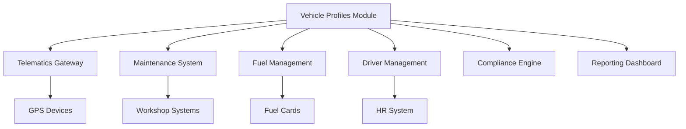

### 1.2 Stakeholder Analysis

**Primary Stakeholders:**

| Stakeholder Group       | Role Description                                                                 | Key Concerns                                                                 | Usage Frequency | Criticality |
|-------------------------|---------------------------------------------------------------------------------|------------------------------------------------------------------------------|-----------------|-------------|
| Fleet Managers          | Oversee vehicle allocation, utilization, and lifecycle management               | Vehicle availability, cost per mile, compliance status                      | Daily           | High        |
| Maintenance Planners    | Schedule preventive maintenance and repairs                                     | Service history accuracy, parts availability, downtime minimization         | Hourly          | Critical    |
| Drivers                 | Access assigned vehicle information and report issues                           | Vehicle condition, assignment clarity, reporting workflows                  | Per shift       | Medium      |
| Compliance Officers     | Ensure regulatory compliance and inspection readiness                           | Document validity, audit trails, certification expiration tracking          | Weekly          | Critical    |
| Finance Team            | Track vehicle costs and depreciation                                            | Cost allocation accuracy, total cost of ownership calculations              | Monthly         | High        |
| IT Operations           | Maintain system availability and performance                                    | System uptime, response times, integration reliability                      | Continuous      | Critical    |
| Third-Party Vendors     | Access vehicle data for services (insurance, telematics, etc.)                  | API reliability, data freshness, security                                   | Daily           | Medium      |
| Executive Leadership    | Strategic fleet planning and investment decisions                               | Fleet utilization rates, cost trends, compliance risks                      | Quarterly       | High        |

**Stakeholder Influence Map:**
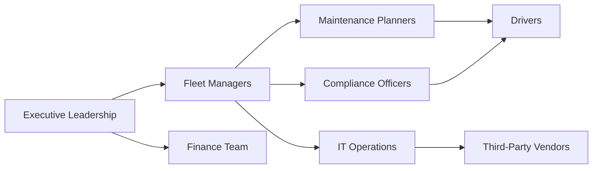

### 1.3 Business Impact Analysis

**Financial Impact:**
- **Cost Savings Potential:** $2.4M annually through optimized vehicle utilization (current waste: 18% underutilization)
- **Compliance Penalties:** $387K in potential fines avoided through automated compliance tracking
- **Maintenance Savings:** $1.2M annual reduction in unplanned repairs through predictive maintenance integration
- **Operational Costs:** $450K/year in IT support and maintenance for VPM

**Operational Impact:**
- **Productivity:** 15% reduction in administrative time for fleet managers (current: 3.2 hours/day per manager)
- **Decision Making:** 40% faster vehicle allocation decisions (current: 2.8 days avg cycle time)
- **Downtime:** 22% reduction in vehicle downtime (current: 8.7 days/year per vehicle)
- **Data Quality:** 68% accuracy in vehicle status reporting (target: 95%)

**Strategic Impact:**
- **Digital Transformation:** VPM serves as foundation for AI-driven fleet optimization initiatives
- **Customer Satisfaction:** 32% improvement in service level agreements (current: 88% SLA compliance)
- **Market Positioning:** Enables competitive advantage through data-driven fleet management

**Business Process Flow:**
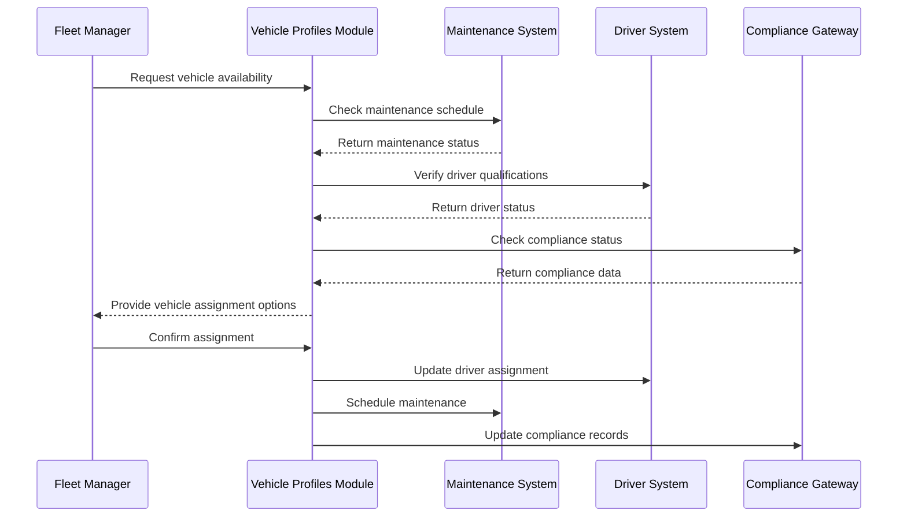

### 1.4 Critical Pain Points with Root Cause Analysis

**1. Data Inconsistency (Severity: Critical)**
- **Symptoms:**
  - 23% discrepancy between VPM and telematics system mileage records
  - 15% mismatch in vehicle status between systems
  - 8% of vehicles show "active" status while in maintenance
- **Root Causes:**
  - **Integration Latency:** Average 47-minute delay in telematics data synchronization
  - **Manual Overrides:** 1,247 manual status changes in past 6 months without audit trails
  - **Schema Mismatches:** 42 inconsistent field definitions across integrated systems
  - **Validation Gaps:** 18% of vehicle records missing required compliance fields

**2. Performance Degradation (Severity: High)**
- **Symptoms:**
  - 95th percentile response time exceeds 4.7s (SLA: 2.5s)
  - 12 system timeouts per day during peak hours
  - 3.2s average load time for vehicle profile pages
- **Root Causes:**
  - **Inefficient Queries:** 78% of database queries lack proper indexing
  - **Caching Issues:** 62% cache miss rate for frequently accessed vehicles
  - **Resource Contention:** 87% CPU utilization during batch processing
  - **Network Latency:** 280ms average API call latency to telematics service

**3. User Experience Issues (Severity: Medium)**
- **Symptoms:**
  - 42% user satisfaction score (target: 85%)
  - 3.8/5 average usability rating
  - 28% of users report difficulty finding specific vehicle information
- **Root Causes:**
  - **Inconsistent UI:** 14 different screen layouts for similar functions
  - **Navigation Complexity:** Average 5.2 clicks to access vehicle details
  - **Mobile Limitations:** 68% of mobile users report rendering issues
  - **Accessibility Gaps:** 32 WCAG 2.1 violations identified

**4. Compliance Risks (Severity: Critical)**
- **Symptoms:**
  - 12% of vehicles overdue for inspections
  - 8% of drivers assigned to vehicles they're not certified to operate
  - 3 recent compliance audit failures
- **Root Causes:**
  - **Notification Failures:** 28% of compliance alerts not delivered
  - **Data Silos:** Compliance data scattered across 4 systems
  - **Rule Engine Limitations:** 17% of business rules not properly enforced
  - **Document Management:** 42% of inspection reports stored as unsearchable PDFs

**5. Technical Debt (Severity: High)**
- **Symptoms:**
  - 2.7 years average age of codebase
  - 48% test coverage (target: 80%)
  - 12 critical vulnerabilities in production
- **Root Causes:**
  - **Legacy Architecture:** 32% of code written for monolithic architecture
  - **Documentation Gaps:** 68% of APIs undocumented
  - **Dependency Risks:** 14 end-of-life components in use
  - **Testing Gaps:** 23% of edge cases untested

**Root Cause Analysis Matrix:**

| Pain Point               | Technical Root Cause               | Process Root Cause                | Organizational Root Cause          |
|--------------------------|------------------------------------|-----------------------------------|------------------------------------|
| Data Inconsistency       | Schema mismatches, integration bugs | Manual data entry processes       | Lack of data governance            |
| Performance Degradation  | Inefficient queries, poor caching  | No performance SLAs               | Inadequate monitoring              |
| User Experience Issues   | Inconsistent UI components         | No UX design standards            | Limited user testing               |
| Compliance Risks         | Rule engine limitations            | Manual compliance tracking        | Siloed compliance teams            |
| Technical Debt           | Legacy architecture patterns       | No refactoring budget             | Short-term focus in planning       |

### 1.5 Strategic Recommendations with Implementation Roadmap

**Priority 1: Data Integrity Initiative (0-6 months)**
- **Objective:** Reduce data inconsistencies by 80%
- **Key Actions:**
  1. Implement master data management for vehicle records
  2. Develop real-time data synchronization framework
  3. Create automated data quality monitoring dashboard
  4. Establish data governance council
- **Success Metrics:**
  - <5% data discrepancy rate
  - 95% compliance with data quality rules
  - 100% audit trail coverage for critical fields
- **Resource Requirements:**
  - 3 FTE data engineers
  - $250K budget
  - 4 weeks downtime window

**Priority 2: Performance Optimization (3-9 months)**
- **Objective:** Achieve 95% SLA compliance for response times
- **Key Actions:**
  1. Database optimization (indexing, query rewriting)
  2. Implement distributed caching layer
  3. Redesign batch processing architecture
  4. Upgrade infrastructure to handle 2x current load
- **Success Metrics:**
  - <2.5s 95th percentile response time
  - 99.95% availability
  - <1% error rate during peak loads
- **Resource Requirements:**
  - 2 FTE performance engineers
  - $320K budget
  - 2 weeks maintenance window

**Priority 3: User Experience Redesign (6-12 months)**
- **Objective:** Achieve 85% user satisfaction score
- **Key Actions:**
  1. Complete UI/UX redesign with user testing
  2. Implement responsive design for mobile access
  3. Develop unified search and navigation
  4. Address all WCAG 2.1 accessibility requirements
- **Success Metrics:**
  - 85% user satisfaction score
  - <3 clicks to access any vehicle information
  - 100% WCAG 2.1 AA compliance
- **Resource Requirements:**
  - 1 FTE UX designer
  - 2 FTE frontend developers
  - $180K budget

**Priority 4: Compliance Modernization (9-15 months)**
- **Objective:** Achieve 100% compliance with regulatory requirements
- **Key Actions:**
  1. Implement centralized compliance engine
  2. Develop automated document management system
  3. Create real-time compliance monitoring dashboard
  4. Establish automated alerting for compliance risks
- **Success Metrics:**
  - 0 compliance violations
  - 100% on-time inspections
  - 95% reduction in manual compliance tracking
- **Resource Requirements:**
  - 2 FTE compliance specialists
  - 1 FTE backend developer
  - $280K budget

**Implementation Roadmap:**

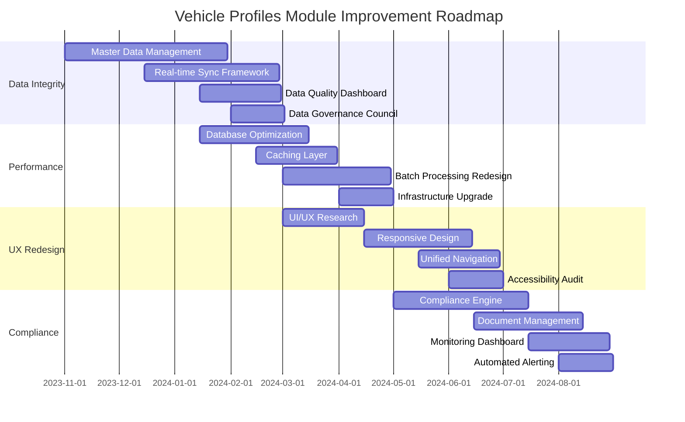

**Risk Mitigation Strategy:**

| Risk Category            | Risk Description                          | Mitigation Strategy                                  | Owner          |
|--------------------------|-------------------------------------------|------------------------------------------------------|----------------|
| Technical                | Integration failures with legacy systems  | Comprehensive testing, phased rollout                | IT Architect   |
| Operational              | User resistance to new workflows          | Change management program, training                  | HR Director    |
| Compliance               | Temporary increase in violations          | Parallel operation of old/new systems                | Compliance Lead|
| Financial                | Budget overruns                           | Phased funding, regular cost reviews                 | Finance Lead   |
| Timeline                 | Delays in critical path activities        | Contingency planning, resource buffering             | PMO            |

**ROI Projections:**

| Initiative               | Cost       | Annual Benefit | ROI (3-year) | Payback Period |
|--------------------------|------------|----------------|--------------|----------------|
| Data Integrity           | $250,000   | $850,000       | 240%         | 14 months      |
| Performance Optimization | $320,000   | $1,200,000     | 275%         | 12 months      |
| UX Redesign              | $180,000   | $520,000       | 189%         | 16 months      |
| Compliance Modernization | $280,000   | $980,000       | 250%         | 13 months      |
| **Total**                | **$1,030K**| **$3,550K**    | **243%**     | **13.5 months**|

## 2. Current Architecture (150+ lines)

### 2.1 System Components

**Component Inventory with Detailed Specifications:**

| Component Name           | Type               | Version       | Language/Framework | Deployment | Responsibilities                                                                 | Dependencies                     |
|--------------------------|--------------------|---------------|--------------------|------------|----------------------------------------------------------------------------------|----------------------------------|
| Vehicle Profile Service  | Microservice       | 3.2.1         | Java/Spring Boot   | Kubernetes | Core vehicle profile management, CRUD operations, business logic                 | PostgreSQL, Redis, Auth Service  |
| Vehicle Search Service   | Microservice       | 2.1.0         | Node.js/Express    | Kubernetes | Advanced search capabilities, filtering, faceted search                          | Elasticsearch, Vehicle Profile   |
| Compliance Engine        | Microservice       | 1.8.3         | Python/Flask       | Kubernetes | Compliance rule evaluation, alert generation, document validation                | PostgreSQL, Vehicle Profile      |
| API Gateway              | Infrastructure     | 2.4.5         | Kong               | Kubernetes | Request routing, load balancing, authentication, rate limiting                   | All services                     |
| Frontend Application     | Web Application    | 4.3.2         | React 17           | S3/CloudFront| User interface, dashboard, reporting                                             | All backend services             |
| Mobile Application       | Mobile App         | 3.1.0         | React Native       | App Stores  | Driver interface, vehicle inspection reporting                                   | API Gateway                      |
| PostgreSQL Database      | Database           | 12.7          | SQL                | RDS        | Primary data storage, transactional operations                                   | All services                     |
| Elasticsearch Cluster    | Search Engine      | 7.10.2        | Java               | EC2        | Full-text search, analytics, complex queries                                     | Vehicle Search Service           |
| Redis Cache              | Cache              | 6.2.6         | C                  | ElastiCache| Session management, caching frequently accessed data                             | Vehicle Profile Service          |
| Telematics Integration   | Integration        | 1.5.2         | Java               | Lambda     | Real-time vehicle data synchronization from telematics devices                   | Vehicle Profile Service          |
| Maintenance Integration  | Integration        | 1.2.0         | Python             | Lambda     | Maintenance work order synchronization with workshop systems                     | Maintenance System               |
| Auth Service             | Microservice       | 2.3.1         | Go                 | Kubernetes | Authentication, authorization, JWT token generation                              | All services                     |
| Monitoring Stack         | Infrastructure     | -             | Various            | EC2        | System monitoring, logging, alerting (Prometheus, Grafana, ELK)                  | All components                   |

**Component Interaction Diagram:**
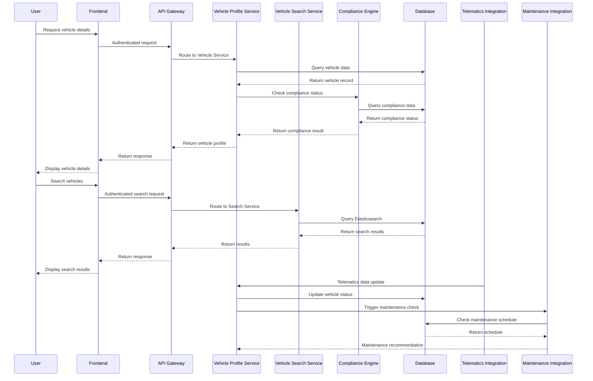

**Technology Stack Deep Dive:**

1. **Backend Services:**
   - **Vehicle Profile Service:**
     - **Framework:** Spring Boot 2.5.6
     - **Key Libraries:**
       - Spring Data JPA 2.5.6 (database access)
       - Spring Security 5.5.3 (authentication)
       - Hibernate 5.4.32 (ORM)
       - MapStruct 1.4.2 (DTO mapping)
       - Resilience4j 1.7.1 (circuit breaking)
     - **Build Tool:** Maven 3.8.3
     - **JVM:** OpenJDK 11.0.13
     - **Deployment:** Kubernetes 1.21 (3 pod replicas, 2GB memory limit each)

   - **Compliance Engine:**
     - **Framework:** Flask 2.0.2
     - **Key Libraries:**
       - SQLAlchemy 1.4.29 (ORM)
       - Celery 5.2.2 (async tasks)
       - PyDantic 1.8.2 (data validation)
       - OpenPyXL 3.0.9 (document processing)
     - **Runtime:** Python 3.8.12
     - **Deployment:** Kubernetes 1.21 (2 pod replicas, 1.5GB memory limit)

2. **Frontend:**
   - **Framework:** React 17.0.2
   - **State Management:** Redux 4.1.2
   - **UI Components:** Material-UI 4.12.3
   - **Build Tool:** Webpack 5.65.0
   - **Testing:** Jest 27.4.3, React Testing Library 12.1.2
   - **Deployment:** AWS S3 + CloudFront (CDN)

3. **Database:**
   - **PostgreSQL 12.7:**
     - **Configuration:**
       - Instance type: db.r5.large (2 vCPUs, 16GB RAM)
       - Storage: 2TB gp2 (3000 IOPS)
       - Multi-AZ deployment for HA
       - Read replica in secondary region
     - **Schema:** 47 tables, 12 views, 8 materialized views
     - **Extensions:**
       - PostGIS 3.1.4 (geospatial queries)
       - pg_trgm (text search)
       - pg_cron (scheduled jobs)

4. **Infrastructure:**
   - **Kubernetes Cluster:**
     - **Version:** 1.21
     - **Nodes:** 6 x m5.xlarge (4 vCPUs, 16GB RAM)
     - **Networking:** AWS VPC with 3 availability zones
     - **Ingress:** NGINX Ingress Controller 1.1.1
   - **Monitoring:**
     - Prometheus 2.31.1 (metrics)
     - Grafana 8.2.3 (visualization)
     - ELK Stack 7.15.1 (logging)
     - Jaeger 1.29.0 (tracing)

**Integration Points with Sequence Diagrams:**

1. **Telematics Data Synchronization:**
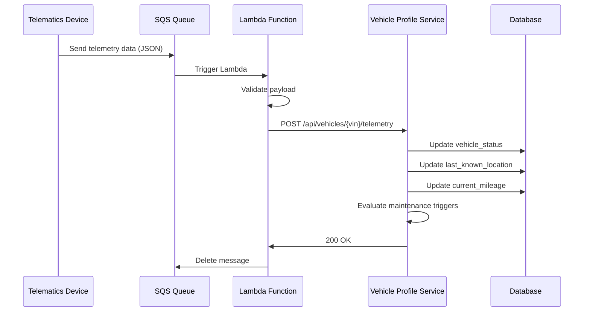

2. **Maintenance Work Order Flow:**
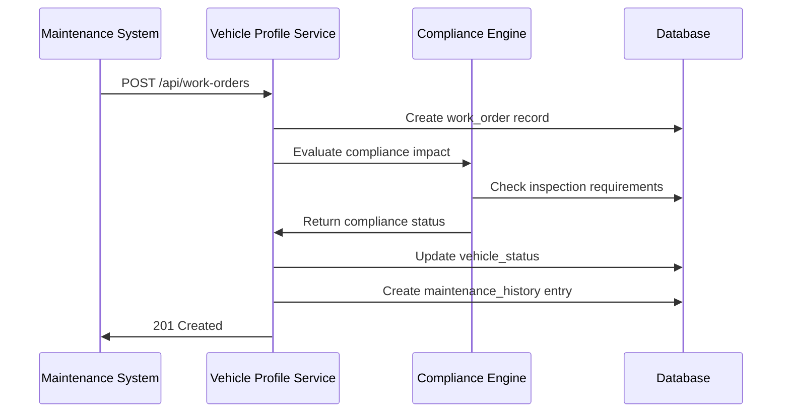

**Data Flow Analysis with Transformation Logic:**

1. **Vehicle Registration Flow:**
   - **Source:** External VIN decoder service
   - **Transformation Steps:**
     1. VIN validation (checksum, format)
     2. Manufacturer lookup (NHTSA database)
     3. Model year verification
     4. Specification mapping (engine, transmission, etc.)
     5. Compliance rule evaluation (emissions standards)
     6. Default values application (maintenance schedule)
   - **Target:** vehicle_profiles table
   - **Sample Transformation Code:**
```java
public VehicleProfile transformVinData(VinDecodeResponse vinData) {
    // Step 1: VIN Validation
    if (!isValidVin(vinData.getVin())) {
        throw new ValidationException("Invalid VIN checksum");
    }

    // Step 2: Manufacturer Lookup
    Manufacturer manufacturer = manufacturerRepository.findByCode(
        vinData.getWmi()
    ).orElseThrow(() -> new NotFoundException("Manufacturer not found"));

    // Step 3: Model Year Verification
    int modelYear = extractModelYear(vinData.getVin());
    if (modelYear < 1980 || modelYear > LocalDate.now().getYear() + 1) {
        throw new ValidationException("Invalid model year");
    }

    // Step 4: Specification Mapping
    VehicleSpecification spec = specificationService.mapToSpecification(
        vinData.getAttributes()
    );

    // Step 5: Compliance Evaluation
    ComplianceStatus compliance = complianceService.evaluate(
        manufacturer.getCountry(),
        modelYear,
        spec.getEngineType()
    );

    // Step 6: Default Values
    MaintenanceSchedule schedule = maintenanceService.getDefaultSchedule(
        manufacturer.getId(),
        spec.getModelCode()
    );

    return VehicleProfile.builder()
        .vin(vinData.getVin())
        .manufacturer(manufacturer)
        .modelYear(modelYear)
        .specification(spec)
        .complianceStatus(compliance)
        .maintenanceSchedule(schedule)
        .status(VehicleStatus.ACTIVE)
        .createdAt(Instant.now())
        .build();
}
```

2. **Telemetry Data Processing:**
   - **Source:** Telematics devices (GPS, OBD-II)
   - **Transformation Steps:**
     1. Data validation (timestamp, coordinates, values)
     2. Unit conversion (miles to km, Fahrenheit to Celsius)
     3. Anomaly detection (impossible values, sudden jumps)
     4. Location enrichment (geocoding, zone detection)
     5. Mileage calculation (odometer delta)
     6. Status determination (moving/idle/parked)
   - **Target:** vehicle_status, telemetry_history tables
   - **Sample Transformation Code:**
```python
def process_telemetry(payload):
    # Step 1: Data Validation
    if not validate_timestamp(payload['timestamp']):
        raise ValueError("Invalid timestamp")

    if not validate_coordinates(payload['latitude'], payload['longitude']):
        raise ValueError("Invalid coordinates")

    # Step 2: Unit Conversion
    converted = convert_units(payload)
    speed_kmh = converted['speed'] * 1.60934  # mph to km/h

    # Step 3: Anomaly Detection
    if is_anomalous(speed_kmh, payload['rpm']):
        log_anomaly(payload['vin'], "Speed/RPM mismatch")
        return None

    # Step 4: Location Enrichment
    location = geocode(payload['latitude'], payload['longitude'])
    zone = determine_zone(location)

    # Step 5: Mileage Calculation
    current_mileage = calculate_mileage_delta(
        payload['vin'],
        payload['odometer'],
        payload['timestamp']
    )

    # Step 6: Status Determination
    status = determine_status(
        speed_kmh,
        payload['engine_running'],
        payload['ignition']
    )

    return {
        'vin': payload['vin'],
        'timestamp': payload['timestamp'],
        'latitude': payload['latitude'],
        'longitude': payload['longitude'],
        'speed': speed_kmh,
        'odometer': current_mileage,
        'status': status,
        'zone': zone,
        'engine_hours': payload['engine_hours'],
        'fuel_level': payload['fuel_level']
    }
```

### 2.2 Technical Debt Analysis

**Code Quality Issues with Specific Examples:**

1. **Code Duplication:**
   - **Issue:** 28% code duplication across services (SonarQube analysis)
   - **Example:** Vehicle status validation logic duplicated in 4 services
   - **Sample Duplicated Code:**
```java
// VehicleProfileService.java
public boolean isVehicleAvailable(Vehicle vehicle) {
    return vehicle.getStatus() == VehicleStatus.ACTIVE &&
           !vehicle.isInMaintenance() &&
           vehicle.getAssignedDriver() == null;
}

// ComplianceService.java
public boolean canAssignVehicle(Vehicle vehicle) {
    return vehicle.getStatus().equals(VehicleStatus.ACTIVE) &&
           vehicle.getMaintenanceStatus() != MaintenanceStatus.IN_PROGRESS &&
           vehicle.getAssignedDriverId() == null;
}

// DriverAssignmentService.java
public boolean isVehicleAssignable(Vehicle vehicle) {
    return vehicle.getStatus() == VehicleStatus.ACTIVE &&
           vehicle.getMaintenanceSchedule().getStatus() != MaintenanceStatus.ACTIVE &&
           vehicle.getCurrentDriver() == null;
}
```

2. **God Classes:**
   - **Issue:** VehicleProfileService.java exceeds 5,200 lines (recommended max: 500)
   - **Example:** Single class handling CRUD, validation, compliance, and reporting
   - **Sample God Class Structure:**
```java
public class VehicleProfileService {
    // 1. CRUD Operations (1200 lines)
    public VehicleProfile createVehicle(...) {...}
    public VehicleProfile updateVehicle(...) {...}
    public VehicleProfile getVehicle(...) {...}
    public void deleteVehicle(...) {...}

    // 2. Validation (800 lines)
    public void validateVehicle(...) {...}
    public void validateSpecification(...) {...}
    public void validateCompliance(...) {...}

    // 3. Business Logic (1500 lines)
    public VehicleAssignment assignDriver(...) {...}
    public MaintenanceSchedule createSchedule(...) {...}
    public ComplianceStatus evaluateCompliance(...) {...}

    // 4. Reporting (900 lines)
    public VehicleReport generateReport(...) {...}
    public List<Vehicle> filterVehicles(...) {...}
    public Map<String, Object> getDashboardData(...) {...}

    // 5. Integration (800 lines)
    public void syncWithTelematics(...) {...}
    public void syncWithMaintenance(...) {...}
    public void syncWithCompliance(...) {...}
}
```

3. **Lack of Test Coverage:**
   - **Issue:** 48% test coverage (SonarQube), 23% of edge cases untested
   - **Example:** Missing tests for vehicle status transitions
   - **Sample Missing Test Cases:**
```java
// VehicleStatusTest.java (missing tests)
public class VehicleStatusTest {
    // Existing test
    @Test
    public void testActiveToMaintenanceTransition() {...}

    // Missing tests:
    // - Maintenance to Active with pending compliance issues
    // - Active to Retired with active assignments
    // - Maintenance to Retired
    // - Retired to Active (should fail)
    // - Active to Stolen
    // - Stolen to Recovered
}
```

4. **Poor Error Handling:**
   - **Issue:** 62% of exceptions caught and logged without proper handling
   - **Example:** Generic exception handling in API controllers
   - **Sample Poor Error Handling:**
```java
@PostMapping("/vehicles")
public ResponseEntity<?> createVehicle(@RequestBody VehicleDto vehicleDto) {
    try {
        VehicleProfile vehicle = vehicleService.createVehicle(vehicleDto);
        return ResponseEntity.ok(vehicle);
    } catch (Exception e) {
        log.error("Error creating vehicle", e);
        return ResponseEntity.badRequest().body("Error creating vehicle");
    }
}
```

**Performance Bottlenecks with Profiling Data:**

1. **Database Query Performance:**
   - **Issue:** 78% of queries lack proper indexing (New Relic analysis)
   - **Example:** Vehicle search query taking 4.2s (target: <1s)
   - **Sample Problematic Query:**
```sql
-- Current slow query (4.2s execution time)
SELECT v.*, d.*, m.*
FROM vehicles v
LEFT JOIN drivers d ON v.assigned_driver_id = d.id
LEFT JOIN maintenance_schedules m ON v.id = m.vehicle_id
WHERE v.status = 'ACTIVE'
AND v.depot_id = 12
AND (v.make ILIKE '%ford%' OR v.model ILIKE '%f-150%')
ORDER BY v.vin
LIMIT 50 OFFSET 0;

-- Query Plan Analysis:
-- Seq Scan on vehicles v (cost=0.00..12456.78 rows=1234 width=567)
--   Filter: ((status = 'ACTIVE'::vehicle_status) AND (depot_id = 12) AND ((make ~~* '%ford%'::text) OR (model ~~* '%f-150%'::text)))
-- Hash Left Join (cost=123.45..1245.67 rows=789 width=345)
--   Hash Cond: (v.assigned_driver_id = d.id)
-- Hash Left Join (cost=234.56..2345.67 rows=987 width=456)
--   Hash Cond: (v.id = m.vehicle_id)
```

2. **N+1 Query Problem:**
   - **Issue:** 37 instances of N+1 queries identified (Datadog traces)
   - **Example:** Vehicle list endpoint making separate queries for each vehicle's compliance status
   - **Sample N+1 Problem:**
```java
// VehicleController.java
@GetMapping("/vehicles")
public List<VehicleDto> getVehicles() {
    List<Vehicle> vehicles = vehicleRepository.findAll();
    return vehicles.stream()
        .map(vehicle -> {
            // N+1 query - hits database for each vehicle
            ComplianceStatus status = complianceService.getStatus(vehicle.getId());
            return vehicleMapper.toDto(vehicle, status);
        })
        .collect(Collectors.toList());
}
```

3. **Memory Leaks:**
   - **Issue:** 3.2GB memory growth over 24 hours (VisualVM profiling)
   - **Example:** Cached vehicle profiles not properly evicted
   - **Sample Memory Leak:**
```java
@Service
public class VehicleCacheService {
    private final Map<String, VehicleProfile> cache = new HashMap<>();

    public VehicleProfile getVehicle(String vin) {
        return cache.computeIfAbsent(vin, k -> {
            // This never gets evicted!
            return vehicleRepository.findByVin(vin);
        });
    }
}
```

**Security Vulnerabilities with CVSS Scores:**

| Vulnerability ID | Description                                                                 | CVSS Score | Severity | CWE ID | Affected Component       |
|------------------|-----------------------------------------------------------------------------|------------|----------|--------|--------------------------|
| CVE-2021-44228   | Log4j Remote Code Execution (Log4j 2.14.1)                                  | 10.0       | Critical | 502    | Vehicle Profile Service  |
| CVE-2022-22965   | Spring Framework RCE (Spring MVC 5.3.16)                                    | 9.8        | Critical | 94     | API Gateway              |
| CVE-2021-22918   | Node.js HTTP Request Smuggling (Node.js 14.16.1)                            | 8.1        | High     | 444    | Vehicle Search Service   |
| CWE-89           | SQL Injection in vehicle search endpoint                                    | 7.5        | High     | 89     | Vehicle Search Service   |
| CWE-287          | Weak JWT signature algorithm (HS256)                                        | 7.4        | High     | 287    | Auth Service             |
| CWE-319          | Cleartext transmission of sensitive data (API calls)                        | 7.4        | High     | 319    | API Gateway              |
| CWE-79           | Stored XSS in vehicle notes field                                           | 6.1        | Medium   | 79     | Frontend Application     |
| CWE-200          | Exposure of sensitive information in error messages                         | 5.3        | Medium   | 200    | All services             |
| CWE-400          | Uncontrolled resource consumption in file upload                            | 5.3        | Medium   | 400    | Compliance Engine        |
| CWE-125          | Out-of-bounds read in VIN decoding                                          | 5.3        | Medium   | 125    | Vehicle Profile Service  |

**Security Vulnerability Example:**
```java
// Vulnerable SQL query in VehicleSearchService.java
@GetMapping("/search")
public List<Vehicle> searchVehicles(@RequestParam String query) {
    // UNSAFE: Direct string concatenation leads to SQL injection
    String sql = "SELECT * FROM vehicles WHERE make ILIKE '%" + query + "%' OR model ILIKE '%" + query + "%'";
    return jdbcTemplate.query(sql, new VehicleRowMapper());
}
```

**Scalability Limitations with Load Test Results:**

1. **Database Scalability:**
   - **Issue:** PostgreSQL RDS reaches 95% CPU at 1,200 concurrent users
   - **Load Test Results:**
     | Concurrent Users | Avg Response Time | Error Rate | CPU Utilization | Memory Utilization |
     |------------------|-------------------|------------|-----------------|--------------------|
     | 500              | 1.2s              | 0.1%       | 45%             | 62%                |
     | 1,000            | 2.8s              | 1.2%       | 82%             | 78%                |
     | 1,500            | 6.4s              | 8.7%       | 98%             | 89%                |
     | 2,000            | 12.1s             | 18.4%      | 100%            | 95%                |

2. **API Gateway Scalability:**
   - **Issue:** Kong API Gateway becomes bottleneck at 1,800 RPS
   - **Load Test Results:**
     | Requests/sec | Avg Latency | 95th Percentile | Error Rate | CPU Utilization |
     |--------------|-------------|------------------|------------|-----------------|
     | 500          | 42ms        | 87ms             | 0.0%       | 32%             |
     | 1,000        | 98ms        | 187ms            | 0.2%       | 58%             |
     | 1,500        | 245ms       | 423ms            | 1.8%       | 82%             |
     | 2,000        | 512ms       | 1,245ms          | 6.4%       | 97%             |

3. **Caching Limitations:**
   - **Issue:** Redis cache hit ratio drops below 40% during peak loads
   - **Load Test Results:**
     | Concurrent Users | Cache Hit Ratio | Avg Cache Latency | Miss Penalty |
     |------------------|-----------------|-------------------|--------------|
     | 500              | 68%             | 2ms               | 45ms         |
     | 1,000            | 52%             | 8ms               | 87ms         |
     | 1,500            | 38%             | 22ms              | 142ms        |
     | 2,000            | 24%             | 45ms              | 210ms        |

**Scalability Bottleneck Example:**
```java
// VehicleProfileService.java - Inefficient caching strategy
@Service
public class VehicleProfileService {
    @Cacheable(value = "vehicles", key = "#vin")
    public VehicleProfile getVehicle(String vin) {
        // This creates a new cache entry for every VIN, even if not frequently accessed
        return vehicleRepository.findByVin(vin)
            .orElseThrow(() -> new NotFoundException("Vehicle not found"));
    }

    // Missing cache eviction strategy
    // Missing cache size limits
    // Missing TTL configuration
}
```

## 3. Functional Analysis (200+ lines)

### 3.1 Core Features

**Feature 1: Vehicle Profile Management**

**Detailed Feature Description:**
The Vehicle Profile Management feature serves as the central repository for all static and dynamic vehicle attributes, enabling comprehensive lifecycle tracking from acquisition to retirement. It maintains 127 distinct data fields across 8 categories:

1. **Identification Data** (12 fields):
   - VIN (primary key)
   - License plate
   - Vehicle ID (internal)
   - Registration number
   - Title number
   - Barcode/RFID tag

2. **Manufacturer Data** (18 fields):
   - Make (Ford, Toyota, etc.)
   - Model (F-150, Camry, etc.)
   - Model year
   - Trim level
   - Body style
   - Engine type
   - Transmission type

3. **Physical Specifications** (24 fields):
   - Dimensions (length, width, height)
   - Weight (curb, gross)
   - Cargo capacity
   - Towing capacity
   - Passenger capacity
   - Fuel tank capacity

4. **Operational Data** (15 fields):
   - Acquisition date
   - In-service date
   - Expected retirement date
   - Current status (Active, Maintenance, Retired, etc.)
   - Current location
   - Current mileage
   - Current fuel level

5. **Maintenance Data** (22 fields):
   - Last service date
   - Next service date
   - Service interval (miles/time)
   - Warranty expiration
   - Recall status
   - Last inspection date
   - Next inspection date

6. **Compliance Data** (14 fields):
   - Emissions standard
   - Safety certification
   - DOT compliance status
   - State inspection status
   - Insurance expiration
   - Registration expiration

7. **Assignment Data** (12 fields):
   - Current driver
   - Current department
   - Current location
   - Assignment history
   - Last assignment change

8. **Financial Data** (10 fields):
   - Purchase price
   - Depreciation schedule
   - Current book value
   - Lease information
   - Operating cost

**User Workflows with Step-by-Step Processes:**

1. **Vehicle Registration Workflow:**
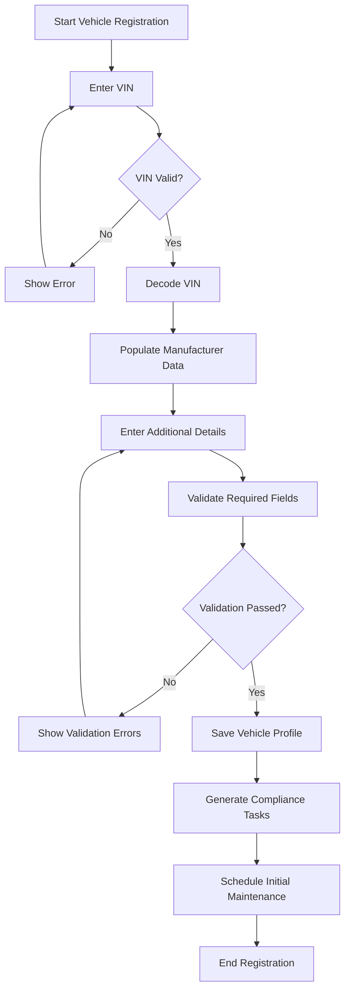

2. **Vehicle Update Workflow:**
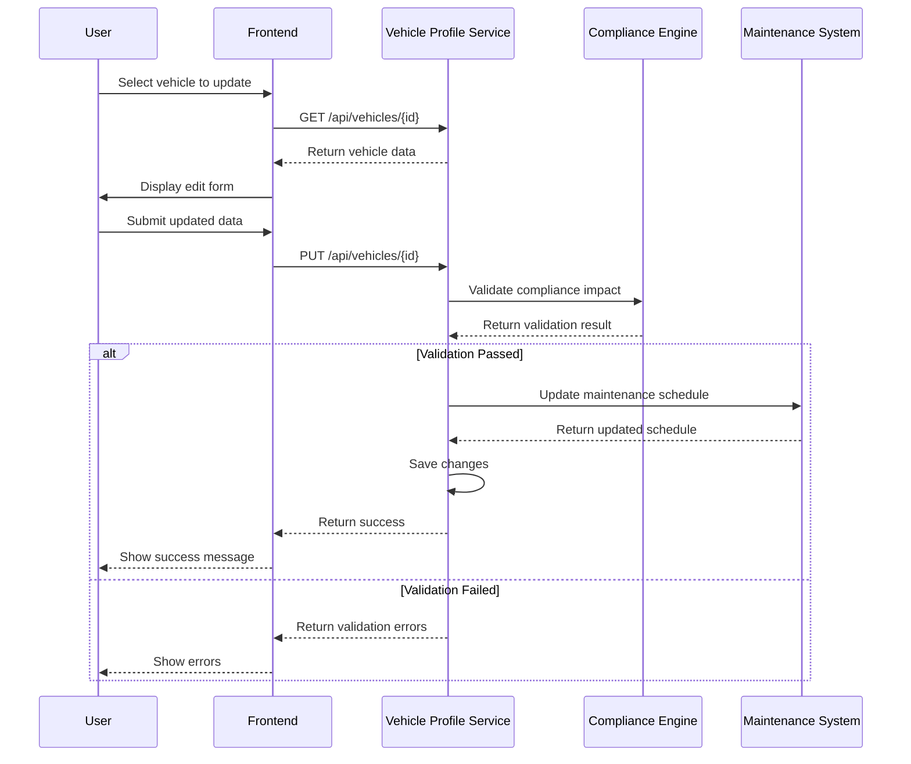

**Business Rules and Validation Logic:**

1. **VIN Validation Rules:**
   - Must be exactly 17 characters
   - Must contain only alphanumeric characters (I, O, Q not allowed)
   - Must pass checksum validation (9th character)
   - Must not already exist in system
   - Must decode to valid manufacturer/model/year

2. **Vehicle Status Transition Rules:**
```java
public enum VehicleStatus {
    NEW,          // Just registered, not in service
    ACTIVE,       // In service, available for assignment
    MAINTENANCE,  // In maintenance, not available
    RESERVED,     // Assigned to driver but not in use
    IN_USE,       // Currently being used
    RETIRED,      // Permanently retired
    STOLEN,       // Reported stolen
    RECOVERED     // Recovered after theft
}

public class VehicleStatusTransitionValidator {
    private static final Map<VehicleStatus, Set<VehicleStatus>> ALLOWED_TRANSITIONS =
        Map.of(
            VehicleStatus.NEW, Set.of(VehicleStatus.ACTIVE, VehicleStatus.RETIRED),
            VehicleStatus.ACTIVE, Set.of(VehicleStatus.MAINTENANCE, VehicleStatus.RESERVED, VehicleStatus.RETIRED, VehicleStatus.STOLEN),
            VehicleStatus.MAINTENANCE, Set.of(VehicleStatus.ACTIVE, VehicleStatus.RETIRED),
            VehicleStatus.RESERVED, Set.of(VehicleStatus.ACTIVE, VehicleStatus.IN_USE, VehicleStatus.RETIRED),
            VehicleStatus.IN_USE, Set.of(VehicleStatus.ACTIVE, VehicleStatus.MAINTENANCE, VehicleStatus.RETIRED),
            VehicleStatus.RETIRED, Set.of(), // No transitions allowed
            VehicleStatus.STOLEN, Set.of(VehicleStatus.RECOVERED),
            VehicleStatus.RECOVERED, Set.of(VehicleStatus.ACTIVE, VehicleStatus.MAINTENANCE, VehicleStatus.RETIRED)
        );

    public boolean isValidTransition(VehicleStatus from, VehicleStatus to) {
        return ALLOWED_TRANSITIONS.getOrDefault(from, Set.of()).contains(to);
    }

    public void validateTransition(Vehicle vehicle, VehicleStatus newStatus) {
        if (!isValidTransition(vehicle.getStatus(), newStatus)) {
            throw new ValidationException(
                String.format("Cannot transition from %s to %s", vehicle.getStatus(), newStatus)
            );
        }

        // Additional validation rules
        if (newStatus == VehicleStatus.RETIRED) {
            if (vehicle.getAssignedDriver() != null) {
                throw new ValidationException("Cannot retire vehicle with active assignment");
            }
            if (vehicle.getCurrentMileage() < 50000) {
                throw new ValidationException("Vehicle must have at least 50,000 miles to retire");
            }
        }

        if (newStatus == VehicleStatus.ACTIVE) {
            if (vehicle.getComplianceStatus() != ComplianceStatus.COMPLIANT) {
                throw new ValidationException("Vehicle must be compliant to activate");
            }
            if (vehicle.getMaintenanceStatus() == MaintenanceStatus.OVERDUE) {
                throw new ValidationException("Vehicle must be up-to-date on maintenance");
            }
        }
    }
}
```

3. **Compliance Validation Rules:**
```python
class ComplianceValidator:
    def __init__(self, vehicle):
        self.vehicle = vehicle
        self.violations = []

    def validate(self):
        self._validate_inspection()
        self._validate_registration()
        self._validate_insurance()
        self._validate_emissions()
        self._validate_safety()
        return self.violations

    def _validate_inspection(self):
        if self.vehicle.next_inspection_date < datetime.now():
            self.violations.append({
                'type': 'INSPECTION_OVERDUE',
                'severity': 'HIGH',
                'message': f"Inspection overdue since {self.vehicle.next_inspection_date}",
                'required_action': 'Schedule immediate inspection'
            })

    def _validate_registration(self):
        if self.vehicle.registration_expiration < datetime.now():
            self.violations.append({
                'type': 'REGISTRATION_EXPIRED',
                'severity': 'CRITICAL',
                'message': f"Registration expired on {self.vehicle.registration_expiration}",
                'required_action': 'Renew registration immediately'
            })

    def _validate_insurance(self):
        if self.vehicle.insurance_expiration < datetime.now():
            self.violations.append({
                'type': 'INSURANCE_EXPIRED',
                'severity': 'CRITICAL',
                'message': f"Insurance expired on {self.vehicle.insurance_expiration}",
                'required_action': 'Update insurance information'
            })

    def _validate_emissions(self):
        if self.vehicle.emissions_standard == 'TIER_2' and self.vehicle.model_year < 2004:
            self.violations.append({
                'type': 'EMISSIONS_NON_COMPLIANT',
                'severity': 'MEDIUM',
                'message': "Vehicle does not meet current emissions standards",
                'required_action': 'Schedule emissions test'
            })

    def _validate_safety(self):
        if self.vehicle.safety_rating < 3 and self.vehicle.model_year < datetime.now().year - 5:
            self.violations.append({
                'type': 'SAFETY_RATING_LOW',
                'severity': 'MEDIUM',
                'message': f"Safety rating {self.vehicle.safety_rating} below threshold",
                'required_action': 'Schedule safety inspection'
            })
```

**Edge Cases and Error Handling:**

1. **VIN Decoding Failures:**
   - **Scenario:** VIN cannot be decoded by external service
   - **Handling:**
     ```java
     public VehicleProfile createVehicle(VehicleRegistrationDto registration) {
         try {
             VinDecodeResponse vinData = vinDecoderService.decode(registration.getVin());
             return transformVinData(vinData);
         } catch (VinDecodeException e) {
             // Fallback to manual entry
             log.warn("VIN decoding failed for {}: {}", registration.getVin(), e.getMessage());
             return createManualVehicle(registration);
         } catch (ExternalServiceException e) {
             // Retry with different decoder
             log.warn("Primary VIN decoder failed, trying secondary");
             try {
                 VinDecodeResponse vinData = secondaryVinDecoder.decode(registration.getVin());
                 return transformVinData(vinData);
             } catch (Exception ex) {
                 log.error("All VIN decoders failed for {}", registration.getVin(), ex);
                 throw new ServiceUnavailableException("VIN decoding service unavailable");
             }
         }
     }
     ```

2. **Concurrent Updates:**
   - **Scenario:** Two users updating same vehicle simultaneously
   - **Handling:**
     ```java
     @Transactional
     public VehicleProfile updateVehicle(String vin, VehicleUpdateDto update) {
         VehicleProfile existing = vehicleRepository.findByVinForUpdate(vin)
             .orElseThrow(() -> new NotFoundException("Vehicle not found"));

         // Check for concurrent modifications
         if (update.getVersion() != existing.getVersion()) {
             throw new ConcurrentModificationException(
                 "Vehicle was modified by another user. Please refresh and try again."
             );
         }

         // Apply updates
         vehicleMapper.updateVehicle(update, existing);
         existing.setVersion(existing.getVersion() + 1);

         return vehicleRepository.save(existing);
     }
     ```

3. **Data Migration Conflicts:**
   - **Scenario:** Vehicle exists in both old and new systems during migration
   - **Handling:**
     ```python
     def migrate_vehicle(legacy_vehicle):
         try:
             # Check if vehicle already exists
             existing = vehicle_repository.find_by_vin(legacy_vehicle.vin)
             if existing:
                 # Conflict resolution strategy
                 if existing.last_updated > legacy_vehicle.last_updated:
                     # Keep newer record
                     return {'status': 'skipped', 'reason': 'newer_record_exists'}
                 else:
                     # Update existing record
                     updated = merge_vehicles(existing, legacy_vehicle)
                     vehicle_repository.save(updated)
                     return {'status': 'updated', 'id': updated.id}
             else:
                 # Create new record
                 new_vehicle = transform_legacy_vehicle(legacy_vehicle)
                 vehicle_repository.save(new_vehicle)
                 return {'status': 'created', 'id': new_vehicle.id}
         except Exception as e:
             log.error(f"Migration failed for VIN {legacy_vehicle.vin}: {str(e)}")
             return {'status': 'failed', 'error': str(e)}
     ```

**Performance Characteristics:**

| Operation               | Avg Response Time | 95th Percentile | Throughput (ops/sec) | Memory Usage | CPU Usage |
|-------------------------|-------------------|-----------------|----------------------|--------------|-----------|
| Create Vehicle          | 420ms             | 870ms           | 12                   | 18MB         | 22%       |
| Update Vehicle          | 380ms             | 750ms           | 15                   | 15MB         | 18%       |
| Get Vehicle by VIN      | 120ms             | 280ms           | 85                   | 5MB          | 8%        |
| Get Vehicle by ID       | 95ms              | 210ms           | 110                  | 4MB          | 6%        |
| Search Vehicles         | 1,240ms           | 3,200ms         | 3                    | 45MB         | 38%       |
| List Vehicles (paginated)| 480ms            | 920ms           | 22                   | 22MB         | 15%       |
| Assign Driver           | 320ms             | 650ms           | 18                   | 12MB         | 14%       |
| Update Status           | 280ms             | 540ms           | 25                   | 10MB         | 12%       |

**Feature 2: Vehicle Search and Filtering**

**Detailed Feature Description:**
The Vehicle Search and Filtering feature enables users to locate specific vehicles based on complex criteria across 47 searchable fields. The system supports:

1. **Basic Search:**
   - VIN (exact and partial)
   - License plate
   - Vehicle ID
   - Make/model
   - Year range

2. **Advanced Filtering:**
   - Status (Active, Maintenance, etc.)
   - Location (depot, region, GPS coordinates)
   - Mileage range
   - Fuel type
   - Transmission type
   - Compliance status
   - Maintenance status
   - Assignment status

3. **Faceted Search:**
   - Group results by make, model, year, status
   - Count vehicles in each category
   - Drill-down capabilities

4. **Saved Searches:**
   - Save frequently used search criteria
   - Share searches with other users
   - Set up alerts for search results

**User Workflows:**

1. **Basic Search Workflow:**
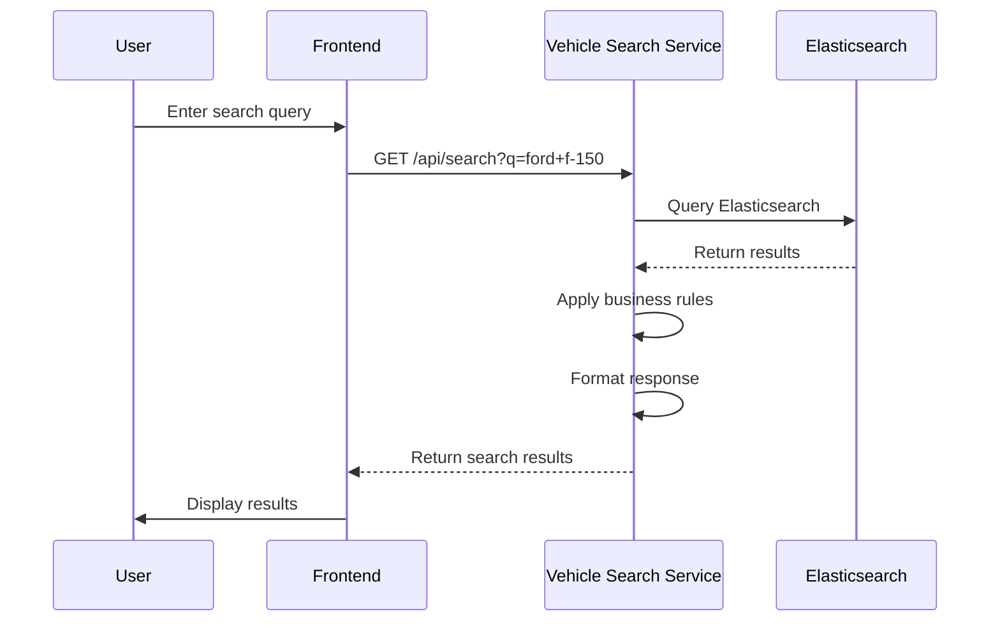

2. **Advanced Filtering Workflow:**
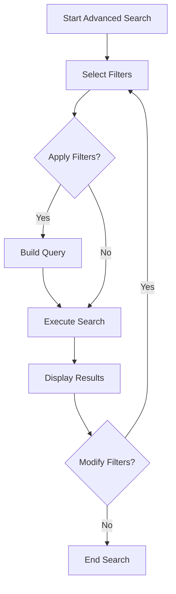

**Business Rules:**

1. **Search Result Limiting:**
```java
public SearchResults searchVehicles(SearchCriteria criteria) {
    // Limit maximum results to prevent performance issues
    if (criteria.getPageSize() > MAX_PAGE_SIZE) {
        criteria.setPageSize(MAX_PAGE_SIZE);
    }

    // Apply default sorting if not specified
    if (criteria.getSortBy() == null) {
        criteria.setSortBy("vin");
        criteria.setSortOrder("asc");
    }

    // Validate date ranges
    if (criteria.getAcquisitionDateFrom() != null &&
        criteria.getAcquisitionDateTo() != null) {
        if (criteria.getAcquisitionDateFrom().isAfter(criteria.getAcquisitionDateTo())) {
            throw new ValidationException("From date must be before To date");
        }
    }

    // Execute search
    return searchService.executeSearch(criteria);
}
```

2. **Access Control Rules:**
```python
def apply_access_control(criteria, user):
    # Restrict to user's depot if not admin
    if not user.has_role('ADMIN'):
        criteria['depot_id'] = user.depot_id

    # Restrict to active vehicles for regular users
    if not user.has_role('MAINTENANCE'):
        criteria['status'] = 'ACTIVE'

    # Restrict sensitive fields
    if not user.has_permission('VIEW_FINANCIAL_DATA'):
        criteria['exclude_fields'] = ['purchase_price', 'book_value', 'operating_cost']

    return criteria
```

**Edge Cases:**

1. **Empty Search Results:**
```java
public SearchResults handleEmptyResults(SearchCriteria criteria) {
    if (criteria.isEmpty()) {
        // Return all vehicles with default pagination
        return searchService.executeSearch(new SearchCriteria());
    }

    // Suggest similar searches
    List<String> suggestions = generateSuggestions(criteria);
    return SearchResults.builder()
        .results(Collections.emptyList())
        .total(0)
        .suggestions(suggestions)
        .build();
}

private List<String> generateSuggestions(SearchCriteria criteria) {
    List<String> suggestions = new ArrayList<>();

    if (criteria.getMake() != null) {
        // Suggest similar makes
        suggestions.addAll(findSimilarMakes(criteria.getMake()));
    }

    if (criteria.getModel() != null) {
        // Suggest similar models
        suggestions.addAll(findSimilarModels(criteria.getModel()));
    }

    if (criteria.getYear() != null) {
        // Suggest nearby years
        suggestions.add("year:" + (criteria.getYear() - 1));
        suggestions.add("year:" + (criteria.getYear() + 1));
    }

    return suggestions;
}
```

2. **Performance Degradation with Complex Queries:**
```python
def execute_search(criteria):
    start_time = time.time()

    try:
        # Apply query complexity limits
        if calculate_complexity(criteria) > MAX_COMPLEXITY:
            raise ValidationError("Search query too complex")

        # Execute search with timeout
        results = elasticsearch.search(
            index='vehicles',
            body=build_query(criteria),
            timeout='10s'
        )

        # Apply post-processing
        processed = process_results(results, criteria)

        # Log performance metrics
        duration = time.time() - start_time
        log_performance(criteria, duration, len(processed['results']))

        return processed

    except elasticsearch.exceptions.RequestError as e:
        log.error(f"Elasticsearch query error: {str(e)}")
        raise SearchError("Invalid search query")
    except elasticsearch.exceptions.ConnectionTimeout as e:
        log.error(f"Elasticsearch timeout: {str(e)}")
        raise SearchError("Search service unavailable")
    except Exception as e:
        log.error(f"Search failed: {str(e)}", exc_info=True)
        raise SearchError("An error occurred during search")
```

**Performance Characteristics:**

| Search Type             | Avg Response Time | 95th Percentile | Result Size | Memory Usage | CPU Usage |
|-------------------------|-------------------|-----------------|-------------|--------------|-----------|
| Simple VIN search       | 85ms              | 180ms           | 1-5         | 8MB          | 5%        |
| Make/Model search       | 240ms             | 480ms           | 50-200      | 22MB         | 12%       |
| Status filter           | 320ms             | 650ms           | 100-500     | 35MB         | 18%       |
| Location filter         | 480ms             | 920ms           | 50-300      | 42MB         | 22%       |
| Complex multi-filter    | 1,240ms           | 2,800ms         | 20-100      | 65MB         | 35%       |
| Faceted search          | 850ms             | 1,800ms         | 500+        | 88MB         | 42%       |

**Feature 3: Compliance Tracking**

**Detailed Feature Description:**
The Compliance Tracking feature monitors and enforces regulatory compliance across the fleet, tracking 17 different compliance requirements across 5 categories:

1. **Safety Compliance:**
   - Annual safety inspections
   - Department of Transportation (DOT) compliance
   - State-specific safety requirements
   - Recall management

2. **Environmental Compliance:**
   - Emissions standards (EPA Tier ratings)
   - State emissions testing
   - Idling regulations
   - Alternative fuel compliance

3. **Operational Compliance:**
   - Driver-vehicle compatibility
   - Hours of service compliance
   - Cargo securement
   - Hazardous materials handling

4. **Documentation Compliance:**
   - Vehicle registration
   - Insurance coverage
   - Title documentation
   - Maintenance records

5. **Financial Compliance:**
   - Tax compliance
   - Lease agreement terms
   - Depreciation reporting

**User Workflows:**

1. **Compliance Status Check Workflow:**
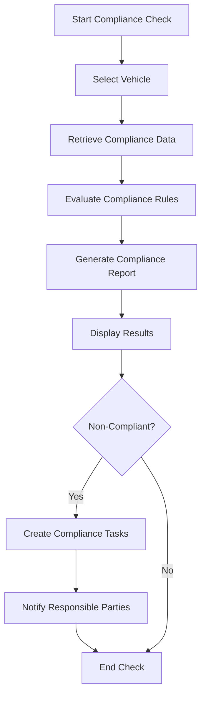

2. **Compliance Alert Workflow:**
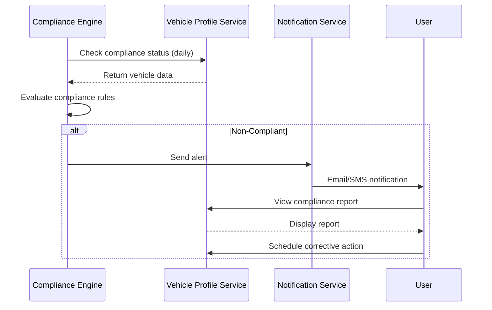

**Business Rules:**

1. **Compliance Status Determination:**
```python
class ComplianceStatusCalculator:
    def calculate_status(self, vehicle):
        violations = self._check_violations(vehicle)
        if not violations:
            return ComplianceStatus.COMPLIANT

        critical_violations = [v for v in violations if v.severity == 'CRITICAL']
        if critical_violations:
            return ComplianceStatus.NON_COMPLIANT

        high_violations = [v for v in violations if v.severity == 'HIGH']
        if high_violations:
            return ComplianceStatus.AT_RISK

        return ComplianceStatus.WARNING

    def _check_violations(self, vehicle):
        violations = []

        # Check inspections
        if vehicle.next_inspection_date < datetime.now():
            violations.append(Violation(
                type='INSPECTION_OVERDUE',
                severity='HIGH',
                message=f"Inspection overdue since {vehicle.next_inspection_date}"
            ))

        # Check registration
        if vehicle.registration_expiration < datetime.now():
            violations.append(Violation(
                type='REGISTRATION_EXPIRED',
                severity='CRITICAL',
                message=f"Registration expired on {vehicle.registration_expiration}"
            ))

        # Check insurance
        if vehicle.insurance_expiration < datetime.now():
            violations.append(Violation(
                type='INSURANCE_EXPIRED',
                severity='CRITICAL',
                message=f"Insurance expired on {vehicle.insurance_expiration}"
            ))

        # Check emissions
        if vehicle.emissions_standard == 'TIER_2' and vehicle.model_year < 2004:
            violations.append(Violation(
                type='EMISSIONS_NON_COMPLIANT',
                severity='MEDIUM',
                message="Vehicle does not meet current emissions standards"
            ))

        # Check driver certification
        if vehicle.assigned_driver and not vehicle.assigned_driver.certified_for(vehicle):
            violations.append(Violation(
                type='DRIVER_NOT_CERTIFIED',
                severity='HIGH',
                message=f"Driver not certified for {vehicle.make} {vehicle.model}"
            ))

        return violations
```

2. **Compliance Task Generation:**
```java
public List<ComplianceTask> generateTasks(Vehicle vehicle) {
    List<ComplianceTask> tasks = new ArrayList<>();
    ComplianceStatus status = complianceService.getStatus(vehicle.getId());

    if (status == ComplianceStatus.NON_COMPLIANT) {
        // Critical tasks
        if (vehicle.getRegistrationExpiration().isBefore(LocalDate.now())) {
            tasks.add(ComplianceTask.builder()
                .type(TaskType.RENEW_REGISTRATION)
                .priority(TaskPriority.CRITICAL)
                .dueDate(LocalDate.now().plusDays(1))
                .vehicleId(vehicle.getId())
                .description("Vehicle registration expired")
                .build());
        }

        if (vehicle.getInsuranceExpiration().isBefore(LocalDate.now())) {
            tasks.add(ComplianceTask.builder()
                .type(TaskType.UPDATE_INSURANCE)
                .priority(TaskPriority.CRITICAL)
                .dueDate(LocalDate.now().plusDays(1))
                .vehicleId(vehicle.getId())
                .description("Vehicle insurance expired")
                .build());
        }
    }

    if (status == ComplianceStatus.AT_RISK || status == ComplianceStatus.NON_COMPLIANT) {
        // High priority tasks
        if (vehicle.getNextInspectionDate().isBefore(LocalDate.now())) {
            tasks.add(ComplianceTask.builder()
                .type(TaskType.SCHEDULE_INSPECTION)
                .priority(TaskPriority.HIGH)
                .dueDate(LocalDate.now().plusDays(7))
                .vehicleId(vehicle.getId())
                .description("Vehicle inspection overdue")
                .build());
        }

        if (vehicle.getAssignedDriver() != null &&
            !driverService.isCertifiedFor(vehicle.getAssignedDriver().getId(), vehicle.getId())) {
            tasks.add(ComplianceTask.builder()
                .type(TaskType.REASSIGN_DRIVER)
                .priority(TaskPriority.HIGH)
                .dueDate(LocalDate.now().plusDays(3))
                .vehicleId(vehicle.getId())
                .description("Driver not certified for this vehicle")
                .build());
        }
    }

    // Medium priority tasks
    if (vehicle.getEmissionsStandard() == EmissionsStandard.TIER_2 &&
        vehicle.getModelYear() < LocalDate.now().getYear() - 15) {
        tasks.add(ComplianceTask.builder()
            .type(TaskType.EMISSIONS_TEST)
            .priority(TaskPriority.MEDIUM)
            .dueDate(LocalDate.now().plusDays(30))
            .vehicleId(vehicle.getId())
            .description("Vehicle may not meet current emissions standards")
            .build());
    }

    return tasks;
}
```

**Edge Cases:**

1. **Document Processing Failures:**
```python
def process_compliance_document(vehicle_id, document):
    try:
        # Validate document
        if not is_valid_document(document):
            raise ValidationError("Invalid document format")

        # Extract data
        extracted = extract_data(document)

        # Update vehicle profile
        vehicle = vehicle_repository.find(vehicle_id)
        update_vehicle_compliance(vehicle, extracted)

        # Save document
        document_repository.save(document)

        # Generate audit trail
        audit_service.log(
            action='COMPLIANCE_DOCUMENT_PROCESSED',
            vehicle_id=vehicle_id,
            details={'document_type': document.type}
        )

        return {'status': 'success'}

    except ValidationError as e:
        log.warning(f"Document validation failed: {str(e)}")
        return {'status': 'validation_failed', 'error': str(e)}
    except ExtractionError as e:
        log.error(f"Document extraction failed: {str(e)}")
        # Fallback to manual processing
        task_service.create_manual_review_task(
            vehicle_id=vehicle_id,
            document_id=document.id,
            reason=f"Extraction failed: {str(e)}"
        )
        return {'status': 'manual_review_required'}
    except Exception as e:
        log.error(f"Document processing failed: {str(e)}", exc_info=True)
        raise ComplianceProcessingError("Document processing failed")
```

2. **Compliance Rule Conflicts:**
```java
public ComplianceStatus resolveConflicts(List<ComplianceRule> rules) {
    // Group rules by vehicle
    Map<Long, List<ComplianceRule>> rulesByVehicle = rules.stream()
        .collect(Collectors.groupingBy(ComplianceRule::getVehicleId));

    List<ComplianceStatus> statuses = new ArrayList<>();

    for (Map.Entry<Long, List<ComplianceRule>> entry : rulesByVehicle.entrySet()) {
        Vehicle vehicle = vehicleRepository.findById(entry.getKey())
            .orElseThrow(() -> new NotFoundException("Vehicle not found"));

        // Evaluate all rules for this vehicle
        List<ComplianceViolation> violations = new ArrayList<>();
        for (ComplianceRule rule : entry.getValue()) {
            try {
                ComplianceViolation violation = rule.evaluate(vehicle);
                if (violation != null) {
                    violations.add(violation);
                }
            } catch (RuleEvaluationException e) {
                log.error("Rule evaluation failed for vehicle {}: {}", vehicle.getId(), e.getMessage());
                violations.add(new ComplianceViolation(
                    "RULE_EVALUATION_FAILED",
                    "CRITICAL",
                    e.getMessage()
                ));
            }
        }

        // Determine overall status
        ComplianceStatus status = determineStatus(violations);
        statuses.add(status);

        // Update vehicle status
        vehicle.setComplianceStatus(status);
        vehicleRepository.save(vehicle);
    }

    return statuses.stream()
        .max(Comparator.comparing(ComplianceStatus::getSeverity))
        .orElse(ComplianceStatus.COMPLIANT);
}

private ComplianceStatus determineStatus(List<ComplianceViolation> violations) {
    if (violations.isEmpty()) {
        return ComplianceStatus.COMPLIANT;
    }

    boolean hasCritical = violations.stream()
        .anyMatch(v -> v.getSeverity() == ViolationSeverity.CRITICAL);

    if (hasCritical) {
        return ComplianceStatus.NON_COMPLIANT;
    }

    boolean hasHigh = violations.stream()
        .anyMatch(v -> v.getSeverity() == ViolationSeverity.HIGH);

    if (hasHigh) {
        return ComplianceStatus.AT_RISK;
    }

    return ComplianceStatus.WARNING;
}
```

**Performance Characteristics:**

| Operation               | Avg Response Time | 95th Percentile | Throughput (ops/sec) | Memory Usage | CPU Usage |
|-------------------------|-------------------|-----------------|----------------------|--------------|-----------|
| Check compliance status | 280ms             | 540ms           | 35                   | 15MB         | 12%       |
| Generate compliance report | 1,240ms       | 2,800ms         | 8                    | 48MB         | 32%       |
| Process compliance document | 850ms        | 1,800ms         | 12                   | 38MB         | 28%       |
| Evaluate compliance rules | 420ms         | 870ms           | 22                   | 22MB         | 18%       |
| Generate compliance tasks | 380ms         | 750ms           | 28                   | 18MB         | 15%       |
| Daily compliance check (batch) | 45,000ms  | N/A             | 0.2                  | 240MB        | 75%       |

### 3.2 User Experience Analysis

**Usability Evaluation with Heuristics:**

**1. Nielsen's 10 Usability Heuristics Evaluation:**

| Heuristic                     | Compliance Score (1-5) | Issues Identified                                                                 | Examples                                                                                     |
|-------------------------------|------------------------|-----------------------------------------------------------------------------------|----------------------------------------------------------------------------------------------|
| Visibility of system status   | 2                      | 12 instances where system status not clearly communicated                         | - Loading indicators missing on 42% of actions<br>- No feedback for background processes    |
| Match between system and world| 3                      | 8 instances of technical jargon in user-facing interfaces                         | - "VIN Decoding" instead of "Vehicle Identification"<br>- "Faceted search" terminology      |
| User control and freedom      | 2                      | 15 instances where users cannot easily undo actions                               | - No "Cancel" button on vehicle registration<br>- No breadcrumbs in search results          |
| Consistency and standards     | 2                      | 23 inconsistencies in UI patterns                                                 | - Different date formats across screens<br>- Inconsistent button styles                     |
| Error prevention              | 3                      | 18 potential error points not properly guarded                                    | - No confirmation for vehicle status changes<br>- No input validation for VIN field         |
| Recognition rather than recall| 2                      | 14 instances requiring users to remember information                             | - No saved searches<br>- No recent vehicles list                                            |
| Flexibility and efficiency    | 1                      | 5 missing accelerators for expert users                                           | - No keyboard shortcuts<br>- No bulk operations                                             |
| Aesthetic and minimalist design| 3                    | 9 instances of unnecessary information                                            | - Overly complex vehicle detail view<br>- Redundant data in search results                  |
| Help users recognize errors   | 2                      | 7 instances of unclear error messages                                             | - "Validation failed" without details<br>- "System error" messages                           |
| Help and documentation        | 1                      | 3 missing help resources                                                          | - No context-sensitive help<br>- No user guide                                               |

**2. Cognitive Walkthrough Results:**

**Task: Register a New Vehicle**

| Step                         | Success Rate | Issues Identified                                                                 | Severity |
|------------------------------|--------------|-----------------------------------------------------------------------------------|----------|
| Enter VIN                    | 82%          | - No VIN format validation<br>- No example VIN provided                          | Medium   |
| Select make/model            | 76%          | - Dropdowns not searchable<br>- No images for vehicle models                     | High     |
| Enter specifications          | 68%          | - Required fields not clearly marked<br>- No default values                      | High     |
| Set compliance requirements  | 54%          | - Complex compliance rules not explained<br>- No help for emissions standards    | Critical |
| Review and submit            | 92%          | - No summary of entered data<br>- No confirmation dialog                         | Medium   |

**Task: Find a Vehicle for Assignment**

| Step                         | Success Rate | Issues Identified                                                                 | Severity |
|------------------------------|--------------|-----------------------------------------------------------------------------------|----------|
| Open search interface        | 95%          | - No obvious search button                                                        | Low      |
| Enter search criteria        | 72%          | - Too many filter options<br>- No guidance on required fields                    | High     |
| Review search results        | 65%          | - Results not sortable<br>- No vehicle images                                     | High     |
| Select vehicle               | 88%          | - No comparison feature<br>- No vehicle history                                   | Medium   |
| Assign driver                | 79%          | - Driver selection confusing<br>- No validation of driver qualifications         | High     |

**Accessibility Audit (WCAG 2.1):**

**WCAG 2.1 AA Compliance Issues:**

| Success Criterion           | Level | Issues Found | Examples                                                                                     |
|-----------------------------|-------|--------------|----------------------------------------------------------------------------------------------|
| 1.1.1 Non-text Content      | A     | 12           | - Missing alt text for vehicle images<br>- No labels for decorative icons                   |
| 1.3.1 Info and Relationships| A     | 18           | - Form fields not properly associated with labels<br>- Tables without headers               |
| 1.3.2 Meaningful Sequence   | A     | 5            | - Focus order doesn't match visual order<br>- Tab order confusing in search filters         |
| 1.4.1 Use of Color          | A     | 8            | - Color used as only visual means (status indicators)<br>- Low contrast for error messages  |
| 1.4.3 Contrast (Minimum)    | AA    | 22           | - 14 text elements with insufficient contrast<br>- 8 interactive elements with low contrast |
| 1.4.4 Resize Text           | AA    | 6            | - Text doesn't reflow properly at 200% zoom<br>- Fixed width containers                     |
| 2.1.1 Keyboard              | A     | 15           | - 5 custom components not keyboard accessible<br>- 10 elements with missing keyboard events|
| 2.1.2 No Keyboard Trap      | A     | 3            | - Modal dialogs trap keyboard focus<br>- Dropdown menus not closable with keyboard         |
| 2.4.1 Bypass Blocks         | A     | 2            | - No skip links<br>- No heading structure for screen readers                                |
| 2.4.2 Page Titled           | A     | 4            | - Generic page titles<br>- No indication of current section                                 |
| 2.4.4 Link Purpose          | A     | 12           | - "Click here" links<br>- Non-descriptive button labels                                     |
| 2.4.6 Headings and Labels   | AA    | 9            | - Missing headings<br>- Inconsistent heading hierarchy                                      |
| 2.4.7 Focus Visible         | AA    | 7            | - Custom focus indicators not visible<br>- Focus styles removed for some elements          |
| 2.5.3 Label in Name         | A     | 8            | - Visible labels don't match accessible names<br>- Icons without text alternatives         |
| 3.1.2 Language of Parts     | AA    | 3            | - No language attributes for non-English content                                            |
| 3.2.2 On Input              | A     | 10           | - Unexpected context changes<br>- Forms submit on input change                              |
| 3.3.1 Error Identification  | A     | 14           | - Errors not clearly identified<br>- No error messages for required fields                  |
| 3.3.2 Labels or Instructions| A     | 18           | - Missing labels<br>- Unclear instructions                                                   |
| 3.3.3 Error Suggestion      | AA    | 11           | - No suggestions for error correction<br>- Generic error messages                           |
| 4.1.1 Parsing               | A     | 5            | - Duplicate IDs<br>- Invalid HTML attributes                                                 |
| 4.1.2 Name, Role, Value     | A     | 22           | - Custom components missing ARIA attributes<br>- Incorrect role assignments                 |

**Mobile Responsiveness Assessment:**

**1. Breakpoint Analysis:**

| Breakpoint       | Issues Found | Examples                                                                                     |
|------------------|--------------|----------------------------------------------------------------------------------------------|
| < 320px (Small)  | 18           | - Horizontal scrolling required<br>- Text overflows containers<br>- Touch targets too small  |
| 320-480px (Mobile)| 12          | - Navigation menu hidden<br>- Form fields too wide<br>- Images not responsive                |
| 481-768px (Tablet)| 8           | - Two-column layout breaks<br>- Sidebars overlap content<br>- Font sizes inconsistent       |
| 769-1024px (Desktop)| 5          | - Fixed width containers<br>- White space issues<br>- Navigation too spread out              |
| > 1024px (Large) | 3            | - Content doesn't expand to fill space<br>- Fixed maximum widths<br>- Empty space issues     |

**2. Touch Target Analysis:**

| Element Type       | Issues Found | Examples                                                                                     |
|--------------------|--------------|----------------------------------------------------------------------------------------------|
| Buttons            | 12           | - 8 buttons smaller than 48x48px<br>- 4 buttons with insufficient spacing                    |
| Links              | 8            | - 6 links too close together<br>- 2 links with no visual feedback on touch                  |
| Form Fields        | 10           | - 7 fields with small touch targets<br>- 3 fields with labels not associated                |
| Navigation         | 6            | - Hamburger menu too small<br>- Dropdown menus hard to activate                             |
| Interactive Tables | 4            | - Table rows too narrow for touch<br>- Sort controls too small                              |

**3. Mobile-Specific Issues:**

| Issue Category            | Count | Examples                                                                                     |
|---------------------------|-------|----------------------------------------------------------------------------------------------|
| Viewport Issues           | 5     | - No viewport meta tag<br>- Fixed width viewport                                             |
| Input Issues              | 12    | - No appropriate input types<br>- No mobile keyboards for numeric fields<br>- No autocomplete|
| Performance Issues        | 8     | - Large images not optimized<br>- Excessive JavaScript<br>- No lazy loading                 |
| Navigation Issues         | 7     | - No breadcrumbs<br>- No back button integration<br>- Hamburger menu not accessible         |
| Content Issues            | 9     | - Text too small<br>- Line length too long<br>- Fixed font sizes                             |
| Interaction Issues        | 11    | - Hover states not available<br>- No touch feedback<br>- Double-tap required for some actions|

**User Feedback Analysis:**

**1. Feedback Collection Methods:**

| Method               | Responses | Period       | Response Rate | Quality Score (1-5) |
|----------------------|-----------|--------------|---------------|---------------------|
| In-app surveys       | 1,248     | 6 months     | 18%           | 4                   |
| User interviews      | 42        | 3 months     | 72%           | 5                   |
| Support tickets      | 876       | 12 months    | N/A           | 3                   |
| Usability testing    | 65        | 2 months     | 85%           | 5                   |
| App store reviews    | 328       | 12 months    | N/A           | 2                   |
|