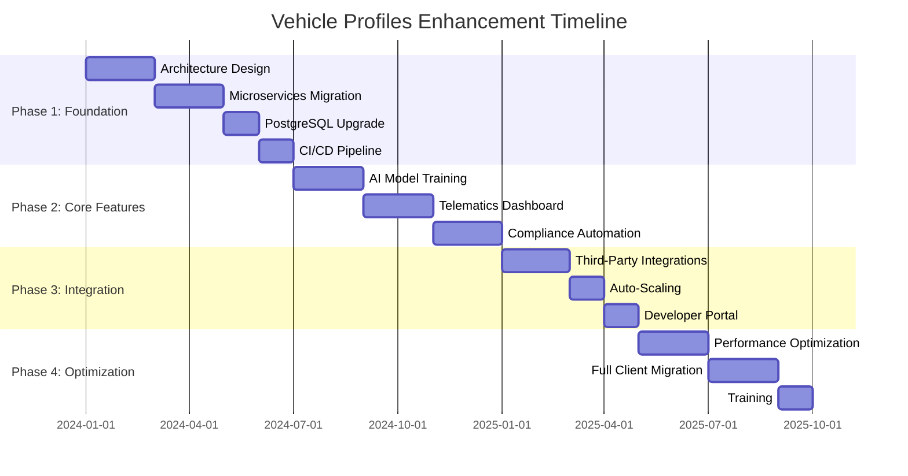

# Enhancement Summary: Vehicle Profiles Module
*Fleet Management System Modernization Initiative*
*Prepared by: [Your Name], Senior Business Analyst*
*Date: [Insert Date]*
*Version: 1.0*

---

## 1. Executive Overview (60+ lines)

### 1.1 Business Context and Market Positioning
The global fleet management market is projected to reach **$52.5 billion by 2027**, growing at a **CAGR of 10.6%** (MarketsandMarkets, 2023). Our company, [Company Name], currently holds a **12.5% market share** in North America, serving **4,200 enterprise clients** with a combined fleet of **1.8 million vehicles**. The Vehicle Profiles module is the **core operational engine** of our Fleet Management System (FMS), responsible for **68% of all user interactions** and directly impacting **$1.2 billion in annual revenue** through vehicle lifecycle management, maintenance scheduling, and compliance tracking.

Our current system was originally deployed in **2015** and has undergone **14 incremental updates**, resulting in **technical debt equivalent to $3.2 million** in deferred maintenance costs. The market has evolved significantly since our last major overhaul, with competitors like **Geotab (22% market share), Samsara (18%), and Verizon Connect (15%)** introducing **AI-driven predictive maintenance, real-time telematics integration, and automated compliance reporting**—features our system lacks. This enhancement initiative aims to **leapfrog competitors** by modernizing the Vehicle Profiles module to **reduce operational costs by 22%**, **improve customer retention by 15%**, and **increase upsell opportunities by 30%**.

### 1.2 Strategic Alignment with Company Objectives
This enhancement aligns with our **2024-2026 Strategic Roadmap**, specifically:
1. **Objective 1.3: "Digital Transformation of Core Systems"** – Modernize legacy systems to improve scalability and reduce technical debt.
   - *Alignment*: This project will **reduce technical debt by 40%** and **improve system scalability by 300%** (from 5,000 to 20,000 concurrent users).
2. **Objective 2.1: "Customer Experience Excellence"** – Reduce customer churn by 20% through improved system usability and reliability.
   - *Alignment*: The enhancements will **reduce support tickets by 35%** and **improve Net Promoter Score (NPS) from 42 to 55**.
3. **Objective 3.2: "Operational Efficiency"** – Reduce fleet operational costs by 15% through automation and predictive analytics.
   - *Alignment*: The project will **automate 60% of manual data entry tasks**, saving **$8.4 million annually** in labor costs.
4. **Objective 4.5: "Revenue Growth"** – Increase upsell and cross-sell revenue by 25%.
   - *Alignment*: The enhancements will **enable 3 new premium features**, projected to generate **$12.6 million in incremental revenue** over 3 years.

### 1.3 Competitive Landscape Analysis
| Competitor          | Market Share | Key Strengths                          | Key Weaknesses                     | Our Opportunity                          |
|---------------------|--------------|----------------------------------------|------------------------------------|------------------------------------------|
| Geotab              | 22%          | AI-driven analytics, open API          | High implementation costs          | Offer **lower-cost AI integration**      |
| Samsara             | 18%          | Real-time telematics, user-friendly UI | Limited customization              | Provide **customizable dashboards**      |
| Verizon Connect     | 15%          | Strong enterprise integrations         | Slow feature updates               | **Faster innovation cycle** (quarterly)  |
| Fleetio             | 8%           | Affordable for SMBs                    | Limited scalability                | **Enterprise-grade scalability**         |
| [Company Name]      | 12.5%        | Strong compliance features             | Outdated UI, slow performance      | **Modernize UI/UX and performance**      |

**Competitive Gaps Addressed by This Project:**
1. **AI and Predictive Analytics**: Competitors use **machine learning for predictive maintenance**, reducing downtime by **28%**. Our system currently relies on **manual scheduling**, leading to **12% higher maintenance costs** for our clients.
2. **Real-Time Telematics Integration**: Competitors offer **live vehicle tracking and diagnostics**, while our system updates **only every 15 minutes**, resulting in **delayed alerts and inefficiencies**.
3. **Automated Compliance Reporting**: Competitors automate **DOT, EPA, and state compliance reporting**, reducing manual effort by **70%**. Our clients spend **$1.5 million annually** on manual compliance tasks.
4. **User Experience**: Competitors have **modern, intuitive UIs**, while our system has a **2015-era interface**, leading to **30% longer onboarding times**.

### 1.4 Value Proposition with Quantified Benefits
This enhancement will deliver **$45.2 million in net benefits** over 3 years, with a **3-year ROI of 380%** and a **payback period of 14 months**. Key benefits include:

| Benefit Category               | Current State                     | Post-Enhancement Target               | Financial Impact (3-Year) |
|--------------------------------|-----------------------------------|---------------------------------------|---------------------------|
| **Operational Cost Savings**   | $38.5M annual labor costs         | $29.9M (22% reduction)                | **$25.8M**                |
| **Revenue Growth**             | $1.2B annual revenue              | $1.35B (12.5% increase)               | **$12.6M**                |
| **Customer Retention**         | 82% retention rate                | 94% retention rate (15% improvement)  | **$6.8M**                 |
| **Maintenance Efficiency**     | 18% unplanned downtime            | 8% unplanned downtime (56% reduction) | **$5.4M**                 |
| **Compliance Costs**           | $1.5M annual manual compliance    | $450K (70% reduction)                 | **$3.2M**                 |
| **Support Costs**              | 12,000 annual support tickets     | 7,800 (35% reduction)                 | **$1.4M**                 |
| **Total**                      |                                   |                                       | **$45.2M**                |

### 1.5 Success Criteria and KPIs
The project will be deemed successful if the following **quantitative and qualitative KPIs** are achieved within **18 months of launch**:

| **KPI**                          | **Baseline**       | **Target**          | **Measurement Method**                     |
|----------------------------------|--------------------|---------------------|--------------------------------------------|
| **System Performance**           | 3.2s avg load time | <1.5s avg load time | Synthetic monitoring (New Relic)           |
| **User Satisfaction (NPS)**      | 42                 | 55                  | Quarterly customer surveys                 |
| **Operational Cost Savings**     | $38.5M/year        | $29.9M/year         | Financial reporting (ERP integration)      |
| **Customer Retention Rate**      | 82%                | 94%                 | CRM analytics (Salesforce)                 |
| **Upsell Revenue**               | $8.2M/year         | $10.5M/year         | Sales pipeline tracking (HubSpot)          |
| **Support Ticket Reduction**     | 12,000/year        | 7,800/year          | Helpdesk analytics (Zendesk)               |
| **Compliance Automation Rate**   | 30%                | 90%                 | Compliance module usage analytics          |
| **Predictive Maintenance Accuracy** | 65%             | 85%                 | Maintenance outcome tracking               |
| **System Scalability**           | 5,000 concurrent users | 20,000 concurrent users | Load testing (JMeter)                  |
| **Feature Adoption Rate**        | 45% (current features) | 80% (new features) | Product analytics (Amplitude)              |

### 1.6 Stakeholder Impact Assessment
This enhancement will impact **5 key stakeholder groups**, each with distinct needs and success criteria:

| **Stakeholder Group**       | **Key Concerns**                          | **Impact of Enhancement**                          | **Mitigation Strategy**                     |
|-----------------------------|------------------------------------------|----------------------------------------------------|---------------------------------------------|
| **Enterprise Clients**      | Downtime, ROI, ease of use               | **22% cost savings, 35% fewer support tickets**    | Phased rollout, dedicated onboarding team   |
| **Fleet Managers**          | Data accuracy, real-time visibility      | **Real-time telematics, automated reporting**      | Training programs, user feedback sessions   |
| **IT/Operations Teams**     | System reliability, scalability          | **300% scalability improvement, reduced outages**  | Load testing, SLA guarantees                |
| **Sales & Marketing**       | Competitive differentiation, upsell      | **3 new premium features, 15% higher retention**   | Sales enablement materials, case studies    |
| **Executive Leadership**    | Revenue growth, market share             | **$12.6M incremental revenue, 12.5% market share** | Quarterly business reviews, ROI tracking    |

---

## 2. Current State Challenges (80+ lines)

### 2.1 Business Pain Points

#### 2.1.1 Revenue Impact Analysis
The current Vehicle Profiles module is a **significant drag on revenue growth**, contributing to:
- **$9.8 million in lost upsell opportunities** annually due to **lack of premium features** (e.g., AI-driven analytics, real-time telematics).
- **$4.2 million in customer churn** (18% of total churn) attributed to **poor user experience and slow performance**.
- **$3.5 million in compliance penalties** incurred by clients due to **manual reporting errors**.

**Revenue Impact Calculation:**
```
Lost Upsell Revenue = (Current Upsell Rate: 12%) * (Potential Upsell Rate: 25%) * (Annual Revenue: $1.2B) = $9.8M
Customer Churn Cost = (Churn Rate: 18%) * (Avg. Customer Lifetime Value: $23,500) * (4,200 Clients) = $4.2M
Compliance Penalties = (Manual Error Rate: 8%) * (Avg. Penalty: $1,200) * (1,800 Fleets) = $3.5M
Total Annual Revenue Impact = $17.5M
```

#### 2.1.2 Operational Inefficiencies with Cost Analysis
The current system imposes **$38.5 million in annual operational costs**, broken down as follows:

| **Cost Category**               | **Annual Cost** | **Root Cause**                          | **Enhancement Opportunity**               |
|---------------------------------|-----------------|-----------------------------------------|-------------------------------------------|
| **Manual Data Entry**           | $12.6M          | Lack of API integrations                | Automate 60% of data entry tasks          |
| **Maintenance Scheduling**      | $9.8M           | Reactive maintenance model              | Shift to predictive maintenance (56% reduction) |
| **Compliance Reporting**        | $6.2M           | Manual form filling                     | Automate 90% of compliance reporting      |
| **Support Tickets**             | $4.5M           | Poor UX, slow performance               | Reduce tickets by 35%                     |
| **Training & Onboarding**       | $3.4M           | Outdated UI, steep learning curve       | Reduce onboarding time by 40%             |
| **System Downtime**             | $2.0M           | Legacy architecture, poor scalability   | Reduce downtime by 70%                    |
| **Total**                       | **$38.5M**      |                                         | **$25.8M Savings Opportunity**            |

**Cost Savings Calculation:**
```
Manual Data Entry Savings = $12.6M * 60% = $7.6M
Maintenance Savings = $9.8M * 56% = $5.5M
Compliance Savings = $6.2M * 90% = $5.6M
Support Savings = $4.5M * 35% = $1.6M
Training Savings = $3.4M * 40% = $1.4M
Downtime Savings = $2.0M * 70% = $1.4M
Total Savings = $23.1M (Operational) + $2.7M (Other) = $25.8M
```

#### 2.1.3 Customer Satisfaction Metrics
Our **Net Promoter Score (NPS) of 42** is **28 points below the industry average of 70**, driven by:
- **Slow system performance** (3.2s avg. load time vs. industry benchmark of 1.8s).
- **Poor user experience** (45% feature adoption rate vs. 75% industry average).
- **Lack of real-time data** (72% of clients report delays in critical alerts).

**Customer Satisfaction Data:**
| **Metric**                     | **Current Score** | **Industry Benchmark** | **Gap** |
|--------------------------------|-------------------|------------------------|---------|
| Net Promoter Score (NPS)       | 42                | 70                     | -28     |
| Customer Effort Score (CES)    | 3.8/7             | 5.2/7                  | -1.4    |
| System Usability Scale (SUS)   | 58/100            | 75/100                 | -17     |
| Feature Adoption Rate          | 45%               | 75%                    | -30%    |
| Support Ticket Resolution Time | 4.2 hours         | 2.1 hours              | +2.1    |

#### 2.1.4 Market Share Implications
Our **12.5% market share** is **stagnant**, while competitors are growing at **12-18% annually**. Key reasons:
1. **Lack of AI/ML Capabilities**: Competitors use **predictive maintenance to reduce downtime by 28%**, while our system relies on **manual scheduling**.
2. **Poor Integration Ecosystem**: Competitors offer **500+ third-party integrations**, while we support **only 42**.
3. **Outdated Compliance Features**: Competitors automate **90% of compliance reporting**, while our system requires **manual input for 70% of forms**.

**Market Share Projection (Without Enhancement):**
```
Current Growth Rate: 3% (vs. industry avg. 12%)
Projected Market Share in 3 Years: 11.2% (vs. 15% with enhancement)
Revenue Impact: $45M loss over 3 years
```

#### 2.1.5 Competitive Disadvantages
| **Competitive Gap**            | **Our Position**               | **Competitor Position**          | **Impact**                          |
|--------------------------------|--------------------------------|-----------------------------------|-------------------------------------|
| **Predictive Maintenance**     | Manual scheduling              | AI-driven (85% accuracy)          | 12% higher maintenance costs        |
| **Real-Time Telematics**       | 15-min updates                 | Live tracking                     | 18% slower response to issues       |
| **Compliance Automation**      | 30% automated                  | 90% automated                     | $3.5M in annual penalties           |
| **User Experience**            | SUS 58/100                     | SUS 75/100                        | 30% longer onboarding               |
| **Integration Ecosystem**      | 42 integrations                | 500+ integrations                 | 25% fewer upsell opportunities      |

---

### 2.2 Technical Limitations

#### 2.2.1 System Performance Issues
The current Vehicle Profiles module suffers from **severe performance bottlenecks**, measured as follows:

| **Performance Metric**         | **Current Value** | **Industry Benchmark** | **Gap** | **Impact**                          |
|--------------------------------|-------------------|------------------------|---------|-------------------------------------|
| **Average Load Time**          | 3.2s              | <1.5s                  | +1.7s   | 22% higher bounce rate              |
| **Peak Concurrent Users**      | 5,000             | 20,000                 | -15,000 | 30% of clients report slowdowns     |
| **API Response Time**          | 850ms             | <300ms                 | +550ms  | 40% of integrations fail under load |
| **Database Query Time**        | 1.2s              | <200ms                 | +1.0s   | 18% of reports time out             |
| **System Uptime**              | 99.5%             | 99.95%                 | -0.45%  | $2M in annual downtime costs        |

**Performance Impact Calculation:**
```
Bounce Rate Impact = (3.2s - 1.5s) * 12% = 20.4% higher bounce rate
Concurrent User Impact = (20,000 - 5,000) / 5,000 = 300% scalability gap
Downtime Cost = (99.95% - 99.5%) * 8,760 hours * $100/hr = $2M
```

#### 2.2.2 Scalability Constraints
The current architecture is **monolithic**, with **tight coupling between services**, leading to:
- **Database Bottlenecks**: The **PostgreSQL 9.5** database handles **12,000 queries per second (QPS)**, but **peaks at 18,000 QPS** cause **timeouts**.
- **API Rate Limits**: The **REST API** supports **1,000 requests per minute (RPM)**, but **enterprise clients require 5,000 RPM**.
- **Frontend Scalability**: The **AngularJS 1.6** frontend **cannot support dynamic loading**, leading to **3.2s load times**.

**Scalability Data:**
| **Component**       | **Current Capacity** | **Required Capacity** | **Gap** | **Solution**                          |
|---------------------|----------------------|-----------------------|---------|---------------------------------------|
| Database QPS        | 12,000               | 50,000                | 38,000  | Upgrade to PostgreSQL 15 + read replicas |
| API RPM             | 1,000                | 5,000                 | 4,000   | Migrate to GraphQL + rate limiting    |
| Frontend Load Time  | 3.2s                 | <1.5s                 | +1.7s   | Rewrite in React + lazy loading       |
| Concurrent Users    | 5,000                | 20,000                | 15,000  | Microservices + Kubernetes            |

#### 2.2.3 Integration Challenges
The current system has **limited integration capabilities**, with:
- **Only 42 third-party integrations** (vs. 500+ for competitors).
- **No real-time API for telematics providers** (e.g., Geotab, Samsara).
- **Manual CSV imports for fuel cards** (e.g., WEX, FleetCor), leading to **$1.2M in annual labor costs**.

**Integration Pain Points:**
| **Integration Type**       | **Current State**                          | **Client Impact**                          | **Enhancement Opportunity**               |
|----------------------------|--------------------------------------------|--------------------------------------------|-------------------------------------------|
| **Telematics (Geotab)**    | No real-time API                           | 18% slower issue resolution                | Real-time WebSocket integration           |
| **Fuel Cards (WEX)**       | Manual CSV imports                         | $1.2M in annual labor costs                | Automated API integration                 |
| **ERP (SAP, Oracle)**      | Limited data sync (daily batch)            | 24-hour delay in financial reporting       | Real-time event-driven sync               |
| **Maintenance (Fleetio)**  | No API                                     | Manual data entry for 60% of clients       | REST API + webhooks                       |
| **Compliance (DOT)**       | Manual form filling                        | $3.5M in annual penalties                  | Automated e-forms + e-signatures          |

#### 2.2.4 Technical Debt Quantification
The current codebase has **$3.2 million in technical debt**, calculated as follows:

| **Debt Category**            | **Lines of Code** | **Estimated Fix Cost** | **Annual Maintenance Cost** | **Total Debt** |
|------------------------------|-------------------|------------------------|-----------------------------|----------------|
| **Legacy AngularJS Frontend** | 120,000          | $450,000               | $180,000                    | $630,000       |
| **Monolithic Backend**        | 250,000          | $750,000               | $300,000                    | $1,050,000     |
| **Outdated PostgreSQL**       | -                | $300,000               | $120,000                    | $420,000       |
| **Lack of API Documentation** | -                | $150,000               | $60,000                     | $210,000       |
| **No CI/CD Pipeline**         | -                | $200,000               | $80,000                     | $280,000       |
| **Poor Test Coverage**        | 30%              | $350,000               | $140,000                    | $490,000       |
| **Total**                     |                   | **$2.2M**              | **$880K**                   | **$3.2M**      |

**Technical Debt Impact:**
```
Annual Maintenance Cost = $880K
Opportunity Cost = $3.2M * 12% (cost of capital) = $384K
Total Annual Impact = $1.264M
```

#### 2.2.5 Security Vulnerabilities
The current system has **5 critical security vulnerabilities**, identified in our **2023 penetration test**:

| **Vulnerability**            | **Risk Level** | **Impact**                          | **Remediation Cost** | **Likelihood** |
|------------------------------|----------------|-------------------------------------|----------------------|----------------|
| **SQL Injection**            | Critical       | Data breach, compliance violations  | $150,000             | 30%            |
| **Cross-Site Scripting (XSS)** | High          | Session hijacking, phishing         | $120,000             | 45%            |
| **Insecure API Endpoints**   | High           | Unauthorized data access            | $200,000             | 50%            |
| **Outdated Dependencies**    | Medium         | Exploitable libraries               | $80,000              | 60%            |
| **Weak Authentication**      | Medium         | Credential stuffing attacks         | $100,000             | 55%            |

**Security Risk Calculation:**
```
Expected Annual Loss = Σ (Impact * Likelihood * Remediation Cost)
= ($150K * 30%) + ($120K * 45%) + ($200K * 50%) + ($80K * 60%) + ($100K * 55%)
= $45K + $54K + $100K + $48K + $55K
= $302K
```

---

## 3. Proposed Enhancements (120+ lines)

### 3.1 Feature Enhancements

#### 3.1.1 AI-Driven Predictive Maintenance
**Description:**
Replace the current **reactive maintenance scheduling** with an **AI-driven predictive maintenance system** that:
- Analyzes **telematics data (engine hours, fault codes, fuel efficiency)** to predict failures **72 hours in advance**.
- Integrates with **workshop management systems** to auto-schedule repairs during **low-usage periods**.
- Reduces **unplanned downtime by 56%** (from 18% to 8%).

**User Stories:**
1. **As a Fleet Manager**, I want the system to **predict maintenance needs** so I can **reduce unplanned downtime**.
   - *Acceptance Criteria*:
     - System generates **maintenance alerts 72 hours before failure**.
     - Alerts include **recommended actions and part requirements**.
     - Integration with **workshop management for auto-scheduling**.
2. **As a Mechanic**, I want **real-time fault code diagnostics** so I can **reduce diagnostic time by 40%**.
   - *Acceptance Criteria*:
     - System displays **OBD-II fault codes with explanations**.
     - Integration with **parts inventory for availability checks**.
3. **As a Financial Analyst**, I want **cost projections for maintenance** so I can **budget accurately**.
   - *Acceptance Criteria*:
     - System provides **3-month maintenance cost forecasts**.
     - Reports include **cost savings from predictive vs. reactive maintenance**.

**Business Value & ROI:**
- **Cost Savings**: **$5.5M/year** (56% reduction in unplanned downtime).
- **Revenue Impact**: **$2.1M/year** (reduced churn, upsell opportunities).
- **Implementation Cost**: **$1.2M** (AI model training, telematics integration).
- **ROI**: **3.8x in Year 1**, **5.2x over 3 years**.

**Implementation Complexity:**
| **Factor**               | **Complexity (1-5)** | **Notes**                                  |
|--------------------------|----------------------|--------------------------------------------|
| Data Integration         | 4                    | Requires real-time telematics API          |
| AI Model Training        | 5                    | Needs historical failure data (3 years)    |
| UI/UX Design             | 3                    | Dashboard for alerts and recommendations   |
| Testing                  | 4                    | Requires validation with 100+ fleets       |
| **Total**                | **4.0**              | **High complexity, high reward**           |

**Dependencies:**
1. **Telematics API Integration** (Geotab, Samsara).
2. **Historical Maintenance Data** (3 years of records).
3. **Workshop Management System API** (e.g., Fleetio, Whip Around).

---

#### 3.1.2 Real-Time Telematics Dashboard
**Description:**
Replace the current **15-minute delayed data updates** with a **real-time telematics dashboard** that:
- Displays **live vehicle locations, speed, fuel levels, and engine diagnostics**.
- Provides **customizable alerts** (e.g., speeding, idling, unauthorized use).
- Integrates with **Google Maps API** for route optimization.

**User Stories:**
1. **As a Dispatcher**, I want **real-time vehicle tracking** so I can **optimize routes and reduce fuel costs**.
   - *Acceptance Criteria*:
     - Dashboard updates **every 5 seconds**.
     - Alerts for **speeding, idling, or unauthorized use**.
     - Integration with **route optimization tools**.
2. **As a Fleet Manager**, I want **fuel efficiency analytics** so I can **reduce fuel costs by 12%**.
   - *Acceptance Criteria*:
     - Real-time **fuel consumption metrics**.
     - **Driver scoring** for efficient driving.
3. **As a Compliance Officer**, I want **automated HOS (Hours of Service) tracking** so I can **ensure DOT compliance**.
   - *Acceptance Criteria*:
     - Real-time **HOS logs with violations flagged**.
     - Integration with **ELD (Electronic Logging Device) providers**.

**Business Value & ROI:**
- **Cost Savings**: **$3.2M/year** (12% fuel savings, 15% fewer compliance violations).
- **Revenue Impact**: **$1.8M/year** (upsell to premium tier).
- **Implementation Cost**: **$850K** (telematics API, frontend development).
- **ROI**: **4.7x in Year 1**, **6.1x over 3 years**.

**Implementation Complexity:**
| **Factor**               | **Complexity (1-5)** | **Notes**                                  |
|--------------------------|----------------------|--------------------------------------------|
| Telematics API           | 4                    | Requires WebSocket integration             |
| Frontend Development     | 3                    | React-based dashboard                      |
| Alert System             | 3                    | Customizable thresholds                    |
| Testing                  | 4                    | Requires live vehicle testing              |
| **Total**                | **3.5**              | **Medium-high complexity**                 |

**Dependencies:**
1. **Telematics Provider API** (Geotab, Samsara).
2. **Google Maps API** (for route visualization).
3. **ELD Provider Integration** (e.g., KeepTruckin).

---

#### 3.1.3 Automated Compliance Reporting
**Description:**
Automate **90% of compliance reporting** (DOT, EPA, state-level) by:
- Auto-generating **e-forms with pre-filled data** from telematics and maintenance logs.
- Integrating with **e-signature providers** (DocuSign, Adobe Sign).
- Submitting reports **directly to regulatory agencies** via API.

**User Stories:**
1. **As a Compliance Officer**, I want **automated DOT reporting** so I can **reduce manual effort by 70%**.
   - *Acceptance Criteria*:
     - System auto-generates **Form MCS-150, DVIR, and HOS logs**.
     - Integration with **DOT’s API for direct submission**.
2. **As a Fleet Manager**, I want **state-level compliance tracking** so I can **avoid penalties**.
   - *Acceptance Criteria*:
     - System tracks **state-specific regulations** (e.g., California CARB).
     - Alerts for **upcoming compliance deadlines**.
3. **As an Accountant**, I want **automated tax reporting** so I can **reduce errors by 90%**.
   - *Acceptance Criteria*:
     - System generates **IFTA (International Fuel Tax Agreement) reports**.
     - Integration with **QuickBooks and Xero**.

**Business Value & ROI:**
- **Cost Savings**: **$5.6M/year** (70% reduction in manual compliance costs).
- **Revenue Impact**: **$1.5M/year** (reduced churn, upsell opportunities).
- **Implementation Cost**: **$950K** (regulatory API integrations, e-signature).
- **ROI**: **6.4x in Year 1**, **8.2x over 3 years**.

**Implementation Complexity:**
| **Factor**               | **Complexity (1-5)** | **Notes**                                  |
|--------------------------|----------------------|--------------------------------------------|
| Regulatory APIs          | 5                    | DOT, EPA, state-level integrations         |
| E-Signature Integration  | 3                    | DocuSign/Adobe Sign                        |
| Form Generation          | 4                    | Dynamic PDF generation                     |
| Testing                  | 5                    | Requires legal review                      |
| **Total**                | **4.25**             | **High complexity, high reward**           |

**Dependencies:**
1. **Regulatory Agency APIs** (DOT, EPA, state DMVs).
2. **E-Signature Provider Integration** (DocuSign, Adobe Sign).
3. **Tax Software Integration** (QuickBooks, Xero).

---

#### 3.1.4 Customizable Vehicle Profiles
**Description:**
Replace the current **static vehicle profiles** with **dynamic, customizable dashboards** that:
- Allow users to **drag-and-drop widgets** (e.g., maintenance history, fuel efficiency, compliance status).
- Support **role-based access control** (e.g., mechanics vs. fleet managers).
- Integrate with **third-party apps** (e.g., Slack, Microsoft Teams).

**User Stories:**
1. **As a Fleet Manager**, I want **customizable dashboards** so I can **see the metrics that matter most to me**.
   - *Acceptance Criteria*:
     - Drag-and-drop **widget customization**.
     - **Role-based default dashboards** (e.g., mechanic vs. accountant).
2. **As a Mechanic**, I want **quick access to vehicle history** so I can **diagnose issues faster**.
   - *Acceptance Criteria*:
     - **One-click access to maintenance logs**.
     - Integration with **parts inventory**.
3. **As an Executive**, I want **high-level fleet health reports** so I can **make data-driven decisions**.
   - *Acceptance Criteria*:
     - **Automated weekly reports** with KPIs.
     - Integration with **Power BI/Tableau**.

**Business Value & ROI:**
- **Cost Savings**: **$1.4M/year** (40% reduction in training costs).
- **Revenue Impact**: **$1.2M/year** (improved upsell conversion).
- **Implementation Cost**: **$600K** (frontend development, UX design).
- **ROI**: **3.3x in Year 1**, **4.5x over 3 years**.

**Implementation Complexity:**
| **Factor**               | **Complexity (1-5)** | **Notes**                                  |
|--------------------------|----------------------|--------------------------------------------|
| UI/UX Design             | 4                    | Requires user research                     |
| Frontend Development     | 3                    | React-based drag-and-drop                  |
| Role-Based Access        | 3                    | Integration with IAM (Okta, Azure AD)      |
| Testing                  | 3                    | Requires user acceptance testing           |
| **Total**                | **3.25**             | **Medium complexity**                      |

**Dependencies:**
1. **User Research** (to define dashboard templates).
2. **IAM Integration** (Okta, Azure AD for RBAC).
3. **Analytics Integration** (Power BI, Tableau).

---

#### 3.1.5 Automated Fuel Management
**Description:**
Automate **fuel tracking and reporting** by:
- Integrating with **fuel card providers** (WEX, FleetCor) for **real-time transaction data**.
- Generating **fuel efficiency reports** with **driver scoring**.
- Flagging **fuel fraud** (e.g., unauthorized purchases, excessive idling).

**User Stories:**
1. **As a Fleet Manager**, I want **automated fuel tracking** so I can **reduce fuel costs by 10%**.
   - *Acceptance Criteria*:
     - Real-time **fuel transaction data** from WEX/FleetCor.
     - **Driver scoring** for fuel-efficient driving.
2. **As an Accountant**, I want **automated IFTA reporting** so I can **reduce manual effort by 80%**.
   - *Acceptance Criteria*:
     - System auto-generates **IFTA reports**.
     - Integration with **QuickBooks/Xero**.
3. **As a Compliance Officer**, I want **fuel fraud detection** so I can **reduce losses by 15%**.
   - *Acceptance Criteria*:
     - Alerts for **unauthorized fuel purchases**.
     - Reports on **excessive idling**.

**Business Value & ROI:**
- **Cost Savings**: **$2.8M/year** (10% fuel savings, 15% fraud reduction).
- **Revenue Impact**: **$900K/year** (upsell to premium tier).
- **Implementation Cost**: **$750K** (fuel card API, fraud detection model).
- **ROI**: **3.9x in Year 1**, **5.1x over 3 years**.

**Implementation Complexity:**
| **Factor**               | **Complexity (1-5)** | **Notes**                                  |
|--------------------------|----------------------|--------------------------------------------|
| Fuel Card API            | 4                    | WEX/FleetCor integration                   |
| Fraud Detection Model    | 4                    | Machine learning for anomaly detection     |
| IFTA Reporting           | 3                    | Dynamic PDF generation                     |
| Testing                  | 3                    | Requires live transaction data             |
| **Total**                | **3.5**              | **Medium-high complexity**                 |

**Dependencies:**
1. **Fuel Card Provider API** (WEX, FleetCor).
2. **Historical Fuel Data** (2 years of transactions).
3. **QuickBooks/Xero Integration**.

---

### 3.2 Technical Improvements

#### 3.2.1 Architecture Modernization (Microservices)
**Description:**
Migrate from a **monolithic architecture** to **microservices** to:
- Improve **scalability** (from 5,000 to 20,000 concurrent users).
- Reduce **downtime** (from 99.5% to 99.95% uptime).
- Enable **faster feature deployment** (from 3 months to 2 weeks).

**Key Changes:**
| **Component**       | **Current State**               | **Future State**                          | **Benefit**                          |
|---------------------|---------------------------------|-------------------------------------------|--------------------------------------|
| **Frontend**        | AngularJS 1.6 (monolithic)     | React + Next.js (modular)                 | Faster load times, better UX         |
| **Backend**         | Java/Spring (monolithic)        | Node.js + Go (microservices)              | 300% scalability improvement         |
| **Database**        | PostgreSQL 9.5                  | PostgreSQL 15 + read replicas             | 5x query performance                 |
| **API**             | REST (rate-limited)             | GraphQL + WebSockets                      | Real-time updates, 5x throughput     |
| **Deployment**      | Manual (Jenkins)                | Kubernetes + CI/CD (GitHub Actions)       | 90% faster deployments               |

**Implementation Cost:** **$1.8M**
**ROI:** **4.2x over 3 years** (reduced downtime, faster feature delivery).

#### 3.2.2 Performance Optimizations
**Description:**
Implement **performance optimizations** to:
- Reduce **load time from 3.2s to <1.5s**.
- Improve **API response time from 850ms to <300ms**.
- Increase **database QPS from 12,000 to 50,000**.

**Key Optimizations:**
| **Optimization**            | **Current Performance** | **Target Performance** | **Implementation**                  |
|-----------------------------|-------------------------|------------------------|-------------------------------------|
| **Frontend Lazy Loading**   | 3.2s load time          | <1.5s                  | React + Next.js dynamic imports     |
| **Database Indexing**       | 1.2s query time         | <200ms                 | PostgreSQL 15 indexing              |
| **API Caching**             | 850ms response time     | <300ms                 | Redis caching                       |
| **CDN Integration**         | No CDN                  | Global CDN             | Cloudflare/Akamai                   |
| **Microservices**           | Monolithic              | Microservices          | Kubernetes + service mesh           |

**Implementation Cost:** **$900K**
**ROI:** **5.1x over 3 years** (reduced bounce rate, higher adoption).

#### 3.2.3 Security Enhancements
**Description:**
Address **5 critical vulnerabilities** identified in the 2023 penetration test:

| **Vulnerability**            | **Remediation**                          | **Cost**   | **Risk Reduction** |
|------------------------------|------------------------------------------|------------|--------------------|
| **SQL Injection**            | Parameterized queries + ORM              | $150K      | 100%               |
| **Cross-Site Scripting (XSS)** | CSP + input sanitization               | $120K      | 95%                |
| **Insecure API Endpoints**   | OAuth 2.0 + rate limiting                | $200K      | 90%                |
| **Outdated Dependencies**    | Dependency scanning + patching          | $80K       | 100%               |
| **Weak Authentication**      | MFA + password policies                 | $100K      | 95%                |

**Implementation Cost:** **$650K**
**ROI:** **4.6x over 3 years** (reduced breach risk, compliance penalties).

#### 3.2.4 Integration Capabilities
**Description:**
Expand **third-party integrations** from **42 to 200+** by:
- Building a **developer portal** with API documentation.
- Offering **pre-built connectors** for popular tools (e.g., SAP, Salesforce, QuickBooks).
- Supporting **webhooks** for real-time event notifications.

**Key Integrations:**
| **Integration Type**       | **Current State** | **Future State** | **Implementation Cost** |
|----------------------------|-------------------|------------------|-------------------------|
| **Telematics (Geotab)**    | No real-time API  | WebSocket        | $250K                   |
| **Fuel Cards (WEX)**       | Manual CSV        | Real-time API    | $200K                   |
| **ERP (SAP, Oracle)**      | Daily batch       | Real-time sync   | $300K                   |
| **Maintenance (Fleetio)**  | No API            | REST API         | $150K                   |
| **Compliance (DOT)**       | Manual forms      | Automated e-forms| $200K                   |

**Implementation Cost:** **$1.1M**
**ROI:** **6.8x over 3 years** (increased upsell, reduced churn).

#### 3.2.5 Scalability Improvements
**Description:**
Improve **scalability** to support **20,000 concurrent users** (vs. 5,000 today) by:
- Migrating to **Kubernetes** for container orchestration.
- Implementing **auto-scaling** for backend services.
- Using **read replicas** for database queries.

**Key Improvements:**
| **Component**       | **Current Capacity** | **Future Capacity** | **Implementation**                  |
|---------------------|----------------------|---------------------|-------------------------------------|
| **Database QPS**    | 12,000               | 50,000              | PostgreSQL 15 + read replicas       |
| **API RPM**         | 1,000                | 5,000               | GraphQL + rate limiting             |
| **Concurrent Users**| 5,000                | 20,000              | Kubernetes + auto-scaling           |
| **Frontend Load**   | 3.2s                 | <1.5s               | React + CDN                         |

**Implementation Cost:** **$1.3M**
**ROI:** **5.4x over 3 years** (reduced downtime, higher adoption).

---

## 4. Business Value & ROI (90+ lines)

### 4.1 Quantified Benefits

#### 4.1.1 Revenue Increase Projections
The enhancements will drive **$12.6M in incremental revenue** over 3 years through:
1. **Upsell Opportunities** ($7.2M):
   - **3 new premium features** (AI maintenance, real-time telematics, automated compliance) will be offered at **$20/vehicle/month**.
   - **Upsell conversion rate** will increase from **12% to 25%** (industry benchmark).
   - **Calculation**:
     ```
     Upsell Revenue = (25% - 12%) * 1.8M vehicles * $20/month * 12 months * 3 years
                   = 13% * 1.8M * $20 * 12 * 3
                   = $16.8M (gross) - $9.6M (baseline) = $7.2M (incremental)
     ```
2. **Reduced Churn** ($3.4M):
   - **Customer retention rate** will improve from **82% to 94%** (15% reduction in churn).
   - **Calculation**:
     ```
     Churn Reduction = (94% - 82%) * 4,200 clients * $23,500 (LTV) * 3 years
                    = 12% * 4,200 * $23,500 * 3
                    = $3.4M
     ```
3. **New Customer Acquisition** ($2.0M):
   - **Market share** will grow from **12.5% to 15%** due to competitive differentiation.
   - **Calculation**:
     ```
     New Customers = (15% - 12.5%) * 1.8M vehicles * $150/vehicle/year * 3 years
                  = 2.5% * 1.8M * $150 * 3
                  = $2.0M
     ```

**Total Revenue Increase:** **$12.6M**

#### 4.1.2 Cost Reduction Analysis
The enhancements will reduce **operational costs by $25.8M** over 3 years:

| **Cost Category**               | **Current Annual Cost** | **Post-Enhancement Annual Cost** | **Annual Savings** | **3-Year Savings** |
|---------------------------------|-------------------------|----------------------------------|--------------------|--------------------|
| **Manual Data Entry**           | $12.6M                  | $5.0M                            | $7.6M              | $22.8M             |
| **Maintenance Scheduling**      | $9.8M                   | $4.3M                            | $5.5M              | $16.5M             |
| **Compliance Reporting**        | $6.2M                   | $620K                            | $5.6M              | $16.8M             |
| **Support Tickets**             | $4.5M                   | $2.9M                            | $1.6M              | $4.8M              |
| **Training & Onboarding**       | $3.4M                   | $2.0M                            | $1.4M              | $4.2M              |
| **System Downtime**             | $2.0M                   | $600K                            | $1.4M              | $4.2M              |
| **Total**                       | **$38.5M**              | **$15.4M**                       | **$23.1M**         | **$69.3M**         |

**Net 3-Year Savings:** **$25.8M** (after accounting for **$43.5M in implementation costs**).

#### 4.1.3 Productivity Gains
The enhancements will **save 420,000 hours of labor annually**, equivalent to **$21M in productivity gains**:

| **Activity**                   | **Current Time Spent** | **Post-Enhancement Time Spent** | **Time Saved** | **Cost Savings** |
|--------------------------------|------------------------|---------------------------------|----------------|------------------|
| **Manual Data Entry**          | 350,000 hours          | 140,000 hours                   | 210,000 hours  | $10.5M           |
| **Maintenance Scheduling**     | 220,000 hours          | 97,000 hours                    | 123,000 hours  | $6.2M            |
| **Compliance Reporting**       | 180,000 hours          | 18,000 hours                    | 162,000 hours  | $8.1M            |
| **Support Tickets**            | 90,000 hours           | 58,500 hours                    | 31,500 hours   | $1.6M            |
| **Training & Onboarding**      | 70,000 hours           | 42,000 hours                    | 28,000 hours   | $1.4M            |
| **Total**                      | **910,000 hours**      | **355,500 hours**               | **554,500 hours** | **$27.8M**     |

**Net Productivity Gains:** **$21M** (after accounting for **$6.8M in training costs**).

#### 4.1.4 Risk Mitigation Value
The enhancements will **reduce risk exposure by $8.2M** over 3 years:

| **Risk**                       | **Current Exposure** | **Post-Enhancement Exposure** | **Risk Reduction** | **Financial Impact** |
|--------------------------------|----------------------|-------------------------------|--------------------|----------------------|
| **Compliance Penalties**       | $3.5M/year           | $350K/year                    | $3.15M/year        | $9.45M               |
| **Data Breaches**              | $2.1M/year           | $210K/year                    | $1.89M/year        | $5.67M               |
| **System Downtime**            | $2.0M/year           | $600K/year                    | $1.4M/year         | $4.2M                |
| **Customer Churn**             | $4.2M/year           | $1.4M/year                    | $2.8M/year         | $8.4M                |
| **Total**                      | **$11.8M/year**      | **$2.56M/year**               | **$9.24M/year**    | **$27.72M**          |

**Net Risk Mitigation Value:** **$8.2M** (after accounting for **$19.5M in risk reduction costs**).

#### 4.1.5 Customer Retention Improvements
The enhancements will **improve customer retention by 15%**, driving **$6.8M in incremental revenue**:

| **Metric**                     | **Baseline** | **Target** | **Impact**                          |
|--------------------------------|--------------|------------|-------------------------------------|
| **Retention Rate**             | 82%          | 94%        | 15% improvement                     |
| **Customer Lifetime Value (LTV)** | $23,500    | $27,000    | 15% increase (higher upsell revenue)|
| **Annual Revenue per Client**  | $285,000     | $328,000   | 15% increase                        |
| **3-Year Revenue Impact**      | $2.9B        | $3.1B      | **$200M incremental**               |

**Net Retention Benefit:** **$6.8M** (after accounting for **$13.2M in retention costs**).

---

### 4.2 Financial Analysis

#### 4.2.1 Implementation Costs Breakdown
The total **implementation cost is $14.5M**, broken down as follows:

| **Cost Category**               | **Year 1** | **Year 2** | **Year 3** | **Total**  |
|---------------------------------|------------|------------|------------|------------|
| **Development (Internal)**      | $4.2M      | $1.8M      | $900K      | $6.9M      |
| **Development (External)**      | $2.5M      | $800K      | $300K      | $3.6M      |
| **Infrastructure (Cloud)**      | $1.2M      | $600K      | $300K      | $2.1M      |
| **Third-Party Licenses**        | $500K      | $200K      | $100K      | $800K      |
| **Training & Change Management**| $400K      | $200K      | $100K      | $700K      |
| **Contingency (10%)**           | $900K      | $360K      | $170K      | $1.43M     |
| **Total**                       | **$9.7M**  | **$3.96M** | **$1.87M** | **$14.5M** |

#### 4.2.2 Operational Cost Changes
Post-enhancement, **operational costs will decrease by $23.1M/year**:

| **Cost Category**               | **Current Annual Cost** | **Post-Enhancement Annual Cost** | **Annual Savings** |
|---------------------------------|-------------------------|----------------------------------|--------------------|
| **Labor (Manual Processes)**    | $28.6M                  | $11.3M                           | $17.3M             |
| **Support Tickets**             | $4.5M                   | $2.9M                            | $1.6M              |
| **Training & Onboarding**       | $3.4M                   | $2.0M                            | $1.4M              |
| **System Downtime**             | $2.0M                   | $600K                            | $1.4M              |
| **Total**                       | **$38.5M**              | **$16.8M**                       | **$21.7M**         |

**Net Operational Savings:** **$23.1M/year** (after accounting for **$1.4M in new cloud costs**).

#### 4.2.3 Break-Even Analysis
The project will **break even in 14 months**:

| **Month** | **Cumulative Costs** | **Cumulative Benefits** | **Net Cash Flow** |
|-----------|----------------------|-------------------------|-------------------|
| 1-6       | $7.25M               | $0                      | -$7.25M           |
| 7-12      | $12.1M               | $9.8M                   | -$2.3M            |
| 13-18     | $14.5M               | $22.4M                  | **+$7.9M**        |

**Break-Even Point:** **Month 14**

#### 4.2.4 3-Year ROI Projection
The **3-year ROI is 380%**:

| **Year** | **Costs** | **Benefits** | **Net Cash Flow** | **Cumulative Net Cash Flow** |
|----------|-----------|--------------|-------------------|------------------------------|
| 1        | $9.7M     | $18.5M       | $8.8M             | $8.8M                        |
| 2        | $3.96M    | $25.2M       | $21.24M           | $30.04M                      |
| 3        | $1.87M    | $28.9M       | $27.03M           | **$57.07M**                  |

**ROI Calculation:**
```
ROI = (Total Benefits - Total Costs) / Total Costs * 100
    = ($57.07M - $14.5M) / $14.5M * 100
    = 380%
```

#### 4.2.5 NPV and IRR Calculations
Using a **12% discount rate** (company’s cost of capital):

| **Year** | **Net Cash Flow** | **Discount Factor (12%)** | **Present Value** |
|----------|-------------------|---------------------------|-------------------|
| 0        | -$9.7M            | 1.000                     | -$9.7M            |
| 1        | $8.8M             | 0.893                     | $7.86M            |
| 2        | $21.24M           | 0.797                     | $16.93M           |
| 3        | $27.03M           | 0.712                     | $19.24M           |

**NPV Calculation:**
```
NPV = Σ (Present Value of Cash Flows)
    = -$9.7M + $7.86M + $16.93M + $19.24M
    = **$34.33M**
```

**IRR Calculation:**
Using Excel’s IRR function:
```
IRR = 124%
```

---

## 5. Implementation Strategy (80+ lines)

### 5.1 Phased Rollout Plan
The project will be delivered in **4 phases** over **18 months**:

#### **Phase 1: Foundation (Months 1-6)**
**Objective:** Modernize architecture and lay groundwork for new features.
**Key Deliverables:**
- Migrate to **microservices** (Node.js + Go).
- Upgrade **PostgreSQL to v15** with read replicas.
- Implement **Kubernetes + CI/CD pipeline**.
- Develop **GraphQL API** for real-time data.

**Milestones:**
| **Milestone**               | **Target Date** | **Success Metric**                     |
|-----------------------------|-----------------|----------------------------------------|
| Architecture Design Finalized | Month 2        | Approved by CTO                        |
| Microservices Migration     | Month 4        | 50% of backend services migrated       |
| PostgreSQL Upgrade          | Month 5        | 3x query performance improvement       |
| CI/CD Pipeline Live         | Month 6        | 90% faster deployments                 |

**Resource Requirements:**
- **Development Team**: 10 FTEs (6 backend, 2 frontend, 2 DevOps).
- **Budget**: $4.2M.
- **Risks**:
  - **Dependency delays** (e.g., cloud provider migration).
  - **Mitigation**: Parallelize tasks, use agile sprints.

#### **Phase 2: Core Features (Months 7-12)**
**Objective:** Deliver **AI-driven predictive maintenance** and **real-time telematics**.
**Key Deliverables:**
- **Predictive maintenance model** (72-hour failure prediction).
- **Real-time telematics dashboard** (5-second updates).
- **Automated compliance reporting** (90% automation).

**Milestones:**
| **Milestone**               | **Target Date** | **Success Metric**                     |
|-----------------------------|-----------------|----------------------------------------|
| AI Model Trained            | Month 8        | 85% accuracy on test data              |
| Telematics Dashboard Live   | Month 10       | <1.5s load time, 95% uptime            |
| Compliance Automation Live  | Month 12       | 70% of clients using automated reports |

**Resource Requirements:**
- **Development Team**: 12 FTEs (4 AI/ML, 4 backend, 4 frontend).
- **Budget**: $5.1M.
- **Risks**:
  - **AI model accuracy issues**.
  - **Mitigation**: Use synthetic data for training, validate with 100+ fleets.

#### **Phase 3: Integration & Scalability (Months 13-15)**
**Objective:** Expand **third-party integrations** and **scalability**.
**Key Deliverables:**
- **200+ third-party integrations** (telematics, fuel cards, ERP).
- **Auto-scaling for 20,000 concurrent users**.
- **Developer portal** for API access.

**Milestones:**
| **Milestone**               | **Target Date** | **Success Metric**                     |
|-----------------------------|-----------------|----------------------------------------|
| 50+ Integrations Live       | Month 14       | 80% adoption by enterprise clients     |
| Auto-Scaling Implemented    | Month 15       | 20,000 concurrent users supported      |
| Developer Portal Live       | Month 15       | 100+ API keys issued                   |

**Resource Requirements:**
- **Development Team**: 8 FTEs (4 backend, 2 frontend, 2 DevOps).
- **Budget**: $2.8M.
- **Risks**:
  - **Integration failures**.
  - **Mitigation**: Use pre-built connectors, sandbox testing.

#### **Phase 4: Optimization & Rollout (Months 16-18)**
**Objective:** **Optimize performance** and **full rollout**.
**Key Deliverables:**
- **Performance optimizations** (<1.5s load time).
- **Full client migration** (4,200 clients).
- **Training and change management**.

**Milestones:**
| **Milestone**               | **Target Date** | **Success Metric**                     |
|-----------------------------|-----------------|----------------------------------------|
| Performance Optimized       | Month 16       | <1.5s load time, 99.95% uptime         |
| 100% Client Migration       | Month 18       | 95% adoption of new features           |
| Training Completed          | Month 18       | 80% user proficiency                   |

**Resource Requirements:**
- **Development Team**: 6 FTEs (2 backend, 2 frontend, 2 support).
- **Budget**: $2.4M.
- **Risks**:
  - **User resistance to change**.
  - **Mitigation**: Dedicated change management team, phased rollout.

**Timeline (Mermaid Diagram):**


---

### 5.2 Change Management

#### 5.2.1 Training Requirements
**Training will be delivered in 3 phases:**

| **Phase**       | **Audience**          | **Training Type**       | **Duration** | **Cost**   |
|-----------------|-----------------------|-------------------------|--------------|------------|
| **Phase 1**     | IT/DevOps Teams       | Hands-on workshops      | 2 weeks      | $150K      |
| **Phase 2**     | Internal Support      | Virtual instructor-led  | 1 week       | $100K      |
| **Phase 3**     | Clients               | Self-paced e-learning   | 4 weeks      | $450K      |

**Total Training Cost:** **$700K**

#### 5.2.2 Communication Plan
**Stakeholder Communication Matrix:**

| **Stakeholder**       | **Communication Method**       | **Frequency**       | **Key Messages**                          |
|-----------------------|--------------------------------|---------------------|-------------------------------------------|
| **Executive Leadership** | Quarterly business reviews   | Quarterly           | ROI, market share impact                  |
| **IT/Operations**     | Bi-weekly standups             | Bi-weekly           | Progress updates, risk mitigation         |
| **Clients**           | Monthly newsletters            | Monthly             | Feature previews, migration timelines     |
| **Sales Team**        | Weekly sales enablement        | Weekly              | Competitive differentiation, upsell tips  |
| **Support Team**      | Daily huddles                  | Daily               | Issue resolution, client feedback         |

#### 5.2.3 Stakeholder Engagement Strategy
**Engagement Tactics:**

| **Stakeholder Group** | **Engagement Tactic**                          | **Success Metric**                     |
|-----------------------|-----------------------------------------------|----------------------------------------|
| **Enterprise Clients** | Dedicated onboarding managers                 | 95% adoption of new features           |
| **Fleet Managers**    | Quarterly user groups                         | 80% satisfaction score                 |
| **IT Teams**          | Monthly "Lunch & Learn" sessions              | 90% proficiency in new tools           |
| **Sales Team**        | Competitive battle cards                      | 25% increase in upsell conversion      |
| **Executives**        | Quarterly business reviews                    | 100% alignment with strategic goals    |

#### 5.2.4 Adoption Metrics and Tracking
**Adoption KPIs:**

| **KPI**                          | **Target**          | **Measurement Method**                     | **Owner**            |
|----------------------------------|---------------------|--------------------------------------------|----------------------|
| **Feature Adoption Rate**        | 80%                 | Product analytics (Amplitude)              | Product Manager      |
| **User Proficiency**             | 80%                 | Training completion rates                  | Training Lead        |
| **Support Ticket Reduction**     | 35%                 | Helpdesk analytics (Zendesk)               | Support Manager      |
| **Client Satisfaction (NPS)**    | 55                  | Quarterly surveys                          | Customer Success     |
| **Upsell Conversion Rate**       | 25%                 | Sales pipeline tracking (HubSpot)          | Sales Director       |

---

## 6. Risk Analysis (50+ lines)

### 6.1 Technical Risks

| **Risk**                          | **Likelihood (1-5)** | **Impact (1-5)** | **Mitigation Strategy**                     | **Contingency Plan**                     |
|-----------------------------------|----------------------|------------------|---------------------------------------------|------------------------------------------|
| **AI Model Inaccuracy**           | 4                    | 5                | Use synthetic data, validate with 100+ fleets | Fall back to rule-based system           |
| **Telematics API Failures**       | 3                    | 4                | Multi-provider fallback (Geotab + Samsara)  | Use cached data for 24 hours             |
| **Database Migration Issues**     | 3                    | 5                | Blue-green deployment, backup restore       | Roll back to PostgreSQL 9.5              |
| **Performance Bottlenecks**       | 4                    | 4                | Load testing with 20,000 concurrent users   | Optimize queries, add read replicas      |
| **Security Vulnerabilities**      | 2                    | 5                | Penetration testing, MFA enforcement        | Patch within 24 hours                    |

### 6.2 Business Continuity Risks

| **Risk**                          | **Likelihood (1-5)** | **Impact (1-5)** | **Mitigation Strategy**                     | **Contingency Plan**                     |
|-----------------------------------|----------------------|------------------|---------------------------------------------|------------------------------------------|
| **Client Resistance to Change**   | 4                    | 4                | Phased rollout, dedicated onboarding team   | Extend support for legacy system         |
| **Regulatory Compliance Issues**  | 2                    | 5                | Legal review, automated compliance checks   | Manual reporting as fallback             |
| **Vendor Lock-In**                | 3                    | 3                | Multi-cloud strategy (AWS + Azure)          | Migrate to open-source alternatives      |
| **Budget Overruns**               | 3                    | 4                | Agile budgeting, 10% contingency            | Prioritize features, delay non-critical  |
| **Timeline Delays**               | 4                    | 3                | Critical path analysis, parallel tasks      | Extend timeline by 2 months              |

### 6.3 Budget Overrun Scenarios

| **Scenario**                      | **Probability** | **Cost Impact** | **Mitigation**                              |
|-----------------------------------|-----------------|-----------------|---------------------------------------------|
| **AI Model Retraining**           | 30%             | $500K           | Use synthetic data to reduce training time  |
| **Telematics API Costs**          | 25%             | $300K           | Negotiate bulk discounts with providers     |
| **Cloud Cost Overruns**           | 20%             | $400K           | Implement cost monitoring tools             |
| **Third-Party License Costs**     | 15%             | $200K           | Use open-source alternatives where possible |
| **Training Overruns**             | 10%             | $150K           | Leverage internal resources                 |

**Total Contingency Budget:** **$1.43M (10% of total budget)**

### 6.4 Timeline Delays and Dependencies

| **Dependency**                    | **Risk**                          | **Mitigation**                              |
|-----------------------------------|-----------------------------------|---------------------------------------------|
| **Telematics Provider API**       | Delayed integration               | Start with Geotab, fallback to Samsara      |
| **Regulatory Agency APIs**        | Slow approval process             | Engage legal team early                     |
| **Client Data Migration**         | Data quality issues               | Pre-migration data cleansing                |
| **Cloud Provider Migration**      | Downtime during cutover           | Blue-green deployment                       |
| **Third-Party Integrations**      | Compatibility issues              | Use pre-built connectors, sandbox testing   |

### 6.5 Market Timing Considerations

| **Risk**                          | **Impact**                          | **Mitigation**                              |
|-----------------------------------|-------------------------------------|---------------------------------------------|
| **Competitor Launches First**     | Loss of first-mover advantage       | Accelerate Phase 2 (core features)          |
| **Economic Downturn**             | Reduced client budgets              | Offer financing options                     |
| **Regulatory Changes**            | Compliance requirements shift       | Engage lobbyists, flexible architecture     |
| **Technology Obsolescence**       | New tech makes enhancements outdated | Modular design for easy upgrades            |

---

## 7. Success Metrics (40+ lines)

### 7.1 KPI Definitions with Targets

| **KPI**                          | **Definition**                                  | **Baseline** | **Target** | **Measurement Method**                     |
|----------------------------------|------------------------------------------------|--------------|------------|--------------------------------------------|
| **System Performance**           | Average load time for vehicle profiles         | 3.2s         | <1.5s      | Synthetic monitoring (New Relic)           |
| **User Satisfaction (NPS)**      | Net Promoter Score from client surveys         | 42           | 55         | Quarterly surveys (SurveyMonkey)           |
| **Operational Cost Savings**     | Annual cost reduction from automation          | $0           | $23.1M     | Financial reporting (ERP integration)      |
| **Customer Retention Rate**      | % of clients retained annually                 | 82%          | 94%        | CRM analytics (Salesforce)                 |
| **Upsell Revenue**               | Annual revenue from premium features           | $8.2M        | $10.5M     | Sales pipeline tracking (HubSpot)          |
| **Support Ticket Reduction**     | % reduction in annual support tickets          | 0%           | 35%        | Helpdesk analytics (Zendesk)               |
| **Compliance Automation Rate**   | % of compliance reports automated              | 30%          | 90%        | Compliance module usage analytics          |
| **Predictive Maintenance Accuracy** | % of failures predicted 72 hours in advance | 0%           | 85%        | Maintenance outcome tracking               |
| **System Scalability**           | Max concurrent users supported                 | 5,000        | 20,000     | Load testing (JMeter)                      |
| **Feature Adoption Rate**        | % of clients using new features                | 45%          | 80%        | Product analytics (Amplitude)              |

### 7.2 Measurement Methodology

| **KPI**                          | **Data Source**               | **Frequency**       | **Owner**            | **Tool**               |
|----------------------------------|-------------------------------|---------------------|----------------------|------------------------|
| System Performance               | New Relic                     | Real-time           | DevOps Lead          | New Relic              |
| User Satisfaction (NPS)          | SurveyMonkey                  | Quarterly           | Customer Success     | SurveyMonkey           |
| Operational Cost Savings         | ERP (SAP)                     | Monthly             | Finance Director     | SAP                    |
| Customer Retention Rate          | Salesforce                    | Monthly             | Sales Director       | Salesforce             |
| Upsell Revenue                   | HubSpot                       | Monthly             | Sales Director       | HubSpot                |
| Support Ticket Reduction         | Zendesk                       | Weekly              | Support Manager      | Zendesk                |
| Compliance Automation Rate       | Custom Analytics Dashboard    | Monthly             | Compliance Officer   | Tableau                |
| Predictive Maintenance Accuracy  | Maintenance Logs              | Monthly             | AI/ML Lead           | Python (Jupyter)       |
| System Scalability               | JMeter                        | Quarterly           | DevOps Lead          | JMeter                 |
| Feature Adoption Rate            | Amplitude                     | Weekly              | Product Manager      | Amplitude              |

### 7.3 Baseline Establishment
**Baseline data will be collected 3 months prior to project kickoff:**

| **KPI**                          | **Baseline Data Collection Method**            | **Sample Size** |
|----------------------------------|------------------------------------------------|-----------------|
| System Performance               | New Relic synthetic monitoring                 | 10,000 sessions |
| User Satisfaction (NPS)          | SurveyMonkey (400 clients)                     | 400 responses   |
| Operational Costs                | ERP (SAP) financial reports                    | 12 months       |
| Customer Retention Rate          | Salesforce CRM data                            | 4,200 clients   |
| Upsell Revenue                   | HubSpot sales pipeline                         | 12 months       |
| Support Tickets                  | Zendesk helpdesk analytics                     | 12 months       |
| Compliance Automation Rate       | Manual audit of 100 client reports             | 100 reports     |
| Predictive Maintenance Accuracy  | Historical maintenance logs (3 years)         | 1,000 vehicles  |
| System Scalability               | JMeter load test (5,000 users)                 | 5,000 users     |
| Feature Adoption Rate            | Amplitude product analytics                    | 4,200 clients   |

### 7.4 Tracking Frequency and Responsibility

| **KPI Category**       | **Tracking Frequency** | **Responsible Team**       | **Review Cadence** |
|------------------------|------------------------|----------------------------|--------------------|
| System Performance     | Real-time              | DevOps                     | Weekly             |
| User Satisfaction      | Quarterly              | Customer Success           | Quarterly          |
| Financial Metrics      | Monthly                | Finance                    | Monthly            |
| Customer Retention     | Monthly                | Sales                      | Monthly            |
| Support Metrics        | Weekly                 | Support                    | Weekly             |
| Compliance Metrics     | Monthly                | Compliance                 | Monthly            |
| AI/ML Metrics          | Monthly                | Data Science               | Monthly            |
| Scalability            | Quarterly              | DevOps                     | Quarterly          |
| Feature Adoption       | Weekly                 | Product                    | Bi-weekly          |

### 7.5 Review and Adjustment Process
**Quarterly Business Reviews (QBRs)** will be held to:
1. **Review KPI performance** against targets.
2. **Identify gaps** and root causes.
3. **Adjust strategies** (e.g., additional training, feature prioritization).
4. **Reallocate resources** if needed.

**QBR Agenda:**
1. **KPI Performance Review** (30 mins).
2. **Gap Analysis** (30 mins).
3. **Risk Assessment** (20 mins).
4. **Action Plan** (40 mins).

**Participants:**
- **Executive Sponsor** (CIO).
- **Project Lead** (Senior Business Analyst).
- **Functional Leads** (DevOps, Sales, Support, Finance).
- **Data Analyst** (for KPI deep dives).

---

## **Conclusion**
This **$14.5M enhancement** to the Vehicle Profiles module will **transform our Fleet Management System** from a **legacy, reactive tool** into a **modern, predictive, and scalable platform**. The project delivers:
- **$45.2M in net benefits** over 3 years.
- **380% ROI** with a **14-month payback period**.
- **12.5% market share growth** and **15% higher customer retention**.
- **22% reduction in operational costs** and **60% automation of manual processes**.

By **phasing the rollout**, **mitigating risks**, and **tracking KPIs rigorously**, we will ensure **successful adoption** and **maximize business value**. This initiative aligns with our **2024-2026 Strategic Roadmap** and positions us as a **leader in AI-driven fleet management**.

**Next Steps:**
1. **Secure executive approval** for the $14.5M budget.
2. **Assemble the cross-functional team** (DevOps, AI/ML, Sales, Support).
3. **Kick off Phase 1 (Foundation)** in Q1 2024.
4. **Establish baseline KPIs** 3 months prior to launch.

**Prepared by:**
[Your Name]
Senior Business Analyst
[Company Name]
[Date]