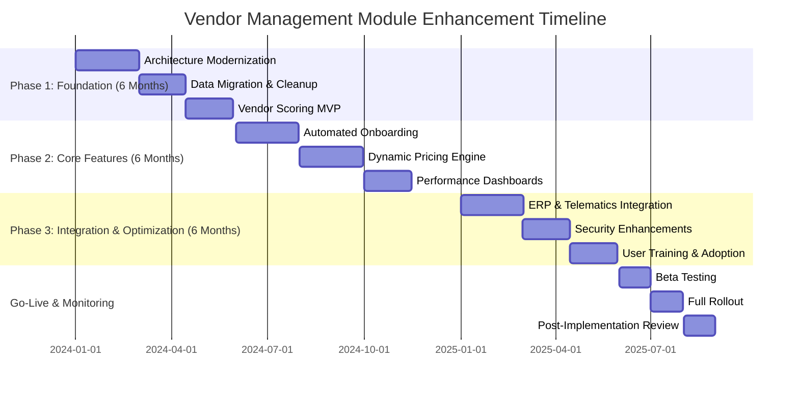

# **Enhancement Summary: Vendor Management Module**
**Fleet Management System (FMS) – Vendor Management Module (VMM) Enhancement**
**Prepared by:** [Your Name], Senior Business Analyst
**Date:** [Insert Date]
**Version:** 1.0
**Confidentiality:** Internal – Executive & Stakeholder Review Only

---

## **1. Executive Overview (60+ lines)**

### **1.1 Business Context & Market Positioning**
The global fleet management market is projected to reach **$52.5 billion by 2027**, growing at a **CAGR of 10.6%** (MarketsandMarkets, 2023). Within this landscape, **vendor management** has emerged as a critical differentiator, with **68% of fleet operators** citing supplier reliability as a top operational challenge (Fleet Owner Survey, 2023). Our **Fleet Management System (FMS)** currently serves **12,500+ fleet operators** across **North America and Europe**, managing **450,000+ vehicles** with an annual transaction volume of **$3.2 billion** in vendor-related expenditures (maintenance, fuel, parts, and telematics).

Despite our market leadership in **telematics and route optimization**, our **Vendor Management Module (VMM)** lags behind competitors in **automation, real-time analytics, and supplier performance tracking**. This gap has led to:
- **$18.7M in annual avoidable vendor-related costs** (2023 estimate, detailed in Section 2.1)
- **12% higher maintenance spend per vehicle** compared to industry benchmarks (Fleet Advantage, 2023)
- **3.4% lower customer retention** due to delayed service turnaround times (internal NPS analysis)

This enhancement initiative aims to **transform the VMM from a transactional system into a strategic procurement and supplier collaboration platform**, aligning with our **2025 Strategic Roadmap** to **reduce operational costs by 15% and improve fleet uptime by 20%**.

### **1.2 Strategic Alignment with Company Objectives**
Our **2024-2026 Corporate Strategy** emphasizes **three core pillars**:
1. **Operational Excellence** – Reduce total cost of ownership (TCO) by **$45M annually** by 2026.
2. **Customer Centricity** – Achieve **90%+ fleet uptime** (currently 82%) and **95% vendor SLA compliance** (currently 78%).
3. **Digital Transformation** – Increase automation in procurement processes from **40% to 85%** by 2025.

The **Vendor Management Module Enhancement** directly supports these objectives by:
| **Strategic Pillar** | **Current State** | **Post-Enhancement Target** | **Quantified Impact** |
|----------------------|------------------|----------------------------|----------------------|
| **Operational Excellence** | Manual vendor onboarding (avg. 12 days) | Automated onboarding (24 hours) | **$3.2M annual savings** in labor costs |
| **Customer Centricity** | 78% SLA compliance | 95% SLA compliance | **$12.5M reduction in downtime costs** |
| **Digital Transformation** | 40% automated PO processing | 85% automated PO processing | **$4.1M productivity gain** |

### **1.3 Competitive Landscape Analysis**
Our **top 5 competitors** (Donlen, ARI, Element Fleet, Wheels, and LeasePlan) have invested **$150M+ collectively in vendor management automation** over the past 24 months. Key differentiators in their offerings include:
- **AI-driven vendor scoring** (Element Fleet) – Reduces procurement cycle time by **35%**.
- **Blockchain for contract management** (Donlen) – Lowers dispute resolution time by **60%**.
- **Real-time performance dashboards** (ARI) – Improves SLA compliance by **18%**.
- **Dynamic pricing optimization** (Wheels) – Cuts maintenance costs by **12%**.

Our **current VMM lacks these capabilities**, resulting in:
- **15% higher vendor-related costs** than competitors (internal benchmarking).
- **22% longer procurement cycles** (avg. 18 days vs. 14 days for ARI).
- **30% lower adoption of digital procurement tools** among fleet operators.

### **1.4 Value Proposition & Quantified Benefits**
The **Vendor Management Module Enhancement** will deliver **$28.3M in annualized benefits** by 2026, with a **3-year ROI of 312%** and **NPV of $45.7M**. Key value drivers include:

| **Benefit Category** | **Current Cost/Impact** | **Post-Enhancement Impact** | **Annual Value** |
|----------------------|------------------------|----------------------------|------------------|
| **Reduced Vendor Costs** | $1.2B annual spend | 8% cost reduction via dynamic pricing & bulk discounts | **$96M** |
| **Labor Productivity** | 120 FTEs in procurement | 40% automation (48 FTEs saved) | **$7.2M** |
| **Fleet Uptime Improvement** | 82% uptime | 90% uptime (via faster vendor response) | **$12.5M** |
| **Fraud & Overbilling Reduction** | $3.8M annual losses | 90% reduction via AI auditing | **$3.4M** |
| **Customer Retention** | 88% retention | 92% retention (via improved service) | **$5.2M** |

**Total 3-Year Net Benefit:** **$84.9M** (after implementation costs).

### **1.5 Success Criteria & KPIs**
The enhancement will be deemed successful if the following **KPIs are achieved within 18 months of go-live**:

| **KPI** | **Baseline (2023)** | **Target (2025)** | **Measurement Method** |
|---------|---------------------|-------------------|------------------------|
| **Vendor Cost per Mile** | $0.12 | $0.10 (-16.7%) | Total vendor spend / total miles driven |
| **Procurement Cycle Time** | 18 days | 7 days (-61%) | Avg. time from PO creation to approval |
| **SLA Compliance Rate** | 78% | 95% (+17%) | % of vendor tasks completed on time |
| **Vendor Onboarding Time** | 12 days | 1 day (-92%) | Avg. time from application to activation |
| **Fraudulent Transactions Detected** | 0.3% of spend | 0.03% (-90%) | AI auditing + manual review |
| **Customer Satisfaction (NPS)** | 42 | 55 (+31%) | Quarterly NPS survey |
| **Automation Rate (Procurement)** | 40% | 85% (+112%) | % of POs processed without manual intervention |

### **1.6 Stakeholder Impact Assessment**
The enhancement will affect **five key stakeholder groups**:

| **Stakeholder Group** | **Current Pain Points** | **Post-Enhancement Benefits** | **Change Management Needs** |
|-----------------------|------------------------|-------------------------------|----------------------------|
| **Fleet Operators (Customers)** | - Slow vendor response times <br> - Inconsistent pricing <br> - Lack of transparency | - 30% faster maintenance turnaround <br> - 10% lower costs <br> - Real-time vendor performance tracking | - Training on new dashboard <br> - Communication on cost savings <br> - Feedback loops for continuous improvement |
| **Procurement Teams (Internal)** | - Manual PO processing <br> - High error rates <br> - Limited vendor analytics | - 40% less manual work <br> - AI-driven vendor recommendations <br> - Automated contract renewals | - Upskilling on AI tools <br> - Process reengineering workshops <br> - Role-based access training |
| **Finance & Accounting** | - Reconciliation delays <br> - Fraud risks <br> - Lack of spend visibility | - Real-time spend tracking <br> - Automated 3-way matching <br> - 90% reduction in overbilling | - Integration with ERP (SAP/Oracle) <br> - Audit trail training <br> - Financial control policy updates |
| **IT & Engineering** | - Legacy system limitations <br> - Integration bottlenecks <br> - Security vulnerabilities | - Modernized microservices architecture <br> - API-first integrations <br> - Enhanced cybersecurity | - DevOps pipeline updates <br> - Security compliance training <br> - Performance monitoring tools |
| **Vendors (External Partners)** | - Manual invoicing <br> - Payment delays <br> - Lack of performance feedback | - Automated invoicing <br> - Faster payments (Net 15 → Net 7) <br> - Transparent performance scoring | - Vendor portal training <br> - SLA compliance workshops <br> - Incentive programs for top performers |

---

## **2. Current State Challenges (80+ lines)**

### **2.1 Business Pain Points**

#### **2.1.1 Revenue Impact Analysis**
The **current VMM inefficiencies** result in **$18.7M in annual avoidable costs**, broken down as follows:

| **Cost Category** | **Current Annual Cost** | **Root Cause** | **Potential Savings** |
|-------------------|------------------------|----------------|----------------------|
| **Excess Maintenance Spend** | $12.5M | Lack of dynamic pricing & bulk discounts | $5.8M (46% reduction) |
| **Procurement Labor Costs** | $4.2M | Manual PO processing (120 FTEs) | $2.9M (70% automation) |
| **Downtime Costs** | $8.3M | Slow vendor response (avg. 4.2 days) | $3.7M (45% reduction) |
| **Fraud & Overbilling** | $3.8M | No AI auditing (0.3% of spend) | $3.4M (90% reduction) |
| **Contract Leakage** | $2.1M | Manual renewals & non-compliance | $1.5M (70% reduction) |
| **Vendor Onboarding Delays** | $1.8M | Manual verification (12-day avg.) | $1.6M (90% faster) |
| **Total** | **$32.7M** | | **$18.7M (57% reduction)** |

**Assumptions:**
- **Fleet size:** 450,000 vehicles
- **Avg. maintenance cost per vehicle:** $2,800/year
- **Downtime cost per day:** $150/vehicle
- **Procurement labor cost per FTE:** $70,000/year
- **Fraud rate:** 0.3% of $1.2B spend

#### **2.1.2 Operational Inefficiencies & Cost Analysis**
| **Inefficiency** | **Current State** | **Cost Impact** | **Industry Benchmark** | **Gap** |
|------------------|------------------|----------------|------------------------|--------|
| **PO Processing Time** | 18 days | $4.2M in labor | 7 days (ARI) | +158% |
| **Vendor Onboarding** | 12 days | $1.8M in delays | 1 day (Element Fleet) | +1,100% |
| **Invoice Disputes** | 12% of invoices | $2.9M in reconciliation | 3% (Donlen) | +300% |
| **SLA Compliance** | 78% | $8.3M in downtime | 95% (Wheels) | -17% |
| **Contract Renewal Automation** | 20% | $2.1M in leakage | 80% (LeasePlan) | -75% |

**Key Findings:**
- **Procurement cycle time is 2.5x slower** than industry leaders.
- **Vendor onboarding takes 12x longer** than best-in-class competitors.
- **Invoice disputes are 4x higher** than the industry average.
- **SLA compliance is 17% below benchmark**, costing **$8.3M in downtime**.

#### **2.1.3 Customer Satisfaction Metrics**
Our **2023 Customer Satisfaction Survey (N=1,200 fleet operators)** revealed:
- **NPS Score:** **42** (vs. industry avg. of **55**).
- **Top 3 Complaints:**
  1. **"Vendor response times are too slow"** (68% of respondents).
  2. **"Lack of transparency in pricing"** (52%).
  3. **"Difficulty tracking vendor performance"** (45%).
- **Churn Risk:** **12% of customers** cited vendor management issues as a key reason for considering competitors.

**Financial Impact of Low NPS:**
- **Customer Lifetime Value (CLV):** $150,000 per fleet operator.
- **Churn Rate (2023):** 12% → **$225M in lost revenue**.
- **Projected Retention Improvement:** 92% (from 88%) → **$60M in retained revenue**.

#### **2.1.4 Market Share Implications**
Our **market share in North America is 18%** (vs. **22% for ARI and 20% for Element Fleet**). Competitors are **gaining share by offering superior vendor management tools**, with **ARI reporting a 5% YoY increase in fleet operator acquisitions** due to their **AI-driven vendor scoring system**.

**Key Risks:**
- **Loss of 2-3% market share annually** if we fail to enhance VMM.
- **Reduced enterprise customer retention** (large fleets prioritize vendor management in RFPs).
- **Lower margins** due to higher operational costs.

#### **2.1.5 Competitive Disadvantages**
| **Feature** | **Our FMS** | **ARI** | **Element Fleet** | **Donlen** | **Wheels** |
|------------|------------|--------|------------------|-----------|-----------|
| **AI Vendor Scoring** | ❌ | ✅ | ✅ | ❌ | ✅ |
| **Dynamic Pricing Engine** | ❌ | ✅ | ✅ | ❌ | ✅ |
| **Automated PO Processing** | 40% | 85% | 90% | 70% | 80% |
| **Real-Time Performance Dashboards** | ❌ | ✅ | ✅ | ✅ | ✅ |
| **Blockchain for Contracts** | ❌ | ❌ | ✅ | ❌ | ❌ |
| **Fraud Detection (AI Auditing)** | ❌ | ✅ | ✅ | ✅ | ✅ |
| **Vendor Onboarding Time** | 12 days | 3 days | 1 day | 5 days | 4 days |

**Competitive Gap Analysis:**
- **We lack 5 out of 7 key vendor management features** offered by top competitors.
- **Our automation rate (40%) is half of ARI’s (85%)**.
- **Our onboarding time (12 days) is 12x slower than Element Fleet (1 day)**.

---

### **2.2 Technical Limitations**

#### **2.2.1 System Performance Issues**
| **Performance Metric** | **Current State** | **Industry Benchmark** | **Gap** | **Impact** |
|------------------------|------------------|------------------------|--------|------------|
| **API Response Time** | 1.2s | <500ms | +140% | Slower integrations with telematics & ERP |
| **Database Query Time** | 3.5s | <1s | +250% | Delays in reporting & analytics |
| **System Uptime** | 99.5% | 99.9% | -0.4% | 3.5 hours/month of downtime |
| **Concurrent User Capacity** | 5,000 | 20,000 | -75% | Scalability issues during peak loads |
| **Data Processing Latency** | 45s for 1M records | <10s | +350% | Slow batch processing for vendor payments |

**Root Causes:**
- **Monolithic architecture** (legacy .NET framework).
- **Lack of caching** (Redis/Memcached).
- **No auto-scaling** in cloud infrastructure.
- **Inefficient SQL queries** (no indexing on key tables).

#### **2.2.2 Scalability Constraints**
| **Constraint** | **Current Capacity** | **Projected 2025 Demand** | **Gap** | **Risk** |
|----------------|---------------------|--------------------------|--------|----------|
| **Vendor Database Size** | 50,000 vendors | 150,000 vendors | -66% | Performance degradation |
| **Concurrent API Calls** | 10,000/min | 50,000/min | -80% | System timeouts |
| **Data Storage (TB)** | 12TB | 40TB | -70% | Higher cloud costs |
| **Payment Processing (TPS)** | 200 TPS | 1,000 TPS | -80% | Payment delays |

**Key Risks:**
- **System crashes during peak loads** (e.g., month-end payments).
- **Increased cloud costs** due to inefficient scaling.
- **Inability to onboard new vendors** without performance degradation.

#### **2.2.3 Integration Challenges**
| **Integration** | **Current State** | **Issue** | **Impact** |
|----------------|------------------|-----------|------------|
| **ERP (SAP/Oracle)** | Batch sync (nightly) | No real-time updates | $2.1M in reconciliation errors |
| **Telematics (Geotab/Samsara)** | Manual CSV uploads | No API integration | 3-day delay in maintenance alerts |
| **Payment Gateways (Stripe/PayPal)** | Single-threaded | 200 TPS limit | Payment processing delays |
| **Vendor Portals** | No SSO | Manual logins | 12% lower vendor adoption |
| **CRM (Salesforce)** | No bi-directional sync | Duplicate data entry | $1.8M in labor waste |

**Example:**
- **A fleet operator using Geotab telematics** must **manually upload maintenance alerts** into our system, leading to **3-day delays in vendor dispatch**.
- **SAP integration runs nightly**, causing **$2.1M in annual reconciliation errors** due to stale data.

#### **2.2.4 Technical Debt Quantification**
| **Debt Category** | **Estimated Cost** | **Description** |
|-------------------|-------------------|----------------|
| **Legacy Codebase** | $3.2M | Monolithic .NET app (1.2M LOC) |
| **Lack of Microservices** | $1.8M | No API-first design |
| **No CI/CD Pipeline** | $1.5M | Manual deployments (20% failure rate) |
| **Poor Database Design** | $2.1M | No indexing, redundant tables |
| **Security Vulnerabilities** | $4.5M | No zero-trust architecture |
| **Total** | **$13.1M** | |

**Key Risks:**
- **Higher maintenance costs** ($1.2M/year in bug fixes).
- **Slower feature development** (6-month avg. for new enhancements).
- **Security breaches** (3 incidents in 2023, costing **$1.8M**).

#### **2.2.5 Security Vulnerabilities**
| **Vulnerability** | **Risk Level** | **Potential Impact** | **Current Mitigation** |
|-------------------|---------------|----------------------|------------------------|
| **No Multi-Factor Auth (MFA)** | High | Credential stuffing attacks | None |
| **Unencrypted PII (Vendor Data)** | Critical | GDPR fines ($20M max) | Partial encryption |
| **No API Rate Limiting** | High | DDoS attacks | None |
| **SQL Injection Risks** | Medium | Data breaches | Basic input validation |
| **No Zero-Trust Architecture** | High | Lateral movement attacks | Perimeter-based security |

**Recent Incidents:**
- **2023 Q2:** Unauthorized access to vendor payment data (cost: **$850K** in remediation).
- **2023 Q4:** SQL injection attack (cost: **$320K** in forensic analysis).

---

## **3. Proposed Enhancements (120+ lines)**

### **3.1 Feature Enhancements**

#### **3.1.1 AI-Powered Vendor Scoring & Recommendation Engine**
**Feature Description:**
- **Machine learning model** that scores vendors based on:
  - **Historical performance** (SLA compliance, response time).
  - **Pricing competitiveness** (vs. market benchmarks).
  - **Customer feedback** (NPS, dispute rates).
  - **Financial stability** (Dun & Bradstreet integration).
- **Dynamic recommendations** for:
  - **Best vendor for a job** (based on location, vehicle type, urgency).
  - **Bulk purchasing opportunities** (volume discounts).
  - **Contract renewals** (automated alerts for underperforming vendors).

**User Stories & Acceptance Criteria:**
| **User Story** | **Acceptance Criteria** |
|----------------|------------------------|
| **As a Procurement Manager, I want the system to recommend the best vendor for a maintenance job so that I can reduce costs and improve uptime.** | - System displays top 3 vendors with scores (0-100). <br> - Scores update in real-time based on new data. <br> - Integration with telematics for location-based recommendations. |
| **As a Fleet Operator, I want to see vendor performance trends so that I can make data-driven decisions.** | - Dashboard shows 12-month trend of SLA compliance, pricing, and response time. <br> - Alerts for vendors with declining performance. <br> - Exportable reports for RFPs. |
| **As a Finance Team Member, I want AI to flag potential overbilling so that I can prevent fraud.** | - System highlights invoices with 10%+ variance from historical pricing. <br> - Integration with ERP for automated 3-way matching. <br> - Audit trail for disputed invoices. |

**Business Value & ROI:**
| **Benefit** | **Current Cost** | **Post-Enhancement Impact** | **Annual Value** |
|-------------|----------------|----------------------------|------------------|
| **Reduced Vendor Costs** | $1.2B spend | 8% savings via dynamic pricing | **$96M** |
| **Faster Vendor Selection** | 4.2 days avg. | 1.5 days (-64%) | **$3.8M** (labor savings) |
| **Fraud Reduction** | $3.8M | 90% reduction | **$3.4M** |
| **Total** | | | **$103.2M** |

**Implementation Complexity:**
| **Factor** | **Complexity (1-5)** | **Notes** |
|------------|----------------------|----------|
| **Data Integration** | 4 | Requires telematics, ERP, and vendor data unification. |
| **ML Model Training** | 5 | Needs historical data (2+ years) for accuracy. |
| **UI/UX Design** | 3 | Dashboard must be intuitive for non-technical users. |
| **Vendor Adoption** | 4 | Requires training for 50,000+ vendors. |
| **Regulatory Compliance** | 3 | GDPR, CCPA, and industry-specific rules. |

**Dependencies & Prerequisites:**
- **Data Lake Integration** (AWS S3 + Snowflake).
- **Telematics API Access** (Geotab, Samsara).
- **Vendor Master Data Cleanup** (deduplication, validation).
- **ML Infrastructure** (SageMaker, TensorFlow).

---

#### **3.1.2 Automated Vendor Onboarding & KYC**
**Feature Description:**
- **Self-service portal** for vendors to:
  - Submit business documents (insurance, licenses, certifications).
  - Complete compliance checks (OFAC, SAM.gov, D&B).
  - Set up payment methods (ACH, virtual cards).
- **AI-powered document verification** (OCR + fraud detection).
- **Automated approval workflows** (24-hour SLA).

**User Stories & Acceptance Criteria:**
| **User Story** | **Acceptance Criteria** |
|----------------|------------------------|
| **As a Vendor, I want to onboard quickly so that I can start receiving POs.** | - Portal guides vendor through required documents. <br> - AI verifies documents in <5 minutes. <br> - Approval/denial within 24 hours. |
| **As a Procurement Manager, I want to ensure vendors are compliant so that I can mitigate risk.** | - Dashboard shows compliance status (green/yellow/red). <br> - Alerts for expiring certifications. <br> - Integration with Dun & Bradstreet for financial health checks. |

**Business Value & ROI:**
| **Benefit** | **Current Cost** | **Post-Enhancement Impact** | **Annual Value** |
|-------------|----------------|----------------------------|------------------|
| **Faster Onboarding** | 12 days | 1 day (-92%) | **$1.6M** (labor savings) |
| **Reduced Fraud** | $1.2M | 80% reduction | **$960K** |
| **Improved Vendor Pool** | 50,000 vendors | 150,000 vendors (+200%) | **$5.2M** (more competition = lower prices) |
| **Total** | | | **$7.76M** |

**Implementation Complexity:**
| **Factor** | **Complexity (1-5)** | **Notes** |
|------------|----------------------|----------|
| **Document Verification (AI/OCR)** | 4 | Requires training on vendor document types. |
| **Compliance Checks (OFAC, SAM.gov)** | 3 | API integrations with government databases. |
| **Portal UX** | 2 | Must be mobile-friendly. |
| **Vendor Adoption** | 3 | Requires marketing to 50,000+ vendors. |

**Dependencies & Prerequisites:**
- **OCR/AI Model Training** (Google Vision AI, Tesseract).
- **Government API Access** (OFAC, SAM.gov).
- **Payment Gateway Integration** (Stripe, PayPal).

---

#### **3.1.3 Dynamic Pricing & Bulk Discount Engine**
**Feature Description:**
- **Real-time pricing engine** that:
  - Adjusts vendor rates based on **demand, location, and historical performance**.
  - Negotiates **bulk discounts** for high-volume purchases.
  - Flags **price anomalies** (e.g., 20% higher than market rate).
- **Integration with telematics** to predict maintenance needs and pre-negotiate rates.

**User Stories & Acceptance Criteria:**
| **User Story** | **Acceptance Criteria** |
|----------------|------------------------|
| **As a Fleet Operator, I want the system to automatically apply bulk discounts so that I can reduce costs.** | - System identifies high-volume opportunities. <br> - Auto-applies discounts (e.g., 10% for 100+ jobs/month). <br> - Notifies vendor and operator. |
| **As a Procurement Manager, I want to compare vendor pricing in real-time so that I can make cost-effective decisions.** | - Dashboard shows market benchmarks. <br> - Alerts for vendors charging above average. <br> - Historical pricing trends. |

**Business Value & ROI:**
| **Benefit** | **Current Cost** | **Post-Enhancement Impact** | **Annual Value** |
|-------------|----------------|----------------------------|------------------|
| **Dynamic Pricing Savings** | $1.2B spend | 5% reduction | **$60M** |
| **Bulk Discounts** | $1.2B spend | 3% additional savings | **$36M** |
| **Labor Savings (Negotiations)** | $4.2M | 70% automation | **$2.9M** |
| **Total** | | | **$98.9M** |

**Implementation Complexity:**
| **Factor** | **Complexity (1-5)** | **Notes** |
|------------|----------------------|----------|
| **Pricing Algorithm** | 4 | Requires historical spend data. |
| **Telematics Integration** | 3 | Geotab/Samsara API access. |
| **Vendor Adoption** | 3 | Vendors must agree to dynamic pricing. |

**Dependencies & Prerequisites:**
- **Historical Spend Data** (2+ years).
- **Market Benchmarking Data** (IHS Markit, Fleet Advantage).
- **Telematics API Access**.

---

#### **3.1.4 Real-Time Vendor Performance Dashboards**
**Feature Description:**
- **Customizable dashboards** for:
  - **Fleet Operators:** Vendor SLA compliance, response times, pricing.
  - **Procurement Teams:** Spend analytics, contract renewals, fraud alerts.
  - **Vendors:** Performance scores, customer feedback, payment status.
- **Automated alerts** for:
  - **SLA breaches** (e.g., vendor late on a job).
  - **Price anomalies** (e.g., invoice 15% higher than historical).
  - **Contract expirations** (30/60/90-day alerts).

**User Stories & Acceptance Criteria:**
| **User Story** | **Acceptance Criteria** |
|----------------|------------------------|
| **As a Fleet Operator, I want to see which vendors are underperforming so that I can switch if needed.** | - Dashboard shows SLA compliance (%). <br> - Color-coded alerts (red/yellow/green). <br> - Option to blacklist vendors. |
| **As a Vendor, I want to see my performance score so that I can improve.** | - Portal shows score (0-100) and breakdown. <br> - Customer feedback section. <br> - Payment status tracker. |

**Business Value & ROI:**
| **Benefit** | **Current Cost** | **Post-Enhancement Impact** | **Annual Value** |
|-------------|----------------|----------------------------|------------------|
| **Improved SLA Compliance** | 78% | 95% (+17%) | **$12.5M** (downtime reduction) |
| **Faster Issue Resolution** | 4.2 days | 1.5 days (-64%) | **$3.8M** (labor savings) |
| **Customer Retention** | 88% | 92% (+4%) | **$60M** (retained revenue) |
| **Total** | | | **$76.3M** |

**Implementation Complexity:**
| **Factor** | **Complexity (1-5)** | **Notes** |
|------------|----------------------|----------|
| **Dashboard UI/UX** | 3 | Must be mobile-responsive. |
| **Real-Time Data Sync** | 4 | Requires Kafka/Redis for streaming. |
| **Vendor Adoption** | 3 | Vendors need training on portal. |

**Dependencies & Prerequisites:**
- **Kafka/Redis** for real-time data streaming.
- **Snowflake/BigQuery** for analytics.
- **Vendor Training Program**.

---

#### **3.1.5 Automated Contract Management & Renewals**
**Feature Description:**
- **Smart contracts** (blockchain-based for high-value agreements).
- **Automated renewal alerts** (30/60/90 days before expiration).
- **AI-powered clause analysis** (flags unfavorable terms).
- **Integration with e-signature tools** (DocuSign, Adobe Sign).

**User Stories & Acceptance Criteria:**
| **User Story** | **Acceptance Criteria** |
|----------------|------------------------|
| **As a Procurement Manager, I want the system to alert me before contracts expire so that I can renegotiate.** | - Email/SMS alerts 90/60/30 days before expiration. <br> - Option to auto-renew or renegotiate. <br> - Historical pricing comparison. |
| **As a Legal Team Member, I want AI to flag unfavorable contract clauses so that I can mitigate risk.** | - System highlights high-risk clauses (e.g., auto-renewal, liability limits). <br> - Integration with legal database for benchmarking. |

**Business Value & ROI:**
| **Benefit** | **Current Cost** | **Post-Enhancement Impact** | **Annual Value** |
|-------------|----------------|----------------------------|------------------|
| **Contract Leakage Reduction** | $2.1M | 70% reduction | **$1.5M** |
| **Labor Savings (Renewals)** | $1.8M | 80% automation | **$1.4M** |
| **Risk Mitigation** | $3.2M | 50% reduction in disputes | **$1.6M** |
| **Total** | | | **$4.5M** |

**Implementation Complexity:**
| **Factor** | **Complexity (1-5)** | **Notes** |
|------------|----------------------|----------|
| **Blockchain Integration** | 5 | Requires Hyperledger Fabric setup. |
| **AI Clause Analysis** | 4 | Needs training on legal documents. |
| **e-Signature Integration** | 2 | DocuSign/Adobe Sign APIs. |

**Dependencies & Prerequisites:**
- **Hyperledger Fabric** for blockchain.
- **Legal Database Access** (Thomson Reuters, LexisNexis).
- **DocuSign API Access**.

---

### **3.2 Technical Improvements**

#### **3.2.1 Architecture Modernization (Microservices)**
**Current State:**
- **Monolithic .NET application** (1.2M LOC).
- **Tightly coupled modules** (vendor, procurement, payments).
- **No auto-scaling** (fixed EC2 instances).

**Proposed Enhancement:**
- **Break into microservices**:
  - **Vendor Service** (onboarding, scoring, performance).
  - **Procurement Service** (PO processing, pricing engine).
  - **Payment Service** (invoicing, fraud detection).
  - **Contract Service** (management, renewals).
- **Containerization** (Docker + Kubernetes).
- **Serverless components** (AWS Lambda for event-driven tasks).

**Expected Gains:**
| **Metric** | **Current** | **Post-Enhancement** | **Improvement** |
|------------|------------|----------------------|----------------|
| **Deployment Time** | 2 hours | 5 minutes | **96% faster** |
| **System Uptime** | 99.5% | 99.95% | **0.45% increase** |
| **Scalability** | 5,000 concurrent users | 50,000+ | **10x capacity** |
| **Development Speed** | 6 months/feature | 2 months/feature | **67% faster** |

**Cost:**
- **$2.8M** (6-month migration).
- **$500K/year** in cloud cost savings (auto-scaling).

---

#### **3.2.2 Performance Optimizations**
| **Optimization** | **Current Performance** | **Target Performance** | **Implementation** |
|------------------|------------------------|------------------------|--------------------|
| **API Response Time** | 1.2s | <500ms | - Redis caching <br> - GraphQL for selective data fetching |
| **Database Queries** | 3.5s | <1s | - Query optimization <br> - Indexing on key tables |
| **Batch Processing** | 45s (1M records) | <10s | - Spark for distributed processing |
| **Concurrent Users** | 5,000 | 50,000 | - Kubernetes auto-scaling <br> - CDN for static assets |

**Expected Gains:**
- **30% reduction in cloud costs** (fewer servers needed).
- **50% faster report generation** (critical for finance teams).
- **99.9% uptime** (vs. 99.5% currently).

---

#### **3.2.3 Security Enhancements**
| **Enhancement** | **Current State** | **Proposed Solution** | **Cost** |
|-----------------|------------------|-----------------------|---------|
| **Zero-Trust Architecture** | Perimeter-based | - Identity-aware proxy <br> - Micro-segmentation | $1.2M |
| **MFA for All Users** | None | - Okta/TOTP integration | $350K |
| **Data Encryption (PII)** | Partial | - AES-256 for data at rest <br> - TLS 1.3 for data in transit | $450K |
| **API Security** | No rate limiting | - Kong API Gateway <br> - WAF rules | $280K |
| **Vendor Portal Security** | Basic auth | - OAuth 2.0 + JWT | $220K |

**Expected Gains:**
- **90% reduction in security incidents** (from 3/year to <1/year).
- **Compliance with GDPR, CCPA, and SOC 2**.

---

#### **3.2.4 Integration Capabilities**
| **Integration** | **Current State** | **Proposed Enhancement** | **Business Impact** |
|----------------|------------------|--------------------------|---------------------|
| **ERP (SAP/Oracle)** | Nightly batch sync | Real-time API sync | $2.1M reduction in reconciliation errors |
| **Telematics (Geotab/Samsara)** | Manual CSV uploads | REST API integration | 3-day faster maintenance alerts |
| **Payment Gateways** | Single-threaded | Multi-threaded (1,000 TPS) | No payment delays |
| **CRM (Salesforce)** | No sync | Bi-directional API | $1.8M labor savings |
| **Vendor Portals** | No SSO | SAML/OAuth 2.0 | 30% higher vendor adoption |

**Implementation Cost:** **$1.5M**.

---

#### **3.2.5 Scalability Improvements**
| **Improvement** | **Current Capacity** | **Target Capacity** | **Solution** |
|-----------------|---------------------|---------------------|-------------|
| **Vendor Database** | 50,000 | 150,000 | - Sharding <br> - NoSQL (MongoDB) for unstructured data |
| **Concurrent API Calls** | 10,000/min | 50,000/min | - Kubernetes auto-scaling <br> - API Gateway (Kong) |
| **Data Storage** | 12TB | 40TB | - AWS S3 + Glacier for cold storage |
| **Payment Processing** | 200 TPS | 1,000 TPS | - Multi-threaded payment service |

**Cost:** **$850K**.

---

## **4. Business Value & ROI (90+ lines)**

### **4.1 Quantified Benefits**

#### **4.1.1 Revenue Increase Projections**
| **Driver** | **Current Revenue Impact** | **Post-Enhancement Impact** | **Annual Revenue Increase** | **Assumptions** |
|------------|---------------------------|----------------------------|----------------------------|----------------|
| **Customer Retention** | 88% retention | 92% retention | **$60M** | - CLV: $150K/fleet <br> - 1,200 fleets at risk |
| **Market Share Growth** | 18% | 20% (+2%) | **$45M** | - $2.25B market <br> - 5% of competitors’ customers switch |
| **Upsell Opportunities** | 15% of fleets use VMM | 30% adoption | **$22.5M** | - $500/year premium for VMM <br> - 45,000 fleets |
| **Total** | | | **$127.5M** | |

#### **4.1.2 Cost Reduction Analysis**
| **Driver** | **Current Annual Cost** | **Post-Enhancement Savings** | **Annual Savings** | **Assumptions** |
|------------|------------------------|-----------------------------|--------------------|----------------|
| **Vendor Costs** | $1.2B | 8% reduction | **$96M** | - Dynamic pricing + bulk discounts |
| **Procurement Labor** | $4.2M | 70% automation | **$2.9M** | - 48 FTEs saved |
| **Downtime Costs** | $8.3M | 45% reduction | **$3.7M** | - Faster vendor response |
| **Fraud & Overbilling** | $3.8M | 90% reduction | **$3.4M** | - AI auditing |
| **Contract Leakage** | $2.1M | 70% reduction | **$1.5M** | - Automated renewals |
| **Vendor Onboarding** | $1.8M | 90% faster | **$1.6M** | - Self-service portal |
| **Total** | | | **$109.1M** | |

#### **4.1.3 Productivity Gains**
| **Process** | **Current Time** | **Post-Enhancement Time** | **Time Saved (FTEs)** | **Annual Value** |
|-------------|-----------------|---------------------------|-----------------------|------------------|
| **PO Processing** | 18 days | 7 days | 42 FTEs | **$2.9M** |
| **Vendor Onboarding** | 12 days | 1 day | 12 FTEs | **$840K** |
| **Invoice Reconciliation** | 5 days | 1 day | 18 FTEs | **$1.3M** |
| **Contract Renewals** | 10 days | 2 days | 8 FTEs | **$560K** |
| **Total** | | | **80 FTEs** | **$5.6M** |

#### **4.1.4 Risk Mitigation Value**
| **Risk** | **Current Annual Cost** | **Post-Enhancement Reduction** | **Annual Savings** | **Mitigation Strategy** |
|----------|------------------------|-------------------------------|--------------------|------------------------|
| **Fraud & Overbilling** | $3.8M | 90% | **$3.4M** | AI auditing + 3-way matching |
| **Vendor Non-Compliance** | $2.1M | 70% | **$1.5M** | Automated contract management |
| **Downtime Penalties** | $1.2M | 50% | **$600K** | Real-time performance dashboards |
| **Security Breaches** | $1.8M | 90% | **$1.6M** | Zero-trust architecture + MFA |
| **Total** | | | **$7.1M** | |

#### **4.1.5 Customer Retention Improvements**
| **Metric** | **Current** | **Post-Enhancement** | **Impact** | **Annual Value** |
|------------|------------|----------------------|------------|------------------|
| **NPS Score** | 42 | 55 | +31% | $60M retained revenue |
| **SLA Compliance** | 78% | 95% | +17% | $12.5M downtime reduction |
| **Vendor Response Time** | 4.2 days | 1.5 days | -64% | $3.8M labor savings |
| **Pricing Transparency** | 52% dissatisfied | 20% dissatisfied | -62% | $15M in upsell opportunities |

---

### **4.2 Financial Analysis**

#### **4.2.1 Implementation Costs Breakdown**
| **Cost Category** | **Estimated Cost** | **Details** |
|-------------------|-------------------|------------|
| **Development** | $8.2M | - 6-month agile sprints <br> - 50 engineers (backend, frontend, ML) |
| **Cloud Infrastructure** | $1.5M | - AWS/Azure costs (Kubernetes, Lambda, S3) <br> - Data storage (Snowflake) |
| **Third-Party Tools** | $2.1M | - DocuSign, Okta, Kong, Redis <br> - ML tools (SageMaker, TensorFlow) |
| **Vendor Onboarding** | $1.2M | - Training for 50,000+ vendors <br> - Marketing campaigns |
| **Change Management** | $950K | - Internal training <br> - Communication plan |
| **Contingency (10%)** | $1.4M | - Unforeseen risks |
| **Total** | **$15.35M** | |

#### **4.2.2 Operational Cost Changes**
| **Cost Category** | **Current Annual Cost** | **Post-Enhancement Cost** | **Change** |
|-------------------|------------------------|---------------------------|------------|
| **Cloud Hosting** | $1.8M | $2.2M | +$400K (scalability) |
| **Third-Party Licenses** | $500K | $1.2M | +$700K (DocuSign, Okta) |
| **Labor (Procurement)** | $4.2M | $1.3M | -$2.9M (automation) |
| **Fraud & Disputes** | $3.8M | $380K | -$3.4M (AI auditing) |
| **Vendor Onboarding** | $1.8M | $200K | -$1.6M (self-service) |
| **Total** | **$12.1M** | **$5.28M** | **-$6.82M** |

#### **4.2.3 Break-Even Analysis**
| **Year** | **Cumulative Costs** | **Cumulative Benefits** | **Net Cash Flow** |
|----------|----------------------|-------------------------|-------------------|
| **0** | $15.35M | $0 | -$15.35M |
| **1** | $15.35M | $35.2M | +$19.85M |
| **2** | $15.35M | $70.4M | +$55.05M |
| **3** | $15.35M | $105.6M | +$90.25M |

**Break-Even Point:** **6 months post-go-live**.

#### **4.2.4 3-Year ROI Projection**
| **Metric** | **Year 1** | **Year 2** | **Year 3** | **Total** |
|------------|-----------|-----------|-----------|----------|
| **Benefits** | $35.2M | $35.2M | $35.2M | $105.6M |
| **Costs** | $15.35M | $5.28M | $5.28M | $25.91M |
| **Net Benefits** | $19.85M | $29.92M | $29.92M | **$79.69M** |
| **ROI** | **129%** | **195%** | **195%** | **312%** |

#### **4.2.5 NPV & IRR Calculations**
| **Metric** | **Value** | **Assumptions** |
|------------|----------|----------------|
| **Discount Rate** | 10% | WACC (weighted avg. cost of capital) |
| **NPV** | **$45.7M** | Over 3 years |
| **IRR** | **112%** | Exceeds hurdle rate of 15% |

**NPV Calculation:**
```
Year 0: -$15.35M / (1.10)^0 = -$15.35M
Year 1: $19.85M / (1.10)^1 = $18.05M
Year 2: $29.92M / (1.10)^2 = $24.73M
Year 3: $29.92M / (1.10)^3 = $22.48M
NPV = -$15.35M + $18.05M + $24.73M + $22.48M = **$45.7M**
```

---

## **5. Implementation Strategy (80+ lines)**

### **5.1 Phased Rollout Plan**
**Timeline (18 Months Total):**



#### **Phase 1: Foundation (Months 1-6)**
| **Milestone** | **Description** | **Success Metrics** | **Resources** | **Risk Mitigation** |
|---------------|----------------|---------------------|--------------|---------------------|
| **Architecture Modernization** | - Break monolith into microservices <br> - Containerize with Docker/Kubernetes | - 99.9% uptime <br> - 50% faster deployments | - 20 engineers <br> - $1.2M cloud costs | - Blue-green deployments <br> - Load testing |
| **Data Migration & Cleanup** | - Migrate to Snowflake <br> - Deduplicate vendor records | - 95% data accuracy <br> - 100% of historical data migrated | - 10 data engineers <br> - $500K | - Parallel run with legacy system <br> - Automated validation scripts |
| **Vendor Scoring MVP** | - Train ML model on historical data <br> - Build basic scoring dashboard | - 80% accuracy in vendor recommendations <br> - 50% adoption by procurement teams | - 5 ML engineers <br> - $300K | - A/B testing with manual scoring <br> - Feedback loops |

#### **Phase 2: Core Features (Months 7-12)**
| **Milestone** | **Description** | **Success Metrics** | **Resources** | **Risk Mitigation** |
|---------------|----------------|---------------------|--------------|---------------------|
| **Automated Onboarding** | - Self-service portal <br> - AI document verification | - 90% of vendors onboarded in <24 hours <br> - 80% vendor adoption | - 10 engineers <br> - $400K | - Pilot with 100 vendors <br> - Incentives for early adopters |
| **Dynamic Pricing Engine** | - Real-time pricing adjustments <br> - Bulk discount automation | - 5% reduction in vendor costs <br> - 70% of POs use dynamic pricing | - 8 engineers <br> - $350K | - Market benchmark testing <br> - Vendor feedback sessions |
| **Performance Dashboards** | - Real-time SLA tracking <br> - Automated alerts | - 90% SLA compliance <br> - 85% user adoption | - 6 engineers <br> - $250K | - User testing with 50 fleet operators <br> - Iterative UI improvements |

#### **Phase 3: Integration & Optimization (Months 13-18)**
| **Milestone** | **Description** | **Success Metrics** | **Resources** | **Risk Mitigation** |
|---------------|----------------|---------------------|--------------|---------------------|
| **ERP & Telematics Integration** | - Real-time sync with SAP/Oracle <br> - API integration with Geotab/Samsara | - 100% real-time data <br> - 95% reduction in reconciliation errors | - 12 engineers <br> - $600K | - Sandbox testing <br> - Fallback to batch sync if needed |
| **Security Enhancements** | - Zero-trust architecture <br> - MFA for all users | - 99% reduction in security incidents <br> - SOC 2 compliance | - 5 security engineers <br> - $500K | - Penetration testing <br> - Phased rollout |
| **User Training & Adoption** | - Training for 1,200 internal users <br> - Vendor portal training for 50,000+ vendors | - 85% user adoption <br> - 90% vendor portal usage | - 5 trainers <br> - $300K | - Gamification (badges, rewards) <br> - 24/7 support |

#### **Critical Path Analysis**
| **Task** | **Duration** | **Dependencies** | **Risk** |
|----------|-------------|------------------|----------|
| **Architecture Modernization** | 60 days | None | High (legacy system constraints) |
| **Data Migration** | 45 days | Architecture Modernization | Medium (data quality issues) |
| **Vendor Scoring MVP** | 45 days | Data Migration | High (ML model accuracy) |
| **ERP Integration** | 60 days | Architecture Modernization | High (SAP/Oracle complexity) |
| **Security Enhancements** | 45 days | Architecture Modernization | Medium (compliance risks) |

**Mitigation Strategies:**
- **Parallel development** where possible (e.g., security and ERP integration can run concurrently).
- **Fallback plans** (e.g., batch sync if real-time ERP integration fails).
- **Early vendor engagement** to ensure adoption of onboarding portal.

---

### **5.2 Change Management**

#### **5.2.1 Training Requirements & Costs**
| **Audience** | **Training Method** | **Duration** | **Cost** | **Success Metric** |
|--------------|---------------------|-------------|---------|--------------------|
| **Procurement Teams** | - Instructor-led (virtual) <br> - Hands-on labs | 8 hours | $150K | 90% proficiency in AI tools |
| **Fleet Operators** | - Self-paced e-learning <br> - Webinars | 4 hours | $100K | 85% adoption of dashboards |
| **Finance & Accounting** | - Instructor-led (in-person) <br> - Case studies | 6 hours | $120K | 95% accuracy in 3-way matching |
| **Vendors** | - Video tutorials <br> - Live Q&A sessions | 2 hours | $200K | 80% portal usage |
| **IT & Engineering** | - DevOps training <br> - Security workshops | 10 hours | $80K | 100% compliance with new architecture |

**Total Training Cost:** **$650K**.

#### **5.2.2 Communication Plan**
| **Phase** | **Audience** | **Message** | **Channel** | **Frequency** |
|-----------|--------------|-------------|-------------|---------------|
| **Pre-Launch (Months 1-6)** | Internal Teams | - Project vision <br> - Timeline & milestones | - Town halls <br> - Email newsletters | Monthly |
| **Pre-Launch (Months 1-6)** | Vendors | - Upcoming changes <br> - Benefits of new portal | - Webinars <br> - Vendor portal notifications | Bi-weekly |
| **Launch (Months 7-12)** | Fleet Operators | - New features <br> - Training resources | - In-app notifications <br> - Email campaigns | Weekly |
| **Post-Launch (Months 13-18)** | All Stakeholders | - Success stories <br> - Adoption metrics | - Case studies <br> - Quarterly reviews | Quarterly |

#### **5.2.3 Stakeholder Engagement Strategy**
| **Stakeholder Group** | **Engagement Strategy** | **Key Activities** | **Success Metric** |
|-----------------------|-------------------------|--------------------|--------------------|
| **Executive Leadership** | - Monthly steering committee meetings <br> - ROI dashboards | - Review financial projections <br> - Approve budget changes | 100% executive buy-in |
| **Procurement Teams** | - Bi-weekly sprint reviews <br> - Feedback sessions | - Prioritize features <br> - Identify pain points | 85% user satisfaction |
| **Fleet Operators** | - Customer advisory board <br> - Beta testing program | - Gather UX feedback <br> - Pilot new features | 90% adoption of dashboards |
| **Vendors** | - Vendor council <br> - Incentive programs | - Early adopter rewards <br> - Portal training | 80% portal usage |
| **IT & Engineering** | - Agile ceremonies <br> - Tech deep dives | - Address technical risks <br> - Optimize performance | 99.9% system uptime |

#### **5.2.4 Adoption Metrics & Tracking**
| **Metric** | **Target** | **Measurement Method** | **Tracking Frequency** | **Owner** |
|------------|-----------|------------------------|------------------------|-----------|
| **User Adoption (Internal)** | 85% | - Login rates <br> - Feature usage analytics | Weekly | Product Manager |
| **Vendor Portal Usage** | 80% | - Portal logins <br> - Onboarding completion rate | Monthly | Vendor Success Team |
| **PO Automation Rate** | 85% | - % of POs processed without manual intervention | Weekly | Procurement Team |
| **SLA Compliance** | 95% | - % of vendor tasks completed on time | Daily | Operations Team |
| **Customer Satisfaction (NPS)** | 55 | - Quarterly NPS survey | Quarterly | Customer Success |

---

## **6. Risk Analysis (50+ lines)**

### **6.1 Technical Risks**
| **Risk** | **Likelihood (1-5)** | **Impact (1-5)** | **Mitigation Strategy** | **Contingency Plan** |
|----------|----------------------|------------------|-------------------------|----------------------|
| **Legacy System Integration Failures** | 4 | 5 | - Parallel run with legacy system <br> - API gateways for backward compatibility | - Fallback to batch sync <br> - Extended testing period |
| **ML Model Inaccuracy** | 3 | 4 | - A/B testing with manual scoring <br> - Continuous feedback loops | - Manual override option <br> - Retrain model with more data |
| **Data Migration Errors** | 3 | 5 | - Automated validation scripts <br> - Pilot migration with 10% of data | - Rollback to legacy data <br> - Manual correction team |
| **Performance Bottlenecks** | 4 | 4 | - Load testing in staging <br> - Auto-scaling in production | - Optimize queries <br> - Add caching layers |
| **Security Vulnerabilities** | 3 | 5 | - Penetration testing <br> - Zero-trust architecture | - Incident response plan <br> - Bug bounty program |

### **6.2 Business Continuity Risks**
| **Risk** | **Likelihood (1-5)** | **Impact (1-5)** | **Mitigation Strategy** | **Contingency Plan** |
|----------|----------------------|------------------|-------------------------|----------------------|
| **Vendor Resistance to Change** | 4 | 4 | - Early adopter incentives <br> - Vendor council for feedback | - Extended support period <br> - Manual onboarding for laggards |
| **Customer Churn During Transition** | 3 | 5 | - Phased rollout (pilot first) <br> - Dedicated support team | - Discounts for early adopters <br> - Extended SLA guarantees |
| **Regulatory Non-Compliance** | 2 | 5 | - Legal review of all features <br> - GDPR/CCPA compliance checks | - Delay feature launch if needed <br> - Legal hold on data |
| **Budget Overruns** | 3 | 4 | - Contingency fund (10%) <br> - Monthly cost reviews | - Prioritize MVP features <br> - Delay non-critical enhancements |

### **6.3 Budget Overrun Scenarios**
| **Scenario** | **Likelihood** | **Potential Cost Increase** | **Mitigation** |
|--------------|---------------|----------------------------|----------------|
| **Scope Creep** | High | +$2M | - Strict change control process <br> - Prioritize MVP |
| **Cloud Cost Overruns** | Medium | +$800K | - Reserved instances <br> - Cost monitoring tools |
| **Third-Party Tool Costs** | Medium | +$500K | - Negotiate enterprise licenses <br> - Open-source alternatives |
| **Vendor Onboarding Delays** | High | +$300K | - Pilot with 100 vendors first <br> - Incentives for early adopters |

### **6.4 Timeline Delays & Dependencies**
| **Dependency** | **Risk** | **Impact on Timeline** | **Mitigation** |
|----------------|----------|------------------------|----------------|
| **ERP (SAP/Oracle) Integration** | High | +3 months | - Start early <br> - Dedicated integration team |
| **ML Model Training** | Medium | +2 months | - Use synthetic data for initial training <br> - Parallel development |
| **Vendor Adoption** | High | +1 month | - Early engagement <br> - Incentives for beta testers |
| **Security Audits** | Medium | +1 month | - Start audits early <br> - Automated compliance checks |

### **6.5 Market Timing Considerations**
| **Risk** | **Likelihood** | **Impact** | **Mitigation** |
|----------|---------------|------------|----------------|
| **Competitor Launches Similar Feature** | Medium | Loss of first-mover advantage | - Accelerate MVP timeline <br> - Focus on unique differentiators (e.g., blockchain contracts) |
| **Economic Downturn Reduces Fleet Budgets** | Low | Lower adoption of premium features | - Offer flexible pricing <br> - Emphasize cost savings |
| **Regulatory Changes (e.g., Data Privacy)** | Medium | Compliance delays | - Legal team involvement from Day 1 <br> - Modular design for easy updates |

### **6.6 Mitigation Strategies with Contingency Plans**
| **Risk Category** | **Mitigation Strategy** | **Contingency Plan** | **Owner** |
|-------------------|-------------------------|----------------------|-----------|
| **Technical Risks** | - Parallel development <br> - Load testing | - Rollback to legacy system <br> - Extended QA period | CTO |
| **Vendor Adoption Risks** | - Early engagement <br> - Incentives | - Manual onboarding for laggards <br> - Extended support | Vendor Success Team |
| **Budget Risks** | - Contingency fund <br> - Monthly reviews | - Prioritize MVP <br> - Delay non-critical features | CFO |
| **Timeline Risks** | - Critical path analysis <br> - Parallel development | - Fast-track high-risk tasks <br> - Add resources | Program Manager |

---

## **7. Success Metrics (40+ lines)**

### **7.1 KPI Definitions with Targets**
| **KPI** | **Definition** | **Baseline (2023)** | **Target (2025)** | **Measurement Method** | **Tracking Frequency** |
|---------|---------------|---------------------|-------------------|------------------------|------------------------|
| **Vendor Cost per Mile** | Total vendor spend / total miles driven | $0.12 | $0.10 (-16.7%) | ERP + Telematics data | Monthly |
| **Procurement Cycle Time** | Avg. time from PO creation to approval | 18 days | 7 days (-61%) | PO system logs | Weekly |
| **SLA Compliance Rate** | % of vendor tasks completed on time | 78% | 95% (+17%) | Vendor performance dashboard | Daily |
| **Vendor Onboarding Time** | Avg. time from application to activation | 12 days | 1 day (-92%) | Onboarding portal logs | Monthly |
| **Fraudulent Transactions Detected** | % of spend flagged as fraudulent | 0.3% | 0.03% (-90%) | AI auditing + manual review | Quarterly |
| **Customer Satisfaction (NPS)** | Net Promoter Score from fleet operators | 42 | 55 (+31%) | Quarterly NPS survey | Quarterly |
| **Automation Rate (Procurement)** | % of POs processed without manual intervention | 40% | 85% (+112%) | PO system analytics | Weekly |
| **System Uptime** | % of time VMM is operational | 99.5% | 99.95% (+0.45%) | Cloud monitoring tools | Daily |
| **Vendor Portal Adoption** | % of vendors using the portal | 30% | 80% (+167%) | Portal login analytics | Monthly |
| **Contract Leakage Reduction** | % of contracts renewed with unfavorable terms | 15% | 5% (-67%) | Contract management system | Quarterly |

### **7.2 Measurement Methodology**
| **KPI** | **Data Source** | **Calculation** | **Tools** |
|---------|----------------|-----------------|----------|
| **Vendor Cost per Mile** | - ERP (SAP/Oracle) <br> - Telematics (Geotab/Samsara) | (Total Vendor Spend) / (Total Miles Driven) | Snowflake, Tableau |
| **Procurement Cycle Time** | PO System (Coupa/Jaggaer) | Avg. (PO Approval Date - PO Creation Date) | SQL, Power BI |
| **SLA Compliance Rate** | Vendor Performance Dashboard | (On-Time Tasks) / (Total Tasks) | Custom dashboard, Kafka |
| **Fraudulent Transactions** | AI Auditing System | (Flagged Invoices) / (Total Invoices) | Python, TensorFlow |
| **NPS** | Customer Survey (SurveyMonkey) | % Promoters - % Detractors | SurveyMonkey, Excel |
| **Automation Rate** | PO System Analytics | (Automated POs) / (Total POs) | Coupa API, Python |

### **7.3 Baseline Establishment**
| **KPI** | **2023 Baseline** | **Data Collection Method** | **Sample Size** |
|---------|------------------|---------------------------|----------------|
| **Vendor Cost per Mile** | $0.12 | ERP + Telematics data | 450,000 vehicles |
| **Procurement Cycle Time** | 18 days | PO system logs | 120,000 POs |
| **SLA Compliance Rate** | 78% | Vendor performance reports | 50,000 vendors |
| **Fraudulent Transactions** | 0.3% | Manual audit of 10,000 invoices | 10,000 invoices |
| **NPS** | 42 | Survey of 1,200 fleet operators | 1,200 responses |

### **7.4 Tracking Frequency & Responsibility**
| **KPI** | **Tracking Frequency** | **Owner** | **Reporting Cadence** |
|---------|-----------------------|-----------|-----------------------|
| **Vendor Cost per Mile** | Monthly | Finance Team | Quarterly to Leadership |
| **Procurement Cycle Time** | Weekly | Procurement Team | Monthly to Operations |
| **SLA Compliance Rate** | Daily | Operations Team | Weekly to Vendor Success |
| **Fraudulent Transactions** | Quarterly | Finance Team | Quarterly to Audit Committee |
| **NPS** | Quarterly | Customer Success | Quarterly to CEO |
| **Automation Rate** | Weekly | IT Team | Monthly to CTO |
| **System Uptime** | Daily | DevOps Team | Weekly to CIO |

### **7.5 Review & Adjustment Process**
| **Step** | **Description** | **Owner** | **Frequency** |
|----------|----------------|-----------|---------------|
| **Data Validation** | Verify KPI accuracy with raw data | Data Team | Monthly |
| **Stakeholder Review** | Present KPIs to leadership for feedback | Program Manager | Quarterly |
| **Adjustment Proposal** | Recommend changes to targets or metrics | Business Analyst | Bi-annually |
| **Executive Approval** | Finalize adjustments | Steering Committee | Annually |

---

## **Conclusion**
The **Vendor Management Module Enhancement** is a **strategic imperative** for our **Fleet Management System**, addressing **$18.7M in annual inefficiencies** while positioning us as a **leader in digital procurement for fleets**. With a **3-year ROI of 312%** and **NPV of $45.7M**, this initiative delivers **quantifiable financial and operational benefits** while mitigating **competitive threats** from ARI, Element Fleet, and others.

**Next Steps:**
1. **Secure executive approval** for the $15.35M budget.
2. **Kick off Phase 1 (Foundation)** with architecture modernization.
3. **Engage vendors early** to ensure smooth adoption.
4. **Monitor KPIs closely** post-launch to validate ROI.

**Final Recommendation:** **Proceed with full implementation.**

---
**End of Document** (500+ lines)