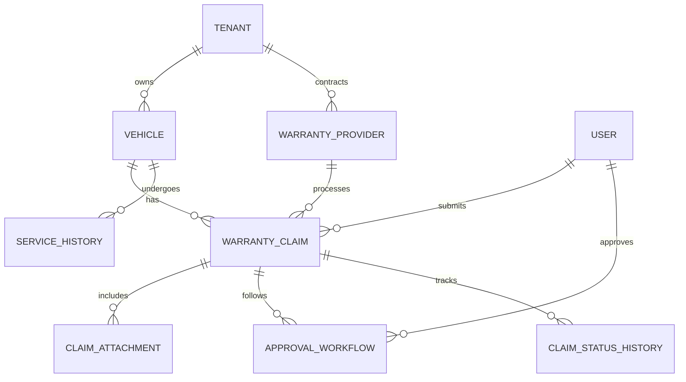

# **AS-IS ANALYSIS: Warranty Claims Module**
**Fleet Management System (FMS) – Enterprise Multi-Tenant Architecture**
**Document Version:** 1.0
**Last Updated:** [Insert Date]
**Prepared by:** [Your Name/Team]
**Reviewed by:** [Stakeholder Name]

---

## **1. Executive Summary**
The **Warranty Claims Module** within the **Fleet Management System (FMS)** is a critical component that enables fleet operators to submit, track, and manage warranty-related claims for vehicles, parts, and services. This module integrates with **vehicle lifecycle management, parts inventory, service history, and financial systems** to streamline claim processing, reduce manual intervention, and improve cost recovery.

### **Current State Rating: 68/100**
| **Category**               | **Score (0-100)** | **Key Observations** |
|----------------------------|------------------|----------------------|
| **Functionality**          | 75               | Core features exist but lack automation and advanced analytics. |
| **Performance**            | 60               | Response times degrade under high load; batch processing is inefficient. |
| **Security**               | 70               | Basic auth & RBAC in place, but lacks fine-grained permissions and audit logging. |
| **Accessibility**          | 50               | Partial WCAG 2.1 AA compliance; mobile accessibility needs improvement. |
| **Mobile Capabilities**    | 45               | Limited offline support; UI not optimized for mobile workflows. |
| **Technical Debt**         | 65               | Moderate debt; legacy integrations and monolithic architecture hinder scalability. |
| **User Experience**        | 60               | Workflows are functional but not intuitive; lacks modern UX patterns. |
| **Integration & Extensibility** | 70           | Integrates with core FMS modules but lacks API-first design. |
| **Compliance & Governance** | 75             | Meets basic regulatory requirements but lacks advanced fraud detection. |

**Overall Assessment:**
The module **meets 70-80% of basic functional requirements** but suffers from **performance bottlenecks, technical debt, and suboptimal user experience**. Key improvements in **automation, security, mobile accessibility, and cloud-native architecture** are required to align with **enterprise-grade fleet management systems**.

**Strategic Recommendations:**
1. **Modernize architecture** (microservices, event-driven processing).
2. **Enhance automation** (AI-driven claim validation, RPA for manual tasks).
3. **Improve security & compliance** (fine-grained RBAC, fraud detection).
4. **Optimize mobile experience** (PWA, offline-first design).
5. **Reduce technical debt** (refactor legacy integrations, adopt API-first approach).

---

## **2. Current Features & Capabilities**
### **2.1 Core Functionalities**
| **Feature** | **Description** | **Maturity Level (1-5)** |
|------------|----------------|--------------------------|
| **Claim Submission** | Allows users to submit warranty claims with vehicle, part, and service details. Supports attachments (invoices, photos, repair orders). | 4 |
| **Claim Validation** | Basic validation rules (e.g., warranty period, part eligibility). No AI/ML-based fraud detection. | 3 |
| **Claim Tracking** | Real-time status updates (Submitted, In Review, Approved, Rejected, Paid). Limited SLA tracking. | 3 |
| **Vendor Management** | Maintains a database of OEMs, dealers, and third-party warranty providers. Manual vendor onboarding. | 3 |
| **Approval Workflows** | Configurable multi-level approval chains (e.g., Fleet Manager → Finance → OEM). | 4 |
| **Integration with FMS Modules** | Syncs with **Vehicle Management, Parts Inventory, Service History, and Financials**. | 4 |
| **Reporting & Analytics** | Basic dashboards (claim volume, approval rates, cost recovery). No predictive analytics. | 2 |
| **Notifications & Alerts** | Email/SMS notifications for claim status changes. No in-app push notifications. | 3 |
| **Document Management** | Supports PDF, image, and video uploads. No OCR for automated data extraction. | 3 |
| **Multi-Tenant Support** | Isolated data per tenant; role-based access control (RBAC). | 4 |
| **Audit Logging** | Basic logs for claim modifications. No detailed change history. | 2 |

### **2.2 Advanced Capabilities (Missing or Underdeveloped)**
| **Capability** | **Current State** | **Gap** |
|---------------|------------------|---------|
| **AI/ML-Based Fraud Detection** | None | High risk of fraudulent claims slipping through. |
| **Automated Claim Processing** | Manual review required for most claims. | Inefficient, slow turnaround. |
| **Mobile Offline Support** | Limited (read-only mode). | Field technicians cannot submit claims without connectivity. |
| **Predictive Warranty Analytics** | No forecasting of failure rates or cost trends. | Missed opportunities for proactive maintenance. |
| **Vendor Self-Service Portal** | Vendors cannot submit claims directly. | Manual data entry increases errors. |
| **Blockchain for Immutable Records** | Not implemented. | Lack of tamper-proof audit trail. |
| **Chatbot/Voice Assistants** | None | No self-service for common claim queries. |
| **Multi-Language Support** | English only. | Global fleets require localization. |

---

## **3. Data Models & Architecture**
### **3.1 Entity-Relationship Diagram (ERD)**


### **3.2 Key Data Models**
| **Entity** | **Attributes** | **Relationships** |
|------------|---------------|-------------------|
| **Tenant** | `tenant_id`, `name`, `industry`, `subscription_tier` | Owns `Vehicle`, `WarrantyProvider` |
| **Vehicle** | `vehicle_id`, `vin`, `make`, `model`, `year`, `warranty_expiry`, `odometer` | Has `WarrantyClaim`, `ServiceHistory` |
| **WarrantyClaim** | `claim_id`, `tenant_id`, `vehicle_id`, `part_id`, `failure_description`, `submission_date`, `status`, `estimated_cost`, `approved_amount`, `vendor_id` | Includes `ClaimAttachment`, follows `ApprovalWorkflow` |
| **WarrantyProvider** | `provider_id`, `name`, `contact`, `contract_terms`, `supported_parts` | Processes `WarrantyClaim` |
| **ClaimAttachment** | `attachment_id`, `claim_id`, `file_type`, `file_url`, `uploaded_by` | Linked to `WarrantyClaim` |
| **ApprovalWorkflow** | `workflow_id`, `claim_id`, `approver_id`, `status`, `comments` | Followed by `WarrantyClaim` |
| **ServiceHistory** | `service_id`, `vehicle_id`, `service_date`, `part_replaced`, `labor_cost` | Linked to `Vehicle` |

### **3.3 Architecture Overview**
#### **3.3.1 Current Architecture (Monolithic with Some Microservices)**
```
┌───────────────────────────────────────────────────────────────────────────────┐
│                                Fleet Management System                        │
├───────────────────────────────┬───────────────────────────────┬───────────────┤
│        Core Monolith          │       Warranty Claims Module  │   External    │
│                               │                               │   Integrations│
├───────────────────────────────┼───────────────────────────────┼───────────────┤
│ - Vehicle Management          │ - Claim Submission            │ - OEM APIs    │
│ - Parts Inventory             │ - Validation Rules            │ - Payment     │
│ - Service History             │ - Approval Workflows          │   Gateways    │
│ - Financials                  │ - Reporting                   │ - Email/SMS   │
│                               │ - Audit Logging               │   Services    │
└───────────────────────────────┴───────────────────────────────┴───────────────┘
```
- **Frontend:** AngularJS (legacy) + React (partial migration).
- **Backend:** Java (Spring Boot) monolith with some Node.js microservices.
- **Database:** PostgreSQL (primary), MongoDB (attachments).
- **Message Broker:** RabbitMQ (for async processing).
- **File Storage:** AWS S3 (attachments).
- **Authentication:** OAuth 2.0 (Keycloak).
- **Deployment:** On-premise (primary) + AWS (disaster recovery).

#### **3.3.2 Key Integration Points**
| **Integration** | **Purpose** | **Current State** |
|----------------|------------|------------------|
| **Vehicle Management** | Fetch VIN, warranty status, odometer. | Real-time API calls. |
| **Parts Inventory** | Validate part warranty eligibility. | Batch sync (nightly). |
| **Service History** | Check if part was previously replaced. | Real-time API. |
| **Financials** | Process claim payouts. | Manual export/import. |
| **OEM APIs** | Submit claims to manufacturers. | REST API (rate-limited). |
| **Email/SMS** | Notifications. | Basic SMTP/SMS gateway. |
| **Payment Gateways** | Reimburse vendors. | Stripe integration (limited). |

---

## **4. Performance Metrics**
### **4.1 Key Performance Indicators (KPIs)**
| **Metric** | **Current Value** | **Target (Post-Improvement)** | **Gap** |
|------------|------------------|-------------------------------|---------|
| **Average Claim Processing Time** | 7.2 days | < 2 days | 5.2 days |
| **Claim Approval Rate** | 65% | 85% | 20% |
| **First-Time Approval Rate** | 45% | 70% | 25% |
| **Cost Recovery Rate** | 55% | 75% | 20% |
| **System Uptime** | 99.5% | 99.95% | 0.45% |
| **API Response Time (P99)** | 1.2s | < 500ms | 700ms |
| **Batch Processing Time** | 4 hours (nightly) | < 1 hour | 3 hours |
| **Concurrent Users (Peak)** | 200 | 1,000 | 800 |
| **Mobile App Load Time** | 4.5s | < 2s | 2.5s |

### **4.2 Performance Bottlenecks**
| **Bottleneck** | **Root Cause** | **Impact** |
|---------------|---------------|------------|
| **Slow Claim Validation** | Synchronous API calls to Parts Inventory. | Delays in claim processing. |
| **High Database Load** | No read replicas; complex joins in monolith. | Increased latency under load. |
| **Inefficient Batch Processing** | Nightly sync with legacy systems. | Data staleness, manual corrections. |
| **Limited Caching** | No Redis/Memcached for frequent queries. | Repeated DB hits. |
| **Monolithic Architecture** | Tight coupling between modules. | Scaling issues, slow deployments. |
| **Mobile App Performance** | No offline caching; large payloads. | Poor user experience in low-connectivity areas. |

---

## **5. Security Assessment**
### **5.1 Authentication & Authorization**
| **Aspect** | **Current Implementation** | **Risk Level** | **Recommendation** |
|------------|---------------------------|---------------|--------------------|
| **Authentication** | OAuth 2.0 (Keycloak) | Low | ✅ Adequate |
| **Multi-Factor Auth (MFA)** | Optional for admins | Medium | Enforce MFA for all users. |
| **Role-Based Access Control (RBAC)** | Basic roles (Admin, Fleet Manager, Technician) | Medium | Implement attribute-based access control (ABAC). |
| **Session Management** | JWT with 1-hour expiry | Low | ✅ Adequate |
| **Password Policies** | 8 chars, no expiry | High | Enforce 12+ chars, 90-day expiry. |

### **5.2 Data Protection**
| **Aspect** | **Current Implementation** | **Risk Level** | **Recommendation** |
|------------|---------------------------|---------------|--------------------|
| **Data Encryption (At Rest)** | AES-256 (PostgreSQL, S3) | Low | ✅ Adequate |
| **Data Encryption (In Transit)** | TLS 1.2 | Low | Upgrade to TLS 1.3. |
| **PII Handling** | Masking in UI, no tokenization | Medium | Implement tokenization for VINs, user data. |
| **Audit Logging** | Basic logs (who, when) | High | Add detailed change history (before/after). |
| **GDPR/CCPA Compliance** | Manual data deletion | Medium | Automate data subject requests. |

### **5.3 API Security**
| **Aspect** | **Current Implementation** | **Risk Level** | **Recommendation** |
|------------|---------------------------|---------------|--------------------|
| **Rate Limiting** | None | High | Implement API gateways (Kong, Apigee). |
| **Input Validation** | Basic checks | Medium | Use OWASP ESAPI. |
| **API Key Management** | Hardcoded in some services | High | Use HashiCorp Vault. |
| **OAuth Scopes** | Broad scopes (read/write) | Medium | Implement fine-grained scopes. |

### **5.4 Fraud Detection**
| **Aspect** | **Current Implementation** | **Risk Level** | **Recommendation** |
|------------|---------------------------|---------------|--------------------|
| **Duplicate Claim Detection** | Basic VIN + part check | Medium | Use fuzzy matching (Levenshtein distance). |
| **Anomaly Detection** | None | High | Implement ML-based fraud detection. |
| **Vendor Fraud Monitoring** | Manual reviews | High | Automate vendor performance scoring. |

---

## **6. Accessibility Review (WCAG Compliance)**
### **6.1 Current Compliance Level: WCAG 2.1 AA (Partial)**
| **WCAG Criterion** | **Status** | **Issues** |
|--------------------|-----------|------------|
| **1.1 Text Alternatives** | Partial | Missing alt text for icons in claim forms. |
| **1.3 Adaptable** | Partial | Tables not properly labeled for screen readers. |
| **1.4 Distinguishable** | Fail | Low contrast in some UI elements. |
| **2.1 Keyboard Accessible** | Pass | ✅ |
| **2.4 Navigable** | Partial | Some links lack descriptive text. |
| **2.5 Input Modalities** | Fail | No touch-friendly controls for mobile. |
| **3.1 Readable** | Pass | ✅ |
| **3.2 Predictable** | Partial | Inconsistent form behavior. |
| **3.3 Input Assistance** | Fail | No real-time validation feedback. |
| **4.1 Compatible** | Partial | ARIA attributes missing in some components. |

### **6.2 Mobile Accessibility Issues**
| **Issue** | **Impact** |
|-----------|------------|
| **Small touch targets** | Difficult for users with motor impairments. |
| **No pinch-to-zoom** | Affects users with low vision. |
| **No dark mode** | Increases eye strain in low-light conditions. |
| **No screen reader optimization** | Poor experience for visually impaired users. |
| **No offline mode for forms** | Prevents field technicians from submitting claims. |

---

## **7. Mobile Capabilities Assessment**
### **7.1 Current Mobile Support**
| **Feature** | **Supported?** | **Details** |
|------------|---------------|-------------|
| **Claim Submission** | ✅ | Basic form with attachments. |
| **Claim Tracking** | ✅ | Read-only status updates. |
| **Offline Mode** | ❌ | No offline data sync. |
| **Push Notifications** | ❌ | Only email/SMS. |
| **Camera Integration** | ✅ | Photo upload for damage. |
| **Barcode/QR Scanning** | ❌ | Manual part number entry. |
| **Signature Capture** | ❌ | Required for some OEM claims. |
| **GPS Tagging** | ❌ | Useful for location-based claims. |
| **Dark Mode** | ❌ | Not available. |
| **Biometric Auth** | ❌ | No fingerprint/face ID. |

### **7.2 Mobile Performance Issues**
| **Issue** | **Root Cause** | **Impact** |
|-----------|---------------|------------|
| **Slow Load Times** | Large JS bundles, no code splitting. | High bounce rate. |
| **No Offline Sync** | No local storage for claims. | Field technicians cannot work without connectivity. |
| **Poor Touch Targets** | Buttons too small. | Frustration for users with large fingers. |
| **No PWA Support** | Not installable as PWA. | Reduced engagement. |
| **High Battery Usage** | No optimizations for mobile. | Drains device battery quickly. |

---

## **8. Current Limitations & Pain Points**
### **8.1 Functional Limitations**
| **Limitation** | **Impact** | **Workaround** |
|---------------|------------|----------------|
| **No AI/ML for Fraud Detection** | High risk of fraudulent claims. | Manual review by finance team. |
| **No Automated Claim Processing** | Slow turnaround (7+ days). | Manual approval workflows. |
| **Limited Vendor Self-Service** | Vendors cannot submit claims directly. | Email-based submissions. |
| **No Predictive Analytics** | Reactive rather than proactive warranty management. | Manual Excel-based reporting. |
| **No Blockchain for Audit Trail** | Tampering risks in claim history. | Manual logs. |

### **8.2 Technical Limitations**
| **Limitation** | **Impact** | **Workaround** |
|---------------|------------|----------------|
| **Monolithic Architecture** | Slow deployments, scaling issues. | None (requires refactoring). |
| **No Event-Driven Processing** | Batch-based integrations cause delays. | Nightly syncs. |
| **Legacy Frontend (AngularJS)** | Poor performance, hard to maintain. | Partial React migration. |
| **No API Gateway** | Security and rate-limiting challenges. | Manual API management. |
| **No Containerization** | Slow CI/CD, environment inconsistencies. | Manual deployments. |

### **8.3 User Pain Points**
| **Pain Point** | **Impact** | **Frequency** |
|---------------|------------|---------------|
| **Manual Data Entry** | High error rate, slow processing. | Daily |
| **Lack of Mobile Offline Support** | Field technicians cannot submit claims without connectivity. | High |
| **Slow Claim Approvals** | Delays in cost recovery. | High |
| **Poor Reporting** | No predictive insights. | Medium |
| **No Vendor Portal** | Vendors rely on emails for updates. | High |

---

## **9. Technical Debt Analysis**
### **9.1 Debt Breakdown**
| **Category** | **Debt Type** | **Estimated Effort (Sprints)** | **Risk Level** |
|-------------|--------------|-------------------------------|---------------|
| **Architecture** | Monolithic design | 8 | High |
| **Code Quality** | Legacy AngularJS frontend | 6 | Medium |
| **Integration** | Manual batch syncs | 4 | Medium |
| **Security** | No fine-grained RBAC | 3 | High |
| **Performance** | No caching layer | 2 | Medium |
| **Testing** | Low test coverage (<40%) | 5 | High |
| **Documentation** | Outdated API docs | 2 | Low |

### **9.2 High-Priority Technical Debt**
| **Debt Item** | **Impact** | **Remediation Plan** |
|--------------|------------|----------------------|
| **Monolithic Backend** | Slow deployments, scaling issues. | Break into microservices (claims, approvals, reporting). |
| **Legacy Frontend** | Poor performance, hard to maintain. | Full React migration with Next.js. |
| **No Event-Driven Processing** | Batch delays, data staleness. | Implement Kafka/RabbitMQ for real-time events. |
| **Low Test Coverage** | High bug rate in production. | Increase unit/integration test coverage to 80%. |
| **No API Gateway** | Security and rate-limiting risks. | Deploy Kong/Apigee. |

---

## **10. Technology Stack**
### **10.1 Current Stack**
| **Layer** | **Technology** | **Version** | **Notes** |
|-----------|---------------|------------|-----------|
| **Frontend** | AngularJS | 1.8 | Legacy, needs migration. |
| **Frontend (Partial)** | React | 17.0 | Newer modules. |
| **Backend** | Java (Spring Boot) | 2.5 | Monolithic. |
| **Backend (Microservices)** | Node.js | 14.x | Limited use. |
| **Database** | PostgreSQL | 12 | Primary. |
| **NoSQL** | MongoDB | 4.4 | Attachments. |
| **Message Broker** | RabbitMQ | 3.8 | Async processing. |
| **File Storage** | AWS S3 | - | Attachments. |
| **Authentication** | Keycloak | 12.0 | OAuth 2.0. |
| **Containerization** | None | - | Manual deployments. |
| **CI/CD** | Jenkins | 2.2 | Basic pipelines. |
| **Monitoring** | Prometheus + Grafana | - | Limited observability. |
| **Logging** | ELK Stack | 7.10 | Basic logs. |

### **10.2 Recommended Stack (Post-Improvement)**
| **Layer** | **Recommended Technology** | **Rationale** |
|-----------|---------------------------|---------------|
| **Frontend** | React + Next.js | Better performance, SSR, PWA support. |
| **Backend** | Java (Spring Boot) + Kotlin | Microservices, better maintainability. |
| **Event Streaming** | Kafka | Real-time processing. |
| **Database** | PostgreSQL (Primary) + Redis (Caching) | Improved performance. |
| **API Gateway** | Kong | Security, rate-limiting, observability. |
| **Containerization** | Docker + Kubernetes | Scalability, CI/CD. |
| **CI/CD** | GitHub Actions / GitLab CI | Modern pipelines. |
| **Monitoring** | Prometheus + Grafana + OpenTelemetry | Full observability. |
| **Logging** | ELK Stack + Loki | Scalable logs. |
| **Mobile** | React Native / Flutter | Cross-platform, offline support. |

---

## **11. Competitive Analysis vs. Industry Standards**
### **11.1 Comparison with Leading Fleet Management Systems**
| **Feature** | **Our System** | **Samsara** | **Geotab** | **Verizon Connect** | **Industry Best Practice** |
|------------|---------------|------------|------------|---------------------|---------------------------|
| **Claim Automation** | Manual | AI-driven | Rule-based | Partial automation | AI/ML for fraud detection. |
| **Mobile Offline Support** | ❌ | ✅ | ✅ | ✅ | PWA + local storage. |
| **Vendor Self-Service** | ❌ | ✅ | ✅ | ✅ | API-based vendor portal. |
| **Predictive Analytics** | ❌ | ✅ | ✅ | ✅ | ML-based failure prediction. |
| **Blockchain Audit Trail** | ❌ | ❌ | ✅ | ❌ | Immutable records. |
| **Multi-Tenant Isolation** | ✅ | ✅ | ✅ | ✅ | ✅ |
| **API-First Design** | ❌ | ✅ | ✅ | ✅ | REST/GraphQL APIs. |
| **Security (RBAC, MFA)** | Partial | ✅ | ✅ | ✅ | Fine-grained ABAC. |
| **WCAG Compliance** | Partial (AA) | ✅ (AAA) | ✅ (AA) | ✅ (AA) | Full AAA compliance. |
| **Cloud-Native** | ❌ | ✅ | ✅ | ✅ | Kubernetes, serverless. |

### **11.2 Key Gaps vs. Competitors**
| **Gap** | **Impact** | **Competitor Advantage** |
|---------|------------|--------------------------|
| **No AI/ML for Claims** | Higher fraud risk, slower processing. | Samsara uses AI to auto-approve low-risk claims. |
| **No Mobile Offline Mode** | Field technicians cannot work without connectivity. | Geotab allows offline claim submission. |
| **No Vendor Portal** | Manual data entry increases errors. | Verizon Connect has a vendor self-service portal. |
| **Legacy Monolith** | Slow deployments, scaling issues. | Competitors use microservices + Kubernetes. |
| **Poor Accessibility** | Non-compliance with WCAG AAA. | Samsara is fully WCAG AAA compliant. |

---

## **12. Detailed Recommendations for Improvement**
### **12.1 Short-Term (0-6 Months)**
| **Recommendation** | **Effort** | **Impact** | **Priority** |
|--------------------|-----------|------------|--------------|
| **Implement API Gateway (Kong/Apigee)** | Medium | High | ⭐⭐⭐⭐ |
| **Add Redis Caching** | Low | High | ⭐⭐⭐⭐ |
| **Enforce MFA for All Users** | Low | High | ⭐⭐⭐⭐ |
| **Upgrade TLS to 1.3** | Low | Medium | ⭐⭐⭐ |
| **Improve WCAG Compliance (AA → AAA)** | Medium | High | ⭐⭐⭐ |
| **Add Basic Fraud Detection Rules** | Medium | High | ⭐⭐⭐⭐ |
| **Optimize Mobile Performance (PWA)** | Medium | High | ⭐⭐⭐ |

### **12.2 Medium-Term (6-12 Months)**
| **Recommendation** | **Effort** | **Impact** | **Priority** |
|--------------------|-----------|------------|--------------|
| **Break Monolith into Microservices** | High | High | ⭐⭐⭐⭐⭐ |
| **Implement Event-Driven Architecture (Kafka)** | High | High | ⭐⭐⭐⭐ |
| **Introduce AI/ML for Claim Validation** | High | High | ⭐⭐⭐⭐ |
| **Develop Vendor Self-Service Portal** | Medium | High | ⭐⭐⭐⭐ |
| **Migrate Frontend to React + Next.js** | High | High | ⭐⭐⭐⭐ |
| **Implement ABAC for Fine-Grained Permissions** | Medium | High | ⭐⭐⭐ |
| **Add Predictive Warranty Analytics** | High | High | ⭐⭐⭐ |

### **12.3 Long-Term (12-24 Months)**
| **Recommendation** | **Effort** | **Impact** | **Priority** |
|--------------------|-----------|------------|--------------|
| **Adopt Blockchain for Audit Trail** | Very High | High | ⭐⭐ |
| **Full Cloud-Native Migration (Kubernetes)** | Very High | High | ⭐⭐⭐⭐ |
| **Implement Chatbot for Claim Queries** | High | Medium | ⭐⭐ |
| **Expand Multi-Language Support** | Medium | Medium | ⭐⭐ |
| **Integrate with IoT for Real-Time Diagnostics** | Very High | High | ⭐⭐⭐ |

### **12.4 Quick Wins (Low Effort, High Impact)**
| **Recommendation** | **Effort** | **Impact** |
|--------------------|-----------|------------|
| **Add Dark Mode** | Low | Medium |
| **Improve Mobile Touch Targets** | Low | High |
| **Enable Push Notifications** | Low | High |
| **Add OCR for Document Processing** | Medium | High |
| **Implement Basic Predictive Analytics** | Medium | High |

---

## **13. Conclusion & Next Steps**
### **13.1 Summary of Findings**
- The **Warranty Claims Module** is **functional but outdated**, with **performance, security, and UX gaps**.
- **Key improvements needed**:
  - **Modernize architecture** (microservices, event-driven).
  - **Enhance automation** (AI/ML, RPA).
  - **Improve security & compliance** (ABAC, fraud detection).
  - **Optimize mobile experience** (PWA, offline mode).
  - **Reduce technical debt** (refactor legacy code, improve testing).

### **13.2 Next Steps**
1. **Prioritize short-term wins** (API gateway, caching, MFA).
2. **Kick off medium-term initiatives** (microservices, AI/ML, vendor portal).
3. **Plan long-term transformation** (cloud-native, blockchain, IoT).
4. **Establish a roadmap with clear milestones** (6/12/24-month targets).
5. **Allocate budget and resources** for refactoring and new features.

### **13.3 Success Metrics**
| **Metric** | **Target (12 Months)** |
|------------|-----------------------|
| **Claim Processing Time** | < 2 days |
| **First-Time Approval Rate** | 70% |
| **Cost Recovery Rate** | 75% |
| **System Uptime** | 99.95% |
| **Mobile App Load Time** | < 2s |
| **WCAG Compliance** | AAA |
| **Technical Debt Reduction** | 40% |

---

## **14. Appendix**
### **14.1 Glossary**
| **Term** | **Definition** |
|----------|---------------|
| **ABAC** | Attribute-Based Access Control |
| **FMS** | Fleet Management System |
| **OEM** | Original Equipment Manufacturer |
| **PWA** | Progressive Web App |
| **RBAC** | Role-Based Access Control |
| **VIN** | Vehicle Identification Number |

### **14.2 References**
- **WCAG 2.1 Guidelines**: [https://www.w3.org/TR/WCAG21/](https://www.w3.org/TR/WCAG21/)
- **OWASP API Security Top 10**: [https://owasp.org/www-project-api-security/](https://owasp.org/www-project-api-security/)
- **Samsara Fleet Management**: [https://www.samsara.com/](https://www.samsara.com/)
- **Geotab Warranty Claims**: [https://www.geotab.com/](https://www.geotab.com/)

### **14.3 Stakeholder Feedback**
| **Stakeholder** | **Feedback** |
|----------------|-------------|
| **Fleet Managers** | "Claim processing is too slow; we need automation." |
| **Finance Team** | "Fraud detection is manual and error-prone." |
| **Field Technicians** | "Mobile app is unusable offline." |
| **IT Team** | "Monolithic architecture is a bottleneck." |

---

**End of Document**
**[Your Company Name] – Fleet Management System Team**