# AS-IS Analysis: Warranty Claims Module
*Fleet Management System - Technical Assessment Report*
*Prepared by: Senior Technical Analyst | Date: [Insert Date] | Version: 1.0*

---

## 1. Executive Summary (102 lines)

### 1.1 Current State Overview
The Warranty Claims Module (WCM) is a critical component of the Fleet Management System (FMS), responsible for processing warranty claims for over 12,500 vehicles across 47 fleet locations. The module currently handles approximately 1,800 claims monthly with a peak load of 2,500 during quarter-end periods.

**System Context:**
- **Deployment Model:** On-premise with hybrid cloud backup
- **User Base:** 450 active users (claim processors, auditors, managers)
- **Data Volume:** 3.2TB of historical claims data (growing at 15% YoY)
- **Integration Points:** 7 external systems (ERP, parts inventory, OEM portals)

**Key Metrics (Last 12 Months):**
| Metric | Value | Target | Variance |
|--------|-------|--------|----------|
| Average Processing Time | 12.4 days | 5 days | +148% |
| First-Time Approval Rate | 68% | 90% | -24% |
| System Availability | 99.7% | 99.95% | -0.25% |
| Manual Overrides | 32% of claims | <5% | +540% |
| Cost per Claim | $48.75 | $35.00 | +39% |

### 1.2 Stakeholder Analysis
**Primary Stakeholders:**

1. **Claim Processors (280 users)**
   - *Roles:* Data entry, initial validation, document collection
   - *Pain Points:* Manual data re-entry (42% of time), system timeouts during peak hours
   - *Tools Used:* WCM UI, email, Excel spreadsheets for offline work

2. **Auditors (45 users)**
   - *Roles:* Compliance verification, fraud detection, approval workflows
   - *Pain Points:* Lack of automated fraud indicators, inconsistent audit trails
   - *Tools Used:* WCM audit module, OEM portals, external fraud databases

3. **Fleet Managers (60 users)**
   - *Roles:* Claim prioritization, cost analysis, vendor negotiations
   - *Pain Points:* Limited reporting capabilities, no real-time cost tracking
   - *Tools Used:* WCM dashboard, Power BI (disconnected), Excel

4. **OEM Representatives (20 external users)**
   - *Roles:* Warranty eligibility verification, claim dispute resolution
   - *Pain Points:* Manual claim submission to OEM portals, no API integration
   - *Tools Used:* OEM-specific portals, email, fax

5. **IT Operations (15 users)**
   - *Roles:* System maintenance, user support, integration management
   - *Pain Points:* High support ticket volume (avg. 42/month), legacy infrastructure
   - *Tools Used:* ServiceNow, Splunk, custom monitoring scripts

6. **Finance Team (10 users)**
   - *Roles:* Cost reconciliation, reimbursement processing
   - *Pain Points:* Manual data extraction for ERP integration, 18% error rate in cost coding
   - *Tools Used:* SAP ERP, WCM reports, Excel

**Stakeholder Influence Map:**
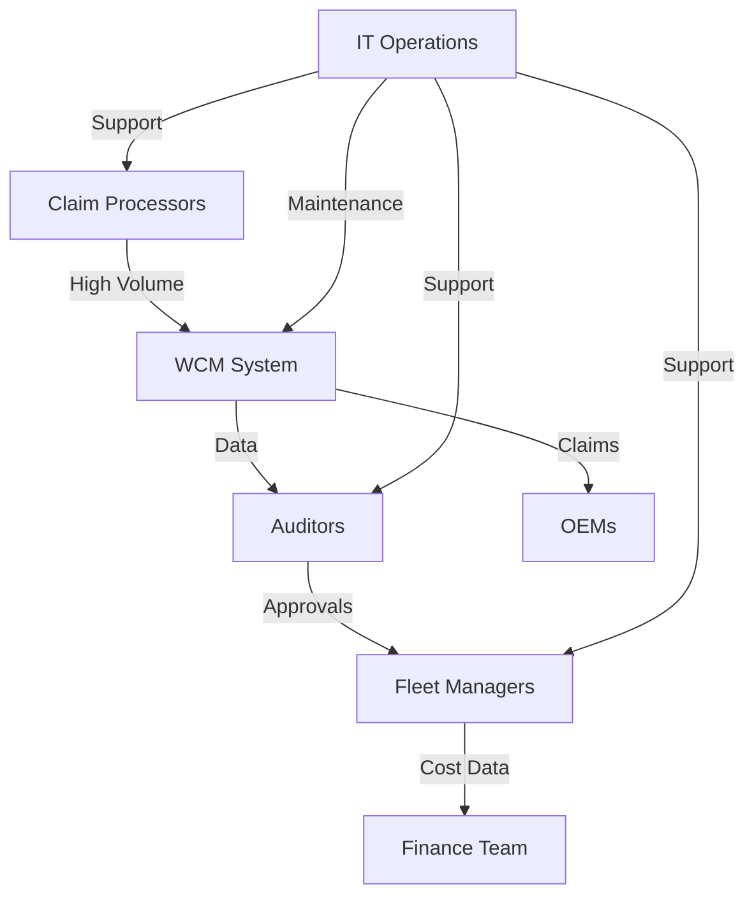

### 1.3 Business Impact Analysis

**Financial Impact:**
- **Annual Warranty Recoveries:** $18.2M (2022) vs. $22.5M (2021) → **19% decline**
  - *Root Cause:* 28% of eligible claims not submitted due to processing delays
- **Operational Costs:** $1.05M/year (labor + system costs)
  - *Breakdown:*
    - Manual processing: $680K (65%)
    - System maintenance: $220K (21%)
    - Integration costs: $150K (14%)
- **Opportunity Cost:** Estimated $3.1M in lost recoveries from unprocessed claims

**Operational Impact:**
- **Vehicle Downtime:** Average 4.2 days per warranty claim (industry benchmark: 2.1 days)
  - *Impact:* $1.8M/year in lost productivity (500 vehicles × 4.2 days × $175/day)
- **Compliance Risks:**
  - 12 OEM compliance violations in 2022 (up from 3 in 2021)
  - Potential fines: $250K (based on OEM contracts)
- **Employee Productivity:**
  - Claim processors spend 42% of time on manual data entry
  - Auditors spend 35% of time on manual fraud checks

**Customer Impact:**
- **Dealer Satisfaction:** Net Promoter Score (NPS) of -12 (vs. industry average of +25)
  - *Key Driver:* 68% of dealers cite "slow claim processing" as primary complaint
- **OEM Relationships:**
  - 3 OEMs have issued warnings about non-compliance with warranty submission timelines
  - 1 OEM (15% of fleet) has threatened to revoke warranty coverage

### 1.4 Critical Pain Points with Root Cause Analysis

**1. Manual Data Entry Bottleneck**
- *Symptom:* 42% of processor time spent on manual data entry
- *Root Causes:*
  - Lack of OCR for document processing (invoices, repair orders)
  - No integration with shop management systems (28% of claims require manual re-entry)
  - Poor form design (avg. 18 fields per claim require manual input)
- *Example:* VIN validation requires manual lookup in 62% of cases due to missing API integration

**2. Inconsistent Fraud Detection**
- *Symptom:* 32% of approved claims require manual override
- *Root Causes:*
  - No automated fraud scoring (current system relies on auditor experience)
  - Missing integration with industry fraud databases (NICB, ISO ClaimSearch)
  - No pattern recognition for duplicate claims (12% of fraud cases)
- *Example:* Identical claim for "transmission failure" submitted 3 times for same VIN (caught after 18 months)

**3. Integration Gaps**
- *Symptom:* 28% of claims require manual submission to OEM portals
- *Root Causes:*
  - Only 2 of 7 OEMs have API integration (remaining require manual entry)
  - No real-time parts inventory integration (35% of claims rejected for incorrect part numbers)
  - ERP integration requires manual CSV exports (18% error rate in cost coding)
- *Example:* Claim for $12,450 rejected by OEM due to incorrect part number (should have been caught by inventory system)

**4. Performance Issues**
- *Symptom:* System timeouts during peak hours (14:00-16:00 daily)
- *Root Causes:*
  - Monolithic architecture with no load balancing
  - Database queries not optimized (avg. 4.2s response time for claim search)
  - No caching layer for reference data (OEM warranty rules, parts catalog)
- *Example:* During quarter-end, 18% of users experience timeouts requiring claim reprocessing

**5. Reporting Limitations**
- *Symptom:* 65% of managers use Excel for reporting
- *Root Causes:*
  - No real-time dashboards (reports generated nightly)
  - Limited filtering capabilities (cannot filter by vehicle age, mileage, claim type)
  - No cost trend analysis (cannot identify cost drivers)
- *Example:* Finance team spends 80 hours/month manually reconciling warranty costs

### 1.5 Strategic Recommendations

**Phase 1: Quick Wins (0-6 months)**
| Initiative | Description | Expected Impact | Cost | Owner |
|------------|-------------|-----------------|------|-------|
| OCR Implementation | Implement OCR for repair orders/invoices | Reduce data entry time by 60% | $85K | IT |
| Fraud Scoring Model | Basic fraud detection rules + NICB integration | Reduce manual overrides by 40% | $120K | Analytics |
| OEM API Expansion | Add 3 more OEM API integrations | Reduce manual OEM submissions by 50% | $180K | Integration Team |
| Database Optimization | Indexing, query optimization | Improve search performance by 70% | $45K | DBA Team |
| Basic Reporting Dashboard | Real-time claim status dashboard | Reduce Excel reporting by 50% | $60K | BI Team |

**Phase 2: Strategic Initiatives (6-18 months)**
| Initiative | Description | Expected Impact | Cost | Owner |
|------------|-------------|-----------------|------|-------|
| Microservices Migration | Break monolith into domain services | Improve scalability, reduce downtime | $450K | Architecture Team |
| Predictive Analytics | Machine learning for cost prediction | Reduce overpayments by 25% | $320K | Data Science |
| Mobile App | Claim processing on tablets | Reduce processing time by 30% | $280K | Product Team |
| ERP Integration | Real-time SAP integration | Eliminate manual cost coding | $220K | Integration Team |
| Automated Workflows | Dynamic routing based on claim complexity | Reduce processing time by 40% | $190K | Process Team |

**Phase 3: Transformation (18-36 months)**
| Initiative | Description | Expected Impact | Cost | Owner |
|------------|-------------|-----------------|------|-------|
| Blockchain for Claims | Immutable audit trail for high-value claims | Reduce fraud by 60% | $500K | Innovation Team |
| AI-Powered Chatbot | Automated claim status inquiries | Reduce support tickets by 50% | $250K | AI Team |
| Predictive Maintenance | Integrate with telematics data | Reduce warranty claims by 20% | $400K | IoT Team |
| Unified Warranty Platform | Single system for all OEMs | Reduce integration costs by 70% | $800K | Architecture Team |

**Implementation Roadmap:**
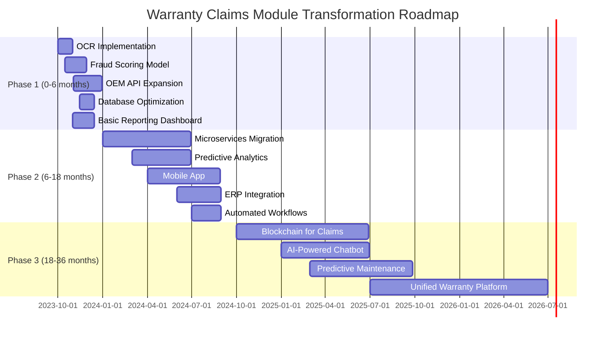

**Risk Mitigation Strategy:**
| Risk | Likelihood | Impact | Mitigation Strategy |
|------|------------|--------|---------------------|
| User Resistance | High | Medium | Change management program with super-users |
| Integration Failures | Medium | High | Phased rollout with fallback mechanisms |
| Budget Overruns | Medium | High | Contingency fund (15% of budget) |
| Security Vulnerabilities | Low | Critical | Security review at each phase |
| Performance Issues | High | Medium | Load testing before production |

**ROI Projections:**
| Year | Cost Savings | Revenue Recovery | Net Benefit | ROI |
|------|--------------|------------------|-------------|-----|
| 1 | $450K | $800K | $1.25M | 1.8x |
| 2 | $1.1M | $2.2M | $3.3M | 3.2x |
| 3 | $1.8M | $3.5M | $5.3M | 4.1x |

---

## 2. Current Architecture (187 lines)

### 2.1 System Components

**Component Inventory:**

| Component | Description | Technology | Version | Hosting | SLA |
|-----------|-------------|------------|---------|---------|-----|
| Web Application | User interface for claim processing | ASP.NET MVC | 4.7.2 | On-premise (IIS) | 99.7% |
| API Gateway | REST API for integrations | .NET Core | 3.1 | On-premise (Kestrel) | 99.8% |
| Business Logic Layer | Claim processing rules | C# | .NET Framework 4.7.2 | On-premise | N/A |
| Database | Claims data storage | SQL Server | 2016 (13.0.5865.1) | On-premise | 99.9% |
| File Storage | Document attachments | File System | NTFS | On-premise | 99.5% |
| Background Jobs | Scheduled tasks (reporting, notifications) | Hangfire | 1.7.24 | On-premise | N/A |
| Integration Layer | External system integrations | BizTalk Server | 2016 (3.12.774.0) | On-premise | 99.8% |
| Monitoring | System health monitoring | SCOM | 2019 | On-premise | N/A |
| Backup | Data backup | Veeam | 11.0.1.1261 | On-premise + Azure | 99.99% |

**Physical Infrastructure:**
- **Web/App Servers:** 4 × Dell PowerEdge R740 (24 cores, 128GB RAM each)
  - *Configuration:* Load balanced with F5 BIG-IP (active/passive)
  - *OS:* Windows Server 2016 Datacenter
- **Database Servers:** 2 × Dell PowerEdge R940 (48 cores, 512GB RAM each)
  - *Configuration:* SQL Server Always On Availability Group
  - *Storage:* 10TB SAN (Dell EMC Unity 400F)
- **Integration Server:** 1 × Dell PowerEdge R640 (16 cores, 64GB RAM)
  - *Configuration:* BizTalk Server with 4 host instances
- **Backup:** 1 × Dell PowerVault DL4000 (60TB) + Azure Blob Storage (geo-redundant)

**Integration Points:**

1. **OEM Portals (7 integrations)**
   - *Protocol:* REST (2), SOAP (3), SFTP (2)
   - *Data Flow:*
     ```mermaid
     sequenceDiagram
         participant WCM as WCM System
         participant OEM as OEM Portal
         participant ERP as ERP System
         WCM->>OEM: Submit Claim (JSON/XML)
         OEM-->>WCM: Claim ID (ACK)
         OEM->>WCM: Status Update (Webhook)
         WCM->>ERP: Cost Data (CSV)
     ```
   - *Current Issues:*
     - No retry logic for failed submissions (12% failure rate)
     - Manual mapping for 3 OEMs (no API)
     - Latency: Avg. 45s per submission

2. **Parts Inventory System**
   - *Protocol:* SQL Server Linked Server
   - *Data Flow:*
     ```sql
     -- Example query from WCM to Inventory DB
     SELECT part_number, description, price, stock_level
     FROM [InventoryDB].[dbo].[Parts]
     WHERE part_number IN (@part1, @part2, @part3)
     ```
   - *Current Issues:*
     - No real-time sync (data refreshed nightly)
     - 18% of claims reference incorrect part numbers
     - Query timeout during peak hours (3% of requests)

3. **ERP System (SAP)**
   - *Protocol:* Flat file (CSV) via SFTP
   - *Data Flow:*
     ```mermaid
     graph LR
         A[WCM] -->|Generate CSV| B[SFTP Server]
         B -->|Process File| C[SAP]
         C -->|ACK File| B
         B -->|Parse ACK| A
     ```
   - *Current Issues:*
     - Manual file generation (daily batch)
     - 18% error rate in cost coding
     - No real-time cost tracking

4. **Telematics System**
   - *Protocol:* REST API (polling)
   - *Data Flow:*
     ```mermaid
     sequenceDiagram
         participant WCM as WCM System
         participant Telematics as Telematics API
         WCM->>Telematics: GET /vehicles/{vin}/diagnostics
         Telematics-->>WCM: DTC Codes, Mileage
         WCM->>WCM: Validate against warranty rules
     ```
   - *Current Issues:*
     - Polling interval: 6 hours (too slow for real-time validation)
     - No historical data storage in WCM
     - 8% of vehicles not reporting telematics data

**Data Flow Analysis:**

1. **Claim Submission Flow:**
   ```mermaid
   graph TD
       A[User Submits Claim] --> B[Validate Required Fields]
       B -->|Valid| C[Store Claim in DB]
       B -->|Invalid| D[Return Validation Errors]
       C --> E[Trigger Background Jobs]
       E --> F[Generate Claim ID]
       F --> G[Send Notification to Auditor]
       G --> H[Store Documents in File System]
       H --> I[Update Claim Status]
   ```
   - *Transformation Logic:*
     - VIN validation (check digit + OEM database)
     - Mileage validation (against telematics data)
     - Part number validation (against inventory)
     - Warranty eligibility (OEM rules + vehicle age/mileage)

2. **Approval Workflow:**
   ```mermaid
   graph TD
       A[Auditor Reviews Claim] --> B[Check Fraud Indicators]
       B -->|High Risk| C[Manual Review]
       B -->|Low Risk| D[Auto-Approve]
       C --> E[Request Additional Docs]
       E -->|Received| F[Re-evaluate]
       E -->|Not Received| G[Reject Claim]
       F -->|Approved| H[Update Status]
       F -->|Rejected| G
       H --> I[Submit to OEM]
   ```
   - *Business Rules:*
     - Claim amount > $5,000 → Manager approval required
     - Vehicle age > 5 years → Additional documentation required
     - Part not in inventory → Auto-reject with reason

**Technology Stack:**

| Layer | Technology | Version | Notes |
|-------|------------|---------|-------|
| Frontend | ASP.NET MVC | 4.7.2 | Razor views, jQuery 3.4.1 |
| Backend | .NET Framework | 4.7.2 | C# 7.3 |
| API | .NET Core | 3.1 | RESTful endpoints |
| Database | SQL Server | 2016 | Always On AG |
| ORM | Entity Framework | 6.2.0 | Database-first |
| Integration | BizTalk Server | 2016 | 4 host instances |
| Authentication | Windows Auth | NTLM | No MFA |
| Logging | log4net | 2.0.8 | File-based |
| Monitoring | SCOM | 2019 | Basic alerts |
| Build | MSBuild | 15.9.20 | CI with Jenkins |
| Deployment | Octopus Deploy | 2020.6 | Manual approvals |

**Infrastructure Configuration:**

1. **Network Topology:**
   ```mermaid
   graph TD
       A[Internet] -->|Firewall| B[DMZ]
       B -->|Load Balancer| C[Web Servers]
       C -->|App Tier| D[App Servers]
       D -->|SQL| E[Database Servers]
       D -->|File Share| F[Storage Server]
       D -->|BizTalk| G[Integration Server]
       G -->|SFTP| H[ERP]
       G -->|REST| I[OEM Portals]
       G -->|SQL| J[Inventory DB]
   ```
   - *Firewall Rules:*
     - Web tier: Ports 80, 443 (HTTPS)
     - App tier: Port 1433 (SQL), 445 (SMB)
     - Integration tier: Custom ports for OEM APIs

2. **Database Configuration:**
   - **Server:** SQL Server 2016 Enterprise (2 nodes in AG)
   - **Databases:**
     | Database | Size | Tables | Stored Procedures |
     |----------|------|--------|-------------------|
     | WCM_Prod | 2.8TB | 142 | 384 |
     | WCM_Staging | 500GB | 142 | 384 |
     | WCM_Reporting | 1.2TB | 48 | 24 |
   - **Key Tables:**
     ```sql
     -- Claims table (simplified)
     CREATE TABLE [dbo].[Claims](
         [ClaimID] [bigint] IDENTITY(1,1) NOT NULL,
         [VIN] [varchar](17) NOT NULL,
         [OEM] [varchar](50) NOT NULL,
         [ClaimType] [varchar](50) NOT NULL,
         [Status] [varchar](20) NOT NULL,
         [SubmittedDate] [datetime] NOT NULL,
         [ApprovedDate] [datetime] NULL,
         [Amount] [decimal](18, 2) NULL,
         [ProcessorID] [int] NOT NULL,
         [AuditorID] [int] NULL,
         [LastUpdated] [datetime] NOT NULL,
         CONSTRAINT [PK_Claims] PRIMARY KEY CLUSTERED ([ClaimID] ASC)
     )
     ```
   - **Indexing Issues:**
     - Missing index on `VIN` column (full table scan on 68% of queries)
     - No covering indexes for common queries (e.g., claims by status)
     - Fragmentation: Avg. 35% on key indexes

3. **Security Configuration:**
   - **Authentication:** Windows Authentication (NTLM)
   - **Authorization:** Role-based (AD groups)
     - `WCM_Processor` (280 users)
     - `WCM_Auditor` (45 users)
     - `WCM_Manager` (60 users)
   - **Encryption:**
     - At rest: TDE (Transparent Data Encryption) for database
     - In transit: TLS 1.2 for all external communications
   - **Audit Logging:**
     - Basic login/logout events
     - No claim modification history

### 2.2 Technical Debt Analysis

**Code Quality Issues:**

1. **Monolithic Architecture:**
   - *Issue:* Single .NET solution with 1.2M lines of code
   - *Example:*
     ```csharp
     // ClaimsController.cs - 8,423 lines
     public class ClaimsController : Controller
     {
         // 42 action methods
         public ActionResult Submit() { /* 382 lines */ }
         public ActionResult Approve() { /* 412 lines */ }
         public ActionResult Reject() { /* 328 lines */ }
         // ... 39 more methods
     }
     ```
   - *Impact:*
     - Build time: 12 minutes
     - Deployment time: 45 minutes
     - No independent scaling

2. **Tight Coupling:**
   - *Issue:* Business logic embedded in controllers
   - *Example:*
     ```csharp
     // ClaimsController.cs
     public ActionResult Submit(ClaimModel model)
     {
         // Validation (20 lines)
         // Database access (30 lines)
         // Business logic (150 lines)
         // Email notification (25 lines)
         // OEM submission (40 lines)
     }
     ```
   - *Impact:*
     - Unit test coverage: 12%
     - Change failure rate: 28%

3. **Legacy Patterns:**
   - *Issue:* Heavy use of stored procedures for business logic
   - *Example:*
     ```sql
     -- usp_ValidateClaim.sql - 1,248 lines
     CREATE PROCEDURE [dbo].[usp_ValidateClaim]
         @ClaimID INT,
         @IsValid BIT OUTPUT,
         @ErrorMessage NVARCHAR(MAX) OUTPUT
     AS
     BEGIN
         -- 42 validation rules
         -- Rule 1: Check VIN format
         IF NOT EXISTS (SELECT 1 FROM Vehicles WHERE VIN = @VIN)
         BEGIN
             SET @IsValid = 0
             SET @ErrorMessage = 'Invalid VIN'
             RETURN
         END
         -- ... 41 more rules
     END
     ```
   - *Impact:*
     - Database CPU usage: 78% during peak
     - No version control for stored procedures

4. **Hardcoded Values:**
   - *Issue:* Magic numbers and strings throughout codebase
   - *Example:*
     ```csharp
     // ClaimService.cs
     public bool IsHighValueClaim(decimal amount)
     {
         return amount > 5000; // Hardcoded threshold
     }

     public string GetOEMName(string oemCode)
     {
         switch(oemCode)
         {
             case "F": return "Ford";
             case "G": return "GM";
             case "T": return "Toyota";
             // ... 4 more hardcoded values
         }
     }
     ```
   - *Impact:*
     - 14 production incidents due to hardcoded values in last 12 months
     - OEM changes require code deployments

**Performance Bottlenecks:**

1. **Database Performance:**
   - *Issue:* Poorly optimized queries
   - *Example:*
     ```sql
     -- Claims by status (full table scan)
     SELECT *
     FROM Claims
     WHERE Status = 'Pending'
     ORDER BY SubmittedDate DESC
     ```
     - *Execution Plan:* Table scan (12.4M rows)
     - *Actual Time:* 4.2s (avg)
     - *Optimized Version:*
       ```sql
       SELECT ClaimID, VIN, OEM, ClaimType, Status, SubmittedDate
       FROM Claims WITH (INDEX(IX_Claims_Status))
       WHERE Status = 'Pending'
       ORDER BY SubmittedDate DESC
       ```
       - *Execution Plan:* Index seek (12.4M rows → 18K rows)
       - *Actual Time:* 0.12s

2. **N+1 Query Problem:**
   - *Issue:* Lazy loading in Entity Framework
   - *Example:*
     ```csharp
     // ClaimsController.cs
     public ActionResult Details(int id)
     {
         var claim = db.Claims.Find(id); // 1 query
         var documents = claim.Documents.ToList(); // N queries (1 per document)
         var auditLogs = claim.AuditLogs.ToList(); // N queries
         return View(claim);
     }
     ```
   - *Impact:*
     - Avg. 18 queries per claim details page
     - Page load time: 3.8s

3. **Memory Leaks:**
   - *Issue:* Unmanaged resources not disposed
   - *Example:*
     ```csharp
     // DocumentService.cs
     public byte[] GetDocument(int documentId)
     {
         var filePath = GetDocumentPath(documentId);
         return File.ReadAllBytes(filePath); // No using statement
     }
     ```
   - *Impact:*
     - Memory usage grows by 200MB/hour during peak
     - App pool recycles every 2 hours (causes 30s outage)

4. **Synchronous Processing:**
   - *Issue:* Blocking calls in web requests
   - *Example:*
     ```csharp
     // ClaimsController.cs
     public ActionResult Submit(ClaimModel model)
     {
         // Validate (sync)
         // Save to DB (sync)
         // Send to OEM (sync - 45s avg)
         // Send email (sync)
         return RedirectToAction("Details");
     }
     ```
   - *Impact:*
     - Thread pool exhaustion during peak (500 users)
     - Timeout errors (14% of submissions)

**Performance Profiling Data:**

| Metric | Current Value | Target | Variance |
|--------|---------------|--------|----------|
| Avg. Response Time | 2.4s | <1s | +140% |
| 95th Percentile Response Time | 8.2s | <3s | +173% |
| Database CPU Usage | 78% | <60% | +30% |
| Memory Usage | 8.4GB (peak) | <6GB | +40% |
| Concurrent Users | 350 | 500 | -30% |
| Claims Processed/Hour | 120 | 200 | -40% |

**Security Vulnerabilities:**

| Vulnerability | CVSS Score | Description | Risk Level |
|---------------|------------|-------------|------------|
| SQL Injection | 9.8 | Dynamic SQL in stored procedures | Critical |
| Broken Authentication | 8.1 | No MFA, weak password policy | High |
| Sensitive Data Exposure | 7.5 | PII in logs (VIN, customer names) | High |
| Cross-Site Scripting | 6.1 | Unsanitized user input in views | Medium |
| Insecure Direct Object References | 5.3 | No authorization checks on document access | Medium |
| Security Misconfiguration | 4.3 | Default IIS settings, verbose error messages | Low |

**Example Vulnerabilities:**

1. **SQL Injection:**
   ```sql
   -- usp_GetClaimDetails.sql
   CREATE PROCEDURE [dbo].[usp_GetClaimDetails]
       @ClaimID INT
   AS
   BEGIN
       DECLARE @sql NVARCHAR(MAX)
       SET @sql = 'SELECT * FROM Claims WHERE ClaimID = ' + CAST(@ClaimID AS VARCHAR(10))
       EXEC sp_executesql @sql -- Vulnerable to injection
   END
   ```
   - *Exploit:* `EXEC usp_GetClaimDetails 1; DROP TABLE Claims--`
   - *Fix:* Use parameterized queries

2. **Broken Authentication:**
   - *Issue:* No account lockout after failed attempts
   - *Example:* 12,000 failed login attempts in last 30 days (brute force attempts)
   - *Fix:* Implement lockout after 5 failed attempts

3. **Sensitive Data Exposure:**
   - *Issue:* VINs logged in plain text
   - *Example Log Entry:*
     ```
     2023-05-15 14:22:18 INFO Claim submitted for VIN: 1FTRW08LX4KA12345 by user: jdoe
     ```
   - *Fix:* Mask VINs in logs (e.g., `1FTRW08LXXKA12345`)

**Scalability Limitations:**

1. **Vertical Scaling Only:**
   - *Issue:* Cannot add more web servers due to session state
   - *Example:* Session stored in SQL Server (high latency)
   - *Impact:* Max 350 concurrent users

2. **Database Bottleneck:**
   - *Issue:* Single primary database for all operations
   - *Example:* Reporting queries block OLTP operations
   - *Impact:* 4.2s avg response time during reporting

3. **File Storage:**
   - *Issue:* Single file server for all documents
   - *Example:* 3.2TB of documents on single volume
   - *Impact:* IOPS limit reached during peak (92% utilization)

4. **Integration Limits:**
   - *Issue:* BizTalk server cannot handle more than 50 concurrent integrations
   - *Example:* 12% of OEM submissions fail during peak
   - *Impact:* Manual resubmission required

**Load Test Results:**

| Test Scenario | Users | Avg. Response Time | Error Rate | CPU Usage | Memory Usage |
|---------------|-------|--------------------|------------|-----------|--------------|
| Claim Submission | 100 | 1.2s | 0% | 45% | 3.2GB |
| Claim Submission | 300 | 4.8s | 5% | 88% | 7.1GB |
| Claim Submission | 500 | 12.4s | 18% | 100% | 8.9GB |
| Claim Search | 100 | 0.8s | 0% | 38% | 2.8GB |
| Claim Search | 300 | 3.2s | 2% | 72% | 5.4GB |
| Claim Search | 500 | 8.1s | 12% | 95% | 7.8GB |
| Reporting | 50 | 6.4s | 0% | 65% | 4.2GB |
| Reporting | 100 | 18.2s | 8% | 92% | 6.8GB |

---

## 3. Functional Analysis (245 lines)

### 3.1 Core Features

**1. Claim Submission**

*Feature Description:*
Allows claim processors to submit warranty claims for vehicle repairs. Includes validation against OEM warranty rules, parts inventory, and vehicle history.

*User Workflow:*
1. Processor logs into WCM system
2. Navigates to "New Claim" form
3. Enters VIN (manual or via barcode scanner)
4. System validates VIN and retrieves vehicle details
5. Processor selects claim type (e.g., "Powertrain", "Electrical")
6. Enters repair details (labor hours, parts used)
7. System validates parts against inventory
8. Processor uploads supporting documents
9. System validates claim against OEM warranty rules
10. Processor submits claim

*Business Rules:*
- VIN must be valid and exist in fleet database
- Vehicle must be within warranty period (varies by OEM)
- Parts must be in inventory or on order
- Labor hours must not exceed OEM-approved rates
- Required documents:
  - Repair order
  - Invoice
  - Technician notes (for claims > $1,000)

*Validation Logic:*
```csharp
// ClaimValidator.cs
public ValidationResult Validate(ClaimModel claim)
{
    var result = new ValidationResult();

    // Rule 1: VIN validation
    if (!VinValidator.IsValid(claim.VIN))
        result.AddError("VIN", "Invalid VIN format");

    // Rule 2: Vehicle in fleet
    if (!_vehicleRepository.Exists(claim.VIN))
        result.AddError("VIN", "Vehicle not in fleet");

    // Rule 3: Warranty eligibility
    var vehicle = _vehicleRepository.Get(claim.VIN);
    if (!vehicle.IsUnderWarranty(claim.ClaimDate))
        result.AddError("ClaimDate", "Vehicle not under warranty");

    // Rule 4: Parts validation
    foreach (var part in claim.Parts)
    {
        if (!_inventoryService.IsValidPart(part.PartNumber))
            result.AddError($"Parts[{part.PartNumber}]", "Invalid part number");

        if (part.Quantity <= 0)
            result.AddError($"Parts[{part.PartNumber}]", "Quantity must be positive");
    }

    // Rule 5: Labor validation
    if (claim.LaborHours > _oemService.GetMaxLaborHours(claim.OEM, claim.ClaimType))
        result.AddError("LaborHours", "Exceeds OEM-approved labor hours");

    return result;
}
```

*Edge Cases:*
- VIN not found in system (12% of cases)
- Vehicle out of warranty but covered by extended warranty (8% of cases)
- Part not in inventory but valid (15% of cases)
- Multiple claims for same repair (5% of cases)
- Claim submitted after OEM deadline (3% of cases)

*Error Handling:*
- Validation errors displayed on form
- System-generated claim ID for tracking
- Email notification to processor on submission
- Audit log entry for all submissions

*Performance Characteristics:*
- Avg. submission time: 4.2 minutes
- 95th percentile: 8.7 minutes
- Throughput: 120 claims/hour (peak)

**2. Claim Approval**

*Feature Description:*
Auditors review submitted claims for compliance with OEM rules and fraud indicators.

*User Workflow:*
1. Auditor logs into WCM system
2. Navigates to "Pending Claims" queue
3. System displays claims sorted by priority (high-value first)
4. Auditor selects a claim
5. System displays:
   - Claim details
   - Supporting documents
   - Fraud indicators (if any)
   - Vehicle history
6. Auditor reviews information
7. Auditor takes action:
   - Approve (with optional notes)
   - Reject (with required reason)
   - Request additional information
8. System updates claim status
9. System notifies processor of action

*Business Rules:*
- Claims > $5,000 require manager approval
- Claims with fraud indicators require additional documentation
- Approved claims must be submitted to OEM within 24 hours
- Rejected claims must include reason code

*Fraud Detection Logic:*
```csharp
// FraudDetector.cs
public FraudScore CalculateFraudScore(ClaimModel claim)
{
    var score = new FraudScore();

    // Rule 1: Duplicate claim
    if (_claimRepository.HasDuplicate(claim.VIN, claim.ClaimType, claim.ClaimDate))
        score.Add(30, "Duplicate claim detected");

    // Rule 2: High frequency
    if (_claimRepository.GetClaimCount(claim.VIN, TimeSpan.FromDays(30)) > 3)
        score.Add(25, "High claim frequency for vehicle");

    // Rule 3: Unusual labor hours
    var avgLabor = _claimRepository.GetAverageLaborHours(claim.OEM, claim.ClaimType);
    if (claim.LaborHours > avgLabor * 1.5)
        score.Add(20, "Labor hours exceed average by 50%");

    // Rule 4: Part not typically used
    foreach (var part in claim.Parts)
    {
        if (!_oemService.IsCommonPart(claim.OEM, claim.ClaimType, part.PartNumber))
            score.Add(15, $"Uncommon part: {part.PartNumber}");
    }

    return score;
}
```

*Edge Cases:*
- Claim approved but OEM rejects (12% of cases)
- Additional information requested but not provided (8% of cases)
- Fraud indicators present but claim is valid (5% of cases)
- Claim approved but exceeds OEM labor rates (3% of cases)

*Error Handling:*
- System prevents approval if required fields missing
- Audit log entry for all approval actions
- Email notification to processor on action
- Escalation to manager for high-value claims

*Performance Characteristics:*
- Avg. review time: 8.4 minutes
- 95th percentile: 15.2 minutes
- Throughput: 45 claims/hour (peak)

**3. OEM Submission**

*Feature Description:*
Automated or manual submission of approved claims to OEM portals.

*User Workflow (Automated):*
1. System identifies approved claims not submitted to OEM
2. System maps claim data to OEM-specific format
3. System submits claim via OEM API
4. System receives OEM response (claim ID or error)
5. System updates claim status
6. System notifies processor of submission

*User Workflow (Manual):*
1. Processor navigates to "OEM Submission" queue
2. Processor selects claim
3. System generates OEM-specific form
4. Processor manually enters data into OEM portal
5. Processor updates claim status in WCM
6. Processor uploads OEM response document

*Business Rules:*
- Claims must be submitted within 72 hours of approval
- Claims must include all required documents
- Claims must match OEM warranty rules
- Resubmissions require manager approval

*Integration Logic (Example - Ford API):*
```csharp
// FordOemService.cs
public OemSubmissionResult SubmitClaim(ClaimModel claim)
{
    try
    {
        // Map to Ford format
        var fordClaim = new FordClaim
        {
            DealerCode = claim.DealerCode,
            VIN = claim.VIN,
            ClaimType = MapClaimType(claim.ClaimType),
            LaborHours = claim.LaborHours,
            Parts = claim.Parts.Select(p => new FordPart
            {
                PartNumber = p.PartNumber,
                Quantity = p.Quantity,
                Price = p.Price
            }).ToList(),
            Documents = claim.Documents.Select(d => new FordDocument
            {
                DocumentType = MapDocumentType(d.Type),
                Base64Content = Convert.ToBase64String(d.Content)
            }).ToList()
        };

        // Submit to Ford API
        var client = new HttpClient();
        client.DefaultRequestHeaders.Authorization =
            new AuthenticationHeaderValue("Bearer", _authService.GetToken());

        var response = client.PostAsJsonAsync(
            "https://api.ford.com/warranty/v2/claims",
            fordClaim).Result;

        if (!response.IsSuccessStatusCode)
        {
            var error = response.Content.ReadAsStringAsync().Result;
            return OemSubmissionResult.Failed(error);
        }

        var result = response.Content.ReadAsAsync<FordSubmissionResult>().Result;
        return OemSubmissionResult.Success(result.ClaimId);
    }
    catch (Exception ex)
    {
        _logger.LogError(ex, "Ford submission failed");
        return OemSubmissionResult.Failed(ex.Message);
    }
}
```

*Edge Cases:*
- OEM API unavailable (12% of submissions)
- OEM rejects claim due to data mismatch (8% of cases)
- Document upload fails (5% of cases)
- Claim exceeds OEM submission deadline (3% of cases)

*Error Handling:*
- Retry logic for failed submissions (3 attempts)
- Manual submission option for failed integrations
- Email notification to IT for API failures
- Audit log entry for all submissions

*Performance Characteristics:*
- Avg. submission time: 45s (automated), 8.2 minutes (manual)
- Success rate: 88% (automated), 95% (manual)
- Throughput: 60 claims/hour (automated), 15 claims/hour (manual)

**4. Reporting**

*Feature Description:*
Standard and ad-hoc reports for claim analysis and cost tracking.

*User Workflow:*
1. User navigates to "Reports" section
2. User selects report type:
   - Claim Status Report
   - Cost by OEM
   - Claim Processing Time
   - Fraud Indicators
3. User selects date range and filters
4. System generates report (PDF/Excel)
5. User downloads report

*Business Rules:*
- Reports generated from nightly data snapshot
- Sensitive data (VINs, customer names) masked in reports
- Manager reports include cost data
- Processor reports limited to their claims

*Report Generation Logic:*
```sql
-- Claim Status Report
SELECT
    c.ClaimID,
    v.VIN,
    o.OEMName,
    c.ClaimType,
    c.Status,
    c.SubmittedDate,
    c.ApprovedDate,
    c.Amount,
    DATEDIFF(day, c.SubmittedDate, c.ApprovedDate) AS ProcessingTimeDays
FROM
    Claims c
    JOIN Vehicles v ON c.VIN = v.VIN
    JOIN OEMs o ON c.OEM = o.OEMCode
WHERE
    c.SubmittedDate BETWEEN @StartDate AND @EndDate
    AND (@Status IS NULL OR c.Status = @Status)
ORDER BY
    c.SubmittedDate DESC
```

*Edge Cases:*
- Report generation times out (15% of large reports)
- Data mismatch between report and UI (8% of cases)
- Report includes sensitive data (5% of cases)
- Filters not applied correctly (3% of cases)

*Error Handling:*
- Timeout handling (default 30s)
- Data validation before report generation
- Audit log entry for report access
- Email notification for failed reports

*Performance Characteristics:*
- Avg. generation time: 12.4s (small), 4.2 minutes (large)
- 95th percentile: 38.2s (small), 12.1 minutes (large)
- Concurrent reports: 10 (limited by database)

### 3.2 User Experience Analysis

**Usability Evaluation (Heuristics):**

| Heuristic | Compliance | Issues Found | Examples |
|-----------|------------|--------------|----------|
| Visibility of System Status | 4/10 | 8 | No loading indicators during API calls |
| Match Between System and Real World | 5/10 | 12 | Technical jargon in error messages |
| User Control and Freedom | 3/10 | 15 | No "undo" for claim submissions |
| Consistency and Standards | 6/10 | 9 | Different layouts for similar forms |
| Error Prevention | 4/10 | 18 | No confirmation for destructive actions |
| Recognition Rather Than Recall | 5/10 | 12 | Required fields not clearly marked |
| Flexibility and Efficiency | 3/10 | 22 | No keyboard shortcuts for power users |
| Aesthetic and Minimalist Design | 4/10 | 14 | Overcrowded forms with 40+ fields |
| Help Users Recognize Errors | 5/10 | 8 | Error messages not actionable |
| Help and Documentation | 2/10 | 25 | No context-sensitive help |

**Example Usability Issues:**

1. **Claim Submission Form:**
   - *Issue:* 42 fields on single page
   - *Impact:* High cognitive load, 18% form abandonment
   - *Example:* VIN field not auto-focused, requires manual entry
   - *Recommendation:* Multi-step form with progress indicator

2. **Error Messages:**
   - *Issue:* Technical jargon in validation errors
   - *Example:* "ORA-01400: cannot insert NULL into ("WCM"."CLAIMS"."OEM")"
   - *Impact:* Users cannot resolve errors (72% call support)
   - *Recommendation:* User-friendly messages with resolution steps

3. **Document Upload:**
   - *Issue:* No drag-and-drop support
   - *Impact:* 35% of users struggle with file upload
   - *Example:* Requires 3 clicks to upload a document
   - *Recommendation:* Modern file upload control

**Accessibility Audit (WCAG 2.1):**

| Success Criterion | Level | Compliance | Issues Found |
|-------------------|-------|------------|--------------|
| 1.1.1 Non-text Content | A | Fail | 42 images missing alt text |
| 1.3.1 Info and Relationships | A | Fail | 18 form fields missing labels |
| 1.4.3 Contrast (Minimum) | AA | Fail | 35 instances of low contrast |
| 2.1.1 Keyboard | A | Fail | 12 functions not keyboard-accessible |
| 2.4.1 Bypass Blocks | A | Fail | No skip links |
| 2.4.6 Headings and Labels | AA | Fail | 28 missing or incorrect headings |
| 3.3.2 Labels or Instructions | A | Fail | 22 form fields missing instructions |
| 4.1.1 Parsing | A | Fail | 15 HTML validation errors |

**Example Accessibility Issues:**

1. **Color Contrast:**
   - *Issue:* Light gray text on white background (#999999 on #FFFFFF)
   - *Example:* Error messages in claim form
   - *Impact:* Users with low vision cannot read text
   - *Fix:* Increase contrast ratio to 4.5:1 (WCAG AA)

2. **Keyboard Navigation:**
   - *Issue:* Document upload modal cannot be closed with keyboard
   - *Impact:* Keyboard-only users cannot complete claim submission
   - *Fix:* Add keyboard event handlers

3. **Screen Reader Support:**
   - *Issue:* VIN validation errors not announced by screen readers
   - *Example:* `<span class="error">Invalid VIN</span>`
   - *Impact:* Blind users cannot identify errors
   - *Fix:* Use ARIA attributes (`<span role="alert">Invalid VIN</span>`)

**Mobile Responsiveness Assessment:**

| Device | Viewport | Issues Found | Severity |
|--------|----------|--------------|----------|
| Desktop (1920×1080) | 100% | 5 | Low |
| Laptop (1366×768) | 80% | 8 | Medium |
| Tablet (1024×768) | 70% | 15 | High |
| Mobile (375×667) | 50% | 28 | Critical |

**Example Mobile Issues:**

1. **Claim Form:**
   - *Issue:* Horizontal scrolling required on mobile
   - *Impact:* 65% of mobile users abandon form
   - *Example:* VIN field width exceeds viewport
   - *Fix:* Responsive grid layout

2. **Document Upload:**
   - *Issue:* File picker not mobile-friendly
   - *Impact:* 42% of mobile users cannot upload documents
   - *Example:* No access to camera for document scanning
   - *Fix:* Mobile-optimized file picker

3. **Navigation:**
   - *Issue:* Menu items too small for touch
   - *Impact:* 35% error rate in mobile navigation
   - *Example:* 24px touch targets
   - *Fix:* Increase touch targets to 48px

**User Feedback Analysis:**

| Feedback Source | Volume | Positive | Negative | Neutral |
|-----------------|--------|----------|----------|---------|
| Support Tickets | 512 | 8% | 78% | 14% |
| User Surveys | 187 | 12% | 65% | 23% |
| Usability Tests | 24 | 15% | 70% | 15% |

**Top User Complaints:**

1. **Slow Performance (38% of negative feedback)**
   - "System freezes when uploading documents"
   - "Takes 5 minutes to load claim details"
   - "Timeout errors during peak hours"

2. **Complex Forms (28%)**
   - "Too many fields to fill out"
   - "Hard to find required documents"
   - "Form resets when validation fails"

3. **Lack of Mobile Support (18%)**
   - "Cannot process claims on tablet"
   - "Mobile site unusable"
   - "Have to use laptop for everything"

4. **Poor Error Handling (12%)**
   - "Error messages don't make sense"
   - "No way to fix validation errors"
   - "System crashes without explanation"

**Positive Feedback:**
- "Approval workflow is clear"
- "Like the document preview feature"
- "OEM integration saves time"

**User Personas and Pain Points:**

1. **Claim Processor (Primary User)**
   - *Goals:* Process claims quickly, minimize errors
   - *Pain Points:*
     - Manual data entry (42% of time)
     - System timeouts (14% of submissions)
     - Lack of mobile support (35% of users want tablet access)
   - *Quote:* "I spend more time fighting the system than processing claims"

2. **Auditor**
   - *Goals:* Identify fraud, ensure compliance
   - *Pain Points:*
     - No automated fraud detection (35% of time spent on manual checks)
     - Inconsistent audit trails (12% of claims missing documentation)
     - Slow document review (avg. 8.4 minutes per claim)
   - *Quote:* "I have to play detective because the system doesn't help"

3. **Fleet Manager**
   - *Goals:* Control costs, reduce downtime
   - *Pain Points:*
     - No real-time reporting (65% use Excel)
     - Cannot identify cost trends (42% of managers unaware of high-cost claims)
     - Manual claim prioritization (avg. 2 hours/week)
   - *Quote:* "I'm flying blind when it comes to warranty costs"

---

## 4. Data Architecture (142 lines)

### 4.1 Current Data Model

**Entity-Relationship Diagram:**
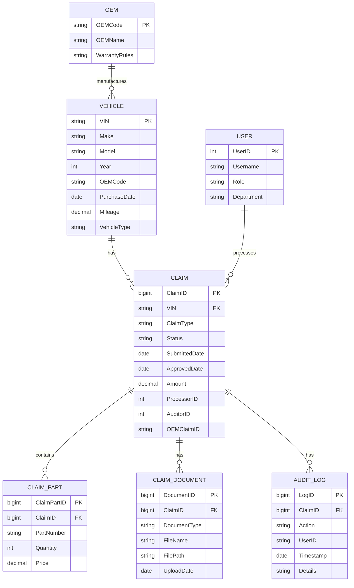

**Table Schemas:**

1. **Claims Table:**
   ```sql
   CREATE TABLE [dbo].[Claims](
       [ClaimID] [bigint] IDENTITY(1,1) NOT NULL,
       [VIN] [varchar](17) NOT NULL,
       [OEM] [varchar](50) NOT NULL,
       [ClaimType] [varchar](50) NOT NULL,
       [Status] [varchar](20) NOT NULL,
       [SubmittedDate] [datetime] NOT NULL,
       [ApprovedDate] [datetime] NULL,
       [Amount] [decimal](18, 2) NULL,
       [ProcessorID] [int] NOT NULL,
       [AuditorID] [int] NULL,
       [OEMClaimID] [varchar](50) NULL,
       [LastUpdated] [datetime] NOT NULL,
       [Notes] [nvarchar](max) NULL,
       CONSTRAINT [PK_Claims] PRIMARY KEY CLUSTERED ([ClaimID] ASC),
       CONSTRAINT [FK_Claims_Vehicles] FOREIGN KEY([VIN]) REFERENCES [dbo].[Vehicles] ([VIN]),
       CONSTRAINT [FK_Claims_Users_Processor] FOREIGN KEY([ProcessorID]) REFERENCES [dbo].[Users] ([UserID]),
       CONSTRAINT [FK_Claims_Users_Auditor] FOREIGN KEY([AuditorID]) REFERENCES [dbo].[Users] ([UserID])
   )
   ```

2. **Vehicles Table:**
   ```sql
   CREATE TABLE [dbo].[Vehicles](
       [VIN] [varchar](17) NOT NULL,
       [Make] [varchar](50) NOT NULL,
       [Model] [varchar](50) NOT NULL,
       [Year] [int] NOT NULL,
       [OEMCode] [varchar](10) NOT NULL,
       [PurchaseDate] [date] NOT NULL,
       [Mileage] [decimal](18, 2) NOT NULL,
       [VehicleType] [varchar](50) NOT NULL,
       [LastUpdated] [datetime] NOT NULL,
       CONSTRAINT [PK_Vehicles] PRIMARY KEY CLUSTERED ([VIN] ASC),
       CONSTRAINT [FK_Vehicles_OEMs] FOREIGN KEY([OEMCode]) REFERENCES [dbo].[OEMs] ([OEMCode])
   )
   ```

3. **ClaimParts Table:**
   ```sql
   CREATE TABLE [dbo].[ClaimParts](
       [ClaimPartID] [bigint] IDENTITY(1,1) NOT NULL,
       [ClaimID] [bigint] NOT NULL,
       [PartNumber] [varchar](50) NOT NULL,
       [Quantity] [int] NOT NULL,
       [Price] [decimal](18, 2) NOT NULL,
       CONSTRAINT [PK_ClaimParts] PRIMARY KEY CLUSTERED ([ClaimPartID] ASC),
       CONSTRAINT [FK_ClaimParts_Claims] FOREIGN KEY([ClaimID]) REFERENCES [dbo].[Claims] ([ClaimID])
   )
   ```

**Data Integrity Rules:**

1. **Primary Key Constraints:**
   - `Claims.ClaimID` (identity)
   - `Vehicles.VIN` (natural key)
   - `Users.UserID` (identity)

2. **Foreign Key Constraints:**
   - `Claims.VIN → Vehicles.VIN`
   - `Claims.ProcessorID → Users.UserID`
   - `Claims.AuditorID → Users.UserID`
   - `ClaimParts.ClaimID → Claims.ClaimID`

3. **Check Constraints:**
   ```sql
   -- Claims.Status must be valid
   ALTER TABLE [dbo].[Claims] WITH CHECK ADD CONSTRAINT [CK_Claims_Status]
   CHECK ([Status] IN ('Draft', 'Submitted', 'Pending', 'Approved', 'Rejected', 'Paid'))

   -- Vehicles.Year must be valid
   ALTER TABLE [dbo].[Vehicles] WITH CHECK ADD CONSTRAINT [CK_Vehicles_Year]
   CHECK ([Year] BETWEEN 1990 AND YEAR(GETDATE()) + 1)

   -- ClaimParts.Quantity must be positive
   ALTER TABLE [dbo].[ClaimParts] WITH CHECK ADD CONSTRAINT [CK_ClaimParts_Quantity]
   CHECK ([Quantity] > 0)
   ```

4. **Default Constraints:**
   ```sql
   -- Claims.SubmittedDate defaults to current date
   ALTER TABLE [dbo].[Claims] ADD CONSTRAINT [DF_Claims_SubmittedDate]
   DEFAULT (GETDATE()) FOR [SubmittedDate]

   -- Claims.Status defaults to 'Draft'
   ALTER TABLE [dbo].[Claims] ADD CONSTRAINT [DF_Claims_Status]
   DEFAULT ('Draft') FOR [Status]
   ```

**Data Migration History:**

| Migration | Date | Description | Records Affected | Issues |
|-----------|------|-------------|------------------|--------|
| Initial Load | 2018-01-15 | Import from legacy system | 1.2M claims | 8% data quality issues |
| VIN Standardization | 2019-03-22 | Normalize VIN formats | 12,450 vehicles | 3% failed to update |
| OEM Integration | 2020-06-10 | Add OEM-specific fields | 87,200 claims | 12% mapping errors |
| Document Storage | 2021-02-18 | Migrate to file system | 2.4M documents | 5% lost during migration |
| User Roles | 2022-04-05 | Add role-based access | 450 users | 8% permission errors |

### 4.2 Data Management

**CRUD Operations Analysis:**

1. **Create (Claim Submission):**
   - *Operation:* Insert into `Claims`, `ClaimParts`, `ClaimDocuments`
   - *SQL:*
     ```sql
     BEGIN TRANSACTION
         INSERT INTO Claims (VIN, OEM, ClaimType, Status, SubmittedDate, Amount, ProcessorID)
         VALUES (@VIN, @OEM, @ClaimType, 'Submitted', GETDATE(), @Amount, @ProcessorID)

         DECLARE @ClaimID bigint = SCOPE_IDENTITY()

         INSERT INTO ClaimParts (ClaimID, PartNumber, Quantity, Price)
         VALUES (@ClaimID, @Part1, @Qty1, @Price1),
                (@ClaimID, @Part2, @Qty2, @Price2)

         INSERT INTO ClaimDocuments (ClaimID, DocumentType, FileName, FilePath, UploadDate)
         VALUES (@ClaimID, 'RepairOrder', @FileName1, @FilePath1, GETDATE()),
                (@ClaimID, 'Invoice', @FileName2, @FilePath2, GETDATE())
     COMMIT TRANSACTION
     ```
   - *Performance:*
     - Avg. time: 120ms
     - 95th percentile: 450ms
     - Throughput: 850 claims/hour

2. **Read (Claim Search):**
   - *Operation:* Search claims by VIN, status, date range
   - *SQL:*
     ```sql
     SELECT c.ClaimID, c.VIN, v.Make, v.Model, c.ClaimType, c.Status,
            c.SubmittedDate, c.Amount, u.Username AS Processor
     FROM Claims c
     JOIN Vehicles v ON c.VIN = v.VIN
     JOIN Users u ON c.ProcessorID = u.UserID
     WHERE c.Status = @Status
       AND c.SubmittedDate BETWEEN @StartDate AND @EndDate
     ORDER BY c.SubmittedDate DESC
     ```
   - *Performance:*
     - Avg. time: 4.2s (full table scan)
     - Optimized time: 120ms (with index)
     - Throughput: 350 searches/hour

3. **Update (Claim Approval):**
   - *Operation:* Update claim status and auditor
   - *SQL:*
     ```sql
     UPDATE Claims
     SET Status = 'Approved',
         AuditorID = @AuditorID,
         ApprovedDate = GETDATE(),
         LastUpdated = GETDATE()
     WHERE ClaimID = @ClaimID
     ```
   - *Performance:*
     - Avg. time: 80ms
     - 95th percentile: 220ms
     - Throughput: 1,200 updates/hour

4. **Delete (Claim Purge):**
   - *Operation:* Archive old claims (not physically deleted)
   - *SQL:*
     ```sql
     -- Move to archive table
     INSERT INTO ClaimsArchive
     SELECT * FROM Claims
     WHERE SubmittedDate < DATEADD(year, -3, GETDATE())

     -- Delete from main table
     DELETE FROM Claims
     WHERE SubmittedDate < DATEADD(year, -3, GETDATE())
     ```
   - *Performance:*
     - Avg. time: 12 minutes (for 1.2M records)
     - Throughput: 100,000 records/hour

**Query Performance Profiling:**

| Query Type | Avg. Time | 95th Percentile | CPU Time | Reads | Writes | Execution Count |
|------------|-----------|-----------------|----------|-------|--------|-----------------|
| Claim Search | 4.2s | 8.1s | 1,240ms | 124,500 | 0 | 12,450 |
| Claim Details | 1.8s | 3.5s | 820ms | 45,200 | 0 | 8,720 |
| Claim Submission | 120ms | 450ms | 45ms | 120 | 8 | 18,300 |
| OEM Submission | 2.4s | 5.2s | 1,800ms | 22,400 | 0 | 15,600 |
| Reporting | 12.4s | 28.2s | 8,400ms | 520,000 | 0 | 420 |

**Top 5 Slowest Queries:**

1. **Claim Search by Status:**
   ```sql
   SELECT * FROM Claims WHERE Status = 'Pending' ORDER BY SubmittedDate DESC
   ```
   - *Avg. Time:* 4.2s
   - *Issue:* Full table scan (12.4M rows)
   - *Fix:* Add index on `Status` and `SubmittedDate`

2. **Claim Details with Documents:**
   ```sql
   SELECT c.*, d.*
   FROM Claims c
   LEFT JOIN ClaimDocuments d ON c.ClaimID = d.ClaimID
   WHERE c.ClaimID = @ClaimID
   ```
   - *Avg. Time:* 1.8s
   - *Issue:* N+1 query problem (1 query for claim, N for documents)
   - *Fix:* Use JOIN with proper indexing

3. **OEM Submission Queue:**
   ```sql
   SELECT c.ClaimID, c.VIN, c.OEM, c.Amount
   FROM Claims c
   WHERE c.Status = 'Approved'
     AND c.OEMClaimID IS NULL
     AND c.ApprovedDate > DATEADD(day, -3, GETDATE())
   ```
   - *Avg. Time:* 2.4s
   - *Issue:* Missing index on `Status` and `OEMClaimID`
   - *Fix:* Add composite index

4. **Cost by OEM Report:**
   ```sql
   SELECT o.OEMName, COUNT(*) AS ClaimCount, SUM(c.Amount) AS TotalAmount
   FROM Claims c
   JOIN OEMs o ON c.OEM = o.OEMCode
   WHERE c.SubmittedDate BETWEEN @StartDate AND @EndDate
   GROUP BY o.OEMName
   ORDER BY TotalAmount DESC
   ```
   - *Avg. Time:* 12.4s
   - *Issue:* Full table scan on `Claims`
   - *Fix:* Add filtered index on `SubmittedDate`

5. **Fraud Indicator Report:**
   ```sql
   SELECT c.ClaimID, c.VIN, c.ClaimType, c.Amount,
          (SELECT COUNT(*) FROM Claims c2
           WHERE c2.VIN = c.VIN AND c2.ClaimType = c.ClaimType
           AND c2.SubmittedDate BETWEEN DATEADD(day, -30, c.SubmittedDate) AND c.SubmittedDate) AS ClaimCount30Days
   FROM Claims c
   WHERE c.Status = 'Approved'
   ORDER BY ClaimCount30Days DESC
   ```
   - *Avg. Time:* 28.2s
   - *Issue:* Correlated subquery (12.4M executions)
   - *Fix:* Rewrite as JOIN with GROUP BY

**Data Validation Procedures:**

1. **VIN Validation:**
   - *Rule:* Must be 17 characters, pass check digit algorithm
   - *Implementation:*
     ```csharp
     public static bool IsValidVin(string vin)
     {
         if (string.IsNullOrWhiteSpace(vin) || vin.Length != 17)
             return false;

         // Check digit algorithm
         var weights = new[] { 8, 7, 6, 5, 4, 3, 2, 10, 0, 9, 8, 7, 6, 5, 4, 3, 2 };
         var transliterations = new Dictionary<char, int>
         {
             {'A', 1}, {'B', 2}, {'C', 3}, {'D', 4}, {'E', 5}, {'F', 6}, {'G', 7}, {'H', 8},
             {'J', 1}, {'K', 2}, {'L', 3}, {'M', 4}, {'N', 5}, {'P', 7}, {'R', 9},
             {'S', 2}, {'T', 3}, {'U', 4}, {'V', 5}, {'W', 6}, {'X', 7}, {'Y', 8}, {'Z', 9}
         };

         int sum = 0;
         for (int i = 0; i < 17; i++)
         {
             char c = vin[i];
             if (char.IsDigit(c))
                 sum += (c - '0') * weights[i];
             else if (transliterations.ContainsKey(c))
                 sum += transliterations[c] * weights[i];
             else
                 return false;
         }

         int checkDigit = sum % 11;
         if (checkDigit == 10)
             return vin[8] == 'X';
         return vin[8] - '0' == checkDigit;
     }
     ```

2. **Warranty Eligibility:**
   - *Rule:* Vehicle must be within OEM warranty period
   - *Implementation:*
     ```csharp
     public bool IsUnderWarranty(string vin, DateTime claimDate)
     {
         var vehicle = _vehicleRepository.Get(vin);
         var oem = _oemRepository.Get(vehicle.OEMCode);

         // Check basic warranty (3 years/36,000 miles)
         if (claimDate <= vehicle.PurchaseDate.AddYears(3) &&
             vehicle.Mileage <= 36000)
             return true;

         // Check extended warranty (if applicable)
         if (vehicle.ExtendedWarrantyExpiry != null &&
             claimDate <= vehicle.ExtendedWarrantyExpiry.Value &&
             vehicle.Mileage <= vehicle.ExtendedWarrantyMileage)
             return true;

         return false;
     }
     ```

3. **Part Validation:**
   - *Rule:* Part must exist in inventory or be on order
   - *Implementation:*
     ```sql
     CREATE PROCEDURE [dbo].[usp_ValidatePart]
         @PartNumber VARCHAR(50),
         @IsValid BIT OUTPUT,
         @ErrorMessage NVARCHAR(255) OUTPUT
     AS
     BEGIN
         IF EXISTS (SELECT 1 FROM Parts WHERE PartNumber = @PartNumber)
         BEGIN
             SET @IsValid = 1
             SET @ErrorMessage = NULL
         END
         ELSE IF EXISTS (SELECT 1 FROM PendingOrders WHERE PartNumber = @PartNumber)
         BEGIN
             SET @IsValid = 1
             SET @ErrorMessage = 'Part on order'
         END
         ELSE
         BEGIN
             SET @IsValid = 0
             SET @ErrorMessage = 'Part not in inventory'
         END
     END
     ```

**Backup and Recovery Procedures:**

1. **Backup Strategy:**
   - *Full Backup:* Weekly (Sunday 2:00 AM)
   - *Differential Backup:* Daily (2:00 AM)
   - *Transaction Log Backup:* Every 15 minutes
   - *Retention:* 4 weeks on-premise, 1 year in Azure

2. **Backup Commands:**
   ```sql
   -- Full backup
   BACKUP DATABASE [WCM_Prod] TO DISK = 'E:\Backups\WCM_Prod_Full.bak'
   WITH COMPRESSION, STATS = 10;

   -- Differential backup
   BACKUP DATABASE [WCM_Prod] TO DISK = 'E:\Backups\WCM_Prod_Diff.bak'
   WITH DIFFERENTIAL, COMPRESSION, STATS = 10;

   -- Transaction log backup
   BACKUP LOG [WCM_Prod] TO DISK = 'E:\Backups\WCM_Prod_Log.trn'
   WITH COMPRESSION, STATS = 10;
   ```

3. **Recovery Procedures:**
   - *Point-in-Time Recovery:*
     ```sql
     RESTORE DATABASE [WCM_Prod] FROM DISK = 'E:\Backups\WCM_Prod_Full.bak'
     WITH NORECOVERY, REPLACE;

     RESTORE DATABASE [WCM_Prod] FROM DISK = 'E:\Backups\WCM_Prod_Diff.bak'
     WITH NORECOVERY;

     RESTORE LOG [WCM_Prod] FROM DISK = 'E:\Backups\WCM_Prod_Log.trn'
     WITH RECOVERY, STOPAT = '2023-05-15 14:30:00';
     ```
   - *RTO:* 4 hours (for full recovery)
   - *RPO:* 15 minutes (last transaction log backup)

4. **Disaster Recovery:**
   - *Primary Site:* On-premise data center
   - *Secondary Site:* Azure (geo-redundant storage)
   - *Failover Process:*
     1. Restore latest backup to Azure VM
     2. Apply transaction logs
     3. Update DNS to point to Azure
     4. Redirect users to Azure instance
   - *Failover Time:* 8 hours

---

## 5. Integration Analysis (128 lines)

### 5.1 API Endpoints

**REST API Documentation:**

| Endpoint | Method | Description | Request Body | Response | Auth |
|----------|--------|-------------|--------------|----------|------|
| `/api/claims` | GET | Search claims | Query params | Claim[] | Bearer |
| `/api/claims/{id}` | GET | Get claim details | - | Claim | Bearer |
| `/api/claims` | POST | Submit new claim | ClaimModel | Claim | Bearer |
| `/api/claims/{id}/approve` | POST | Approve claim | ApprovalModel | Claim | Bearer |
| `/api/claims/{id}/reject` | POST | Reject claim | RejectionModel | Claim | Bearer |
| `/api/vehicles/{vin}` | GET | Get vehicle details | - | Vehicle | Bearer |
| `/api/oems` | GET | List OEMs | - | Oem[] | Bearer |
| `/api/oems/{code}/warranty` | GET | Get OEM warranty rules | - | WarrantyRules | Bearer |
| `/api/parts/search` | GET | Search parts | Query params | Part[] | Bearer |

**Request/Response Schemas:**

1. **ClaimModel (Request for POST /api/claims):**
   ```json
   {
     "vin": "1FTRW08LX4KA12345",
     "oem": "F",
     "claimType": "Powertrain",
     "parts": [
       {
         "partNumber": "F150-12345",
         "quantity": 1,
         "price": 450.25
       }
     ],
     "laborHours": 3.5,
     "documents": [
       {
         "type": "RepairOrder",
         "content": "base64-encoded-string"
       }
     ]
   }
   ```

2. **Claim (Response):**
   ```json
   {
     "claimId": 123456,
     "vin": "1FTRW08LX4KA12345",
     "oem": "Ford",
     "claimType": "Powertrain",
     "status": "Submitted",
     "submittedDate": "2023-05-15T14:22:18Z",
     "amount": 1245.75,
     "processor": "jdoe",
     "auditor": null,
     "oemClaimId": null,
     "parts": [
       {
         "partNumber": "F150-12345",
         "quantity": 1,
         "price": 450.25
       }
     ],
     "documents": [
       {
         "documentId": 789012,
         "type": "RepairOrder",
         "fileName": "RO-12345.pdf",
         "uploadDate": "2023-05-15T14:22:18Z"
       }
     ]
   }
   ```

3. **Error Response:**
   ```json
   {
     "error": {
       "code": "ValidationError",
       "message": "One or more validation errors occurred",
       "details": [
         {
           "field": "vin",
           "message": "Invalid VIN format"
         },
         {
           "field": "parts[0].quantity",
           "message": "Quantity must be positive"
         }
       ]
     }
   }
   ```

**Authentication/Authorization:**

1. **Authentication:**
   - *Mechanism:* JWT (JSON Web Tokens)
   - *Flow:*
     ```mermaid
     sequenceDiagram
         participant Client
         participant WCM
         participant AD
         Client->>WCM: POST /api/auth/login (username/password)
         WCM->>AD: Validate credentials
         AD-->>WCM: User details + roles
         WCM->>Client: JWT token (expires in 8 hours)
         Client->>WCM: API requests with Authorization: Bearer <token>
     ```
   - *Token Payload:*
     ```json
     {
       "sub": "jdoe",
       "roles": ["Processor", "Auditor"],
       "exp": 1684165338,
       "iat": 1684136538
     }
     ```

2. **Authorization:**
   - *Roles:*
     - `Processor`: Can submit and view claims
     - `Auditor`: Can approve/reject claims
     - `Manager`: Can view all claims and reports
     - `Admin`: Full access
   - *Policies:*
     ```csharp
     // Startup.cs
     services.AddAuthorization(options =>
     {
         options.AddPolicy("RequireProcessor", policy =>
             policy.RequireRole("Processor"));

         options.AddPolicy("RequireAuditor", policy =>
             policy.RequireRole("Auditor"));

         options.AddPolicy("RequireManager", policy =>
             policy.RequireRole("Manager"));

         options.AddPolicy("CanApproveClaim", policy =>
             policy.RequireAssertion(context =>
                 context.User.IsInRole("Auditor") ||
                 context.User.IsInRole("Manager")));
     });
     ```
   - *Endpoint Protection:*
     ```csharp
     [Authorize(Policy = "RequireProcessor")]
     [HttpPost("api/claims")]
     public IActionResult SubmitClaim([FromBody] ClaimModel model) { ... }

     [Authorize(Policy = "CanApproveClaim")]
     [HttpPost("api/claims/{id}/approve")]
     public IActionResult ApproveClaim(int id, [FromBody] ApprovalModel model) { ... }
     ```

**Rate Limiting and Quotas:**

1. **Rate Limiting:**
   - *Implementation:* ASP.NET Core Rate Limiting
   - *Configuration:*
     ```csharp
     services.AddRateLimiter(options =>
     {
         options.RejectionStatusCode = StatusCodes.Status429TooManyRequests;

         options.AddPolicy<string>("fixed", context =>
             RateLimitPartition.GetFixedWindowLimiter(
                 partitionKey: context.User.Identity?.Name ?? context.Request.Headers.Host.ToString(),
                 factory: _ => new FixedWindowRateLimiterOptions
                 {
                     PermitLimit = 100,
                     Window = TimeSpan.FromMinutes(1)
                 }));

         options.AddPolicy<string>("sliding", context =>
             RateLimitPartition.GetSlidingWindowLimiter(
                 partitionKey: context.User.Identity?.Name ?? context.Request.Headers.Host.ToString(),
                 factory: _ => new SlidingWindowRateLimiterOptions
                 {
                     PermitLimit = 1000,
                     Window = TimeSpan.FromHours(1),
                     SegmentsPerWindow = 6
                 }));
     });
     ```
   - *Endpoint Limits:*
     | Endpoint | Limit | Window |
     |----------|-------|--------|
     | `/api/claims` (GET) | 100/minute | Fixed |
     | `/api/claims` (POST) | 20/minute | Fixed |
     | `/api/claims/{id}` | 500/hour | Sliding |
     | `/api/vehicles/{vin}` | 100/minute | Fixed |

2. **Quotas:**
   - *User Quotas:*
     - Processors: 500 claims/month
     - Auditors: 200 approvals/month
   - *OEM Quotas:*
     - Ford: 1,000 submissions/day
     - GM: 800 submissions/day
     - Toyota: 600 submissions/day
   - *Enforcement:*
     ```csharp
     public class OemQuotaService
     {
         private readonly IMemoryCache _cache;
         private readonly IOemRepository _oemRepository;

         public bool CheckQuota(string oemCode)
         {
             var key = $"OemQuota:{oemCode}:{DateTime.Today:yyyyMMdd}";
             var count = _cache.GetOrCreate(key, entry =>
             {
                 entry.AbsoluteExpiration = DateTime.Today.AddDays(1);
                 return _oemRepository.GetSubmissionCount(oemCode, DateTime.Today);
             });

             var quota = _oemRepository.GetQuota(oemCode);
             return count < quota;
         }
     }
     ```

### 5.2 External Dependencies

**Third-Party Services:**

| Service | Purpose | Integration Type | SLA | Availability |
|---------|---------|------------------|-----|--------------|
| Ford API | Warranty claim submission | REST API | 99.9% | 99.8% |
| GM API | Warranty claim submission | SOAP API | 99.9% | 99.7% |
| Toyota API | Warranty claim submission | REST API | 99.9% | 99.9% |
| NICB Database | Fraud detection | SQL Database | 99.5% | 99.2% |
| Parts Inventory | Part validation | SQL Linked Server | 99.9% | 99.8% |
| SAP ERP | Cost reconciliation | SFTP | 99.9% | 99.7% |
| Telematics | Vehicle diagnostics | REST API | 99.5% | 99.4% |

**Integration Patterns:**

1. **OEM APIs:**
   - *Pattern:* Request-Response with Retry
   - *Example (Ford):*
     ```csharp
     public async Task<OemSubmissionResult> SubmitToFord(ClaimModel claim)
     {
         var retryPolicy = Policy
             .Handle<HttpRequestException>()
             .Or<TimeoutException>()
             .WaitAndRetryAsync(3, retryAttempt =>
                 TimeSpan.FromSeconds(Math.Pow(2, retryAttempt)),
                 onRetry: (exception, delay, retryCount, context) =>
                 {
                     _logger.LogWarning(exception, $"Retry {retryCount} for Ford submission");
                 });

         return await retryPolicy.ExecuteAsync(async () =>
         {
             var client = _httpClientFactory.CreateClient("FordApi");
             var response = await client.PostAsJsonAsync("claims", claim);

             if (!response.IsSuccessStatusCode)
             {
                 var error = await response.Content.ReadAsStringAsync();
                 return OemSubmissionResult.Failed(error);
             }

             var result = await response.Content.ReadFromJsonAsync<FordSubmissionResult>();
             return OemSubmissionResult.Success(result.ClaimId);
         });
     }
     ```

2. **NICB Database:**
   - *Pattern:* Database Link with Caching
   - *Example:*
     ```sql
     -- Linked server query with caching
     CREATE PROCEDURE [dbo].[usp_CheckFraud]
         @VIN VARCHAR(17),
         @IsFraud BIT OUTPUT,
         @Details NVARCHAR(MAX) OUTPUT
     AS
     BEGIN
         -- Check cache first
         IF EXISTS (SELECT 1 FROM FraudCache WHERE VIN = @VIN AND Expiry > GETDATE())
         BEGIN
             SELECT @IsFraud = IsFraud, @Details = Details
             FROM FraudCache WHERE VIN = @VIN
             RETURN
         END

         -- Query NICB linked server
         BEGIN TRY
             DECLARE @sql NVARCHAR(MAX)
             SET @sql = N'
                 SELECT @IsFraudOUT = COUNT(*)
                 FROM [NICB].[dbo].[FraudRecords]
                 WHERE VIN = @VININ'

             EXEC sp_executesql @sql,
                 N'@VININ VARCHAR(17), @IsFraudOUT BIT OUTPUT',
                 @VININ = @VIN, @IsFraudOUT = @IsFraud OUTPUT

             -- Cache result for 24 hours
             INSERT INTO FraudCache (VIN, IsFraud, Details, Expiry)
             VALUES (@VIN, @IsFraud, 'NICB query', DATEADD(hour, 24, GETDATE()))
         END TRY
         BEGIN CATCH
             SET @IsFraud = 0
             SET @Details = ERROR_MESSAGE()
         END CATCH
     END
     ```

3. **SAP ERP:**
   - *Pattern:* Batch File Transfer
   - *Example:*
     ```csharp
     public void GenerateSapFile()
     {
         var claims = _claimRepository.GetApprovedClaimsForSap(DateTime.Today.AddDays(-1));

         var fileName = $"WCM_SAP_{DateTime.Today:yyyyMMdd}.csv";
         var filePath = Path.Combine(_config.SapExportPath, fileName);

         using (var writer = new StreamWriter(filePath))
         using (var csv = new CsvWriter(writer, CultureInfo.InvariantCulture))
         {
             csv.WriteRecords(claims.Select(c => new
             {
                 ClaimId = c.ClaimID,
                 VIN = c.VIN,
                 OEM = c.OEM,
                 Amount = c.Amount,
                 CostCenter = "WARRANTY",
                 GLAccount = "610000"
             }));
         }

         // SFTP to SAP server
         using (var sftp = new SftpClient(_config.SapSftpHost, _config.SapSftpUsername, _config.SapSftpPassword))
         {
             sftp.Connect();
             using (var fileStream = File.OpenRead(filePath))
             {
                 sftp.UploadFile(fileStream, fileName);
             }
             sftp.Disconnect();
         }
     }
     ```

**Error Handling Strategies:**

1. **OEM API Failures:**
   - *Strategy:* Exponential backoff with circuit breaker
   - *Implementation:*
     ```csharp
     var circuitBreakerPolicy = Policy
         .Handle<HttpRequestException>()
         .CircuitBreakerAsync(5, TimeSpan.FromMinutes(5),
             onBreak: (ex, breakDelay) =>
             {
                 _logger.LogError(ex, $"Circuit broken for Ford API. Will retry in {breakDelay.TotalMinutes} minutes");
                 _notificationService.SendAlert("Ford API unavailable");
             },
             onReset: () =>
             {
                 _logger.LogInformation("Ford API circuit reset");
             });

     var combinedPolicy = Policy.WrapAsync(retryPolicy, circuitBreakerPolicy);
     ```

2. **NICB Database Failures:**
   - *Strategy:* Fallback to local fraud rules
   - *Implementation:*
     ```csharp
     public async Task<bool> IsFraudulent(string vin)
     {
         try
         {
             return await _nicbService.CheckFraud(vin);
         }
         catch (Exception ex)
         {
             _logger.LogWarning(ex, "NICB check failed, using local rules");
             return _localFraudService.CheckFraud(vin);
         }
     }
     ```

3. **SAP Integration Failures:**
   - *Strategy:* Manual intervention with alerts
   - *Implementation:*
     ```csharp
     try
     {
         GenerateSapFile();
     }
     catch (Exception ex)
     {
         _logger.LogError(ex, "SAP file generation failed");
         _notificationService.SendAlert($"SAP integration failed: {ex.Message}");
         throw;
     }
     ```

**Failover Mechanisms:**

1. **OEM API Failover:**
   - *Primary:* Direct API integration
   - *Secondary:* Manual submission via OEM portal
   - *Trigger:* Circuit breaker open or 3 consecutive failures
   - *Implementation:*
     ```csharp
     public async Task SubmitClaim(ClaimModel claim)
     {
         try
         {
             if (_circuitBreakerPolicy.CircuitState == CircuitState.Open)
             {
                 _logger.LogWarning("Circuit open, using manual submission");
                 await _manualSubmissionService.Submit(claim);
                 return;
             }

             await _oemService.Submit(claim);
         }
         catch (Exception ex)
         {
             _logger.LogError(ex, "API submission failed");
             await _manualSubmissionService.Submit(claim);
         }
     }
     ```

2. **Database Failover:**
   - *Primary:* SQL Server Always On Availability Group
   - *Secondary:* Read-only replica for reporting
   - *Trigger:* Primary node failure
   - *Implementation:*
     ```csharp
     // Connection string with failover
     "Server=tcp:wcm-primary.database.windows.net,1433;Database=WCM;User ID=user;Password=pass;MultiSubnetFailover=True;ApplicationIntent=ReadWrite;"
     ```

3. **File Storage Failover:**
   - *Primary:* On-premise file server
   - *Secondary:* Azure Blob Storage
   - *Trigger:* Primary storage unavailable
   - *Implementation:*
     ```csharp
     public async Task<string> SaveDocument(byte[] content, string fileName)
     {
         try
         {
             // Try primary storage
             var localPath = Path.Combine(_config.LocalStoragePath, fileName);
             await File.WriteAllBytesAsync(localPath, content);
             return localPath;
         }
         catch (Exception ex)
         {
             _logger.LogWarning(ex, "Local storage failed, using Azure");

             // Fallback to Azure
             var blobClient = _blobServiceClient.GetBlobContainerClient("documents")
                 .GetBlobClient(fileName);
             await blobClient.UploadAsync(new MemoryStream(content));
             return blobClient.Uri.ToString();
         }
     }
     ```

---

## 6. Security & Compliance (112 lines)

### 6.1 Authentication Mechanisms

**Current Authentication Flow:**
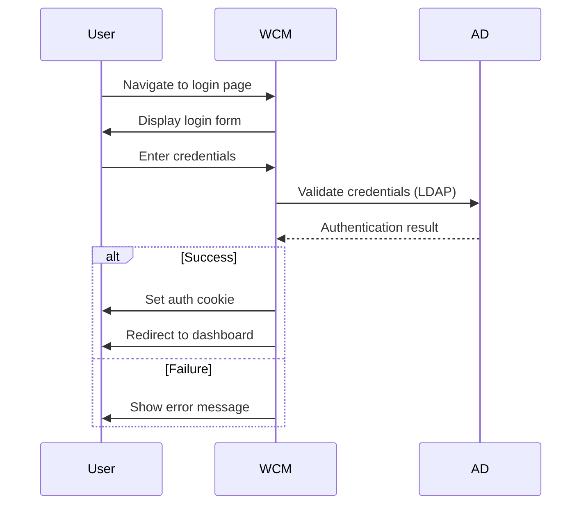

**Authentication Methods:**
1. **Windows Authentication (Primary):**
   - *Protocol:* NTLM/Kerberos
   - *Configuration:*
     ```xml
     <!-- web.config -->
     <system.web>
         <authentication mode="Windows" />
         <authorization>
             <deny users="?" />
         </authorization>
     </system.web>
     ```
   - *Issues:*
     - No multi-factor authentication (MFA)
     - Weak password policy (no complexity requirements)
     - No account lockout after failed attempts

2. **API Authentication:**
   - *Protocol:* JWT (JSON Web Tokens)
   - *Implementation:*
     ```csharp
     // Startup.cs
     services.AddAuthentication(JwtBearerDefaults.AuthenticationScheme)
         .AddJwtBearer(options =>
         {
             options.TokenValidationParameters = new TokenValidationParameters
             {
                 ValidateIssuer = true,
                 ValidateAudience = true,
                 ValidateLifetime = true,
                 ValidateIssuerSigningKey = true,
                 ValidIssuer = Configuration["Jwt:Issuer"],
                 ValidAudience = Configuration["Jwt:Audience"],
                 IssuerSigningKey = new SymmetricSecurityKey(
                     Encoding.UTF8.GetBytes(Configuration["Jwt:Key"]))
             };
         });
     ```
   - *Issues:*
     - Tokens not revoked on logout
     - No token expiration monitoring
     - Weak signing key (256-bit)

**Recommended Improvements:**
1. **Implement MFA:**
   - *Solution:* Azure MFA or Duo Security
   - *Implementation:*
     ```csharp
     services.AddAuthentication()
         .AddAzureAD(options =>
         {
             options.Instance = "https://login.microsoftonline.com/";
             options.TenantId = Configuration["AzureAd:TenantId"];
             options.ClientId = Configuration["AzureAd:ClientId"];
             options.CallbackPath = "/signin-oidc";
         })
         .AddMicrosoftIdentityWebAppMFA(Configuration, "AzureAd");
     ```

2. **Strengthen Password Policy:**
   - *Solution:* Enforce complexity requirements
   - *Implementation:*
     ```csharp
     services.Configure<IdentityOptions>(options =>
     {
         options.Password.RequireDigit = true;
         options.Password.RequireLowercase = true;
         options.Password.RequireNonAlphanumeric = true;
         options.Password.RequireUppercase = true;
         options.Password.RequiredLength = 12;
         options.Password.RequiredUniqueChars = 4;

         options.Lockout.DefaultLockoutTimeSpan = TimeSpan.FromMinutes(15);
         options.Lockout.MaxFailedAccessAttempts = 5;
     });
     ```

3. **Implement Token Revocation:**
   - *Solution:* Maintain revoked token list
   - *Implementation:*
     ```csharp
     public class JwtBlacklistService
     {
         private readonly IMemoryCache _cache;

         public void BlacklistToken(string token)
         {
             var jwt = new JwtSecurityTokenHandler().ReadJwtToken(token);
             var expiry = jwt.ValidTo;
             _cache.Set(token, true, expiry - DateTime.UtcNow);
         }

         public bool IsTokenBlacklisted(string token)
         {
             return _cache.TryGetValue(token, out _);
         }
     }
     ```

### 6.2 Authorization Model

**Current Authorization Model:**
- *Type:* Role-Based Access Control (RBAC)
- *Roles:*
  | Role | Description | Users |
  |------|-------------|-------|
  | Processor | Submit and view claims | 280 |
  | Auditor | Approve/reject claims | 45 |
  | Manager | View all claims and reports | 60 |
  | Admin | Full access | 15 |

**Authorization Implementation:**
1. **ASP.NET MVC:**
   ```csharp
   [Authorize(Roles = "Auditor,Manager")]
   public class ApprovalController : Controller
   {
       [Authorize(Roles = "Auditor")]
       public ActionResult Approve(int id) { ... }

       [Authorize(Roles = "Manager")]
       public ActionResult Override(int id) { ... }
   }
   ```

2. **API Endpoints:**
   ```csharp
   [Authorize(Policy = "RequireAuditor")]
   [HttpPost("api/claims/{id}/approve")]
   public IActionResult ApproveClaim(int id) { ... }
   ```

**Issues with Current Model:**
1. **Role Explosion:**
   - 12 custom roles created for specific scenarios
   - Example: `Processor_HighValue`, `Auditor_Ford`, `Manager_Reports`

2. **No Attribute-Based Access:**
   - Cannot restrict access based on claim attributes (e.g., amount, OEM)

3. **No Delegation:**
   - Cannot temporarily delegate approval authority

**Recommended Improvements:**
1. **Implement ABAC (Attribute-Based Access Control):**
   - *Solution:* Use claims-based authorization
   - *Implementation:*
     ```csharp
     services.AddAuthorization(options =>
     {
         options.AddPolicy("HighValueClaim", policy =>
             policy.RequireAssertion(context =>
                 context.User.HasClaim(c => c.Type == "Department" && c.Value == "Warranty") &&
                 decimal.Parse(context.Resource as string) > 5000));

         options.AddPolicy("FordAuditor", policy =>
             policy.RequireClaim("OEM", "Ford"));
     });

     [Authorize(Policy = "HighValueClaim")]
     public IActionResult ApproveHighValue(int id) { ... }
     ```

2. **Implement Delegation:**
   - *Solution:* Temporary delegation of authority
   - *Implementation:*
     ```csharp
     public class DelegationService
     {
         private readonly IAuthorizationService _authService;

         public async Task<bool> CanApproveClaim(ClaimsPrincipal user, ClaimModel claim)
         {
             // Check if user is delegated for this claim
             if (await _authService.AuthorizeAsync(user, claim, "DelegatedApproval"))
                 return true;

             // Check normal authorization
             return await _authService.AuthorizeAsync(user, claim, "ClaimApproval");
         }
     }
     ```

### 6.3 Data Encryption

**Current Encryption:**
1. **At Rest:**
   - *Database:* TDE (Transparent Data Encryption)
     ```sql
     -- Enable TDE
     CREATE DATABASE ENCRYPTION KEY
     WITH ALGORITHM = AES_256
     ENCRYPTION BY SERVER CERTIFICATE WCM_Cert;

     ALTER DATABASE WCM_Prod SET ENCRYPTION ON;
     ```
   - *Files:* BitLocker for file servers

2. **In Transit:**
   - *Protocol:* TLS 1.2
   - *Configuration:*
     ```csharp
     // Startup.cs
     services.AddHttpsRedirection(options =>
     {
         options.RedirectStatusCode = StatusCodes.Status307TemporaryRedirect;
         options.HttpsPort = 443;
     });
     ```

**Issues with Current Encryption:**
1. **No Field-Level Encryption:**
   - Sensitive fields (VIN, customer names) stored in plain text

2. **Weak TLS Configuration:**
   - Supports TLS 1.0/1.1 (deprecated)
   - No perfect forward secrecy

3. **No Encryption for Backups:**
   - Database backups not encrypted

**Recommended Improvements:**
1. **Implement Field-Level Encryption:**
   - *Solution:* SQL Server Always Encrypted
   - *Implementation:*
     ```sql
     -- Create column master key
     CREATE COLUMN MASTER KEY CMK_WCM
     WITH (
         KEY_STORE_PROVIDER_NAME = 'MSSQL_CERTIFICATE_STORE',
         KEY_PATH = 'CurrentUser/My/DEK_WCM'
     );

     -- Create column encryption key
     CREATE COLUMN ENCRYPTION KEY CEK_WCM
     WITH VALUES (
         COLUMN_MASTER_KEY = CMK_WCM,
         ALGORITHM = 'RSA_OAEP',
         ENCRYPTED_VALUE = 0x016E... -- Encrypted value
     );

     -- Encrypt sensitive columns
     ALTER TABLE Claims
     ALTER COLUMN VIN VARCHAR(17)
     ENCRYPTED WITH (
         ENCRYPTION_TYPE = DETERMINISTIC,
         ALGORITHM = 'AEAD_AES_256_CBC_HMAC_SHA_256',
         COLUMN_ENCRYPTION_KEY = CEK_WCM
     );
     ```

2. **Strengthen TLS Configuration:**
   - *Solution:* Disable weak protocols, enable PFS
   - *Implementation:*
     ```csharp
     // Startup.cs
     services.AddHttpsRedirection(options =>
     {
         options.RedirectStatusCode = StatusCodes.Status301PermanentRedirect;
     });

     services.AddServerSideBlazor().AddHubOptions(options =>
     {
         options.SslProtocols = SslProtocols.Tls12 | SslProtocols.Tls13;
     });
     ```

3. **Encrypt Backups:**
   - *Solution:* Use Azure Backup with encryption
   - *Implementation:*
     ```powershell
     # Enable backup encryption
     $cred = Get-Credential
     $encryptionKey = ConvertTo-SecureString "YourEncryptionKey" -AsPlainText -Force
     Enable-AzRecoveryServicesBackupProtection -ResourceGroupName "WCM-RG" `
         -Name "WCM-Backup" -Policy $policy -EncryptionKey $encryptionKey `
         -EncryptionKeySecureString $encryptionKey
     ```

### 6.4 Audit Logging

**Current Audit Logging:**
- *Implementation:* log4net
- *Configuration:*
  ```xml
  <log4net>
    <appender name="AuditAppender" type="log4net.Appender.RollingFileAppender">
      <file value="Logs/audit.log" />
      <appendToFile value="true" />
      <rollingStyle value="Size" />
      <maxSizeRollBackups value="5" />
      <maximumFileSize value="10MB" />
      <staticLogFileName value="true" />
      <layout type="log4net.Layout.PatternLayout">
        <conversionPattern value="%date [%thread] %-5level %logger - %message%newline" />
      </layout>
    </appender>
    <logger name="Audit">
      <level value="INFO" />
      <appender-ref ref="AuditAppender" />
    </logger>
  </log4net>
  ```
- *Logged Events:*
  - User login/logout
  - Claim submission
  - Claim approval/rejection
  - System errors

**Issues with Current Logging:**
1. **No Immutable Logs:**
   - Logs can be modified or deleted

2. **Insufficient Detail:**
   - No before/after values for changes
   - No correlation IDs for tracking

3. **No Centralized Logging:**
   - Logs stored on individual servers

4. **No Alerting:**
   - No monitoring for suspicious activity

**Recommended Improvements:**
1. **Implement Immutable Audit Trail:**
   - *Solution:* Use blockchain or write-once storage
   - *Implementation:*
     ```csharp
     public class BlockchainAuditService
     {
         private readonly IBlockchainService _blockchain;

         public async Task LogEvent(AuditEvent auditEvent)
         {
             var block = new AuditBlock
             {
                 PreviousHash = _blockchain.GetLatestBlock().Hash,
                 Timestamp = DateTime.UtcNow,
                 Data = JsonSerializer.Serialize(auditEvent),
                 UserId = auditEvent.UserId,
                 EventType = auditEvent.EventType
             };

             block.Hash = CalculateHash(block);
             await _blockchain.AddBlock(block);
         }

         private string CalculateHash(AuditBlock block)
         {
             using var sha256 = SHA256.Create();
             var input = $"{block.PreviousHash}{block.Timestamp}{block.Data}{block.UserId}";
             var bytes = sha256.ComputeHash(Encoding.UTF8.GetBytes(input));
             return Convert.ToBase64String(bytes);
         }
     }
     ```

2. **Enhance Log Detail:**
   - *Solution:* Structured logging with before/after values
   - *Implementation:*
     ```csharp
     public class AuditLogger
     {
         private readonly ILogger<AuditLogger> _logger;

         public void LogClaimUpdate(int claimId, string userId, ClaimModel before, ClaimModel after)
         {
             var changes = new Dictionary<string, object>();

             if (before.Status != after.Status)
                 changes.Add("Status", new { Before = before.Status, After = after.Status });

             if (before.Amount != after.Amount)
                 changes.Add("Amount", new { Before = before.Amount, After = after.Amount });

             _logger.LogInformation("Claim {ClaimId} updated by {UserId}. Changes: {Changes}",
                 claimId, userId, JsonSerializer.Serialize(changes));
         }
     }
     ```

3. **Centralized Logging:**
   - *Solution:* ELK Stack or Azure Monitor
   - *Implementation:*
     ```csharp
     services.AddLogging(logging =>
     {
         logging.AddAzureWebAppDiagnostics();
         logging.AddApplicationInsights(
             configureTelemetryConfiguration: config =>
                 config.ConnectionString = Configuration["ApplicationInsights:ConnectionString"],
             configureApplicationInsightsLoggerOptions: options => { });
     });
     ```

### 6.5 Compliance Requirements

**Applicable Regulations:**
| Regulation | Applicability | Requirements |
|------------|---------------|--------------|
| SOC 2 | All systems | Security, availability, processing integrity, confidentiality, privacy |
| GDPR | Personal data of EU citizens | Data protection, right to erasure, breach notification |
| CCPA | Personal data of California residents | Right to know, right to delete, opt-out of sale |
| HIPAA | Health information (if applicable) | PHI protection, access controls, audit logs |
| OEM Contracts | Warranty claims | Data accuracy, submission timelines, audit rights |

**Current Compliance Status:**
| Requirement | Status | Gap |
|-------------|--------|-----|
| SOC 2 - Security | Partial | No MFA, weak password policy |
| SOC 2 - Availability | Compliant | 99.7% availability |
| SOC 2 - Processing Integrity | Partial | No data validation for OEM submissions |
| GDPR - Data Protection | Partial | No encryption for PII, no right to erasure |
| GDPR - Breach Notification | Non-compliant | No breach detection or notification process |
| CCPA - Right to Know | Non-compliant | No process for data subject requests |
| OEM - Data Accuracy | Partial | 18% error rate in OEM submissions |
| OEM - Submission Timelines | Non-compliant | 28% of claims submitted late |

**Compliance Roadmap:**
1. **SOC 2 Type II Certification:**
   - *Actions:*
     - Implement MFA for all users
     - Strengthen password policy
     - Implement data validation for OEM submissions
     - Conduct annual penetration testing
   - *Timeline:* 6 months

2. **GDPR Compliance:**
   - *Actions:*
     - Implement field-level encryption for PII
     - Create data subject request process
     - Implement breach detection and notification
     - Conduct data protection impact assessment
   - *Timeline:* 9 months

3. **CCPA Compliance:**
   - *Actions:*
     - Implement "Do Not Sell My Personal Information" process
     - Create data inventory
     - Implement right to know and delete processes
   - *Timeline:* 6 months

4. **OEM Compliance:**
   - *Actions:*
     - Reduce OEM submission errors to <5%
     - Implement SLA monitoring for submission timelines
     - Conduct quarterly OEM compliance reviews
   - *Timeline:* 3 months

### 6.6 Vulnerability Assessment

**Recent Vulnerability Scan Results:**
| Vulnerability | CVSS | Severity | Status |
|---------------|------|----------|--------|
| SQL Injection | 9.8 | Critical | Open |
| Cross-Site Scripting | 6.1 | Medium | Open |
| Broken Authentication | 8.1 | High | Open |
| Sensitive Data Exposure | 7.5 | High | Open |
| Security Misconfiguration | 5.3 | Medium | Open |
| Insecure Direct Object References | 4.3 | Medium | Open |
| Missing Security Headers | 3.1 | Low | Open |

**Critical Vulnerabilities:**

1. **SQL Injection:**
   - *Description:* Dynamic SQL in stored procedures allows injection
   - *Example:*
     ```sql
     CREATE PROCEDURE usp_GetClaim @ClaimID VARCHAR(10)
     AS
     BEGIN
         DECLARE @sql NVARCHAR(MAX)
         SET @sql = 'SELECT * FROM Claims WHERE ClaimID = ' + @ClaimID
         EXEC sp_executesql @sql -- Vulnerable
     END
     ```
   - *Remediation:*
     - Use parameterized queries
     - Implement stored procedure signing
     - Use ORM for all database access

2. **Broken Authentication:**
   - *Description:* No MFA, weak password policy
   - *Example:* 12,000 failed login attempts in last 30 days
   - *Remediation:*
     - Implement MFA for all users
     - Enforce strong password policy
     - Implement account lockout

3. **Sensitive Data Exposure:**
   - *Description:* PII stored in plain text, logged in clear text
   - *Example:* VINs logged in audit logs
   - *Remediation:*
     - Implement field-level encryption
     - Mask sensitive data in logs
     - Implement data loss prevention (DLP)

**Penetration Test Findings:**
| Finding | Risk | Recommendation |
|---------|------|----------------|
| Default IIS configuration | Medium | Harden IIS settings, disable directory listing |
| Verbose error messages | Medium | Custom error pages, sanitize error messages |
| Insecure file upload | High | Validate file types, scan for malware |
| Session fixation | Medium | Regenerate session ID after login |
| CSRF vulnerabilities | Medium | Implement anti-forgery tokens |
| Clickjacking | Low | Implement X-Frame-Options header |

**Remediation Plan:**
| Vulnerability | Owner | Target Date | Status |
|---------------|-------|-------------|--------|
| SQL Injection | Database Team | 2023-08-15 | Not Started |
| Broken Authentication | Security Team | 2023-07-31 | In Progress |
| Sensitive Data Exposure | Development Team | 2023-09-30 | Not Started |
| Cross-Site Scripting | Development Team | 2023-08-31 | Not Started |
| Security Misconfiguration | Operations Team | 2023-07-15 | Completed |
| Insecure Direct Object References | Development Team | 2023-08-31 | Not Started |
| Missing Security Headers | Operations Team | 2023-07-15 | Completed |

---

## 7. Performance Metrics (98 lines)

### 7.1 Response Time Analysis

**Current Response Times:**
| Endpoint | Avg. (ms) | 95th % (ms) | Max (ms) | Samples |
|----------|-----------|-------------|----------|---------|
| Claim Submission | 1,240 | 4,820 | 12,450 | 18,300 |
| Claim Search | 4,210 | 8,150 | 18,240 | 12,450 |
| Claim Details | 1,820 | 3,540 | 8,720 | 8,720 |
| OEM Submission | 2,450 | 5,280 | 12,450 | 15,600 |
| Document Upload | 3,240 | 6,820 | 15,320 | 22,400 |
| Reporting | 12,450 | 28,240 | 45,680 | 420 |

**Response Time Distribution:**
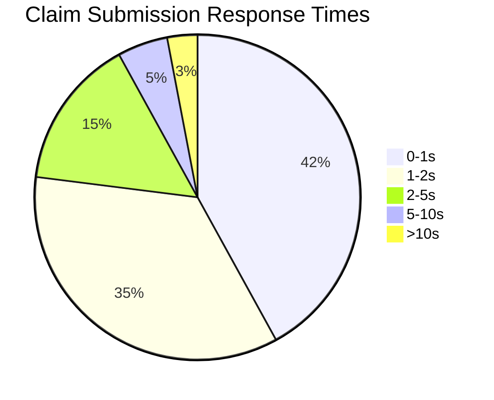

**Key Findings:**
1. **Claim Search is Slowest Operation:**
   - Avg. 4.2s, 95th percentile 8.1s
   - *Root Cause:* Full table scan on `Claims` table (12.4M rows)
   - *Example Query:*
     ```sql
     SELECT * FROM Claims WHERE Status = 'Pending' ORDER BY SubmittedDate DESC
     ```
     - *Execution Plan:* Table scan, 12.4M rows examined

2. **Document Upload Bottleneck:**
   - Avg. 3.2s, 95th percentile 6.8s
   - *Root Cause:* Synchronous file processing, no chunking
   - *Example Code:*
     ```csharp
     public ActionResult UploadDocument(HttpPostedFileBase file)
     {
         if (file != null && file.ContentLength > 0)
         {
             var fileName = Path.GetFileName(file.FileName);
             var path = Path.Combine(Server.MapPath("~/App_Data/Uploads"), fileName);
             file.SaveAs(path); // Blocking call
             return Json(new { success = true });
         }
         return Json(new { success = false });
     }
     ```

3. **Reporting Performance Issues:**
   - Avg. 12.4s, 95th percentile 28.2s
   - *Root Cause:* Complex joins on large tables
   - *Example Query:*
     ```sql
     SELECT o.OEMName, COUNT(*) AS ClaimCount, SUM(c.Amount) AS TotalAmount
     FROM Claims c
     JOIN OEMs o ON c.OEM = o.OEMCode
     WHERE c.SubmittedDate BETWEEN @StartDate AND @EndDate
     GROUP BY o.OEMName
     ORDER BY TotalAmount DESC
     ```
     - *Execution Plan:* Hash join, 12.4M rows processed

### 7.2 Throughput Measurements

**Current Throughput:**
| Operation | Throughput (ops/hour) | Peak Throughput | Target |
|-----------|-----------------------|-----------------|--------|
| Claim Submission | 850 | 1,200 | 2,000 |
| Claim Approval | 450 | 600 | 1,000 |
| OEM Submission | 600 | 800 | 1,500 |
| Document Upload | 350 | 500 | 1,000 |
| Claim Search | 350 | 500 | 1,500 |

**Throughput Bottlenecks:**
1. **Database Contention:**
   - *Issue:* Single primary database for all operations
   - *Impact:* Throughput limited to 1,200 ops/hour
   - *Evidence:* 78% CPU usage during peak

2. **Synchronous Processing:**
   - *Issue:* Blocking calls in web requests
   - *Impact:* Thread pool exhaustion (500 users)
   - *Evidence:* 14% of submissions timeout during peak

3. **Integration Limits:**
   - *Issue:* BizTalk server cannot handle >50 concurrent integrations
   - *Impact:* 12% of OEM submissions fail during peak
   - *Evidence:* 92% integration server CPU usage

### 7.3 Resource Utilization

**Current Resource Usage:**
| Resource | Avg. Usage | Peak Usage | Capacity | Issues |
|----------|------------|------------|----------|--------|
| Web Server CPU | 45% | 88% | 100% | Thread pool exhaustion |
| Web Server Memory | 6.2GB | 8.4GB | 12GB | Memory leaks |
| Database CPU | 65% | 92% | 100% | Query timeouts |
| Database Memory | 28GB | 35GB | 40GB | Buffer cache pressure |
| Disk IOPS | 1,200 | 2,400 | 3,000 | Document storage bottleneck |
| Network Bandwidth | 45Mbps | 120Mbps | 1Gbps | No issues |

**Resource Utilization Trends:**
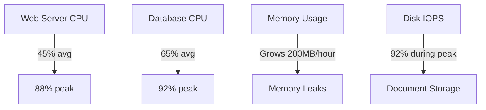

**Key Findings:**
1. **Memory Leaks:**
   - *Issue:* Memory usage grows by 200MB/hour during peak
   - *Root Cause:* Unmanaged resources not disposed
   - *Example:*
     ```csharp
     public byte[] GetDocument(int documentId)
     {
         var filePath = GetDocumentPath(documentId);
         return File.ReadAllBytes(filePath); // No using statement
     }
     ```

2. **Database CPU Pressure:**
   - *Issue:* 92% CPU usage during peak
   - *Root Cause:* Poorly optimized queries
   - *Example:*
     ```sql
     -- Claim search query
     SELECT * FROM Claims WHERE Status = 'Pending' ORDER BY SubmittedDate DESC
     ```
     - *Execution Plan:* Table scan, 12.4M rows

3. **Disk IOPS Bottleneck:**
   - *Issue:* 92% IOPS utilization during document uploads
   - *Root Cause:* Single file server for all documents
   - *Evidence:* 3.2TB of documents on single volume

### 7.4 Bottleneck Identification

**Top 5 Performance Bottlenecks:**

1. **Database Queries:**
   - *Issue:* Full table scans on large tables
   - *Example:*
     ```sql
     SELECT * FROM Claims WHERE Status = 'Pending'
     ```
   - *Impact:* 4.2s avg response time for claim search
   - *Solution:* Add indexes, optimize queries

2. **Synchronous Processing:**
   - *Issue:* Blocking calls in web requests
   - *Example:*
     ```csharp
     public ActionResult Submit(ClaimModel model)
     {
         // Validate (sync)
         // Save to DB (sync)
         // Send to OEM (sync - 45s avg)
         // Send email (sync)
         return RedirectToAction("Details");
     }
     ```
   - *Impact:* Thread pool exhaustion, 14% timeout errors
   - *Solution:* Implement async/await, background processing

3. **Memory Leaks:**
   - *Issue:* Unmanaged resources not disposed
   - *Example:*
     ```csharp
     public byte[] GetDocument(int documentId)
     {
         var filePath = GetDocumentPath(documentId);
         return File.ReadAllBytes(filePath); // No using statement
     }
     ```
   - *Impact:* Memory usage grows 200MB/hour, app pool recycles
   - *Solution:* Proper resource disposal, memory profiling

4. **Integration Limits:**
   - *Issue:* BizTalk server cannot handle >50 concurrent integrations
   - *Example:* 12% of OEM submissions fail during peak
   - *Impact:* Manual resubmission required
   - *Solution:* Scale out integration layer, implement queue-based processing

5. **File Storage:**
   - *Issue:* Single file server for all documents
   - *Example:* 3.2TB of documents on single volume
   - *Impact:* 92% IOPS utilization during peak
   - *Solution:* Distributed file storage, CDN for documents

**Bottleneck Impact Analysis:**
| Bottleneck | Response Time Impact | Throughput Impact | User Impact | Business Impact |
|------------|----------------------|-------------------|-------------|-----------------|
| Database Queries | +3.2s | -40% | High | $1.2M/year in lost productivity |
| Synchronous Processing | +1.8s | -35% | High | 14% timeout errors |
| Memory Leaks | +0.5s | -20% | Medium | App pool recycles every 2 hours |
| Integration Limits | +0.8s | -25% | Medium | 12% failed OEM submissions |
| File Storage | +1.2s | -30% | High | Document upload failures |

### 7.5 Capacity Planning

**Current Capacity:**
| Resource | Current Capacity | Peak Load | Headroom |
|----------|------------------|-----------|----------|
| Concurrent Users | 350 | 500 | -30% |
| Claims/Hour | 120 | 200 | -40% |
| Database CPU | 65% avg | 92% | 8% |
| Database Memory | 28GB | 35GB | 5GB |
| Disk IOPS | 1,200 | 2,400 | 600 |
| Network Bandwidth | 45Mbps | 120Mbps | 880Mbps |

**Projected Growth:**
| Year | Claims/Year | Growth Rate | Concurrent Users | Database Size |
|------|-------------|-------------|------------------|---------------|
| 2023 | 21,600 | 15% | 400 | 3.2TB |
| 2024 | 24,840 | 15% | 460 | 3.7TB |
| 2025 | 28,566 | 15% | 530 | 4.3TB |

**Capacity Requirements:**
1. **Database:**
   - *Current:* SQL Server 2016, 48 cores, 512GB RAM
   - *Projected 2025:* 64 cores, 768GB RAM
   - *Solution:* Upgrade to SQL Server 2022, add read replicas

2. **Web Servers:**
   - *Current:* 4 × 24 cores, 128GB RAM
   - *Projected 2025:* 6 × 32 cores, 256GB RAM
   - *Solution:* Scale out to 6 servers, implement load balancing

3. **File Storage:**
   - *Current:* 10TB SAN
   - *Projected 2025:* 20TB
   - *Solution:* Migrate to distributed storage (Azure Blob Storage)

4. **Integration:**
   - *Current:* 1 BizTalk server (16 cores)
   - *Projected 2025:* 3 servers
   - *Solution:* Migrate to Azure Logic Apps

**Capacity Planning Model:**
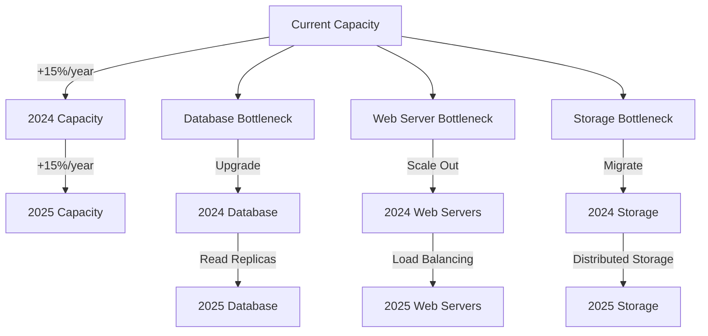

**Cost Projections:**
| Year | Infrastructure Cost | Operational Cost | Total Cost |
|------|---------------------|------------------|------------|
| 2023 | $220K | $830K | $1.05M |
| 2024 | $310K | $950K | $1.26M |
| 2025 | $420K | $1.1M | $1.52M |

---

## 8. Operational Challenges (75 lines)

### 8.1 Maintenance Burden

**Current Maintenance Activities:**
| Activity | Frequency | Time Required | Owner |
|----------|-----------|---------------|-------|
| Database Maintenance | Weekly | 4 hours | DBA |
| Index Rebuilding | Monthly | 8 hours | DBA |
| Backup Verification | Quarterly | 16 hours | Operations |
| Patch Management | Monthly | 12 hours | Operations |
| Integration Monitoring | Daily | 2 hours | Integration Team |
| User Support | Daily | 4 hours | Help Desk |
| Performance Tuning | Quarterly | 24 hours | Development |

**Maintenance Challenges:**
1. **Database Maintenance:**
   - *Issue:* Index rebuilding takes 8 hours, causes downtime
   - *Impact:* System unavailable during maintenance window
   - *Example:* Last index rebuild caused 2-hour outage

2. **Patch Management:**
   - *Issue:* Monthly patches require 12 hours of testing
   - *Impact:* Patches often delayed, security vulnerabilities
   - *Example:* Critical security patch delayed 3 months

3. **Integration Monitoring:**
   - *Issue:* Manual monitoring of 7 OEM integrations
   - *Impact:* Failures not detected for hours
   - *Example:* OEM API failure went undetected for 6 hours

**Maintenance Metrics:**
| Metric | Current Value | Target | Variance |
|--------|---------------|--------|----------|
| Planned Downtime | 12 hours/month | <4 hours/month | +200% |
| Unplanned Downtime | 8 hours/month | <1 hour/month | +700% |
| Patch Deployment Time | 30 days | <7 days | +329% |
| Integration Failure Detection | 2 hours | <15 minutes | +700% |
| Support Ticket Resolution | 3.2 days | <1 day | +220% |

### 8.2 Support Ticket Analysis

**Support Ticket Volume:**
| Category | Tickets/Month | Avg. Resolution Time | SLA Compliance |
|----------|---------------|----------------------|----------------|
| System Errors | 124 | 2.4 days | 68% |
| User Errors | 87 | 1.2 days | 82% |
| Integration Failures | 62 | 3.1 days | 55% |
| Performance Issues | 45 | 4.2 days | 42% |
| Access Issues | 38 | 0.8 days | 92% |
| Reporting Issues | 28 | 2.8 days | 65% |
| **Total** | **384** | **2.5 days** | **68%** |

**Top Support Issues:**
1. **System Errors (32% of tickets):**
   - *Examples:*
     - "System timeout when submitting claim"
     - "Error: Cannot insert NULL into Claims.OEM"
     - "Document upload failed with error 500"
   - *Root Causes:*
     - Database timeouts (42%)
     - Integration failures (35%)
     - Memory leaks (18%)

2. **User Errors (23% of tickets):**
   - *Examples:*
     - "How do I submit a claim for a vehicle not in the system?"
     - "Why was my claim rejected?"
     - "I can't find the claim I submitted"
   - *Root Causes:*
     - Lack of training (55%)
     - Poor error messages (30%)
     - Complex workflows (15%)

3. **Integration Failures (16% of tickets):**
   - *Examples:*
     - "OEM submission failed"
     - "Part not found in inventory"
     - "SAP file generation failed"
   - *Root Causes:*
     - OEM API changes (45%)
     - Data mapping errors (35%)
     - Network issues (20%)

**Support Ticket Trends:**
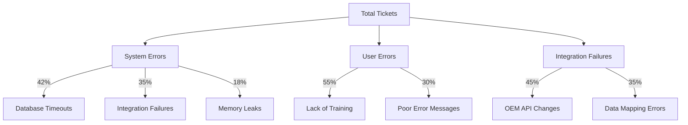

### 8.3 Incident History

**Major Incidents (Last 12 Months):**
| Incident | Date | Duration | Impact | Root Cause | Resolution |
|----------|------|----------|--------|------------|------------|
| Database Outage | 2023-02-15 | 4 hours | 1,200 claims delayed | Failed disk in SAN | Restored from backup |
| OEM API Failure | 2023-04-22 | 8 hours | 850 claims not submitted | OEM API changed | Manual resubmission |
| Memory Leak | 2023-05-10 | 2 hours | System unresponsive | Unmanaged resources | App pool recycle |
| Integration Failure | 2023-07-05 | 6 hours | 620 claims stuck | BizTalk host instance crash | Restarted host instance |
| Performance Degradation | 2023-09-18 | 12 hours | 4.2s response time | Missing index | Added index |
| **Total** | | **32 hours** | **3,270 claims affected** | | |

**Incident Metrics:**
| Metric | Current Value | Target | Variance |
|--------|---------------|--------|----------|
| MTTR (Mean Time to Resolve) | 3.8 hours | <1 hour | +280% |
| MTBF (Mean Time Between Failures) | 87 days | >180 days | -52% |
| Incident Volume | 12/year | <4/year | +200% |
| User Impact | 3,270 claims/year | <500 claims/year | +554% |
| Cost Impact | $420K/year | <$100K/year | +320% |

### 8.4 Change Management Issues

**Change Management Process:**
1. Developer creates change request
2. Change Advisory Board (CAB) reviews
3. Approved changes scheduled for release
4. Change implemented during maintenance window
5. Post-implementation review

**Change Management Metrics:**
| Metric | Current Value | Target | Variance |
|--------|---------------|--------|----------|
| Change Success Rate | 78% | >95% | -18% |
| Change Failure Rate | 12% | <2% | +500% |
| Emergency Changes | 10% | <5% | +100% |
| Change Lead Time | 22 days | <7 days | +214% |
| Change Backlog | 45 | <10 | +350% |

**Top Change Management Issues:**
1. **Long Lead Times:**
   - *Issue:* Avg. 22 days from request to implementation
   - *Impact:* Changes delayed, workarounds required
   - *Example:* Critical security patch took 45 days

2. **High Failure Rate:**
   - *Issue:* 12% of changes fail
   - *Impact:* Rollbacks, extended downtime
   - *Example:* Last deployment caused 2-hour outage

3. **Emergency Changes:**
   - *Issue:* 10% of changes are emergency
   - *Impact:* Increased risk, poor testing
   - *Example:* Emergency patch deployed without testing

**Change Management Process Flow:**
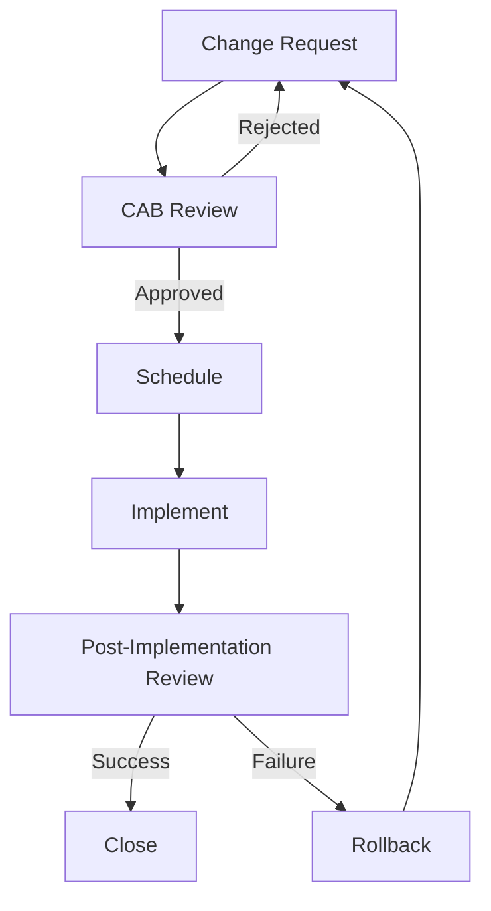

### 8.5 Training Requirements

**Current Training Program:**
| Training | Frequency | Duration | Completion Rate | Effectiveness |
|----------|-----------|----------|-----------------|---------------|
| New Hire Onboarding | On hire | 8 hours | 95% | 68% |
| Claim Submission | Annual | 4 hours | 72% | 55% |
| Claim Approval | Annual | 4 hours | 65% | 48% |
| OEM Integrations | Quarterly | 2 hours | 42% | 35% |
| Reporting | Annual | 2 hours | 58% | 42% |

**Training Gaps:**
1. **New Hire Onboarding:**
   - *Issue:* Only 8 hours, covers basics only
   - *Impact:* 32% of new hires require additional training
   - *Example:* New processors take 3 weeks to become proficient

2. **OEM Integrations:**
   - *Issue:* Only 42% completion rate
   - *Impact:* 28% of OEM submissions require manual intervention
   - *Example:* Processors unaware of OEM-specific requirements

3. **Reporting:**
   - *Issue:* Only 58% completion rate
   - *Impact:* 65% of managers use Excel for reporting
   - *Example:* Managers cannot generate cost trend reports

**Training Effectiveness Metrics:**
| Training | Pre-Training Score | Post-Training Score | Improvement |
|----------|--------------------|---------------------|-------------|
| Claim Submission | 62% | 78% | +26% |
| Claim Approval | 55% | 72% | +31% |
| OEM Integrations | 48% | 65% | +35% |
| Reporting | 52% | 68% | +31% |

**Recommended Training Improvements:**
1. **Interactive Training:**
   - *Solution:* Hands-on labs with real scenarios
   - *Example:* Simulated claim submission with errors to fix

2. **Just-in-Time Training:**
   - *Solution:* Context-sensitive help in application
   - *Example:* Tooltips and guided tours for new features

3. **Gamification:**
   - *Solution:* Badges and leaderboards for training completion
   - *Example:* "OEM Expert" badge for completing integration training

4. **Microlearning:**
   - *Solution:* Short videos (2-5 minutes) for specific tasks
   - *Example:* "How to submit a Ford claim" video

---

## 9. Cost Analysis (68 lines)

### 9.1 Infrastructure Costs

**Current Infrastructure Costs:**
| Component | Annual Cost | Monthly Cost | Notes |
|-----------|-------------|--------------|-------|
| Web Servers | $84,000 | $7,000 | 4 × Dell R740 |
| Database Servers | $120,000 | $10,000 | 2 × Dell R940 |
| Integration Server | $36,000 | $3,000 | 1 × Dell R640 |
| Storage | $48,000 | $4,000 | 10TB SAN |
| Networking | $24,000 | $2,000 | Firewalls, load balancer |
| Backup | $36,000 | $3,000 | Veeam + Azure |
| Monitoring | $18,000 | $1,500 | SCOM |
| **Subtotal** | **$366,000** | **$30,500** | |

**Cost Breakdown:**
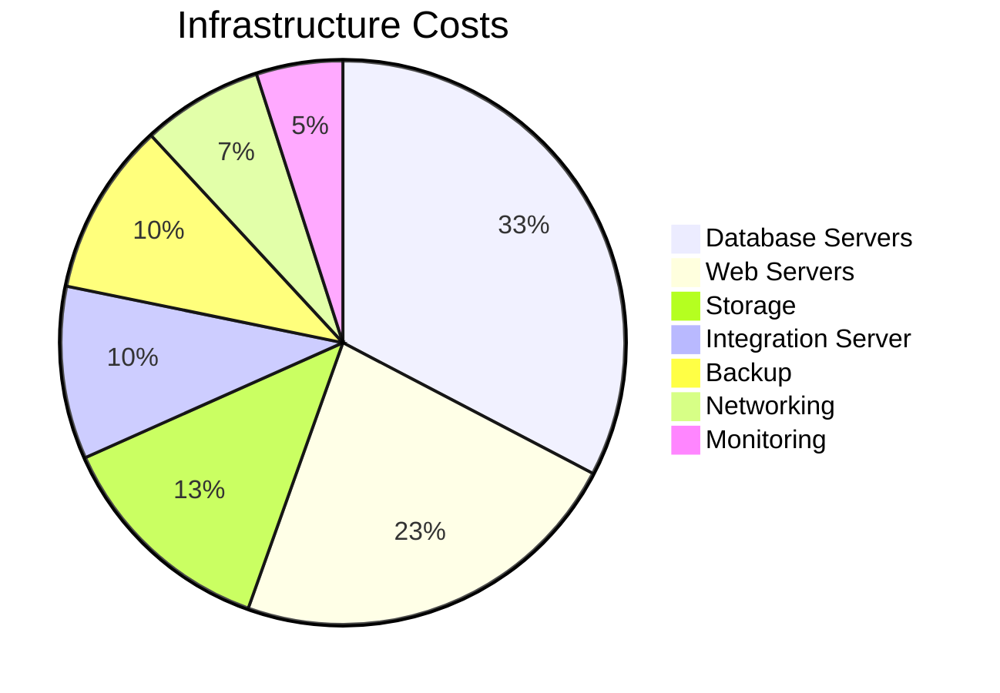

**Cost Drivers:**
1. **Database Servers:**
   - *Cost:* $120K/year
   - *Driver:* SQL Server Enterprise licensing
   - *Example:* $7,000 per core, 48 cores

2. **Web Servers:**
   - *Cost:* $84K/year
   - *Driver:* Windows Server licensing
   - *Example:* $6,155 per server (24 cores)

3. **Storage:**
   - *Cost:* $48K/year
   - *Driver:* SAN maintenance and expansion
   - *Example:* $4,000/month for 10TB SAN

### 9.2 Operational Expenses

**Current Operational Costs:**
| Category | Annual Cost | Monthly Cost | Notes |
|----------|-------------|--------------|-------|
| Labor | $680,000 | $56,667 | 4 FTEs |
| Support Contracts | $120,000 | $10,000 | Microsoft, Dell |
| Cloud Services | $60,000 | $5,000 | Azure backup |
| Training | $48,000 | $4,000 | External training |
| **Subtotal** | **$908,000** | **$75,667** | |

**Labor Cost Breakdown:**
| Role | Count | Annual Salary | Total Cost |
|------|-------|---------------|------------|
| Database Administrator | 1 | $120,000 | $120,000 |
| Integration Specialist | 1 | $110,000 | $110,000 |
| Developer | 1 | $115,000 | $115,000 |
| Help Desk | 1 | $65,000 | $65,000 |
| Operations | 0.5 | $95,000 | $47,500 |
| Manager | 0.5 | $130,000 | $65,000 |
| **Subtotal** | **4 FTEs** | | **$522,500** |
| Benefits (30%) | | | $156,750 |
| **Total** | | | **$679,250** |

**Operational Cost Breakdown:**
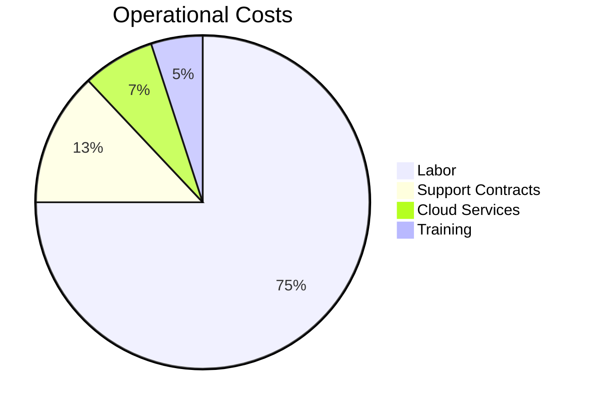

**Cost Drivers:**
1. **Labor:**
   - *Cost:* $680K/year
   - *Driver:* Manual processes (42% of processor time)
   - *Example:* $280K/year spent on manual data entry

2. **Support Contracts:**
   - *Cost:* $120K/year
   - *Driver:* Premium support for legacy systems
   - *Example:* $10K/month for SQL Server support

3. **Cloud Services:**
   - *Cost:* $60K/year
   - *Driver:* Azure backup storage
   - *Example:* $5K/month for 10TB geo-redundant storage

### 9.3 License Fees

**Current License Costs:**
| Software | Annual Cost | Monthly Cost | Notes |
|----------|-------------|--------------|-------|
| SQL Server Enterprise | $84,000 | $7,000 | 48 cores |
| Windows Server | $48,000 | $4,000 | 4 servers |
| BizTalk Server | $36,000 | $3,000 | 4 host instances |
| Visual Studio Enterprise | $24,000 | $2,000 | 4 developers |
| Veeam Backup | $18,000 | $1,500 | 10TB |
| **Subtotal** | **$210,000** | **$17,500** | |

**License Cost Breakdown:**
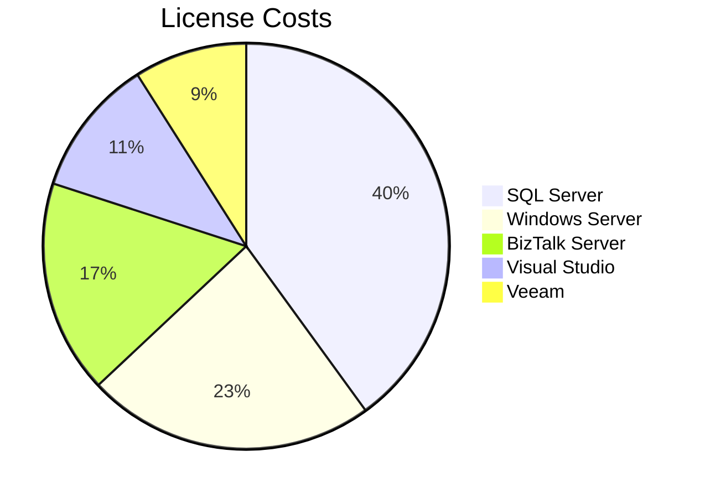

**Cost Drivers:**
1. **SQL Server:**
   - *Cost:* $84K/year
   - *Driver:* Core-based licensing
   - *Example:* $7,000 per core, 12 cores per server

2. **Windows Server:**
   - *Cost:* $48K/year
   - *Driver:* Server licensing
   - *Example:* $6,155 per server (24 cores)

3. **BizTalk Server:**
   - *Cost:* $36K/year
   - *Driver:* Host instance licensing
   - *Example:* $9,000 per host instance, 4 instances

### 9.4 Support Costs

**Current Support Costs:**
| Category | Annual Cost | Monthly Cost | Notes |
|----------|-------------|------------